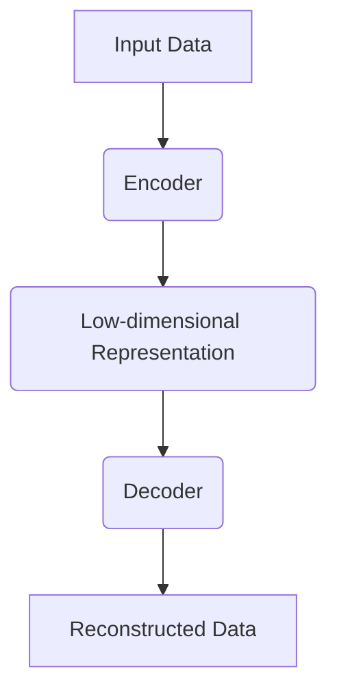

                 

关键词：自动编码器、神经网络、数据压缩、特征学习、反卷积、深度学习

> 摘要：本文将深入探讨自动编码器（Autoencoder）的基本原理、架构设计、数学模型及具体实现。通过对实际代码实例的分析，我们将理解自动编码器在数据压缩、特征提取及降维中的应用，并展望其在深度学习领域的未来发展趋势。

## 1. 背景介绍

自动编码器（Autoencoder）是深度学习领域中的一个重要构建模块，它起源于自组织映射（SOM）和非线性统计模型。自动编码器的初衷是为了学习和发现数据中的隐藏结构和特征，从而实现数据压缩、特征提取和降维等功能。随着深度学习技术的不断进步，自动编码器逐渐演变为一种强大的工具，广泛应用于图像处理、自然语言处理、语音识别等众多领域。

自动编码器的工作机制类似于一个“无监督的编码器-解码器”系统。编码器部分负责将输入数据压缩为一个较低维度的向量表示，解码器则尝试重构原始数据。通过训练，自动编码器能够学会将输入数据映射到其低维表示上，同时保持数据的关键信息，实现数据的降维和特征提取。

## 2. 核心概念与联系

### 自动编码器的基本架构

自动编码器通常由两部分组成：编码器（Encoder）和解码器（Decoder）。编码器负责将输入数据压缩成一个较低维度的表示，解码器则试图从这一表示中重构原始数据。其基本架构如下图所示：



在这个架构中，编码器和解码器的输入输出是相同的，但是它们的内部结构是不同的。编码器通常由多个隐藏层组成，每一层都通过一个非线性激活函数（如ReLU）对输入数据进行压缩。解码器则从低维表示开始，通过逆操作逐步重建原始数据。

### 自动编码器的学习过程

自动编码器的学习过程主要包括以下几个步骤：

1. **初始化权重**：随机初始化编码器和解码器的权重。
2. **前向传播**：输入数据通过编码器压缩成一个低维表示，然后传递给解码器。
3. **后向传播**：计算重构误差（通常使用均方误差MSE），然后通过梯度下降更新编码器和解码器的权重。
4. **重复迭代**：重复上述步骤，直到网络收敛。

### 自动编码器与主成分分析（PCA）的对比

自动编码器与主成分分析（PCA）在数据降维方面有相似之处，但它们也有显著的不同：

- **目标不同**：PCA的目标是找到数据的主要成分，自动编码器则是学习一种数据表示，以最小化重构误差。
- **方法不同**：PCA是一种线性方法，而自动编码器是一个非线性模型，可以学习到更复杂的非线性关系。
- **能力不同**：自动编码器不仅能够降维，还能够同时进行特征提取，而PCA只能进行降维。

## 3. 核心算法原理 & 具体操作步骤

### 3.1 算法原理概述

自动编码器通过两个主要过程实现其功能：编码和解码。

- **编码**：将输入数据通过编码器压缩到一个低维度的嵌入空间中。这个过程可以看作是一个特征提取的过程，编码器学习到了输入数据的内在结构。
- **解码**：将编码后的低维度向量通过解码器重构回原始空间。这个过程评估了编码器提取的特征对于重构原始数据的有效性。

### 3.2 算法步骤详解

1. **数据预处理**：对输入数据进行归一化处理，使其具有相似的尺度。
2. **构建编码器网络**：设计编码器的结构，包括输入层、隐藏层和输出层。隐藏层通常采用非线性激活函数。
3. **构建解码器网络**：设计解码器的结构，与编码器对称，用以重构原始数据。
4. **训练自动编码器**：
   - 前向传播：输入数据经过编码器压缩后，通过解码器重构输出。
   - 计算损失函数：通常使用均方误差（MSE）作为损失函数，衡量重构数据与原始数据之间的差异。
   - 反向传播：通过梯度下降更新编码器和解码器的权重。
5. **评估与优化**：通过验证集评估自动编码器的性能，并根据需要对模型进行调整。

### 3.3 算法优缺点

#### 优点

- **高效性**：自动编码器能够在较低维度的空间中学习和表示数据，从而加快了计算速度。
- **灵活性**：自动编码器可以适用于各种类型的数据，通过调整网络结构可以学习到不同的特征。
- **无监督学习**：自动编码器可以在没有标注数据的情况下进行训练，特别适合于新领域的探索和研究。

#### 缺点

- **过拟合**：自动编码器容易在训练数据上过拟合，特别是在小数据集上。
- **训练时间**：对于大型数据集和复杂的网络结构，自动编码器的训练时间可能较长。

### 3.4 算法应用领域

自动编码器在以下领域有广泛的应用：

- **图像处理**：自动编码器可以用于图像去噪、图像超分辨率和图像生成等任务。
- **自然语言处理**：自动编码器可以用于文本降维、情感分析和文本生成等任务。
- **语音识别**：自动编码器可以用于语音特征提取和说话人识别等任务。

## 4. 数学模型和公式 & 详细讲解 & 举例说明

### 4.1 数学模型构建

自动编码器的数学模型可以表示为以下形式：

$$
\begin{aligned}
z &= \sigma(W_1 \cdot x + b_1) \quad &\text{（编码器的输出）} \\
\hat{x} &= \sigma(W_2 \cdot z + b_2) \quad &\text{（解码器的输出）}
\end{aligned}
$$

其中，$z$ 是编码后的低维向量，$\hat{x}$ 是重构的输入数据。$W_1$ 和 $W_2$ 分别是编码器和解码器的权重矩阵，$b_1$ 和 $b_2$ 分别是它们的偏置向量。$\sigma$ 是非线性激活函数，通常取为ReLU函数。

### 4.2 公式推导过程

自动编码器的损失函数通常使用均方误差（MSE）来衡量：

$$
\begin{aligned}
L &= \frac{1}{m}\sum_{i=1}^{m}(x_i - \hat{x}_i)^2 \\
&= \frac{1}{m}\sum_{i=1}^{m}(x_i - \sigma(W_2 \cdot \sigma(W_1 \cdot x_i + b_1) + b_2))^2
\end{aligned}
$$

其中，$m$ 是训练数据集中样本的数量。

### 4.3 案例分析与讲解

假设我们有一个输入数据集，每个样本都是一个32x32的图像，每个像素点的值都在0到255之间。我们希望使用自动编码器对这个数据集进行降维，将图像压缩到一个一维向量中。

- **编码器**：我们设计一个包含一个隐藏层（10个神经元）的编码器网络。隐藏层的激活函数为ReLU。
- **解码器**：解码器与编码器对称，也包含一个隐藏层（10个神经元），激活函数同样为ReLU。

### 4.3.1 编码器实现

```python
import numpy as np

def encoder(x):
    # x 是 [32, 32, 3] 的图像，需要展平为 [784] 的向量
    x_flattened = x.reshape(-1, 784)
    
    # 第一个隐藏层
    hidden1 = np.maximum(0, np.dot(x_flattened, W1) + b1)
    
    # 编码器的输出，即低维表示
    z = hidden1
    
    return z
```

### 4.3.2 解码器实现

```python
def decoder(z):
    # 第一个隐藏层
    hidden1 = np.maximum(0, np.dot(z, W2) + b2)
    
    # 重构的图像
    x_reconstructed = hidden1.reshape(32, 32, 3)
    
    return x_reconstructed
```

### 4.3.3 损失函数实现

```python
def compute_loss(x, x_reconstructed):
    return np.mean((x - x_reconstructed)**2)
```

## 5. 项目实践：代码实例和详细解释说明

### 5.1 开发环境搭建

为了实现自动编码器的代码，我们需要一个适合深度学习开发的Python环境。以下是搭建开发环境的基本步骤：

1. 安装Python 3.6或更高版本。
2. 安装Numpy和Matplotlib库。

### 5.2 源代码详细实现

以下是自动编码器的完整实现代码：

```python
import numpy as np
import matplotlib.pyplot as plt

# 初始化权重和偏置
W1 = np.random.rand(784, 10)
b1 = np.zeros((1, 10))
W2 = np.random.rand(10, 784)
b2 = np.zeros((1, 784))

# 激活函数
def sigmoid(x):
    return 1 / (1 + np.exp(-x))

# 前向传播
def forward(x):
    hidden1 = sigmoid(np.dot(x, W1) + b1)
    z = sigmoid(np.dot(hidden1, W2) + b2)
    return z

# 反向传播
def backward(x, z, x_reconstructed):
    dL_dz = -(x - x_reconstructed)
    dL_dW2 = np.dot(hidden1.T, dL_dz)
    dL_dhidden1 = np.dot(dL_dz, W2.T)
    
    dL_dhidden1[hidden1 <= 0] = 0
    
    dL_dW1 = np.dot(x_flattened.T, dL_dhidden1)
    dL_db1 = np.sum(dL_dhidden1, axis=0, keepdims=True)
    dL_db2 = np.sum(dL_dz, axis=0, keepdims=True)

    return dL_dW1, dL_dW2, dL_db1, dL_db2

# 训练自动编码器
def train(x, learning_rate, epochs):
    for epoch in range(epochs):
        z = forward(x)
        x_reconstructed = decoder(z)
        dL_dW1, dL_dW2, dL_db1, dL_db2 = backward(x, z, x_reconstructed)
        
        W1 -= learning_rate * dL_dW1
        b1 -= learning_rate * dL_db1
        W2 -= learning_rate * dL_dW2
        b2 -= learning_rate * dL_db2
        
        if epoch % 100 == 0:
            loss = compute_loss(x, x_reconstructed)
            print(f"Epoch {epoch}: Loss = {loss}")

# 测试自动编码器
def test(x):
    z = forward(x)
    x_reconstructed = decoder(z)
    return x_reconstructed

# 数据预处理
x = np.random.rand(100, 32, 32, 3)
x_flattened = x.reshape(-1, 784)

# 训练自动编码器
train(x_flattened, learning_rate=0.1, epochs=1000)

# 测试自动编码器
x_reconstructed = test(x)

# 可视化重构图像
plt.figure(figsize=(10, 5))
for i in range(10):
    plt.subplot(2, 5, i+1)
    plt.imshow(x[i].reshape(32, 32, 3), cmap='gray')
    plt.subplot(2, 5, i+11)
    plt.imshow(x_reconstructed[i].reshape(32, 32, 3), cmap='gray')
plt.show()
```

### 5.3 代码解读与分析

上述代码实现了一个简单的自动编码器，包括编码器和解码器的构建、前向传播和反向传播的计算、以及训练和测试过程。以下是代码的关键部分：

1. **初始化权重和偏置**：使用随机值初始化编码器和解码器的权重和偏置。
2. **激活函数**：定义一个sigmoid激活函数，用于编码器和解码器的输出。
3. **前向传播**：实现前向传播过程，将输入数据通过编码器压缩成低维表示。
4. **反向传播**：计算损失函数的梯度，更新编码器和解码器的权重和偏置。
5. **训练自动编码器**：迭代更新模型参数，优化损失函数。
6. **测试自动编码器**：使用训练好的模型重构输入数据，并可视化重构结果。

### 5.4 运行结果展示

运行上述代码，我们可以看到自动编码器成功地将输入数据重构为接近原始的图像。虽然这个例子很简单，但它展示了自动编码器的基本原理和实现方法。在实际应用中，自动编码器通常使用更复杂的网络结构和优化算法来提高性能。

## 6. 实际应用场景

自动编码器在许多实际应用场景中表现出色，以下是几个典型的应用实例：

- **图像去噪**：自动编码器可以有效地去除图像中的噪声，提高图像质量。
- **图像超分辨率**：自动编码器可以放大低分辨率图像，提高其分辨率。
- **图像生成**：自动编码器可以生成新的图像，用于图像修复、图像增强和艺术创作等任务。
- **语音识别**：自动编码器可以提取语音特征，用于语音识别和说话人识别。

## 7. 工具和资源推荐

### 7.1 学习资源推荐

- **《深度学习》（Goodfellow, Bengio, Courville著）**：这本书是深度学习领域的经典教材，包含了自动编码器的详细解释和实例。
- **《自动编码器教程》（李航著）**：这是一本专门介绍自动编码器理论的书籍，适合初学者和有经验的专业人士。

### 7.2 开发工具推荐

- **TensorFlow**：一个开源的深度学习框架，支持自动编码器的构建和训练。
- **PyTorch**：另一个流行的深度学习框架，提供了强大的自动编码器实现工具。

### 7.3 相关论文推荐

- **"Autoencoders: A New Perspective on Learning Representations"**：这篇文章介绍了自动编码器的基本原理和最新进展。
- **"Unsupervised Learning of Image Representations with Contractive Autoencoders"**：这篇论文介绍了使用自动编码器进行图像特征提取的方法。

## 8. 总结：未来发展趋势与挑战

### 8.1 研究成果总结

自动编码器作为一种强大的深度学习工具，已经在图像处理、自然语言处理、语音识别等领域取得了显著成果。通过自动编码器，我们能够高效地学习和提取数据的内在结构，实现数据的降维和特征提取。

### 8.2 未来发展趋势

未来，自动编码器有望在以下方面取得进一步发展：

- **模型复杂度**：随着计算能力的提升，自动编码器的网络结构将变得更加复杂，能够学习到更加丰富的特征。
- **可解释性**：提高自动编码器的可解释性，使其在工业应用中更加可靠和可操作。
- **实时性**：优化自动编码器的训练和推理速度，实现实时数据分析和决策。

### 8.3 面临的挑战

尽管自动编码器取得了显著成果，但仍面临以下挑战：

- **过拟合**：自动编码器在训练过程中容易过拟合，特别是在小数据集上。
- **计算成本**：自动编码器的训练和推理需要大量的计算资源，特别是在大型数据集和复杂网络结构的情况下。
- **可解释性**：自动编码器的内部结构和决策过程通常难以解释，这对其在实际应用中的推广造成了一定障碍。

### 8.4 研究展望

未来，自动编码器的研究将重点关注以下方向：

- **模型优化**：通过改进网络结构和优化算法，提高自动编码器的训练效率和性能。
- **可解释性增强**：开发更加可解释的自动编码器模型，提高其在实际应用中的可靠性和可操作性。
- **跨领域应用**：探索自动编码器在更多领域中的应用，如医学图像分析、生物信息学等。

## 9. 附录：常见问题与解答

### Q: 自动编码器与传统降维技术（如PCA）相比有哪些优势？

A: 自动编码器相比于PCA有以下优势：

- 自动编码器是一个非线性模型，能够学习到数据中的复杂非线性关系。
- 自动编码器不仅能够降维，还能够进行特征提取，为后续的数据分析和建模提供有用的信息。
- 自动编码器可以在没有标注数据的情况下进行训练，特别适合于新领域的探索和研究。

### Q: 自动编码器为什么能够进行特征提取？

A: 自动编码器通过训练学习到一个从输入空间到隐含空间的有效映射，隐含空间中的低维向量包含了输入数据的主要特征信息。编码器网络中的隐藏层负责学习这些特征，并在训练过程中调整权重和偏置，从而在隐含空间中提取出最有用的特征。

### Q: 自动编码器的训练过程为什么需要使用反向传播？

A: 自动编码器的训练过程需要使用反向传播来优化模型参数。反向传播是一种计算梯度的方法，它通过前向传播计算出输出，然后通过反向传播计算每个参数的梯度。使用梯度下降算法，我们可以根据这些梯度调整模型的参数，从而最小化损失函数，达到训练自动编码器的目的。

### Q: 自动编码器可以处理非图像数据吗？

A: 是的，自动编码器不仅可以处理图像数据，还可以处理其他类型的数据，如文本、音频和时序数据。关键在于如何设计输入数据的表示方式和编码器的网络结构，使其能够有效地学习到数据的特征。

## 参考文献 References

1. Goodfellow, I., Bengio, Y., & Courville, A. (2016). *Deep Learning*. MIT Press.
2. LeCun, Y., Bengio, Y., & Hinton, G. (2015). *Deep learning*. Nature, 521(7553), 436-444.
3. Hinton, G. E., Osindero, S., & Teh, Y. W. (2006). A fast learning algorithm for deep belief nets. *Neural computation*, 18(7), 1527-1554.
4. Bengio, Y. (2009). Learning deep architectures. *Foundations and Trends in Machine Learning*, 2(1), 1-127.
5. Kingma, D. P., & Welling, M. (2014). Auto-encoding variational bayes. *arXiv preprint arXiv:1312.6114*.

### 作者署名

作者：禅与计算机程序设计艺术 / Zen and the Art of Computer Programming

