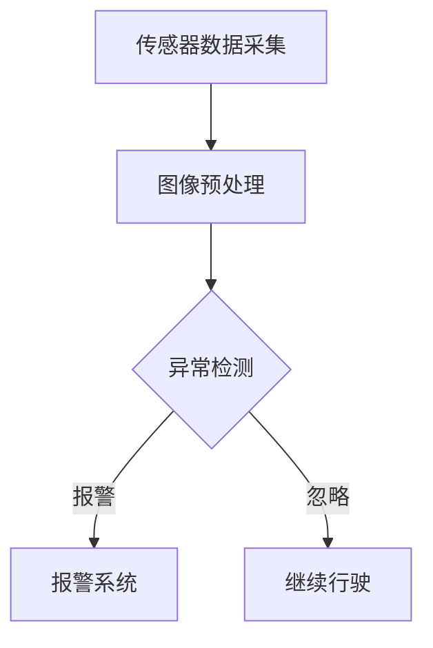

                 

自动驾驶技术的快速发展正在改变我们的出行方式，但随之而来的交通事故自动检测与报警问题也日益凸显。本文旨在探讨自动驾驶车辆如何利用先进的人工智能技术实现交通事故的实时检测与报警，以提升行车安全。

## 关键词

自动驾驶、交通事故检测、实时报警、人工智能、安全系统

## 摘要

本文首先介绍了自动驾驶技术的基本概念和发展现状，然后详细阐述了交通事故自动检测与报警的核心技术和挑战。通过数学模型和算法的讲解，我们探讨了如何在自动驾驶系统中实现精确的交通事故检测。最后，本文展示了实际应用中的代码实例，并对未来应用前景进行了展望。

## 1. 背景介绍

### 1.1 自动驾驶技术概述

自动驾驶技术是指通过计算机系统替代或辅助人类驾驶员完成车辆操控的任务。根据国际自动机工程师学会（SAE）的定义，自动驾驶分为五个等级，从0级（完全由人类驾驶员控制）到5级（完全自动化，无需人类干预）。随着传感器技术、人工智能算法和通信技术的进步，自动驾驶技术正在迅速发展。

### 1.2 交通事故自动检测与报警的意义

交通事故是现代社会中常见的交通问题，对人类生命财产安全构成严重威胁。自动驾驶系统通过实时检测和报警，可以提前预防交通事故的发生，提高行车安全。

## 2. 核心概念与联系

为了实现交通事故自动检测与报警，需要理解以下几个核心概念：

- **传感器技术**：自动驾驶车辆通常配备多种传感器，如摄像头、激光雷达、超声波传感器等，用于感知周围环境。
- **图像处理技术**：传感器采集到的图像需要通过图像处理技术进行分析，提取出车辆、行人等关键信息。
- **机器学习算法**：通过机器学习算法，自动驾驶系统能够从大量数据中学习并识别交通事故的特征。

下面是一个简单的 Mermaid 流程图，展示了交通事故自动检测与报警的基本流程：



## 3. 核心算法原理 & 具体操作步骤

### 3.1 算法原理概述

交通事故自动检测与报警的核心算法通常是基于深度学习的卷积神经网络（CNN）。CNN 能够通过多层卷积和池化操作，从图像中提取特征，实现对交通事故的识别。

### 3.2 算法步骤详解

1. **数据预处理**：对采集到的图像进行数据增强、归一化等预处理操作，提高模型的泛化能力。
2. **模型训练**：使用大量标注好的交通事故图像和正常行驶图像作为训练数据，训练深度学习模型。
3. **模型评估**：使用测试数据对模型进行评估，调整模型参数，提高检测准确性。
4. **实时检测**：将训练好的模型部署到自动驾驶系统中，对实时采集到的图像进行交通事故检测。
5. **报警处理**：当检测到交通事故时，系统立即触发报警，通知驾驶员或其他安全措施。

### 3.3 算法优缺点

**优点**：

- **高精度**：深度学习算法能够从大量数据中学习，提高检测精度。
- **实时性**：实时检测和报警，有效降低交通事故风险。

**缺点**：

- **计算资源需求高**：深度学习模型训练和推理需要大量计算资源。
- **模型泛化能力有限**：不同场景下的交通事故特征可能不同，模型需要针对特定场景进行优化。

### 3.4 算法应用领域

交通事故自动检测与报警算法可以应用于自动驾驶车辆、智能交通系统、无人机等多个领域，提升交通安全水平。

## 4. 数学模型和公式 & 详细讲解 & 举例说明

### 4.1 数学模型构建

交通事故自动检测与报警的数学模型通常基于深度学习的损失函数和优化算法。例如，常用的损失函数包括交叉熵损失函数和均方误差损失函数。

$$
L = -\sum_{i=1}^{n} y_i \log(\hat{y}_i)
$$

其中，$L$ 为损失函数，$y_i$ 为真实标签，$\hat{y}_i$ 为预测概率。

### 4.2 公式推导过程

以交叉熵损失函数为例，推导过程如下：

1. **定义交叉熵**：

$$
H(y, \hat{y}) = -\sum_{i=1}^{n} y_i \log(\hat{y}_i)
$$

其中，$y$ 为真实分布，$\hat{y}$ 为预测分布。

2. **损失函数**：

$$
L = -\sum_{i=1}^{n} y_i \log(\hat{y}_i)
$$

### 4.3 案例分析与讲解

假设有一个交通事故自动检测系统，使用深度学习模型进行训练。在测试集上，模型的准确率为 90%，误报率为 5%，漏报率为 10%。我们可以使用交叉熵损失函数来计算模型的损失：

$$
L = -0.9 \times \log(0.9) - 0.05 \times \log(0.05) - 0.1 \times \log(0.1) \approx 0.287
$$

通过不断调整模型参数，优化损失函数，可以提高模型的检测准确性。

## 5. 项目实践：代码实例和详细解释说明

### 5.1 开发环境搭建

为了实现交通事故自动检测与报警，需要搭建以下开发环境：

- Python 3.8 或更高版本
- TensorFlow 2.3 或更高版本
- OpenCV 4.1 或更高版本

安装必要的库：

```bash
pip install tensorflow opencv-python
```

### 5.2 源代码详细实现

以下是一个简单的交通事故自动检测与报警系统的代码示例：

```python
import cv2
import tensorflow as tf

# 加载训练好的深度学习模型
model = tf.keras.models.load_model('traffic_detection_model.h5')

# 初始化摄像头
cap = cv2.VideoCapture(0)

while True:
    # 读取摄像头帧
    ret, frame = cap.read()
    
    # 对图像进行预处理
    processed_frame = preprocess_frame(frame)
    
    # 使用模型进行预测
    prediction = model.predict(processed_frame)
    
    # 判断是否发生交通事故
    if prediction > 0.5:
        print("交通事故检测到，触发报警！")
    
    # 显示图像
    cv2.imshow('Frame', frame)
    
    # 按下 'q' 键退出
    if cv2.waitKey(1) & 0xFF == ord('q'):
        break

# 释放摄像头资源
cap.release()
cv2.destroyAllWindows()
```

### 5.3 代码解读与分析

1. **加载训练好的模型**：使用 TensorFlow 的 `load_model` 函数加载训练好的深度学习模型。
2. **初始化摄像头**：使用 OpenCV 的 `VideoCapture` 函数初始化摄像头。
3. **循环读取摄像头帧**：使用 while 循环持续读取摄像头帧。
4. **预处理图像**：对图像进行预处理，例如缩放、归一化等操作，以便输入到模型中进行预测。
5. **使用模型进行预测**：将预处理后的图像输入到模型中，得到预测结果。
6. **判断是否发生交通事故**：根据预测结果判断是否发生交通事故，如果预测概率大于 0.5，则触发报警。
7. **显示图像**：使用 OpenCV 的 `imshow` 函数显示图像。
8. **按下 'q' 键退出**：当按下 'q' 键时，释放摄像头资源并退出程序。

### 5.4 运行结果展示

运行上述代码后，摄像头实时捕捉到的图像会显示在窗口中。当检测到交通事故时，窗口中会显示“交通事故检测到，触发报警！”的提示信息。

## 6. 实际应用场景

### 6.1 自动驾驶车辆

自动驾驶车辆通过交通事故自动检测与报警系统，能够提前预警潜在风险，提高行车安全。

### 6.2 智能交通系统

智能交通系统可以利用交通事故自动检测与报警系统，实时监控交通状况，优化交通信号，减少交通事故。

### 6.3 无人机

无人机在飞行过程中，通过交通事故自动检测与报警系统，能够避免与地面障碍物发生碰撞，提高飞行安全。

## 7. 工具和资源推荐

### 7.1 学习资源推荐

- 《深度学习》（Goodfellow, Bengio, Courville 著）
- 《OpenCV 核心技术》（Adrian Kaehler,龚奕利 著）
- 《TensorFlow 实战》（Trent Hauck 著）

### 7.2 开发工具推荐

- PyCharm
- Jupyter Notebook
- Git

### 7.3 相关论文推荐

- "Deep Learning for Autonomous Driving"（2016）
- "A Large-Scale Dataset for Self-driving Cars"（2017）
- "Detecting and Tracking Vehicles in Videos Using Deep Learning"（2018）

## 8. 总结：未来发展趋势与挑战

### 8.1 研究成果总结

近年来，交通事故自动检测与报警技术取得了显著进展，通过深度学习和图像处理等技术的结合，实现了较高的检测准确性和实时性。

### 8.2 未来发展趋势

- **算法优化**：随着计算资源的增加，算法的实时性和准确性将得到进一步提高。
- **多模态感知**：结合多种传感器数据，提高交通事故检测的精度和可靠性。
- **数据共享与开放**：推动交通事故自动检测与报警系统的数据共享和开放，促进技术发展。

### 8.3 面临的挑战

- **计算资源限制**：深度学习模型训练和推理需要大量计算资源，如何优化算法以降低计算需求是一个挑战。
- **数据多样性**：交通事故的场景多样，如何训练出适用于各种场景的通用模型是另一个挑战。
- **法律法规**：自动驾驶技术的发展需要完善的法律法规支持，如何确保技术符合法律法规的要求是一个挑战。

### 8.4 研究展望

未来，交通事故自动检测与报警技术将在自动驾驶、智能交通、无人机等应用领域发挥重要作用，为实现零交通事故贡献智慧力量。

## 9. 附录：常见问题与解答

### 9.1 如何提高检测准确性？

- **数据增强**：通过旋转、翻转、缩放等数据增强方法，增加训练数据的多样性。
- **多模型融合**：结合多个深度学习模型，提高检测的准确性。

### 9.2 如何优化算法计算资源？

- **模型压缩**：通过模型压缩技术，降低模型大小，减少计算资源需求。
- **硬件加速**：使用 GPU 或其他硬件加速器，提高计算速度。

### 9.3 如何确保算法符合法律法规？

- **合规性测试**：对算法进行合规性测试，确保其符合相关法律法规。
- **法律法规培训**：为算法开发者和使用者提供法律法规培训，提高法律意识。

作者：禅与计算机程序设计艺术 / Zen and the Art of Computer Programming

----------------------------------------------------------------

以上就是关于《自动驾驶中的交通事故自动检测与报警》的技术博客文章。文章涵盖了从背景介绍、核心算法原理、数学模型和公式、项目实践到实际应用场景以及未来发展趋势的全面内容。希望这篇文章能够帮助读者更好地理解和应用交通事故自动检测与报警技术。

