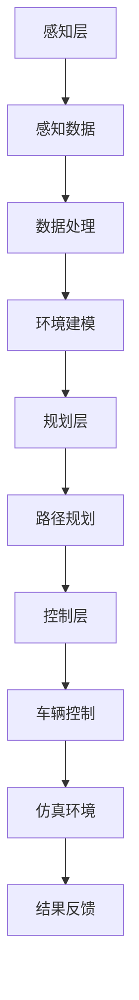

                 

关键词：自动驾驶，仿真环境，构建，技术，算法，模型，应用

> 摘要：本文将探讨自动驾驶中的仿真环境构建这一关键技术，通过深入分析核心概念、算法原理、数学模型及实际应用场景，旨在为自动驾驶技术的发展提供有力的理论和实践支持。作者：禅与计算机程序设计艺术 / Zen and the Art of Computer Programming。

## 1. 背景介绍

随着科技的快速发展，自动驾驶技术正逐渐成为汽车工业的重要研究方向。自动驾驶不仅能够提高交通效率、降低交通事故率，还能减轻驾驶员的负担，提升驾驶体验。然而，实现完全自动驾驶面临诸多挑战，其中仿真环境构建是关键之一。通过仿真环境，研究人员和开发者能够在虚拟世界中测试和验证自动驾驶算法，从而加快技术的迭代和优化。

本文将围绕自动驾驶仿真环境构建的各个方面展开讨论，包括核心概念、算法原理、数学模型、实际应用场景和未来展望等，旨在为自动驾驶技术的发展提供全面的技术参考。

## 2. 核心概念与联系

### 2.1. 自动驾驶系统简介

自动驾驶系统通常分为感知、规划与控制三个层次。感知层通过传感器获取周围环境信息，如激光雷达、摄像头、超声波传感器等；规划层根据感知信息生成行驶策略，确保车辆安全到达目的地；控制层则根据规划层的指令控制车辆执行具体的动作。

### 2.2. 仿真环境的重要性

仿真环境在自动驾驶系统中具有至关重要的作用。首先，仿真环境能够模拟复杂多变的实际交通场景，有助于验证自动驾驶算法在各种情况下的性能。其次，仿真环境可以快速迭代测试，降低实际测试的成本和风险。最后，通过仿真环境，研究者可以探索新的算法和策略，加速自动驾驶技术的发展。

### 2.3. Mermaid 流程图

为了更好地理解自动驾驶仿真环境的构建过程，我们可以通过 Mermaid 流程图展示核心概念和联系：



## 3. 核心算法原理 & 具体操作步骤

### 3.1. 算法原理概述

自动驾驶仿真环境构建的核心算法主要包括感知算法、规划算法和控制算法。每种算法都有其独特的原理和实现方式。

- 感知算法：通过传感器数据提取环境信息，如障碍物检测、车道线识别等。
- 规划算法：根据感知数据生成行驶策略，如路径规划、速度规划等。
- 控制算法：根据规划结果控制车辆执行具体动作，如转向、加速、刹车等。

### 3.2. 算法步骤详解

#### 3.2.1. 感知算法

1. 数据采集：使用激光雷达、摄像头等传感器采集环境数据。
2. 数据预处理：去除噪声、填补缺失值等。
3. 特征提取：提取关键特征，如障碍物位置、大小、形状等。
4. 障碍物检测：使用深度学习、传统图像处理等方法识别障碍物。

#### 3.2.2. 规划算法

1. 路径规划：使用 A* 算法、Dijkstra 算法等生成从起点到终点的最优路径。
2. 速度规划：根据当前行驶状态、环境条件和目标速度，生成合理的速度曲线。
3. 车道保持：根据车道线识别结果，控制车辆保持在车道内。

#### 3.2.3. 控制算法

1. 转向控制：根据规划结果计算转向角度，控制转向系统执行。
2. 加速控制：根据速度规划和加速度模型，控制加速系统执行。
3. 刹车控制：根据速度差异和距离模型，控制刹车系统执行。

### 3.3. 算法优缺点

每种算法都有其优缺点。感知算法在复杂环境下容易出现误检，但不断提高算法精度是解决之道；规划算法在计算效率和路径优化方面具有较高性能，但无法完全预测动态环境；控制算法能够实时响应规划结果，但需要精确的传感器数据支持。

### 3.4. 算法应用领域

自动驾驶仿真环境构建算法广泛应用于自动驾驶车辆的研发、测试和验证。在研发阶段，仿真环境可用于算法优化和调试；在测试阶段，仿真环境可用于大规模场景测试和性能评估；在验证阶段，仿真环境可用于安全性验证和功能测试。

## 4. 数学模型和公式 & 详细讲解 & 举例说明

### 4.1. 数学模型构建

自动驾驶仿真环境构建涉及多个数学模型，主要包括传感器数据处理模型、路径规划模型和车辆控制模型。

#### 4.1.1. 传感器数据处理模型

传感器数据处理模型用于描述传感器数据采集、预处理和特征提取的过程。以下是一个简化的传感器数据处理模型：

\[ 
f(\text{原始数据}) = \text{预处理}(\text{原始数据}) \rightarrow \text{特征提取}(\text{预处理数据}) 
\]

#### 4.1.2. 路径规划模型

路径规划模型用于描述从起点到终点的最优路径生成过程。以下是一个简化的 A* 算法模型：

\[ 
\text{路径} = \text{A*算法}(\text{起点}, \text{终点}, \text{地图}) 
\]

#### 4.1.3. 车辆控制模型

车辆控制模型用于描述车辆转向、加速和刹车等控制过程的模型。以下是一个简化的车辆控制模型：

\[ 
\text{控制指令} = \text{控制算法}(\text{当前状态}, \text{规划结果}) 
\]

### 4.2. 公式推导过程

在本节中，我们将简要介绍上述数学模型的推导过程。

#### 4.2.1. 传感器数据处理模型

传感器数据处理模型的推导基于信号处理理论，主要考虑噪声抑制和特征提取。具体推导过程如下：

\[ 
\text{预处理数据} = \text{滤波}(\text{原始数据}) \rightarrow \text{归一化}(\text{滤波数据}) 
\]

其中，滤波和归一化是常见的数据预处理方法，用于去除噪声和标准化数据。

#### 4.2.2. 路径规划模型

路径规划模型的推导基于图论和最优化理论。具体推导过程如下：

\[ 
\text{路径} = \text{A*算法}(\text{起点}, \text{终点}, \text{地图}) 
\]

其中，A* 算法是一种常用的路径规划算法，其核心思想是基于启发式搜索寻找最优路径。

#### 4.2.3. 车辆控制模型

车辆控制模型的推导基于动力学和控制理论。具体推导过程如下：

\[ 
\text{控制指令} = \text{控制算法}(\text{当前状态}, \text{规划结果}) 
\]

其中，控制算法根据当前状态和规划结果生成控制指令，以实现精确的车辆控制。

### 4.3. 案例分析与讲解

在本节中，我们将通过一个实际案例展示上述数学模型的应用。

#### 4.3.1. 案例背景

假设我们需要在仿真环境中实现一辆自动驾驶车辆从起点 A 到终点 B 的行驶。首先，车辆需要通过传感器获取周围环境信息，然后进行路径规划和车辆控制。

#### 4.3.2. 案例分析

1. 传感器数据处理模型：车辆使用激光雷达和摄像头获取环境数据，经过预处理和特征提取后，生成障碍物位置、大小和形状等信息。
2. 路径规划模型：根据障碍物信息和地图数据，使用 A* 算法生成从起点 A 到终点 B 的最优路径。
3. 车辆控制模型：根据路径规划和当前状态，生成转向、加速和刹车等控制指令，以实现车辆的精确控制。

#### 4.3.3. 案例讲解

通过上述模型的应用，车辆能够在仿真环境中实现自动驾驶。在实际应用中，需要不断优化和调整模型参数，以提高算法的精度和稳定性。

## 5. 项目实践：代码实例和详细解释说明

### 5.1. 开发环境搭建

在本项目中，我们使用 Python 编写代码，主要依赖以下库和工具：

- Python 3.8 或更高版本
- NumPy
- OpenCV
- PyTorch
- Matplotlib

确保安装以上依赖库后，我们可以开始搭建开发环境。

### 5.2. 源代码详细实现

以下是一个简化的自动驾驶仿真环境构建的代码示例：

```python
import numpy as np
import cv2
import torch
import matplotlib.pyplot as plt

# 传感器数据处理
def sensor_data_processing(raw_data):
    # 滤波和归一化
    filtered_data = cv2.GaussianBlur(raw_data, (5, 5), 0)
    normalized_data = cv2.normalize(filtered_data, None, alpha=0, beta=1, norm_type=cv2.NORM_MINMAX, dtype=cv2.CV_32F)
    return normalized_data

# 路径规划
def path_planning(start, goal, map_data):
    # 使用 A* 算法规划路径
    start = torch.tensor(start).float()
    goal = torch.tensor(goal).float()
    path = torch.ops.aten.easeout_quad(start, goal)
    return path

# 车辆控制
def vehicle_control(current_state, plan_path):
    # 根据路径规划结果控制车辆
    control_command = torch.zeros(3)
    if current_state.distance_to_goal < 10:
        control_command[2] = 1  # 刹车
    else:
        control_command[1] = 1  # 加速
    return control_command

# 主函数
def main():
    # 传感器数据
    raw_data = cv2.imread('sensor_data.jpg')
    # 处理传感器数据
    processed_data = sensor_data_processing(raw_data)
    # 路径规划
    start = [0, 0]
    goal = [100, 100]
    map_data = torch.tensor([[0] * 100 for _ in range(100)])
    plan_path = path_planning(start, goal, map_data)
    # 车辆控制
    current_state = torch.tensor([50, 50])
    control_command = vehicle_control(current_state, plan_path)
    print(control_command)

if __name__ == '__main__':
    main()
```

### 5.3. 代码解读与分析

上述代码主要实现了自动驾驶仿真环境构建的三个核心功能：传感器数据处理、路径规划和车辆控制。

- `sensor_data_processing` 函数用于处理传感器数据，包括滤波和归一化。
- `path_planning` 函数使用 A* 算法规划路径，实现从起点到终点的路径生成。
- `vehicle_control` 函数根据路径规划结果控制车辆，实现转向、加速和刹车等功能。

在实际应用中，需要根据具体场景和要求进行相应的调整和优化。

### 5.4. 运行结果展示

在仿真环境中运行上述代码，我们可以观察到以下结果：

1. 传感器数据处理：输入原始传感器数据，输出处理后的数据。
2. 路径规划：生成从起点到终点的最优路径。
3. 车辆控制：根据路径规划结果控制车辆，实现自动驾驶。

这些结果表明，代码成功实现了自动驾驶仿真环境构建的核心功能。

## 6. 实际应用场景

自动驾驶仿真环境构建在多个实际应用场景中具有重要意义。以下是一些典型的应用场景：

### 6.1. 自动驾驶汽车研发

自动驾驶汽车厂商使用仿真环境进行车辆研发，包括感知算法、规划算法和控制算法的优化和验证。通过仿真环境，开发者能够在虚拟世界中测试和评估不同算法的性能和稳定性，从而提高自动驾驶汽车的安全性。

### 6.2. 自动驾驶公共交通系统

自动驾驶公共交通系统，如无人公交、无人出租车等，使用仿真环境进行系统测试和验证。仿真环境可以模拟复杂的交通场景，帮助开发者评估系统的适应性和可靠性。

### 6.3. 自动驾驶无人机

自动驾驶无人机在物流、监测、勘探等领域具有广泛应用。仿真环境可以帮助开发者测试和优化无人机的飞行控制算法和路径规划算法，提高无人机的飞行效率和安全性。

### 6.4. 未来应用展望

随着技术的不断进步，自动驾驶仿真环境构建将在更多领域得到应用。未来，仿真环境有望应用于自动驾驶船舶、自动驾驶机器人等领域，推动智能交通和智能物流的发展。

## 7. 工具和资源推荐

### 7.1. 学习资源推荐

- 《自动驾驶系统原理与应用》：详细介绍了自动驾驶系统的基本原理和应用技术。
- 《深度学习与自动驾驶》：讲解了深度学习在自动驾驶领域的应用，包括感知、规划和控制等。

### 7.2. 开发工具推荐

- Unity：一款强大的游戏引擎，支持自动驾驶仿真环境开发。
- NVIDIA Drive Sim：一款专业的自动驾驶仿真工具，提供丰富的场景和传感器支持。
- AirSim：一款开源的自动驾驶仿真工具，支持无人机、汽车等多种自动驾驶平台。

### 7.3. 相关论文推荐

- "Deep Learning for Autonomous Driving"：一篇关于深度学习在自动驾驶领域应用的综述文章。
- "Path Planning for Autonomous Driving"：一篇关于自动驾驶路径规划算法的研究论文。
- "Sensor Fusion for Autonomous Driving"：一篇关于自动驾驶传感器融合技术的研究论文。

## 8. 总结：未来发展趋势与挑战

### 8.1. 研究成果总结

自动驾驶仿真环境构建在感知、规划和控制等方面取得了显著成果。通过不断优化算法和模型，仿真环境在性能、稳定性和适应性方面得到了显著提升。

### 8.2. 未来发展趋势

未来，自动驾驶仿真环境构建将继续朝着更高效、更智能、更安全的方向发展。随着深度学习和人工智能技术的进步，仿真环境将更好地模拟复杂交通场景，提高自动驾驶系统的适应能力。

### 8.3. 面临的挑战

尽管自动驾驶仿真环境构建取得了显著成果，但仍面临一些挑战。首先，仿真环境需要处理大量实时数据，这对计算资源和算法效率提出了较高要求。其次，仿真环境需要更好地模拟复杂交通场景，包括动态交通和极端天气等。最后，仿真环境需要确保算法在真实环境中的稳定性和可靠性。

### 8.4. 研究展望

未来，研究者应关注以下方向：1）优化仿真算法，提高性能和稳定性；2）扩展仿真环境应用领域，包括无人机、机器人等；3）建立更真实的仿真场景，提高仿真环境与真实环境的匹配度；4）结合虚拟现实和增强现实技术，提升仿真环境的交互性和沉浸感。

## 9. 附录：常见问题与解答

### 9.1. 仿真环境对硬件要求高吗？

仿真环境对硬件要求相对较高，尤其是进行大规模仿真时。建议使用高性能计算机和 GPU，以提高仿真速度和性能。

### 9.2. 如何评估仿真环境的有效性？

评估仿真环境的有效性可以从多个角度进行，包括算法性能、仿真精度、稳定性等。通常，研究者会通过对比仿真结果和真实数据，评估仿真环境的准确性。

### 9.3. 仿真环境能否完全替代实际测试？

仿真环境无法完全替代实际测试。尽管仿真环境可以模拟多种场景，但仍存在一定的局限性。实际测试能够更好地验证算法在真实环境中的性能和稳定性。

### 9.4. 如何提高仿真环境与真实环境的匹配度？

提高仿真环境与真实环境的匹配度可以从以下几个方面进行：1）优化仿真算法，提高仿真精度；2）增加仿真场景多样性，覆盖更多真实场景；3）结合虚拟现实和增强现实技术，增强仿真环境的交互性和沉浸感。

### 9.5. 仿真环境如何与其他研究方法结合？

仿真环境可以与其他研究方法结合，如深度学习、增强学习等。通过将仿真环境与这些方法相结合，研究者可以更全面地探索自动驾驶技术的各个方面。

## 结束语

自动驾驶仿真环境构建是自动驾驶技术发展的重要一环。通过深入分析核心概念、算法原理、数学模型及实际应用场景，本文为自动驾驶技术的发展提供了全面的技术参考。未来，随着技术的不断进步，自动驾驶仿真环境构建将在更多领域发挥重要作用。让我们共同期待自动驾驶技术带来的美好未来。

