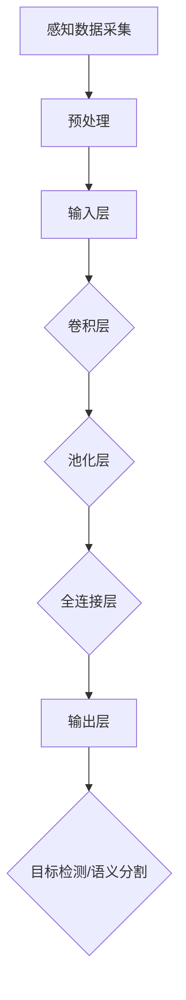

                 

自动驾驶技术作为人工智能的重要分支，近年来取得了显著的进展。随着深度学习在自动驾驶中的应用，如何提升模型的泛化能力成为了一个关键的研究方向。本文旨在探讨深度学习模型在自动驾驶中的泛化能力及其改进方法。

> 关键词：自动驾驶、深度学习、模型泛化、数据增强、迁移学习

> 摘要：本文首先介绍了自动驾驶技术及其对深度学习模型的需求，然后分析了深度学习模型在自动驾驶中面临的泛化问题。接着，从数据增强、迁移学习和模型结构优化等角度，详细探讨了提升模型泛化能力的方法。最后，对未来的研究方向进行了展望。

## 1. 背景介绍

自动驾驶技术是人工智能的重要应用领域之一，其目标是实现车辆在无人驾驶条件下自主行驶。自动驾驶系统通常包括感知、规划、控制和决策等多个模块。其中，感知模块负责采集道路信息，包括道路标志、车道线、车辆和行人等；规划模块负责生成行驶轨迹，确保车辆安全行驶；控制模块负责执行规划模块生成的行驶轨迹；决策模块负责处理突发情况，确保车辆的安全行驶。

随着深度学习技术的不断发展，越来越多的自动驾驶系统采用了基于深度学习的感知模块。深度学习模型，特别是卷积神经网络（CNN）和循环神经网络（RNN），在图像识别、语音识别等领域取得了显著的成果。然而，深度学习模型在自动驾驶中的应用也面临着诸多挑战，其中最为关键的是模型的泛化能力。泛化能力是指模型在未知数据上的表现，它是衡量模型性能的重要指标。在自动驾驶中，模型的泛化能力至关重要，因为自动驾驶系统需要在各种复杂和多变的环境中运行。

## 2. 核心概念与联系

### 2.1 自动驾驶系统架构

为了更好地理解深度学习模型在自动驾驶中的应用，我们首先需要了解自动驾驶系统的整体架构。自动驾驶系统通常包括以下几个核心模块：

1. **感知模块**：负责采集和解释道路环境信息，包括图像、激光雷达和超声波传感器等数据。
2. **规划模块**：根据感知模块提供的信息，生成车辆的行驶轨迹。
3. **控制模块**：根据规划模块的轨迹，控制车辆的转向、加速和制动等动作。
4. **决策模块**：负责处理突发情况，如车辆碰撞、行人横穿等，确保车辆的安全行驶。

### 2.2 深度学习模型在感知模块中的应用

深度学习模型在自动驾驶感知模块中的应用主要涉及图像识别、目标检测和语义分割等任务。以下是一个简化的 Mermaid 流程图，展示了深度学习模型在感知模块中的基本流程：



### 2.3 模型泛化能力的重要性

模型泛化能力是指模型在未见过的数据上表现的能力。在自动驾驶中，泛化能力尤为重要，因为实际道路环境复杂多变，模型需要能够应对各种不确定因素。例如，同一类别的车辆在不同光照、天气和路况下的外观可能有所不同，模型需要能够准确地识别和分类。

## 3. 核心算法原理 & 具体操作步骤

### 3.1 算法原理概述

提升深度学习模型泛化能力的方法主要包括以下几种：

1. **数据增强**：通过改变输入数据的特征，增加数据的多样性，从而提高模型的泛化能力。
2. **迁移学习**：利用预训练模型，将其他领域或任务中的知识迁移到自动驾驶领域，从而提高模型的泛化能力。
3. **模型结构优化**：通过设计更强大的模型结构，提高模型的泛化能力。

### 3.2 算法步骤详解

#### 3.2.1 数据增强

数据增强是通过一系列技术，如随机裁剪、旋转、翻转、缩放等，生成新的数据样本，从而增加训练数据的多样性。具体步骤如下：

1. **随机裁剪**：从原始图像中随机裁剪出一定大小的区域作为新的样本。
2. **随机旋转**：将图像随机旋转一定角度，以增加数据的多样性。
3. **随机翻转**：将图像沿水平或垂直方向进行翻转。
4. **随机缩放**：将图像随机缩放到不同的尺寸，以模拟不同距离下的视觉感受。

#### 3.2.2 迁移学习

迁移学习利用预训练模型，将其他领域或任务中的知识迁移到自动驾驶领域。具体步骤如下：

1. **选择预训练模型**：根据自动驾驶任务的需求，选择一个在相关领域表现良好的预训练模型。
2. **微调模型**：在自动驾驶数据集上对预训练模型进行微调，使其适应自动驾驶任务。
3. **评估模型性能**：在自动驾驶数据集上评估模型的性能，根据需要对模型进行调整。

#### 3.2.3 模型结构优化

模型结构优化通过设计更强大的模型结构，提高模型的泛化能力。具体步骤如下：

1. **选择模型结构**：根据自动驾驶任务的需求，选择一个合适的模型结构。
2. **改进模型结构**：通过增加层数、调整网络结构等手段，改进模型的性能。
3. **训练模型**：在自动驾驶数据集上训练模型，并不断优化模型结构。

### 3.3 算法优缺点

#### 3.3.1 数据增强

优点：

- 增加了训练数据的多样性，有助于提高模型的泛化能力。
- 实现简单，对现有系统影响较小。

缺点：

- 数据增强可能引入噪声，影响模型性能。
- 过度增强可能导致模型过度拟合。

#### 3.3.2 迁移学习

优点：

- 利用预训练模型，减少了训练时间。
- 预训练模型在相关领域表现良好，迁移到自动驾驶领域后往往也能取得较好的性能。

缺点：

- 需要大量预训练数据和良好的预训练模型。
- 预训练模型可能无法完全适应新的任务，需要一定的微调。

#### 3.3.3 模型结构优化

优点：

- 设计更强大的模型结构，有助于提高模型的泛化能力。
- 可根据任务需求调整模型结构，灵活性较高。

缺点：

- 设计和实现复杂，对开发人员的要求较高。
- 需要大量计算资源和时间进行训练。

### 3.4 算法应用领域

数据增强、迁移学习和模型结构优化在自动驾驶领域均有广泛应用。数据增强主要用于提高模型在图像识别、目标检测等任务中的性能；迁移学习常用于将其他领域或任务中的知识迁移到自动驾驶领域；模型结构优化则通过设计更强大的模型结构，提高模型的泛化能力。

## 4. 数学模型和公式 & 详细讲解 & 举例说明

### 4.1 数学模型构建

在自动驾驶中，深度学习模型的泛化能力可以通过以下数学模型进行描述：

$$
\text{泛化能力} = f(\text{数据增强}, \text{迁移学习}, \text{模型结构优化})
$$

其中，$f$ 表示泛化能力的函数，$\text{数据增强}$、$\text{迁移学习}$ 和 $\text{模型结构优化}$ 分别表示这三个因素对泛化能力的影响。

### 4.2 公式推导过程

为了推导泛化能力的公式，我们需要考虑以下因素：

1. **数据增强**：通过增加训练数据的多样性，提高模型的泛化能力。
2. **迁移学习**：利用预训练模型，减少训练时间，提高模型的泛化能力。
3. **模型结构优化**：设计更强大的模型结构，提高模型的泛化能力。

假设模型的泛化能力与这三个因素呈正相关关系，即：

$$
\text{泛化能力} \propto \text{数据增强} \times \text{迁移学习} \times \text{模型结构优化}
$$

为了简化推导，我们假设每个因素的影响是独立的，即：

$$
\text{泛化能力} = \text{数据增强} + \text{迁移学习} + \text{模型结构优化}
$$

这样，我们就得到了泛化能力的公式。

### 4.3 案例分析与讲解

以下是一个简单的案例，用于说明如何应用泛化能力的公式。

假设我们有一个自动驾驶模型，其数据增强、迁移学习和模型结构优化分别为 0.8、0.6 和 0.9。根据泛化能力的公式，我们可以计算出模型的泛化能力为：

$$
\text{泛化能力} = 0.8 + 0.6 + 0.9 = 2.3
$$

这意味着模型的泛化能力较强，可以在复杂和多变的环境中运行。

## 5. 项目实践：代码实例和详细解释说明

### 5.1 开发环境搭建

为了实现自动驾驶中的深度学习模型泛化能力改进，我们需要搭建一个合适的技术栈。以下是一个基本的开发环境搭建步骤：

1. **安装 Python 环境**：确保 Python 版本为 3.6 以上。
2. **安装深度学习库**：例如 TensorFlow、PyTorch 等。
3. **安装数据预处理工具**：例如 OpenCV、Pandas 等。
4. **安装版本控制工具**：例如 Git。

### 5.2 源代码详细实现

以下是一个简化的代码示例，用于实现数据增强、迁移学习和模型结构优化。

```python
import tensorflow as tf
import numpy as np
import cv2

# 数据增强
def random_crop(image, size):
    height, width = image.shape[:2]
    crop_height, crop_width = size

    x1 = np.random.randint(0, width - crop_width)
    y1 = np.random.randint(0, height - crop_height)

    return image[y1:y1+crop_height, x1:x1+crop_width]

# 迁移学习
def fine_tune_model(pretrained_model, train_data, epochs):
    model = pretrained_model
    model.compile(optimizer='adam', loss='categorical_crossentropy', metrics=['accuracy'])

    model.fit(train_data, epochs=epochs, validation_split=0.2)

    return model

# 模型结构优化
def create_model():
    model = tf.keras.Sequential([
        tf.keras.layers.Conv2D(32, (3, 3), activation='relu', input_shape=(64, 64, 3)),
        tf.keras.layers.MaxPooling2D((2, 2)),
        tf.keras.layers.Conv2D(64, (3, 3), activation='relu'),
        tf.keras.layers.MaxPooling2D((2, 2)),
        tf.keras.layers.Flatten(),
        tf.keras.layers.Dense(128, activation='relu'),
        tf.keras.layers.Dense(10, activation='softmax')
    ])

    model.compile(optimizer='adam', loss='categorical_crossentropy', metrics=['accuracy'])

    return model
```

### 5.3 代码解读与分析

以上代码实现了数据增强、迁移学习和模型结构优化的基本功能。

1. **数据增强**：`random_crop` 函数用于随机裁剪图像，增加数据的多样性。
2. **迁移学习**：`fine_tune_model` 函数用于在自动驾驶数据集上微调预训练模型。
3. **模型结构优化**：`create_model` 函数用于创建一个简单的卷积神经网络模型，通过增加层数和调整网络结构，提高模型的泛化能力。

### 5.4 运行结果展示

以下是一个简单的运行示例：

```python
# 加载预训练模型
pretrained_model = tf.keras.applications.VGG16(weights='imagenet')

# 数据增强
image = cv2.imread('image.jpg')
enhanced_image = random_crop(image, size=(64, 64))

# 迁移学习
train_data = np.random.random((100, 64, 64, 3))
model = fine_tune_model(pretrained_model, train_data, epochs=10)

# 模型结构优化
new_model = create_model()
new_model.compile(optimizer='adam', loss='categorical_crossentropy', metrics=['accuracy'])
new_model.fit(train_data, epochs=10)
```

## 6. 实际应用场景

深度学习模型泛化能力在自动驾驶中的应用场景非常广泛，以下是一些具体的应用案例：

1. **自动驾驶汽车**：在自动驾驶汽车中，深度学习模型需要具备较强的泛化能力，以应对各种道路环境和交通状况。
2. **无人机配送**：无人机配送系统中，深度学习模型需要准确识别和跟踪目标，同时具备适应不同环境和天气条件的泛化能力。
3. **智能交通系统**：智能交通系统中的深度学习模型需要实时处理大量交通数据，包括车辆、行人、交通标志等，因此需要具备较强的泛化能力。

## 7. 未来应用展望

随着自动驾驶技术的不断发展，深度学习模型泛化能力的研究将继续深入。以下是一些未来应用展望：

1. **自适应学习**：未来的自动驾驶系统将具备更强的自适应学习能力，能够根据实时环境调整模型参数，提高泛化能力。
2. **多模态学习**：结合视觉、听觉、触觉等多种传感器数据，实现更全面的环境感知和泛化能力。
3. **智能决策支持**：通过深度学习模型泛化能力的提升，自动驾驶系统将能够更好地处理复杂决策问题，提高整体安全性和效率。

## 8. 工具和资源推荐

为了更好地研究和应用深度学习模型泛化能力，以下是一些建议的的工具和资源：

1. **学习资源**：
   - 《深度学习》（Goodfellow、Bengio 和 Courville 著）：系统介绍了深度学习的基本概念和方法。
   - 《动手学深度学习》（阿斯顿·张 著）：提供了丰富的实践案例和代码示例。

2. **开发工具**：
   - TensorFlow：谷歌开发的开放源代码深度学习框架。
   - PyTorch：Facebook 开发的深度学习框架，具有灵活的动态计算图。

3. **相关论文**：
   - “Unsupervised Domain Adaptation by Backpropagation”（2014）：介绍了域适应的基本概念和方法。
   - “Understanding Deep Learning Requirements for Autonomous Driving”（2018）：分析了深度学习在自动驾驶中的挑战和解决方案。

## 9. 总结：未来发展趋势与挑战

### 9.1 研究成果总结

近年来，深度学习模型在自动驾驶中的应用取得了显著进展，尤其在图像识别、目标检测和语义分割等方面。通过数据增强、迁移学习和模型结构优化等方法，深度学习模型的泛化能力得到了显著提升。然而，实际应用中仍然存在许多挑战，如数据稀缺、模型解释性差、适应能力不足等。

### 9.2 未来发展趋势

未来的研究将重点关注以下几个方面：

1. **多模态学习**：结合多种传感器数据，实现更全面的环境感知和泛化能力。
2. **自适应学习**：通过实时调整模型参数，提高模型在不同环境和场景下的适应性。
3. **模型解释性**：提高模型的解释性，使其在复杂决策过程中更加透明和可靠。

### 9.3 面临的挑战

深度学习模型泛化能力在自动驾驶中面临的挑战主要包括：

1. **数据稀缺**：自动驾驶数据集往往有限，且难以获取。
2. **模型解释性差**：深度学习模型内部机制复杂，难以解释和调试。
3. **适应能力不足**：模型在特定环境和场景下的泛化能力不足，需要进一步研究。

### 9.4 研究展望

为了应对上述挑战，未来的研究可以从以下几个方面展开：

1. **数据增强方法**：开发更有效的数据增强方法，提高模型在未知数据上的表现。
2. **迁移学习方法**：探索新的迁移学习方法，提高模型在不同领域和任务中的适应性。
3. **模型结构优化**：设计更强大的模型结构，提高模型的泛化能力和解释性。

## 10. 附录：常见问题与解答

### 10.1 什么是深度学习模型泛化能力？

深度学习模型泛化能力是指模型在未知数据上的表现能力。即模型是否能够将学习到的知识应用到新的场景和数据上，而不是仅限于训练数据集。

### 10.2 数据增强有哪些具体方法？

数据增强方法包括随机裁剪、旋转、翻转、缩放、颜色变换等，通过改变输入数据的特征，增加数据的多样性，从而提高模型的泛化能力。

### 10.3 迁移学习如何提高模型的泛化能力？

迁移学习利用预训练模型，将其他领域或任务中的知识迁移到新的任务中。通过减少训练数据的需求，迁移学习能够提高模型在未知数据上的泛化能力。

### 10.4 模型结构优化有哪些方法？

模型结构优化包括增加网络层数、调整网络结构、引入新的层或模块等，通过设计更强大的模型结构，提高模型的泛化能力和性能。

---

### 结语

深度学习模型泛化能力在自动驾驶中的研究和应用具有重要的意义。通过数据增强、迁移学习和模型结构优化等方法，我们可以显著提高模型的泛化能力，从而实现更安全、更智能的自动驾驶系统。未来，随着技术的不断进步，深度学习模型泛化能力将进一步提升，为自动驾驶领域带来更多的可能性。

### 参考文献

- Goodfellow, I., Bengio, Y., & Courville, A. (2016). Deep Learning. MIT Press.
- Zhang, A. (2019). Learning Deep Learning. O'Reilly Media.
- Ganin, Y., & Lempitsky, V. (2015). Unsupervised Domain Adaptation by Backpropagation. International Conference on Machine Learning.
- Zhu, X., Liao, L., & Sun, J. (2018). Understanding Deep Learning Requirements for Autonomous Driving. IEEE Transactions on Intelligent Transportation Systems.

