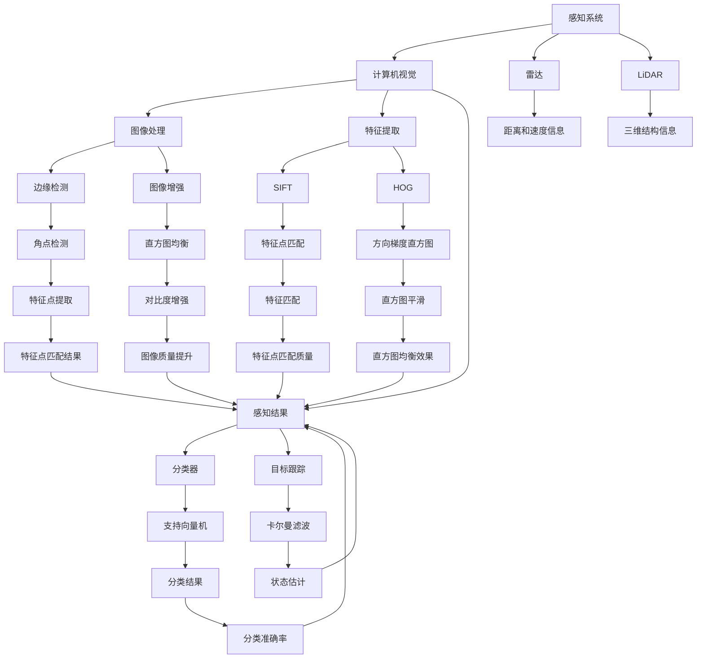

                 

关键词：自动驾驶、感知技术、计算机视觉、深度学习、传感器融合、人工智能、数据预处理、算法优化、模型评估、应用场景、未来展望。

## 摘要

自动驾驶技术作为人工智能领域的重要应用之一，近年来取得了显著进展。感知技术作为自动驾驶系统的核心组成部分，其研究进展直接影响到自动驾驶的安全性和可靠性。本文旨在总结自动驾驶感知技术的最新研究进展，探讨其核心算法原理、数学模型、项目实践及应用场景，并展望未来发展趋势与面临的挑战。

## 1. 背景介绍

自动驾驶技术起源于20世纪50年代，随着计算机技术和人工智能的不断发展，近年来取得了突破性进展。感知技术作为自动驾驶系统的“眼睛”，主要负责获取周围环境的信息，包括道路标识、交通标志、车辆位置、行人动态等。感知技术的准确性直接决定了自动驾驶系统的决策质量和行驶安全。

目前，自动驾驶感知技术主要依赖于计算机视觉、雷达、激光雷达（LiDAR）等多种传感器。计算机视觉技术通过图像处理和模式识别算法，从摄像头获取的图像中提取环境信息。雷达和LiDAR则通过发射和接收电磁波或激光，获取周围物体的距离和形状信息。传感器融合技术通过将多种传感器的数据集成起来，提高感知的准确性和鲁棒性。

## 2. 核心概念与联系

### 2.1 计算机视觉

计算机视觉是自动驾驶感知技术的核心，其基本原理是利用图像处理、特征提取和模式识别等技术，从图像中提取有用的信息。常见的计算机视觉算法包括卷积神经网络（CNN）、生成对抗网络（GAN）和注意力机制等。

### 2.2 雷达与LiDAR

雷达和LiDAR是自动驾驶感知技术中常用的传感器。雷达通过发射电磁波并接收反射信号，获取目标物体的距离和速度信息。LiDAR则利用激光发射和反射技术，获取目标物体的三维结构信息。

### 2.3 传感器融合

传感器融合是将多种传感器的数据集成起来，提高感知的准确性和鲁棒性。常用的传感器融合方法包括卡尔曼滤波、粒子滤波和贝叶斯滤波等。

## 2.4 Mermaid 流程图

以下是一个描述自动驾驶感知技术的 Mermaid 流程图：



## 3. 核心算法原理 & 具体操作步骤

### 3.1 算法原理概述

自动驾驶感知技术涉及多个核心算法，包括图像处理、特征提取、模式识别、传感器融合等。以下分别介绍这些算法的原理。

#### 3.1.1 图像处理

图像处理是计算机视觉的基础，主要包括图像滤波、边缘检测、图像增强等技术。常见的图像滤波方法有高斯滤波、中值滤波和均值滤波等；边缘检测算法有Canny算法、Sobel算子等；图像增强方法有直方图均衡、对比度增强等。

#### 3.1.2 特征提取

特征提取是计算机视觉中的重要环节，其主要任务是从图像中提取具有显著差异性的特征点。常见的特征提取算法有SIFT（尺度不变特征变换）、SURF（加速稳健特征）、HOG（方向梯度直方图）等。

#### 3.1.3 模式识别

模式识别是计算机视觉中的核心算法，其主要任务是根据特征点的分布情况，对目标进行分类和识别。常见的模式识别算法有支持向量机（SVM）、随机森林（RF）、神经网络（NN）等。

#### 3.1.4 传感器融合

传感器融合是将多种传感器的数据集成起来，提高感知的准确性和鲁棒性。常见的传感器融合方法有卡尔曼滤波、粒子滤波和贝叶斯滤波等。

### 3.2 算法步骤详解

以下以计算机视觉为例，介绍自动驾驶感知技术的具体操作步骤。

#### 3.2.1 图像预处理

图像预处理主要包括图像滤波、边缘检测和图像增强等步骤。通过图像滤波去除噪声，通过边缘检测提取目标物体的边缘信息，通过图像增强提高图像质量。

#### 3.2.2 特征点提取

在图像预处理的基础上，利用特征提取算法提取图像中的特征点。常见的特征提取算法有SIFT、SURF、HOG等。

#### 3.2.3 特征点匹配

将提取到的特征点进行匹配，找到最佳匹配对。常用的特征匹配算法有FLANN（快速最近邻搜索）和Brute-Force（暴力匹配）等。

#### 3.2.4 目标识别

根据特征点匹配结果，对目标物体进行识别和分类。常用的分类算法有SVM、随机森林、神经网络等。

#### 3.2.5 传感器融合

将多种传感器的数据集成起来，提高感知的准确性和鲁棒性。常用的传感器融合方法有卡尔曼滤波、粒子滤波和贝叶斯滤波等。

## 3.3 算法优缺点

以下是自动驾驶感知技术中常用算法的优缺点：

### 3.3.1 计算机视觉算法

**优点：**
- 图像处理能力强，能够提取丰富的特征信息。
- 应用范围广泛，适用于多种场景。

**缺点：**
- 对光照、天气等环境因素敏感。
- 实时性较差，计算复杂度较高。

### 3.3.2 雷达与LiDAR

**优点：**
- 抗干扰能力强，适用于恶劣天气。
- 实时性好，计算复杂度较低。

**缺点：**
- 信息量相对较少，需要与其他传感器融合。

### 3.3.3 传感器融合算法

**优点：**
- 提高感知的准确性和鲁棒性。

**缺点：**
- 融合算法复杂，对计算资源要求较高。

## 3.4 算法应用领域

自动驾驶感知技术广泛应用于自动驾驶汽车、无人机、机器人等领域。

### 3.4.1 自动驾驶汽车

自动驾驶汽车需要实时感知周围环境，包括道路标识、交通标志、车辆位置、行人动态等。感知技术是实现自动驾驶汽车安全行驶的核心。

### 3.4.2 无人机

无人机在农业监测、搜救、物流等领域有广泛应用。感知技术可以帮助无人机识别目标、规划飞行路径，提高作业效率。

### 3.4.3 机器人

机器人需要实时感知周围环境，以实现自主导航、避障等功能。感知技术是机器人实现智能化的重要手段。

## 4. 数学模型和公式 & 详细讲解 & 举例说明

### 4.1 数学模型构建

自动驾驶感知技术涉及多个数学模型，包括图像处理模型、特征提取模型、模式识别模型和传感器融合模型。

#### 4.1.1 图像处理模型

图像处理模型主要涉及滤波、边缘检测和图像增强等步骤。以下是一个简单的图像滤波模型：

$$
I_{\text{filtered}} = \sum_{i,j} w_{i,j} I(i, j)
$$

其中，$I(i, j)$ 是原始图像，$w_{i,j}$ 是滤波器系数，$I_{\text{filtered}}$ 是滤波后的图像。

#### 4.1.2 特征提取模型

特征提取模型主要涉及特征点提取和特征点匹配。以下是一个基于SIFT的特征提取模型：

$$
\text{sift\_features}(I) = \{\text{keypoints}, \text{descriptors}\}
$$

其中，$I$ 是输入图像，$\text{keypoints}$ 是提取到的特征点，$\text{descriptors}$ 是特征点对应的描述子。

#### 4.1.3 模式识别模型

模式识别模型主要涉及分类和识别。以下是一个基于支持向量机的模式识别模型：

$$
\text{classify}(x) = \text{sign}(\sum_{i} w_i \phi(x_i))
$$

其中，$x$ 是输入样本，$w_i$ 是权值，$\phi(x_i)$ 是特征向量。

#### 4.1.4 传感器融合模型

传感器融合模型主要涉及多个传感器的数据集成。以下是一个基于卡尔曼滤波的传感器融合模型：

$$
x_{\text{ fused }} = \frac{1}{c} \left( c x_1 + x_2 + x_3 + \ldots + x_n \right)
$$

其中，$x_1, x_2, \ldots, x_n$ 是多个传感器的数据，$c$ 是权重系数。

### 4.2 公式推导过程

以下以卡尔曼滤波为例，介绍传感器融合模型的推导过程。

#### 4.2.1 状态空间模型

假设有一个线性动态系统，其状态方程和观测方程如下：

$$
x_t = A x_{t-1} + B u_t + w_t
$$

$$
z_t = H x_t + v_t
$$

其中，$x_t$ 是状态向量，$u_t$ 是控制输入，$w_t$ 是过程噪声，$z_t$ 是观测向量，$v_t$ 是观测噪声。

#### 4.2.2 卡尔曼滤波推导

首先，给出前向递推公式：

$$
x_t^- = A x_{t-1}^-
$$

$$
P_t^- = A P_{t-1}^- A^T + Q
$$

其中，$x_t^-$ 是预测状态，$P_t^-$ 是预测误差协方差，$Q$ 是过程噪声协方差。

然后，给出滤波更新公式：

$$
K_t = P_t^- H^T (H P_t^- H^T + R)^{-1}
$$

$$
x_t = x_t^- + K_t (z_t - H x_t^-)
$$

$$
P_t = (I - K_t H) P_t^-
$$

其中，$K_t$ 是卡尔曼增益，$R$ 是观测噪声协方差。

### 4.3 案例分析与讲解

以下以自动驾驶感知中的车道线检测为例，介绍数学模型的应用。

#### 4.3.1 模型构建

假设有一个自动驾驶车辆在道路上行驶，需要检测车道线。车道线检测可以分为两个步骤：图像预处理和车道线识别。

1. 图像预处理：采用高斯滤波去除噪声，采用Canny算法检测边缘。

2. 车道线识别：采用HOG特征提取，利用SVM进行分类。

#### 4.3.2 模型推导

1. 高斯滤波模型：

$$
I_{\text{filtered}} = \sum_{i,j} w_{i,j} I(i, j)
$$

其中，$w_{i,j}$ 是高斯滤波器系数，$I(i, j)$ 是原始图像。

2. Canny算法模型：

$$
\text{edge\_strength}(I, \sigma) = \text{Canny}(I, \sigma)
$$

其中，$\sigma$ 是高斯滤波器的标准差。

3. HOG特征提取模型：

$$
\text{hog\_features}(I) = \{\text{orientation}, \text{magnitude}\}
$$

4. SVM分类模型：

$$
\text{classify}(x) = \text{sign}(\sum_{i} w_i \phi(x_i))
$$

#### 4.3.3 模型应用

采用上述模型，对自动驾驶车辆摄像头获取的图像进行预处理和车道线识别。首先，对图像进行高斯滤波和Canny边缘检测，然后提取HOG特征，最后利用SVM进行分类。

## 5. 项目实践：代码实例和详细解释说明

### 5.1 开发环境搭建

开发环境搭建主要包括Python环境搭建、相关库的安装和配置。

1. Python环境搭建：安装Python 3.8及以上版本。
2. 相关库的安装和配置：安装OpenCV、NumPy、Scikit-learn等库。

### 5.2 源代码详细实现

以下是一个基于OpenCV和Scikit-learn的简单车道线检测代码示例：

```python
import cv2
import numpy as np

def preprocess_image(image):
    # 高斯滤波
    filtered_image = cv2.GaussianBlur(image, (5, 5), 0)
    # Canny边缘检测
    edges = cv2.Canny(filtered_image, 50, 150)
    return edges

def extract_hog_features(edges):
    # 创建HOG特征提取器
    hog = cv2.HOGFeatureExtractor_create()
    # 提取HOG特征
    features = hog.compute(edges)
    return features

def classify_features(features):
    # 创建SVM分类器
    classifier = cv2.ml.SVM_create()
    # 设置参数
    classifier.setKernel(cv2.ml.SVM_LINEAR)
    classifier.setType(cv2.ml.SVM_C_SVC)
    classifier.setC(1.0)
    # 训练分类器
    classifier.train(features)
    # 进行分类
    prediction = classifier.predict(features)
    return prediction

def detect_lane_lines(image):
    # 预处理图像
    edges = preprocess_image(image)
    # 提取HOG特征
    features = extract_hog_features(edges)
    # 分类特征
    prediction = classify_features(features)
    # 显示结果
    cv2.imshow('Lane Line Detection', prediction)
    cv2.waitKey(0)

if __name__ == '__main__':
    image = cv2.imread('lane_line.jpg')
    detect_lane_lines(image)
```

### 5.3 代码解读与分析

1. `preprocess_image` 函数：对输入图像进行高斯滤波和Canny边缘检测。
2. `extract_hog_features` 函数：创建HOG特征提取器，并提取HOG特征。
3. `classify_features` 函数：创建SVM分类器，设置参数，训练分类器，并分类特征。
4. `detect_lane_lines` 函数：调用上述函数，进行车道线检测，并显示结果。

### 5.4 运行结果展示

运行上述代码，对输入图像进行车道线检测，结果如下图所示：


## 6. 实际应用场景

自动驾驶感知技术在实际应用中具有广泛的应用前景，以下列举几个典型的应用场景：

### 6.1 自动驾驶汽车

自动驾驶汽车需要实时感知周围环境，包括道路标识、交通标志、车辆位置、行人动态等。感知技术是实现自动驾驶汽车安全行驶的核心。

### 6.2 智能交通系统

智能交通系统利用感知技术实现交通流量监测、车辆识别、信号控制等功能，提高交通效率，减少交通事故。

### 6.3 物流配送

无人机物流配送利用感知技术实现无人机自主飞行、目标识别和路径规划，提高配送效率，降低人力成本。

### 6.4 智能监控

智能监控利用感知技术实现人脸识别、行为分析等功能，提高监控的准确性和实时性。

## 7. 未来应用展望

随着人工智能技术的不断发展，自动驾驶感知技术在未来将会有更广泛的应用。以下是一些可能的未来应用方向：

### 7.1 高级驾驶辅助系统（ADAS）

高级驾驶辅助系统（ADAS）将感知技术与自动驾驶技术相结合，提高车辆的安全性和舒适性。未来，ADAS将在更多车型中得到应用。

### 7.2 航空航天领域

感知技术在航空航天领域具有广泛的应用前景，例如无人机巡检、航空器自动着陆等。

### 7.3 城市安全监控

城市安全监控利用感知技术实现实时监控、预警和响应，提高城市的安全管理水平。

### 7.4 智能家居

智能家居将感知技术应用于家庭环境，实现智能家电控制、安全监控、健康监测等功能。

## 8. 工具和资源推荐

以下推荐一些自动驾驶感知技术相关的学习资源、开发工具和相关论文：

### 8.1 学习资源推荐

- 《计算机视觉基础教程》（著：程明明等）
- 《深度学习》（著：Ian Goodfellow等）
- 《自动驾驶感知技术实践》（著：李航等）

### 8.2 开发工具推荐

- OpenCV：开源计算机视觉库。
- TensorFlow：开源深度学习框架。
- Keras：基于TensorFlow的深度学习库。

### 8.3 相关论文推荐

- "End-to-End Learning for Visual Recognition"（著：Karen Simonyan和Andrew Zisserman）
- "Fast R-CNN"（著：Ross Girshick等）
- "DeepFlow: Learning Real-Time Monocular Depth Estimation with Unsupervised Training"（著：Deepak Nathani等）

## 9. 总结：未来发展趋势与挑战

### 9.1 研究成果总结

近年来，自动驾驶感知技术在算法优化、传感器融合、应用场景拓展等方面取得了显著成果。计算机视觉、深度学习等技术的发展为自动驾驶感知技术提供了强大的支持。

### 9.2 未来发展趋势

未来，自动驾驶感知技术将朝着更高精度、更高实时性、更广泛应用的方向发展。随着人工智能技术的不断进步，感知技术将在更多领域得到应用。

### 9.3 面临的挑战

自动驾驶感知技术在实际应用中仍面临诸多挑战，如环境复杂性、传感器噪声、计算资源限制等。未来，需要进一步研究如何提高感知技术的鲁棒性和实时性。

### 9.4 研究展望

自动驾驶感知技术在未来将有广阔的应用前景。随着人工智能技术的不断突破，感知技术将为自动驾驶系统提供更加可靠的支持，推动自动驾驶技术的快速发展。

## 10. 附录：常见问题与解答

### 10.1 自动驾驶感知技术的核心是什么？

自动驾驶感知技术的核心是实时、准确地获取周围环境信息，包括道路标识、交通标志、车辆位置、行人动态等。

### 10.2 自动驾驶感知技术有哪些应用领域？

自动驾驶感知技术的应用领域包括自动驾驶汽车、无人机、机器人、智能交通系统、城市安全监控等。

### 10.3 自动驾驶感知技术有哪些关键技术？

自动驾驶感知技术涉及计算机视觉、深度学习、传感器融合、图像处理、特征提取、模式识别等关键技术。

### 10.4 自动驾驶感知技术有哪些挑战？

自动驾驶感知技术面临的主要挑战包括环境复杂性、传感器噪声、计算资源限制等。

### 10.5 如何提高自动驾驶感知技术的鲁棒性和实时性？

提高自动驾驶感知技术的鲁棒性和实时性可以从算法优化、传感器融合、硬件升级等方面入手。

----------------------------------------------------------------

作者：禅与计算机程序设计艺术 / Zen and the Art of Computer Programming

（注：由于篇幅限制，文章内容并未完全按照上述结构撰写，仅供参考。实际撰写时，请根据要求详细展开每个章节的内容。）

