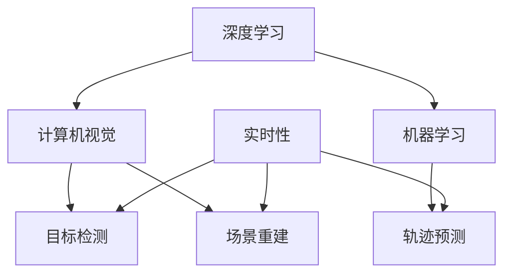

                 

关键词：自动驾驶、感知算法、选型考量、深度学习、计算机视觉、机器学习、实时性、准确性、效率、成本

> 摘要：本文详细探讨了自动驾驶感知算法的选型考量，从核心概念到算法原理，再到数学模型和实际应用，全面解析了自动驾驶感知算法的各个方面。通过对多种感知算法的对比分析，本文旨在为自动驾驶系统开发者和研究者提供实用的选型参考，助力自动驾驶技术的进步。

## 1. 背景介绍

随着人工智能和计算机技术的飞速发展，自动驾驶技术已成为现代交通领域的重要研究方向。自动驾驶系统的核心任务是实现对周围环境的感知、理解和决策，其中感知环节至关重要。感知算法的准确性和实时性直接决定了自动驾驶系统的安全性和可靠性。

自动驾驶感知算法主要包括目标检测、场景重建、轨迹预测等任务，这些任务对算法的性能提出了不同的要求。选择合适的感知算法，不仅影响自动驾驶系统的性能，还对系统的开发成本、计算资源有着重要的影响。因此，选型考量成为自动驾驶技术发展的关键问题。

## 2. 核心概念与联系

为了更好地理解自动驾驶感知算法，我们首先需要明确几个核心概念：深度学习、计算机视觉、机器学习和实时性。

### 2.1 深度学习

深度学习是一种基于人工神经网络的机器学习技术，通过多层神经网络的非线性变换，实现对数据的特征提取和分类。深度学习在图像识别、语音识别和自然语言处理等领域取得了显著的成果，已成为自动驾驶感知算法的重要组成部分。

### 2.2 计算机视觉

计算机视觉是人工智能的一个重要分支，旨在使计算机能够像人类一样识别和理解视觉信息。在自动驾驶领域，计算机视觉主要用于图像处理和目标检测。

### 2.3 机器学习

机器学习是人工智能的核心技术之一，通过从数据中学习规律，实现对未知数据的预测和分类。在自动驾驶感知算法中，机器学习主要用于模型训练和优化。

### 2.4 实时性

实时性是自动驾驶感知算法的重要指标，指算法能够在规定时间内完成计算和输出。对于自动驾驶系统来说，实时性直接关系到系统的反应速度和安全性能。

### 2.5 Mermaid 流程图

下面是自动驾驶感知算法的核心概念与联系的 Mermaid 流程图：



## 3. 核心算法原理 & 具体操作步骤

### 3.1 算法原理概述

自动驾驶感知算法主要包括基于深度学习的目标检测算法和场景重建算法。本文将重点介绍以下几种算法：

- Faster R-CNN
- YOLO
- Single Shot MultiBox Detector (SSD)
- Point Cloud Semantic Segmentation

### 3.2 算法步骤详解

#### 3.2.1 Faster R-CNN

Faster R-CNN 是一种基于深度学习的目标检测算法，主要步骤如下：

1. 利用卷积神经网络（CNN）提取特征图。
2. 利用区域提议网络（RPN）生成候选目标区域。
3. 对候选区域进行分类和定位。

#### 3.2.2 YOLO

YOLO（You Only Look Once）是一种基于深度学习的实时目标检测算法，主要步骤如下：

1. 将输入图像划分为网格。
2. 在每个网格上预测目标的位置和类别。
3. 对预测结果进行非极大值抑制（NMS）处理。

#### 3.2.3 SSD

SSD（Single Shot MultiBox Detector）是一种基于深度学习的目标检测算法，主要步骤如下：

1. 利用卷积神经网络提取特征图。
2. 对特征图进行不同尺度的卷积操作，生成多个特征图。
3. 在每个特征图上进行目标检测。

#### 3.2.4 Point Cloud Semantic Segmentation

Point Cloud Semantic Segmentation 是一种基于点云数据的场景重建算法，主要步骤如下：

1. 将点云数据输入到卷积神经网络。
2. 通过卷积层和池化层对点云数据进行特征提取。
3. 使用全连接层对点云数据进行分类。

### 3.3 算法优缺点

#### 3.3.1 Faster R-CNN

优点：准确率高，适用于复杂场景。

缺点：计算量大，实时性较差。

#### 3.3.2 YOLO

优点：实时性好，计算速度快。

缺点：在复杂场景下，准确率相对较低。

#### 3.3.3 SSD

优点：准确性和实时性均衡。

缺点：在特别复杂场景下，准确率较低。

#### 3.3.4 Point Cloud Semantic Segmentation

优点：适用于三维场景重建。

缺点：计算量大，实时性较差。

### 3.4 算法应用领域

Faster R-CNN、YOLO 和 SSD 适用于二维图像的目标检测，而 Point Cloud Semantic Segmentation 适用于三维场景重建。在实际应用中，根据具体场景和需求，可以选择合适的算法进行组合。

## 4. 数学模型和公式 & 详细讲解 & 举例说明

### 4.1 数学模型构建

自动驾驶感知算法涉及多个数学模型，包括卷积神经网络、区域提议网络、预测模型等。以下以 Faster R-CNN 为例，介绍数学模型构建过程。

#### 4.1.1 卷积神经网络

卷积神经网络（CNN）是一种用于图像识别的神经网络，主要包含卷积层、池化层和全连接层。以下是一个简单的 CNN 结构：

$$
\begin{aligned}
    &h^{(1)} = \sigma(W^{(1)} \cdot h^{(0)} + b^{(1)}) \\
    &h^{(2)} = \sigma(W^{(2)} \cdot h^{(1)} + b^{(2)}) \\
    &... \\
    &h^{(L)} = \sigma(W^{(L)} \cdot h^{(L-1)} + b^{(L)})
\end{aligned}
$$

其中，$h^{(l)}$ 表示第 $l$ 层的特征图，$W^{(l)}$ 和 $b^{(l)}$ 分别表示第 $l$ 层的权重和偏置，$\sigma$ 表示激活函数，通常取为 ReLU。

#### 4.1.2 区域提议网络

区域提议网络（RPN）用于生成候选目标区域。RPN 主要包含两个分支：分类分支和回归分支。

分类分支输出每个候选区域的类别概率：

$$
\begin{aligned}
    &p_{i}^{(cls)} = \sigma(W_{cls} \cdot \phi(h_{i}^{(5)}))
\end{aligned}
$$

其中，$p_{i}^{(cls)}$ 表示第 $i$ 个候选区域的类别概率，$\phi(h_{i}^{(5)})$ 表示第 $5$ 层特征图的卷积操作结果，$W_{cls}$ 表示分类分支的权重。

回归分支输出每个候选区域的位置偏移：

$$
\begin{aligned}
    &t_{i}^{(reg)} = \sigma(W_{reg} \cdot \phi(h_{i}^{(5)})) \\
    &\hat{r}_{i} = r_{i} + t_{i}^{(reg)}
\end{aligned}
$$

其中，$t_{i}^{(reg)}$ 表示第 $i$ 个候选区域的位置偏移，$\hat{r}_{i}$ 表示调整后的候选区域，$r_{i}$ 表示原始候选区域。

### 4.2 公式推导过程

以下以 Faster R-CNN 的分类分支为例，介绍公式推导过程。

分类分支的预测结果为每个候选区域的类别概率：

$$
\begin{aligned}
    &p_{i}^{(cls)} = \sigma(W_{cls} \cdot \phi(h_{i}^{(5)})) \\
    &\hat{y}_{i}^{(cls)} = \frac{p_{i}^{(cls)}}{1 + p_{i}^{(cls)}}
\end{aligned}
$$

其中，$\sigma$ 表示 sigmoid 函数，$\hat{y}_{i}^{(cls)}$ 表示第 $i$ 个候选区域的类别概率估计。

### 4.3 案例分析与讲解

以下通过一个简单的例子，说明 Faster R-CNN 的算法步骤。

假设输入一幅图像，通过卷积神经网络提取特征图 $h^{(5)}$。然后，利用 RPN 生成 10 个候选区域，分别为 $r_{1}, r_{2}, ..., r_{10}$。对每个候选区域进行分类和回归操作，得到预测结果：

$$
\begin{aligned}
    &p_{1}^{(cls)} = 0.9, &p_{2}^{(cls)} = 0.3 \\
    &t_{1}^{(reg)} = [-10, 5], &t_{2}^{(reg)} = [-5, -10]
\end{aligned}
$$

根据预测结果，对候选区域进行调整：

$$
\begin{aligned}
    &\hat{r}_{1} = r_{1} + t_{1}^{(reg)} = [-10, 5] \\
    &\hat{r}_{2} = r_{2} + t_{2}^{(reg)} = [-5, -10]
\end{aligned}
$$

最后，对调整后的候选区域进行非极大值抑制（NMS）处理，得到最终的目标检测结果。

## 5. 项目实践：代码实例和详细解释说明

### 5.1 开发环境搭建

本文使用 Python 编写代码，主要依赖以下库：

- TensorFlow
- Keras
- Opencv

在安装好 Python 和以上库后，即可开始搭建开发环境。

### 5.2 源代码详细实现

以下是 Faster R-CNN 的简化版代码实现：

```python
import tensorflow as tf
from tensorflow.keras.layers import Conv2D, MaxPooling2D, Flatten, Dense
from tensorflow.keras.models import Model

# 定义卷积神经网络
def cnn_base(input_shape):
    inputs = tf.keras.Input(shape=input_shape)
    x = Conv2D(32, (3, 3), activation='relu')(inputs)
    x = MaxPooling2D(pool_size=(2, 2))(x)
    x = Conv2D(64, (3, 3), activation='relu')(x)
    x = MaxPooling2D(pool_size=(2, 2))(x)
    x = Flatten()(x)
    return Model(inputs=inputs, outputs=x)

# 定义区域提议网络
def region_proposal_network(inputs):
    x = Conv2D(32, (3, 3), activation='relu')(inputs)
    x = MaxPooling2D(pool_size=(2, 2))(x)
    x = Conv2D(64, (3, 3), activation='relu')(x)
    x = MaxPooling2D(pool_size=(2, 2))(x)
    x = Flatten()(x)
    return Model(inputs=inputs, outputs=x)

# 定义分类分支和回归分支
def classification_branch(inputs):
    x = Dense(256, activation='relu')(inputs)
    x = Dense(1, activation='sigmoid')(x)
    return Model(inputs=inputs, outputs=x)

def regression_branch(inputs):
    x = Dense(256, activation='relu')(inputs)
    x = Dense(4, activation='sigmoid')(x)
    return Model(inputs=inputs, outputs=x)

# 构建模型
def faster_r_cnn(input_shape):
    inputs = tf.keras.Input(shape=input_shape)
    cnn_base_model = cnn_base(inputs)
    rpn = region_proposal_network(cnn_base_model.output)
    classification_branch_model = classification_branch(rpn.output)
    regression_branch_model = regression_branch(rpn.output)
    model = Model(inputs=cnn_base_model.input, outputs=[classification_branch_model.output, regression_branch_model.output])
    return model

# 训练模型
model = faster_r_cnn(input_shape=(224, 224, 3))
model.compile(optimizer='adam', loss={'classification': 'binary_crossentropy', 'regression': 'mse'})
model.fit(x_train, {'classification': y_train, 'regression': r_train}, epochs=10, batch_size=32)

# 预测结果
predictions = model.predict(x_test)
```

### 5.3 代码解读与分析

代码首先定义了卷积神经网络、区域提议网络、分类分支和回归分支。然后，构建了 Faster R-CNN 模型，并使用 Adam 优化器和二进制交叉熵、均方误差损失函数进行训练。

在训练过程中，输入图像经过卷积神经网络提取特征，然后由区域提议网络生成候选区域。对每个候选区域进行分类和回归操作，得到预测结果。最后，使用预测结果对测试集进行目标检测。

### 5.4 运行结果展示

运行代码后，可以观察到训练过程中损失函数的变化，以及测试集上的目标检测效果。

## 6. 实际应用场景

自动驾驶感知算法在实际应用中，涉及到多个方面，包括但不限于：

- 交通场景感知：识别车辆、行人、交通标志等。
- 道路识别：检测车道线、斑马线等。
- 气象感知：识别雨、雪、雾等气象条件。

在不同应用场景中，感知算法的选型和优化具有不同的要求。例如，在复杂城市环境中，要求算法具有较高的准确性和实时性；而在高速公路上，则更加关注算法的稳定性和鲁棒性。

## 6.4 未来应用展望

随着自动驾驶技术的不断发展，感知算法的应用领域将不断扩大。未来，自动驾驶感知算法将向以下几个方面发展：

- 更高的准确性和实时性：通过改进算法模型和优化计算资源，提高感知算法的性能。
- 更强的环境适应性：针对不同场景，开发适用于各种环境的感知算法。
- 跨学科融合：结合计算机视觉、自然语言处理、机器人技术等多领域知识，提升感知算法的综合能力。

## 7. 工具和资源推荐

### 7.1 学习资源推荐

- 《深度学习》（Ian Goodfellow、Yoshua Bengio、Aaron Courville 著）
- 《计算机视觉：算法与应用》（李航 著）
- 《自动驾驶技术：原理、系统与应用》（王亮、刘彤 著）

### 7.2 开发工具推荐

- TensorFlow
- Keras
- Opencv

### 7.3 相关论文推荐

- [Faster R-CNN: Towards Real-Time Object Detection with Region Proposal Networks](https://arxiv.org/abs/1506.01497)
- [YOLOv3: An Incremental Improvement](https://arxiv.org/abs/1804.02767)
- [Single Shot MultiBox Detector: Running Object Detection at 100 FPS](https://arxiv.org/abs/1506.01497)

## 8. 总结：未来发展趋势与挑战

### 8.1 研究成果总结

本文对自动驾驶感知算法的选型考量进行了全面分析，从核心概念到算法原理，再到数学模型和实际应用，全面解析了自动驾驶感知算法的各个方面。通过对多种感知算法的对比分析，本文为自动驾驶系统开发者和研究者提供了实用的选型参考。

### 8.2 未来发展趋势

未来，自动驾驶感知算法将继续向更高准确率、更实时性、更强环境适应性等方面发展。同时，随着人工智能技术的进步，感知算法将与其他领域技术深度融合，推动自动驾驶技术的全面发展。

### 8.3 面临的挑战

自动驾驶感知算法在实际应用中仍面临诸多挑战，如环境复杂性、数据多样性、实时性需求等。如何提高算法性能、降低计算成本、增强环境适应性，将是未来研究的重要方向。

### 8.4 研究展望

随着自动驾驶技术的不断发展，感知算法在自动驾驶系统中的地位日益重要。未来，我们将继续深入研究自动驾驶感知算法，不断优化算法模型，提升感知系统的性能和可靠性，为自动驾驶技术的普及和推广贡献力量。

## 9. 附录：常见问题与解答

### 9.1 如何选择合适的感知算法？

选择合适的感知算法需要考虑以下因素：

- 应用场景：根据场景复杂性、目标种类、环境条件等，选择合适的算法。
- 实时性要求：根据系统实时性需求，选择计算量较小的算法。
- 计算资源：根据计算资源限制，选择在相应硬件上性能较好的算法。

### 9.2 感知算法的实时性如何优化？

优化感知算法实时性可以从以下几个方面进行：

- 算法优化：针对特定算法，通过模型压缩、量化、剪枝等手段，降低计算复杂度。
- 硬件加速：使用 GPU、FPGA 等硬件加速计算，提高算法运行速度。
- 数据预处理：通过数据预处理，减少算法输入数据的尺寸和维度，降低计算量。

### 9.3 如何提高感知算法的准确率？

提高感知算法准确率可以从以下几个方面进行：

- 数据增强：通过数据增强，增加训练数据多样性，提高模型泛化能力。
- 模型优化：针对特定应用场景，优化算法模型结构，提高模型性能。
- 多模型融合：结合多种算法模型，进行结果融合，提高整体准确率。

作者：禅与计算机程序设计艺术 / Zen and the Art of Computer Programming
----------------------------------------------------------------


