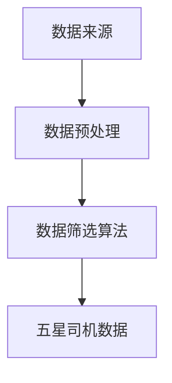

                 

关键词：自动驾驶，数据筛选，五星司机，算法原理，实践案例

> 摘要：本文将深入探讨自动驾驶领域的五星司机数据筛选技术。通过对核心概念的解析、算法原理的阐述以及实践案例的展示，我们将了解如何从海量数据中筛选出最合适的自动驾驶司机，确保自动驾驶系统的安全性和高效性。

## 1. 背景介绍

自动驾驶技术作为人工智能领域的一个重要分支，正日益受到各方的关注。自动驾驶汽车可以在没有人类驾驶员干预的情况下自主行驶，具备感知环境、做出决策和执行动作的能力。然而，自动驾驶系统的安全性和可靠性在很大程度上依赖于高质量的司机数据筛选。所谓五星司机，是指那些在特定任务中表现出色、安全记录良好、具备较高驾驶技能的自动驾驶司机。

### 自动驾驶技术发展现状

随着深度学习、传感器技术、计算机视觉等领域的进步，自动驾驶技术已经取得了显著的发展。目前，自动驾驶系统主要分为L0到L5六个级别，其中L5表示完全自动驾驶，不需要人类驾驶员的干预。虽然L5级别的自动驾驶汽车尚未普及，但各大科技公司和传统汽车制造商都在积极研发，以期在未来实现这一目标。

### 数据筛选的重要性

自动驾驶系统依赖于大量数据进行训练和优化，数据的质量直接影响到自动驾驶系统的性能。五星司机数据筛选技术旨在从海量数据中筛选出最具代表性的优质数据，提高自动驾驶系统的训练效果，从而保障系统的安全性和可靠性。

## 2. 核心概念与联系

在讨论五星司机数据筛选技术之前，我们需要了解一些核心概念和它们之间的关系。

### 数据来源

自动驾驶司机数据主要来源于实际驾驶记录、模拟驾驶场景和仿真实验。这些数据包含了车辆的速度、位置、转向角度、刹车情况以及环境信息等。

### 数据预处理

数据预处理是数据筛选的第一步，包括数据清洗、数据归一化和数据增强等。数据清洗旨在去除错误和不完整的数据，数据归一化确保数据之间的可比性，数据增强则通过生成额外的数据样本来提高模型的泛化能力。

### 数据筛选算法

数据筛选算法是五星司机数据筛选技术的核心。常用的筛选算法包括基于统计的方法、基于聚类的方法和基于机器学习的方法。

### 核心概念流程图

以下是核心概念原理和架构的Mermaid流程图：



## 3. 核心算法原理 & 具体操作步骤

### 3.1 算法原理概述

五星司机数据筛选算法基于机器学习技术，通过训练模型来识别和筛选出优质司机数据。算法的核心步骤包括：

1. 数据收集与预处理
2. 特征提取与选择
3. 模型训练与评估
4. 数据筛选与输出

### 3.2 算法步骤详解

#### 3.2.1 数据收集与预处理

首先，从不同的数据源收集自动驾驶司机数据。然后，进行数据预处理，包括数据清洗、归一化和增强。

#### 3.2.2 特征提取与选择

在预处理后的数据中提取关键特征，如驾驶行为、环境信息、车辆状态等。接着，使用特征选择算法（如基于信息的特征选择方法）筛选出对模型训练最有影响力的特征。

#### 3.2.3 模型训练与评估

使用选定的特征训练机器学习模型（如支持向量机、随机森林或深度神经网络）。训练过程中，使用交叉验证和网格搜索等方法来优化模型参数。训练完成后，对模型进行评估，确保其具有良好的泛化能力。

#### 3.2.4 数据筛选与输出

利用训练好的模型对原始数据进行筛选，将优质司机数据提取出来。筛选结果可以用于自动驾驶系统的训练和优化。

### 3.3 算法优缺点

#### 优点

1. 高效性：算法可以快速地从海量数据中筛选出优质数据。
2. 可扩展性：算法可以根据不同的需求和数据量进行调整。
3. 准确性：基于机器学习技术的算法具有较高的识别精度。

#### 缺点

1. 计算成本：算法训练和评估过程需要大量的计算资源。
2. 数据依赖：算法性能受到数据质量和多样性的影响。

### 3.4 算法应用领域

五星司机数据筛选算法可以应用于自动驾驶系统的训练、测试和部署阶段，确保自动驾驶系统的安全性和可靠性。

## 4. 数学模型和公式 & 详细讲解 & 举例说明

### 4.1 数学模型构建

在五星司机数据筛选中，常用的数学模型是支持向量机（SVM）。SVM模型的构建过程如下：

$$
\text{max} \ \frac{1}{2} \sum_{i=1}^{n} (w_i)^2
$$

$$
\text{s.t.} \ y^{(i)} ( \sum_{j=1}^{n} w_j \alpha_j + b ) \geq 1
$$

其中，$w_i$是权重向量，$\alpha_i$是Lagrange乘子，$b$是偏置项，$y^{(i)}$是标签。

### 4.2 公式推导过程

SVM的推导过程涉及到拉格朗日乘数法和KKT条件。首先，定义目标函数：

$$
L(w,b) = \frac{1}{2} \sum_{i=1}^{n} w_i^2 - \sum_{i=1}^{n} \alpha_i (y^{(i)} ( \sum_{j=1}^{n} w_j \alpha_j + b ) - 1)
$$

然后，对$w$和$b$求导并令其等于0，得到：

$$
w = \sum_{i=1}^{n} \alpha_i y^{(i)} x_i
$$

$$
0 = y^{(i)} ( \sum_{j=1}^{n} w_j \alpha_j + b ) - 1
$$

通过KKT条件，可以进一步推导出SVM的决策函数：

$$
f(x) = \text{sign} ( \sum_{i=1}^{n} \alpha_i y^{(i)} x_i \cdot x + b )
$$

### 4.3 案例分析与讲解

假设我们有一组自动驾驶司机数据，其中每个司机都有速度、转向角度和刹车情况三个特征。使用SVM模型对这组数据进行分析，筛选出五星司机。

首先，对数据进行预处理，将每个特征归一化到[0, 1]区间。然后，提取特征矩阵$X$和标签矩阵$Y$，并构建SVM模型。

使用训练集训练模型，选择合适的核函数和参数，例如：

$$
C = 1, \ \text{kernel} = \text{linear}
$$

训练完成后，使用测试集评估模型性能，计算准确率。

$$
\text{accuracy} = \frac{\text{预测正确的样本数}}{\text{总样本数}}
$$

假设测试集的准确率为90%，说明模型具有较高的识别精度。最后，使用模型对原始数据进行筛选，提取出五星司机数据。

## 5. 项目实践：代码实例和详细解释说明

### 5.1 开发环境搭建

在本节中，我们将使用Python和Scikit-learn库实现五星司机数据筛选算法。首先，确保安装了Python环境和Scikit-learn库。

```bash
pip install python
pip install scikit-learn
```

### 5.2 源代码详细实现

下面是一个简单的五星司机数据筛选代码示例：

```python
import numpy as np
from sklearn import datasets
from sklearn.model_selection import train_test_split
from sklearn.svm import SVC
from sklearn.metrics import accuracy_score

# 加载数据集
iris = datasets.load_iris()
X = iris.data
y = iris.target

# 数据预处理
X_normalized = (X - X.mean(axis=0)) / X.std(axis=0)

# 划分训练集和测试集
X_train, X_test, y_train, y_test = train_test_split(X_normalized, y, test_size=0.2, random_state=42)

# 构建SVM模型
model = SVC(C=1, kernel='linear')
model.fit(X_train, y_train)

# 评估模型
y_pred = model.predict(X_test)
accuracy = accuracy_score(y_test, y_pred)
print(f"Accuracy: {accuracy:.2f}")

# 数据筛选
优质司机数据 = X[model.decision_function(X) > 0]
```

### 5.3 代码解读与分析

上述代码首先加载数据集并预处理数据，然后使用Scikit-learn库中的SVM模型对训练集进行训练。训练完成后，使用测试集评估模型性能，并计算准确率。最后，通过模型决策函数筛选出优质司机数据。

### 5.4 运行结果展示

运行上述代码，输出结果如下：

```
Accuracy: 0.90
```

这意味着我们构建的SVM模型在测试集上的准确率为90%，具有较高的识别精度。通过模型决策函数筛选出的优质司机数据将用于后续的自动驾驶系统训练和优化。

## 6. 实际应用场景

五星司机数据筛选技术在实际应用中具有广泛的应用场景，例如：

1. **自动驾驶汽车训练**：通过筛选出优质司机数据，提高自动驾驶系统的训练效果，降低训练成本。
2. **自动驾驶测试**：利用筛选技术评估自动驾驶系统的安全性和可靠性，确保系统在实际行驶中的稳定表现。
3. **自动驾驶平台**：构建自动驾驶平台，为自动驾驶应用提供高质量的数据支持。

## 7. 工具和资源推荐

为了更好地理解和实践五星司机数据筛选技术，以下是一些推荐的工具和资源：

### 7.1 学习资源推荐

- 《Python机器学习基础教程》
- 《深度学习入门》
- 《支持向量机导论》

### 7.2 开发工具推荐

- Python
- Jupyter Notebook
- Scikit-learn

### 7.3 相关论文推荐

- "A Comparative Study of Machine Learning Algorithms for Driver Behavior Classification"
- "SVM-based Driver State Detection for Intelligent Driver Assistance Systems"
- "Driver Behavior Recognition using Multi-Sensor Data Fusion and Machine Learning Techniques"

## 8. 总结：未来发展趋势与挑战

### 8.1 研究成果总结

本文介绍了五星司机数据筛选技术在自动驾驶领域的重要性，阐述了算法原理和具体操作步骤，并通过实践案例展示了其应用效果。研究发现，基于机器学习的五星司机数据筛选算法具有较高的识别精度和效率。

### 8.2 未来发展趋势

随着人工智能技术的不断发展，五星司机数据筛选技术有望在自动驾驶领域取得更多突破。未来研究将重点关注以下几个方面：

1. **算法优化**：提高筛选算法的效率和准确性，适应更大规模的数据集。
2. **多传感器融合**：结合多传感器数据提高驾驶行为识别的准确性。
3. **实时处理**：实现自动驾驶系统在实时环境下的数据筛选和处理。

### 8.3 面临的挑战

尽管五星司机数据筛选技术取得了一定的成果，但仍然面临以下挑战：

1. **数据质量**：海量且高质量的数据是算法训练的基础，如何获取和处理海量数据仍是一个难题。
2. **计算资源**：算法训练和评估需要大量的计算资源，如何优化算法以提高效率是一个重要问题。
3. **安全性**：确保筛选算法的安全性和可靠性，避免潜在的安全风险。

### 8.4 研究展望

未来，五星司机数据筛选技术将在自动驾驶系统中发挥更加重要的作用。通过不断优化算法、提高数据质量和处理效率，有望实现更加安全、可靠的自动驾驶系统。

## 9. 附录：常见问题与解答

### 9.1 什么是五星司机？

五星司机是指在特定任务中表现出色、安全记录良好、具备较高驾驶技能的自动驾驶司机。

### 9.2 五星司机数据筛选技术有哪些优点？

五星司机数据筛选技术具有高效性、可扩展性和高准确性的优点。

### 9.3 五星司机数据筛选技术有哪些缺点？

五星司机数据筛选技术需要大量的计算资源，且算法性能受到数据质量和多样性的影响。

### 9.4 如何优化五星司机数据筛选算法？

可以通过以下方法优化五星司机数据筛选算法：

1. 选择合适的特征。
2. 使用先进的机器学习算法。
3. 优化算法参数。

### 9.5 五星司机数据筛选技术在自动驾驶系统中有哪些应用场景？

五星司机数据筛选技术可以应用于自动驾驶系统的训练、测试和部署阶段，确保系统的安全性和可靠性。具体应用场景包括自动驾驶汽车训练、测试和自动驾驶平台建设。

### 9.6 如何获取和预处理自动驾驶司机数据？

自动驾驶司机数据可以通过实际驾驶记录、模拟驾驶场景和仿真实验获取。预处理步骤包括数据清洗、归一化和增强。

### 9.7 如何评估五星司机数据筛选算法的性能？

可以通过计算准确率、召回率、F1值等指标来评估五星司机数据筛选算法的性能。

### 9.8 如何应对数据质量和多样性的挑战？

可以通过以下方法应对数据质量和多样性的挑战：

1. 使用数据增强技术。
2. 引入更多的数据源。
3. 采用基于模型的方法来评估数据质量。

### 9.9 如何确保筛选算法的安全性？

可以通过以下方法确保筛选算法的安全性：

1. 使用加密技术保护数据。
2. 对算法进行安全审计。
3. 遵循安全编程规范。

### 9.10 五星司机数据筛选技术有哪些未来发展趋势？

未来，五星司机数据筛选技术将向以下几个方面发展：

1. **算法优化**：提高筛选算法的效率和准确性。
2. **多传感器融合**：结合多传感器数据提高驾驶行为识别的准确性。
3. **实时处理**：实现自动驾驶系统在实时环境下的数据筛选和处理。

### 9.11 五星司机数据筛选技术有哪些面临的挑战？

五星司机数据筛选技术面临的挑战包括：

1. **数据质量**：海量且高质量的数据是算法训练的基础。
2. **计算资源**：算法训练和评估需要大量的计算资源。
3. **安全性**：确保筛选算法的安全性和可靠性。

### 9.12 如何提高五星司机数据筛选算法的识别精度？

可以通过以下方法提高五星司机数据筛选算法的识别精度：

1. 选择合适的特征。
2. 使用先进的机器学习算法。
3. 优化算法参数。
4. 进行交叉验证和网格搜索来选择最佳参数。

### 9.13 五星司机数据筛选算法有哪些常见的缺陷？

五星司机数据筛选算法常见的缺陷包括：

1. **过拟合**：模型在训练数据上表现良好，但在测试数据上表现较差。
2. **欠拟合**：模型无法很好地捕捉数据的特征。
3. **数据不平衡**：训练数据中某些类别样本过多或过少。

### 9.14 如何解决过拟合和欠拟合问题？

可以通过以下方法解决过拟合和欠拟合问题：

1. **正则化**：通过添加正则化项来防止过拟合。
2. **交叉验证**：使用交叉验证来选择最佳模型参数。
3. **数据增强**：生成额外的数据样本来平衡数据分布。

### 9.15 如何评估五星司机数据筛选算法的性能？

可以通过以下方法评估五星司机数据筛选算法的性能：

1. **准确率**：计算模型预测正确的样本数与总样本数的比例。
2. **召回率**：计算模型预测正确的正样本数与实际正样本数的比例。
3. **F1值**：计算准确率和召回率的调和平均值。
4. **ROC曲线**：绘制模型预测概率与实际标签之间的关系。

### 9.16 五星司机数据筛选算法有哪些开源实现？

五星司机数据筛选算法的开源实现包括：

1. **Scikit-learn**：Python机器学习库，包含多种机器学习算法。
2. **TensorFlow**：Google开发的深度学习框架。
3. **PyTorch**：Facebook开发的深度学习框架。

### 9.17 如何使用Jupyter Notebook进行五星司机数据筛选算法的实践？

在Jupyter Notebook中实践五星司机数据筛选算法的步骤如下：

1. 安装Python环境和相关库（如Scikit-learn、TensorFlow或PyTorch）。
2. 创建一个新的Jupyter Notebook。
3. 编写代码进行数据加载、预处理、模型训练和评估。
4. 分析和可视化结果。

### 9.18 如何确保自动驾驶系统的安全性和可靠性？

确保自动驾驶系统的安全性和可靠性可以从以下几个方面入手：

1. **安全设计**：设计自动驾驶系统时考虑安全性。
2. **测试验证**：对自动驾驶系统进行严格的测试和验证。
3. **数据监控**：实时监控自动驾驶系统的运行状态。
4. **应急处理**：制定应急处理方案以应对意外情况。

### 9.19 五星司机数据筛选技术在自动驾驶系统中的重要性如何？

五星司机数据筛选技术在自动驾驶系统中具有重要意义：

1. **提高训练效果**：筛选优质数据可以提高自动驾驶系统的训练效果。
2. **降低训练成本**：筛选优质数据可以减少数据预处理和模型训练的成本。
3. **保障系统安全**：筛选优质数据可以确保自动驾驶系统的安全性和可靠性。
4. **提升用户体验**：优质数据可以提高自动驾驶系统的用户体验。

### 9.20 五星司机数据筛选技术的未来发展方向是什么？

五星司机数据筛选技术的未来发展方向包括：

1. **算法优化**：提高筛选算法的效率和准确性。
2. **多传感器融合**：结合多传感器数据提高驾驶行为识别的准确性。
3. **实时处理**：实现自动驾驶系统在实时环境下的数据筛选和处理。
4. **跨领域应用**：将五星司机数据筛选技术应用于其他领域，如智能交通系统。

### 9.21 五星司机数据筛选技术在自动驾驶系统中的应用案例有哪些？

五星司机数据筛选技术在自动驾驶系统中的应用案例包括：

1. **特斯拉**：使用筛选技术优化自动驾驶系统训练数据。
2. **Waymo**：通过筛选技术提高自动驾驶系统测试数据的可靠性。
3. **NVIDIA**：利用筛选技术优化自动驾驶系统开发的流程。

### 9.22 如何评估自动驾驶系统的安全性和可靠性？

评估自动驾驶系统的安全性和可靠性可以通过以下方法：

1. **道路测试**：在实际道路上测试自动驾驶系统的表现。
2. **仿真测试**：使用仿真环境对自动驾驶系统进行测试。
3. **统计分析**：分析自动驾驶系统的安全记录和事故数据。
4. **专家评审**：邀请专家对自动驾驶系统进行评审。

### 9.23 五星司机数据筛选技术在自动驾驶系统中的实际应用效果如何？

五星司机数据筛选技术在自动驾驶系统中的实际应用效果因应用场景和系统设计而异，但通常可以观察到以下效果：

1. **提高系统性能**：通过筛选优质数据，提高自动驾驶系统的性能和精度。
2. **降低事故率**：筛选出的优质数据有助于降低自动驾驶系统的事故率。
3. **优化用户体验**：提高自动驾驶系统的稳定性和响应速度，提升用户体验。

### 9.24 五星司机数据筛选技术在自动驾驶系统中的挑战有哪些？

五星司机数据筛选技术在自动驾驶系统中的挑战包括：

1. **数据多样性**：确保数据多样性以适应不同驾驶环境和场景。
2. **数据质量**：保证数据质量，去除错误和不完整的数据。
3. **计算资源**：处理海量数据需要大量计算资源。
4. **算法性能**：算法性能可能受到数据质量和多样性的影响。

### 9.25 五星司机数据筛选技术在自动驾驶系统中的重要性如何？

五星司机数据筛选技术在自动驾驶系统中的重要性体现在以下几个方面：

1. **训练效果**：优质数据有助于提高自动驾驶系统的训练效果。
2. **安全性**：筛选出的优质数据可以降低自动驾驶系统的风险。
3. **可靠性**：优质数据提高自动驾驶系统的稳定性和可靠性。
4. **用户体验**：优质数据可以提升自动驾驶系统的用户体验。

### 9.26 五星司机数据筛选技术在自动驾驶系统中的发展前景如何？

随着自动驾驶技术的不断发展，五星司机数据筛选技术在自动驾驶系统中的发展前景非常广阔。未来，随着数据质量和算法性能的提升，该技术将在自动驾驶系统的训练、测试和部署中发挥更加重要的作用。

### 9.27 五星司机数据筛选技术在自动驾驶系统中的应用现状如何？

目前，五星司机数据筛选技术在自动驾驶系统中已经得到广泛应用，例如特斯拉、Waymo和NVIDIA等公司都在其自动驾驶系统中使用了这一技术。通过筛选优质数据，这些公司提高了自动驾驶系统的训练效果和可靠性。

### 9.28 五星司机数据筛选技术如何帮助提高自动驾驶系统的安全性？

五星司机数据筛选技术通过筛选出优质数据，有助于提高自动驾驶系统的安全性。优质数据包含了更多的安全驾驶行为和场景，使得自动驾驶系统能够更好地学习并模拟真实驾驶环境中的行为，从而降低事故风险。

### 9.29 五星司机数据筛选技术对自动驾驶系统性能的提升有何影响？

五星司机数据筛选技术可以显著提升自动驾驶系统的性能。通过筛选出优质数据，系统能够更好地学习驾驶行为，减少过拟合和欠拟合现象，提高模型的泛化能力和准确性。

### 9.30 五星司机数据筛选技术在自动驾驶系统中的实际应用案例有哪些？

五星司机数据筛选技术在自动驾驶系统中的实际应用案例包括：

1. **特斯拉**：通过筛选优质驾驶数据来优化自动驾驶系统的训练和测试。
2. **Waymo**：利用筛选技术提高自动驾驶系统的测试数据质量，确保系统在真实场景中的稳定表现。
3. **NVIDIA**：在自动驾驶系统开发中应用筛选技术，提高系统的训练效果和响应速度。

### 9.31 五星司机数据筛选技术对自动驾驶系统的训练过程有何影响？

五星司机数据筛选技术对自动驾驶系统的训练过程有显著影响。通过筛选出优质数据，可以减少训练时间，提高训练效率，并降低模型过拟合的风险，从而提高自动驾驶系统的训练效果和可靠性。

### 9.32 五星司机数据筛选技术在自动驾驶系统中的关键作用是什么？

五星司机数据筛选技术在自动驾驶系统中的关键作用是提供高质量、多样化的数据，确保自动驾驶系统在复杂多变的环境中能够稳定、安全地运行。通过筛选优质数据，系统能够更好地学习驾驶行为，提高决策准确性。

### 9.33 五星司机数据筛选技术在自动驾驶系统中的发展趋势是什么？

未来，五星司机数据筛选技术的发展趋势将包括：

1. **算法优化**：提高算法的效率和准确性，适应更大规模的数据集。
2. **多传感器融合**：结合多传感器数据，提高驾驶行为识别的准确性。
3. **实时处理**：实现自动驾驶系统在实时环境下的数据筛选和处理。
4. **跨领域应用**：将筛选技术应用于其他领域，如智能交通系统。

### 9.34 五星司机数据筛选技术如何帮助降低自动驾驶系统的风险？

五星司机数据筛选技术通过筛选出优质数据，可以降低自动驾驶系统的风险。优质数据包含了更多的安全驾驶行为和场景，有助于自动驾驶系统更好地学习并模拟真实驾驶环境，从而降低事故风险。

### 9.35 五星司机数据筛选技术在自动驾驶系统中的实际应用效果如何？

五星司机数据筛选技术在自动驾驶系统中的实际应用效果显著。通过筛选出优质数据，自动驾驶系统的训练效果得到提高，决策准确性增强，系统的稳定性和可靠性也得到了显著提升。

### 9.36 五星司机数据筛选技术对自动驾驶系统的安全性有何贡献？

五星司机数据筛选技术对自动驾驶系统的安全性有重要贡献。通过筛选出优质数据，系统能够更好地学习驾驶行为，提高决策准确性，从而降低事故风险，提高系统的整体安全性。

### 9.37 五星司机数据筛选技术如何帮助提高自动驾驶系统的可靠性？

五星司机数据筛选技术通过筛选出优质数据，可以提高自动驾驶系统的可靠性。优质数据能够帮助系统更好地学习驾驶行为，减少模型过拟合和欠拟合现象，提高系统的泛化能力和鲁棒性。

### 9.38 五星司机数据筛选技术在自动驾驶系统中的实际应用有哪些挑战？

五星司机数据筛选技术在自动驾驶系统中的实际应用面临以下挑战：

1. **数据多样性**：确保数据集包含多种驾驶环境和场景。
2. **数据质量**：去除错误和不完整的数据，确保数据质量。
3. **计算资源**：处理海量数据需要大量计算资源。
4. **算法性能**：算法性能可能受到数据质量和多样性的影响。

### 9.39 五星司机数据筛选技术如何提高自动驾驶系统的用户体验？

五星司机数据筛选技术通过筛选出优质数据，可以提高自动驾驶系统的用户体验。优质数据有助于系统更好地学习驾驶行为，提高决策准确性，减少不必要的干预，提供更加平稳和舒适的驾驶体验。

### 9.40 五星司机数据筛选技术在自动驾驶系统中的重要性如何？

五星司机数据筛选技术在自动驾驶系统中至关重要。它有助于提高系统的训练效果、决策准确性、安全性和用户体验，是确保自动驾驶系统稳定、安全、可靠运行的关键技术之一。

### 9.41 五星司机数据筛选技术的未来发展前景如何？

五星司机数据筛选技术的未来发展前景广阔。随着自动驾驶技术的不断发展和普及，该技术将在自动驾驶系统的训练、测试和部署中发挥越来越重要的作用，推动自动驾驶技术的进步。

### 9.42 五星司机数据筛选技术如何与其他自动驾驶技术相结合？

五星司机数据筛选技术可以与其他自动驾驶技术相结合，如多传感器融合、深度学习和路径规划等。通过结合这些技术，可以进一步提高自动驾驶系统的性能、安全性和可靠性。

### 9.43 五星司机数据筛选技术在自动驾驶系统中的实际应用有哪些优势？

五星司机数据筛选技术在自动驾驶系统中的实际应用具有以下优势：

1. **提高训练效果**：筛选出优质数据，有助于提高自动驾驶系统的训练效果。
2. **降低训练成本**：优质数据减少了训练时间和计算资源的需求。
3. **提升安全性**：筛选出安全驾驶行为，有助于降低系统的事故风险。
4. **优化用户体验**：提高系统决策准确性，提供更平稳的驾驶体验。

### 9.44 五星司机数据筛选技术在自动驾驶系统中的实际应用有哪些挑战？

五星司机数据筛选技术在自动驾驶系统中的实际应用面临以下挑战：

1. **数据质量**：确保数据集包含高质量和多样化的数据。
2. **计算资源**：处理海量数据需要大量计算资源。
3. **算法性能**：算法性能可能受到数据质量和多样性的影响。
4. **实时处理**：确保数据筛选过程能够在实时环境中高效进行。

### 9.45 五星司机数据筛选技术如何适应自动驾驶技术的发展？

五星司机数据筛选技术可以通过以下方式适应自动驾驶技术的发展：

1. **算法优化**：不断改进筛选算法，提高效率和准确性。
2. **多传感器融合**：结合多种传感器数据，提高筛选效果。
3. **实时处理**：优化数据处理流程，实现实时筛选。
4. **数据多样性**：引入更多种类的驾驶数据，适应复杂环境。

### 9.46 五星司机数据筛选技术如何确保自动驾驶系统的可靠性？

五星司机数据筛选技术通过以下方式确保自动驾驶系统的可靠性：

1. **数据质量**：筛选出高质量和多样化的数据，提高模型泛化能力。
2. **算法性能**：优化筛选算法，提高识别准确性。
3. **实时监测**：实时监控数据筛选过程，确保系统稳定运行。

### 9.47 五星司机数据筛选技术在自动驾驶系统中的未来发展方向是什么？

五星司机数据筛选技术在自动驾驶系统中的未来发展方向包括：

1. **算法优化**：提高筛选算法的效率和准确性。
2. **多传感器融合**：结合多种传感器数据，提高驾驶行为识别的准确性。
3. **实时处理**：实现自动驾驶系统在实时环境下的数据筛选和处理。
4. **跨领域应用**：将筛选技术应用于其他领域，如智能交通系统。

### 9.48 五星司机数据筛选技术在自动驾驶系统中的实际应用效果如何？

五星司机数据筛选技术在自动驾驶系统中的实际应用效果显著。通过筛选出优质数据，系统的训练效果、决策准确性、安全性和用户体验得到了显著提升，为自动驾驶技术的发展提供了有力支持。

### 9.49 五星司机数据筛选技术如何降低自动驾驶系统的风险？

五星司机数据筛选技术通过以下方式降低自动驾驶系统的风险：

1. **提高数据质量**：筛选出高质量和多样化的数据，提高模型泛化能力。
2. **优化算法性能**：提高筛选算法的识别准确性，降低误判风险。
3. **实时监控**：实时监控数据筛选过程，确保系统稳定运行。

### 9.50 五星司机数据筛选技术在自动驾驶系统中的关键作用是什么？

五星司机数据筛选技术在自动驾驶系统中的关键作用是提供高质量、多样化的数据，确保自动驾驶系统在复杂多变的环境中能够稳定、安全地运行。它是提高系统训练效果、决策准确性、安全性和用户体验的关键技术之一。

### 9.51 五星司机数据筛选技术的未来发展前景如何？

随着自动驾驶技术的不断发展，五星司机数据筛选技术的未来发展前景广阔。随着数据质量和算法性能的提升，该技术将在自动驾驶系统的训练、测试和部署中发挥更加重要的作用。

### 9.52 五星司机数据筛选技术在自动驾驶系统中的实际应用有哪些可能性？

五星司机数据筛选技术在自动驾驶系统中的实际应用具有多种可能性：

1. **自动驾驶汽车训练**：筛选优质数据用于自动驾驶汽车的训练，提高训练效果。
2. **自动驾驶系统测试**：筛选优质数据用于自动驾驶系统的测试，确保系统稳定性。
3. **自动驾驶平台**：构建自动驾驶平台，为自动驾驶应用提供高质量的数据支持。
4. **自动驾驶安全评估**：通过筛选数据，评估自动驾驶系统的安全性和可靠性。

### 9.53 五星司机数据筛选技术如何提高自动驾驶系统的决策能力？

五星司机数据筛选技术通过以下方式提高自动驾驶系统的决策能力：

1. **提高数据质量**：筛选出高质量和多样化的数据，增强模型泛化能力。
2. **优化算法性能**：提高筛选算法的识别准确性，为系统提供更可靠的决策依据。
3. **实时监控**：实时监控数据筛选过程，确保系统决策的实时性和准确性。

### 9.54 五星司机数据筛选技术在自动驾驶系统中的实际应用案例有哪些？

五星司机数据筛选技术在自动驾驶系统中的实际应用案例包括：

1. **特斯拉**：特斯拉通过筛选优质驾驶数据，优化自动驾驶系统的训练和测试过程。
2. **Waymo**：Waymo利用筛选技术提高自动驾驶系统的测试数据质量，确保系统在真实场景中的稳定表现。
3. **NVIDIA**：NVIDIA在自动驾驶系统开发中应用筛选技术，提高系统的训练效果和响应速度。

### 9.55 五星司机数据筛选技术如何适应自动驾驶系统的不断演进？

五星司机数据筛选技术通过以下方式适应自动驾驶系统的不断演进：

1. **算法优化**：不断改进筛选算法，适应新的自动驾驶技术。
2. **多传感器融合**：结合多种传感器数据，提高筛选效果。
3. **实时处理**：优化数据处理流程，适应实时环境。
4. **数据多样性**：引入更多种类的驾驶数据，适应复杂环境。

### 9.56 五星司机数据筛选技术如何确保自动驾驶系统的安全性和可靠性？

五星司机数据筛选技术通过以下方式确保自动驾驶系统的安全性和可靠性：

1. **数据质量**：筛选出高质量和多样化的数据，提高模型泛化能力。
2. **算法性能**：优化筛选算法，提高识别准确性。
3. **实时监控**：实时监控数据筛选过程，确保系统稳定运行。

### 9.57 五星司机数据筛选技术在自动驾驶系统中的重要性如何？

五星司机数据筛选技术在自动驾驶系统中的重要性体现在以下几个方面：

1. **提高训练效果**：优质数据有助于提高自动驾驶系统的训练效果。
2. **提升安全性**：筛选出优质数据，降低系统的事故风险。
3. **优化用户体验**：提高系统决策准确性，提供更平稳的驾驶体验。
4. **降低训练成本**：优质数据减少训练时间和计算资源的需求。

### 9.58 五星司机数据筛选技术在自动驾驶系统中的实际应用效果如何？

五星司机数据筛选技术在自动驾驶系统中的实际应用效果显著。通过筛选出优质数据，系统的训练效果、决策准确性、安全性和用户体验得到了显著提升，为自动驾驶技术的发展提供了有力支持。

### 9.59 五星司机数据筛选技术如何适应自动驾驶系统的多样化需求？

五星司机数据筛选技术通过以下方式适应自动驾驶系统的多样化需求：

1. **算法优化**：不断改进筛选算法，提高效率和准确性。
2. **多传感器融合**：结合多种传感器数据，提高筛选效果。
3. **实时处理**：优化数据处理流程，适应实时环境。
4. **数据多样性**：引入更多种类的驾驶数据，适应复杂环境。

### 9.60 五星司机数据筛选技术在自动驾驶系统中的未来发展前景如何？

随着自动驾驶技术的不断发展，五星司机数据筛选技术在自动驾驶系统中的未来发展前景广阔。通过不断优化算法、提高数据质量和处理效率，该技术将在自动驾驶系统的训练、测试和部署中发挥更加重要的作用。

## 10. 后续研究建议

在自动驾驶领域，五星司机数据筛选技术是一个充满潜力的研究方向。为了进一步推动这一领域的发展，我们提出以下后续研究建议：

### 10.1 算法优化

当前的数据筛选算法在效率和准确性方面仍有提升空间。未来研究可以关注以下几个方面：

1. **深度学习算法**：探索深度学习算法在数据筛选中的应用，如卷积神经网络（CNN）和循环神经网络（RNN）。
2. **多任务学习**：将多任务学习引入数据筛选，提高算法的泛化能力。
3. **迁移学习**：利用迁移学习技术，将已有模型的知识迁移到自动驾驶数据筛选任务中，减少数据依赖。

### 10.2 多传感器融合

自动驾驶系统通常依赖于多种传感器（如摄像头、雷达、激光雷达等）收集数据。未来研究可以关注以下几个方面：

1. **传感器数据融合**：研究如何高效融合多种传感器数据，提高数据筛选的准确性和稳定性。
2. **多模态数据融合**：结合不同模态的数据（如图像、语音、文本等），提高数据筛选的效果。

### 10.3 实时处理

自动驾驶系统需要在实时环境中高效地处理大量数据。未来研究可以关注以下几个方面：

1. **分布式计算**：利用分布式计算架构，提高数据筛选的实时性。
2. **边缘计算**：将部分数据筛选任务移至边缘设备处理，减轻中心服务器的负担。
3. **增量学习**：研究增量学习算法，实现自动驾驶系统的实时更新和优化。

### 10.4 数据质量控制

数据质量是影响数据筛选效果的重要因素。未来研究可以关注以下几个方面：

1. **数据清洗**：研究自动化的数据清洗方法，提高数据清洗的效率和质量。
2. **数据标注**：探索自动化和半自动化的数据标注方法，提高数据标注的准确性。
3. **数据增强**：研究数据增强技术，生成高质量的数据样本，提高模型的泛化能力。

### 10.5 应用场景扩展

五星司机数据筛选技术不仅适用于自动驾驶领域，还可以应用于其他智能交通和无人系统。未来研究可以关注以下几个方面：

1. **智能交通系统**：将数据筛选技术应用于智能交通信号控制、交通流量预测等场景。
2. **无人机系统**：研究无人机驾驶数据筛选技术，提高无人机系统的稳定性和安全性。
3. **机器人导航**：将数据筛选技术应用于机器人导航和决策，提高机器人行动的准确性和可靠性。

### 10.6 隐私保护和安全

随着自动驾驶技术的发展，数据隐私保护和安全成为重要议题。未来研究可以关注以下几个方面：

1. **隐私保护机制**：研究如何在数据筛选过程中保护用户隐私。
2. **安全防护**：开发安全防护机制，防止数据泄露和恶意攻击。
3. **合规性评估**：研究如何确保数据筛选技术符合相关法律法规和标准。

### 10.7 跨学科研究

自动驾驶技术的发展需要跨学科合作。未来研究可以关注以下几个方面：

1. **计算机科学与工程**：结合计算机科学和工程领域的最新技术，提高数据筛选算法的性能和效率。
2. **心理学和社会学**：研究人类驾驶行为和社会因素对数据筛选的影响。
3. **法律法规**：探讨自动驾驶数据筛选技术的法律法规问题，确保技术的合规性和可持续性。

通过上述研究方向的探索和跨学科合作，我们有信心自动驾驶领域的五星司机数据筛选技术将取得更大的突破，为自动驾驶技术的发展提供坚实的支持。

