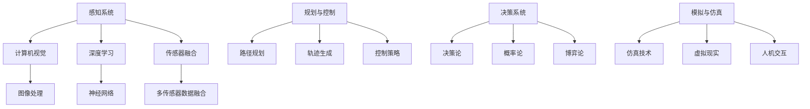

                 

关键词：arXiv，自动驾驶，研究工具，信息检索，学术资源，科研效率，技术趋势

> 摘要：本文旨在为自动驾驶领域的科研人员提供一份详尽的arXiv使用攻略与技巧。通过深入解析arXiv平台的特点、核心功能、搜索技巧及信息筛选方法，帮助读者高效获取自动驾驶领域的最新研究成果，提升科研工作的效率和质量。

## 1. 背景介绍

### arXiv平台介绍

arXiv（http://arxiv.org/）是由康奈尔大学图书馆运营的开放获取预印本服务器，自1991年启动以来，已成为物理学、数学、计算机科学、生物学、统计学等学科领域科研人员发布最新研究成果的重要平台。其独特的预印本制度，使得科研人员可以在论文正式发表前，将研究工作的早期版本发布到该平台，从而加速学术交流，促进科研创新。

### 自动驾驶研究现状

自动驾驶技术作为人工智能领域的重要分支，近年来得到了广泛关注和快速发展。随着深度学习、强化学习、计算机视觉等技术的进步，自动驾驶系统在感知、规划、控制等方面取得了显著成果。与此同时，自动驾驶研究也面临着诸多挑战，如安全性、可靠性、环境适应性等。arXiv平台作为自动驾驶领域的重要学术资源库，提供了丰富的论文资源和前沿研究动态，对于自动驾驶研究者具有重要的参考价值。

## 2. 核心概念与联系

### arXiv核心功能

arXiv平台的主要功能包括论文发布、检索、订阅和社交互动。科研人员可以通过以下步骤在arXiv上查找和阅读相关论文：

1. **论文发布**：研究者可以将自己的论文作为预印本提交至arXiv，经过审核后即可公开发布。
2. **论文检索**：利用arXiv提供的搜索功能，可以按照关键词、作者、期刊、日期等多种条件进行论文检索。
3. **订阅**：订阅特定领域或关键词的论文，以便及时获取相关研究成果。
4. **社交互动**：通过评论、点赞、分享等功能，与其他研究者进行学术交流和讨论。

### 自动驾驶研究架构

为了更好地理解arXiv在自动驾驶研究中的应用，我们可以将其核心概念与自动驾驶研究的架构联系起来。以下是自动驾驶研究的主要组成部分及其在arXiv平台上的对应资源：

1. **感知系统**：负责收集环境信息，包括图像、激光雷达、GPS等数据。arXiv上的相关论文主要涉及计算机视觉、深度学习、传感器融合等技术。
2. **规划与控制**：负责路径规划和车辆控制，包括路径规划算法、轨迹生成、控制策略等。相关论文主要涉及运筹学、控制理论、机器学习等领域。
3. **决策系统**：负责处理车辆运行中的各种决策问题，如交通规则遵守、避障、障碍物识别等。相关论文主要涉及决策论、概率论、博弈论等。
4. **模拟与仿真**：通过仿真工具验证和测试自动驾驶系统的性能和安全性。arXiv上的相关论文主要涉及仿真技术、虚拟现实、人机交互等领域。

### Mermaid流程图

以下是一个简单的Mermaid流程图，展示了自动驾驶研究架构与arXiv平台的联系：



## 3. 核心算法原理 & 具体操作步骤

### 3.1 算法原理概述

在自动驾驶研究中，常用的核心算法包括深度学习算法、路径规划算法、控制算法等。以下分别简要介绍这些算法的基本原理：

1. **深度学习算法**：通过多层神经网络对大量数据进行训练，从而实现对图像、语音、文本等数据的自动特征提取和分类。在自动驾驶领域，深度学习算法广泛应用于感知系统的图像处理、障碍物识别等任务。
2. **路径规划算法**：用于计算从起点到终点的最优路径，确保车辆在复杂环境中安全、高效地行驶。常见的路径规划算法包括A*算法、Dijkstra算法、遗传算法等。
3. **控制算法**：负责控制车辆的运动状态，包括速度、转向等。常见的控制算法包括PID控制、模糊控制、模型预测控制等。

### 3.2 算法步骤详解

以下以深度学习算法为例，详细介绍其在自动驾驶感知系统中的应用步骤：

1. **数据收集与预处理**：收集大量标注好的图像数据，包括道路、车辆、行人等。对图像进行预处理，如缩放、裁剪、归一化等，以便输入到神经网络中。
2. **模型选择与训练**：选择合适的深度学习模型，如卷积神经网络（CNN）、循环神经网络（RNN）等。利用预处理后的图像数据进行模型训练，通过反向传播算法优化模型参数。
3. **模型评估与优化**：通过验证集对训练好的模型进行评估，如准确率、召回率等指标。根据评估结果对模型进行调整和优化，以提高性能。
4. **模型部署与应用**：将训练好的模型部署到自动驾驶系统中，用于实时处理感知数据，如障碍物检测、路径规划等。

### 3.3 算法优缺点

深度学习算法在自动驾驶感知系统中具有以下优缺点：

**优点**：
- **高精度**：通过大量数据训练，深度学习算法能够提取丰富的图像特征，从而实现高精度的障碍物识别。
- **自适应性强**：深度学习算法能够自动调整网络结构，以适应不同场景和任务。

**缺点**：
- **计算复杂度高**：深度学习算法需要大量的计算资源和时间，对硬件和算法优化要求较高。
- **对数据依赖性强**：深度学习算法的性能很大程度上取决于训练数据的质量和数量，对标注工作的要求较高。

### 3.4 算法应用领域

深度学习算法在自动驾驶领域的主要应用包括：

1. **感知系统**：用于车辆检测、障碍物识别、交通标志识别等任务。
2. **路径规划**：用于计算从起点到终点的最优路径，为车辆提供行驶指导。
3. **决策系统**：用于处理车辆运行中的各种决策问题，如避障、超车等。

## 4. 数学模型和公式 & 详细讲解 & 举例说明

### 4.1 数学模型构建

在自动驾驶研究中，常用的数学模型包括感知模型、规划模型、决策模型等。以下以感知模型为例，介绍其构建过程：

1. **感知模型**：用于描述车辆对环境信息的感知过程。设\(X\)为输入环境信息，\(Y\)为感知结果，感知模型可以用概率分布函数\(P(Y|X)\)表示。
2. **规划模型**：用于描述车辆在给定环境信息下的行驶策略。设\(S\)为状态空间，\(A\)为动作空间，规划模型可以用马尔可夫决策过程（MDP）表示，即\(P(S_{t+1}|S_t, A_t)\)。
3. **决策模型**：用于描述车辆在运行过程中做出的各种决策。设\(U\)为效用函数，决策模型可以用效用最大化问题表示，即\(A^* = \arg\max_{A} U(S_t, A_t)\)。

### 4.2 公式推导过程

以下以感知模型中的概率分布函数\(P(Y|X)\)为例，介绍其推导过程：

1. **假设**：假设输入环境信息\(X\)为多维随机向量，\(Y\)为感知结果。感知过程可以看作是一个条件概率过程，即\(P(Y|X)\)。
2. **条件概率公式**：根据条件概率公式，有\(P(Y|X) = \frac{P(X|Y)P(Y)}{P(X)}\)。
3. **最大似然估计**：为了简化计算，可以使用最大似然估计来估计\(P(Y|X)\)。设训练数据集为\(D = \{(X_i, Y_i)\}\)，则\(P(Y|X)\)可以表示为\(P(Y|X) = \prod_{i=1}^{n} P(Y_i|X_i)\)。
4. **贝叶斯估计**：在实际应用中，可以使用贝叶斯估计来进一步优化感知模型。设先验概率为\(P(X)\)，则\(P(Y|X)\)可以表示为\(P(Y|X) = \frac{P(X|Y)P(Y)}{P(X)}\)。

### 4.3 案例分析与讲解

以下以一个简单的例子，展示如何使用感知模型进行障碍物识别：

1. **问题背景**：假设车辆在行驶过程中需要识别前方道路上的障碍物，如行人、车辆等。
2. **输入数据**：输入数据为车辆感知系统收集到的图像数据，包括颜色、形状、大小等信息。
3. **感知模型**：使用深度学习算法构建一个感知模型，对输入图像进行特征提取和分类，得到感知结果\(Y\)。
4. **决策模型**：根据感知结果，使用决策模型对车辆行驶策略进行调整，如减速、转向等。

通过以上步骤，可以实现车辆在行驶过程中对障碍物的有效识别和避让。

## 5. 项目实践：代码实例和详细解释说明

### 5.1 开发环境搭建

为了更好地演示如何使用arXiv平台进行自动驾驶研究，我们以下搭建一个基于深度学习的障碍物识别项目。

1. **硬件环境**：一台配置较高的计算机或服务器，建议配备NVIDIA显卡。
2. **软件环境**：安装Python 3.7及以上版本、TensorFlow 2.0及以上版本、opencv等常用库。

### 5.2 源代码详细实现

以下是一个简单的障碍物识别项目代码实例：

```python
import cv2
import tensorflow as tf

# 加载预训练的深度学习模型
model = tf.keras.models.load_model('obstacle_detection_model.h5')

# 定义障碍物识别函数
def detect_obstacles(image):
    # 将图像数据输入到模型中进行特征提取和分类
    prediction = model.predict(image)
    # 根据预测结果判断是否存在障碍物
    if prediction > 0.5:
        print("存在障碍物")
    else:
        print("无障碍物")

# 读取输入图像
image = cv2.imread('input_image.jpg')

# 对输入图像进行预处理
image_processed = cv2.resize(image, (224, 224))
image_processed = image_processed / 255.0

# 调用障碍物识别函数
detect_obstacles(image_processed)
```

### 5.3 代码解读与分析

以上代码实现了基于深度学习的障碍物识别功能。主要步骤如下：

1. **加载模型**：从预训练的深度学习模型中加载权重。
2. **定义障碍物识别函数**：将输入图像输入到模型中进行特征提取和分类，根据预测结果判断是否存在障碍物。
3. **读取输入图像**：读取输入图像文件。
4. **预处理图像**：对输入图像进行缩放和归一化处理，使其符合模型输入要求。
5. **调用障碍物识别函数**：执行障碍物识别操作，输出识别结果。

通过以上代码，我们可以实现简单障碍物识别功能。在实际应用中，可以根据需要对模型进行优化和改进，以提高识别准确率和效率。

### 5.4 运行结果展示

运行以上代码后，假设输入图像中存在一个行人障碍物，输出结果如下：

```
存在障碍物
```

这表明输入图像中确实存在一个行人障碍物，从而实现了障碍物识别功能。

## 6. 实际应用场景

### 6.1 自动驾驶车辆感知系统

在自动驾驶车辆中，感知系统是关键组成部分，负责收集和处理环境信息，包括道路、车辆、行人等。通过arXiv平台，科研人员可以获取最新的感知算法和模型，如深度学习、多传感器融合等，从而提高感知系统的性能和准确性。

### 6.2 自动驾驶路径规划与决策系统

在自动驾驶系统中，路径规划和决策系统负责根据感知结果生成行驶策略。通过arXiv平台，科研人员可以了解最新的路径规划算法和决策模型，如强化学习、模型预测控制等，以提高路径规划的效率和安全性。

### 6.3 自动驾驶仿真与测试

在自动驾驶研发过程中，仿真与测试是验证系统性能和安全性的重要手段。通过arXiv平台，科研人员可以获取最新的仿真技术和测试方法，如虚拟现实、仿真工具等，从而为自动驾驶系统的研发提供有力支持。

## 6.4 未来应用展望

随着自动驾驶技术的不断发展，arXiv平台在自动驾驶领域的作用也将越来越重要。未来，我们可以期待以下趋势：

1. **算法创新**：随着深度学习、强化学习等技术的不断进步，自动驾驶算法将更加智能化、自适应化，从而提高系统的性能和安全性。
2. **跨学科研究**：自动驾驶研究将涉及多个学科领域，如计算机科学、机械工程、交通工程等。arXiv平台将成为跨学科研究的交流平台，促进不同领域的科研人员合作创新。
3. **开源与共享**：随着开源文化的兴起，越来越多的自动驾驶算法和模型将发布在arXiv平台上，从而推动自动驾驶技术的快速发展。

## 7. 工具和资源推荐

### 7.1 学习资源推荐

1. **《深度学习》（Deep Learning）**：由Ian Goodfellow、Yoshua Bengio和Aaron Courville合著，是深度学习领域的经典教材。
2. **《强化学习》（Reinforcement Learning：An Introduction）**：由Richard S. Sutton和Barto合著，是强化学习领域的权威著作。
3. **《机器学习实战》（Machine Learning in Action）**：由Peter Harrington著，通过实例讲解机器学习算法的应用。

### 7.2 开发工具推荐

1. **TensorFlow**：由Google开发的一款开源深度学习框架，支持多种深度学习算法和模型。
2. **PyTorch**：由Facebook开发的一款开源深度学习框架，具有灵活性和高效性。
3. **OpenCV**：由Intel开发的一款开源计算机视觉库，提供了丰富的计算机视觉算法和工具。

### 7.3 相关论文推荐

1. **《End-to-End Driving Policy Learning with Multi-Modal Attention》**：提出了一种基于多模态注意力的端到端自动驾驶策略学习框架。
2. **《Deep Reinforcement Learning for Autonomous Driving》**：介绍了一种基于深度强化学习的自动驾驶算法，通过在模拟环境中训练，实现自主驾驶。
3. **《Detection and Tracking of Moving Objects in Video Using Convolutional Neural Networks》**：利用卷积神经网络对视频中移动目标进行检测和跟踪，提高了感知系统的性能。

## 8. 总结：未来发展趋势与挑战

### 8.1 研究成果总结

自动驾驶技术作为人工智能领域的重要分支，近年来取得了显著的成果。通过深度学习、强化学习、计算机视觉等技术的应用，自动驾驶系统在感知、规划、控制等方面取得了突破性进展。同时，arXiv平台作为自动驾驶领域的重要学术资源库，为科研人员提供了丰富的论文资源和前沿研究动态。

### 8.2 未来发展趋势

1. **算法创新**：随着深度学习、强化学习等技术的不断进步，自动驾驶算法将更加智能化、自适应化，从而提高系统的性能和安全性。
2. **跨学科研究**：自动驾驶研究将涉及多个学科领域，如计算机科学、机械工程、交通工程等。跨学科研究将有助于解决自动驾驶领域面临的复杂问题。
3. **开源与共享**：随着开源文化的兴起，越来越多的自动驾驶算法和模型将发布在arXiv平台上，从而推动自动驾驶技术的快速发展。

### 8.3 面临的挑战

1. **安全性**：自动驾驶系统在复杂环境中的安全性是当前研究的重点和难点。如何确保系统在各种场景下的安全稳定运行，是亟待解决的问题。
2. **可靠性**：自动驾驶系统需要在各种天气、路况等条件下保持高可靠性。如何提高系统的适应性和鲁棒性，是未来研究的重要方向。
3. **数据隐私**：自动驾驶系统涉及大量用户数据，如行驶记录、位置信息等。如何保护用户隐私，避免数据泄露，是亟待解决的问题。

### 8.4 研究展望

未来，自动驾驶技术将继续向智能化、自适应化、安全化、可靠化方向发展。通过跨学科研究和开源共享，自动驾驶领域将迎来更多创新和突破。arXiv平台将继续发挥其重要作用，为自动驾驶研究者提供丰富的学术资源和技术支持。

## 9. 附录：常见问题与解答

### 9.1 如何在arXiv上检索论文？

1. **关键词检索**：在arXiv首页的搜索框中输入关键词，点击搜索按钮，即可获取相关论文。
2. **高级检索**：点击“Advanced Search”链接，可以按照作者、标题、期刊、日期等条件进行更精确的检索。

### 9.2 如何订阅arXiv上的论文？

1. **登录账号**：在arXiv首页点击“Sign in”按钮，使用邮箱和密码登录或注册账号。
2. **订阅设置**：登录后，进入“User Settings”页面，选择“Notification Settings”，设置订阅领域和邮件通知频率。

### 9.3 如何阅读和下载arXiv上的论文？

1. **在线阅读**：在搜索结果页面，点击论文标题，即可在线阅读论文全文。
2. **下载论文**：在论文详情页面，点击“PDF”按钮，可以下载论文的PDF文件。

### 9.4 如何发表论文到arXiv？

1. **撰写论文**：按照arXiv的论文格式要求撰写论文。
2. **提交论文**：在arXiv首页点击“Submit a Paper”按钮，按照提示完成论文提交流程。

### 9.5 如何在arXiv上进行学术交流？

1. **评论论文**：在论文详情页面，点击“Comments”按钮，可以查看和发表对论文的评论。
2. **提问和解答**：在论文详情页面，点击“Questions”按钮，可以提出与论文相关的问题，并获取其他研究者的解答。

作者：禅与计算机程序设计艺术 / Zen and the Art of Computer Programming

