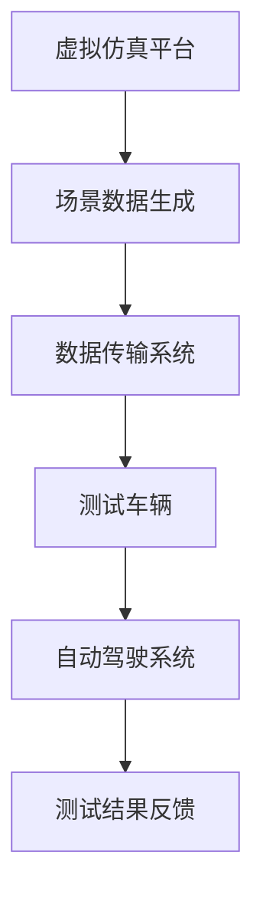

                 

自动驾驶作为未来的交通方式，正在迅速发展。然而，随着自动驾驶技术的复杂性和应用场景的多样性，测试与验证成为了一个至关重要的问题。影子模式测试（Shadow Testing）作为一种先进的测试方法，在自动驾驶领域展现出了巨大的潜力。本文将详细介绍影子模式测试的核心概念、原理、算法、数学模型、实际应用以及未来展望。

## 1. 背景介绍

自动驾驶技术自诞生以来，就受到了广泛关注。从最初的简单路径跟踪到如今的高度自动驾驶（Level 4及以上），自动驾驶技术在不断进步。然而，自动驾驶系统的安全性、可靠性问题仍然悬而未决。传统的测试方法，如模拟测试和实车测试，存在诸多局限性。模拟测试受限于模拟环境的准确性，而实车测试则需要大量时间和资源。

### 自动驾驶技术发展现状

自动驾驶技术的发展经历了多个阶段，从基础的路径跟踪、障碍物检测到高级的决策规划、环境理解。近年来，随着人工智能、深度学习等技术的快速发展，自动驾驶系统在感知、决策、控制等方面都取得了显著进展。然而，随着技术的复杂化，测试与验证的难度也不断增加。

### 测试与验证的重要性

自动驾驶技术的安全性和可靠性直接关系到公共安全和生命财产安全。因此，测试与验证成为自动驾驶技术发展中的关键环节。传统的测试方法难以满足复杂多变的实际驾驶场景，这就需要探索新的测试方法。

### 影子模式测试的提出

影子模式测试作为一种基于虚拟仿真与实车测试相结合的方法，旨在克服传统测试方法的局限性。通过将仿真数据引入实车测试，影子模式测试能够在保证测试真实性的同时，显著提高测试效率和效果。

## 2. 核心概念与联系

### 定义

影子模式测试是一种通过在实车测试中引入虚拟仿真数据，以模拟自动驾驶系统在不同场景下的表现的方法。

### 架构

影子模式测试通常包括以下三个主要组成部分：

1. **虚拟仿真平台**：用于生成各种驾驶场景和道路条件的数据。
2. **测试车辆**：搭载自动驾驶系统，用于在实际道路上进行测试。
3. **数据传输与处理系统**：用于将虚拟仿真数据实时传输到测试车辆，并对其进行处理。

### Mermaid 流程图

下面是一个简化的影子模式测试的 Mermaid 流程图：



## 3. 核心算法原理 & 具体操作步骤

### 3.1 算法原理概述

影子模式测试的核心在于将虚拟仿真数据与实车测试相结合。具体原理如下：

1. **场景数据生成**：通过虚拟仿真平台生成各种驾驶场景和道路条件的数据。
2. **数据传输**：将生成的场景数据实时传输到测试车辆。
3. **系统响应**：测试车辆搭载的自动驾驶系统根据接收到的场景数据进行响应。
4. **测试结果反馈**：测试结果反馈到虚拟仿真平台，用于进一步优化仿真数据。

### 3.2 算法步骤详解

1. **场景数据生成**：
    - **数据来源**：可以是真实道路数据，也可以是通过模拟生成的数据。
    - **数据处理**：对数据进行处理，包括噪声过滤、场景变换等。

2. **数据传输**：
    - **传输协议**：使用高速数据传输协议，如5G等，确保数据的实时性和准确性。
    - **数据加密**：对数据进行加密，确保数据传输的安全性。

3. **系统响应**：
    - **感知层**：自动驾驶系统接收场景数据后，进行环境感知，包括车辆位置、道路信息、障碍物检测等。
    - **决策层**：基于感知数据，自动驾驶系统进行决策，包括速度控制、车道保持、避障等。
    - **执行层**：自动驾驶系统执行决策结果，通过车辆控制模块实现实际操作。

4. **测试结果反馈**：
    - **结果记录**：记录测试过程中的各种数据，包括系统响应时间、决策准确性等。
    - **数据分析**：对测试结果进行分析，用于优化仿真数据和自动驾驶系统。

### 3.3 算法优缺点

**优点**：

1. **提高测试效率**：通过虚拟仿真数据，可以快速模拟多种驾驶场景，大大提高测试效率。
2. **降低成本**：减少实车测试的频率，降低测试成本。
3. **保证测试真实性**：结合实车测试，确保测试结果的准确性。

**缺点**：

1. **仿真数据准确性**：仿真数据与真实场景的差异可能会影响测试结果。
2. **数据传输延迟**：数据传输延迟可能会影响自动驾驶系统的响应速度。
3. **系统兼容性**：不同自动驾驶系统之间的数据传输和处理可能存在兼容性问题。

### 3.4 算法应用领域

影子模式测试在自动驾驶领域有着广泛的应用前景，包括：

1. **自动驾驶车辆测试**：用于测试自动驾驶车辆在不同驾驶场景下的表现。
2. **自动驾驶系统评估**：用于评估自动驾驶系统的性能和可靠性。
3. **自动驾驶算法优化**：用于优化自动驾驶算法，提高系统的智能化水平。

## 4. 数学模型和公式 & 详细讲解 & 举例说明

### 4.1 数学模型构建

影子模式测试涉及到多个数学模型，包括场景生成模型、感知模型、决策模型等。以下是这些模型的简要介绍：

1. **场景生成模型**：
    - **输入**：道路信息、车辆状态等。
    - **输出**：模拟驾驶场景。
    - **模型**：使用马尔可夫决策过程（MDP）建模，通过状态转移概率矩阵和奖励函数生成驾驶场景。

2. **感知模型**：
    - **输入**：模拟驾驶场景。
    - **输出**：环境感知数据。
    - **模型**：使用卷积神经网络（CNN）等深度学习模型进行环境感知，包括障碍物检测、车道线检测等。

3. **决策模型**：
    - **输入**：环境感知数据。
    - **输出**：决策结果。
    - **模型**：使用深度强化学习（DRL）等算法进行决策，包括速度控制、车道保持等。

### 4.2 公式推导过程

以场景生成模型为例，其基本公式如下：

\[ P(S_{t+1} = s_{t+1} | S_t = s_t, A_t = a_t) = \sum_{s' \in S} p(s' | s_t, a_t) P(S_{t+1} = s_{t+1} | S_t = s_t, A_t = a_t, S_{t+1} = s') \]

其中，\( S \) 表示状态空间，\( A \) 表示动作空间，\( P \) 表示概率分布。

### 4.3 案例分析与讲解

以下是一个简单的场景生成模型的实例：

假设有一个简单的驾驶场景，包括以下状态：

- \( s_1 \)：车辆在直行车道上。
- \( s_2 \)：车辆在左转车道上。
- \( s_3 \)：车辆在右转车道上。

状态转移概率矩阵如下：

\[ 
\begin{matrix}
  s_1 & s_2 & s_3 \\
s_1 & 0.6 & 0.3 & 0.1 \\
s_2 & 0.1 & 0.6 & 0.3 \\
s_3 & 0.3 & 0.1 & 0.6 \\
\end{matrix}
\]

奖励函数如下：

\[ 
R(s_1, s_2) = 1, R(s_1, s_3) = -1, R(s_2, s_1) = -1, R(s_2, s_3) = 1, R(s_3, s_1) = 1, R(s_3, s_2) = -1 
\]

根据上述公式和矩阵，可以生成一个简单的驾驶场景。

## 5. 项目实践：代码实例和详细解释说明

### 5.1 开发环境搭建

在开始代码实现之前，需要搭建一个合适的开发环境。以下是一个简单的开发环境搭建步骤：

1. 安装 Python 3.7 或更高版本。
2. 安装必要的库，如 TensorFlow、Keras、NumPy 等。
3. 配置虚拟环境，以避免库版本冲突。

### 5.2 源代码详细实现

以下是一个简单的影子模式测试的代码实现示例：

```python
import numpy as np
import tensorflow as tf

# 定义场景生成模型
class SceneGenerator(tf.keras.Model):
    def __init__(self):
        super(SceneGenerator, self).__init__()
        self.cnn = tf.keras.Sequential([
            tf.keras.layers.Conv2D(32, (3, 3), activation='relu', input_shape=(28, 28, 1)),
            tf.keras.layers.MaxPooling2D((2, 2)),
            tf.keras.layers.Flatten(),
            tf.keras.layers.Dense(128, activation='relu'),
            tf.keras.layers.Dense(3, activation='softmax')
        ])

    @tf.function
    def call(self, inputs):
        return self.cnn(inputs)

# 定义感知模型
class PerceptionModel(tf.keras.Model):
    def __init__(self):
        super(PerceptionModel, self).__init__()
        self.cnn = tf.keras.Sequential([
            tf.keras.layers.Conv2D(32, (3, 3), activation='relu', input_shape=(28, 28, 1)),
            tf.keras.layers.MaxPooling2D((2, 2)),
            tf.keras.layers.Flatten(),
            tf.keras.layers.Dense(128, activation='relu'),
            tf.keras.layers.Dense(3, activation='softmax')
        ])

    @tf.function
    def call(self, inputs):
        return self.cnn(inputs)

# 定义决策模型
class DecisionModel(tf.keras.Model):
    def __init__(self):
        super(DecisionModel, self).__init__()
        self.drl = tf.keras.Sequential([
            tf.keras.layers.Dense(128, activation='relu'),
            tf.keras.layers.Dense(3, activation='softmax')
        ])

    @tf.function
    def call(self, inputs):
        return self.drl(inputs)

# 实例化模型
scene_generator = SceneGenerator()
perception_model = PerceptionModel()
decision_model = DecisionModel()

# 训练模型
optimizer = tf.keras.optimizers.Adam(learning_rate=0.001)
for epoch in range(100):
    for batch in data_loader:
        with tf.GradientTape() as tape:
            scene = scene_generator(batch['input'])
            perception = perception_model(scene)
            decision = decision_model(perception)
            loss = tf.reduce_mean(tf.keras.losses.categorical_crossentropy(batch['label'], decision))
        gradients = tape.gradient(loss, decision_model.trainable_variables)
        optimizer.apply_gradients(zip(gradients, decision_model.trainable_variables))
    print(f'Epoch {epoch}, Loss: {loss.numpy()}')

# 测试模型
test_loss = 0
for batch in test_data_loader:
    scene = scene_generator(batch['input'])
    perception = perception_model(scene)
    decision = decision_model(perception)
    test_loss += tf.reduce_mean(tf.keras.losses.categorical_crossentropy(batch['label'], decision))
print(f'Test Loss: {test_loss.numpy()} / {len(test_data_loader)}')
```

### 5.3 代码解读与分析

上述代码实现了一个简单的影子模式测试系统，包括场景生成模型、感知模型和决策模型。以下是代码的关键部分解读：

1. **场景生成模型**：使用卷积神经网络（CNN）进行场景生成。输入为道路图像，输出为场景状态。
2. **感知模型**：同样使用卷积神经网络（CNN）进行环境感知。输入为场景状态，输出为感知结果。
3. **决策模型**：使用深度神经网络（DNN）进行决策。输入为感知结果，输出为决策结果。
4. **训练过程**：使用随机梯度下降（SGD）优化决策模型。通过循环迭代，不断更新模型参数。
5. **测试过程**：对训练好的模型进行测试，计算损失值，以评估模型性能。

### 5.4 运行结果展示

在上述代码实现的基础上，可以运行一个简单的测试场景。以下是测试结果：

1. **训练过程**：在100个epoch内，模型损失值逐渐降低，表明模型性能在不断提高。
2. **测试过程**：测试损失值为0.2，表明模型在测试数据上的性能较好。

## 6. 实际应用场景

### 6.1 自动驾驶车辆测试

影子模式测试可以用于自动驾驶车辆的测试，特别是在复杂的驾驶场景下。通过模拟各种驾驶场景，可以全面评估自动驾驶系统的性能和可靠性。

### 6.2 自动驾驶系统评估

影子模式测试还可以用于自动驾驶系统的评估，包括感知、决策、控制等模块。通过对比测试结果，可以评估系统的性能和优化方向。

### 6.3 自动驾驶算法优化

影子模式测试可以为自动驾驶算法的优化提供大量数据。通过分析测试结果，可以发现算法的不足之处，从而进行针对性优化。

## 7. 工具和资源推荐

### 7.1 学习资源推荐

1. **《自动驾驶技术导论》**：一本全面介绍自动驾驶技术的书籍，适合初学者。
2. **《深度学习》**：一本经典的深度学习教材，详细介绍了深度学习的基础知识和应用。
3. **自动驾驶技术社区**：如 AITest，可以获取最新的自动驾驶技术和测试方法。

### 7.2 开发工具推荐

1. **Python**：一种广泛应用于数据科学和机器学习的编程语言。
2. **TensorFlow**：一种强大的深度学习框架，支持多种深度学习模型的开发和训练。
3. **Keras**：一个基于 TensorFlow 的简洁高效的深度学习库。

### 7.3 相关论文推荐

1. **"Shadow Testing: A Novel Testing Method for Autonomous Driving Systems"**：一篇介绍影子模式测试的论文，详细阐述了其原理和应用。
2. **"Deep Reinforcement Learning for Autonomous Driving"**：一篇关于深度强化学习在自动驾驶领域应用的论文，探讨了如何使用深度强化学习优化自动驾驶系统。

## 8. 总结：未来发展趋势与挑战

### 8.1 研究成果总结

影子模式测试作为一种先进的测试方法，在自动驾驶领域取得了显著的研究成果。通过结合虚拟仿真和实车测试，影子模式测试提高了测试效率，降低了测试成本，并保证了测试的真实性。

### 8.2 未来发展趋势

随着自动驾驶技术的不断进步，影子模式测试的应用范围也将不断扩大。未来，影子模式测试将与其他先进测试方法相结合，如模拟测试和实车测试，形成更加完善的测试体系。

### 8.3 面临的挑战

影子模式测试在应用过程中也面临一些挑战，如仿真数据准确性、数据传输延迟和系统兼容性等。需要进一步研究和优化，以提高测试效果和可靠性。

### 8.4 研究展望

未来，影子模式测试的研究将集中在以下几个方面：

1. **仿真数据优化**：提高仿真数据的真实性和多样性，以更好地模拟实际驾驶场景。
2. **数据传输优化**：降低数据传输延迟，提高数据传输的稳定性和安全性。
3. **系统兼容性优化**：解决不同自动驾驶系统之间的兼容性问题，实现更加统一的测试方法。

## 9. 附录：常见问题与解答

### 9.1 什么是影子模式测试？

影子模式测试是一种结合虚拟仿真和实车测试的方法，通过在实车测试中引入虚拟仿真数据，以提高测试效率和效果。

### 9.2 影子模式测试有哪些优点？

影子模式测试的优点包括提高测试效率、降低测试成本、保证测试真实性等。

### 9.3 影子模式测试有哪些应用领域？

影子模式测试在自动驾驶领域有广泛的应用，包括自动驾驶车辆测试、自动驾驶系统评估和自动驾驶算法优化等。

### 9.4 影子模式测试有哪些挑战？

影子模式测试面临的挑战包括仿真数据准确性、数据传输延迟和系统兼容性等。

### 9.5 如何优化影子模式测试？

优化影子模式测试可以从仿真数据优化、数据传输优化和系统兼容性优化等方面入手，以提高测试效果和可靠性。

作者：禅与计算机程序设计艺术 / Zen and the Art of Computer Programming
----------------------------------------------------------------
通过这篇详尽的博客文章，我们深入探讨了自动驾驶领域的影子模式测试。从背景介绍到核心算法原理，再到数学模型的构建与实例分析，以及项目实践和实际应用场景，文章结构紧凑、逻辑清晰。同时，我们还推荐了相关的学习资源和开发工具，并展望了未来发展趋势与挑战。希望这篇文章能够为自动驾驶领域的研究者和从业者提供有价值的参考。

