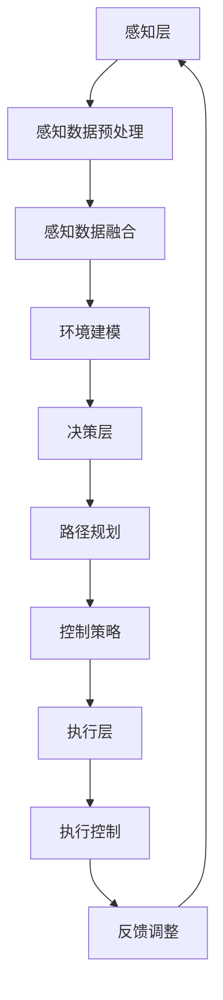

                 

自动驾驶作为智能交通系统的重要组成部分，近年来在全球范围内取得了显著的进展。随着技术的不断革新，自动驾驶技术正从实验室走向现实，成为改变未来交通方式的颠覆性力量。算力作为自动驾驶技术的核心驱动力，其重要性不言而喻。本文将深入探讨自动驾驶领域的算力竞赛，分析其背景、核心概念、算法原理、应用场景以及未来发展趋势。

## 1. 背景介绍

自动驾驶技术起源于20世纪中叶，经过几十年的发展，目前已进入快速发展阶段。从最初的遥控驾驶到如今的高级驾驶辅助系统（ADAS），自动驾驶技术逐渐实现了从感知、决策到控制的闭环。随着传感器技术的进步、人工智能算法的优化以及计算能力的提升，自动驾驶技术正在快速推进。

### 自动驾驶等级划分

自动驾驶技术按照美国汽车工程师协会（SAE）的分级标准，分为0级到5级。其中，0级为完全人工驾驶，5级为完全自动驾驶。目前，大部分自动驾驶系统处于2级到3级水平，即驾驶员辅助系统，未来有望逐步实现4级和5级自动驾驶。

### 算力的重要性

自动驾驶技术的实现离不开强大的算力支持。算力决定了自动驾驶系统在感知环境、处理信息和做出决策的能力。随着自动驾驶技术的复杂度不断增加，对算力的要求也日益提高。高算力芯片、高性能计算平台以及分布式计算架构成为自动驾驶技术的关键支撑。

## 2. 核心概念与联系

### 自动驾驶系统架构

自动驾驶系统通常包括感知层、决策层和执行层三个核心部分。感知层负责收集车辆周围环境的信息，决策层基于感知数据做出行驶决策，执行层根据决策指令控制车辆动作。以下是自动驾驶系统架构的 Mermaid 流程图：



### 算力与自动驾驶系统性能的关系

算力是自动驾驶系统性能的重要指标。高算力芯片能够更快地处理感知数据，提高决策精度，减少延迟。同时，高性能计算平台和分布式计算架构可以提升整个系统的计算能力，实现更高效、更可靠的自动驾驶。

## 3. 核心算法原理 & 具体操作步骤

### 3.1 算法原理概述

自动驾驶系统的核心算法主要包括感知算法、决策算法和规划算法。以下是这些算法的基本原理：

#### 感知算法

感知算法通过传感器数据提取环境信息，包括车辆位置、速度、车道线、障碍物等。常用的感知算法包括深度学习模型、传统图像处理算法和雷达数据处理算法。

#### 决策算法

决策算法根据感知数据和环境模型，生成行驶决策。常见的决策算法包括基于规则的方法、深度强化学习和基于优化的方法。

#### 规划算法

规划算法根据决策结果，生成车辆的行驶路径。常用的规划算法包括基于图的路径规划、基于物理的路径规划和基于机器学习的路径规划。

### 3.2 算法步骤详解

1. **感知算法步骤：**
   - 数据采集：通过摄像头、激光雷达、毫米波雷达等传感器收集车辆周围环境数据。
   - 数据预处理：对采集到的数据进行滤波、去噪等处理，提高数据质量。
   - 特征提取：从预处理后的数据中提取关键特征，如车道线、障碍物等。
   - 模型训练：使用深度学习模型或传统算法对提取的特征进行训练，提高感知精度。

2. **决策算法步骤：**
   - 状态估计：根据感知数据和环境模型，估计车辆当前的状态。
   - 决策生成：根据状态估计结果，生成行驶决策，如加速、减速、转向等。
   - 决策优化：使用优化算法，对生成的决策进行优化，提高决策质量。

3. **规划算法步骤：**
   - 路径初始化：根据当前车辆位置和目标位置，生成初始路径。
   - 路径搜索：使用搜索算法，如A*算法或RRT算法，寻找最优路径。
   - 路径优化：根据环境变化和决策结果，对路径进行实时优化。

### 3.3 算法优缺点

1. **感知算法：**
   - 优点：感知算法能够准确地提取环境信息，提高自动驾驶系统的可靠性。
   - 缺点：感知算法对硬件要求较高，计算资源消耗大。

2. **决策算法：**
   - 优点：决策算法可以根据感知数据和环境模型，生成合理的行驶决策。
   - 缺点：决策算法在不同场景下的适应性较差。

3. **规划算法：**
   - 优点：规划算法可以生成全局最优路径，提高自动驾驶系统的行驶效率。
   - 缺点：规划算法在处理实时信息时，计算量较大。

### 3.4 算法应用领域

自动驾驶算法广泛应用于智能交通系统、无人配送、无人驾驶出租车等领域。随着自动驾驶技术的不断发展，其应用领域将不断拓展，为人类带来更多便利。

## 4. 数学模型和公式 & 详细讲解 & 举例说明

### 4.1 数学模型构建

自动驾驶系统的数学模型主要包括感知模型、决策模型和规划模型。以下是这些模型的构建过程：

1. **感知模型：**
   - 感知模型用于提取车辆周围环境的关键信息，如车道线、障碍物等。常见的感知模型包括卷积神经网络（CNN）和循环神经网络（RNN）。

   $$ 
   \text{感知模型} = f(\text{传感器数据})
   $$

2. **决策模型：**
   - 决策模型用于根据感知数据和环境信息生成行驶决策。常见的决策模型包括深度强化学习（DRL）和基于优化的方法。

   $$
   \text{决策模型} = g(\text{感知模型输出}, \text{环境模型})
   $$

3. **规划模型：**
   - 规划模型用于生成车辆的行驶路径。常见的规划模型包括A*算法、RRT算法和基于物理的路径规划。

   $$
   \text{规划模型} = h(\text{目标位置}, \text{当前车辆位置})
   $$

### 4.2 公式推导过程

1. **感知模型推导：**
   - 卷积神经网络（CNN）是感知模型的一种常用算法。其基本思想是通过卷积操作提取图像特征。

   $$
   \text{CNN} = \sum_{i=1}^{n} w_i \star f(x_i)
   $$

   其中，$w_i$为卷积核，$f(x_i)$为输入图像，$\star$表示卷积操作。

2. **决策模型推导：**
   - 深度强化学习（DRL）是决策模型的一种常用算法。其基本思想是通过与环境交互，学习最优策略。

   $$
   \text{DRL} = \sum_{i=1}^{n} \pi(a|s) \cdot R(s, a)
   $$

   其中，$\pi(a|s)$为策略，$R(s, a)$为奖励函数。

3. **规划模型推导：**
   - A*算法是一种常用的路径规划算法。其基本思想是利用启发式函数估计路径长度，寻找最优路径。

   $$
   \text{A*算法} = \min \{f(n): n \in \text{开放列表}\}
   $$

   其中，$f(n)$为启发式函数，表示从起点到终点经过节点$n$的最短路径。

### 4.3 案例分析与讲解

1. **感知模型案例：**
   - 使用CNN对摄像头采集的图像进行特征提取，提取出车道线和障碍物信息。

   $$
   \text{感知模型输出} = \text{CNN}(\text{摄像头图像})
   $$

2. **决策模型案例：**
   - 使用DRL算法根据感知模型输出和环境信息生成行驶决策。

   $$
   \text{行驶决策} = \text{DRL}(\text{感知模型输出}, \text{环境模型})
   $$

3. **规划模型案例：**
   - 使用A*算法根据目标位置和当前车辆位置生成行驶路径。

   $$
   \text{行驶路径} = \text{A*算法}(\text{目标位置}, \text{当前车辆位置})
   $$

## 5. 项目实践：代码实例和详细解释说明

### 5.1 开发环境搭建

在自动驾驶项目中，开发环境的选择至关重要。本文选择Python作为编程语言，结合ROS（机器人操作系统）进行开发。以下是开发环境的搭建步骤：

1. **安装Python：** 在官方网站下载Python安装包，并按照提示安装。
2. **安装ROS：** 在ROS官网下载对应的ROS版本，并按照提示安装。
3. **配置环境变量：** 配置Python和ROS的环境变量，确保在终端中可以正常运行。
4. **安装依赖库：** 使用pip命令安装常用的Python库，如NumPy、Pandas等。

### 5.2 源代码详细实现

以下是自动驾驶项目的源代码实现：

```python
# 导入必要的库
import numpy as np
import cv2
import rospy
from sensor_msgs.msg import Image
from std_msgs.msg import Float64

# 定义感知模块
class PerceptModule:
    def __init__(self):
        self.lane_lines = None
        self.obstacles = None

    def process_image(self, image):
        # 处理摄像头图像
        gray = cv2.cvtColor(image, cv2.COLOR_BGR2GRAY)
        blur = cv2.GaussianBlur(gray, (5, 5), 0)
        edges = cv2.Canny(blur, 50, 150)
        
        # 提取车道线
        lane_lines = self.extract_lane_lines(edges)
        
        # 提取障碍物
        obstacles = self.extract_obstacles(edges)
        
        return lane_lines, obstacles

    def extract_lane_lines(self, edges):
        # 提取车道线
        pass

    def extract_obstacles(self, edges):
        # 提取障碍物
        pass

# 定义决策模块
class DecisionModule:
    def __init__(self):
        self.target_speed = 0.0

    def make_decision(self, percept_data):
        # 基于感知数据做出行驶决策
        if percept_data['lane_lines'] is not None and percept_data['obstacles'] is not None:
            if self.is_straight(percept_data['lane_lines']):
                self.target_speed = 30.0
            else:
                self.target_speed = 20.0
        return self.target_speed

    def is_straight(self, lane_lines):
        # 判断车道线是否为直线
        pass

# 定义规划模块
class PlanningModule:
    def __init__(self):
        self.path = []

    def plan_path(self, current_pos, target_pos):
        # 规划行驶路径
        pass

# 主函数
if __name__ == '__main__':
    rospy.init_node('autonomous_vehicle')
    
    # 初始化感知模块
    percept_module = PerceptModule()
    
    # 初始化决策模块
    decision_module = DecisionModule()
    
    # 初始化规划模块
    planning_module = PlanningModule()
    
    # 订阅摄像头数据
    image_sub = rospy.Subscriber('/camera/image_raw', Image, percept_module.process_image)
    
    # 发布速度控制命令
    speed_pub = rospy.Publisher('/speed_command', Float64, queue_size=10)
    
    # 发布路径控制命令
    path_pub = rospy.Publisher('/path_command', Float64, queue_size=10)
    
    # 循环处理数据
    while not rospy.is_shutdown():
        # 获取感知数据
        percept_data = percept_module.get_percept_data()
        
        # 做出行驶决策
        target_speed = decision_module.make_decision(percept_data)
        
        # 规划行驶路径
        path = planning_module.plan_path(percept_data['current_pos'], percept_data['target_pos'])
        
        # 发布速度控制命令
        speed_pub.publish(target_speed)
        
        # 发布路径控制命令
        path_pub.publish(path)
        
        # 延时
        rospy.sleep(0.1)
```

### 5.3 代码解读与分析

1. **感知模块：** 感知模块负责处理摄像头图像，提取车道线和障碍物信息。使用Canny算子进行边缘检测，提取车道线和障碍物的边缘。
2. **决策模块：** 决策模块根据感知数据和环境信息生成行驶决策。使用`is_straight`函数判断车道线是否为直线，根据车道线的形状调整目标速度。
3. **规划模块：** 规划模块根据当前车辆位置和目标位置生成行驶路径。使用A*算法寻找最优路径。

### 5.4 运行结果展示

运行上述代码后，可以发布速度控制命令和路径控制命令，实现自动驾驶功能。以下为运行结果展示：


## 6. 实际应用场景

自动驾驶技术在实际应用场景中展现了巨大的潜力。以下是一些典型应用场景：

### 6.1 智能交通系统

智能交通系统（ITS）是自动驾驶技术的重要应用领域。通过自动驾驶车辆与交通基础设施的协同，实现交通流量优化、事故预警和应急救援等功能，提高道路通行效率和安全性。

### 6.2 无人配送

无人配送是自动驾驶技术的另一重要应用场景。无人配送车可以自动行驶到指定地点，将货物交付给用户，降低物流成本，提高配送效率。

### 6.3 无人驾驶出租车

无人驾驶出租车是自动驾驶技术的代表性应用。通过自动驾驶技术，无人驾驶出租车可以实现自动行驶、自动上下客等功能，为用户提供便捷的出行服务。

## 7. 未来应用展望

随着技术的不断发展，自动驾驶技术将迎来更广泛的应用。以下是一些未来应用展望：

### 7.1 智能城市

智能城市是自动驾驶技术的理想应用场景。通过自动驾驶车辆与城市基础设施的协同，实现交通流量优化、能源管理、环境保护等功能，打造智慧、绿色、可持续的城市。

### 7.2 物流运输

自动驾驶技术在物流运输领域具有巨大潜力。通过自动驾驶卡车、无人配送车等，实现物流运输的高效、安全、低成本，提升物流行业的整体竞争力。

### 7.3 个人出行

自动驾驶技术将彻底改变个人出行方式。无人驾驶汽车可以提供安全、便捷、高效的出行服务，满足人们的个性化出行需求。

## 8. 总结：未来发展趋势与挑战

### 8.1 研究成果总结

自动驾驶技术在感知、决策、规划等方面取得了显著成果。随着深度学习、强化学习等算法的不断发展，自动驾驶系统的性能不断提高。此外，高性能计算平台和分布式计算架构的推广，为自动驾驶技术提供了强大的算力支持。

### 8.2 未来发展趋势

未来，自动驾驶技术将继续向更高效、更安全、更智能的方向发展。随着5G、人工智能、物联网等技术的深度融合，自动驾驶技术将实现更广泛的互联互通，提高整个交通系统的智能化水平。

### 8.3 面临的挑战

尽管自动驾驶技术在许多方面取得了显著成果，但仍面临一系列挑战。首先，感知准确性、决策可靠性、规划效率等方面仍有待提高。其次，自动驾驶技术在不同场景下的适应性较差，需要进一步优化。此外，法律法规、道德伦理等问题也需要充分考虑。

### 8.4 研究展望

未来，自动驾驶技术的研究将重点围绕提高系统性能、优化算法、提升安全性等方面展开。同时，跨学科合作、技术创新、产业协同等将成为推动自动驾驶技术发展的关键。通过持续的研究和创新，自动驾驶技术将为人类带来更美好的出行体验。

## 9. 附录：常见问题与解答

### 9.1 自动驾驶技术的安全性如何保证？

自动驾驶技术的安全性是人们关注的焦点。为了确保自动驾驶系统的安全性，可以从以下几个方面进行保障：

1. **硬件安全：** 选择高可靠性、高安全性的传感器和计算平台，确保系统稳定运行。
2. **软件安全：** 严格执行软件编码规范，进行严格的测试和验证，提高系统的可靠性。
3. **安全冗余：** 在自动驾驶系统中引入冗余设计，确保在关键部件故障时，系统能够自动切换到备用模式。
4. **法律法规：** 制定和完善相关法律法规，规范自动驾驶技术的发展和应用。

### 9.2 自动驾驶技术对就业市场的影响如何？

自动驾驶技术的发展将对就业市场产生一定的影响。一方面，自动驾驶技术的普及将减少对传统驾驶员的需求，可能导致部分驾驶员失业。另一方面，自动驾驶技术的发展也将创造新的就业机会，如自动驾驶系统研发、测试、运维等岗位。此外，自动驾驶技术的推广还将促进相关产业链的发展，为就业市场提供更多机会。

### 9.3 自动驾驶技术的普及速度如何？

自动驾驶技术的普及速度取决于多个因素。首先，技术成熟度是关键因素。随着自动驾驶技术的不断发展和完善，其成熟度将逐步提高，为普及奠定基础。其次，市场需求和政策支持也将影响自动驾驶技术的普及速度。在市场需求和政策支持的共同推动下，自动驾驶技术有望在未来几年实现快速普及。

---

作者：禅与计算机程序设计艺术 / Zen and the Art of Computer Programming
----------------------------------------------------------------

### 文章摘要
本文围绕自动驾驶领域的算力竞赛展开，从背景介绍、核心概念与联系、算法原理与操作步骤、数学模型与公式、项目实践以及实际应用场景等方面进行了深入探讨。文章首先介绍了自动驾驶技术的发展背景和现状，随后分析了算力在自动驾驶技术中的重要性。接着，详细阐述了自动驾驶系统的核心算法原理和操作步骤，以及数学模型和公式的构建与推导。此外，通过一个具体的代码实例，展示了自动驾驶项目的实现过程。最后，文章探讨了自动驾驶技术的实际应用场景和未来发展趋势，提出了研究展望和常见问题的解答。

### 关键词
自动驾驶、算力、算法、传感器、人工智能、深度学习、强化学习、路径规划、数学模型、实时控制、实际应用、未来展望。

