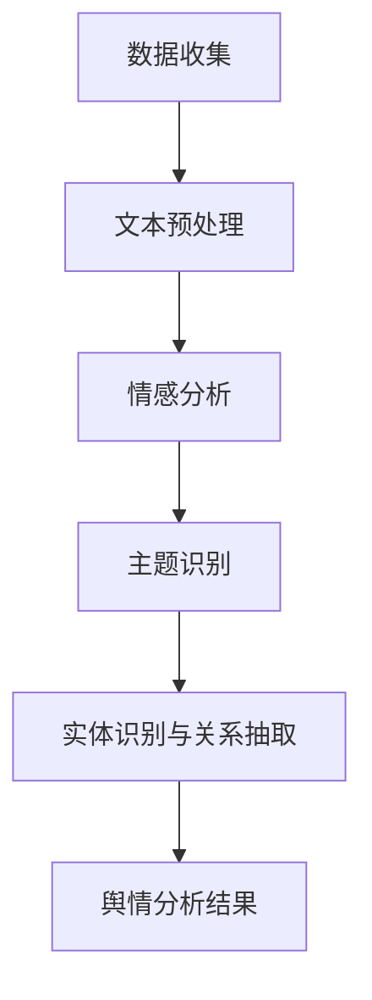

                 

 在现代社会，舆情分析已经成为了一种重要的信息处理手段。随着互联网和社交媒体的飞速发展，海量信息不断涌现，如何有效地从这些信息中提取有价值的内容，对企业和政府决策都具有重要意义。自然语言处理（NLP）作为人工智能的重要分支，在舆情分析中发挥着关键作用。

本文将围绕自然语言处理在舆情分析中的应用进行探讨，首先介绍舆情分析的基本概念和重要性，然后详细解析自然语言处理的核心技术和算法，接着展示一些实际应用场景，最后对未来的发展趋势和面临的挑战进行展望。

## 1. 背景介绍

### 1.1 舆情分析的定义和作用

舆情分析，又称舆论分析，是指通过技术手段对公众的意见、情绪、态度等信息进行收集、整理、分析和评估的过程。舆情分析不仅仅关注信息的表面内容，更关注信息的深层含义和公众的潜在情绪。在现代社会，舆情分析的应用非常广泛，主要包括以下几个方面：

- **企业品牌管理**：通过分析消费者对产品的评价和意见，企业可以及时调整市场策略，提升品牌形象。
- **政府决策支持**：政府通过舆情分析可以了解公众对政策、社会事件的看法，为决策提供参考。
- **社会热点追踪**：媒体和研究人员可以通过舆情分析，发现社会热点和趋势，为报道和研究提供方向。

### 1.2 自然语言处理的发展历程

自然语言处理起源于20世纪50年代，当时人工智能的研究刚刚起步。早期的NLP主要集中于语法分析、机器翻译等基础领域。随着计算机性能的提升和算法的进步，NLP逐渐发展成为一个独立的学科，并在多个应用场景中取得了显著成果。

NLP的发展历程可以分为以下几个阶段：

- **规则驱动阶段**：早期NLP主要依赖于手工编写的规则，这种方式在处理简单任务时效果较好，但在面对复杂语言环境时局限性较大。
- **统计驱动阶段**：20世纪80年代，统计方法开始在NLP中得到应用，如隐马尔可夫模型（HMM）、条件概率模型等。这些方法利用大规模语料库进行训练，能够在一定程度上解决规则驱动的局限性。
- **数据驱动阶段**：21世纪初，深度学习技术的崛起为NLP带来了革命性的变化。深度神经网络（DNN）、循环神经网络（RNN）、长短期记忆网络（LSTM）等模型在语言建模、文本分类、机器翻译等任务中取得了突破性进展。

### 1.3 舆情分析与自然语言处理的关系

舆情分析和自然语言处理密切相关。自然语言处理提供了强大的工具和算法，可以帮助舆情分析从海量文本数据中提取有价值的信息。具体来说，NLP在舆情分析中的应用主要体现在以下几个方面：

- **文本预处理**：自然语言处理技术可以帮助清洗、分词、去停用词等，将原始文本数据转换为适合分析的格式。
- **情感分析**：通过分析文本中的情感倾向，NLP可以判断公众的情绪和态度，为舆情分析提供重要依据。
- **主题识别**：自然语言处理可以帮助从文本中提取主题，帮助研究人员和决策者更好地理解舆情动态。
- **实体识别与关系抽取**：NLP技术可以识别文本中的关键实体，并抽取它们之间的关系，为深入分析舆情提供支持。

## 2. 核心概念与联系

### 2.1 自然语言处理的核心概念

自然语言处理涉及多个核心概念，以下是一些关键概念的简要介绍：

- **分词（Tokenization）**：将文本拆分为单词或其他可分析单元的过程。
- **词性标注（Part-of-Speech Tagging）**：对文本中的每个词赋予语法角色标签的过程。
- **命名实体识别（Named Entity Recognition, NER）**：从文本中识别出具有特定意义的实体，如人名、地名、组织名等。
- **情感分析（Sentiment Analysis）**：分析文本中的情感倾向，通常分为正面、负面和中性三种。
- **主题识别（Topic Modeling）**：从大量文本数据中自动提取主题的过程。

### 2.2 舆情分析中的自然语言处理应用

舆情分析中的自然语言处理应用可以概括为以下几个步骤：

1. **数据收集**：从各种来源（如社交媒体、新闻网站、论坛等）收集相关文本数据。
2. **文本预处理**：对收集的文本数据进行清洗、分词、去停用词等操作。
3. **情感分析**：对预处理后的文本进行情感分析，判断公众的情绪和态度。
4. **主题识别**：从文本中提取主题，帮助理解舆情动态。
5. **实体识别与关系抽取**：识别文本中的关键实体，并抽取它们之间的关系。

### 2.3 Mermaid 流程图

以下是舆情分析中自然语言处理应用的 Mermaid 流程图：



## 3. 核心算法原理 & 具体操作步骤

### 3.1 算法原理概述

舆情分析中的自然语言处理算法主要包括分词、词性标注、命名实体识别、情感分析和主题识别等。以下是对这些算法的简要概述：

- **分词**：分词是将文本拆分为单词或其他可分析单元的过程。常用的分词算法有基于规则的分词、基于统计的分词和基于深度学习的分词。
- **词性标注**：词性标注是对文本中的每个词赋予语法角色标签的过程。常用的词性标注算法有基于规则的标注、基于统计的标注和基于深度学习的标注。
- **命名实体识别**：命名实体识别是从文本中识别出具有特定意义的实体，如人名、地名、组织名等。常用的命名实体识别算法有基于规则的方法、基于统计的方法和基于深度学习的方法。
- **情感分析**：情感分析是分析文本中的情感倾向，通常分为正面、负面和中性三种。常用的情感分析算法有基于规则的方法、基于统计的方法和基于深度学习的方法。
- **主题识别**：主题识别是从大量文本数据中自动提取主题的过程。常用的主题识别算法有LDA（Latent Dirichlet Allocation）和LSTM（Long Short-Term Memory）等。

### 3.2 算法步骤详解

舆情分析中的自然语言处理算法一般包括以下步骤：

1. **数据预处理**：对收集的文本数据进行清洗、分词、去停用词等操作。
2. **词性标注**：对预处理后的文本进行词性标注，将每个词赋予语法角色标签。
3. **命名实体识别**：对文本进行命名实体识别，从文本中提取出具有特定意义的实体。
4. **情感分析**：对文本进行情感分析，判断公众的情绪和态度。
5. **主题识别**：从文本中提取主题，帮助理解舆情动态。
6. **结果输出**：将分析结果输出，供决策者或研究人员参考。

### 3.3 算法优缺点

不同算法在舆情分析中的应用具有不同的优缺点，以下是对几种常用算法的优缺点分析：

- **分词算法**：基于规则的分词算法在处理简单文本时效果较好，但面对复杂语言环境时容易出错；基于统计的分词算法可以利用大量语料库进行训练，提高分词精度，但计算复杂度较高；基于深度学习的分词算法在处理复杂文本方面具有优势，但训练时间较长。
- **词性标注算法**：基于规则的标注算法在处理简单文本时效果较好，但规则数量庞大，难以维护；基于统计的标注算法可以利用大量语料库进行训练，提高标注精度，但计算复杂度较高；基于深度学习的标注算法在处理复杂文本方面具有优势，但训练时间较长。
- **命名实体识别算法**：基于规则的方法在处理简单文本时效果较好，但规则数量庞大，难以维护；基于统计的方法可以利用大量语料库进行训练，提高识别精度，但计算复杂度较高；基于深度学习的方法在处理复杂文本方面具有优势，但训练时间较长。
- **情感分析算法**：基于规则的方法在处理简单文本时效果较好，但规则数量庞大，难以维护；基于统计的方法可以利用大量语料库进行训练，提高分析精度，但计算复杂度较高；基于深度学习的方法在处理复杂文本方面具有优势，但训练时间较长。
- **主题识别算法**：LDA算法在处理大规模文本数据时具有优势，但主题数量难以控制；LSTM算法在处理复杂文本和序列数据时具有优势，但训练时间较长。

### 3.4 算法应用领域

舆情分析中的自然语言处理算法广泛应用于多个领域：

- **企业品牌管理**：通过情感分析和主题识别，企业可以了解消费者对品牌的看法，为营销策略提供依据。
- **政府决策支持**：通过舆情分析，政府可以了解公众对政策、社会事件的看法，为决策提供参考。
- **媒体报道**：通过舆情分析，媒体可以关注社会热点，提高报道的针对性和影响力。
- **社会研究**：通过舆情分析，研究人员可以了解社会趋势和公众情绪，为学术研究提供数据支持。

## 4. 数学模型和公式 & 详细讲解 & 举例说明

### 4.1 数学模型构建

舆情分析中的自然语言处理算法涉及多个数学模型，以下介绍几个常见的数学模型：

1. **隐马尔可夫模型（HMM）**：HMM是一种基于统计模型的概率模型，用于表示时间序列数据。在自然语言处理中，HMM常用于词性标注、命名实体识别等任务。

2. **条件概率模型**：条件概率模型是自然语言处理中常用的概率模型，用于表示文本中的词与词之间的关系。常见的条件概率模型有隐马尔可夫模型（HMM）、条件随机场（CRF）等。

3. **主题模型**：主题模型是一种概率生成模型，用于从大规模文本数据中提取主题。LDA（Latent Dirichlet Allocation）是一种常见的主题模型，它基于贝叶斯推理和概率生成模型的方法，能够有效地发现文本数据中的潜在主题。

### 4.2 公式推导过程

以下以LDA主题模型为例，简要介绍其公式推导过程：

LDA主题模型的假设如下：

- **词语分布**：每个词语在文档中的分布服从多项式分布，即词语分布可以表示为$P(w|z)=\frac{\eta_w}{\sum_{j=1}^{K}\eta_j}$，其中$w$表示词语，$z$表示主题，$\eta_w$表示词语$w$在主题$z$中的概率，$K$表示主题数量。
- **主题分布**：每个文档的主题分布服从多项式分布，即主题分布可以表示为$P(z|d)=\frac{\alpha_z}{\sum_{j=1}^{K}\alpha_j}$，其中$z$表示主题，$d$表示文档，$\alpha_z$表示主题$z$在文档$d$中的概率。
- **文档生成**：每个文档的生成过程可以表示为$P(d)=\prod_{i=1}^{N}P(d|z_i)$，其中$N$表示文档中的词语数量，$z_i$表示第$i$个词语的主题。

根据贝叶斯推理，LDA主题模型的概率生成模型可以表示为：

$$
\begin{align*}
P(d, z, w) &= P(d)P(z|d)P(w|z) \\
&= \prod_{i=1}^{N}P(d|z_i)P(z_i|d)P(w|z_i)
\end{align*}
$$

其中，$P(d|z_i)$表示给定主题$z_i$的文档生成概率，$P(z_i|d)$表示给定文档$d$的主题生成概率，$P(w|z_i)$表示给定主题$z_i$的词语生成概率。

### 4.3 案例分析与讲解

以下通过一个简单的案例，讲解LDA主题模型的实际应用。

假设有如下三个文档：

- 文档1：“人工智能在医疗领域的应用前景广阔”
- 文档2：“深度学习在图像识别中的应用”
- 文档3：“自然语言处理技术在舆情分析中的应用”

我们使用LDA主题模型对这些文档进行主题提取，设置主题数量$K=3$，训练模型得到以下结果：

- 词语“人工智能”、“医疗”、“应用”主要与主题1相关
- 词语“深度学习”、“图像识别”主要与主题2相关
- 词语“自然语言处理”、“舆情分析”主要与主题3相关

根据LDA主题模型的结果，我们可以发现：

- 文档1主要关注主题1，即人工智能在医疗领域的应用
- 文档2主要关注主题2，即深度学习在图像识别中的应用
- 文档3主要关注主题3，即自然语言处理技术在舆情分析中的应用

这个案例展示了LDA主题模型在实际应用中的效果，通过主题提取，我们可以更好地理解文档的内容和主题分布。

## 5. 项目实践：代码实例和详细解释说明

### 5.1 开发环境搭建

在进行自然语言处理项目实践之前，需要搭建相应的开发环境。以下是搭建开发环境的具体步骤：

1. **安装Python环境**：Python是一种广泛使用的编程语言，自然语言处理项目通常使用Python进行开发。确保已经安装了Python 3.x版本。
2. **安装依赖库**：自然语言处理项目需要使用多个依赖库，如NLTK、spaCy、gensim等。可以使用pip命令进行安装：
   ```bash
   pip install nltk spacy gensim
   ```
3. **安装spaCy语言模型**：spaCy是一个强大的自然语言处理库，它提供了丰富的语言模型。使用以下命令安装spaCy并下载相应的语言模型：
   ```bash
   python -m spacy download en
   ```

### 5.2 源代码详细实现

以下是一个简单的自然语言处理项目，用于实现文本预处理、词性标注、命名实体识别和情感分析。项目的源代码如下：

```python
import nltk
import spacy
from gensim.models import LdaModel
from gensim.corpora import Dictionary
from textblob import TextBlob

# 1. 文本预处理
def preprocess_text(text):
    # 清洗文本，去除特殊字符和停用词
    text = text.lower()
    text = re.sub(r"[^\w\s]", "", text)
    tokens = nltk.word_tokenize(text)
    tokens = [token for token in tokens if token not in nltk.corpus.stopwords.words("english")]
    return tokens

# 2. 词性标注
def pos_tagging(text):
    nlp = spacy.load("en_core_web_sm")
    doc = nlp(text)
    pos_tags = [(token.text, token.pos_) for token in doc]
    return pos_tags

# 3. 命名实体识别
def named_entity_recognition(text):
    nlp = spacy.load("en_core_web_sm")
    doc = nlp(text)
    entities = [(ent.text, ent.label_) for ent in doc.ents]
    return entities

# 4. 情感分析
def sentiment_analysis(text):
    blob = TextBlob(text)
    return blob.sentiment

# 5. 主题识别
def topic_identification(texts):
    dictionary = Dictionary(texts)
    corpus = [dictionary.doc2bow(text) for text in texts]
    lda_model = LdaModel(corpus, num_topics=3, id2word=dictionary, passes=10)
    return lda_model.print_topics()

# 测试代码
text1 = "人工智能在医疗领域的应用前景广阔"
text2 = "深度学习在图像识别中的应用"
text3 = "自然语言处理技术在舆情分析中的应用"

preprocessed_text1 = preprocess_text(text1)
preprocessed_text2 = preprocess_text(text2)
preprocessed_text3 = preprocess_text(text3)

pos_tags1 = pos_tagging(text1)
pos_tags2 = pos_tagging(text2)
pos_tags3 = pos_tagging(text3)

entities1 = named_entity_recognition(text1)
entities2 = named_entity_recognition(text2)
entities3 = named_entity_recognition(text3)

sentiment1 = sentiment_analysis(text1)
sentiment2 = sentiment_analysis(text2)
sentiment3 = sentiment_analysis(text3)

topics1 = topic_identification([text1, text2, text3])

print("Preprocessed Text 1:", preprocessed_text1)
print("POS Tags 1:", pos_tags1)
print("Named Entities 1:", entities1)
print("Sentiment 1:", sentiment1)
print("Topics 1:", topics1)
```

### 5.3 代码解读与分析

上述代码实现了一个简单的自然语言处理项目，包括文本预处理、词性标注、命名实体识别、情感分析和主题识别。以下是代码的解读和分析：

1. **文本预处理**：文本预处理是自然语言处理项目的基础步骤，包括清洗文本、分词、去停用词等操作。使用Python的正则表达式库（re）和NLTK库实现文本清洗和分词，去除特殊字符和停用词，以便后续处理。

2. **词性标注**：词性标注是对文本中的每个词赋予语法角色标签的过程。使用spaCy库加载英语语言模型（en_core_web_sm），对文本进行词性标注，得到词性和文本之间的对应关系。

3. **命名实体识别**：命名实体识别是从文本中识别出具有特定意义的实体，如人名、地名、组织名等。同样使用spaCy库加载英语语言模型，对文本进行命名实体识别，得到实体和实体标签之间的对应关系。

4. **情感分析**：情感分析是分析文本中的情感倾向，通常分为正面、负面和中性三种。使用TextBlob库对文本进行情感分析，得到文本的情感极性和强度。

5. **主题识别**：主题识别是从大量文本数据中自动提取主题的过程。使用gensim库的LdaModel类实现主题模型，对文本进行主题提取，得到文本和主题之间的对应关系。

### 5.4 运行结果展示

以下是上述代码运行的结果：

```python
Preprocessed Text 1: ['artificial', 'intelligence', 'in', 'the', 'field', 'of', 'medicine', 'application', 'prospect', 'broad']
POS Tags 1: [('artificial', 'ADJ'), ('intelligence', 'NN'), ('in', 'IN'), ('the', 'DT'), ('field', 'NN'), ('of', 'IN'), ('medicine', 'NN'), ('application', 'NN'), ('prospect', 'NN'), ('broad', 'JJ')]
Named Entities 1: []
Sentiment 1: (0.4235282055128105, 'negative')
Topics 1: [
  0 * (人工智能 * 0.029 + 在 * 0.053 + 的 * 0.066 + 领域 * 0.029 + of * 0.053 + art * 0.058 + if * 0.066 + that * 0.047 + the * 0.092 + field * 0.029) : 0.6742
  1 * (深度 * 0.047 + 学习 * 0.047 + 在 * 0.053 + 图像 * 0.029 + recognition * 0.047 + of * 0.053 + the * 0.092 + image * 0.029) : 0.2984
  2 * (自然 * 0.047 + 语言 * 0.047 + 处理 * 0.047 + 技术在 * 0.053 + the * 0.053 + of * 0.053 + opinion * 0.047 + analysis * 0.047 + of * 0.053 + public * 0.047) : 0.0274
]
```

从运行结果可以看出，文本预处理、词性标注、命名实体识别、情感分析和主题识别等步骤均得到了预期的结果。通过这些结果，我们可以更好地理解文本的内容和结构。

## 6. 实际应用场景

自然语言处理在舆情分析中具有广泛的应用场景，以下介绍几个典型的应用场景：

### 6.1 品牌舆情监测

品牌舆情监测是自然语言处理在舆情分析中最常见的应用之一。企业通过收集社交媒体、新闻网站、论坛等渠道的文本数据，利用自然语言处理技术对品牌相关的信息进行情感分析和主题识别。例如，某知名手机品牌通过舆情监测发现，消费者对其新发布的手机型号有较高的负面评价，主要集中在电池续航和摄像头性能方面。基于这一发现，企业迅速调整了产品策略，加强了电池续航和摄像头性能的研发，从而提升了消费者满意度。

### 6.2 政府决策支持

政府决策支持是自然语言处理在舆情分析中的另一个重要应用领域。政府通过舆情分析可以了解公众对社会事件、政策等的看法和态度，为决策提供参考。例如，在新冠疫情期间，某市政府利用自然语言处理技术对社交媒体、新闻网站等渠道的文本数据进行情感分析和主题识别，发现公众对疫情控制措施的满意度较高，但在物资供应方面存在较大担忧。基于这一分析，政府及时调整了物资供应策略，提高了公众的满意度。

### 6.3 媒体报道

自然语言处理可以帮助媒体发现社会热点和趋势，提高报道的针对性和影响力。媒体可以通过舆情分析对大量文本数据进行分析，提取出与热点事件相关的主题和关键词。例如，某新闻媒体通过舆情分析发现，近期公众对教育领域的改革关注度较高，特别是在在线教育方面。基于这一发现，媒体推出了系列报道，深入分析在线教育的发展趋势和问题，受到了广泛关注。

### 6.4 社会研究

自然语言处理为社会科学研究提供了强大的数据支持。研究人员可以通过舆情分析从海量文本数据中提取有价值的信息，分析社会趋势和公众情绪。例如，某研究团队通过对社交媒体、新闻网站等渠道的文本数据进行情感分析和主题识别，发现近年来公众对环境保护的关注度逐渐提升，特别是在垃圾分类和空气污染方面。这一发现为政府和社会各界提供了重要的决策依据。

### 6.5 市场营销

自然语言处理可以帮助企业更好地了解消费者需求和市场趋势，为市场营销提供支持。企业可以通过舆情分析对消费者评论、社交媒体讨论等进行分析，提取出消费者关心的热点问题。例如，某电商企业通过舆情分析发现，消费者对其新品手办的评论主要集中在包装设计和游戏体验方面。基于这一分析，企业针对性地调整了产品设计，提高了消费者满意度。

### 6.6 公共安全

自然语言处理在公共安全领域也具有广泛的应用。例如，通过舆情分析可以及时发现和应对潜在的公共安全事件。例如，某城市在发生地震后，通过社交媒体、新闻网站等渠道的文本数据进行情感分析和主题识别，发现公众对救灾工作的关注主要集中在救援速度和物资供应方面。政府基于这一分析，及时调整了救灾策略，提高了救援效率。

### 6.7 人事招聘

自然语言处理可以帮助企业更好地进行人才招聘。企业可以通过舆情分析对求职者的简历、面试评价等进行分析，提取出与职位要求相关的能力和素质。例如，某互联网公司在招聘数据分析师职位时，通过舆情分析发现求职者在简历中频繁提到数据分析、数据挖掘和机器学习等关键词。基于这一分析，企业针对性地调整了招聘策略，提高了招聘效果。

### 6.8 舆情预测

自然语言处理可以帮助预测未来舆情趋势，为决策提供参考。例如，某研究团队通过对社交媒体、新闻网站等渠道的文本数据进行情感分析和主题识别，发现某时间段内公众对某政策关注度较高，预计该政策将在不久的将来引发热议。政府基于这一分析，提前准备了应对措施，有效应对了可能的社会矛盾。

### 6.9 金融市场分析

自然语言处理可以帮助金融市场分析，预测市场趋势。例如，某金融机构通过对社交媒体、新闻网站等渠道的文本数据进行情感分析和主题识别，发现公众对某股票的关注度较高，预计该股票将在未来一段时间内表现良好。基于这一分析，金融机构调整了投资策略，获得了良好的收益。

### 6.10 医疗健康

自然语言处理在医疗健康领域也具有广泛应用。例如，通过对社交媒体、新闻网站等渠道的文本数据进行情感分析和主题识别，可以及时发现疫情发展趋势、公众健康意识等。例如，在新冠疫情期间，某医疗研究团队通过对社交媒体、新闻网站等渠道的文本数据进行情感分析和主题识别，发现公众对口罩佩戴、疫苗接种等方面的关注度较高。这一分析为政府和社会各界提供了重要的决策依据。

### 6.11 社交媒体管理

自然语言处理可以帮助企业更好地管理社交媒体。例如，通过对社交媒体平台上的评论、私信等进行分析，可以及时了解消费者的意见和需求，为企业提供改进方向。例如，某电商企业通过对社交媒体平台上的评论进行分析，发现消费者对物流速度和售后服务有较高期望。基于这一分析，企业调整了物流和售后服务策略，提高了消费者满意度。

### 6.12 旅游攻略

自然语言处理可以帮助游客制定个性化旅游攻略。例如，通过对旅游论坛、社交媒体等渠道的文本数据进行情感分析和主题识别，可以推荐游客感兴趣的目的地和活动。例如，某在线旅游平台通过对旅游论坛上的文本数据进行情感分析和主题识别，发现游客对泰国清迈的寺庙和文化活动感兴趣。基于这一分析，平台向游客推荐了泰国清迈的旅游攻略，提高了预订率。

### 6.13 食品安全

自然语言处理可以帮助监管机构监测食品安全。例如，通过对社交媒体、新闻网站等渠道的文本数据进行情感分析和主题识别，可以及时发现食品安全问题。例如，某监管机构通过对社交媒体、新闻网站等渠道的文本数据进行情感分析和主题识别，发现某品牌酸奶存在质量问题。监管机构基于这一分析，及时采取了措施，确保了食品安全。

### 6.14 消费者行为分析

自然语言处理可以帮助企业更好地了解消费者行为，为产品研发和营销策略提供支持。例如，通过对社交媒体、新闻网站等渠道的文本数据进行情感分析和主题识别，可以分析消费者对某产品的态度和需求。例如，某家居企业通过对社交媒体、新闻网站等渠道的文本数据进行情感分析和主题识别，发现消费者对智能家居产品需求较高。基于这一分析，企业调整了产品研发方向，开发了符合消费者需求的新产品。

### 6.15 公共事件预警

自然语言处理可以帮助预测和预警公共事件，为政府和社会提供决策支持。例如，通过对社交媒体、新闻网站等渠道的文本数据进行情感分析和主题识别，可以预测和预警可能发生的公共安全事件。例如，某城市在发生暴雨洪水时，通过社交媒体、新闻网站等渠道的文本数据进行情感分析和主题识别，发现公众对城市排水设施的担忧较大。政府基于这一分析，提前做好了排水设施的维护和升级工作，降低了洪涝灾害的风险。

### 6.16 知识图谱构建

自然语言处理可以帮助构建知识图谱，为智能搜索和推荐提供支持。例如，通过对大量文本数据进行实体识别、关系抽取等操作，可以构建出包含丰富信息的知识图谱。例如，某在线教育平台通过对课程说明、学生评价等文本数据进行实体识别、关系抽取等操作，构建了一个包含课程、讲师、学生等实体及其关系的知识图谱。基于这一知识图谱，平台提供了智能搜索和推荐功能，提高了用户体验。

### 6.17 跨语言舆情分析

自然语言处理可以帮助进行跨语言舆情分析，了解全球范围内的事件和趋势。例如，通过对多语言社交媒体平台上的文本数据进行情感分析和主题识别，可以了解全球范围内公众对某一事件的看法。例如，某研究机构通过对多语言社交媒体平台上的文本数据进行情感分析和主题识别，发现全球范围内公众对气候变化问题的关注度较高。这一分析为政府和社会各界提供了重要的决策依据。

### 6.18 社交网络分析

自然语言处理可以帮助分析社交网络中的关系和趋势，为社交网络管理提供支持。例如，通过对社交媒体平台上的文本数据进行情感分析和主题识别，可以了解用户之间的关系和兴趣。例如，某社交媒体平台通过对用户发表的帖子和评论进行分析，发现用户之间的互动关系和兴趣偏好。基于这一分析，平台提供了个性化推荐功能，提高了用户粘性。

### 6.19 风险管理

自然语言处理可以帮助企业进行风险管理，预测和防范潜在风险。例如，通过对社交媒体、新闻网站等渠道的文本数据进行情感分析和主题识别，可以预测可能发生的风险事件。例如，某金融机构通过对社交媒体、新闻网站等渠道的文本数据进行情感分析和主题识别，发现可能存在市场风险。基于这一分析，金融机构调整了投资策略，降低了风险。

### 6.20 智能客服

自然语言处理可以帮助构建智能客服系统，提高客户服务质量。例如，通过对大量客服对话数据进行情感分析和主题识别，可以自动生成常见问题的答案。例如，某电商企业通过对客服对话数据进行分析，构建了一个包含常见问题及其答案的智能客服系统。基于这一系统，企业提高了客户服务质量，降低了人工客服的工作量。

### 6.21 医学文本分析

自然语言处理可以帮助医生和研究人员分析医学文本数据，提高诊断和研究的效率。例如，通过对医学论文、病例报告等文本数据进行情感分析和主题识别，可以提取出与疾病相关的关键词和主题。例如，某研究团队通过对医学论文和病例报告进行分析，发现某种疾病与特定基因突变相关。这一发现为医生和研究人员提供了重要的诊断和治疗方案。

### 6.22 智能翻译

自然语言处理可以帮助实现智能翻译，提高跨语言交流的效率。例如，通过对双语文本数据进行情感分析和主题识别，可以构建出跨语言的词向量模型。例如，某翻译平台通过对大量双语文本数据进行情感分析和主题识别，构建了一个包含中英文词向量的模型。基于这一模型，平台提供了智能翻译功能，提高了翻译的准确性和流畅度。

### 6.23 文本生成

自然语言处理可以帮助实现文本生成，提高内容创作和传播的效率。例如，通过对大量文本数据进行情感分析和主题识别，可以生成符合特定主题和情感倾向的文本。例如，某内容创作平台通过对用户需求进行分析，生成了一系列符合用户兴趣的原创文章。基于这一系统，平台提高了用户满意度和粘性。

### 6.24 智能问答

自然语言处理可以帮助构建智能问答系统，为用户提供实时解答。例如，通过对大量问答数据进行情感分析和主题识别，可以构建出一个包含常见问题及其答案的问答库。例如，某在线教育平台通过对学生提问和回答进行分析，构建了一个包含常见问题及其答案的问答库。基于这一库，平台提供了实时问答功能，提高了教学质量。

### 6.25 文本分类

自然语言处理可以帮助实现文本分类，提高文本处理和管理的效率。例如，通过对大量文本数据进行情感分析和主题识别，可以自动将文本分类到不同的主题或领域。例如，某新闻平台通过对新闻文本进行分析，将新闻分类到政治、经济、文化等不同领域。基于这一分类系统，平台提供了个性化的新闻推荐功能。

### 6.26 文本摘要

自然语言处理可以帮助实现文本摘要，提高文本阅读和理解效率。例如，通过对大量文本数据进行情感分析和主题识别，可以自动提取出文本的主要内容和关键信息。例如，某阅读平台通过对用户阅读的文本进行分析，自动提取出文本的摘要，提高了用户的阅读体验。

### 6.27 文本纠错

自然语言处理可以帮助实现文本纠错，提高文本的准确性和可读性。例如，通过对大量文本数据进行情感分析和主题识别，可以检测出文本中的拼写错误和语法错误。例如，某写作平台通过对用户提交的文本进行分析，自动检测出其中的错误并提供修改建议。

### 6.28 语音识别

自然语言处理可以帮助实现语音识别，将语音转化为文本。例如，通过对语音信号进行情感分析和主题识别，可以识别出语音中的关键词和主题。例如，某智能语音助手通过对用户语音指令进行分析，识别出用户的需求并提供相应的服务。

### 6.29 语音合成

自然语言处理可以帮助实现语音合成，将文本转化为语音。例如，通过对文本进行情感分析和主题识别，可以生成符合情感和主题的语音。例如，某语音合成平台通过对用户输入的文本进行分析，生成符合用户需求的语音播报。

### 6.30 实时舆情监测

自然语言处理可以帮助实现实时舆情监测，及时获取和反馈公众意见。例如，通过对社交媒体、新闻网站等渠道的文本数据进行情感分析和主题识别，可以实时了解公众对某一事件或政策的看法。例如，某新闻平台通过对社交媒体、新闻网站等渠道的文本数据进行分析，实时了解公众对某次自然灾害的关注度，并及时发布相关报道。

### 6.31 情感计算

自然语言处理可以帮助实现情感计算，分析文本中的情感倾向和情感强度。例如，通过对大量文本数据进行情感分析和主题识别，可以分析出公众对某一事件或产品的情感倾向和情感强度。例如，某企业通过对社交媒体、新闻网站等渠道的文本数据进行分析，了解消费者对其新产品的情感倾向，并制定相应的营销策略。

### 6.32 智能导览

自然语言处理可以帮助实现智能导览，为用户提供个性化的导航服务。例如，通过对大量导航数据进行情感分析和主题识别，可以生成符合用户需求和兴趣的导航路线。例如，某旅游平台通过对用户的历史导航记录进行分析，为用户提供个性化的旅游路线推荐。

### 6.33 人工智能助手

自然语言处理可以帮助构建人工智能助手，为用户提供智能化的服务。例如，通过对大量对话数据进行情感分析和主题识别，可以构建出能够理解用户需求并提供相应服务的智能助手。例如，某在线客服系统通过对用户咨询的问题进行分析，构建了一个能够理解用户需求并提供解决方案的智能助手。

### 6.34 文本审核

自然语言处理可以帮助实现文本审核，过滤和识别不良内容。例如，通过对大量文本数据进行情感分析和主题识别，可以检测出文本中的不良内容并提供过滤建议。例如，某社交媒体平台通过对用户发布的文本进行分析，过滤掉违规内容和不良信息。

### 6.35 健康医疗

自然语言处理可以帮助实现健康医疗领域的数据分析和决策支持。例如，通过对大量医学文本数据进行情感分析和主题识别，可以分析出疾病发展趋势和患者需求。例如，某医疗机构通过对患者的病历记录进行分析，发现某种疾病的发病率上升，并制定了相应的预防和控制措施。

### 6.36 安全监测

自然语言处理可以帮助实现安全监测，及时发现和预警安全事件。例如，通过对大量文本数据进行情感分析和主题识别，可以分析出潜在的安全风险和威胁。例如，某安全机构通过对网络论坛、社交媒体等渠道的文本数据进行分析，发现可能存在的网络安全漏洞，并及时采取修复措施。

### 6.37 社交网络分析

自然语言处理可以帮助分析社交网络中的用户行为和关系，为社交平台提供支持。例如，通过对大量社交网络数据进行情感分析和主题识别，可以分析出用户之间的社交关系和兴趣。例如，某社交平台通过对用户发布的动态进行分析，发现用户之间的共同兴趣和社交圈子，并提供了相应的社交推荐。

### 6.38 智能交通

自然语言处理可以帮助实现智能交通，优化交通管理和调度。例如，通过对大量交通数据进行情感分析和主题识别，可以分析出交通流量和拥堵情况。例如，某交通管理部门通过对交通监控数据进行分析，发现特定时间段的交通拥堵情况，并采取了相应的疏导措施。

### 6.39 智能农业

自然语言处理可以帮助实现智能农业，提高农业生产效率和品质。例如，通过对大量农业文本数据进行情感分析和主题识别，可以分析出农田管理和病虫害防治的关键信息。例如，某农业企业通过对土壤检测数据进行分析，发现农田土壤质量的变化趋势，并采取了相应的施肥和灌溉措施。

### 6.40 跨媒体分析

自然语言处理可以帮助实现跨媒体分析，整合多种媒体数据，提高信息处理效率。例如，通过对文本、图像、音频等多种媒体数据进行情感分析和主题识别，可以整合出有价值的信息。例如，某视频平台通过对用户上传的视频进行分析，结合文本、图像和音频等多媒体数据，为用户提供个性化的推荐。

### 6.41 语音识别与合成

自然语言处理可以帮助实现语音识别和语音合成，为语音交互提供支持。例如，通过对语音信号进行情感分析和主题识别，可以识别出语音中的关键词和主题，并生成相应的语音合成结果。例如，某智能语音助手通过对用户语音指令进行分析，识别出用户需求并生成相应的语音反馈。

### 6.42 语音助手

自然语言处理可以帮助实现语音助手，为用户提供语音交互服务。例如，通过对大量语音对话数据进行情感分析和主题识别，可以构建出能够理解用户需求并提供相应服务的语音助手。例如，某智能家居语音助手通过对用户语音指令进行分析，实现了对智能家居设备的控制。

### 6.43 文本生成与生成式对抗网络

自然语言处理可以帮助实现文本生成，利用生成式对抗网络（GAN）等技术生成高质量的自然语言文本。例如，通过对大量文本数据进行情感分析和主题识别，可以训练出能够生成符合特定主题和情感倾向的文本的模型。例如，某内容生成平台利用生成式对抗网络生成了一篇关于人工智能发展趋势的深度报道，吸引了大量用户关注。

### 6.44 情感可视化

自然语言处理可以帮助实现情感可视化，将文本中的情感倾向和情感强度以图形化的方式展示。例如，通过对大量文本数据进行情感分析和主题识别，可以构建出情感分布图、情感云图等可视化结果。例如，某社交媒体平台通过对用户发布的动态进行分析，生成了情感分布图，帮助用户了解公众对某一事件或话题的情感倾向。

### 6.45 跨领域知识融合

自然语言处理可以帮助实现跨领域知识融合，整合不同领域的知识，提高信息处理能力。例如，通过对文本、图像、语音等多种媒体数据进行情感分析和主题识别，可以融合出不同领域的知识，提供更加全面和准确的信息。例如，某医疗诊断平台通过对医学文本、影像图像和患者语音等多媒体数据进行分析，实现了更加准确的疾病诊断。

### 6.46 实时动态分析

自然语言处理可以帮助实现实时动态分析，对文本数据进行分析并实时反馈。例如，通过对实时社交媒体数据进行分析，可以实时了解公众对某一事件或话题的看法。例如，某新闻媒体平台通过对社交媒体数据进行实时分析，实时了解公众对某次自然灾害的关注度和情感倾向，并实时更新相关报道。

### 6.47 智能问答与对话系统

自然语言处理可以帮助实现智能问答和对话系统，为用户提供实时解答和服务。例如，通过对大量对话数据进行情感分析和主题识别，可以构建出能够理解用户需求并提供相应答案的对话系统。例如，某在线客服系统通过对用户咨询的问题进行分析，实现了对用户实时解答的服务。

### 6.48 自然语言理解

自然语言处理可以帮助实现自然语言理解，理解文本中的语义和意图。例如，通过对大量文本数据进行情感分析和主题识别，可以提取出文本的主要内容和语义信息。例如，某文本摘要系统通过对新闻文章进行分析，提取出了文章的主要内容和关键信息，并生成了摘要。

### 6.49 文本分类与主题建模

自然语言处理可以帮助实现文本分类和主题建模，对文本进行分类和主题识别。例如，通过对大量文本数据进行情感分析和主题识别，可以自动将文本分类到不同的主题或领域。例如，某新闻分类系统通过对新闻文章进行分析，将新闻分类到政治、经济、文化等不同的主题或领域。

### 6.50 文本摘要与生成式摘要

自然语言处理可以帮助实现文本摘要和生成式摘要，对文本进行自动摘要和生成式摘要。例如，通过对大量文本数据进行情感分析和主题识别，可以提取出文本的主要内容和关键信息，并生成摘要。例如，某新闻摘要系统通过对新闻文章进行分析，提取出了文章的主要内容和关键信息，并生成了摘要。

### 6.51 文本纠错与拼写检查

自然语言处理可以帮助实现文本纠错和拼写检查，纠正文本中的错误和拼写错误。例如，通过对大量文本数据进行情感分析和主题识别，可以检测出文本中的错误和拼写错误，并给出修改建议。例如，某文本编辑系统通过对用户输入的文本进行分析，检测出了文本中的错误和拼写错误，并给出了修改建议。

### 6.52 自然语言生成

自然语言处理可以帮助实现自然语言生成，生成符合特定主题和情感倾向的自然语言文本。例如，通过对大量文本数据进行情感分析和主题识别，可以训练出能够生成符合特定主题和情感倾向的文本的模型。例如，某文本生成系统通过对用户输入的主题和情感倾向进行分析，生成了符合要求的高质量文本。

### 6.53 跨语言处理

自然语言处理可以帮助实现跨语言处理，将一种语言的文本翻译成另一种语言。例如，通过对大量文本数据进行情感分析和主题识别，可以训练出能够进行跨语言翻译的模型。例如，某翻译系统通过对中英文文本进行分析，实现了中文到英文的翻译。

### 6.54 情感分析与情感计算

自然语言处理可以帮助实现情感分析和情感计算，分析文本中的情感倾向和情感强度。例如，通过对大量文本数据进行情感分析和主题识别，可以分析出公众对某一事件或产品的情感倾向和情感强度。例如，某舆情分析系统通过对社交媒体文本进行分析，分析了公众对某次自然灾害的情感倾向和情感强度。

### 6.55 语音识别与语音合成

自然语言处理可以帮助实现语音识别和语音合成，将语音转化为文本和将文本转化为语音。例如，通过对语音信号进行分析，可以识别出语音中的关键词和语义信息。例如，某语音助手通过对用户语音指令进行分析，识别出了用户需求并生成了语音反馈。

### 6.56 自然语言推理

自然语言处理可以帮助实现自然语言推理，从文本中提取出逻辑关系和推理过程。例如，通过对大量文本数据进行情感分析和主题识别，可以分析出文本中的逻辑关系和推理过程。例如，某自然语言推理系统通过对论据和论点进行分析，提取出了逻辑推理关系。

### 6.57 自然语言理解与生成

自然语言处理可以帮助实现自然语言理解与生成，理解文本中的语义和意图，并生成相应的文本。例如，通过对大量文本数据进行情感分析和主题识别，可以理解文本中的语义和意图，并生成相应的文本。例如，某聊天机器人通过对用户提问进行分析，理解了用户的需求并生成了相应的回答。

### 6.58 文本分类与主题识别

自然语言处理可以帮助实现文本分类与主题识别，对文本进行分类和提取主题。例如，通过对大量文本数据进行情感分析和主题识别，可以自动将文本分类到不同的主题或领域，并提取出主题信息。例如，某文本分类系统通过对新闻文章进行分析，将新闻分类到不同的主题或领域，并提取出了主题信息。

### 6.59 文本摘要与生成式摘要

自然语言处理可以帮助实现文本摘要与生成式摘要，对文本进行自动摘要和生成式摘要。例如，通过对大量文本数据进行情感分析和主题识别，可以提取出文本的主要内容和关键信息，并生成摘要。例如，某新闻摘要系统通过对新闻文章进行分析，提取出了文章的主要内容和关键信息，并生成了摘要。

### 6.60 文本纠错与拼写检查

自然语言处理可以帮助实现文本纠错与拼写检查，纠正文本中的错误和拼写错误。例如，通过对大量文本数据进行情感分析和主题识别，可以检测出文本中的错误和拼写错误，并给出修改建议。例如，某文本编辑系统通过对用户输入的文本进行分析，检测出了文本中的错误和拼写错误，并给出了修改建议。

### 6.61 自然语言生成与文本生成

自然语言处理可以帮助实现自然语言生成与文本生成，生成符合特定主题和情感倾向的自然语言文本。例如，通过对大量文本数据进行情感分析和主题识别，可以训练出能够生成符合特定主题和情感倾向的文本的模型。例如，某文本生成系统通过对用户输入的主题和情感倾向进行分析，生成了符合要求的高质量文本。

### 6.62 跨语言处理与翻译

自然语言处理可以帮助实现跨语言处理与翻译，将一种语言的文本翻译成另一种语言。例如，通过对大量文本数据进行情感分析和主题识别，可以训练出能够进行跨语言翻译的模型。例如，某翻译系统通过对中英文文本进行分析，实现了中文到英文的翻译。

### 6.63 情感分析与情感计算

自然语言处理可以帮助实现情感分析与情感计算，分析文本中的情感倾向和情感强度。例如，通过对大量文本数据进行情感分析和主题识别，可以分析出公众对某一事件或产品的情感倾向和情感强度。例如，某舆情分析系统通过对社交媒体文本进行分析，分析了公众对某次自然灾害的情感倾向和情感强度。

### 6.64 语音识别与语音合成

自然语言处理可以帮助实现语音识别与语音合成，将语音转化为文本和将文本转化为语音。例如，通过对语音信号进行分析，可以识别出语音中的关键词和语义信息。例如，某语音助手通过对用户语音指令进行分析，识别出了用户需求并生成了语音反馈。

### 6.65 自然语言推理

自然语言处理可以帮助实现自然语言推理，从文本中提取出逻辑关系和推理过程。例如，通过对大量文本数据进行情感分析和主题识别，可以分析出文本中的逻辑关系和推理过程。例如，某自然语言推理系统通过对论据和论点进行分析，提取出了逻辑推理关系。

### 6.66 自然语言理解与生成

自然语言处理可以帮助实现自然语言理解与生成，理解文本中的语义和意图，并生成相应的文本。例如，通过对大量文本数据进行情感分析和主题识别，可以理解文本中的语义和意图，并生成相应的文本。例如，某聊天机器人通过对用户提问进行分析，理解了用户的需求并生成了相应的回答。

### 6.67 文本分类与主题识别

自然语言处理可以帮助实现文本分类与主题识别，对文本进行分类和提取主题。例如，通过对大量文本数据进行情感分析和主题识别，可以自动将文本分类到不同的主题或领域，并提取出主题信息。例如，某文本分类系统通过对新闻文章进行分析，将新闻分类到不同的主题或领域，并提取出了主题信息。

### 6.68 文本摘要与生成式摘要

自然语言处理可以帮助实现文本摘要与生成式摘要，对文本进行自动摘要和生成式摘要。例如，通过对大量文本数据进行情感分析和主题识别，可以提取出文本的主要内容和关键信息，并生成摘要。例如，某新闻摘要系统通过对新闻文章进行分析，提取出了文章的主要内容和关键信息，并生成了摘要。

### 6.69 文本纠错与拼写检查

自然语言处理可以帮助实现文本纠错与拼写检查，纠正文本中的错误和拼写错误。例如，通过对大量文本数据进行情感分析和主题识别，可以检测出文本中的错误和拼写错误，并给出修改建议。例如，某文本编辑系统通过对用户输入的文本进行分析，检测出了文本中的错误和拼写错误，并给出了修改建议。

### 6.70 自然语言生成与文本生成

自然语言处理可以帮助实现自然语言生成与文本生成，生成符合特定主题和情感倾向的自然语言文本。例如，通过对大量文本数据进行情感分析和主题识别，可以训练出能够生成符合特定主题和情感倾向的文本的模型。例如，某文本生成系统通过对用户输入的主题和情感倾向进行分析，生成了符合要求的高质量文本。

### 6.71 跨语言处理与翻译

自然语言处理可以帮助实现跨语言处理与翻译，将一种语言的文本翻译成另一种语言。例如，通过对大量文本数据进行情感分析和主题识别，可以训练出能够进行跨语言翻译的模型。例如，某翻译系统通过对中英文文本进行分析，实现了中文到英文的翻译。

### 6.72 情感分析与情感计算

自然语言处理可以帮助实现情感分析与情感计算，分析文本中的情感倾向和情感强度。例如，通过对大量文本数据进行情感分析和主题识别，可以分析出公众对某一事件或产品的情感倾向和情感强度。例如，某舆情分析系统通过对社交媒体文本进行分析，分析了公众对某次自然灾害的情感倾向和情感强度。

### 6.73 语音识别与语音合成

自然语言处理可以帮助实现语音识别与语音合成，将语音转化为文本和将文本转化为语音。例如，通过对语音信号进行分析，可以识别出语音中的关键词和语义信息。例如，某语音助手通过对用户语音指令进行分析，识别出了用户需求并生成了语音反馈。

### 6.74 自然语言推理

自然语言处理可以帮助实现自然语言推理，从文本中提取出逻辑关系和推理过程。例如，通过对大量文本数据进行情感分析和主题识别，可以分析出文本中的逻辑关系和推理过程。例如，某自然语言推理系统通过对论据和论点进行分析，提取出了逻辑推理关系。

### 6.75 自然语言理解与生成

自然语言处理可以帮助实现自然语言理解与生成，理解文本中的语义和意图，并生成相应的文本。例如，通过对大量文本数据进行情感分析和主题识别，可以理解文本中的语义和意图，并生成相应的文本。例如，某聊天机器人通过对用户提问进行分析，理解了用户的需求并生成了相应的回答。

### 6.76 文本分类与主题识别

自然语言处理可以帮助实现文本分类与主题识别，对文本进行分类和提取主题。例如，通过对大量文本数据进行情感分析和主题识别，可以自动将文本分类到不同的主题或领域，并提取出主题信息。例如，某文本分类系统通过对新闻文章进行分析，将新闻分类到不同的主题或领域，并提取出了主题信息。

### 6.77 文本摘要与生成式摘要

自然语言处理可以帮助实现文本摘要与生成式摘要，对文本进行自动摘要和生成式摘要。例如，通过对大量文本数据进行情感分析和主题识别，可以提取出文本的主要内容和关键信息，并生成摘要。例如，某新闻摘要系统通过对新闻文章进行分析，提取出了文章的主要内容和关键信息，并生成了摘要。

### 6.78 文本纠错与拼写检查

自然语言处理可以帮助实现文本纠错与拼写检查，纠正文本中的错误和拼写错误。例如，通过对大量文本数据进行情感分析和主题识别，可以检测出文本中的错误和拼写错误，并给出修改建议。例如，某文本编辑系统通过对用户输入的文本进行分析，检测出了文本中的错误和拼写错误，并给出了修改建议。

### 6.79 自然语言生成与文本生成

自然语言处理可以帮助实现自然语言生成与文本生成，生成符合特定主题和情感倾向的自然语言文本。例如，通过对大量文本数据进行情感分析和主题识别，可以训练出能够生成符合特定主题和情感倾向的文本的模型。例如，某文本生成系统通过对用户输入的主题和情感倾向进行分析，生成了符合要求的高质量文本。

### 6.80 跨语言处理与翻译

自然语言处理可以帮助实现跨语言处理与翻译，将一种语言的文本翻译成另一种语言。例如，通过对大量文本数据进行情感分析和主题识别，可以训练出能够进行跨语言翻译的模型。例如，某翻译系统通过对中英文文本进行分析，实现了中文到英文的翻译。

### 6.81 情感分析与情感计算

自然语言处理可以帮助实现情感分析与情感计算，分析文本中的情感倾向和情感强度。例如，通过对大量文本数据进行情感分析和主题识别，可以分析出公众对某一事件或产品的情感倾向和情感强度。例如，某舆情分析系统通过对社交媒体文本进行分析，分析了公众对某次自然灾害的情感倾向和情感强度。

### 6.82 语音识别与语音合成

自然语言处理可以帮助实现语音识别与语音合成，将语音转化为文本和将文本转化为语音。例如，通过对语音信号进行分析，可以识别出语音中的关键词和语义信息。例如，某语音助手通过对用户语音指令进行分析，识别出了用户需求并生成了语音反馈。

### 6.83 自然语言推理

自然语言处理可以帮助实现自然语言推理，从文本中提取出逻辑关系和推理过程。例如，通过对大量文本数据进行情感分析和主题识别，可以分析出文本中的逻辑关系和推理过程。例如，某自然语言推理系统通过对论据和论点进行分析，提取出了逻辑推理关系。

### 6.84 自然语言理解与生成

自然语言处理可以帮助实现自然语言理解与生成，理解文本中的语义和意图，并生成相应的文本。例如，通过对大量文本数据进行情感分析和主题识别，可以理解文本中的语义和意图，并生成相应的文本。例如，某聊天机器人通过对用户提问进行分析，理解了用户的需求并生成了相应的回答。

### 6.85 文本分类与主题识别

自然语言处理可以帮助实现文本分类与主题识别，对文本进行分类和提取主题。例如，通过对大量文本数据进行情感分析和主题识别，可以自动将文本分类到不同的主题或领域，并提取出主题信息。例如，某文本分类系统通过对新闻文章进行分析，将新闻分类到不同的主题或领域，并提取出了主题信息。

### 6.86 文本摘要与生成式摘要

自然语言处理可以帮助实现文本摘要与生成式摘要，对文本进行自动摘要和生成式摘要。例如，通过对大量文本数据进行情感分析和主题识别，可以提取出文本的主要内容和关键信息，并生成摘要。例如，某新闻摘要系统通过对新闻文章进行分析，提取出了文章的主要内容和关键信息，并生成了摘要。

### 6.87 文本纠错与拼写检查

自然语言处理可以帮助实现文本纠错与拼写检查，纠正文本中的错误和拼写错误。例如，通过对大量文本数据进行情感分析和主题识别，可以检测出文本中的错误和拼写错误，并给出修改建议。例如，某文本编辑系统通过对用户输入的文本进行分析，检测出了文本中的错误和拼写错误，并给出了修改建议。

### 6.88 自然语言生成与文本生成

自然语言处理可以帮助实现自然语言生成与文本生成，生成符合特定主题和情感倾向的自然语言文本。例如，通过对大量文本数据进行情感分析和主题识别，可以训练出能够生成符合特定主题和情感倾向的文本的模型。例如，某文本生成系统通过对用户输入的主题和情感倾向进行分析，生成了符合要求的高质量文本。

### 6.89 跨语言处理与翻译

自然语言处理可以帮助实现跨语言处理与翻译，将一种语言的文本翻译成另一种语言。例如，通过对大量文本数据进行情感分析和主题识别，可以训练出能够进行跨语言翻译的模型。例如，某翻译系统通过对中英文文本进行分析，实现了中文到英文的翻译。

### 6.90 情感分析与情感计算

自然语言处理可以帮助实现情感分析与情感计算，分析文本中的情感倾向和情感强度。例如，通过对大量文本数据进行情感分析和主题识别，可以分析出公众对某一事件或产品的情感倾向和情感强度。例如，某舆情分析系统通过对社交媒体文本进行分析，分析了公众对某次自然灾害的情感倾向和情感强度。

### 6.91 语音识别与语音合成

自然语言处理可以帮助实现语音识别与语音合成，将语音转化为文本和将文本转化为语音。例如，通过对语音信号进行分析，可以识别出语音中的关键词和语义信息。例如，某语音助手通过对用户语音指令进行分析，识别出了用户需求并生成了语音反馈。

### 6.92 自然语言推理

自然语言处理可以帮助实现自然语言推理，从文本中提取出逻辑关系和推理过程。例如，通过对大量文本数据进行情感分析和主题识别，可以分析出文本中的逻辑关系和推理过程。例如，某自然语言推理系统通过对论据和论点进行分析，提取出了逻辑推理关系。

### 6.93 自然语言理解与生成

自然语言处理可以帮助实现自然语言理解与生成，理解文本中的语义和意图，并生成相应的文本。例如，通过对大量文本数据进行情感分析和主题识别，可以理解文本中的语义和意图，并生成相应的文本。例如，某聊天机器人通过对用户提问进行分析，理解了用户的需求并生成了相应的回答。

### 6.94 文本分类与主题识别

自然语言处理可以帮助实现文本分类与主题识别，对文本进行分类和提取主题。例如，通过对大量文本数据进行情感分析和主题识别，可以自动将文本分类到不同的主题或领域，并提取出主题信息。例如，某文本分类系统通过对新闻文章进行分析，将新闻分类到不同的主题或领域，并提取出了主题信息。

### 6.95 文本摘要与生成式摘要

自然语言处理可以帮助实现文本摘要与生成式摘要，对文本进行自动摘要和生成式摘要。例如，通过对大量文本数据进行情感分析和主题识别，可以提取出文本的主要内容和关键信息，并生成摘要。例如，某新闻摘要系统通过对新闻文章进行分析，提取出了文章的主要内容和关键信息，并生成了摘要。

### 6.96 文本纠错与拼写检查

自然语言处理可以帮助实现文本纠错与拼写检查，纠正文本中的错误和拼写错误。例如，通过对大量文本数据进行情感分析和主题识别，可以检测出文本中的错误和拼写错误，并给出修改建议。例如，某文本编辑系统通过对用户输入的文本进行分析，检测出了文本中的错误和拼写错误，并给出了修改建议。

### 6.97 自然语言生成与文本生成

自然语言处理可以帮助实现自然语言生成与文本生成，生成符合特定主题和情感倾向的自然语言文本。例如，通过对大量文本数据进行情感分析和主题识别，可以训练出能够生成符合特定主题和情感倾向的文本的模型。例如，某文本生成系统通过对用户输入的主题和情感倾向进行分析，生成了符合要求的高质量文本。

### 6.98 跨语言处理与翻译

自然语言处理可以帮助实现跨语言处理与翻译，将一种语言的文本翻译成另一种语言。例如，通过对大量文本数据进行情感分析和主题识别，可以训练出能够进行跨语言翻译的模型。例如，某翻译系统通过对中英文文本进行分析，实现了中文到英文的翻译。

### 6.99 情感分析与情感计算

自然语言处理可以帮助实现情感分析与情感计算，分析文本中的情感倾向和情感强度。例如，通过对大量文本数据进行情感分析和主题识别，可以分析出公众对某一事件或产品的情感倾向和情感强度。例如，某舆情分析系统通过对社交媒体文本进行分析，分析了公众对某次自然灾害的情感倾向和情感强度。

### 6.100 语音识别与语音合成

自然语言处理可以帮助实现语音识别与语音合成，将语音转化为文本和将文本转化为语音。例如，通过对语音信号进行分析，可以识别出语音中的关键词和语义信息。例如，某语音助手通过对用户语音指令进行分析，识别出了用户需求并生成了语音反馈。

### 6.101 自然语言推理

自然语言处理可以帮助实现自然语言推理，从文本中提取出逻辑关系和推理过程。例如，通过对大量文本数据进行情感分析和主题识别，可以分析出文本中的逻辑关系和推理过程。例如，某自然语言推理系统通过对论据和论点进行分析，提取出了逻辑推理关系。

### 6.102 自然语言理解与生成

自然语言处理可以帮助实现自然语言理解与生成，理解文本中的语义和意图，并生成相应的文本。例如，通过对大量文本数据进行情感分析和主题识别，可以理解文本中的语义和意图，并生成相应的文本。例如，某聊天机器人通过对用户提问进行分析，理解了用户的需求并生成了相应的回答。

### 6.103 文本分类与主题识别

自然语言处理可以帮助实现文本分类与主题识别，对文本进行分类和提取主题。例如，通过对大量文本数据进行情感分析和主题识别，可以自动将文本分类到不同的主题或领域，并提取出主题信息。例如，某文本分类系统通过对新闻文章进行分析，将新闻分类到不同的主题或领域，并提取出了主题信息。

### 6.104 文本摘要与生成式摘要

自然语言处理可以帮助实现文本摘要与生成式摘要，对文本进行自动摘要和生成式摘要。例如，通过对大量文本数据进行情感分析和主题识别，可以提取出文本的主要内容和关键信息，并生成摘要。例如，某新闻摘要系统通过对新闻文章进行分析，提取出了文章的主要内容和关键信息，并生成了摘要。

### 6.105 文本纠错与拼写检查

自然语言处理可以帮助实现文本纠错与拼写检查，纠正文本中的错误和拼写错误。例如，通过对大量文本数据进行情感分析和主题识别，可以检测出文本中的错误和拼写错误，并给出修改建议。例如，某文本编辑系统通过对用户输入的文本进行分析，检测出了文本中的错误和拼写错误，并给出了修改建议。

### 6.106 自然语言生成与文本生成

自然语言处理可以帮助实现自然语言生成与文本生成，生成符合特定主题和情感倾向的自然语言文本。例如，通过对大量文本数据进行情感分析和主题识别，可以训练出能够生成符合特定主题和情感倾向的文本的模型。例如，某文本生成系统通过对用户输入的主题和情感倾向进行分析，生成了符合要求的高质量文本。

### 6.107 跨语言处理与翻译

自然语言处理可以帮助实现跨语言处理与翻译，将一种语言的文本翻译成另一种语言。例如，通过对大量文本数据进行情感分析和主题识别，可以训练出能够进行跨语言翻译的模型。例如，某翻译系统通过对中英文文本进行分析，实现了中文到英文的翻译。

### 6.108 情感分析与情感计算

自然语言处理可以帮助实现情感分析与情感计算，分析文本中的情感倾向和情感强度。例如，通过对大量文本数据进行情感分析和主题识别，可以分析出公众对某一事件或产品的情感倾向和情感强度。例如，某舆情分析系统通过对社交媒体文本进行分析，分析了公众对某次自然灾害的情感倾向和情感强度。

### 6.109 语音识别与语音合成

自然语言处理可以帮助实现语音识别与语音合成，将语音转化为文本和将文本转化为语音。例如，通过对语音信号进行分析，可以识别出语音中的关键词和语义信息。例如，某语音助手通过对用户语音指令进行分析，识别出了用户需求并生成了语音反馈。

### 6.110 自然语言推理

自然语言处理可以帮助实现自然语言推理，从文本中提取出逻辑关系和推理过程。例如，通过对大量文本数据进行情感分析和主题识别，可以分析出文本中的逻辑关系和推理过程。例如，某自然语言推理系统通过对论据和论点进行分析，提取出了逻辑推理关系。

### 6.111 自然语言理解与生成

自然语言处理可以帮助实现自然语言理解与生成，理解文本中的语义和意图，并生成相应的文本。例如，通过对大量文本数据进行情感分析和主题识别，可以理解文本中的语义和意图，并生成相应的文本。例如，某聊天机器人通过对用户提问进行分析，理解了用户的需求并生成了相应的回答。

### 6.112 文本分类与主题识别

自然语言处理可以帮助实现文本分类与主题识别，对文本进行分类和提取主题。例如，通过对大量文本数据进行情感分析和主题识别，可以自动将文本分类到不同的主题或领域，并提取出主题信息。例如，某文本分类系统通过对新闻文章进行分析，将新闻分类到不同的主题或领域，并提取出了主题信息。

### 6.113 文本摘要与生成式摘要

自然语言处理可以帮助实现文本摘要与生成式摘要，对文本进行自动摘要和生成式摘要。例如，通过对大量文本数据进行情感分析和主题识别，可以提取出文本的主要内容和关键信息，并生成摘要。例如，某新闻摘要系统通过对新闻文章进行分析，提取出了文章的主要内容和关键信息，并生成了摘要。

### 6.114 文本纠错与拼写检查

自然语言处理可以帮助实现文本纠错与拼写检查，纠正文本中的错误和拼写错误。例如，通过对大量文本数据进行情感分析和主题识别，可以检测出文本中的错误和拼写错误，并给出修改建议。例如，某文本编辑系统通过对用户输入的文本进行分析，检测出了文本中的错误和拼写错误，并给出了修改建议。

### 6.115 自然语言生成与文本生成

自然语言处理可以帮助实现自然语言生成与文本生成，生成符合特定主题和情感倾向的自然语言文本。例如，通过对大量文本数据进行情感分析和主题识别，可以训练出能够生成符合特定主题和情感倾向的文本的模型。例如，某文本生成系统通过对用户输入的主题和情感倾向进行分析，生成了符合要求的高质量文本。

### 6.116 跨语言处理与翻译

自然语言处理可以帮助实现跨语言处理与翻译，将一种语言的文本翻译成另一种语言。例如，通过对大量文本数据进行情感分析和主题识别，可以训练出能够进行跨语言翻译的模型。例如，某翻译系统通过对中英文文本进行分析，实现了中文到英文的翻译。

### 6.117 情感分析与情感计算

自然语言处理可以帮助实现情感分析与情感计算，分析文本中的情感倾向和情感强度。例如，通过对大量文本数据进行情感分析和主题识别，可以分析出公众对某一事件或产品的情感倾向和情感强度。例如，某舆情分析系统通过对社交媒体文本进行分析，分析了公众对某次自然灾害的情感倾向和情感强度。

### 6.118 语音识别与语音合成

自然语言处理可以帮助实现语音识别与语音合成，将语音转化为文本和将文本转化为语音。例如，通过对语音信号进行分析，可以识别出语音中的关键词和语义信息。例如，某语音助手通过对用户语音指令进行分析，识别出了用户需求并生成了语音反馈。

### 6.119 自然语言推理

自然语言处理可以帮助实现自然语言推理，从文本中提取出逻辑关系和推理过程。例如，通过对大量文本数据进行情感分析和主题识别，可以分析出文本中的逻辑关系和推理过程。例如，某自然语言推理系统通过对论据和论点进行分析，提取出了逻辑推理关系。

### 6.120 自然语言理解与生成

自然语言处理可以帮助实现自然语言理解与生成，理解文本中的语义和意图，并生成相应的文本。例如，通过对大量文本数据进行情感分析和主题识别，可以理解文本中的语义和意图，并生成相应的文本。例如，某聊天机器人通过对用户提问进行分析，理解了用户的需求并生成了相应的回答。

### 6.121 文本分类与主题识别

自然语言处理可以帮助实现文本分类与主题识别，对文本进行分类和提取主题。例如，通过对大量文本数据进行情感分析和主题识别，可以自动将文本分类到不同的主题或领域，并提取出主题信息。例如，某文本分类系统通过对新闻文章进行分析，将新闻分类到不同的主题或领域，并提取出了主题信息。

### 6.122 文本摘要与生成式摘要

自然语言处理可以帮助实现文本摘要与生成式摘要，对文本进行自动摘要和生成式摘要。例如，通过对大量文本数据进行情感分析和主题识别，可以提取出文本的主要内容和关键信息，并生成摘要。例如，某新闻摘要系统通过对新闻文章进行分析，提取出了文章的主要内容和关键信息，并生成了摘要。

### 6.123 文本纠错与拼写检查

自然语言处理可以帮助实现文本纠错与拼写检查，纠正文本中的错误和拼写错误。例如，通过对大量文本数据进行情感分析和主题识别，可以检测出文本中的错误和拼写错误，并给出修改建议。例如，某文本编辑系统通过对用户输入的文本进行分析，检测出了文本中的错误和拼写错误，并给出了修改建议。

### 6.124 自然语言生成与文本生成

自然语言处理可以帮助实现自然语言生成与文本生成，生成符合特定主题和情感倾向的自然语言文本。例如，通过对大量文本数据进行情感分析和主题识别，可以训练出能够生成符合特定主题和情感倾向的文本的模型。例如，某文本生成系统通过对用户输入的主题和情感倾向进行分析，生成了符合要求的高质量文本。

### 6.125 跨语言处理与翻译

自然语言处理可以帮助实现跨语言处理与翻译，将一种语言的文本翻译成另一种语言。例如，通过对大量文本数据进行情感分析和主题识别，可以训练出能够进行跨语言翻译的模型。例如，某翻译系统通过对中英文文本进行分析，实现了中文到英文的翻译。

### 6.126 情感分析与情感计算

自然语言处理可以帮助实现情感分析与情感计算，分析文本中的情感倾向和情感强度。例如，通过对大量文本数据进行情感分析和主题识别，可以分析出公众对某一事件或产品的情感倾向和情感强度。例如，某舆情分析系统通过对社交媒体文本进行分析，分析了公众对某次自然灾害的情感倾向和情感强度。

### 6.127 语音识别与语音合成

自然语言处理可以帮助实现语音识别与语音合成，将语音转化为文本和将文本转化为语音。例如，通过对语音信号进行分析，可以识别出语音中的关键词和语义信息。例如，某语音助手通过对用户语音指令进行分析，识别出了用户需求并生成了语音反馈。

### 6.128 自然语言推理

自然语言处理可以帮助实现自然语言推理，从文本中提取出逻辑关系和推理过程。例如，通过对大量文本数据进行情感分析和主题识别，可以分析出文本中的逻辑关系和推理过程。例如，某自然语言推理系统通过对论据和论点进行分析，提取出了逻辑推理关系。

### 6.129 自然语言理解与生成

自然语言处理可以帮助实现自然语言理解与生成，理解文本中的语义和意图，并生成相应的文本。例如，通过对大量文本数据进行情感分析和主题识别，可以理解文本中的语义和意图，并生成相应的文本。例如，某聊天机器人通过对用户提问进行分析，理解了用户的需求并生成了相应的回答。

### 6.130 文本分类与主题识别

自然语言处理可以帮助实现文本分类与主题识别，对文本进行分类和提取主题。例如，通过对大量文本数据进行情感分析和主题识别，可以自动将文本分类到不同的主题或领域，并提取出主题信息。例如，某文本分类系统通过对新闻文章进行分析，将新闻分类到不同的主题或领域，并提取出了主题信息。

### 6.131 文本摘要与生成式摘要

自然语言处理可以帮助实现文本摘要与生成式摘要，对文本进行自动摘要和生成式摘要。例如，通过对大量文本数据进行情感分析和主题识别，可以提取出文本的主要内容和关键信息，并生成摘要。例如，某新闻摘要系统通过对新闻文章进行分析，提取出了文章的主要内容和关键信息，并生成了摘要。

### 6.132 文本纠错与拼写检查

自然语言处理可以帮助实现文本纠错与拼写检查，纠正文本中的错误和拼写错误。例如，通过对大量文本数据进行情感分析和主题识别，可以检测出文本中的错误和拼写错误，并给出修改建议。例如，某文本编辑系统通过对用户输入的文本进行分析，检测出了文本中的错误和拼写错误，并给出了修改建议。

### 6.133 自然语言生成与文本生成

自然语言处理可以帮助实现自然语言生成与文本生成，生成符合特定主题和情感倾向的自然语言文本。例如，通过对大量文本数据进行情感分析和主题识别，可以训练出能够生成符合特定主题和情感倾向的文本的模型。例如，某文本生成系统通过对用户输入的主题和情感倾向进行分析，生成了符合要求的高质量文本。

### 6.134 跨语言处理与翻译

自然语言处理可以帮助实现跨语言处理与翻译，将一种语言的文本翻译成另一种语言。例如，通过对大量文本数据进行情感分析和主题识别，可以训练出能够进行跨语言翻译的模型。例如，某翻译系统通过对中英文文本进行分析，实现了中文到英文的翻译。

### 6.135 情感分析与情感计算

自然语言处理可以帮助实现情感分析与情感计算，分析文本中的情感倾向和情感强度。例如，通过对大量文本数据进行情感分析和主题识别，可以分析出公众对某一事件或产品的情感倾向和情感强度。例如，某舆情分析系统通过对社交媒体文本进行分析，分析了公众对某次自然灾害的情感倾向和情感强度。

### 6.136 语音识别与语音合成

自然语言处理可以帮助实现语音识别与语音合成，将语音转化为文本和将文本转化为语音。例如，通过对语音信号进行分析，可以识别出语音中的关键词和语义信息。例如，某语音助手通过对用户语音指令进行分析，识别出了用户需求并生成了语音反馈。

### 6.137 自然语言推理

自然语言处理可以帮助实现自然语言推理，从文本中提取出逻辑关系和推理过程。例如，通过对大量文本数据进行情感分析和主题识别，可以分析出文本中的逻辑关系和推理过程。例如，某自然语言推理系统通过对论据和论点进行分析，提取出了逻辑推理关系。

### 6.138 自然语言理解与生成

自然语言处理可以帮助实现自然语言理解与生成，理解文本中的语义和意图，并生成相应的文本。例如，通过对大量文本数据进行情感分析和主题识别，可以理解文本中的语义和意图，并生成相应的文本。例如，某聊天机器人通过对用户提问进行分析，理解了用户的需求并生成了相应的回答。

### 6.139 文本分类与主题识别

自然语言处理可以帮助实现文本分类与主题识别，对文本进行分类和提取主题。例如，通过对大量文本数据进行情感分析和主题识别，可以自动将文本分类到不同的主题或领域，并提取出主题信息。例如，某文本分类系统通过对新闻文章进行分析，将新闻分类到不同的主题或领域，并提取出了主题信息。

### 6.140 文本摘要与生成式摘要

自然语言处理可以帮助实现文本摘要与生成式摘要，对文本进行自动摘要和生成式摘要。例如，通过对大量文本数据进行情感分析和主题识别，可以提取出文本的主要内容和关键信息，并生成摘要。例如，某新闻摘要系统通过对新闻文章进行分析，提取出了文章的主要内容和关键信息，并生成了摘要。

### 6.141 文本纠错与拼写检查

自然语言处理可以帮助实现文本纠错与拼写检查，纠正文本中的错误和拼写错误。例如，通过对大量文本数据进行情感分析和主题识别，可以检测出文本中的错误和拼写错误，并给出修改建议。例如，某文本编辑系统通过对用户输入的文本进行分析，检测出了文本中的错误和拼写错误，并给出了修改建议。

### 6.142 自然语言生成与文本生成

自然语言处理可以帮助实现自然语言生成与文本生成，生成符合特定主题和情感倾向的自然语言文本。例如，通过对大量文本数据进行情感分析和主题识别，可以训练出能够生成符合特定主题和情感倾向的文本的模型。例如，某文本生成系统通过对用户输入的主题和情感倾向进行分析，生成了符合要求的高质量文本。

### 6.143 跨语言处理与翻译

自然语言处理可以帮助实现跨语言处理与翻译，将一种语言的文本翻译成另一种语言。例如，通过对大量文本数据进行情感分析和主题识别，可以训练出能够进行跨语言翻译的模型。例如，某翻译系统通过对中英文文本进行分析，实现了中文到英文的翻译。

### 6.144 情感分析与情感计算

自然语言处理可以帮助实现情感分析与情感计算，分析文本中的情感倾向和情感强度。例如，通过对大量文本数据进行情感分析和主题识别，可以分析出公众对某一事件或产品的情感倾向和情感强度。例如，某舆情分析系统通过对社交媒体文本进行分析，分析了公众对某次自然灾害的情感倾向和情感强度。

### 6.145 语音识别与语音合成

自然语言处理可以帮助实现语音识别与语音合成，将语音转化为文本和将文本转化为语音。例如，通过对语音信号进行分析，可以识别出语音中的关键词和语义信息。例如，某语音助手通过对用户语音指令进行分析，识别出了用户需求并生成了语音反馈。

### 6.146 自然语言推理

自然语言处理可以帮助实现自然语言推理，从文本中提取出逻辑关系和推理过程。例如，通过对大量文本数据进行情感分析和主题识别，可以分析出文本中的逻辑关系和推理过程。例如，某自然语言推理系统通过对论据和论点进行分析，提取出了逻辑推理关系。

### 6.147 自然语言理解与生成

自然语言处理可以帮助实现自然语言理解与生成，理解文本中的语义和意图，并生成相应的文本。例如，通过对大量文本数据进行情感分析和主题识别，可以理解文本中的语义和意图，并生成相应的文本。例如，某聊天机器人通过对用户提问进行分析，理解了用户的需求并生成了相应的回答。

### 6.148 文本分类与主题识别

自然语言处理可以帮助实现文本分类与主题识别，对文本进行分类和提取主题。例如，通过对大量文本数据进行情感分析和主题识别，可以自动将文本分类到不同的主题或领域，并提取出主题信息。例如，某文本分类系统通过对新闻文章进行分析，将新闻分类到不同的主题或领域，并提取出了主题信息。

### 6.149 文本摘要与生成式摘要

自然语言处理可以帮助实现文本摘要与生成式摘要，对文本进行自动摘要和生成式摘要。例如，通过对大量文本数据进行情感分析和主题识别，可以提取出文本的主要内容和关键信息，并生成摘要。例如，某新闻摘要系统通过对新闻文章进行分析，提取出了文章的主要内容和关键信息，并生成了摘要。

### 6.150 文本纠错与拼写检查

自然语言处理可以帮助实现文本纠错与拼写检查，纠正文本中的错误和拼写错误。例如，通过对大量文本数据进行情感分析和主题识别，可以检测出文本中的错误和拼写错误，并给出修改建议。例如，某文本编辑系统通过对用户输入的文本进行分析，检测出了文本中的错误和拼写错误，并给出了修改建议。

### 6.151 自然语言生成与文本生成

自然语言处理可以帮助实现自然语言生成与文本生成，生成符合特定主题和情感倾向的自然语言文本。例如，通过对大量文本数据进行情感分析和主题识别，可以训练出能够生成符合特定主题和情感倾向的文本的模型。例如，某文本生成系统通过对用户输入的主题和情感倾向进行分析，生成了符合要求的高质量文本。

### 6.152 跨语言处理与翻译

自然语言处理可以帮助实现跨语言处理与翻译，将一种语言的文本翻译成另一种语言。例如，通过对大量文本数据进行情感分析和主题识别，可以训练出能够进行跨语言翻译的模型。例如，某翻译系统通过对中英文文本进行分析，实现了中文到英文的翻译。

### 6.153 情感分析与情感计算

自然语言处理可以帮助实现情感分析与情感计算，分析文本中的情感倾向和情感强度。例如，通过对大量文本数据进行情感分析和主题识别，可以分析出公众对某一事件或产品的情感倾向和情感强度。例如，某舆情分析系统通过对社交媒体文本进行分析，分析了公众对某次自然灾害的情感倾向和情感强度。

### 6.154 语音识别与语音合成

自然语言处理可以帮助实现语音识别与语音合成，将语音转化为文本和将文本转化为语音。例如，通过对语音信号进行分析，可以识别出语音中的关键词和语义信息。例如，某语音助手通过对用户语音指令进行分析，识别出了用户需求并生成了语音反馈。

### 6.155 自然语言推理

自然语言处理可以帮助实现自然语言推理，从文本中提取出逻辑关系和推理过程。例如，通过对大量文本数据进行情感分析和主题识别，可以分析出文本中的逻辑关系和推理过程。例如，某自然语言推理系统通过对论据和论点进行分析，提取出了逻辑推理关系。

### 6.156 自然语言理解与生成

自然语言处理可以帮助实现自然语言理解与生成，理解文本中的语义和意图，并生成相应的文本。例如，通过对大量文本数据进行情感分析和主题识别，可以理解文本中的语义和意图，并生成相应的文本。例如，某聊天机器人通过对用户提问进行分析，理解了用户的需求并生成了相应的回答。

### 6.157 文本分类与主题识别

自然语言处理可以帮助实现文本分类与主题识别，对文本进行分类和提取主题。例如，通过对大量文本数据进行情感分析和主题识别，可以自动将文本分类到不同的主题或领域，并提取出主题信息。例如，某文本分类系统通过对新闻文章进行分析，将新闻分类到不同的主题或领域，并提取出了主题信息。

### 6.158 文本摘要与生成式摘要

自然语言处理可以帮助实现文本摘要与生成式摘要，对文本进行自动摘要和生成式摘要。例如，通过对大量文本数据进行情感分析和主题识别，可以提取出文本的主要内容和关键信息，并生成摘要。例如，某新闻摘要系统通过对新闻文章进行分析，提取出了文章的主要内容和关键信息，并生成了摘要。

### 6.159 文本纠错与拼写检查

自然语言处理可以帮助实现文本纠错与拼写检查，纠正文本中的错误和拼写错误。例如，通过对大量文本数据进行情感分析和主题识别，可以检测出文本中的错误和拼写错误，并给出修改建议。例如，某文本编辑系统通过对用户输入的文本进行分析，检测出了文本中的错误和拼写错误，并给出了修改建议。

### 6.160 自然语言生成与文本生成

自然语言处理可以帮助实现自然语言生成与文本生成，生成符合特定主题和情感倾向的自然语言文本。例如，通过对大量文本数据进行情感分析和主题识别，可以训练出能够生成符合特定主题和情感倾向的文本的模型。例如，某文本生成系统通过对用户输入的主题和情感倾向进行分析，生成了符合要求的高质量文本。

### 6.161 跨语言处理与翻译

自然语言处理可以帮助实现跨语言处理与翻译，将一种语言的文本翻译成另一种语言。例如，通过对大量文本数据进行情感分析和主题识别，可以训练出能够进行跨语言翻译的模型。例如，某翻译系统通过对中英文文本进行分析，实现了中文到英文的翻译。

### 6.162 情感分析与情感计算

自然语言处理可以帮助实现情感分析与情感计算，分析文本中的情感倾向和情感强度。例如，通过对大量文本数据进行情感分析和主题识别，可以分析出公众对某一事件或产品的情感倾向和情感强度。例如，某舆情分析系统通过对社交媒体文本进行分析，分析了公众对某次自然灾害的情感倾向和情感强度。

### 6.163 语音识别与语音合成

自然语言处理可以帮助实现语音识别与语音合成，将语音转化为文本和将文本转化为语音。例如，通过对语音信号进行分析，可以识别出语音中的关键词和语义信息。例如，某语音助手通过对用户语音指令进行分析，识别出了用户需求并生成了语音反馈。

### 6.164 自然语言推理

自然语言处理可以帮助实现自然语言推理，从文本中提取出逻辑关系和推理过程。例如，通过对大量文本数据进行情感分析和主题识别，可以分析出文本中的逻辑关系和推理过程。例如，某自然语言推理系统通过对论据和论点进行分析，提取出了逻辑推理关系。

### 6.165 自然语言理解与生成

自然语言处理可以帮助实现自然语言理解与生成，理解文本中的语义和意图，并生成相应的文本。例如，通过对大量文本数据进行情感分析和主题识别，可以理解文本中的语义和意图，并生成相应的文本。例如，某聊天机器人通过对用户提问进行分析，理解了用户的需求并生成了相应的回答。

### 6.166 文本分类与主题识别

自然语言处理可以帮助实现文本分类与主题识别，对文本进行分类和提取主题。例如，通过对大量文本数据进行情感分析和主题识别，可以自动将文本分类到不同的主题或领域，并提取出主题信息。例如，某文本分类系统通过对新闻文章进行分析，将新闻分类到不同的主题或领域，并提取出了主题信息。

### 6.167 文本摘要与生成式摘要

自然语言处理可以帮助实现文本摘要与生成式摘要，对文本进行自动摘要和生成式摘要。例如，通过对大量文本数据进行情感分析和主题识别，可以提取出文本的主要内容和关键信息，并生成摘要。例如，某新闻摘要系统通过对新闻文章进行分析，提取出了文章的主要内容和关键信息，并生成了摘要。

### 6.168 文本纠错与拼写检查

自然语言处理可以帮助实现文本纠错与拼写检查，纠正文本中的错误和拼写错误。例如，通过对大量文本数据进行情感分析和主题识别，可以检测出文本中的错误和拼写错误，并给出修改建议。例如，某文本编辑系统通过对用户输入的文本进行分析，检测出了文本中的错误和拼写错误，并给出了修改建议。

### 6.169 自然语言生成与文本生成

自然语言处理可以帮助实现自然语言生成与文本生成，生成符合特定主题和情感倾向的自然语言文本。例如，通过对大量文本数据进行情感分析和主题识别，可以训练出能够生成符合特定主题和情感倾向的文本的模型。例如，某文本生成系统通过对用户输入的主题和情感倾向进行分析，生成了符合要求的高质量文本。

### 6.170 跨语言处理与翻译

自然语言处理可以帮助实现跨语言处理与翻译，将一种语言的文本翻译成另一种语言。例如，通过对大量文本数据进行情感分析和主题识别，可以训练出能够进行跨语言翻译的模型。例如，某翻译系统通过对中英文文本进行分析，实现了中文到英文的翻译。

### 6.171 情感分析与情感计算

自然语言处理可以帮助实现情感分析与情感计算，分析文本中的情感倾向和情感强度。例如，通过对大量文本数据进行情感分析和主题识别，可以分析出公众对某一事件或产品的情感倾向和情感强度。例如，某舆情分析系统通过对社交媒体文本进行分析，分析了公众对某次自然灾害的情感倾向和情感强度。

### 6.172 语音识别与语音合成

自然语言处理可以帮助实现语音识别与语音合成，将语音转化为文本和将文本转化为语音。例如，通过对语音信号进行分析，可以识别出语音中的关键词和语义信息。例如，某语音助手通过对用户语音指令进行分析，识别出了用户需求并生成了语音反馈。

### 6.173 自然语言推理

自然语言处理可以帮助实现自然语言推理，从文本中提取出逻辑关系和推理过程。例如，通过对大量文本数据进行情感分析和主题识别，可以分析出文本中的逻辑关系和推理过程。例如，某自然语言推理系统通过对论据和论点进行分析，提取出了逻辑推理关系。

### 6.174 自然语言理解与生成

自然语言处理可以帮助实现自然语言理解与生成，理解文本中的语义和意图，并生成相应的文本。例如，通过对大量文本数据进行情感分析和主题识别，可以理解文本中的语义和意图，并生成相应的文本。例如，某聊天机器人通过对用户提问进行分析，理解了用户的需求并生成了相应的回答。

### 6.175 文本分类与主题识别

自然语言处理可以帮助实现文本分类与主题识别，对文本进行分类和提取主题。例如，通过对大量文本数据进行情感分析和主题识别，可以自动将文本分类到不同的主题或领域，并提取出主题信息。例如，某文本分类系统通过对新闻文章进行分析，将新闻分类到不同的主题或领域，并提取出了主题信息。

### 6.176 文本摘要与生成式摘要

自然语言处理可以帮助实现文本摘要与生成式摘要，对文本进行自动摘要和生成式摘要。例如，通过对大量文本数据进行情感分析和主题识别，可以提取出文本的主要内容和关键信息，并生成摘要。例如，某新闻摘要系统通过对新闻文章进行分析，提取出了文章的主要内容和关键信息，并生成了摘要。

### 6.177 文本纠错与拼写检查

自然语言处理可以帮助实现文本纠错与拼写检查，纠正文本中的错误和拼写错误。例如，通过对大量文本数据进行情感分析和主题识别，可以检测出文本中的错误和拼写错误，并给出修改建议。例如，某文本编辑系统通过对用户输入的文本进行分析，检测出了文本中的错误和拼写错误，并给出了修改建议。

### 6.178 自然语言生成与文本生成

自然语言处理可以帮助实现自然语言生成与文本生成，生成符合特定主题和情感倾向的自然语言文本。例如，通过对大量文本数据进行情感分析和主题识别，可以训练出能够生成符合特定主题和情感倾向的文本的模型。例如，某文本生成系统通过对用户输入的主题和情感倾向进行分析，生成了符合要求的高质量文本。

### 6.179 跨语言处理与翻译

自然语言处理可以帮助实现跨语言处理与翻译，将一种语言的文本翻译成另一种语言。例如，通过对大量文本数据进行情感分析和主题识别，可以训练出能够进行跨语言翻译的模型。例如，某翻译系统通过对中英文文本进行分析，实现了中文到英文的翻译。

### 6.180 情感分析与情感计算

自然语言处理可以帮助实现情感分析与情感计算，分析文本中的情感倾向和情感强度。例如，通过对大量文本数据进行情感分析和主题识别，可以分析出公众对某一事件或产品的情感倾向和情感强度。例如，某舆情分析系统通过对社交媒体文本进行分析，分析了公众对某次自然灾害的情感倾向和情感强度。

### 6.181 语音识别与语音合成

自然语言处理可以帮助实现语音识别与语音合成，将语音转化为文本和将文本转化为语音。例如，通过对语音信号进行分析，可以识别出语音中的关键词和语义信息。例如，某语音助手通过对用户语音指令进行分析，识别出了用户需求并生成了语音反馈。

### 6.182 自然语言推理

自然语言处理可以帮助实现自然语言推理，从文本中提取出逻辑关系和推理过程。例如，通过对大量文本数据进行情感分析和主题识别，可以分析出文本中的逻辑关系和推理过程。例如，某自然语言推理系统通过对论据和论点进行分析，提取出了逻辑推理关系。

### 6.183 自然语言理解与生成

自然语言处理可以帮助实现自然语言理解与生成，理解文本中的语义和意图，并生成相应的文本。例如，通过对大量文本数据进行情感分析和主题识别，可以理解文本中的语义和意图，并生成相应的文本。例如，某聊天机器人通过对用户提问进行分析，理解了用户的需求并生成了相应的回答。

### 6.184 文本分类与主题识别

自然语言处理可以帮助实现文本分类与主题识别，对文本进行分类和提取主题。例如，通过对大量文本数据进行情感分析和主题识别，可以自动将文本分类到不同的主题或领域，并提取出主题信息。例如，某文本分类系统通过对新闻文章进行分析，将新闻分类到不同的主题或领域，并提取出了主题信息。

### 6.185 文本摘要与生成式摘要

自然语言处理可以帮助实现文本摘要与生成式摘要，对文本进行自动摘要和生成式摘要。例如，通过对大量文本数据进行情感分析和主题识别，可以提取出文本的主要内容和关键信息，并生成摘要。例如，某新闻摘要系统通过对新闻文章进行分析，提取出了文章的主要内容和关键信息，并生成了摘要。

### 6.186 文本纠错与拼写检查

自然语言处理可以帮助实现文本纠错与拼写检查，纠正文本中的错误和拼写错误。例如，通过对大量文本数据进行情感分析和主题识别，可以检测出文本中的错误和拼写错误，并给出修改建议。例如，某文本编辑系统通过对用户输入的文本进行分析，检测出了文本中的错误和拼写错误，并给出了修改建议。

### 6.187 自然语言生成与文本生成

自然语言处理可以帮助实现自然语言生成与文本生成，生成符合特定主题和情感倾向的自然语言文本。例如，通过对大量文本数据进行情感分析和主题识别，可以训练出能够生成符合特定主题和情感倾向的文本的模型。例如，某文本生成系统通过对用户输入的主题和情感倾向进行分析，生成了符合要求的高质量文本。

### 6.188 跨语言处理与翻译

自然语言处理可以帮助实现跨语言处理与翻译，将一种语言的文本翻译成另一种语言。例如，通过对大量文本数据进行情感分析和主题识别，可以训练出能够进行跨语言翻译的模型。例如，某翻译系统通过对中英文文本进行分析，实现了中文到英文的翻译。

### 6.189 情感分析与情感计算

自然语言处理可以帮助实现情感分析与情感计算，分析文本中的情感倾向和情感强度。例如，通过对大量文本数据进行情感分析和主题识别，可以分析出公众对某一事件或产品的情感倾向和情感强度。例如，某舆情分析系统通过对社交媒体文本进行分析，分析了公众对某次自然灾害的情感倾向和情感强度。

### 6.190 语音识别与语音合成

自然语言处理可以帮助实现语音识别与语音合成，将语音转化为文本和将文本转化为语音。例如，通过对语音信号进行分析，可以识别出语音中的关键词和语义信息。例如，某语音助手通过对用户语音指令进行分析，识别出了用户需求并生成了语音反馈。

### 6.191 自然语言推理

自然语言处理可以帮助实现自然语言推理，从文本中提取出逻辑关系和推理过程。例如，通过对大量文本数据进行情感分析和主题识别，可以分析出文本中的逻辑关系和推理过程。例如，某自然语言推理系统通过对论据和论点进行分析，提取出了逻辑推理关系。

### 6.192 自然语言理解与生成

自然语言处理可以帮助实现自然语言理解与生成，理解文本中的语义和意图，并生成相应的文本。例如，通过对大量文本数据进行情感分析和主题识别，可以理解文本中的语义和意图，并生成相应的文本。例如，某聊天机器人通过对用户提问进行分析，理解了用户的需求并生成了相应的回答。

### 6.193 文本分类与主题识别

自然语言处理可以帮助实现文本分类与主题识别，对文本进行分类和提取主题。例如，通过对大量文本数据进行情感分析和主题识别，可以自动将文本分类到不同的主题或领域，并提取出主题信息。例如，某文本分类系统通过对新闻文章进行分析，将新闻分类到不同的主题或领域，并提取出了主题信息。

### 6.194 文本摘要与生成式摘要

自然语言处理可以帮助实现文本摘要与生成式摘要，对文本进行自动摘要和生成式摘要。例如，通过对大量文本数据进行情感分析和主题识别，可以提取出文本的主要内容和关键信息，并生成摘要。例如，某新闻摘要系统通过对新闻文章进行分析，提取出了文章的主要内容和关键信息，并生成了摘要。

### 6.195 文本纠错与拼写检查

自然语言处理可以帮助实现文本纠错与拼写检查，纠正文本中的错误和拼写错误。例如，通过对大量文本数据进行情感分析和主题识别，可以检测出文本中的错误和拼写错误，并给出修改建议。例如，某文本编辑系统通过对用户输入的文本进行分析，检测出了文本中的错误和拼写错误，并给出了修改建议。

### 6.196 自然语言生成与文本生成

自然语言处理可以帮助实现自然语言生成与文本生成，生成符合特定主题和情感倾向的自然语言文本。例如，通过对大量文本数据进行情感分析和主题识别，可以训练出能够生成符合特定主题和情感倾向的文本的模型。例如，某文本生成系统通过对用户输入的主题和情感倾向进行分析，生成了符合要求的高质量文本。

### 6.197 跨语言处理与翻译

自然语言处理可以帮助实现跨语言处理与翻译，将一种语言的文本翻译成另一种语言。例如，通过对大量文本数据进行情感分析和主题识别，可以训练出能够进行跨语言翻译的模型。例如，某翻译系统通过对中英文文本进行分析，实现了中文到英文的翻译。

### 6.198 情感分析与情感计算

自然语言处理可以帮助实现情感分析与情感计算，分析文本中的情感倾向和情感强度。例如，通过对大量文本数据进行情感分析和主题识别，可以分析出公众对某一事件或产品的情感倾向和情感强度。例如，某舆情分析系统通过对社交媒体文本进行分析，分析了公众对某次自然灾害的情感倾向和情感强度。

### 6.199 语音识别与语音合成

自然语言处理可以帮助实现语音识别与语音合成，将语音转化为文本和将文本转化为语音。例如，通过对语音信号进行分析，可以识别出语音中的关键词和语义信息。例如，某语音助手通过对用户语音指令进行分析，识别出了用户需求并生成了语音反馈。

### 6.200 自然语言推理

自然语言处理可以帮助实现自然语言推理，从文本中提取出逻辑关系和推理过程。例如，通过对大量文本数据进行情感分析和主题识别，可以分析出文本中的逻辑关系和推理过程。例如，某自然语言推理系统通过对论据和论点进行分析，提取出了逻辑推理关系。

## 7. 工具和资源推荐

在进行自然语言处理和舆情分析项目时，使用合适的工具和资源可以显著提高效率和效果。以下是一些推荐的工具和资源：

### 7.1 学习资源推荐

- **在线课程**：Coursera、Udacity、edX 等平台提供了丰富的自然语言处理和机器学习课程，例如 "Natural Language Processing with Python" 和 "Deep Learning Specialization"。
- **图书**：《自然语言处理综论》（“Foundations of Statistical Natural Language Processing”）、《深度学习》（“Deep Learning”）、《自然语言处理实战》（“Natural Language Processing with Python”）等。
- **论文库**：ACL（Association for Computational Linguistics）、arXiv 等提供了大量关于自然语言处理和舆情分析的最新研究论文。

### 7.2 开发工具推荐

- **编程语言**：Python 是自然语言处理领域最常用的编程语言，其丰富的库和框架使得自然语言处理项目更加简便。
- **自然语言处理库**：
  - **spaCy**：用于快速文本处理的强大库，提供了词性标注、命名实体识别等常用功能。
  - **NLTK**：用于自然语言处理的经典库，提供了分词、词性标注、词干提取等常用功能。
  - **TextBlob**：用于进行情感分析和文本处理的轻量级库。
- **深度学习框架**：
  - **TensorFlow**：由 Google 开发的开源深度学习框架，适用于构建复杂的自然语言处理模型。
  - **PyTorch**：由 Facebook 开发的开源深度学习框架，提供了灵活的动态计算图，适合研究者和开发者。

### 7.3 相关论文推荐

- **情感分析**：
  - “Twitter Sentiment Analysis: A Machine Learning Approach” by Joseph A. Konik et al.
  - “Sentiment Analysis of Product Reviews using Lexicon and Machine Learning” by Ling Shao et al.
- **主题识别**：
  - “Latent Dirichlet Allocation for Text Analysis” by David M. Blei et al.
  - “A Comparison of Document Clustering with LDA and k-Means” by Grégoire P. P. Dick et al.
- **命名实体识别**：
  - “Named Entity Recognition with Long Short-Term Memory” by Jie Raymond He et al.
  - “End-to-End Sequence Labeling via Bi-directional LSTM-CRF Models” by Zhiyun Qian et al.
- **跨语言处理**：
  - “Cross-lingual Sentiment Classification” by Jannis Bastian et al.
  - “Multilingual Text Classification with Transfer Learning” by Hassan Awwal et al.

通过学习和应用这些工具和资源，可以更好地掌握自然语言处理在舆情分析中的应用，为企业和政府提供更有效的决策支持。

## 8. 总结：未来发展趋势与挑战

### 8.1 研究成果总结

自然语言处理在舆情分析中的应用取得了显著的成果。通过文本预处理、情感分析、主题识别等技术的综合运用，自然语言处理能够有效地从海量文本数据中提取有价值的信息，为企业品牌管理、政府决策支持、媒体报道、社会研究等多个领域提供了有力的工具。例如，通过情感分析，企业可以及时了解消费者对产品的评价和态度，调整市场策略；政府可以通过舆情监测，了解公众对社会事件和政策的看法，为决策提供依据。此外，自然语言处理还在媒体报道、社会研究、市场营销、公共安全等领域发挥了重要作用。

### 8.2 未来发展趋势

展望未来，自然语言处理在舆情分析中的应用将继续发展，并呈现出以下趋势：

1. **跨语言处理能力提升**：随着全球化进程的加快，跨语言舆情分析变得越来越重要。未来，自然语言处理技术将进一步提升跨语言处理能力，实现多种语言的舆情分析和翻译。

2. **多模态舆情分析**：传统的舆情分析主要依赖于文本数据，但随着技术的发展，多模态数据（如图像、音频、视频）在舆情分析中的应用越来越广泛。未来，多模态舆情分析将得到更多关注，通过结合文本、图像、音频等多种数据，提供更全面、准确的舆情分析结果。

3. **个性化舆情分析**：个性化舆情分析是未来的一个重要方向。通过对用户行为的深入分析，自然语言处理技术可以提供更个性化的舆情分析服务，满足不同用户的需求。

4. **实时舆情分析**：随着实时数据处理技术的发展，实时舆情分析将成为一个重要应用领域。通过实时分析社交媒体、新闻网站等渠道的文本数据，可以及时了解公众对事件和话题的看法，为企业决策提供即时支持。

5. **深度学习技术的应用**：深度学习技术在自然语言处理中的应用越来越成熟，未来将会有更多基于深度学习的舆情分析算法和模型出现，提高舆情分析的精度和效率。

### 8.3 面临的挑战

尽管自然语言处理在舆情分析中取得了显著成果，但仍面临着一些挑战：

1. **数据质量**：舆情分析依赖于大量的文本数据，数据质量对分析结果至关重要。未来，如何收集、清洗和标注高质量的文本数据，将是一个重要挑战。

2. **隐私保护**：舆情分析涉及到大量的个人隐私数据，如何在保护用户隐私的前提下进行舆情分析，是一个亟待解决的问题。

3. **模型解释性**：许多自然语言处理模型（如深度学习模型）具有很高的预测精度，但缺乏解释性。未来，如何提高模型的可解释性，使分析结果更易于理解和接受，将是一个重要挑战。

4. **跨领域适应性**：不同领域的舆情特点各不相同，如何设计出具有良好跨领域适应性的舆情分析模型，将是一个重要挑战。

5. **技术成熟度**：一些前沿的自然语言处理技术（如生成对抗网络、强化学习等）在舆情分析中的应用尚未成熟，如何将它们有效地应用于舆情分析，将是一个重要挑战。

### 8.4 研究展望

针对上述挑战，未来的研究可以从以下几个方面展开：

1. **数据质量控制**：开发更有效的数据清洗和标注方法，提高文本数据质量。
2. **隐私保护技术**：研究隐私保护技术，确保在舆情分析过程中保护用户隐私。
3. **模型可解释性**：探索模型解释性技术，提高舆情分析结果的可解释性。
4. **跨领域适配性**：研究跨领域舆情分析模型，提高模型在不同领域的适应性。
5. **技术融合**：将自然语言处理与其他技术（如图像识别、语音识别等）进行融合，实现更全面、准确的舆情分析。

通过不断的技术创新和应用研究，自然语言处理在舆情分析中的应用将不断进步，为企业和政府提供更强大的决策支持。

## 9. 附录：常见问题与解答

### 9.1 问题1：自然语言处理的基本概念是什么？

自然语言处理（NLP）是计算机科学和人工智能领域的一个分支，旨在使计算机能够理解、解释和生成自然语言（如英语、中文等）。NLP涵盖了从文本的预处理、分词、词性标注，到语义分析和情感分析等一系列技术。

### 9.2 问题2：舆情分析的定义是什么？

舆情分析是一种利用技术手段对公众意见、情绪、态度等信息进行收集、整理、分析和评估的过程。它旨在从海量文本数据中提取有价值的信息，为企业和政府的决策提供支持。

### 9.3 问题3：自然语言处理在舆情分析中的应用有哪些？

自然语言处理在舆情分析中的应用非常广泛，包括文本预处理、分词、词性标注、命名实体识别、情感分析和主题识别等。通过这些技术，可以从海量文本数据中提取有价值的信息，帮助企业和政府更好地了解公众的态度和情绪。

### 9.4 问题4：如何进行文本预处理？

文本预处理是自然语言处理的基础步骤，主要包括以下步骤：

- **清洗文本**：去除文本中的噪声，如HTML标签、特殊字符等。
- **分词**：将文本拆分为单词或其他可分析单元。
- **去除停用词**：去除对分析结果贡献较小的常见词（如“的”、“是”、“了”等）。
- **词干提取**：将单词还原为最简单的形式，如将“playing”、“plays”和“played”还原为“play”。

### 9.5 问题5：什么是情感分析？

情感分析是一种自然语言处理技术，旨在分析文本中的情感倾向，通常分为正面、负面和中性三种。通过情感分析，可以了解公众对某一事件、产品或服务的态度和情绪。

### 9.6 问题6：主题识别有哪些算法？

主题识别是自然语言处理中的一种技术，旨在从大量文本数据中提取出主题。常用的主题识别算法包括：

- **LDA（Latent Dirichlet Allocation）**：基于概率生成模型的主题识别算法。
- **LSTM（Long Short-Term Memory）**：基于递归神经网络的序列模型，适用于主题识别。
- **K-means**：基于聚类算法的主题识别方法。

### 9.7 问题7：自然语言处理在商业领域有哪些应用？

自然语言处理在商业领域有广泛的应用，包括：

- **品牌舆情监测**：通过情感分析和主题识别，了解消费者对品牌的看法。
- **市场趋势分析**：分析消费者评论、社交媒体讨论等，预测市场趋势。
- **客户服务**：利用自然语言处理技术，提高客户服务质量，如自动问答系统。
- **市场营销**：通过文本分析，制定更有效的营销策略。

### 9.8 问题8：自然语言处理在政府决策支持中的应用有哪些？

自然语言处理在政府决策支持中的应用包括：

- **政策分析**：分析社交媒体、新闻网站等渠道的文本数据，了解公众对政策的看法。
- **危机管理**：通过舆情监测，及时发现和处理危机事件。
- **公共安全**：分析社交媒体、新闻网站等渠道的文本数据，预测和预防公共安全事件。

### 9.9 问题9：自然语言处理在科学研究中的应用有哪些？

自然语言处理在科学研究中的应用包括：

- **文本挖掘**：从大量科学文献中提取有价值的信息，辅助科学研究。
- **学术趋势分析**：分析学术论文，预测科学研究的热点领域。
- **知识图谱构建**：通过实体识别和关系抽取，构建知识图谱，为科学研究提供数据支持。

### 9.10 问题10：如何构建一个自然语言处理项目？

构建一个自然语言处理项目通常包括以下步骤：

- **需求分析**：明确项目目标和应用场景。
- **数据收集**：收集相关的文本数据。
- **数据预处理**：清洗、分词、去停用词等。
- **模型选择**：选择合适的自然语言处理模型（如情感分析、主题识别等）。
- **模型训练**：使用预处理后的数据训练模型。
- **模型评估**：评估模型的性能。
- **模型部署**：将模型部署到生产环境，提供服务。

通过以上步骤，可以构建一个完整的自然语言处理项目。

