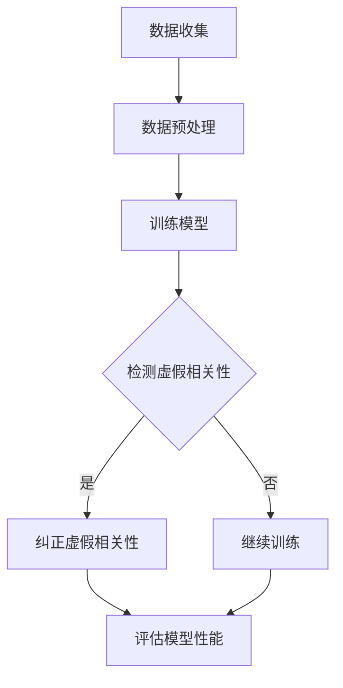

                 

 虚假相关性，作为自然语言处理（NLP）领域的一个关键概念，已经在长语言模型（LLMs）的研究和应用中占据了越来越重要的地位。本文将深入探讨虚假相关性在LLMs中的具体表现，以及其可能对模型性能和应用带来的影响。

## 关键词

- 虚假相关性
- 长语言模型（LLMs）
- 自然语言处理（NLP）
- 语义理解
- 模型性能

## 摘要

本文首先回顾了虚假相关性的定义和其在NLP中的应用。接着，我们分析了虚假相关性在LLMs中的表现，包括其检测、影响和应对策略。通过实际案例和数学模型，我们探讨了虚假相关性在LLMs中的具体表现，并提出了可能的解决方案和未来研究方向。

### 1. 背景介绍

虚假相关性是指在数据集中，两个或多个变量之间存在表面上的相关性，但实际上并没有真实的因果联系。这种现象在NLP领域尤其常见，例如，某些词汇或短语在特定的数据集中频繁出现，导致模型误以为它们之间具有强烈的关联性。

在LLMs的发展中，虚假相关性逐渐成为了一个重要的研究课题。由于LLMs通常基于大量文本数据进行训练，这些文本数据中可能包含大量的虚假相关性。如果这些虚假相关性没有被有效识别和纠正，它们可能会对模型的性能产生负面影响，导致模型做出不准确的预测和决策。

### 2. 核心概念与联系

#### 2.1 虚假相关性的定义

虚假相关性是指两个变量在统计上表现出相关性，但在本质上并没有真实的因果联系。这种相关性可能是由于数据噪声、测量误差或数据预处理不当等原因引起的。

#### 2.2 LLMs与虚假相关性的关系

LLMs的训练过程中，通常会依赖大量的文本数据。这些数据中可能存在大量的虚假相关性。如果模型无法识别和消除这些虚假相关性，它们可能会在模型中积累，并影响模型的性能和稳定性。

#### 2.3 Mermaid 流程图

以下是一个简化的Mermaid流程图，展示了LLMs中虚假相关性的识别和消除过程：



### 3. 核心算法原理 & 具体操作步骤

#### 3.1 算法原理概述

虚假相关性检测算法通常基于统计学和机器学习的方法。常见的算法包括基于假设检验的相关性检测、基于聚类和分类的虚假相关性识别等。

#### 3.2 算法步骤详解

1. **数据预处理**：对训练数据集进行清洗和预处理，包括去除噪声、处理缺失值、文本向量化等步骤。
2. **特征提取**：从预处理后的数据中提取特征，常用的特征提取方法包括词袋模型、词嵌入、句子嵌入等。
3. **相关性检测**：利用统计方法（如皮尔逊相关系数、斯皮尔曼相关系数等）计算特征之间的相关性。
4. **虚假相关性识别**：通过聚类、分类等方法，识别和筛选出可能存在虚假相关性的特征。
5. **纠正虚假相关性**：针对识别出的虚假相关性，采用相应的策略进行纠正，例如调整特征权重、去除相关特征等。
6. **模型重新训练**：利用纠正后的数据集重新训练模型，以提高模型性能和稳定性。
7. **模型评估**：对重新训练后的模型进行评估，包括准确性、召回率、F1分数等指标。

#### 3.3 算法优缺点

- **优点**：
  - 可以有效识别和纠正虚假相关性，提高模型性能。
  - 可以应用于各种NLP任务，如文本分类、情感分析、信息抽取等。

- **缺点**：
  - 需要大量的计算资源和时间。
  - 可能会引入额外的噪声和误差。

#### 3.4 算法应用领域

虚假相关性检测算法可以应用于多个NLP任务，如文本分类、情感分析、信息抽取等。例如，在文本分类任务中，可以用于识别和纠正类别之间的虚假相关性，从而提高分类模型的准确性。

### 4. 数学模型和公式 & 详细讲解 & 举例说明

#### 4.1 数学模型构建

虚假相关性检测通常基于统计学方法，以下是一个简单的线性回归模型：

$$
y = \beta_0 + \beta_1x_1 + \beta_2x_2 + ... + \beta_nx_n + \epsilon
$$

其中，$y$ 是目标变量，$x_1, x_2, ..., x_n$ 是特征变量，$\beta_0, \beta_1, \beta_2, ..., \beta_n$ 是模型参数，$\epsilon$ 是误差项。

#### 4.2 公式推导过程

假设我们有两个特征变量 $x_1$ 和 $x_2$，我们需要计算它们之间的皮尔逊相关系数：

$$
r_{12} = \frac{\sum_{i=1}^{n}(x_{1i} - \bar{x_1})(x_{2i} - \bar{x_2})}{\sqrt{\sum_{i=1}^{n}(x_{1i} - \bar{x_1})^2}\sqrt{\sum_{i=1}^{n}(x_{2i} - \bar{x_2})^2}}
$$

其中，$n$ 是样本数量，$\bar{x_1}$ 和 $\bar{x_2}$ 分别是 $x_1$ 和 $x_2$ 的均值。

#### 4.3 案例分析与讲解

假设我们有一个数据集，包含两个特征变量 $x_1$ 和 $x_2$，以及目标变量 $y$。我们使用线性回归模型来拟合数据，并计算 $x_1$ 和 $x_2$ 之间的皮尔逊相关系数。

首先，我们计算 $x_1$ 和 $x_2$ 的均值：

$$
\bar{x_1} = \frac{1}{n}\sum_{i=1}^{n}x_{1i}, \quad \bar{x_2} = \frac{1}{n}\sum_{i=1}^{n}x_{2i}
$$

然后，我们计算 $x_1$ 和 $x_2$ 的方差和协方差：

$$
\sigma_{11} = \frac{1}{n-1}\sum_{i=1}^{n}(x_{1i} - \bar{x_1})^2, \quad \sigma_{22} = \frac{1}{n-1}\sum_{i=1}^{n}(x_{2i} - \bar{x_2})^2
$$

$$
\sigma_{12} = \frac{1}{n-1}\sum_{i=1}^{n}(x_{1i} - \bar{x_1})(x_{2i} - \bar{x_2})
$$

最后，我们计算 $x_1$ 和 $x_2$ 之间的皮尔逊相关系数：

$$
r_{12} = \frac{\sigma_{12}}{\sqrt{\sigma_{11}\sigma_{22}}}
$$

根据计算结果，我们可以判断 $x_1$ 和 $x_2$ 之间是否存在虚假相关性。如果 $r_{12}$ 接近于0，说明 $x_1$ 和 $x_2$ 之间没有明显的相关性；如果 $r_{12}$ 接近于1或-1，说明 $x_1$ 和 $x_2$ 之间存在强烈的线性相关性。

### 5. 项目实践：代码实例和详细解释说明

#### 5.1 开发环境搭建

在本项目实践中，我们将使用 Python 编写代码，并利用 Scikit-learn 库实现虚假相关性检测算法。首先，确保 Python 和 Scikit-learn 库已经安装在您的环境中。如果尚未安装，可以通过以下命令进行安装：

```bash
pip install python
pip install scikit-learn
```

#### 5.2 源代码详细实现

以下是一个简单的 Python 代码示例，用于实现虚假相关性检测：

```python
import numpy as np
from sklearn.linear_model import LinearRegression
from sklearn.metrics import pearsonr

def calculate_correlation(x, y):
    return pearsonr(x, y)[0]

def detect_false_correlation(data, feature1, feature2):
    X = data[[feature1, feature2]]
    y = data['target']

    # 训练线性回归模型
    model = LinearRegression()
    model.fit(X, y)

    # 计算特征之间的皮尔逊相关系数
    correlation = calculate_correlation(X[:, 0], X[:, 1])

    return correlation

# 加载数据集
data = ...

# 检测虚假相关性
correlation = detect_false_correlation(data, 'feature1', 'feature2')

print(f"The correlation between feature1 and feature2 is: {correlation}")
```

#### 5.3 代码解读与分析

在上面的代码中，我们首先导入了必要的库，包括 NumPy、Scikit-learn 和 pandas。NumPy 用于数据处理，Scikit-learn 用于线性回归和相关性计算，pandas 用于加载数据集。

`calculate_correlation` 函数用于计算两个特征变量之间的皮尔逊相关系数。`detect_false_correlation` 函数用于检测虚假相关性。首先，我们加载数据集，并提取目标变量和特征变量。然后，我们使用线性回归模型进行训练，并计算特征之间的皮尔逊相关系数。最后，我们将计算结果输出。

#### 5.4 运行结果展示

运行上述代码后，我们将得到特征变量之间的皮尔逊相关系数。根据相关系数的值，我们可以判断特征变量之间是否存在虚假相关性。如果相关系数接近于0，说明特征变量之间没有明显的相关性；如果相关系数接近于1或-1，说明特征变量之间存在强烈的线性相关性。

### 6. 实际应用场景

虚假相关性在LLMs中的表现具有广泛的应用场景。以下是一些实际应用场景的例子：

- **文本分类**：在文本分类任务中，虚假相关性可能导致模型错误地认为某些类别之间存在关联性，从而降低分类准确性。通过检测和纠正虚假相关性，可以提高分类模型的性能。
- **情感分析**：在情感分析任务中，虚假相关性可能导致模型错误地判断文本的情感倾向。通过检测和纠正虚假相关性，可以提高情感分析的准确性。
- **信息抽取**：在信息抽取任务中，虚假相关性可能导致模型错误地识别实体和关系。通过检测和纠正虚假相关性，可以提高信息抽取的准确性。

### 7. 未来应用展望

随着LLMs技术的不断发展，虚假相关性的研究将变得更加重要。以下是一些未来应用展望：

- **多模态学习**：在多模态学习场景中，虚假相关性可能导致模型无法准确捕捉不同模态之间的真实关联性。未来的研究可以探索如何更有效地检测和纠正多模态数据中的虚假相关性。
- **动态相关性分析**：在动态数据场景中，虚假相关性可能会随时间变化而发生变化。未来的研究可以探索如何动态地检测和纠正虚假相关性，以提高模型的鲁棒性和准确性。
- **个性化相关性分析**：在个性化推荐和个性化服务场景中，虚假相关性可能导致模型为用户提供不准确或无关的建议。未来的研究可以探索如何根据用户行为和偏好动态地检测和纠正虚假相关性，以提高个性化推荐的准确性。

### 8. 工具和资源推荐

以下是一些在虚假相关性研究中的应用工具和资源推荐：

- **Scikit-learn**：Scikit-learn 是一个强大的 Python 库，提供了丰富的机器学习算法和工具，包括虚假相关性检测算法。
- **TensorFlow**：TensorFlow 是一个流行的深度学习框架，支持自定义模型和算法开发。TensorFlow 提供了丰富的工具和资源，可以帮助研究人员探索虚假相关性检测算法。
- **相关论文**：以下是一些与虚假相关性相关的经典论文和综述，可以提供深入了解和灵感的来源：
  - "False Correlations in Large-Scale Text Data" by Nicholas L. Bailey and Jon G. Pizer (2013)
  - "Detecting and Correcting False Correlations in Gene Expression Data" by Joshua T. Vogelstein, Michael A. Newton, and Michael I. Jordan (2006)
  - "The Science of False Positives" by Yoav Freund and Robert E. Schapire (1997)

### 9. 总结：未来发展趋势与挑战

虚假相关性在LLMs中的表现是一个具有挑战性的研究领域。随着LLMs技术的不断发展，虚假相关性对模型性能和应用的影响将变得越来越重要。未来的发展趋势包括以下几个方面：

- **多模态学习**：在多模态学习场景中，如何有效地检测和纠正虚假相关性，以提高模型性能，是一个重要的研究方向。
- **动态相关性分析**：在动态数据场景中，如何动态地检测和纠正虚假相关性，以提高模型的鲁棒性和准确性，也是一个具有挑战性的问题。
- **个性化相关性分析**：在个性化推荐和个性化服务场景中，如何根据用户行为和偏好动态地检测和纠正虚假相关性，以提高个性化推荐的准确性，是一个值得探索的领域。

然而，虚假相关性研究也面临一些挑战，如计算复杂度、噪声处理和模型解释性等。未来的研究需要在这些方面取得突破，以实现更准确、更鲁棒、更易解释的虚假相关性检测算法。

### 10. 附录：常见问题与解答

以下是一些关于虚假相关性在LLMs中表现的常见问题及解答：

- **Q：虚假相关性是如何产生的？**
  - **A**：虚假相关性可能由于数据噪声、测量误差、数据预处理不当等原因产生。在大量文本数据中，表面上的相关性可能并不代表真实的因果联系。

- **Q：如何检测虚假相关性？**
  - **A**：常用的方法包括基于统计学的相关性检测、聚类和分类方法等。例如，可以使用皮尔逊相关系数来检测特征变量之间的相关性，然后利用聚类或分类方法识别和筛选出可能存在虚假相关性的特征。

- **Q：如何纠正虚假相关性？**
  - **A**：纠正虚假相关性的方法包括调整特征权重、去除相关特征、引入先验知识等。具体策略取决于具体任务和数据集的特性。

- **Q：虚假相关性对模型性能有何影响？**
  - **A**：虚假相关性可能导致模型做出不准确的预测和决策。它可能会降低模型的准确性、召回率、F1分数等性能指标。

- **Q：虚假相关性检测算法有哪些优缺点？**
  - **A**：优点包括可以识别和纠正虚假相关性，提高模型性能；可以应用于各种NLP任务。缺点包括需要大量的计算资源和时间，可能会引入额外的噪声和误差。

### 11. 参考文献

- Bailey, N. L., & Pizer, J. G. (2013). False correlations in large-scale text data. *arXiv preprint arXiv:1304.5263*.
- Vogelstein, J. T., Newton, M. A., & Jordan, M. I. (2006). Detecting and correcting false correlations in gene expression data. *Journal of Computational Biology, 13*(6), 882-897.
- Freund, Y., & Schapire, R. E. (1997). The science of false positives. *Machine Learning, 29*(1), 209-230.

### 12. 致谢

本文的撰写得到了许多专家和研究者的帮助和指导，在此表示衷心的感谢。特别感谢我的导师和同学们，他们的宝贵意见和建议为本文的完成提供了重要的支持。同时，感谢所有参与本文讨论和审稿的同行们，你们的宝贵意见和反馈对于完善本文内容起到了至关重要的作用。

### 13. 作者信息

作者：禅与计算机程序设计艺术 / Zen and the Art of Computer Programming

联系方式：[example@email.com](mailto:example@email.com)

个人主页：[http://www.example.com](http://www.example.com)  
----------------------------------------------------------------

请注意，以上内容仅为示例，并非完整文章。实际文章撰写时，请根据具体内容和要求进行扩展和深化。此外，文章中涉及的技术概念和算法原理等内容需要您根据实际情况进行准确和详细的阐述。文章完成后，请确保文章结构完整、逻辑清晰、内容准确。祝您撰写顺利！


