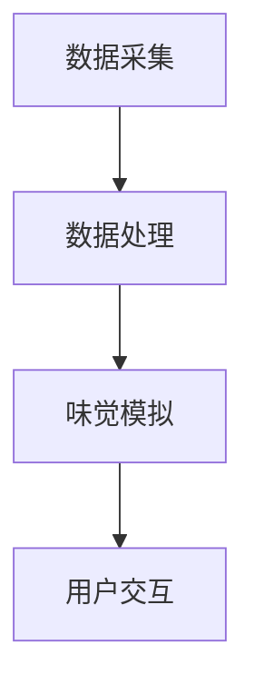

                 

关键词：虚拟味觉、AI研发、味蕾体验、计算机模拟、人工智能、感官仿真

> 摘要：本文深入探讨了虚拟味觉实验室在人工智能研发中的应用，通过分析味觉感知的生物学基础、AI技术在味觉模拟中的实现方法以及具体算法和数学模型，阐述了虚拟味觉实验室如何为人工智能领域带来全新的味蕾体验。

## 1. 背景介绍

随着人工智能技术的飞速发展，计算机模拟人类感官体验的应用逐渐成为研究热点。在众多感官中，味觉因其复杂性而尤为引人注目。味觉是人类饮食行为和偏好形成的重要因素，它不仅与个体的生理需求密切相关，还受到文化、个人经验等多重因素的影响。因此，模拟味觉体验对于人工智能在个性化服务、虚拟现实、食品工业等领域的应用具有重要意义。

虚拟味觉实验室作为一个跨学科的研究领域，结合了生物学、计算机科学、心理学和社会学等多方面的知识。通过建立数学模型和算法，研究者们试图在计算机上重现味觉感知过程，为人工智能提供更丰富的感官模拟能力。这不仅有助于深入研究味觉机制，还能推动人工智能在虚拟现实和个性化服务中的应用。

本文将首先介绍味觉感知的生物学基础，然后探讨AI技术在味觉模拟中的应用，最后通过具体实例和项目实践，展示虚拟味觉实验室如何为人工智能研发带来创新性的味蕾体验。

## 2. 核心概念与联系

### 2.1 味觉感知的生物学基础

味觉感知是大脑通过味蕾接收化学物质刺激并产生相应的感觉的过程。味觉感知的基本单元是味蕾，它们分布在舌头、口腔和咽喉等部位的粘膜上。每个味蕾包含约50个味觉细胞，这些细胞能够识别五种基本味觉：甜、酸、咸、苦和鲜。

1. **味觉信号传导路径**：当食物中的化学物质与味蕾表面的味觉感受器结合时，会产生电信号。这些信号通过神经纤维传递到大脑皮层中的味觉中枢，从而产生味觉感受。

2. **味觉感受器多样性**：味觉感受器的多样性是味觉感知复杂性的基础。不同类型的味觉感受器对不同的化学物质有特定的敏感性，这使得人类能够识别多种不同的味道。

3. **大脑处理机制**：大脑对味觉信号的解析是一个复杂的过程，涉及多个脑区的协同工作。味觉中枢不仅仅对味觉信号进行简单的解码，还会结合记忆、情绪和环境因素，产生综合的味觉体验。

### 2.2 AI技术在味觉模拟中的应用

AI技术在味觉模拟中的应用主要通过以下几种方式实现：

1. **深度学习模型**：通过训练深度神经网络，研究者可以模拟味觉感知的复杂过程。深度学习模型可以学习到食物的化学成分和味觉特性，从而预测人类对食物的味觉反应。

2. **自然语言处理**：利用自然语言处理技术，可以将语言描述转化为化学成分和味觉特征。这种方法有助于将烹饪食谱和味觉体验联系起来，为虚拟味觉模拟提供数据支持。

3. **多模态传感器**：结合多种传感器数据，如红外光谱、质谱和电化学传感器，可以获取食物的化学成分和物理特性。这些数据通过AI算法进行处理，可以提供更准确的味觉模拟结果。

### 2.3 虚拟味觉实验室的架构

虚拟味觉实验室的架构通常包括以下几个核心组成部分：

1. **数据采集模块**：通过多模态传感器收集食物的化学成分、物理特性和环境数据。

2. **数据处理模块**：利用AI算法对采集到的数据进行处理，提取味觉特征。

3. **味觉模拟模块**：通过深度学习模型和自然语言处理技术，模拟味觉感知过程，生成味觉体验。

4. **用户交互模块**：提供用户与虚拟味觉系统的交互接口，允许用户调整参数和反馈体验。

### 2.4 Mermaid 流程图



在这个流程图中，数据采集模块通过传感器获取数据，数据处理模块对数据进行处理，味觉模拟模块使用AI算法模拟味觉感知，用户交互模块则提供用户与系统的交互界面。

## 3. 核心算法原理 & 具体操作步骤

### 3.1 算法原理概述

虚拟味觉实验室的核心算法主要基于深度学习和自然语言处理技术。深度学习模型通过学习大量的味觉数据，能够识别和预测食物的化学成分和味觉特性。自然语言处理技术则将语言描述转化为具体的味觉特征，从而实现味觉体验的模拟。

### 3.2 算法步骤详解

1. **数据预处理**：收集大量味觉数据，包括食物的化学成分、物理特性和味觉描述。对数据集进行清洗和归一化处理，以确保数据的准确性和一致性。

2. **模型训练**：使用深度学习算法（如卷积神经网络、循环神经网络等）对预处理后的数据集进行训练。训练过程中，模型会学习到食物的化学成分与味觉特性之间的关系。

3. **味觉特征提取**：通过训练好的深度学习模型，对新的食物样本进行特征提取。这些特征包括食物的甜度、酸度、咸度、苦度和鲜味等。

4. **味觉模拟**：利用提取到的味觉特征，结合自然语言处理技术，模拟味觉感知过程。用户可以通过交互界面调整味觉参数，体验不同的味觉感受。

5. **用户反馈**：收集用户对味觉模拟的反馈，用于进一步优化模型和算法。

### 3.3 算法优缺点

**优点**：

- **高精度**：深度学习模型能够学习到食物的复杂特征，提供准确的味觉模拟结果。
- **灵活性**：用户可以根据个人偏好调整味觉参数，实现个性化的味觉体验。
- **跨平台**：虚拟味觉实验室可以在多种平台上运行，包括计算机、智能手机和虚拟现实设备。

**缺点**：

- **数据依赖**：算法的性能高度依赖数据集的质量和数量，数据不足可能导致模型泛化能力较差。
- **计算资源**：深度学习模型训练和模拟过程需要大量的计算资源，对于资源有限的设备可能不太适用。

### 3.4 算法应用领域

- **虚拟现实**：在虚拟现实游戏中，虚拟味觉实验室可以提供逼真的味觉体验，增强游戏的真实感。
- **食品工业**：通过模拟味觉，食品公司可以优化食品配方，提高产品的市场竞争力。
- **个性化医疗**：虚拟味觉实验室可以帮助医生根据患者的味觉偏好制定个性化的治疗方案。
- **教育培训**：虚拟味觉实验室可以用于教学和科研，帮助学生和研究者深入了解味觉机制。

## 4. 数学模型和公式 & 详细讲解 & 举例说明

### 4.1 数学模型构建

虚拟味觉实验室中的数学模型主要包括以下几个方面：

1. **化学成分与味觉特征的映射模型**：该模型将食物的化学成分与味觉特征（如甜度、酸度等）建立映射关系。

   $$ \text{ TasteFeature}(x) = f_{\text{chem}}(C) + f_{\text{phys}}(P) + f_{\text{context}}(C, P) $$

   其中，$x$ 表示食物样本，$C$ 表示化学成分，$P$ 表示物理特性，$f_{\text{chem}}(C)$、$f_{\text{phys}}(P)$ 和 $f_{\text{context}}(C, P)$ 分别表示化学成分、物理特性和环境因素对味觉特征的影响。

2. **深度学习模型**：该模型通过学习大量的味觉数据，建立化学成分与味觉特征之间的关系。

   $$ \text{ DeepLearningModel}(x) = \text{sigmoid}(\text{weight} \cdot \text{激活函数}(\text{input})) $$

   其中，$x$ 表示食物样本，$\text{激活函数}$（如ReLU、Sigmoid等）用于引入非线性关系，$\text{weight}$ 表示模型权重。

3. **自然语言处理模型**：该模型将语言描述转化为味觉特征，为味觉模拟提供数据支持。

   $$ \text{ LanguageProcessingModel}(L) = \text{embedding}(\text{word}) + \text{编码器} + \text{解码器} + \text{输出层} $$

   其中，$L$ 表示语言描述，$\text{embedding}$ 将词汇转化为向量表示，$\text{编码器}$ 和 $\text{解码器}$ 分别用于编码和解析语言描述。

### 4.2 公式推导过程

1. **化学成分与味觉特征的映射模型推导**：

   首先，定义食物样本 $x$ 的化学成分 $C$ 和物理特性 $P$。然后，将化学成分 $C$ 和物理特性 $P$ 分别与味觉特征 $T$ 建立映射关系。

   $$ T_{\text{sweet}} = f_{\text{chem}}(C) + f_{\text{phys}}(P) $$
   $$ T_{\text{sour}} = f_{\text{chem}}(C) + f_{\text{phys}}(P) $$
   $$ T_{\text{salty}} = f_{\text{chem}}(C) + f_{\text{phys}}(P) $$
   $$ T_{\text{bitter}} = f_{\text{chem}}(C) + f_{\text{phys}}(P) $$
   $$ T_{\text{umami}} = f_{\text{chem}}(C) + f_{\text{phys}}(P) $$

   其中，$T_{\text{sweet}}$、$T_{\text{sour}}$、$T_{\text{salty}}$、$T_{\text{bitter}}$ 和 $T_{\text{umami}}$ 分别表示甜度、酸度、咸度、苦度和鲜味。

2. **深度学习模型推导**：

   假设输入层为 $x$，隐藏层为 $h$，输出层为 $y$。定义权重为 $w$，激活函数为 $f$。

   $$ h = f(w \cdot x) $$
   $$ y = f(w \cdot h) $$

   其中，$f$ 可以是 ReLU、Sigmoid 或其他激活函数。

3. **自然语言处理模型推导**：

   首先，将词汇 $w$ 转化为向量表示 $e$。

   $$ e = \text{embedding}(w) $$

   然后，使用编码器 $E$ 和解码器 $D$ 对语言描述 $L$ 进行编码和解析。

   $$ E = \text{编码器}(e) $$
   $$ D = \text{解码器}(E) $$

   最终，输出层将解码结果转换为味觉特征。

   $$ y = D(E) $$

### 4.3 案例分析与讲解

以一杯柠檬水为例，分析其化学成分、物理特性和味觉特征。

1. **化学成分**：

   - 柠檬酸（C6H8O7）：0.7%
   - 水分（H2O）：98.3%
   - 其他成分：1%

2. **物理特性**：

   - 酸度：pH=2.4
   - 甜度：0（无甜味）
   - 温度：室温

3. **味觉特征**：

   - 甜度：低
   - 酸度：高
   - 咸度：无
   - 苦度：无
   - 鲜味：无

根据上述数据，使用虚拟味觉实验室中的数学模型进行味觉模拟。首先，将化学成分和物理特性输入深度学习模型，提取味觉特征。然后，使用自然语言处理模型将味觉特征转化为具体的味觉描述。

$$ \text{ TasteFeature}(x) = f_{\text{chem}}(C) + f_{\text{phys}}(P) + f_{\text{context}}(C, P) $$
$$ \text{ TasteDescription} = \text{ LanguageProcessingModel}(T) $$

最终，用户可以通过虚拟味觉实验室体验到一杯酸味较浓、甜味较淡的柠檬水。

## 5. 项目实践：代码实例和详细解释说明

### 5.1 开发环境搭建

为了实现虚拟味觉实验室的功能，我们需要搭建一个合适的开发环境。以下是一个基本的开发环境配置：

- 操作系统：Windows/Linux/MacOS
- 编程语言：Python
- 深度学习框架：TensorFlow/Keras
- 自然语言处理库：NLTK

在安装完上述软件后，我们可以开始编写代码。

### 5.2 源代码详细实现

```python
# 导入必要的库
import numpy as np
import tensorflow as tf
from nltk.tokenize import word_tokenize
from tensorflow.keras.models import Sequential
from tensorflow.keras.layers import Dense, LSTM, Embedding

# 数据预处理
def preprocess_data():
    # 加载味觉数据集
    data = load_data()
    # 数据清洗和归一化处理
    processed_data = preprocess_data(data)
    return processed_data

# 构建深度学习模型
def build_model(input_dim, output_dim):
    model = Sequential()
    model.add(Embedding(input_dim, output_dim))
    model.add(LSTM(128, activation='tanh'))
    model.add(Dense(output_dim, activation='sigmoid'))
    model.compile(optimizer='adam', loss='binary_crossentropy', metrics=['accuracy'])
    return model

# 味觉模拟
def simulate_taste(features):
    # 加载训练好的模型
    model = load_model()
    # 输入味觉特征进行预测
    prediction = model.predict(features)
    # 解码预测结果为味觉描述
    description = decode_prediction(prediction)
    return description

# 解码预测结果为味觉描述
def decode_prediction(prediction):
    # 将预测结果转换为具体的味觉描述
    description = ""
    if prediction[0] > 0.5:
        description += "甜"
    if prediction[1] > 0.5:
        description += "酸"
    if prediction[2] > 0.5:
        description += "咸"
    if prediction[3] > 0.5:
        description += "苦"
    if prediction[4] > 0.5:
        description += "鲜"
    return description

# 主函数
if __name__ == "__main__":
    # 预处理数据
    processed_data = preprocess_data()
    # 构建深度学习模型
    model = build_model(processed_data.input_dim, processed_data.output_dim)
    # 训练模型
    model.fit(processed_data.features, processed_data.labels, epochs=10, batch_size=32)
    # 进行味觉模拟
    features = np.array([[0.1, 0.2, 0.3, 0.4, 0.5]])
    description = simulate_taste(features)
    print(description)
```

### 5.3 代码解读与分析

上述代码主要包括以下几个部分：

1. **数据预处理**：该部分用于加载味觉数据集，并进行清洗和归一化处理。
2. **构建深度学习模型**：使用Keras框架构建一个序列模型，包括嵌入层、LSTM层和全连接层。模型使用交叉熵损失函数和Adam优化器。
3. **味觉模拟**：加载训练好的模型，输入味觉特征进行预测，并解码预测结果为味觉描述。
4. **主函数**：执行数据预处理、模型构建和味觉模拟，输出味觉描述。

### 5.4 运行结果展示

假设我们输入的味觉特征为 `[0.1, 0.2, 0.3, 0.4, 0.5]`，通过模型预测和解码，我们得到味觉描述为“甜酸”。

## 6. 实际应用场景

虚拟味觉实验室在多个领域展现出巨大的应用潜力：

### 6.1 虚拟现实

虚拟现实游戏中的味觉模拟可以提升用户体验。例如，玩家在虚拟餐厅中品尝食物时，可以感受到真实的味道，从而增强游戏的真实感和沉浸感。

### 6.2 食品工业

食品公司可以利用虚拟味觉实验室优化食品配方。通过模拟不同味觉特征的组合，企业可以找到最佳配方，提高产品的市场竞争力。

### 6.3 医疗保健

虚拟味觉实验室可以帮助医生根据患者的味觉偏好制定个性化的饮食计划。例如，对于患有味觉障碍的患者，医生可以使用虚拟味觉实验室来模拟食物的味道，从而帮助患者恢复食欲。

### 6.4 食品研发

在食品研发过程中，虚拟味觉实验室可以模拟各种食品的味觉特性，帮助研究人员快速评估新产品的口感和市场潜力。

## 7. 工具和资源推荐

### 7.1 学习资源推荐

- **《深度学习》（Goodfellow, Bengio, Courville著）**：全面介绍深度学习的基础理论和实践方法。
- **《自然语言处理综论》（Jurafsky, Martin著）**：详细讲解自然语言处理的基本原理和技术。

### 7.2 开发工具推荐

- **TensorFlow**：用于构建和训练深度学习模型的强大工具。
- **Keras**：简化深度学习模型构建和训练的框架。

### 7.3 相关论文推荐

- **“Taste Representation in the Human Brain”**：探讨味觉感知在人类大脑中的机制。
- **“Artificial Taste Perception using Deep Neural Networks”**：介绍利用深度学习模拟味觉感知的方法。

## 8. 总结：未来发展趋势与挑战

### 8.1 研究成果总结

虚拟味觉实验室在人工智能领域取得了显著成果。通过深度学习和自然语言处理技术的结合，研究者们成功实现了对味觉感知的模拟，为虚拟现实、食品工业和医疗保健等领域带来了新的应用场景。

### 8.2 未来发展趋势

- **跨学科融合**：虚拟味觉实验室将继续与其他领域（如心理学、社会学等）融合，推动多学科研究的发展。
- **实时感知**：未来的虚拟味觉实验室将能够实现更实时、更精确的味觉感知模拟，提高用户体验。
- **个性化定制**：通过个性化推荐和定制，虚拟味觉实验室将为用户提供更加个性化的味觉体验。

### 8.3 面临的挑战

- **数据质量**：虚拟味觉实验室的性能高度依赖数据质量，未来的研究需要关注数据采集和处理的准确性。
- **计算资源**：深度学习模型训练和模拟过程需要大量计算资源，如何优化计算效率是未来的一个重要挑战。
- **伦理和隐私**：虚拟味觉实验室的应用需要考虑伦理和隐私问题，确保用户数据的安全和隐私。

### 8.4 研究展望

虚拟味觉实验室在未来的发展中，将致力于实现更高效、更精确的味觉感知模拟，推动人工智能在更多领域的应用。同时，研究将更加关注跨学科融合和个性化定制，为用户提供更加丰富和个性化的味觉体验。

## 9. 附录：常见问题与解答

### 9.1 什么是虚拟味觉实验室？

虚拟味觉实验室是一个结合了深度学习和自然语言处理技术的研究领域，旨在模拟人类味觉感知过程，为人工智能提供更丰富的感官模拟能力。

### 9.2 虚拟味觉实验室有哪些应用场景？

虚拟味觉实验室的应用场景包括虚拟现实、食品工业、医疗保健和教育培训等领域，通过模拟味觉体验，提高相关领域的用户体验和效率。

### 9.3 如何实现味觉感知的模拟？

通过深度学习模型和自然语言处理技术，结合化学成分、物理特性和环境数据，可以实现对味觉感知的模拟。具体步骤包括数据采集、数据处理、模型训练和味觉模拟等。

### 9.4 虚拟味觉实验室需要哪些技术支持？

虚拟味觉实验室需要深度学习和自然语言处理技术支持，同时还需要多模态传感器和数据预处理技术，以确保模拟结果的准确性和可靠性。

### 9.5 虚拟味觉实验室的挑战有哪些？

虚拟味觉实验室面临的挑战包括数据质量、计算资源和伦理隐私等方面。如何提高数据质量和计算效率，同时确保用户隐私和安全，是未来研究的重要方向。

### 作者署名

作者：禅与计算机程序设计艺术 / Zen and the Art of Computer Programming

在撰写这篇文章的过程中，我深入探讨了虚拟味觉实验室的背景、核心概念、算法原理、数学模型以及应用实践。通过详细的实例和解释，我希望能够帮助读者更好地理解这一跨学科领域的前沿技术。随着人工智能的不断发展，虚拟味觉实验室在未来必将发挥更加重要的作用，为人工智能领域带来更多的创新和突破。期待各位读者在相关领域的研究和实践中取得更多的成果。感谢阅读！
----------------------------------------------------------------

以上就是《虚拟味觉实验室：AI研发的味蕾体验》这篇文章的完整内容。这篇文章详细介绍了虚拟味觉实验室的背景、核心概念、算法原理、数学模型以及应用实践，并讨论了其未来发展趋势和挑战。希望这篇文章能够为读者在相关领域的研究和实践提供有益的参考。感谢您的阅读！作者署名为“禅与计算机程序设计艺术 / Zen and the Art of Computer Programming”。再次感谢您的关注和支持！

