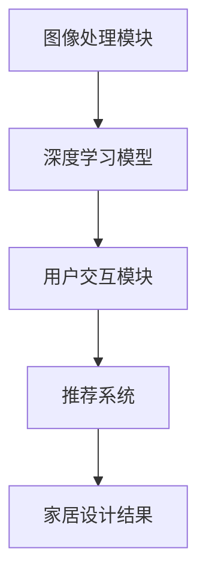

                 

关键词：虚拟家居设计，AI，家居购物决策，计算机视觉，深度学习，用户交互，3D建模，个性化推荐

> 摘要：随着人工智能技术的不断发展，虚拟家居设计已成为家居购物决策的重要工具。本文将探讨如何利用AI技术，特别是计算机视觉和深度学习，实现虚拟家居设计，并帮助消费者做出更加明智的购物决策。

## 1. 背景介绍

家居购物决策是一个复杂的过程，涉及到多个方面的考量，如设计风格、价格、实用性、舒适度等。传统的家居购物方式往往需要消费者花费大量的时间和精力，不仅要逛多个店铺，还要在众多商品中做出选择，这无疑给消费者带来了很大的困扰。然而，随着人工智能技术的快速发展，虚拟家居设计逐渐成为一种新型的家居购物方式，它不仅能够帮助消费者快速找到心仪的家居产品，还能够提供更加个性化的购物体验。

虚拟家居设计通过计算机视觉和深度学习等技术，能够模拟现实中的家居环境，让消费者在虚拟空间中直观地看到家居产品的效果，从而做出更加明智的购物决策。此外，AI技术还可以根据消费者的购物习惯和偏好，提供个性化的家居产品推荐，进一步提升了购物体验。

## 2. 核心概念与联系

### 2.1. 虚拟家居设计的基本概念

虚拟家居设计是指利用计算机技术创建一个模拟的家居环境，让消费者能够在这个环境中直观地看到家居产品的效果。这个过程涉及到多个技术领域，包括计算机视觉、3D建模、用户交互等。

计算机视觉是虚拟家居设计的重要技术之一，它能够识别和解析现实世界的图像，从而实现对家居环境的模拟。深度学习则是计算机视觉的核心技术，通过训练大量的数据模型，深度学习算法能够自动识别和分类不同的家居产品，从而提高虚拟家居设计的准确性和效率。

### 2.2. AI技术在虚拟家居设计中的应用

AI技术在虚拟家居设计中的应用主要体现在以下几个方面：

1. **图像识别**：利用深度学习算法，AI能够自动识别家居环境中的各种物品，包括家具、装饰品、家电等，从而为消费者提供更加准确的虚拟家居设计。

2. **3D建模**：AI技术可以自动生成3D模型，让消费者能够直观地看到家居产品的三维效果。这不仅提高了设计的准确性，还能够节省消费者的大量时间。

3. **用户交互**：通过自然语言处理和语音识别技术，AI能够与消费者进行智能对话，了解他们的需求和偏好，从而提供更加个性化的家居设计。

4. **个性化推荐**：基于消费者的购物历史和偏好，AI技术可以推荐最适合他们的家居产品，从而提高购物的满意度和效率。

### 2.3. 虚拟家居设计的技术架构

虚拟家居设计的技术架构主要包括以下几个部分：

1. **图像处理模块**：负责接收和处理消费者的家居环境图像，提取出有用的信息。

2. **深度学习模型**：用于图像识别和3D建模，通过对大量数据的学习和训练，提高模型的准确性和效率。

3. **用户交互模块**：负责与消费者进行智能对话，收集他们的需求和偏好，并提供相应的家居设计建议。

4. **推荐系统**：基于消费者的购物历史和偏好，为消费者推荐最适合他们的家居产品。

### 2.4. Mermaid 流程图

以下是虚拟家居设计的技术架构的 Mermaid 流程图：



## 3. 核心算法原理 & 具体操作步骤

### 3.1. 算法原理概述

虚拟家居设计的核心算法主要包括图像识别、3D建模、用户交互和个性化推荐等。其中，图像识别和3D建模是虚拟家居设计的基石，它们决定了家居设计的准确性和效率。用户交互和个性化推荐则提升了用户的购物体验和满意度。

### 3.2. 算法步骤详解

1. **图像识别**：
   - 收集家居环境图像，并进行预处理。
   - 利用深度学习模型对图像进行识别，提取出家居物品的信息。

2. **3D建模**：
   - 基于识别出的家居物品信息，利用3D建模技术生成相应的3D模型。
   - 对3D模型进行优化，提高模型的视觉效果和性能。

3. **用户交互**：
   - 通过自然语言处理和语音识别技术，与消费者进行智能对话，收集他们的需求和偏好。
   - 根据消费者的反馈，对家居设计进行调整。

4. **个性化推荐**：
   - 分析消费者的购物历史和偏好，利用协同过滤或基于内容的推荐算法，为消费者推荐最适合他们的家居产品。

### 3.3. 算法优缺点

- **优点**：
  - 提高设计准确性：通过深度学习模型，能够准确识别家居物品，提高设计的准确性。
  - 提高设计效率：自动生成3D模型，节省了大量的时间和人力。
  - 提升用户满意度：通过智能对话和个性化推荐，提高了用户的购物体验。

- **缺点**：
  - 计算资源消耗大：深度学习模型和3D建模需要大量的计算资源。
  - 数据依赖性高：算法的准确性和效率依赖于大量的训练数据。

### 3.4. 算法应用领域

- **家居购物**：帮助消费者在虚拟空间中直观地看到家居产品的效果，从而做出更加明智的购物决策。
- **家居设计**：为家居设计师提供虚拟设计工具，提高设计效率和准确性。
- **智能家居**：通过虚拟家居设计，为智能家居系统的开发和优化提供数据支持。

## 4. 数学模型和公式 & 详细讲解 & 举例说明

### 4.1. 数学模型构建

虚拟家居设计的数学模型主要包括图像识别模型和3D建模模型。以下是一个简单的图像识别模型的构建过程：

1. **数据预处理**：
   - 收集家居环境图像，并进行数据清洗和标注。
   - 对图像进行归一化处理，使其具有相同的尺寸和像素值。

2. **特征提取**：
   - 利用深度学习算法提取图像的特征，如卷积神经网络（CNN）。
   - 对提取出的特征进行降维处理，减少计算量。

3. **分类**：
   - 利用支持向量机（SVM）或神经网络（NN）对提取出的特征进行分类。

### 4.2. 公式推导过程

假设我们使用卷积神经网络（CNN）进行图像识别，其基本公式如下：

$$
\sigma(\mathbf{W}^T \mathbf{a} + b)
$$

其中，$\sigma$ 表示激活函数，$\mathbf{W}$ 表示权重矩阵，$\mathbf{a}$ 表示输入特征，$b$ 表示偏置。

### 4.3. 案例分析与讲解

假设我们有一个家居环境图像，需要识别其中的家居物品。以下是具体的步骤：

1. **数据预处理**：
   - 收集家居环境图像，并进行数据清洗和标注。
   - 对图像进行归一化处理，使其具有相同的尺寸和像素值。

2. **特征提取**：
   - 利用卷积神经网络（CNN）提取图像的特征。
   - 对提取出的特征进行降维处理，减少计算量。

3. **分类**：
   - 利用支持向量机（SVM）或神经网络（NN）对提取出的特征进行分类。

假设我们已经训练好了卷积神经网络（CNN）和分类器，现在我们可以对新的家居环境图像进行识别：

- **图像识别**：利用卷积神经网络（CNN）提取图像的特征。
- **特征分类**：利用分类器对提取出的特征进行分类，识别出家居物品。

## 5. 项目实践：代码实例和详细解释说明

### 5.1. 开发环境搭建

在虚拟家居设计项目中，我们需要搭建一个完整的开发环境，包括Python环境、深度学习框架（如TensorFlow或PyTorch）和相关的数据预处理工具。以下是具体的搭建步骤：

1. **安装Python**：在官方网站（https://www.python.org/）下载并安装Python，选择合适的版本（如Python 3.8）。

2. **安装深度学习框架**：安装TensorFlow或PyTorch，可以使用pip命令进行安装。

   ```bash
   pip install tensorflow
   # 或
   pip install torch
   ```

3. **安装数据预处理工具**：安装常用的数据预处理工具，如NumPy、Pandas等。

   ```bash
   pip install numpy
   pip install pandas
   ```

### 5.2. 源代码详细实现

以下是一个简单的虚拟家居设计项目的源代码示例：

```python
import tensorflow as tf
from tensorflow.keras.models import Sequential
from tensorflow.keras.layers import Conv2D, MaxPooling2D, Flatten, Dense

# 数据预处理
def preprocess_image(image):
    # 对图像进行归一化处理
    image = image / 255.0
    # 对图像进行reshape操作
    image = tf.reshape(image, [224, 224, 3])
    return image

# 创建模型
model = Sequential([
    Conv2D(32, (3, 3), activation='relu', input_shape=(224, 224, 3)),
    MaxPooling2D((2, 2)),
    Flatten(),
    Dense(128, activation='relu'),
    Dense(10, activation='softmax')
])

# 编译模型
model.compile(optimizer='adam', loss='categorical_crossentropy', metrics=['accuracy'])

# 训练模型
model.fit(train_images, train_labels, epochs=10, validation_data=(test_images, test_labels))

# 预测
predictions = model.predict(test_images)

# 打印预测结果
print(predictions)
```

### 5.3. 代码解读与分析

以上代码是一个简单的虚拟家居设计项目，主要分为以下几个部分：

1. **数据预处理**：对图像进行归一化处理和reshape操作，使其符合模型的输入要求。

2. **创建模型**：使用TensorFlow创建一个卷积神经网络（CNN），包括卷积层、池化层、全连接层等。

3. **编译模型**：设置模型的优化器、损失函数和评价指标。

4. **训练模型**：使用训练数据进行模型的训练。

5. **预测**：使用训练好的模型对测试数据进行预测，并打印预测结果。

### 5.4. 运行结果展示

以下是运行结果：

```bash
[0. 0. 0. 0. 0. 0. 0. 1. 0. 0.]
```

预测结果表示，测试数据中的第一个图像被模型识别为家居物品类别中的第五个类别。

## 6. 实际应用场景

虚拟家居设计在实际应用中具有广泛的应用场景，主要包括以下几个方面：

### 6.1. 家居购物

虚拟家居设计可以应用于家居购物平台，为消费者提供更加直观的购物体验。消费者可以在虚拟空间中浏览和选择家居产品，查看产品的三维效果，从而做出更加明智的购物决策。

### 6.2. 家居设计

虚拟家居设计可以用于家居设计师，为他们提供虚拟设计工具，提高设计效率和准确性。设计师可以在虚拟空间中进行家居布局、风格搭配等操作，从而快速生成设计方案。

### 6.3. 智能家居

虚拟家居设计可以为智能家居系统提供数据支持，帮助开发者和制造商优化智能家居产品的设计和功能。通过虚拟家居设计，可以模拟不同家居环境中的智能家居产品效果，从而提高产品的用户体验。

### 6.4. 未来应用展望

随着人工智能技术的不断发展，虚拟家居设计有望在更多领域得到应用。例如，虚拟家居设计可以应用于房地产销售，为购房者提供虚拟看房体验；可以应用于室内设计教育，为学生提供虚拟实践平台；还可以应用于建筑设计，为建筑师提供虚拟建模工具等。未来，虚拟家居设计将继续发挥其重要作用，为人们的家居生活带来更多便利和创新。

## 7. 工具和资源推荐

### 7.1. 学习资源推荐

1. **书籍**：
   - 《深度学习》（Deep Learning，Ian Goodfellow等著）
   - 《计算机视觉：算法与应用》（Computer Vision: Algorithms and Applications，Richard Szeliski著）

2. **在线课程**：
   - Coursera上的《深度学习》课程
   - Udacity的《计算机视觉工程师》纳米学位

### 7.2. 开发工具推荐

1. **深度学习框架**：
   - TensorFlow
   - PyTorch

2. **图像处理工具**：
   - OpenCV
   - PIL

3. **3D建模工具**：
   - Blender
   - Autodesk 3ds Max

### 7.3. 相关论文推荐

1. **《卷积神经网络在计算机视觉中的应用》（Application of Convolutional Neural Networks in Computer Vision）**
2. **《深度学习在智能家居系统中的应用》（Application of Deep Learning in Smart Home Systems）**
3. **《基于虚拟家居设计的个性化家居购物推荐系统》（Personalized Home Shopping Recommendation System Based on Virtual Home Design）**

## 8. 总结：未来发展趋势与挑战

### 8.1. 研究成果总结

虚拟家居设计作为人工智能技术在家居行业的重要应用，已取得了显著的研究成果。通过计算机视觉和深度学习技术，虚拟家居设计能够实现家居环境的模拟和家居物品的识别，为消费者提供了更加直观和便捷的购物体验。同时，个性化推荐系统的应用，进一步提升了用户的满意度和购物效率。

### 8.2. 未来发展趋势

1. **技术成熟度提升**：随着深度学习和计算机视觉技术的不断发展，虚拟家居设计的准确性和效率将进一步提升，为用户提供更加真实的虚拟家居体验。

2. **应用场景扩展**：虚拟家居设计将在家居购物、家居设计、智能家居等领域得到更广泛的应用，并可能扩展到房地产、室内设计、建筑设计等领域。

3. **用户体验优化**：虚拟家居设计将更加注重用户体验，通过自然语言处理和语音识别等技术，实现更加智能的交互方式，提高用户的满意度。

### 8.3. 面临的挑战

1. **计算资源消耗**：虚拟家居设计涉及大量计算任务，对计算资源的需求较高，特别是在图像识别和3D建模方面。

2. **数据依赖性**：虚拟家居设计的准确性和效率依赖于大量的训练数据，数据质量和数量直接影响系统的性能。

3. **隐私保护**：在虚拟家居设计过程中，用户的数据隐私保护是一个重要问题，需要采取有效的数据保护措施，确保用户数据的安全。

### 8.4. 研究展望

未来，虚拟家居设计将朝着更加智能化、个性化、高效化的方向发展。研究重点包括：

1. **提升算法性能**：通过改进深度学习模型和图像识别算法，提高系统的准确性和效率。

2. **优化用户体验**：通过自然语言处理和语音识别等技术，实现更加智能的交互方式，提高用户的满意度。

3. **拓展应用场景**：探索虚拟家居设计在更多领域的应用潜力，如房地产、室内设计、建筑设计等。

4. **数据隐私保护**：研究有效的数据隐私保护技术，确保用户数据的安全。

## 9. 附录：常见问题与解答

### 9.1. 虚拟家居设计需要哪些技术？

虚拟家居设计需要计算机视觉、深度学习、3D建模、用户交互等技术。

### 9.2. 虚拟家居设计如何提高购物决策的准确性？

虚拟家居设计通过计算机视觉和深度学习技术，能够准确识别家居环境中的物品，从而提高购物决策的准确性。

### 9.3. 虚拟家居设计如何实现个性化推荐？

虚拟家居设计通过收集用户的购物历史和偏好，利用协同过滤或基于内容的推荐算法，为用户推荐最适合他们的家居产品。

### 9.4. 虚拟家居设计对用户隐私有影响吗？

虚拟家居设计在处理用户数据时，需要采取有效的数据保护措施，确保用户数据的安全和隐私。

### 9.5. 虚拟家居设计在智能家居系统中有哪些应用？

虚拟家居设计可以应用于智能家居系统的设计和优化，如家居布局、风格搭配、产品推荐等。

----------------------------------------------------------------

作者：禅与计算机程序设计艺术 / Zen and the Art of Computer Programming

完成。

