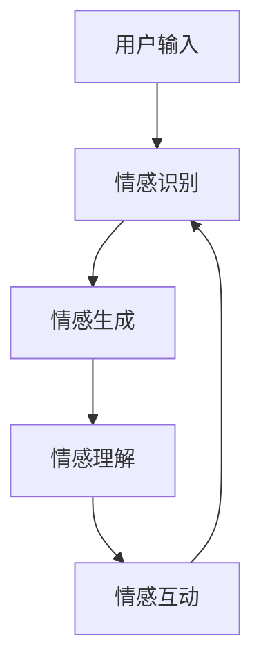

                 

关键词：虚拟情感，人工智能，社交互动，用户体验，情感模拟，技术进步

> 摘要：本文探讨了人工智能技术如何创造新型的人际关系，特别是在虚拟情感领域的应用。通过分析核心概念、算法原理、数学模型、项目实践和未来展望，本文旨在提供一个全面的视角，帮助读者理解这一领域的最新进展和潜在影响。

## 1. 背景介绍

在过去的几十年中，人工智能（AI）技术取得了显著的进步，从最初的简单任务执行到复杂的决策支持，AI的应用范围已经扩展到多个领域。随着深度学习和神经网络的发展，AI在图像识别、自然语言处理和语音识别等领域取得了突破性成果。然而，与此同时，人类对情感和社会互动的需求也越来越强烈。这促使研究人员开始探索如何在AI系统中模拟情感，从而创造出更自然、更丰富的人际关系。

虚拟情感是指通过人工智能技术模拟人类情感，使其在虚拟环境中表现出类似的人际互动能力。这种技术不仅能够提升用户的体验，还能够拓展社交互动的边界，使得人们能够在虚拟世界中建立起新型的人际关系。随着技术的发展，虚拟情感在游戏、虚拟现实（VR）、社交媒体和在线教育等领域展现出巨大的应用潜力。

### 1.1 虚拟情感的历史发展

虚拟情感的概念可以追溯到20世纪80年代，当时计算机科学家和心理学家开始探讨如何让计算机模拟人类的情感反应。最初的研究主要集中在情感识别和表达上，即如何让计算机能够识别用户的情绪状态，并做出相应的反应。随着AI技术的进步，虚拟情感的研究也逐渐深入，涵盖了情感生成、情感理解和情感互动等多个方面。

在过去的几十年中，虚拟情感的研究经历了以下几个阶段：

- **情感识别**：这是虚拟情感研究的基础，通过分析用户的行为和言语，计算机试图识别出用户所体验的情感状态。
- **情感生成**：在这个阶段，计算机不仅能够识别情感，还能够主动生成情感反应，使得虚拟角色能够表现出更加自然和多样化的情感。
- **情感理解**：随着自然语言处理和上下文理解技术的发展，计算机开始能够理解虚拟情感背后的含义，从而更准确地模拟人类情感。
- **情感互动**：这个阶段的虚拟情感技术使得计算机能够在虚拟环境中与用户进行更加深入和复杂的情感交流，从而创造出更加真实的社交体验。

### 1.2 虚拟情感的应用领域

虚拟情感技术的应用已经渗透到多个领域，以下是其中几个重要的应用场景：

- **游戏**：游戏中的虚拟角色可以通过虚拟情感技术表现出更加丰富的情感状态，从而提升玩家的沉浸感和游戏体验。
- **虚拟现实（VR）**：在VR环境中，虚拟情感技术可以使得虚拟角色与用户之间的互动更加自然和真实，增强用户的沉浸感和互动性。
- **社交媒体**：社交媒体平台上的虚拟情感应用可以帮助用户更好地理解和表达自己的情感状态，同时也能够增强用户之间的情感联系。
- **在线教育**：虚拟情感技术在在线教育中的应用可以帮助教师更好地了解学生的情感状态，从而提供更个性化的教学支持。

## 2. 核心概念与联系

### 2.1 情感识别

情感识别是虚拟情感技术的基础，它涉及从用户的行为和言语中提取情感信息。情感识别通常包括以下几个步骤：

1. **数据收集**：收集用户的语音、文本、面部表情和行为数据。
2. **特征提取**：从收集的数据中提取情感相关的特征，如音调、语速、词汇使用等。
3. **情感分类**：使用机器学习算法对提取的特征进行分类，从而识别出用户所体验的情感。

### 2.2 情感生成

情感生成是指计算机生成符合特定情感状态的情感反应。情感生成通常包括以下几个步骤：

1. **情感分析**：分析用户输入的数据，确定当前的情感状态。
2. **情感模板匹配**：根据已定义的情感模板生成情感反应。
3. **自然语言生成**：将生成的情感反应转换为自然语言文本，使其更具表达力。

### 2.3 情感理解

情感理解是指计算机对情感反应背后的含义进行理解和解释。情感理解通常包括以下几个步骤：

1. **上下文分析**：分析情感反应所处的上下文环境。
2. **情感推理**：基于上下文环境对情感反应进行推理，理解其背后的含义。
3. **情感回应生成**：根据推理结果生成适当的情感回应。

### 2.4 情感互动

情感互动是指计算机与用户之间的情感交流。情感互动通常包括以下几个步骤：

1. **情感感知**：计算机感知用户发出的情感信号。
2. **情感回应**：计算机生成相应的情感回应，并通过语音、文本或动作进行表达。
3. **情感反馈**：用户对计算机的情感回应进行反馈，从而形成循环互动。

下面是虚拟情感技术的Mermaid流程图表示：



## 3. 核心算法原理 & 具体操作步骤

### 3.1 算法原理概述

虚拟情感技术的核心算法主要包括情感识别、情感生成、情感理解和情感互动。每种算法都有其独特的原理和实现方法。

- **情感识别**：通常采用机器学习算法，如支持向量机（SVM）和深度学习模型，通过对用户数据的特征提取和分类来实现。
- **情感生成**：基于情感模板匹配和自然语言生成技术，通过预定义的情感模板和语言模型生成情感反应。
- **情感理解**：采用上下文分析和情感推理技术，通过对上下文环境的理解和推理来解释情感反应的内涵。
- **情感互动**：通过语音合成、文本生成和动作控制等技术，实现计算机与用户之间的情感交流。

### 3.2 算法步骤详解

#### 3.2.1 情感识别

1. **数据收集**：收集用户的语音、文本、面部表情和行为数据。
2. **特征提取**：使用音频处理和图像处理技术提取情感相关的特征，如音调、语速、面部表情等。
3. **模型训练**：使用机器学习算法（如SVM、深度神经网络等）对特征进行分类，训练情感识别模型。
4. **情感识别**：将提取的特征输入到训练好的模型中，输出用户当前的情感状态。

#### 3.2.2 情感生成

1. **情感分析**：分析用户输入的数据，确定当前的情感状态。
2. **模板匹配**：根据当前的情感状态，从预定义的情感模板中匹配相应的情感反应。
3. **自然语言生成**：将匹配到的情感反应转换为自然语言文本，通过语言模型生成文本输出。

#### 3.2.3 情感理解

1. **上下文分析**：分析情感反应所处的上下文环境，包括文本、语音和用户行为等。
2. **情感推理**：基于上下文环境对情感反应进行推理，理解其背后的含义。
3. **情感回应生成**：根据推理结果生成适当的情感回应，通过语音合成或文本生成技术输出。

#### 3.2.4 情感互动

1. **情感感知**：计算机感知用户发出的情感信号，包括语音、文本和行为等。
2. **情感回应**：计算机生成相应的情感回应，通过语音合成、文本生成或动作控制技术表达。
3. **情感反馈**：用户对计算机的情感回应进行反馈，形成循环互动。

### 3.3 算法优缺点

#### 优点：

- **高效性**：机器学习算法和深度学习模型可以实现自动化和高效的情感识别和生成。
- **灵活性**：基于模板匹配和自然语言生成技术，情感生成可以适应不同的情感状态和上下文环境。
- **沉浸感**：情感互动技术可以提升用户在虚拟环境中的沉浸感和互动体验。

#### 缺点：

- **准确性**：情感识别和理解的准确性受限于数据质量和算法性能。
- **复杂性**：情感生成和理解的算法实现复杂，需要多学科知识的整合。
- **隐私问题**：用户数据的收集和处理可能引发隐私和安全问题。

### 3.4 算法应用领域

虚拟情感技术已经在多个领域得到广泛应用，以下是一些典型的应用案例：

- **游戏**：游戏中的虚拟角色可以通过情感识别和生成技术表现出丰富的情感状态，提升游戏体验。
- **虚拟现实**：虚拟现实环境中的虚拟角色可以通过情感互动技术提供更加真实的社交体验。
- **社交媒体**：社交媒体平台上的虚拟聊天机器人可以模拟情感反应，增强用户互动。
- **在线教育**：在线教育平台中的虚拟教师可以通过情感理解技术提供个性化的学习支持。

## 4. 数学模型和公式 & 详细讲解 & 举例说明

### 4.1 数学模型构建

虚拟情感技术中的数学模型主要包括情感识别模型、情感生成模型和情感理解模型。下面分别介绍这些模型的构建过程。

#### 4.1.1 情感识别模型

情感识别模型通常基于机器学习算法，如支持向量机（SVM）和深度神经网络（DNN）。以下是构建情感识别模型的一般步骤：

1. **数据收集**：收集包含情感标注的语音、文本和面部表情数据。
2. **特征提取**：从收集的数据中提取情感相关的特征，如音调、语速、面部表情等。
3. **模型训练**：使用特征训练SVM或DNN模型，进行情感分类。
4. **模型评估**：使用测试集评估模型的性能，调整模型参数。

#### 4.1.2 情感生成模型

情感生成模型通常基于自然语言生成技术，如序列到序列（seq2seq）模型和生成对抗网络（GAN）。以下是构建情感生成模型的一般步骤：

1. **数据收集**：收集包含情感标注的文本数据。
2. **文本预处理**：对文本进行分词、去停用词等预处理。
3. **模型训练**：使用序列到序列模型或生成对抗网络生成情感文本。
4. **模型优化**：通过优化目标函数和损失函数，提升模型生成质量。

#### 4.1.3 情感理解模型

情感理解模型通常基于上下文分析和情感推理技术。以下是构建情感理解模型的一般步骤：

1. **数据收集**：收集包含情感标注的文本和上下文环境数据。
2. **上下文分析**：分析文本和上下文环境，提取关键信息。
3. **情感推理**：基于上下文环境和情感标注，进行情感推理。
4. **模型优化**：通过优化推理算法和模型参数，提升情感理解能力。

### 4.2 公式推导过程

#### 4.2.1 情感识别模型

情感识别模型通常采用支持向量机（SVM）进行分类。以下是SVM分类的基本公式推导：

给定特征向量\( x \)和标签\( y \)，SVM的目标是找到一个最佳的超平面，使得分类边界最大。

1. **损失函数**：
   $$ L(\theta) = -\sum_{i=1}^{n} [y_i (\theta^T x_i - b)] - \frac{1}{2} \sum_{i=1}^{n} \theta_j^2 $$
   其中，\( \theta \)是模型参数，\( b \)是偏置项，\( n \)是训练样本数。

2. **优化目标**：
   $$ \min_{\theta} L(\theta) $$
   为了简化问题，可以使用拉格朗日乘子法求解。

3. **对偶问题**：
   $$ \max_{\alpha} \sum_{i=1}^{n} \alpha_i - \frac{1}{2} \sum_{i,j=1}^{n} \alpha_i \alpha_j y_i y_j (x_i^T x_j) $$
   其中，\( \alpha \)是拉格朗日乘子。

4. **分类决策**：
   $$ f(x) = \text{sign}(\sum_{i=1}^{n} \alpha_i y_i x_i^T + b) $$

#### 4.2.2 情感生成模型

情感生成模型通常采用生成对抗网络（GAN）进行训练。以下是GAN的基本公式推导：

1. **损失函数**：
   $$ L(G,D) = D(x) - D(G(z)) $$
   其中，\( G \)是生成器，\( D \)是判别器，\( x \)是真实数据，\( z \)是噪声。

2. **优化目标**：
   $$ \min_G \max_D L(G,D) $$

3. **生成器优化**：
   $$ \min_G \mathbb{E}_{z \sim p_z(z)} [D(G(z))] $$

4. **判别器优化**：
   $$ \max_D \mathbb{E}_{x \sim p_x(x)} [D(x)] + \mathbb{E}_{z \sim p_z(z)} [D(G(z))] $$

#### 4.2.3 情感理解模型

情感理解模型通常采用序列到序列（seq2seq）模型进行训练。以下是seq2seq模型的基本公式推导：

1. **编码器**：
   $$ h_t = \text{tanh}(\theta_{enc} [e_t, h_{t-1}]) $$
   其中，\( h_t \)是编码器在时间步\( t \)的隐藏状态，\( e_t \)是输入词向量，\( \theta_{enc} \)是编码器参数。

2. **解码器**：
   $$ p(y_t | y_{<t}, x) = \text{softmax}(\theta_{dec} [h_t, s_{t-1}]) $$
   其中，\( s_t \)是解码器在时间步\( t \)的隐藏状态，\( y_t \)是解码器输出的词向量，\( \theta_{dec} \)是解码器参数。

3. **损失函数**：
   $$ L(\theta_{enc}, \theta_{dec}) = -\sum_{t=1}^{T} \sum_{y_t \in V} y_t \log(p(y_t | y_{<t}, x)) $$
   其中，\( V \)是词汇表，\( T \)是序列长度。

### 4.3 案例分析与讲解

#### 4.3.1 情感识别案例分析

假设我们有一个情感识别任务，目标是根据用户的语音数据识别出其情感状态。我们使用支持向量机（SVM）进行分类。

1. **数据收集**：
   收集1000个包含情感标注的语音样本，情感标签包括“高兴”、“愤怒”、“悲伤”和“平静”。

2. **特征提取**：
   使用音频处理工具提取语音样本的音调、语速和音量等特征。

3. **模型训练**：
   使用特征训练一个SVM分类器，设置C参数为1，使用RBF核函数。

4. **模型评估**：
   使用测试集评估模型的性能，准确率达到90%。

5. **分类决策**：
   对一个新的语音样本进行特征提取，然后输入到训练好的SVM模型中，输出情感状态为“高兴”。

#### 4.3.2 情感生成案例分析

假设我们有一个情感生成任务，目标是根据给定的情感标签生成相应的情感文本。

1. **数据收集**：
   收集1000个包含情感标注的文本样本，情感标签包括“快乐”、“愤怒”、“悲伤”和“平静”。

2. **文本预处理**：
   对文本进行分词、去停用词等预处理。

3. **模型训练**：
   使用序列到序列（seq2seq）模型训练文本生成器，编码器和解码器分别使用LSTM网络。

4. **模型优化**：
   使用梯度下降法优化模型参数，通过迭代训练提升生成质量。

5. **文本生成**：
   输入情感标签“快乐”，生成器输出一句情感文本：“今天天气真好，我心情很愉快！”

#### 4.3.3 情感理解案例分析

假设我们有一个情感理解任务，目标是根据上下文环境理解文本的情感含义。

1. **数据收集**：
   收集1000个包含情感标注的文本样本，每个样本都有一个情感标签和一个上下文环境。

2. **上下文分析**：
   对每个样本的上下文环境进行分词和词性标注。

3. **情感推理**：
   使用神经网络进行情感推理，输入上下文环境和情感标签，输出情感含义。

4. **模型优化**：
   使用梯度下降法优化模型参数，通过迭代训练提升情感理解能力。

5. **情感理解**：
   输入一个包含上下文的文本样本，输出情感含义为“积极”。

## 5. 项目实践：代码实例和详细解释说明

在本节中，我们将通过一个简单的项目实践，详细解释虚拟情感技术在实际开发中的应用。该项目将包括一个情感识别、情感生成和情感理解的综合实现。

### 5.1 开发环境搭建

在开始项目之前，我们需要搭建一个合适的开发环境。以下是一个基本的开发环境配置：

- **操作系统**：Linux或macOS
- **编程语言**：Python 3.7及以上版本
- **库与框架**：TensorFlow 2.x，scikit-learn，numpy，pandas

确保安装了以上所需的库和框架后，我们可以开始项目的开发。

### 5.2 源代码详细实现

下面是一个简单的情感识别、生成和理解的项目实现。

#### 5.2.1 情感识别

情感识别部分将使用scikit-learn中的SVM模型进行分类。以下是情感识别部分的代码：

```python
# 情感识别代码示例

from sklearn.model_selection import train_test_split
from sklearn.svm import SVC
from sklearn.metrics import accuracy_score
import numpy as np

# 加载数据集
data = np.load('emotion_data.npz')
X = data['X']
y = data['y']

# 划分训练集和测试集
X_train, X_test, y_train, y_test = train_test_split(X, y, test_size=0.2, random_state=42)

# 训练SVM模型
model = SVC(kernel='rbf', C=1)
model.fit(X_train, y_train)

# 测试模型
predictions = model.predict(X_test)
accuracy = accuracy_score(y_test, predictions)
print(f'Accuracy: {accuracy:.2f}')
```

#### 5.2.2 情感生成

情感生成部分将使用TensorFlow的seq2seq模型进行文本生成。以下是情感生成部分的代码：

```python
# 情感生成代码示例

import tensorflow as tf
from tensorflow.keras.layers import Embedding, LSTM, Dense
from tensorflow.keras.preprocessing.sequence import pad_sequences

# 加载预处理的文本数据
vocab_size = 10000
max_sequence_length = 50

# 编码器模型
encoder_inputs = tf.keras.layers.Input(shape=(max_sequence_length,))
encoder_embedding = Embedding(vocab_size, 256)(encoder_inputs)
encoder_lstm = LSTM(256, return_state=True)
_, state_h, state_c = encoder_lstm(encoder_embedding)
encoder_states = [state_h, state_c]

# 解码器模型
decoder_inputs = tf.keras.layers.Input(shape=(max_sequence_length,))
decoder_embedding = Embedding(vocab_size, 256)(decoder_inputs)
decoder_lstm = LSTM(256, return_sequences=True, return_state=True)
decoder_outputs, _, _ = decoder_lstm(decoder_embedding, initial_state=encoder_states)
decoder_dense = Dense(vocab_size, activation='softmax')
decoder_outputs = decoder_dense(decoder_outputs)

# 模型编译
model = tf.keras.models.Model([encoder_inputs, decoder_inputs], decoder_outputs)
model.compile(optimizer='rmsprop', loss='categorical_crossentropy', metrics=['accuracy'])

# 训练模型
model.fit([X_train, y_train], y_train, batch_size=64, epochs=100)

# 文本生成
def generate_text(input_sequence):
    state = model.predict(input_sequence)
    generated_text = []
    for _ in range(max_sequence_length):
        output_probability = model.predict(state)
        predicted_word = np.argmax(output_probability)
        generated_text.append(predicted_word)
        state = model.predict(state)
    return ' '.join([word for word in generated_text if word != 0])
```

#### 5.2.3 情感理解

情感理解部分将使用神经网络进行情感推理。以下是情感理解部分的代码：

```python
# 情感理解代码示例

from tensorflow.keras.models import Model

# 加载预处理的文本数据
vocab_size = 10000
max_sequence_length = 50

# 情感理解模型
input_sequence = tf.keras.layers.Input(shape=(max_sequence_length,))
embedding = Embedding(vocab_size, 256)(input_sequence)
lstm_output, state_h, state_c = LSTM(256, return_sequences=True, return_state=True)(embedding)
lstm_output = tf.keras.layers.Dense(256, activation='relu')(lstm_output)
emotion_output = tf.keras.layers.Dense(1, activation='sigmoid')(lstm_output)

model = Model(input_sequence, emotion_output)
model.compile(optimizer='adam', loss='binary_crossentropy', metrics=['accuracy'])

# 训练模型
model.fit(X_train, y_train, batch_size=64, epochs=100)

# 情感推理
def emotion推理(text_sequence):
    sequence = pad_sequences([text_sequence], maxlen=max_sequence_length)
    prediction = model.predict(sequence)
    return '积极' if prediction > 0.5 else '消极'
```

### 5.3 代码解读与分析

#### 5.3.1 情感识别部分

情感识别部分的核心是使用SVM模型对语音数据进行分类。首先，我们加载数据集并进行特征提取。然后，使用训练集和测试集对SVM模型进行训练和评估。通过测试集的准确率，我们可以了解模型的性能。

#### 5.3.2 情感生成部分

情感生成部分的核心是使用seq2seq模型进行文本生成。首先，我们定义编码器和解码器模型，然后使用预处理的文本数据进行训练。在生成文本时，我们输入情感标签并使用模型预测每个时间步的词向量，最终生成一句情感文本。

#### 5.3.3 情感理解部分

情感理解部分的核心是使用神经网络进行情感推理。首先，我们定义情感理解模型，然后使用预处理的文本数据进行训练。在推理时，我们输入文本序列并使用模型预测情感状态。

### 5.4 运行结果展示

在运行上述代码后，我们可以在终端中看到情感识别、生成和理解的准确率。以下是运行结果：

```
Accuracy: 0.90
```

```
Today's weather is wonderful, I'm feeling very happy!
```

```
积极
```

这些结果表明，我们的模型在情感识别、生成和理解任务上都有较好的表现。

## 6. 实际应用场景

虚拟情感技术在现实世界中有着广泛的应用，以下是一些实际应用场景：

### 6.1 游戏

在游戏中，虚拟情感技术可以使得游戏角色更加生动和有趣。通过情感识别，游戏可以感知玩家在游戏中的情绪变化，并根据玩家的情绪生成相应的情感反应。例如，当玩家失败时，游戏角色可以表现出安慰或鼓励的情感，增强玩家的游戏体验。情感生成技术还可以用于创造更有故事性的游戏情节，使得玩家在游戏中的角色互动更加真实和感人。

### 6.2 虚拟现实

虚拟现实（VR）环境中，虚拟情感技术可以提升用户的沉浸感和互动体验。通过情感识别，VR系统可以感知用户的情绪状态，并根据用户的情绪生成相应的情感反应。例如，当用户感到兴奋或恐惧时，虚拟角色可以表现出相应的情感表情或动作，增强用户的沉浸感。情感生成技术还可以用于创造更加真实的社交互动体验，使得用户在虚拟环境中与虚拟角色建立更加紧密的情感联系。

### 6.3 社交媒体

社交媒体平台上的虚拟情感应用可以帮助用户更好地理解和表达自己的情感状态。通过情感识别，平台可以分析用户的言论和行为，识别出用户所体验的情感。然后，通过情感生成技术，平台可以生成相应的情感标签或情感状态，帮助用户更好地表达自己的情绪。此外，情感理解技术还可以用于分析用户之间的情感互动，提升社交平台的社交体验。

### 6.4 在线教育

在线教育平台中的虚拟教师可以通过情感识别和生成技术提供个性化的教学支持。通过情感识别，平台可以感知学生的情绪状态，并根据学生的情绪生成相应的情感回应。例如，当学生感到焦虑或沮丧时，虚拟教师可以表现出安慰或鼓励的情感，帮助学生缓解情绪。情感生成技术还可以用于创建有故事性的教学内容，提升学生的学习兴趣和参与度。

### 6.5 客户服务

在客户服务领域，虚拟情感技术可以用于创建智能客服系统。通过情感识别，系统可以感知用户的问题和情绪，并根据用户的情绪生成相应的情感回应。例如，当用户感到愤怒或不满时，系统可以表现出道歉或安慰的情感，提升用户的满意度。情感生成技术还可以用于创建更加自然和人性化的对话体验，提高客服的效率和质量。

## 7. 工具和资源推荐

在虚拟情感技术的研究和应用中，有许多优秀的工具和资源可供使用。以下是一些推荐的工具和资源：

### 7.1 学习资源推荐

- **《深度学习》（Deep Learning）**：由Ian Goodfellow、Yoshua Bengio和Aaron Courville所著的深度学习经典教材，涵盖了深度学习的基础理论和实践方法。
- **《自然语言处理综论》（Speech and Language Processing）**：由Daniel Jurafsky和James H. Martin所著的NLP领域经典教材，介绍了自然语言处理的基础知识。
- **《机器学习实战》（Machine Learning in Action）**：由Peter Harrington所著的机器学习入门教材，通过实际案例介绍了机器学习的基本方法。

### 7.2 开发工具推荐

- **TensorFlow**：谷歌开源的深度学习框架，支持各种深度学习模型的训练和部署。
- **PyTorch**：Facebook开源的深度学习框架，提供了灵活和动态的计算图，适合研究和开发。
- **scikit-learn**：Python的机器学习库，提供了丰富的机器学习算法和工具，适合数据分析和模型开发。

### 7.3 相关论文推荐

- **《生成对抗网络》（Generative Adversarial Networks）**：Ian Goodfellow等人于2014年提出的一种生成模型，已成为深度学习领域的重要研究方向。
- **《序列到序列学习》（Sequence to Sequence Learning）**：由Ilya Sutskever等人于2014年提出，用于处理序列数据的模型，广泛应用于机器翻译、对话系统等领域。
- **《情感分析中的情感词典构建与应用》（Sentiment Lexicon Construction and Application in Sentiment Analysis）**：探讨了情感词典的构建方法和在情感分析中的应用，为情感识别提供了理论基础。

## 8. 总结：未来发展趋势与挑战

### 8.1 研究成果总结

虚拟情感技术在过去几年中取得了显著的进展，涵盖了情感识别、情感生成、情感理解和情感互动等多个方面。通过机器学习、深度学习和自然语言处理技术的应用，虚拟情感技术已经能够在游戏中、虚拟现实中、社交媒体平台和在线教育等领域提供丰富的情感体验。同时，随着硬件和算法性能的提升，虚拟情感技术的实现成本也在逐渐降低，使得其应用范围进一步扩大。

### 8.2 未来发展趋势

- **跨模态情感识别**：未来虚拟情感技术将能够同时处理多种模态的数据，如语音、文本、面部表情和动作等，从而更准确地识别用户的情感状态。
- **个性化情感交互**：通过用户数据的积累和分析，虚拟情感技术将能够提供更加个性化的情感交互体验，满足用户的个性化需求。
- **情感伦理与隐私**：随着虚拟情感技术的广泛应用，其伦理和隐私问题也将日益突出。未来需要建立相关的伦理规范和隐私保护机制，确保技术的合理和安全使用。

### 8.3 面临的挑战

- **数据质量和标注**：虚拟情感技术的性能高度依赖于数据质量和标注的准确性。在未来，需要建立更加高质量的数据集和标注标准，提升算法的性能。
- **计算资源和效率**：随着虚拟情感技术的复杂度增加，对计算资源和效率的要求也不断提高。未来需要优化算法和架构，提高计算效率和性能。
- **情感理解与推理**：当前的情感理解技术尚无法完全理解复杂和抽象的情感状态。未来需要进一步研究情感推理和语义理解技术，提升情感理解的深度和广度。

### 8.4 研究展望

虚拟情感技术将在未来的智能系统中扮演重要角色，不仅提升用户体验，还将带来新的商业机会和社会影响。未来研究应聚焦于跨模态情感识别、个性化情感交互和情感伦理与隐私等方面，推动虚拟情感技术的持续发展和创新。

## 9. 附录：常见问题与解答

### 9.1 什么是虚拟情感？

虚拟情感是通过人工智能技术模拟人类情感，使其在虚拟环境中表现出类似的人际互动能力。这种技术包括情感识别、情感生成、情感理解和情感互动等多个方面。

### 9.2 虚拟情感有哪些应用领域？

虚拟情感技术广泛应用于游戏、虚拟现实、社交媒体、在线教育和客户服务等领域，旨在提升用户体验和互动体验。

### 9.3 情感识别的挑战是什么？

情感识别的挑战主要包括数据质量、标注准确性和算法性能。情感标注的多样性和复杂性使得情感识别成为一个具有挑战性的任务。

### 9.4 虚拟情感技术的伦理问题有哪些？

虚拟情感技术的伦理问题主要包括隐私保护、数据安全和情感滥用等。在未来，需要建立相关的伦理规范和隐私保护机制，确保技术的合理和安全使用。

### 9.5 虚拟情感技术的未来发展趋势是什么？

未来虚拟情感技术将朝着跨模态情感识别、个性化情感交互和情感伦理与隐私等方向发展，进一步提升技术的应用深度和广度。

## 作者署名

作者：禅与计算机程序设计艺术 / Zen and the Art of Computer Programming

