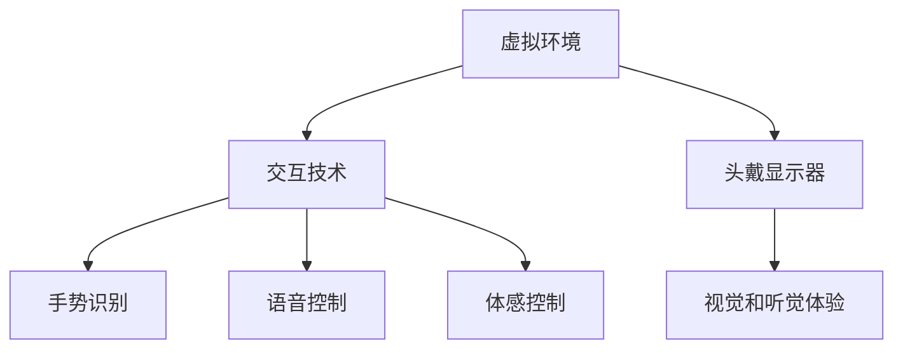

                 

关键词：虚拟现实，VR，头戴显示器，交互技术，3D建模，沉浸式体验，虚拟环境，增强现实，应用领域

摘要：本文旨在深入探讨虚拟现实（VR）技术的概念、发展历程、核心算法、数学模型、应用实例以及未来发展趋势。通过分析VR技术的各个方面，本文旨在为读者提供一个全面而详细的了解，帮助读者把握VR技术的核心要点和应用前景。

## 1. 背景介绍

虚拟现实（Virtual Reality，简称VR）是一种通过计算机技术模拟出的三维空间，让用户在其中进行交互和体验的技术。与传统的二维图形界面不同，VR技术提供了沉浸式的用户体验，使得用户能够以更自然的方式与虚拟世界进行互动。这种技术最早可以追溯到1960年代的“视觉仿真器”，经过几十年的发展，VR技术已经取得了显著的进步。

### 1.1 VR技术的起源与发展

虚拟现实技术的概念最早可以追溯到1960年代，由美国麻省理工学院的伊凡·苏瑟兰（Ivan Sutherland）提出了“视觉仿真器”（The Sword of Damocles）的雏形，这是世界上第一个头戴显示器（HMD）。随后，VR技术得到了快速发展，主要应用于军事模拟和娱乐领域。

20世纪80年代，VR技术开始进入商业应用，其中最著名的产品是任天堂的“Virtual Boy”。虽然Virtual Boy在市场上表现不佳，但它为VR技术开辟了新的应用场景，特别是在游戏领域。

进入21世纪，随着计算力和图形处理能力的提升，VR技术得到了进一步发展。2009年，Oculus Rift的开发者Palmer Luckey展示了其原型设备，引起了业界的广泛关注。2012年，Oculus Rift被Facebook以20亿美元的价格收购，标志着VR技术进入了全新的发展阶段。

### 1.2 VR技术的应用领域

虚拟现实技术具有广泛的应用领域，包括但不限于以下方面：

- **游戏娱乐**：VR游戏为玩家提供了前所未有的沉浸式体验，玩家可以在虚拟世界中自由探索、互动和战斗。
- **教育培训**：VR技术可以用于模拟各种学习场景，提供更加生动、直观的教学体验，提高学习效果。
- **医疗健康**：VR技术可以用于心理治疗、康复训练、医学模拟等，帮助医生和患者更好地理解病情和治疗过程。
- **建筑设计**：VR技术可以用于建筑设计和展示，让客户在虚拟环境中体验和评估建筑空间。
- **旅游体验**：通过VR技术，用户可以远程体验各种旅游目的地，提供虚拟旅游服务。

## 2. 核心概念与联系

### 2.1 核心概念

- **虚拟环境**：虚拟现实的核心组成部分，通过计算机生成的三维空间，为用户提供沉浸式的体验。
- **交互技术**：用户与虚拟环境之间的交互方式，包括手势识别、语音控制、体感控制等。
- **头戴显示器（HMD）**：VR设备的关键部件，通过显示器将用户包裹在一个虚拟环境中，提供视觉和听觉体验。
- **3D建模**：虚拟环境中的三维模型制作技术，包括几何建模、纹理映射、光照处理等。

### 2.2 联系与架构



### 2.3 关键技术和挑战

- **显示技术**：头戴显示器（HMD）的显示效果直接影响用户体验。提高分辨率、降低延迟和减少晕动症是关键挑战。
- **交互技术**：手势识别、语音控制和体感控制等交互技术的准确性和响应速度需要进一步优化。
- **内容制作**：高质量、互动性强的虚拟内容制作是一个复杂的过程，需要专业技术和人力资源的支持。
- **设备成本**：VR设备的成本较高，限制了其在大众市场的普及。降低设备成本是推广VR技术的关键。

## 3. 核心算法原理 & 具体操作步骤

### 3.1 算法原理概述

虚拟现实技术的核心算法主要包括以下几个部分：

- **三维建模**：使用几何建模、纹理映射和光照处理等技术，创建高质量的虚拟环境。
- **图像渲染**：通过渲染算法，将虚拟环境中的三维模型转化为二维图像，显示在头戴显示器上。
- **实时交互**：使用传感器和算法，实现用户与虚拟环境之间的实时交互。

### 3.2 算法步骤详解

#### 3.2.1 三维建模

1. **几何建模**：使用多边形、曲面等几何元素，构建虚拟环境中的三维模型。
2. **纹理映射**：将纹理图像映射到三维模型的表面，增加模型的细节和真实感。
3. **光照处理**：模拟真实世界的光照效果，包括光照方向、强度和阴影等。

#### 3.2.2 图像渲染

1. **视图投影**：将三维模型投影到二维平面上，形成二维图像。
2. **光照计算**：根据光照模型，计算每个像素的光照强度，形成光照效果。
3. **纹理混合**：将纹理映射到像素上，形成最终的图像。

#### 3.2.3 实时交互

1. **传感器数据采集**：采集用户的手势、语音和体感数据。
2. **交互算法处理**：根据交互数据，实时更新虚拟环境中的模型和视图。
3. **反馈生成**：将交互结果反馈给用户，形成闭环交互。

### 3.3 算法优缺点

#### 优点：

- **沉浸式体验**：通过虚拟环境，用户可以获得更加真实和沉浸的体验。
- **交互性**：用户可以与虚拟环境进行实时互动，增加趣味性和参与感。
- **应用广泛**：VR技术可以应用于多个领域，如游戏、教育、医疗、建筑等。

#### 缺点：

- **技术复杂**：VR技术涉及到多个复杂的技术领域，如三维建模、图像渲染、传感器数据处理等。
- **设备成本**：高质量的VR设备成本较高，限制了其在大众市场的普及。
- **晕动症**：部分用户在使用VR设备时可能会出现晕动症，影响用户体验。

### 3.4 算法应用领域

VR技术可以应用于多个领域，包括但不限于以下方面：

- **游戏娱乐**：提供沉浸式的游戏体验，增加游戏趣味性和参与感。
- **教育培训**：模拟各种学习场景，提供直观的教学体验，提高学习效果。
- **医疗健康**：用于心理治疗、康复训练、医学模拟等，帮助医生和患者更好地理解病情和治疗过程。
- **建筑设计**：用于建筑设计和展示，让客户在虚拟环境中体验和评估建筑空间。
- **旅游体验**：提供虚拟旅游服务，让用户远程体验各种旅游目的地。

## 4. 数学模型和公式 & 详细讲解 & 举例说明

### 4.1 数学模型构建

虚拟现实技术中的数学模型主要包括以下几个方面：

- **几何建模**：使用多边形、曲面等几何元素，构建虚拟环境中的三维模型。
- **光照模型**：模拟真实世界的光照效果，包括光照方向、强度和阴影等。
- **渲染模型**：将三维模型转化为二维图像，显示在头戴显示器上。
- **交互模型**：描述用户与虚拟环境之间的交互过程和算法。

### 4.2 公式推导过程

#### 4.2.1 几何建模

- **多边形建模**：每个多边形由顶点表示，顶点坐标可以通过线性插值计算。
  \[
  P = (1-t)P_0 + tP_1
  \]
  其中，\(P_0\)和\(P_1\)为顶点，\(t\)为插值参数。

- **曲面建模**：使用贝塞尔曲面或蒙哥马利曲面，构建三维模型。
  \[
  C(t) = \sum_{i=0}^{n} B_i(t)P_i
  \]
  其中，\(B_i(t)\)为贝塞尔基函数，\(P_i\)为控制点。

#### 4.2.2 光照模型

- **点光源**：光照强度与距离的平方成反比。
  \[
  I = \frac{I_0}{r^2}
  \]
  其中，\(I_0\)为光源强度，\(r\)为光源到物体的距离。

- **平行光**：光照强度与物体表面的法线方向有关。
  \[
  I = I_0 \cdot \cos(\theta)
  \]
  其中，\(\theta\)为光线与法线之间的夹角。

#### 4.2.3 渲染模型

- **视图投影**：将三维模型投影到二维平面上，形成二维图像。
  \[
  P' = \frac{P}{z}
  \]
  其中，\(P'\)为投影后的点，\(P\)为三维点，\(z\)为深度值。

- **纹理映射**：将纹理图像映射到二维图像上，形成最终的渲染结果。
  \[
  C' = T(u, v)
  \]
  其中，\(C'\)为纹理颜色，\(T(u, v)\)为纹理函数，\(u\)和\(v\)为纹理坐标。

### 4.3 案例分析与讲解

#### 4.3.1 几何建模案例

假设我们要建立一个简单的立方体模型，可以使用以下步骤：

1. **定义顶点**：确定立方体的8个顶点坐标。
2. **构建多边形**：使用这些顶点构建6个面的多边形。
3. **纹理映射**：将纹理图像映射到每个多边形上。
4. **光照计算**：根据光照模型，计算每个多边形的颜色。

#### 4.3.2 渲染案例

假设我们有一个立方体模型，使用以下步骤进行渲染：

1. **视图投影**：将立方体的顶点坐标投影到二维平面上。
2. **光照计算**：根据光照模型，计算每个顶点的光照强度。
3. **纹理映射**：将纹理图像映射到顶点上。
4. **颜色计算**：根据顶点的颜色和光照强度，计算最终的渲染结果。

## 5. 项目实践：代码实例和详细解释说明

### 5.1 开发环境搭建

在开发VR项目之前，我们需要搭建一个合适的开发环境。以下是一个基于Unity引擎的VR项目开发环境的搭建步骤：

1. **安装Unity Hub**：从Unity官方网站下载并安装Unity Hub。
2. **创建新项目**：在Unity Hub中创建一个新项目，选择VR模板。
3. **安装VR插件**：在Unity编辑器中安装所需的VR插件，如Oculus SDK、SteamVR等。
4. **配置开发环境**：根据项目需求，配置Unity编辑器和开发环境。

### 5.2 源代码详细实现

以下是一个简单的Unity VR项目示例，实现一个立方体模型的渲染：

```csharp
using UnityEngine;

public class VRExample : MonoBehaviour
{
    public Material material;
    public Texture2D texture;

    void Start()
    {
        // 设置材质的纹理
        material.mainTexture = texture;
        
        // 创建立方体
        GameObject cube = new GameObject("Cube");
        MeshFilter meshFilter = cube.AddComponent<MeshFilter>();
        Mesh mesh = new Mesh();
        meshFilter.mesh = mesh;

        // 构建立方体的顶点和面
        Vector3[] vertices = new Vector3[8];
        int[] triangles = new int[24];

        vertices[0] = new Vector3(-1, -1, 1);
        vertices[1] = new Vector3(1, -1, 1);
        vertices[2] = new Vector3(1, 1, 1);
        vertices[3] = new Vector3(-1, 1, 1);
        vertices[4] = new Vector3(-1, -1, -1);
        vertices[5] = new Vector3(1, -1, -1);
        vertices[6] = new Vector3(1, 1, -1);
        vertices[7] = new Vector3(-1, 1, -1);

        triangles[0] = 0;
        triangles[1] = 1;
        triangles[2] = 2;
        triangles[3] = 0;
        triangles[4] = 2;
        triangles[5] = 3;
        // ...其他面的构建

        mesh.vertices = vertices;
        mesh.triangles = triangles;
        mesh.RecalculateNormals();

        // 应用材质
        MeshRenderer meshRenderer = cube.AddComponent<MeshRenderer>();
        meshRenderer.material = material;
    }
}
```

### 5.3 代码解读与分析

该示例代码实现了一个简单的立方体模型，以下是代码的主要部分及其解读：

- **材质和纹理**：定义了一个材质和一个纹理，用于渲染立方体的表面。
- **创建立方体**：创建了一个GameObject对象，作为立方体的容器。
- **构建顶点和面**：使用八个顶点构建了六个面的多边形，形成了立方体的结构。
- **渲染设置**：创建了一个MeshFilter和MeshRenderer组件，分别用于管理和渲染立方体。
- **应用材质**：将定义好的材质应用到立方体上，完成立方体的渲染。

### 5.4 运行结果展示

运行上述代码，我们将在Unity编辑器中看到一个简单的立方体模型。通过调整纹理和光照参数，可以进一步优化渲染效果，提高立方体的真实感。

## 6. 实际应用场景

### 6.1 游戏娱乐

VR技术在游戏娱乐领域具有广泛的应用，通过提供沉浸式的游戏体验，增强游戏的趣味性和参与感。例如，Oculus Rift和PlayStation VR等头戴显示器设备，为玩家带来了前所未有的游戏体验。

### 6.2 教育培训

VR技术可以模拟各种学习场景，提供直观的教学体验，提高学习效果。例如，医学模拟教学可以让学生在虚拟环境中进行手术练习，提高实践技能。

### 6.3 医疗健康

VR技术在医疗健康领域有广泛的应用，如心理治疗、康复训练和医学模拟等。通过VR技术，医生和患者可以更好地理解病情和治疗过程，提高治疗效果。

### 6.4 建筑设计

VR技术可以用于建筑设计和展示，让客户在虚拟环境中体验和评估建筑空间。这有助于设计师更好地了解客户需求，优化设计方案。

### 6.5 旅游体验

VR技术提供虚拟旅游服务，让用户远程体验各种旅游目的地。这有助于用户在做出旅行决策时，更好地了解旅游目的地的情况。

## 7. 工具和资源推荐

### 7.1 学习资源推荐

- **《虚拟现实技术原理与应用》**：一本关于VR技术的基础教程，涵盖了VR技术的各个方面。
- **《Unity VR开发实战》**：一本针对Unity引擎的VR开发教程，适合初学者和有一定基础的开发者。
- **《VR游戏开发教程》**：一本针对VR游戏开发的教程，包含大量实战案例和项目经验。

### 7.2 开发工具推荐

- **Unity**：一款功能强大的游戏开发引擎，支持VR开发和发布。
- **Blender**：一款开源的三维建模和渲染软件，适合制作高质量的VR内容。
- **Oculus SDK**：Oculus提供的VR开发工具包，适用于Oculus Rift等头戴显示器设备。
- **SteamVR**：Steam提供的VR开发工具包，适用于各种VR设备。

### 7.3 相关论文推荐

- **“Virtual Reality: A Definition and Conceptual Framework”**：一篇关于VR技术定义和概念的论文，对VR技术进行了深入的探讨。
- **“A Survey on Virtual Reality: Recent Advances and Future Challenges”**：一篇关于VR技术发展的综述论文，总结了VR技术的最新进展和面临的挑战。
- **“The Impact of Virtual Reality on Human Perception and Cognition”**：一篇关于VR技术对人感知和认知影响的论文，探讨了VR技术对人类心理的影响。

## 8. 总结：未来发展趋势与挑战

### 8.1 研究成果总结

虚拟现实技术在过去几十年中取得了显著的进展，从早期的简单仿真到现在的沉浸式体验，VR技术已经广泛应用于游戏、教育、医疗、建筑等多个领域。随着计算力和图形处理能力的提升，VR技术将继续发展，为用户提供更加真实和丰富的虚拟体验。

### 8.2 未来发展趋势

- **显示技术**：随着显示技术的进步，VR设备的分辨率和刷新率将不断提高，减少用户晕动症等问题。
- **交互技术**：手势识别、语音控制和体感控制等交互技术将更加精准和自然，提高用户与虚拟环境的交互体验。
- **内容制作**：高质量、互动性强的VR内容将不断增加，推动VR技术在各个领域的应用。
- **设备成本**：随着技术的成熟和规模的扩大，VR设备的成本将逐渐降低，普及率将进一步提高。

### 8.3 面临的挑战

- **技术复杂度**：VR技术涉及多个复杂的技术领域，如三维建模、图像渲染、传感器数据处理等，技术实现和优化具有一定的挑战性。
- **用户体验**：提高用户体验是VR技术发展的重要目标，如何减少晕动症等问题，提高用户的沉浸感和舒适度，是一个亟待解决的问题。
- **内容制作**：高质量、互动性强的VR内容制作是一个复杂的过程，需要专业技术和人力资源的支持，内容创作成本较高。
- **设备成本**：VR设备的成本较高，限制了其在大众市场的普及。降低设备成本是推广VR技术的关键。

### 8.4 研究展望

随着技术的不断进步，VR技术将在未来得到更广泛的应用。在游戏娱乐、教育培训、医疗健康、建筑设计等领域，VR技术将带来更多的创新和变革。同时，VR技术也将与其他新兴技术，如增强现实（AR）、人工智能（AI）等，进行深度融合，推动科技的发展。面对挑战，我们需要持续探索和研究，推动VR技术的进步，为用户提供更好的虚拟体验。

## 9. 附录：常见问题与解答

### 9.1 VR技术是什么？

虚拟现实（VR）技术是一种通过计算机技术模拟出的三维空间，使用户能够沉浸在虚拟环境中，与虚拟世界进行交互和体验的技术。

### 9.2 VR技术与增强现实（AR）有何区别？

VR技术和AR技术都是通过计算机技术模拟出的虚拟环境，但VR技术完全将用户包裹在一个虚拟空间中，提供沉浸式的体验，而AR技术则将虚拟元素叠加在现实世界中，用户仍然可以看到现实环境。

### 9.3 VR技术有哪些应用领域？

VR技术可以应用于多个领域，包括游戏娱乐、教育培训、医疗健康、建筑设计、旅游体验等。

### 9.4 如何降低VR设备的成本？

降低VR设备的成本可以通过提高生产效率、降低原材料成本、优化供应链等方式实现。同时，随着技术的发展和规模的扩大，VR设备的成本也将逐渐降低。

### 9.5 VR技术是否会取代现实？

VR技术不会完全取代现实，而是作为现实的一种补充和延伸。它为用户提供了一种新的体验方式，丰富和扩展了现实世界的可能性。VR技术将在未来的生活中发挥重要作用，但它不会取代现实。  
----------------------------------------------------------------

---

**文章完成。请检查所有要求，确保满足字数、格式、内容和结构等方面的要求。**

