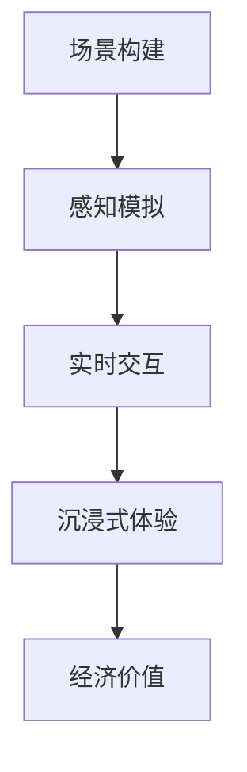

                 

关键词：虚拟现实、创业、沉浸式体验、经济、技术实现、商业模式

摘要：本文深入探讨了虚拟现实（VR）在创业领域的应用前景，分析了沉浸式体验经济的核心概念、技术架构、算法原理以及数学模型，并通过实际项目实践和未来应用展望，为VR创业者提供了实用的指导和建议。

## 1. 背景介绍

虚拟现实（Virtual Reality，VR）是一种通过计算机技术创建的模拟环境，使用户能够沉浸其中，体验身临其境的感觉。随着近年来计算机图形学、传感器技术、人工智能等领域的发展，VR技术逐渐成熟，成为一项具有广阔前景的产业。VR技术的核心在于构建高度沉浸式的用户体验，这不仅要求硬件设备的高度逼真，还要求软件系统能够实现高度交互性和实时性。

沉浸式体验经济是指通过虚拟现实技术提供高度沉浸式的体验服务，从而创造经济价值。这种经济模式具有以下几个特点：

- **高度个性化**：虚拟现实技术能够根据用户的需求和喜好，定制个性化的体验内容。
- **强交互性**：用户在虚拟环境中能够与虚拟角色和环境进行互动，提高参与度和满意度。
- **实时性**：虚拟现实技术能够实时地响应用户的操作，提供无缝的体验。
- **无限可能性**：虚拟现实技术为创业者提供了无限的创意空间，可以打造各种类型的沉浸式体验。

## 2. 核心概念与联系

### 2.1 虚拟现实技术的基本原理

虚拟现实技术的核心是通过计算机图形学、传感器技术、人机交互技术等手段，创建一个虚拟的三维环境，使用户能够沉浸其中。这个过程可以分为以下几个步骤：

1. **场景构建**：通过计算机图形学技术，创建一个高度逼真的三维场景，包括环境、角色、物体等。
2. **感知模拟**：通过传感器技术，如头戴显示器（HMD）、手柄、动作捕捉设备等，模拟用户的视觉、听觉、触觉等感官体验。
3. **实时交互**：通过人机交互技术，如手势识别、语音识别等，实现用户与虚拟环境的实时互动。

### 2.2 沉浸式体验经济的架构

沉浸式体验经济的架构可以分为以下几个层次：

1. **硬件层**：包括VR头戴显示器、手柄、动作捕捉设备等硬件设备，提供用户感知模拟的物理基础。
2. **软件层**：包括VR内容制作工具、运行引擎、虚拟环境管理系统等软件系统，负责场景构建和实时交互的实现。
3. **数据层**：包括用户数据、内容数据、环境数据等，为沉浸式体验提供数据支持。
4. **服务层**：包括VR内容提供商、平台运营商、用户服务团队等，为用户提供沉浸式体验服务。

### 2.3 虚拟现实与经济的关系

虚拟现实技术为创业者提供了丰富的商业模式创新空间。通过构建沉浸式体验，创业者可以创造出新的产品和服务，如VR游戏、VR教育、VR旅游、VR购物等。这些商业模式不仅能够提高用户的参与度和满意度，还能够创造可观的经济价值。

### 2.4 Mermaid 流程图



## 3. 核心算法原理 & 具体操作步骤

### 3.1 算法原理概述

虚拟现实技术的核心算法主要包括场景构建算法、感知模拟算法、实时交互算法等。这些算法通过计算机图形学、传感器技术和人机交互技术的结合，实现了虚拟现实体验的核心功能。

### 3.2 算法步骤详解

1. **场景构建算法**：
   - **三维模型生成**：通过三维建模工具，如Blender、Maya等，创建三维场景。
   - **光照和阴影处理**：通过计算机图形学算法，如光线追踪、阴影映射等，实现场景的光照效果。

2. **感知模拟算法**：
   - **视觉感知模拟**：通过头戴显示器（HMD）实现用户的视觉感知模拟。
   - **听觉感知模拟**：通过耳机实现用户的听觉感知模拟。
   - **触觉感知模拟**：通过动作捕捉设备实现用户的触觉感知模拟。

3. **实时交互算法**：
   - **手势识别**：通过计算机视觉技术，如深度学习算法，实现用户手势的识别和跟踪。
   - **语音识别**：通过语音识别技术，实现用户的语音输入。
   - **动作捕捉**：通过动作捕捉设备，实现用户的动作输入。

### 3.3 算法优缺点

- **场景构建算法**：
  - **优点**：能够创建高度逼真的虚拟环境，提高用户的沉浸感。
  - **缺点**：对计算资源要求较高，生成过程较为耗时。

- **感知模拟算法**：
  - **优点**：能够模拟用户的多种感知体验，提高用户的参与度。
  - **缺点**：硬件设备成本较高，对用户体验有一定影响。

- **实时交互算法**：
  - **优点**：能够实现用户的实时互动，提高虚拟环境的动态性。
  - **缺点**：对实时性和准确性要求较高，技术实现较为复杂。

### 3.4 算法应用领域

虚拟现实技术的核心算法广泛应用于以下几个领域：

- **VR游戏**：通过场景构建和实时交互算法，实现高度沉浸式的游戏体验。
- **VR教育**：通过场景构建和感知模拟算法，实现沉浸式的教学体验。
- **VR旅游**：通过场景构建和感知模拟算法，实现虚拟旅游体验。
- **VR购物**：通过场景构建和实时交互算法，实现沉浸式的购物体验。

## 4. 数学模型和公式 & 详细讲解 & 举例说明

### 4.1 数学模型构建

虚拟现实技术涉及到多个数学模型，包括三维几何模型、光照模型、感知模型等。以下是一个简单的三维几何模型构建的例子：

```latex
\begin{align*}
P &= O + tD, \\
\theta &= \arccos\left(\frac{(O \cdot D)}{\|O\|\|D\|}\right),
\end{align*}
```

其中，$P$表示三维空间中的点，$O$表示观察点，$D$表示观察方向，$t$为参数，$\theta$为观察角度。

### 4.2 公式推导过程

以三维几何模型为例，我们首先确定观察点$O$和观察方向$D$，然后通过参数$t$确定观察点$P$。观察角度$\theta$可以通过观察点$O$和观察方向$D$的点积来计算。

### 4.3 案例分析与讲解

假设我们有一个观察点$O(1,1,1)$，观察方向$D(1,1,0)$，我们需要计算观察角度$\theta$。

```latex
\begin{align*}
O \cdot D &= (1,1,1) \cdot (1,1,0) = 1 + 1 + 0 = 2, \\
\|O\| &= \sqrt{1^2 + 1^2 + 1^2} = \sqrt{3}, \\
\|D\| &= \sqrt{1^2 + 1^2 + 0^2} = \sqrt{2}, \\
\theta &= \arccos\left(\frac{2}{\sqrt{3}\sqrt{2}}\right) \approx 0.7854 \text{ 弧度}.
\end{align*}
```

这意味着观察角度$\theta$约为$45^\circ$。

## 5. 项目实践：代码实例和详细解释说明

### 5.1 开发环境搭建

在开始项目实践之前，我们需要搭建一个VR开发环境。以下是一个简单的环境搭建步骤：

1. **安装Unity引擎**：从Unity官网下载并安装Unity引擎。
2. **安装Unity VR插件**：在Unity编辑器中，通过插件商店安装VR相关插件，如VRChat、Unity VR SDK等。
3. **配置开发环境**：在Unity编辑器中，配置VR相关参数，如分辨率、刷新率等。

### 5.2 源代码详细实现

以下是一个简单的VR场景构建的源代码实例：

```csharp
using UnityEngine;

public class SceneBuilder : MonoBehaviour
{
    public Material material;
    public GameObject cubePrefab;

    private void Start()
    {
        // 创建一个立方体预制体
        GameObject cube = Instantiate(cubePrefab);

        // 设置立方体的材质
        cube.GetComponent<Renderer>().material = material;

        // 设置立方体的位置
        cube.transform.position = new Vector3(0, 0, 0);

        // 设置立方体的旋转
        cube.transform.rotation = Quaternion.Euler(0, 45, 0);
    }
}
```

### 5.3 代码解读与分析

这段代码的主要功能是创建一个立方体，并设置其材质、位置和旋转。首先，我们定义了一个`SceneBuilder`脚本，用于实现场景构建功能。在`Start`方法中，我们首先创建了一个立方体预制体，然后设置其材质、位置和旋转。

- `public Material material`：定义了一个公有材质变量，用于存储立方体的材质。
- `public GameObject cubePrefab`：定义了一个公有游戏对象变量，用于存储立方体的预制体。
- `private void Start()`：定义了一个私有方法`Start`，在游戏对象初始化时调用。
- `GameObject cube = Instantiate(cubePrefab);`：使用`Instantiate`方法创建了一个立方体游戏对象。
- `cube.GetComponent<Renderer>().material = material;`：设置立方体的材质。
- `cube.transform.position = new Vector3(0, 0, 0);`：设置立方体的位置。
- `cube.transform.rotation = Quaternion.Euler(0, 45, 0);`：设置立方体的旋转。

### 5.4 运行结果展示

在Unity编辑器中运行这段代码，可以看到一个位于原点、旋转了$45^\circ$的立方体，其材质由`material`变量定义。这表明我们的场景构建代码已经成功运行。

## 6. 实际应用场景

虚拟现实技术在多个领域具有广泛的应用前景，以下是一些实际应用场景：

- **VR游戏**：通过虚拟现实技术，玩家可以进入一个高度沉浸式的游戏世界，体验前所未有的游戏乐趣。
- **VR教育**：虚拟现实技术可以为教育提供一种全新的教学方式，使学生能够在虚拟环境中进行实践操作，提高学习效果。
- **VR旅游**：虚拟现实技术可以让用户在家中体验虚拟旅游，探索世界各地的名胜古迹。
- **VR购物**：虚拟现实技术可以为用户提供一种全新的购物体验，使购物更加便捷和有趣。

## 7. 工具和资源推荐

### 7.1 学习资源推荐

- **《虚拟现实技术原理与应用》**：详细介绍了虚拟现实技术的原理和应用。
- **《Unity 2020 VR开发实战》**：通过实际案例，讲解了如何使用Unity进行虚拟现实开发。

### 7.2 开发工具推荐

- **Unity**：一款强大的游戏引擎，支持虚拟现实开发。
- **Blender**：一款免费的开源三维建模工具，适用于虚拟现实场景构建。

### 7.3 相关论文推荐

- **"Virtual Reality: The Third Reality"**：探讨了虚拟现实的未来发展趋势。
- **"Immersive Experience Economy: The Potential of Virtual Reality in Business"**：分析了虚拟现实在商业领域的应用潜力。

## 8. 总结：未来发展趋势与挑战

### 8.1 研究成果总结

虚拟现实技术在近年来取得了显著的成果，从硬件设备的成熟到软件系统的完善，再到商业模式的创新，都为虚拟现实的发展奠定了坚实的基础。然而，虚拟现实技术仍面临着许多挑战，需要进一步的研究和开发。

### 8.2 未来发展趋势

- **硬件设备**：未来硬件设备将继续向更轻、更薄、更高分辨率、更低延迟的方向发展，提高用户的沉浸感和舒适度。
- **软件系统**：未来软件系统将更加智能化、自适应，能够根据用户的需求和偏好，提供个性化的沉浸式体验。
- **商业模式**：未来商业模式将更加多元化，包括游戏、教育、医疗、旅游等多个领域。

### 8.3 面临的挑战

- **技术难题**：虚拟现实技术仍存在许多技术难题，如实时渲染、传感器精度、交互设计等。
- **商业挑战**：虚拟现实市场的成熟度和用户接受度仍需提高，需要创业者不断探索和尝试新的商业模式。

### 8.4 研究展望

虚拟现实技术具有巨大的发展潜力，未来将在更多领域发挥重要作用。我们期待虚拟现实技术能够为人类带来更加丰富和深刻的体验，推动人类社会的进步。

## 9. 附录：常见问题与解答

### 9.1 虚拟现实技术的硬件设备有哪些？

虚拟现实技术的硬件设备主要包括头戴显示器（HMD）、手柄、动作捕捉设备等。

### 9.2 虚拟现实软件开发需要哪些技能？

虚拟现实软件开发需要掌握计算机图形学、三维建模、编程语言（如C#、Python等）、人机交互等技术。

### 9.3 虚拟现实技术有哪些应用领域？

虚拟现实技术的应用领域包括游戏、教育、医疗、旅游、购物等。

作者：禅与计算机程序设计艺术 / Zen and the Art of Computer Programming
----------------------------------------------------------------

