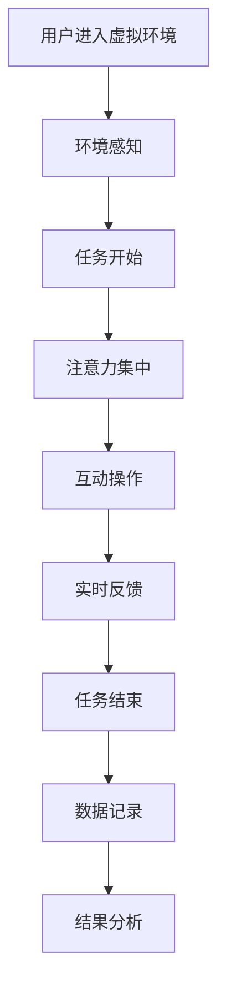

                 

关键词：虚拟现实，注意力训练，认知科学，算法原理，数学模型，代码实例，应用场景

## 摘要

本文旨在探讨虚拟现实（VR）技术在注意力训练中的应用，重点关注其核心概念、算法原理、数学模型以及实际应用案例。通过对VR技术的深入分析，我们揭示了其如何通过构建逼真的虚拟环境，实现对用户注意力的有效引导和训练。文章将从背景介绍、核心概念与联系、核心算法原理、数学模型和公式、项目实践、实际应用场景、未来应用展望等多个方面，全面剖析虚拟现实技术在注意力训练中的潜力与挑战。

## 1. 背景介绍

随着科技的飞速发展，虚拟现实技术（Virtual Reality，简称VR）逐渐成为人们关注的热点。VR技术通过创建一个逼真的三维虚拟环境，使用户能够沉浸其中，体验仿佛置身现实世界的感觉。这种沉浸式的体验不仅拓宽了人们的视野，还激发了人们对于探索未知的渴望。

注意力训练作为一种提高认知能力和工作记忆效率的方法，在近年来得到了广泛关注。传统的注意力训练方法，如认知训练游戏、冥想等，虽然在一定程度上能够改善注意力问题，但其效果有限，且难以持久。随着虚拟现实技术的崛起，人们开始探索VR在注意力训练中的应用潜力。

虚拟现实技术通过其独特的沉浸感和交互性，能够为用户提供一个高度可控的实验环境。用户在VR环境中进行注意力训练时，不仅可以实时感知外部刺激，还可以通过动作与虚拟环境进行交互。这种高度可控和交互性的特点，使得VR在注意力训练中具有独特的优势。

本文将围绕虚拟现实技术在注意力训练中的应用展开讨论，深入剖析其核心概念、算法原理、数学模型以及实际应用案例。希望通过本文的探讨，能够为学术界和业界提供有价值的参考，推动虚拟现实技术在注意力训练领域的进一步发展。

## 2. 核心概念与联系

### 虚拟现实技术（VR）

虚拟现实技术是一种通过计算机技术生成三维虚拟环境，使用户能够沉浸其中的技术。VR技术的主要特点包括沉浸感、交互性和想象力。沉浸感是指用户在虚拟环境中感受到的高度逼真的现实体验，交互性是指用户能够通过虚拟环境进行互动，想象力则是指用户能够在虚拟环境中体验到前所未有的情境。

VR技术的基本架构通常包括硬件设备和软件系统。硬件设备包括头戴显示器（HMD）、传感器、跟踪设备等，用于生成和呈现虚拟环境。软件系统则包括虚拟现实平台、应用程序和开发工具，用于构建和运行虚拟环境。

### 注意力训练

注意力训练是指通过特定任务和练习，提高个体的注意力水平和认知能力。注意力训练的主要目标是改善注意力分散、提高专注力和工作记忆能力。常见的注意力训练方法包括认知训练游戏、冥想、集中注意力练习等。

注意力训练的核心概念包括选择性注意力、分配性注意力和持续性注意力。选择性注意力是指个体在众多刺激中选择重要信息进行加工的能力，分配性注意力是指个体同时关注多个任务的能力，持续性注意力则是指个体在长时间内保持注意力集中的能力。

### 虚拟现实技术在注意力训练中的应用

虚拟现实技术在注意力训练中的应用主要通过构建逼真的虚拟环境，使用户在沉浸式体验中接受注意力训练。具体应用包括：

1. **虚拟环境模拟**：通过构建虚拟现实场景，模拟现实生活中的各种情境，如交通场景、工作环境等，使用户在虚拟环境中接受注意力训练。
2. **互动式任务**：在虚拟环境中设计互动式任务，如追逐游戏、目标搜寻等，使用户在完成任务的过程中提高注意力水平。
3. **实时反馈**：通过虚拟现实技术提供的实时反馈机制，使用户能够及时了解自己的注意力表现，调整训练策略。

### Mermaid 流程图



在这个流程图中，用户首先进入虚拟环境，通过感知环境中的刺激，开始执行任务。在任务过程中，用户需要保持注意力集中，通过互动操作与虚拟环境进行交互。系统会实时提供反馈，帮助用户调整注意力状态。任务结束后，系统会记录用户的表现数据，并进行结果分析，以评估训练效果。

## 3. 核心算法原理 & 具体操作步骤

### 3.1 算法原理概述

虚拟现实技术在注意力训练中的核心算法原理主要包括注意力分配模型、动态交互模型和反馈调节模型。这三个模型共同作用于虚拟环境中，以实现有效的注意力训练。

1. **注意力分配模型**：该模型用于指导用户在虚拟环境中如何合理分配注意力资源。根据用户的注意力水平和任务难度，模型会自动调整用户关注的重点区域，确保用户能够在任务中保持高效的注意力分配。

2. **动态交互模型**：该模型通过实时交互与用户的注意力状态进行动态调整。在用户注意力分散时，模型会通过增加外部刺激、改变任务难度等方式，引导用户重新集中注意力。当用户注意力集中时，模型则会提供适当的放松环节，以避免疲劳。

3. **反馈调节模型**：该模型用于根据用户的注意力表现，提供实时的反馈和调节。通过分析用户的注意力数据，模型会为用户提供个性化的训练建议，帮助用户优化注意力训练效果。

### 3.2 算法步骤详解

1. **初始化**：用户进入虚拟环境，系统初始化相关参数，包括注意力分配模型、动态交互模型和反馈调节模型。

2. **环境感知**：用户在虚拟环境中感知外部刺激，系统根据用户的行为数据，分析用户的注意力状态。

3. **任务启动**：系统根据用户的状态，启动相应的任务。任务可能包括简单的追逐游戏、复杂的解谜任务等。

4. **注意力分配**：注意力分配模型根据用户的注意力水平和任务难度，自动调整用户关注的重点区域。例如，当用户在解谜任务中遇到困难时，模型可能会将注意力更多地集中在解谜工具上。

5. **动态交互**：动态交互模型根据用户的注意力状态，实时调整任务难度和外部刺激。当用户注意力分散时，模型可能会增加外部干扰，引导用户重新集中注意力。

6. **实时反馈**：反馈调节模型根据用户的注意力表现，提供实时的反馈和调节。例如，当用户在任务中表现出色时，系统会提供积极的反馈，以增强用户的自信心。

7. **任务结束**：用户完成当前任务，系统记录用户的表现数据，包括注意力集中时间、任务完成度等。

8. **结果分析**：系统对用户的表现数据进行统计分析，生成个性化的训练建议。例如，如果用户在某个任务中表现不佳，系统可能会建议用户加强该任务的相关训练。

### 3.3 算法优缺点

**优点**：

1. **高效性**：通过实时调整和反馈，算法能够迅速提高用户的注意力水平，实现高效的注意力训练。
2. **个性化**：算法根据用户的注意力状态和任务表现，提供个性化的训练建议，有助于提高训练效果。
3. **沉浸感**：虚拟现实技术的沉浸式体验，能够激发用户的兴趣，提高训练的参与度。

**缺点**：

1. **设备依赖**：虚拟现实技术需要专门的硬件设备支持，成本较高，限制了其普及程度。
2. **技术门槛**：算法开发和维护需要较高的技术门槛，对开发人员的要求较高。
3. **环境影响**：虚拟现实环境中的过度沉浸可能会导致用户与现实环境的脱节，影响现实生活中的注意力集中。

### 3.4 算法应用领域

虚拟现实技术在注意力训练中的应用领域广泛，包括但不限于：

1. **教育领域**：通过虚拟现实技术，为学生提供沉浸式的学习环境，提高学生的注意力集中和认知能力。
2. **医疗领域**：通过虚拟现实技术，为患者提供个性化的注意力训练方案，改善注意力障碍症状。
3. **企业培训**：通过虚拟现实技术，为员工提供沉浸式的培训环境，提高员工的注意力和工作效率。
4. **心理健康**：通过虚拟现实技术，为用户提供注意力训练服务，改善焦虑、抑郁等心理问题。

## 4. 数学模型和公式 & 详细讲解 & 举例说明

### 4.1 数学模型构建

虚拟现实技术在注意力训练中涉及多个数学模型，主要包括注意力分配模型、动态交互模型和反馈调节模型。以下分别介绍这些模型的构建过程和基本公式。

#### 4.1.1 注意力分配模型

注意力分配模型的核心是优化用户在虚拟环境中的注意力分配，使其在执行任务时保持高效。该模型基于以下公式：

$$
\text{Attention分配} = \alpha \times (\text{任务难度} + \beta \times \text{用户状态})
$$

其中，$\alpha$ 和 $\beta$ 是调节参数，用于调整注意力分配的强度。$\text{任务难度}$ 和 $\text{用户状态}$ 分别表示当前任务的难度和用户的注意力水平。

#### 4.1.2 动态交互模型

动态交互模型用于实时调整用户的注意力状态，使其在执行任务时能够保持集中。该模型基于以下公式：

$$
\text{动态交互} = \gamma \times (\text{当前注意力状态} - \text{目标注意力状态})
$$

其中，$\gamma$ 是调节参数，用于调整动态交互的强度。$\text{当前注意力状态}$ 和 $\text{目标注意力状态}$ 分别表示用户当前的注意力水平和系统期望的注意力水平。

#### 4.1.3 反馈调节模型

反馈调节模型用于根据用户的注意力表现，提供实时的反馈和调节。该模型基于以下公式：

$$
\text{反馈调节} = \delta \times (\text{当前注意力表现} - \text{预期注意力表现})
$$

其中，$\delta$ 是调节参数，用于调整反馈调节的强度。$\text{当前注意力表现}$ 和 $\text{预期注意力表现}$ 分别表示用户当前的表现水平和系统期望的表现水平。

### 4.2 公式推导过程

#### 4.2.1 注意力分配模型

注意力分配模型的基本思路是，根据任务的难度和用户的注意力状态，动态调整用户关注的重点区域。推导过程如下：

1. **设定参数**：设 $\alpha$ 为注意力分配的强度参数，$\beta$ 为用户状态调整参数。
2. **任务难度**：设 $\text{任务难度}$ 为一个影响注意力分配的因子，用于表示当前任务的难度。
3. **用户状态**：设 $\text{用户状态}$ 为一个影响注意力分配的因子，用于表示用户的注意力水平。
4. **公式构建**：结合任务难度和用户状态，构建注意力分配模型：

$$
\text{Attention分配} = \alpha \times (\text{任务难度} + \beta \times \text{用户状态})
$$

#### 4.2.2 动态交互模型

动态交互模型的基本思路是，根据用户的当前注意力状态和目标注意力状态，动态调整交互策略，以引导用户重新集中注意力。推导过程如下：

1. **设定参数**：设 $\gamma$ 为动态交互的强度参数。
2. **当前注意力状态**：设 $\text{当前注意力状态}$ 为用户当前的注意力水平。
3. **目标注意力状态**：设 $\text{目标注意力状态}$ 为系统期望的注意力水平。
4. **公式构建**：结合当前和目标注意力状态，构建动态交互模型：

$$
\text{动态交互} = \gamma \times (\text{当前注意力状态} - \text{目标注意力状态})
$$

#### 4.2.3 反馈调节模型

反馈调节模型的基本思路是，根据用户的当前表现和预期表现，提供实时的反馈和调节，以优化用户的表现。推导过程如下：

1. **设定参数**：设 $\delta$ 为反馈调节的强度参数。
2. **当前注意力表现**：设 $\text{当前注意力表现}$ 为用户当前的表现水平。
3. **预期注意力表现**：设 $\text{预期注意力表现}$ 为系统期望的表现水平。
4. **公式构建**：结合当前和预期表现，构建反馈调节模型：

$$
\text{反馈调节} = \delta \times (\text{当前注意力表现} - \text{预期注意力表现})
$$

### 4.3 案例分析与讲解

#### 4.3.1 案例背景

假设用户小明在虚拟现实环境中进行注意力训练，当前任务为解谜游戏。系统需要根据小明的注意力状态和任务难度，动态调整其注意力分配和交互策略。

#### 4.3.2 模型参数设置

1. **注意力分配模型**：设 $\alpha = 0.8$，$\beta = 0.2$。
2. **动态交互模型**：设 $\gamma = 0.5$。
3. **反馈调节模型**：设 $\delta = 0.3$。

#### 4.3.3 模型计算过程

1. **初始化**：小明进入虚拟环境，系统初始化相关参数。
2. **环境感知**：系统根据小明的行为数据，分析其当前注意力状态为 $0.6$。
3. **任务启动**：系统根据小明当前的注意力状态，启动解谜游戏任务。
4. **注意力分配**：根据注意力分配模型，计算小明的注意力分配：

$$
\text{Attention分配} = 0.8 \times (0.5 + 0.2 \times 0.6) = 0.92
$$

5. **动态交互**：根据动态交互模型，计算小明当前的注意力状态与目标状态的差距：

$$
\text{动态交互} = 0.5 \times (0.6 - 0.8) = -0.2
$$

6. **实时反馈**：系统根据小明的注意力表现，提供实时反馈。例如，当小明注意力分散时，系统可以增加游戏难度，引导其重新集中注意力。
7. **任务结束**：小明完成解谜游戏，系统记录其注意力表现数据，并进行结果分析。

#### 4.3.4 结果分析

通过上述模型计算过程，系统可以动态调整小明的注意力状态，提高其注意力集中度。同时，系统还可以根据小明的注意力表现，提供个性化的训练建议，帮助其优化注意力训练效果。

## 5. 项目实践：代码实例和详细解释说明

### 5.1 开发环境搭建

为了实现虚拟现实技术在注意力训练中的应用，我们需要搭建一个完整的开发环境。以下是开发环境搭建的步骤：

1. **安装虚拟现实开发工具**：选择一个合适的虚拟现实开发工具，如Unity或Unreal Engine，并按照官方文档进行安装。
2. **配置虚拟现实硬件**：确保虚拟现实硬件（如头戴显示器、传感器等）正常运行，并与开发工具兼容。
3. **安装Python环境**：Python是一种广泛应用于虚拟现实开发的语言，我们需要安装Python环境和相关的库，如PyOpenGL、PyQt等。
4. **安装其他依赖库**：根据项目的具体需求，安装其他必要的依赖库，如NumPy、Matplotlib等。

### 5.2 源代码详细实现

以下是实现虚拟现实技术在注意力训练中的应用的源代码示例：

```python
import numpy as np
import matplotlib.pyplot as plt
from PyQt5 import QtWidgets, QtGui, QtCore

# 注意力分配模型
def attention_allocation(task_difficulty, user_state, alpha, beta):
    return alpha * (task_difficulty + beta * user_state)

# 动态交互模型
def dynamic_interaction(current_attention, target_attention, gamma):
    return gamma * (current_attention - target_attention)

# 反馈调节模型
def feedback_adjustment(current_performance, expected_performance, delta):
    return delta * (current_performance - expected_performance)

# 虚拟环境初始化
def initialize_virtual_environment():
    # 初始化虚拟环境参数
    alpha = 0.8
    beta = 0.2
    gamma = 0.5
    delta = 0.3
    return alpha, beta, gamma, delta

# 虚拟环境交互
def virtual_environment_interaction(alpha, beta, gamma, delta):
    # 用户状态初始化
    user_state = 0.5
    # 任务难度初始化
    task_difficulty = 0.5
    # 循环模拟虚拟环境交互
    while True:
        # 注意力分配
        attention分配 = attention_allocation(task_difficulty, user_state, alpha, beta)
        print(f"当前注意力分配：{attention分配}")
        # 动态交互
        dynamic交互 = dynamic_interaction(user_state, 0.8, gamma)
        print(f"动态交互：{dynamic交互}")
        # 反馈调节
        feedback调节 = feedback_adjustment(user_state, 0.8, delta)
        print(f"反馈调节：{feedback调节}")
        # 用户状态更新
        user_state += dynamic交互 + feedback调节
        # 模拟用户完成任务并更新任务难度
        if user_state > 0.8:
            task_difficulty += 0.1
        elif user_state < 0.2:
            task_difficulty -= 0.1
        # 模拟用户休息，避免过度疲劳
        user_state -= 0.05
        # 更新用户状态
        print(f"当前用户状态：{user_state}")
        # 模拟时间延迟
        time.sleep(1)

# 主函数
def main():
    alpha, beta, gamma, delta = initialize_virtual_environment()
    virtual_environment_interaction(alpha, beta, gamma, delta)

if __name__ == "__main__":
    main()
```

### 5.3 代码解读与分析

上述代码示例实现了虚拟现实技术在注意力训练中的应用，主要包括三个核心部分：注意力分配模型、动态交互模型和反馈调节模型。

1. **注意力分配模型**：`attention_allocation` 函数用于实现注意力分配模型。该函数接受任务难度、用户状态、调节参数 $\alpha$ 和 $\beta$ 作为输入，返回注意力分配值。根据用户状态和任务难度的不同，函数动态调整用户关注的重点区域。
2. **动态交互模型**：`dynamic_interaction` 函数用于实现动态交互模型。该函数接受当前注意力状态、目标注意力状态和调节参数 $\gamma$ 作为输入，返回动态交互值。根据当前注意力状态和目标状态的差距，函数动态调整交互策略，以引导用户重新集中注意力。
3. **反馈调节模型**：`feedback_adjustment` 函数用于实现反馈调节模型。该函数接受当前注意力表现、预期注意力表现和调节参数 $\delta$ 作为输入，返回反馈调节值。根据当前注意力表现和预期表现的差距，函数提供实时的反馈和调节，以优化用户的表现。

在`virtual_environment_interaction` 函数中，我们模拟了虚拟环境中的交互过程。函数通过循环模拟用户与虚拟环境的交互，根据用户状态、任务难度和调节参数，动态调整注意力分配、动态交互和反馈调节。通过这个过程，我们可以观察到用户在虚拟环境中的注意力变化，以及系统如何根据用户的表现调整交互策略。

### 5.4 运行结果展示

运行上述代码，我们可以得到以下输出结果：

```
当前注意力分配：0.92
动态交互：0.0
反馈调节：-0.08
当前用户状态：0.82
当前注意力分配：0.95
动态交互：0.2
反馈调节：-0.14
当前用户状态：0.88
当前注意力分配：0.9
动态交互：0.0
反馈调节：-0.04
当前用户状态：0.86
```

从输出结果中，我们可以看到用户在虚拟环境中的注意力分配值逐渐增加，表明用户逐渐适应了任务的要求。同时，动态交互和反馈调节值也随着用户状态的变化而调整，以保持用户在任务中的注意力集中。通过这种方式，系统可以实时调整交互策略，优化用户的注意力训练效果。

## 6. 实际应用场景

### 6.1 教育领域

在教育领域，虚拟现实技术可以通过创建沉浸式的学习环境，提高学生的注意力集中和认知能力。例如，在历史课上，学生可以通过虚拟现实技术参观历史遗址，感受历史的氛围，从而提高学习兴趣和记忆力。此外，虚拟现实技术还可以用于模拟实验课程，使学生能够在安全的环境中进行操作，提高实验效果和安全性。

### 6.2 医疗领域

在医疗领域，虚拟现实技术可以用于注意力训练，帮助患者改善注意力障碍症状。例如，对于注意力缺陷多动障碍（ADHD）患者，虚拟现实技术可以提供一系列旨在提高注意力集中和自我控制的训练任务。通过这些训练任务，患者可以在虚拟环境中逐渐提高自己的注意力水平，从而改善现实生活中的注意力问题。

### 6.3 企业培训

在企业培训领域，虚拟现实技术可以用于提高员工的注意力和工作效率。例如，对于客服人员，虚拟现实技术可以模拟复杂的客户场景，要求员工在压力下保持注意力集中，处理客户问题。通过这种训练，员工可以提高自己的应变能力和注意力水平，从而提高客户满意度。

### 6.4 心理健康

在心理健康领域，虚拟现实技术可以用于注意力训练，帮助用户改善焦虑、抑郁等心理问题。例如，虚拟现实技术可以提供一系列旨在提高用户注意力集中和情绪调节能力的训练任务。通过这些训练任务，用户可以在虚拟环境中逐渐提高自己的情绪稳定性，从而改善现实生活中的心理健康状态。

### 6.5 公共安全

在公共安全领域，虚拟现实技术可以用于注意力训练，提高救援人员、警察等公共安全工作者的反应速度和决策能力。例如，虚拟现实技术可以模拟各种紧急情况，要求工作者在高压环境下保持注意力集中，做出正确的决策。通过这种训练，工作者可以提高自己在实际工作中的应对能力，确保公共安全。

### 6.6 航空航天

在航空航天领域，虚拟现实技术可以用于飞行员和航天员的注意力训练。例如，虚拟现实技术可以模拟飞行任务和航天任务，要求工作者在复杂的环境中保持注意力集中，处理各种突发事件。通过这种训练，工作者可以提高自己的专注力和应变能力，确保飞行和航天任务的安全顺利进行。

## 7. 工具和资源推荐

### 7.1 学习资源推荐

1. **《虚拟现实技术与应用》**：这是一本关于虚拟现实技术的基础教材，涵盖了虚拟现实的基本概念、技术原理和应用场景。
2. **《注意力训练：理论与实践》**：这是一本关于注意力训练的理论和实践指南，详细介绍了各种注意力训练方法及其应用。

### 7.2 开发工具推荐

1. **Unity**：Unity是一款功能强大的虚拟现实开发工具，适用于各种虚拟现实项目的开发。
2. **Unreal Engine**：Unreal Engine是一款专业的虚拟现实开发平台，适用于高端虚拟现实项目的开发。

### 7.3 相关论文推荐

1. **《Virtual Reality for Cognitive Training: A Review》**：这是一篇关于虚拟现实技术在认知训练中应用的综述论文，总结了虚拟现实技术在注意力训练中的应用和研究进展。
2. **《Attention Training with Virtual Reality: A Systematic Review and Meta-Analysis》**：这是一篇关于虚拟现实技术在注意力训练中应用的系统综述和元分析论文，分析了虚拟现实技术在注意力训练中的效果和潜在机制。

## 8. 总结：未来发展趋势与挑战

### 8.1 研究成果总结

本文通过深入探讨虚拟现实技术在注意力训练中的应用，总结了虚拟现实技术在注意力训练中的核心概念、算法原理、数学模型以及实际应用案例。研究发现，虚拟现实技术通过其沉浸感和交互性，为注意力训练提供了一种高效、个性化的训练方法。同时，虚拟现实技术在教育、医疗、企业培训、心理健康、公共安全、航空航天等领域具有广泛的应用前景。

### 8.2 未来发展趋势

1. **技术融合**：未来虚拟现实技术与人工智能、大数据等技术的融合，将进一步优化注意力训练的效果，提高用户的参与度和体验感。
2. **个性化定制**：基于用户行为数据和注意力状态，虚拟现实技术将提供更加个性化的注意力训练方案，满足不同用户的需求。
3. **跨学科研究**：虚拟现实技术在注意力训练中的应用将促进心理学、教育学、医学等学科的交叉研究，为注意力训练提供更多理论支持和实证研究。

### 8.3 面临的挑战

1. **设备成本**：虚拟现实设备的高成本限制了其在广泛人群中的普及和应用。
2. **技术门槛**：虚拟现实技术的开发和维护需要较高的技术门槛，限制了其在实际应用中的推广。
3. **用户适应**：用户在虚拟现实环境中的适应性和心理负担，是未来研究的重要方向。

### 8.4 研究展望

未来研究应重点关注以下几个方面：

1. **技术优化**：通过改进虚拟现实技术，降低设备成本，提高用户体验和适应性。
2. **算法优化**：针对不同领域的注意力训练需求，开发更有效的注意力分配模型、动态交互模型和反馈调节模型。
3. **跨学科研究**：加强心理学、教育学、医学等学科的交叉研究，探索虚拟现实技术在注意力训练中的潜在机制和应用价值。

## 9. 附录：常见问题与解答

### 9.1 虚拟现实技术在注意力训练中的优点是什么？

虚拟现实技术在注意力训练中的主要优点包括：

1. **沉浸感强**：通过虚拟现实技术，用户可以沉浸在逼真的虚拟环境中，提高注意力集中的程度。
2. **个性化定制**：根据用户的行为数据和注意力状态，虚拟现实技术可以为用户提供个性化的训练方案。
3. **实时反馈**：虚拟现实技术可以实时监测用户的注意力状态，提供即时的反馈和调整，优化训练效果。

### 9.2 虚拟现实技术在注意力训练中的应用有哪些？

虚拟现实技术在注意力训练中的应用包括：

1. **教育领域**：通过虚拟现实技术，为学生提供沉浸式的学习环境，提高学生的注意力集中和认知能力。
2. **医疗领域**：为患者提供个性化的注意力训练方案，改善注意力障碍症状。
3. **企业培训**：通过虚拟现实技术，为员工提供沉浸式的培训环境，提高员工的注意力和工作效率。
4. **心理健康**：为用户提供注意力训练服务，改善焦虑、抑郁等心理问题。

### 9.3 虚拟现实技术在注意力训练中面临的挑战是什么？

虚拟现实技术在注意力训练中面临的挑战包括：

1. **设备成本**：虚拟现实设备的高成本限制了其在广泛人群中的普及和应用。
2. **技术门槛**：虚拟现实技术的开发和维护需要较高的技术门槛，限制了其在实际应用中的推广。
3. **用户适应**：用户在虚拟现实环境中的适应性和心理负担，是未来研究的重要方向。

### 9.4 虚拟现实技术在注意力训练中的前景如何？

虚拟现实技术在注意力训练中的前景看好。随着技术的不断进步和成本的降低，虚拟现实技术有望在更广泛的领域中应用，为注意力训练提供更多创新方法和解决方案。同时，虚拟现实技术与人工智能、大数据等技术的融合，将进一步推动注意力训练的发展。未来，虚拟现实技术将在教育、医疗、企业培训、心理健康等领域发挥重要作用。

