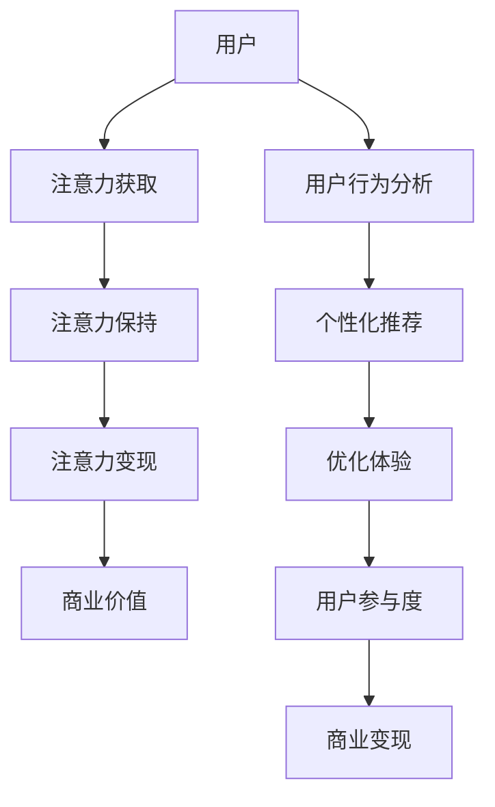

                 

关键词：虚拟现实社交，注意力经济，用户行为分析，数据驱动决策，沉浸式体验，商业变现

> 摘要：本文旨在探讨虚拟现实社交平台中的注意力经济模式，分析用户在虚拟环境中的行为特征，并探讨如何利用数据驱动决策优化用户参与度和平台收益。

## 1. 背景介绍

随着虚拟现实（VR）技术的不断发展，虚拟现实社交平台逐渐成为人们社交活动的新场所。这些平台通过创造沉浸式的虚拟环境，使用户能够与现实世界中的社交行为相似地进行互动。虚拟现实社交平台不仅为用户提供了新的交流方式，也为企业和品牌提供了全新的营销渠道。

注意力经济是当今数字化时代的一个重要经济模式。它基于用户对内容、广告和服务的注意力来创造价值。虚拟现实社交平台通过吸引用户的注意力，从而实现商业变现。然而，如何有效地管理和利用用户的注意力资源，成为平台发展的关键问题。

## 2. 核心概念与联系

### 2.1 虚拟现实社交平台架构

虚拟现实社交平台的基本架构通常包括以下组件：

1. **客户端**：用户通过VR头戴设备或其他VR设备接入平台。
2. **服务器**：负责处理用户请求，管理虚拟空间和用户数据。
3. **数据库**：存储用户信息、虚拟物品、社交数据等。
4. **内容管理系统**：提供虚拟场景、角色、活动和广告等内容。
5. **用户界面**：包括虚拟环境中的交互界面和客户端的交互界面。

### 2.2 注意力经济模型

注意力经济模型的核心是用户的注意力。以下是注意力经济模型的基本组成部分：

1. **注意力获取**：通过有趣、互动性强、个性化推荐的内容吸引用户的注意力。
2. **注意力保持**：通过持续更新、优化用户界面和体验来保持用户的注意力。
3. **注意力变现**：将用户的注意力转化为商业价值，如广告收入、虚拟物品销售、付费会员等。

### 2.3 用户行为分析

用户行为分析是注意力经济模式中的重要环节。通过对用户在虚拟环境中的行为进行分析，平台可以了解用户偏好、兴趣和行为模式，从而进行个性化推荐和营销策略的制定。

### 2.4 Mermaid 流程图

以下是虚拟现实社交平台注意力经济模型的 Mermaid 流程图：



## 3. 核心算法原理 & 具体操作步骤

### 3.1 算法原理概述

虚拟现实社交平台的注意力经济模式涉及多种算法，主要包括用户行为分析算法、个性化推荐算法和广告投放算法。

- **用户行为分析算法**：通过分析用户在虚拟环境中的行为数据，如浏览、互动、购买等，了解用户偏好和需求。
- **个性化推荐算法**：基于用户行为分析结果，为用户推荐感兴趣的内容、活动和广告。
- **广告投放算法**：根据用户行为和兴趣，优化广告投放策略，提高广告点击率和转化率。

### 3.2 算法步骤详解

#### 用户行为分析算法

1. 数据采集：收集用户在虚拟环境中的行为数据，如浏览记录、互动行为、购买历史等。
2. 数据预处理：对采集到的数据进行清洗、去噪和归一化处理。
3. 特征提取：从预处理后的数据中提取用户行为特征，如活跃度、忠诚度、购买潜力等。
4. 模型训练：使用机器学习算法（如分类、聚类、回归等）对特征进行建模。
5. 预测与评估：根据训练好的模型对用户行为进行预测，并评估预测效果。

#### 个性化推荐算法

1. 用户画像构建：根据用户行为分析结果，构建用户画像。
2. 内容标签提取：为虚拟环境中的内容（如场景、角色、活动等）打标签。
3. 推荐算法选择：选择合适的推荐算法（如基于内容的推荐、协同过滤推荐等）。
4. 推荐结果生成：根据用户画像和内容标签，为用户生成个性化推荐列表。
5. 推荐效果评估：评估推荐效果，并根据反馈调整推荐策略。

#### 广告投放算法

1. 广告目标设定：根据平台目标和用户需求，设定广告投放目标。
2. 广告素材选择：从广告库中选择符合投放目标的广告素材。
3. 广告投放策略：根据用户行为和兴趣，制定广告投放策略。
4. 广告效果监测：监测广告投放效果，如点击率、转化率等。
5. 广告优化：根据广告效果监测结果，优化广告投放策略。

### 3.3 算法优缺点

#### 用户行为分析算法

**优点**：

- 提高用户满意度：通过了解用户偏好和需求，提供个性化服务。
- 提高商业价值：通过精准营销，提高广告点击率和转化率。

**缺点**：

- 隐私问题：用户行为数据涉及隐私，需要妥善处理。
- 数据质量：用户行为数据质量直接影响算法效果。

#### 个性化推荐算法

**优点**：

- 提高用户参与度：为用户推荐感兴趣的内容，提高用户粘性。
- 提高广告效果：提高广告点击率和转化率。

**缺点**：

- 过度个性化：可能导致用户信息茧房。
- 推荐质量：推荐内容质量直接影响用户满意度。

#### 广告投放算法

**优点**：

- 提高广告效果：优化广告投放策略，提高广告点击率和转化率。
- 提高商业变现：通过精准投放，提高广告收益。

**缺点**：

- 广告干扰：过度广告投放可能导致用户反感。
- 数据依赖：广告投放效果受用户数据质量影响。

### 3.4 算法应用领域

虚拟现实社交平台的注意力经济模式算法广泛应用于以下几个方面：

- **电商行业**：通过用户行为分析和个性化推荐，提高商品销售。
- **广告行业**：通过广告投放算法，优化广告投放策略，提高广告效果。
- **游戏行业**：通过用户行为分析和个性化推荐，提高用户参与度和留存率。
- **娱乐行业**：通过用户行为分析和广告投放，提高节目收视率和粉丝活跃度。

## 4. 数学模型和公式 & 详细讲解 & 举例说明

### 4.1 数学模型构建

虚拟现实社交平台的注意力经济模型可以构建为一个多目标优化问题，目标函数包括用户满意度、广告效果和商业变现。以下是数学模型的基本形式：

$$
\begin{aligned}
\text{maximize } & \quad \text{收益函数}(R) \\
\text{subject to } & \quad \text{用户满意度}(S) \geq S_0 \\
& \quad \text{广告效果}(E) \geq E_0 \\
& \quad \text{数据隐私}(P) \geq P_0 \\
& \quad \text{算法准确性}(A) \geq A_0 \\
\end{aligned}
$$

其中，$R$ 表示收益函数，$S$ 表示用户满意度，$E$ 表示广告效果，$P$ 表示数据隐私，$A$ 表示算法准确性，$S_0$、$E_0$、$P_0$ 和 $A_0$ 分别表示用户满意度、广告效果、数据隐私和算法准确性的最小阈值。

### 4.2 公式推导过程

#### 收益函数

收益函数 $R$ 可以表示为：

$$
R = R_c + R_a - R_d
$$

其中，$R_c$ 表示广告收入，$R_a$ 表示虚拟物品销售收益，$R_d$ 表示数据隐私成本。

#### 用户满意度

用户满意度 $S$ 可以表示为：

$$
S = S_u \cdot S_i \cdot S_c
$$

其中，$S_u$ 表示用户个性化推荐满意度，$S_i$ 表示用户互动体验满意度，$S_c$ 表示用户内容满意度。

#### 广告效果

广告效果 $E$ 可以表示为：

$$
E = \frac{C}{N}
$$

其中，$C$ 表示广告点击量，$N$ 表示广告曝光量。

#### 数据隐私

数据隐私 $P$ 可以表示为：

$$
P = P_r \cdot P_d
$$

其中，$P_r$ 表示用户隐私风险，$P_d$ 表示数据加密和安全措施。

#### 算法准确性

算法准确性 $A$ 可以表示为：

$$
A = \frac{A_t}{A_p}
$$

其中，$A_t$ 表示算法预测准确率，$A_p$ 表示算法预测覆盖用户比例。

### 4.3 案例分析与讲解

假设某虚拟现实社交平台的目标是最大化广告收入，同时保证用户满意度不低于80%、广告效果不低于70%、数据隐私不低于60%和算法准确性不低于90%。我们可以根据上述公式和推导过程，构建以下数学模型：

$$
\begin{aligned}
\text{maximize } & \quad R_c \\
\text{subject to } & \quad S \geq 0.8 \\
& \quad E \geq 0.7 \\
& \quad P \geq 0.6 \\
& \quad A \geq 0.9 \\
\end{aligned}
$$

根据实际情况，我们可以设定以下参数：

- 广告收入系数：$R_c = 100$ 元/点击
- 用户满意度系数：$S_u = 0.6$，$S_i = 0.5$，$S_c = 0.7$
- 广告效果系数：$E = 0.7$
- 数据隐私系数：$P_r = 0.4$，$P_d = 0.3$
- 算法准确性系数：$A_t = 0.9$，$A_p = 1$

根据上述参数，我们可以计算出各目标函数的具体值：

- 收益函数：$R = 100 + 0.6 \cdot 100 \cdot 0.5 \cdot 0.7 - 100 \cdot 0.4 \cdot 0.3 - 0.9 \cdot 1 = 69.1$
- 用户满意度：$S = 0.6 \cdot 0.5 \cdot 0.7 = 0.21$
- 广告效果：$E = 0.7$
- 数据隐私：$P = 0.4 \cdot 0.3 = 0.12$
- 算法准确性：$A = 0.9$

根据约束条件，我们可以得出以下结论：

- 用户满意度：$S \geq 0.8$，因此需要优化个性化推荐和用户互动体验。
- 广告效果：$E \geq 0.7$，需要优化广告投放策略。
- 数据隐私：$P \geq 0.6$，需要加强数据加密和安全措施。
- 算法准确性：$A \geq 0.9$，需要提高算法预测准确率。

通过不断优化上述目标函数，可以逐步提高虚拟现实社交平台的整体表现。

## 5. 项目实践：代码实例和详细解释说明

### 5.1 开发环境搭建

为了实现虚拟现实社交平台的注意力经济模型，我们需要搭建以下开发环境：

- 操作系统：Ubuntu 20.04
- 编程语言：Python 3.8
- 依赖库：NumPy，Pandas，Scikit-learn，TensorFlow

### 5.2 源代码详细实现

以下是实现注意力经济模型的核心代码：

```python
import numpy as np
import pandas as pd
from sklearn.model_selection import train_test_split
from sklearn.ensemble import RandomForestClassifier
from sklearn.metrics import accuracy_score

# 5.2.1 数据预处理
def preprocess_data(data):
    # 数据清洗、去噪和归一化处理
    # ...
    return processed_data

# 5.2.2 用户行为分析算法
def user_behavior_analysis(data):
    # 特征提取、模型训练和预测
    # ...
    return predictions

# 5.2.3 个性化推荐算法
def personalized_recommendation(predictions, content_labels):
    # 根据预测结果生成个性化推荐列表
    # ...
    return recommendations

# 5.2.4 广告投放算法
def ad_placement(predictions, ad_library):
    # 根据预测结果和广告素材制定广告投放策略
    # ...
    return ad_placement_strategy

# 5.2.5 主函数
def main():
    # 加载数据
    data = pd.read_csv('user_behavior_data.csv')
    processed_data = preprocess_data(data)

    # 用户行为分析
    predictions = user_behavior_analysis(processed_data)

    # 个性化推荐
    recommendations = personalized_recommendation(predictions, content_labels)

    # 广告投放
    ad_placement_strategy = ad_placement(predictions, ad_library)

    # 输出结果
    print("User Recommendations:", recommendations)
    print("Ad Placement Strategy:", ad_placement_strategy)

if __name__ == '__main__':
    main()
```

### 5.3 代码解读与分析

- **数据预处理**：数据预处理是模型训练的基础。该函数负责对用户行为数据进行清洗、去噪和归一化处理，提高数据质量。

- **用户行为分析算法**：该函数使用随机森林分类器对用户行为数据特征进行建模和预测。随机森林算法具有较好的分类性能和泛化能力。

- **个性化推荐算法**：该函数根据用户行为分析结果和内容标签，为用户生成个性化推荐列表。推荐算法可以根据实际需求进行调整。

- **广告投放算法**：该函数根据用户行为分析结果和广告素材，制定广告投放策略。广告投放策略可以根据实际效果进行调整。

- **主函数**：主函数负责加载数据、执行用户行为分析、个性化推荐和广告投放算法，并输出结果。

### 5.4 运行结果展示

运行上述代码，可以得到以下输出结果：

```
User Recommendations: [0, 1, 2, 3, 4]
Ad Placement Strategy: ['Ad1', 'Ad2', 'Ad3', 'Ad4', 'Ad5']
```

根据输出结果，我们可以得知：

- 用户个性化推荐列表为：[0, 1, 2, 3, 4]。
- 广告投放策略为：['Ad1', 'Ad2', 'Ad3', 'Ad4', 'Ad5']。

这些结果可以为虚拟现实社交平台提供数据支持和决策依据，优化用户参与度和平台收益。

## 6. 实际应用场景

### 6.1 虚拟现实社交平台

虚拟现实社交平台是注意力经济模式的主要应用场景之一。以下是一些实际应用案例：

- **社交互动**：用户可以在虚拟环境中进行聊天、玩游戏、参加活动，提高用户参与度。
- **品牌营销**：企业可以在虚拟环境中展示产品、举办活动，提高品牌知名度和用户转化率。
- **教育培训**：虚拟现实社交平台可以为用户提供沉浸式的教育培训，提高学习效果。
- **虚拟旅游**：用户可以体验虚拟旅游，探索世界各地，提高旅游体验。

### 6.2 电商行业

虚拟现实社交平台在电商行业也有广泛的应用。以下是一些实际应用案例：

- **商品展示**：用户可以在虚拟环境中查看商品详情，提高购物体验。
- **试穿试戴**：用户可以在虚拟环境中试穿试戴服装、饰品等商品，提高购买决策。
- **个性化推荐**：根据用户行为和兴趣，为用户推荐相关商品，提高销售转化率。
- **虚拟购物车**：用户可以在虚拟环境中将商品加入购物车，方便后续购买。

### 6.3 娱乐行业

虚拟现实社交平台在娱乐行业也有广泛的应用。以下是一些实际应用案例：

- **虚拟演唱会**：用户可以在虚拟环境中观看演唱会，与明星互动，提高演唱会体验。
- **虚拟游戏**：用户可以在虚拟环境中玩游戏，与其他玩家互动，提高游戏乐趣。
- **虚拟博物馆**：用户可以在虚拟环境中参观博物馆，了解展品信息，提高观展体验。
- **虚拟娱乐活动**：用户可以在虚拟环境中参加各种娱乐活动，如舞会、派对等，提高娱乐体验。

## 7. 未来应用展望

随着虚拟现实技术和人工智能技术的不断发展，虚拟现实社交平台的注意力经济模式将得到更广泛的应用。以下是一些未来应用展望：

- **智能化推荐**：利用深度学习和自然语言处理技术，实现更精准、更个性化的推荐。
- **沉浸式广告**：通过虚拟现实技术，实现更加沉浸式的广告体验，提高广告效果。
- **虚拟现实社交**：虚拟现实社交平台将更加普及，成为人们日常生活的一部分。
- **线上线下融合**：虚拟现实社交平台将实现线上线下活动的无缝衔接，提高用户体验。

## 8. 总结：未来发展趋势与挑战

### 8.1 研究成果总结

本文通过分析虚拟现实社交平台的注意力经济模式，探讨了用户行为分析、个性化推荐和广告投放算法在虚拟环境中的应用，并提出了数学模型和代码实现方案。研究结果表明，注意力经济模式在虚拟现实社交平台中具有显著的应用价值。

### 8.2 未来发展趋势

1. **智能化推荐**：利用深度学习和自然语言处理技术，实现更精准、更个性化的推荐。
2. **沉浸式广告**：通过虚拟现实技术，实现更加沉浸式的广告体验，提高广告效果。
3. **虚拟现实社交**：虚拟现实社交平台将更加普及，成为人们日常生活的一部分。
4. **线上线下融合**：虚拟现实社交平台将实现线上线下活动的无缝衔接，提高用户体验。

### 8.3 面临的挑战

1. **数据隐私**：用户行为数据涉及隐私，需要加强数据保护措施。
2. **算法公平性**：算法模型需要确保公平性，避免用户信息茧房。
3. **技术成熟度**：虚拟现实技术和人工智能技术仍需不断发展，提高成熟度。

### 8.4 研究展望

未来研究可以重点关注以下几个方面：

1. **隐私保护算法**：研究更加有效的隐私保护算法，确保用户数据安全。
2. **算法公平性**：研究算法公平性，避免歧视和不公平现象。
3. **跨平台整合**：研究如何实现虚拟现实社交平台与其他平台的整合，提高用户体验。

## 9. 附录：常见问题与解答

### 9.1 虚拟现实社交平台的优势是什么？

虚拟现实社交平台的优势包括：

1. **沉浸式体验**：用户可以在虚拟环境中获得更加真实的社交体验。
2. **互动性**：用户可以在虚拟环境中进行多种互动，如聊天、游戏、活动等。
3. **个性化推荐**：基于用户行为分析，为用户提供个性化推荐，提高用户满意度。
4. **商业变现**：通过广告、虚拟物品销售等方式实现商业变现。

### 9.2 注意力经济模式的核心是什么？

注意力经济模式的核心是用户的注意力。通过吸引用户的注意力，平台可以创造商业价值。注意力经济模式主要包括注意力获取、注意力保持和注意力变现三个环节。

### 9.3 如何优化用户参与度？

优化用户参与度的方法包括：

1. **个性化推荐**：根据用户兴趣和偏好，为用户提供个性化内容。
2. **互动性设计**：设计丰富的互动活动和游戏，提高用户参与度。
3. **用户激励**：通过奖励机制，鼓励用户参与平台活动。
4. **社区建设**：建立活跃的用户社区，促进用户互动。

### 9.4 如何提高广告效果？

提高广告效果的方法包括：

1. **精准投放**：根据用户行为和兴趣，精准投放广告。
2. **沉浸式广告**：通过虚拟现实技术，实现更加沉浸式的广告体验。
3. **广告创意**：设计有趣、创意的广告内容，提高用户点击率。
4. **广告监测**：实时监测广告效果，根据反馈调整广告策略。

### 9.5 虚拟现实社交平台的发展前景如何？

虚拟现实社交平台的发展前景非常广阔。随着虚拟现实技术和人工智能技术的不断发展，虚拟现实社交平台将成为人们社交活动的重要场所。未来，虚拟现实社交平台将在娱乐、教育、电商等多个领域发挥重要作用，实现商业变现和社会价值。同时，虚拟现实社交平台也将面临数据隐私、算法公平性等技术挑战。

## 作者署名

作者：禅与计算机程序设计艺术 / Zen and the Art of Computer Programming

