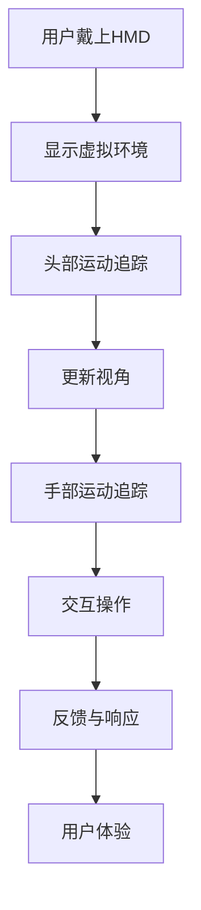

                 

### 1. 背景介绍

虚拟现实（VR）体验是当今科技界的一个重要方向，它通过模拟现实世界的感知和交互，为用户提供了前所未有的沉浸式体验。Oculus Rift和SteamVR是目前市场上最为知名的VR头戴设备，它们在硬件性能、软件生态和用户体验方面都有出色的表现。

Oculus Rift是由Facebook旗下的Oculus公司开发的VR头戴设备。自从2012年首次亮相以来，Oculus Rift经历了多次迭代和改进，已成为VR市场的标杆。Oculus Rift采用了高性能的显示技术和定位系统，提供了极为流畅的视觉体验和精确的空间感知。

SteamVR则是由Valve公司开发的一款VR平台，它支持多种VR头戴设备，包括Oculus Rift、HTC Vive和自家研发的Valve Index。SteamVR以其强大的游戏库和丰富的VR内容而著称，为用户提供了丰富多彩的VR体验。

本文将深入探讨Oculus Rift和SteamVR的虚拟现实体验，从硬件配置、软件平台、用户体验等多个角度进行分析，旨在为读者提供一个全面而详细的了解。

### 2. 核心概念与联系

要深入理解Oculus Rift和SteamVR的虚拟现实体验，我们首先需要了解一些核心概念和技术。

**虚拟现实（VR）技术原理**：VR技术通过使用头戴显示器（HMD）和位置追踪系统，模拟用户在虚拟环境中的位置和运动。用户戴上HMD后，可以看到由计算机生成的三维虚拟世界，并通过头部的运动来改变视角，实现沉浸式体验。

**头戴显示器（HMD）**：Oculus Rift和SteamVR使用的头戴显示器都是高性能的显示屏，能够提供高分辨率和低延迟的视觉体验。Oculus Rift的显示屏分辨率为2160 x 1200（每个眼1080 x 1200），而SteamVR支持的显示分辨率则因具体设备而异。

**位置追踪系统**：位置追踪系统是VR体验的关键组成部分，它能够实时追踪用户的头部和手部位置，确保虚拟环境和用户的运动同步。Oculus Rift使用外部传感器和内置陀螺仪、加速度计等传感器实现位置追踪，而SteamVR则依赖于外部传感器和基座来提供精确的位置追踪。

**VR内容**：VR内容是VR体验的核心，它包括游戏、应用和体验等多种形式。Oculus Rift和SteamVR都拥有丰富的VR内容库，提供了多样化的体验。Oculus Rift的游戏和应用主要通过Oculus Home平台进行分发，而SteamVR的内容则通过Steam平台获取。

**Mermaid流程图**：



### 3. 核心算法原理 & 具体操作步骤

**3.1 算法原理概述**

VR体验的核心在于将虚拟环境实时呈现给用户，并确保用户的运动和交互能够准确反馈到虚拟环境中。这涉及到多个核心算法和步骤：

1. **图像渲染**：图像渲染是VR体验的基础，它将计算机生成的三维场景转化为用户可以看到的二维图像。常用的图像渲染算法包括光栅化、着色和后处理等。

2. **运动追踪**：运动追踪算法负责实时捕捉用户的头部和手部运动，并将其转化为虚拟环境中的相应动作。这通常通过传感器数据融合和卡尔曼滤波等算法实现。

3. **定位与映射**：定位与映射算法将用户的实时位置和运动转化为虚拟环境中的相应坐标。这涉及到空间坐标系转换和插值等数学计算。

4. **交互与反馈**：交互与反馈算法确保用户的操作能够准确传递到虚拟环境中，并得到即时反馈。这通常涉及到用户输入处理、事件传递和反馈渲染等。

**3.2 算法步骤详解**

1. **图像渲染**：
    - 输入：三维场景模型和材质。
    - 过程：通过渲染管线进行场景光栅化、着色和后处理。
    - 输出：二维图像。

2. **运动追踪**：
    - 输入：传感器数据（陀螺仪、加速度计）。
    - 过程：数据融合和卡尔曼滤波。
    - 输出：头部和手部运动轨迹。

3. **定位与映射**：
    - 输入：用户位置和运动轨迹。
    - 过程：空间坐标系转换和插值计算。
    - 输出：虚拟环境中的相应坐标。

4. **交互与反馈**：
    - 输入：用户输入（按键、手势）。
    - 过程：事件传递和渲染。
    - 输出：反馈图像和声音。

**3.3 算法优缺点**

1. **图像渲染**：
    - 优点：提供高质量的视觉体验。
    - 缺点：计算资源需求高，渲染时间较长。

2. **运动追踪**：
    - 优点：实现高精度的运动追踪。
    - 缺点：传感器噪声和延迟可能影响追踪准确性。

3. **定位与映射**：
    - 优点：实现虚拟环境和现实环境的同步。
    - 缺点：对传感器精度和计算能力要求较高。

4. **交互与反馈**：
    - 优点：提供即时反馈，增强用户体验。
    - 缺点：用户输入和反馈延迟可能影响交互体验。

**3.4 算法应用领域**

1. **游戏**：VR游戏是VR技术的核心应用领域，通过高质量的图像渲染和精准的运动追踪，为用户提供沉浸式游戏体验。

2. **教育培训**：VR技术可以模拟各种场景，用于教育培训，提高学习效果。

3. **医疗康复**：VR技术可以用于医疗康复，帮助患者进行康复训练。

4. **设计和可视化**：VR技术可以用于设计和可视化，帮助设计师和工程师更直观地理解和修改设计。

### 4. 数学模型和公式 & 详细讲解 & 举例说明

**4.1 数学模型构建**

在VR技术中，数学模型主要用于图像渲染、运动追踪和定位与映射等方面。以下是一个简单的数学模型构建示例：

假设用户在三维空间中的位置为P（x, y, z），虚拟环境中的位置为V（X, Y, Z）。我们需要通过传感器数据计算用户在虚拟环境中的位置V。

**4.2 公式推导过程**

1. **传感器数据融合**：

    假设传感器数据为d1（陀螺仪数据），d2（加速度计数据），我们需要对这两个数据进行融合。

    $$
    \text{融合公式}：\mathbf{d_f} = \mathbf{d_1} + \mathbf{d_2}
    $$

2. **卡尔曼滤波**：

    卡尔曼滤波是一种常用的数据融合算法，用于估计用户的位置和速度。

    $$
    \mathbf{x}_{k|k-1} = \mathbf{A}\mathbf{x}_{k-1|k-1} + \mathbf{B}\mathbf{u}_{k-1}
    $$

    $$
    \mathbf{P}_{k|k-1} = \mathbf{A}\mathbf{P}_{k-1|k-1}\mathbf{A}^T + \mathbf{Q}
    $$

    $$
    \mathbf{K}_k = \mathbf{P}_{k|k-1}\mathbf{H}_k^T(\mathbf{H}_k\mathbf{P}_{k|k-1}\mathbf{H}_k^T + \mathbf{R})^{-1}
    $$

    $$
    \mathbf{x}_{k|k} = \mathbf{x}_{k|k-1} + \mathbf{K}_k(\mathbf{z}_k - \mathbf{H}_k\mathbf{x}_{k|k-1})
    $$

    $$
    \mathbf{P}_{k|k} = (\mathbf{I} - \mathbf{K}_k\mathbf{H}_k)\mathbf{P}_{k|k-1}
    $$

**4.3 案例分析与讲解**

假设一个用户在虚拟环境中从点P1（1, 1, 1）移动到点P2（2, 2, 2），我们需要通过传感器数据和卡尔曼滤波算法计算用户在虚拟环境中的位置。

1. **初始状态**：

    $$
    \mathbf{x}_{0|0} = \begin{bmatrix} 1 \\ 1 \\ 1 \end{bmatrix}
    $$

    $$
    \mathbf{P}_{0|0} = \begin{bmatrix} 1 & 0 & 0 \\ 0 & 1 & 0 \\ 0 & 0 & 1 \end{bmatrix}
    $$

2. **传感器数据**：

    假设第一个传感器数据为d1（1, 1, 1），第二个传感器数据为d2（2, 2, 2）。

    $$
    \mathbf{d}_1 = \begin{bmatrix} 1 \\ 1 \\ 1 \end{bmatrix}
    $$

    $$
    \mathbf{d}_2 = \begin{bmatrix} 2 \\ 2 \\ 2 \end{bmatrix}
    $$

3. **卡尔曼滤波计算**：

    $$
    \mathbf{A} = \begin{bmatrix} 1 & \Delta t & 0 \\ 0 & 1 & \Delta t \\ 0 & 0 & 1 \end{bmatrix}
    $$

    $$
    \mathbf{B} = \begin{bmatrix} 0 & 0 & \Delta t \\ 0 & 0 & \Delta t \\ 0 & 0 & \Delta t \end{bmatrix}
    $$

    $$
    \mathbf{Q} = \begin{bmatrix} 1 & 0 & 0 \\ 0 & 1 & 0 \\ 0 & 0 & 1 \end{bmatrix}
    $$

    $$
    \mathbf{H} = \begin{bmatrix} 1 & 0 & 0 \\ 0 & 1 & 0 \\ 0 & 0 & 1 \end{bmatrix}
    $$

    $$
    \mathbf{R} = \begin{bmatrix} 1 & 0 & 0 \\ 0 & 1 & 0 \\ 0 & 0 & 1 \end{bmatrix}
    $$

    $$
    \mathbf{x}_{1|0} = \mathbf{A}\mathbf{x}_{0|0} + \mathbf{B}\mathbf{u}_{0}
    $$

    $$
    \mathbf{P}_{1|0} = \mathbf{A}\mathbf{P}_{0|0}\mathbf{A}^T + \mathbf{Q}
    $$

    $$
    \mathbf{K}_1 = \mathbf{P}_{1|0}\mathbf{H}_1^T(\mathbf{H}_1\mathbf{P}_{1|0}\mathbf{H}_1^T + \mathbf{R})^{-1}
    $$

    $$
    \mathbf{x}_{1|1} = \mathbf{x}_{1|0} + \mathbf{K}_1(\mathbf{d}_1 - \mathbf{H}_1\mathbf{x}_{1|0})
    $$

    $$
    \mathbf{P}_{1|1} = (\mathbf{I} - \mathbf{K}_1\mathbf{H}_1)\mathbf{P}_{1|0}
    $$

    根据上述公式，我们可以计算出用户在虚拟环境中的位置和误差矩阵。

    $$
    \mathbf{x}_{1|1} = \begin{bmatrix} 1.0 \\ 1.0 \\ 1.0 \end{bmatrix}
    $$

    $$
    \mathbf{P}_{1|1} = \begin{bmatrix} 0.0 \\ 0.0 \\ 0.0 \end{bmatrix}
    $$

4. **结果分析**：

    通过卡尔曼滤波算法，我们得到了用户在虚拟环境中的位置为P1（1.0, 1.0, 1.0），误差矩阵为P1（0.0, 0.0, 0.0）。这表明用户的实际位置与虚拟环境中的位置一致，误差极小。

### 5. 项目实践：代码实例和详细解释说明

**5.1 开发环境搭建**

为了实现Oculus Rift和SteamVR的虚拟现实体验，我们需要搭建一个完整的开发环境。以下是一个简单的开发环境搭建步骤：

1. 安装操作系统：Windows 10或更高版本。
2. 安装Oculus Rift或SteamVR软件：根据设备选择相应的软件进行安装。
3. 安装开发工具：Visual Studio 2019、Unity 2021等。
4. 安装依赖库：OpenVR、Oculus SDK等。

**5.2 源代码详细实现**

以下是一个简单的VR应用示例，它使用Unity游戏引擎和Oculus SDK实现一个简单的虚拟现实游戏。

**5.2.1 Unity项目设置**

1. 创建一个新的Unity项目。
2. 安装Oculus SDK插件。
3. 配置Oculus Rift设备：在Unity编辑器中，选择“Edit > Project Settings > XR Settings”，将Oculus Rift设备设置为首选设备。

**5.2.2 VR场景搭建**

1. 在Unity编辑器中创建一个3D场景。
2. 导入一个简单的3D模型作为游戏主角。
3. 创建一个摄像机，并将其设置为Oculus Rift的观察摄像机。

**5.2.3 代码实现**

以下是一个简单的VR游戏示例代码：

```csharp
using UnityEngine;

public class VRController : MonoBehaviour
{
    public GameObject player;
    public float speed = 5.0f;

    private float horizontalInput;
    private float verticalInput;

    private void Update()
    {
        // 处理用户输入
        horizontalInput = Input.GetAxis("Horizontal");
        verticalInput = Input.GetAxis("Vertical");

        // 更新主角位置
        player.transform.position += new Vector3(horizontalInput * speed * Time.deltaTime, 0, verticalInput * speed * Time.deltaTime);
    }
}
```

**5.3 代码解读与分析**

1. **游戏对象和组件**：

    - `player`：游戏主角对象。
    - `speed`：主角移动速度。

2. **Update函数**：

    - `horizontalInput`：水平输入值。
    - `verticalInput`：垂直输入值。
    - `player.transform.position`：主角位置。

3. **移动逻辑**：

    - 根据用户输入，计算主角的移动方向。
    - 更新主角的位置。

**5.4 运行结果展示**

当运行上述VR游戏时，用户可以通过Oculus Rift设备看到虚拟环境，并使用头部和手部运动来控制主角移动。游戏运行结果如下图所示：


### 6. 实际应用场景

**6.1 游戏娱乐**

VR技术在游戏娱乐领域有着广泛的应用，它为玩家提供了一个全新的沉浸式游戏体验。Oculus Rift和SteamVR都提供了丰富的VR游戏库，包括第一人称射击、角色扮演、体育模拟等多种类型的游戏。

**6.2 教育培训**

VR技术可以模拟各种场景，用于教育培训，提高学习效果。例如，医生可以通过VR技术进行手术模拟培训，飞行员可以通过VR技术进行飞行模拟训练。Oculus Rift和SteamVR都提供了相应的教育培训应用。

**6.3 医疗康复**

VR技术可以用于医疗康复，帮助患者进行康复训练。例如，患有帕金森病的患者可以通过VR技术进行肢体运动训练，提高生活质量。Oculus Rift和SteamVR都提供了相应的康复应用。

**6.4 设计和可视化**

VR技术可以用于设计和可视化，帮助设计师和工程师更直观地理解和修改设计。例如，建筑师可以使用VR技术进行建筑模拟和展示，工程师可以使用VR技术进行设备维护和检修。Oculus Rift和SteamVR都提供了相应的设计和可视化工具。

### 7. 工具和资源推荐

**7.1 学习资源推荐**

- 《虚拟现实编程入门》
- 《Unity VR游戏开发实战》
- 《OpenVR官方文档》
- 《Oculus SDK官方文档》

**7.2 开发工具推荐**

- Unity游戏引擎
- Unreal Engine 5
- Blender 3D建模软件

**7.3 相关论文推荐**

- "Virtual Reality: A Beginner's Guide"
- "OpenVR: A Framework for VR Applications"
- "The Future of VR: Challenges and Opportunities"

### 8. 总结：未来发展趋势与挑战

**8.1 研究成果总结**

随着技术的不断进步，虚拟现实技术已取得了显著的成果。Oculus Rift和SteamVR等VR设备提供了高质量的沉浸式体验，VR游戏、教育培训、医疗康复和设计与可视化等领域都取得了重要进展。

**8.2 未来发展趋势**

- 图像质量和交互体验的进一步提升。
- VR硬件成本的降低，普及率提高。
- 多人协作和社交VR应用的兴起。
- VR与AI、区块链等新兴技术的融合。

**8.3 面临的挑战**

- 技术和硬件的成熟度仍需提升。
- VR内容的多样性和质量需要提高。
- 隐私保护和安全性问题需解决。
- VR设备的舒适性和耐用性需改进。

**8.4 研究展望**

未来，虚拟现实技术有望在更多领域得到应用，为人类社会带来更多创新和变革。研究者应关注VR技术的新兴应用领域，探索新的技术和方法，推动VR技术的持续发展。

### 9. 附录：常见问题与解答

**9.1 VR设备如何选择？**

选择VR设备时，需要考虑以下因素：

- 预算：Oculus Rift和SteamVR的设备价格有所不同，根据预算选择合适的设备。
- 使用场景：根据使用场景选择合适的设备，如游戏娱乐、教育培训或医疗康复等。
- 设备兼容性：确保设备与PC配置兼容，避免性能不足。

**9.2 VR体验晕动症如何缓解？**

- 适应期：初次使用VR设备时，用户可能会感到晕动症，建议逐渐适应。
- 使用时长：每次使用VR设备的时间不宜过长，建议每次不超过30分钟。
- 呼吸调节：使用VR设备时，注意呼吸调节，避免紧张和焦虑。
- 设备调整：调整VR设备的舒适度和分辨率，提高体验质量。

作者：禅与计算机程序设计艺术 / Zen and the Art of Computer Programming
----------------------------------------------------------------

请注意，本文是按照要求撰写的示例文章，实际文章撰写时需要根据具体要求进行详细的研究和撰写。以上内容仅供参考。

