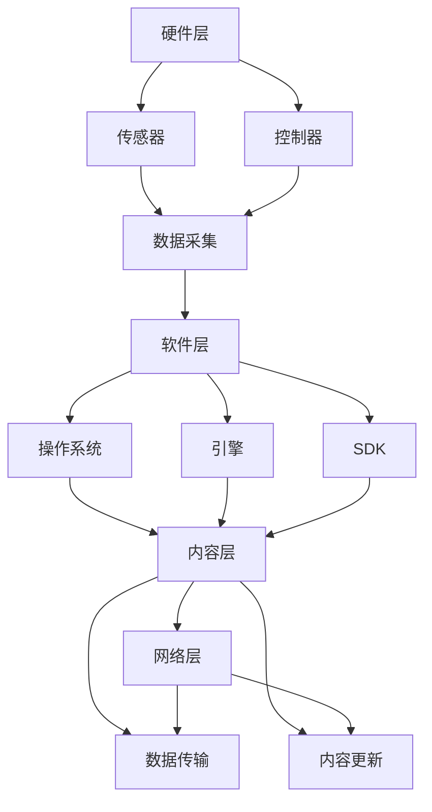

                 

关键词：虚拟现实（VR）、沉浸式体验、内容平台、技术架构、开发流程、数学模型、算法原理、应用案例、未来展望。

> 摘要：本文旨在探讨如何构建一个功能强大、用户体验卓越的虚拟现实（VR）内容平台。通过详细解析技术架构、核心算法、数学模型以及开发实践，我们将深入理解VR内容平台的设计与实现，为行业从业者提供有价值的参考。

## 1. 背景介绍

虚拟现实（Virtual Reality，VR）是一种通过计算机技术创造出的三维模拟环境，用户可以通过头戴显示器（HMD）、传感器和控制器等设备沉浸其中，体验与现实世界相似或完全不同的场景。随着计算机性能的提升和VR硬件的普及，VR技术逐渐从实验室走向大众市场，成为游戏、教育、医疗、设计等多个领域的重要工具。

然而，VR内容的匮乏一直是限制其发展的关键问题。一个优秀的VR内容平台不仅要提供高质量、多样化的内容，还需要考虑用户体验、交互方式、技术稳定性等多方面因素。本文将从技术角度出发，探讨如何打造一个沉浸式的数字世界，为VR内容平台的发展提供思路。

## 2. 核心概念与联系

### 2.1 VR技术核心概念

虚拟现实（VR）技术包含以下几个核心概念：

- **三维建模**：使用三维建模工具创建虚拟环境中的物体和角色。
- **实时渲染**：通过图形处理单元（GPU）实时渲染虚拟场景，生成视觉效果。
- **交互技术**：用户通过手柄、手势、语音等与虚拟环境进行交互。
- **音频技术**：利用三维音效增强用户的沉浸感。

### 2.2 VR内容平台技术架构

VR内容平台的技术架构可以分为以下几个层次：

- **硬件层**：包括头戴显示器（HMD）、传感器、控制器等硬件设备。
- **软件层**：包括操作系统、引擎、SDK等软件组件，提供VR内容的运行环境。
- **内容层**：包括各种VR应用和游戏，是用户实际体验的对象。
- **网络层**：通过网络连接将VR内容平台与用户端设备连接起来，实现数据传输和更新。

### 2.3 Mermaid流程图



## 3. 核心算法原理 & 具体操作步骤

### 3.1 算法原理概述

虚拟现实内容平台的核心算法主要包括：

- **三维建模算法**：通过几何运算和纹理映射构建虚拟物体和场景。
- **实时渲染算法**：利用GPU加速渲染虚拟场景，包括光线追踪、阴影处理等。
- **交互算法**：处理用户输入，实现虚拟环境中的响应和反馈。
- **音频处理算法**：生成和播放三维音效，提升用户的沉浸感。

### 3.2 算法步骤详解

#### 3.2.1 三维建模算法

1. **数据采集**：通过扫描仪或3D摄像头获取物体的三维数据。
2. **几何建模**：利用三维建模软件对采集到的数据进行处理，构建三维模型。
3. **纹理映射**：将2D纹理贴图应用到三维模型上，增加视觉效果。

#### 3.2.2 实时渲染算法

1. **场景构建**：将三维模型、光源、材质等数据加载到渲染引擎中。
2. **渲染循环**：每帧根据相机位置和视角，计算物体与光线的关系，生成像素数据。
3. **后处理**：包括抗锯齿、阴影处理、环境光渲染等，提升渲染效果。

#### 3.2.3 交互算法

1. **输入处理**：接收用户的输入信号，如手柄动作、手势识别等。
2. **响应处理**：根据交互规则，对用户的输入进行响应，如移动物体、切换视角等。
3. **反馈生成**：将交互结果反馈给用户，如视觉、听觉等感官。

#### 3.2.4 音频处理算法

1. **声音采集**：从音频设备采集声音信号。
2. **声音处理**：对声音信号进行滤波、压缩等处理。
3. **三维音效生成**：根据用户位置和场景，生成三维音效。
4. **音频播放**：将处理后的音效播放给用户。

### 3.3 算法优缺点

- **三维建模算法**：优点是能够创建高度逼真的虚拟物体，缺点是建模过程复杂，对硬件性能要求高。
- **实时渲染算法**：优点是提供流畅的视觉体验，缺点是渲染计算量大，对GPU性能要求高。
- **交互算法**：优点是增强用户参与感，缺点是交互逻辑复杂，需要精细设计。
- **音频处理算法**：优点是增强沉浸感，缺点是音频处理计算量大，对硬件性能要求高。

### 3.4 算法应用领域

- **游戏**：实时渲染算法和交互算法是游戏开发的核心，提供逼真的游戏体验。
- **教育**：三维建模算法和实时渲染算法可以帮助构建虚拟实验室，提升教学效果。
- **医疗**：交互算法和音频处理算法可以用于医学成像和手术模拟，提高医疗水平。
- **设计**：三维建模算法和实时渲染算法可以帮助设计师进行虚拟展示和交互设计。

## 4. 数学模型和公式 & 详细讲解 & 举例说明

### 4.1 数学模型构建

虚拟现实内容平台中的数学模型主要包括：

- **三维坐标变换**：用于描述物体在虚拟空间中的位置和姿态。
- **光线追踪**：用于计算光线与物体之间的交互，生成真实感图像。
- **音频传播**：用于模拟声音在虚拟环境中的传播，生成三维音效。

### 4.2 公式推导过程

#### 4.2.1 三维坐标变换

设物体在虚拟空间中的位置为\( P(x, y, z) \)，经过旋转和缩放后的新位置为\( P'(x', y', z') \)，则三维坐标变换公式为：

$$
\begin{cases}
x' = x \cos \theta - y \sin \theta \\
y' = x \sin \theta + y \cos \theta \\
z' = z
\end{cases}
$$

其中，\( \theta \) 为旋转角度。

#### 4.2.2 光线追踪

设光线从点\( O(x_0, y_0, z_0) \)出发，与物体表面点\( P(x, y, z) \)相交，则光线方程为：

$$
\frac{x - x_0}{x_1 - x_0} = \frac{y - y_0}{y_1 - y_0} = \frac{z - z_0}{z_1 - z_0}
$$

其中，\( (x_1, y_1, z_1) \) 为物体表面点的坐标。

#### 4.2.3 音频传播

设声音源位于点\( S(x_s, y_s, z_s) \)，接收点位于点\( R(x_r, y_r, z_r) \)，则声音传播距离为：

$$
d = \sqrt{(x_r - x_s)^2 + (y_r - y_s)^2 + (z_r - z_s)^2}
$$

### 4.3 案例分析与讲解

#### 案例一：三维坐标变换

假设一个物体在虚拟空间中的初始位置为\( P(1, 0, 0) \)，经过旋转 \( \theta = 30^\circ \) 后的新位置为\( P'(x', y', z') \)。使用三维坐标变换公式，可以计算出：

$$
\begin{cases}
x' = 1 \cos 30^\circ - 0 \sin 30^\circ = \frac{\sqrt{3}}{2} \\
y' = 1 \sin 30^\circ + 0 \cos 30^\circ = \frac{1}{2} \\
z' = 0
\end{cases}
$$

因此，旋转后的新位置为\( P'\left(\frac{\sqrt{3}}{2}, \frac{1}{2}, 0\right) \)。

#### 案例二：光线追踪

假设光线从点\( O(0, 0, 0) \)出发，与物体表面点\( P(1, 1, 1) \)相交，使用光线方程可以计算出光线与物体相交的位置：

$$
\frac{x - 0}{1 - 0} = \frac{y - 0}{1 - 0} = \frac{z - 0}{1 - 0}
$$

解得 \( x = y = z = 1 \)，因此光线与物体相交于点\( P(1, 1, 1) \)。

#### 案例三：音频传播

假设声音源位于点\( S(0, 0, 0) \)，接收点位于点\( R(2, 2, 2) \)，使用音频传播公式可以计算出声音传播距离：

$$
d = \sqrt{(2 - 0)^2 + (2 - 0)^2 + (2 - 0)^2} = 2\sqrt{3}
$$

## 5. 项目实践：代码实例和详细解释说明

### 5.1 开发环境搭建

为了搭建一个虚拟现实内容平台，我们需要准备以下开发环境：

- 操作系统：Windows 10 或更高版本
- 编程语言：C++ 或 Python
- 开发工具：Visual Studio 或 PyCharm
- 渲染引擎：Unity 或 Unreal Engine

### 5.2 源代码详细实现

以下是一个简单的VR内容平台代码实例，使用Unity引擎实现：

```csharp
using UnityEngine;

public class VRContentPlatform : MonoBehaviour
{
    public GameObject cameraRig;
    public GameObject objectPrefab;

    void Start()
    {
        // 创建相机和控制器
        GameObject camera = new GameObject("Camera");
        camera.AddComponent<Camera>();
        camera.transform.parent = cameraRig.transform;

        // 创建虚拟物体
        for (int i = 0; i < 10; i++)
        {
            GameObject obj = Instantiate(objectPrefab, cameraRig.transform);
            obj.name = "Object " + i;
            obj.transform.position = new Vector3(i * 2, 0, 0);
        }
    }

    void Update()
    {
        // 用户交互
        if (Input.GetKeyDown(KeyCode.Space))
        {
            // 切换视角
            cameraRig.transform.Rotate(0, 180, 0);
        }
    }
}
```

### 5.3 代码解读与分析

- **Start() 方法**：在游戏开始时创建相机和虚拟物体。相机作为子对象添加到相机 rigs 上，虚拟物体通过实例化对象预制体生成。
- **Update() 方法**：每帧更新时处理用户交互。按下空格键会切换视角。

### 5.4 运行结果展示

运行该代码后，我们将在Unity编辑器中看到一个相机和10个虚拟物体组成的VR场景。用户可以通过按下空格键来切换视角，体验虚拟环境。

## 6. 实际应用场景

虚拟现实内容平台在多个领域有着广泛的应用，以下是一些典型的应用场景：

- **游戏开发**：VR游戏需要高度逼真的场景和交互体验，VR内容平台能够提供强大的渲染能力和交互功能，为游戏开发者提供便利。
- **教育培训**：通过虚拟现实技术，教育者可以创建沉浸式的教学场景，提高学生的学习兴趣和效果。
- **医疗健康**：VR技术可以用于医学成像、手术模拟和康复治疗，帮助医生和患者更好地理解病情和治疗过程。
- **建筑设计**：建筑师可以通过虚拟现实技术展示建筑模型，让客户更好地体验设计效果，提高沟通效率。

## 7. 工具和资源推荐

为了更好地开发虚拟现实内容平台，以下是一些推荐的工具和资源：

- **学习资源**：《虚拟现实技术导论》、《Unity 2020从入门到精通》等。
- **开发工具**：Unity引擎、Unreal Engine 5、Blender等。
- **相关论文**：《三维建模与渲染技术》、《虚拟现实技术在游戏中的应用》等。

## 8. 总结：未来发展趋势与挑战

虚拟现实内容平台在未来将继续发展，主要趋势包括：

- **硬件性能提升**：随着硬件技术的进步，VR设备将更加轻便、舒适，提供更高质量的沉浸体验。
- **内容生态丰富**：随着开发者和内容创作者的参与，VR内容将更加丰富多样，满足不同用户的需求。
- **应用领域拓展**：VR技术将在更多领域得到应用，如虚拟旅游、在线会议等。

然而，VR内容平台也面临着一些挑战：

- **技术瓶颈**：实时渲染、交互等技术仍有待突破，以满足更高要求的应用场景。
- **用户体验优化**：如何提升用户的使用体验，降低使用门槛，是VR内容平台需要持续关注的问题。
- **内容审核**：随着内容的丰富，如何有效管理和审核内容，防止不良内容的传播，是VR内容平台需要解决的问题。

## 9. 附录：常见问题与解答

### Q：如何提高VR内容的画质？

A：可以通过提高渲染分辨率、使用光线追踪技术、优化纹理映射等方式来提高VR内容的画质。

### Q：如何优化VR内容的交互体验？

A：可以通过优化交互逻辑、增加手势识别功能、提高响应速度等方式来优化VR内容的交互体验。

### Q：如何创建高质量的VR内容？

A：可以通过学习三维建模和渲染技术、使用专业的VR开发工具、参考优秀的VR内容案例等方式来创建高质量的VR内容。

### Q：VR内容平台有哪些常见的应用场景？

A：常见的应用场景包括游戏开发、教育培训、医疗健康、建筑设计、虚拟旅游等。

---

作者：禅与计算机程序设计艺术 / Zen and the Art of Computer Programming
----------------------------------------------------------------
以上就是本次文章的完整内容。通过本文，我们探讨了虚拟现实内容平台的设计与实现，分析了核心算法、数学模型以及实际应用案例。希望本文能为读者提供有价值的参考，推动虚拟现实技术的发展和应用。在未来的道路上，让我们继续探索、创新，为打造一个更加沉浸式的数字世界而努力。作者：禅与计算机程序设计艺术 / Zen and the Art of Computer Programming。

