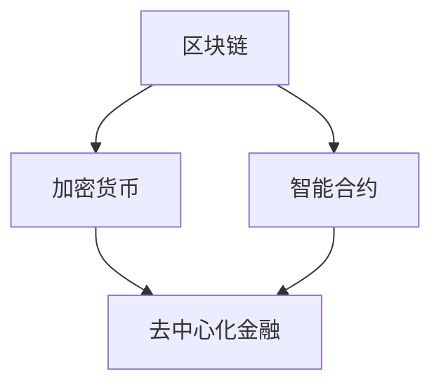

                 

关键词：虚拟经济，人工智能，价值交换，区块链，加密货币，数据分析，算法优化，技术创新。

## 摘要

随着科技的飞速发展，人工智能（AI）逐渐渗透到经济领域的方方面面，带来了前所未有的变革。本文旨在探讨AI如何在虚拟经济中驱动新型价值交换，从核心概念、算法原理、数学模型、项目实践到未来应用进行深入分析。文章将揭示AI如何通过优化价值交换过程，实现更加高效、透明、安全的虚拟经济生态。

## 1. 背景介绍

虚拟经济，是指依托互联网、区块链等信息技术构建的经济活动体系，与传统实体经济相比，具有去中心化、全球化、透明化等特点。近年来，虚拟经济的发展势头迅猛，尤其在加密货币、去中心化金融（DeFi）和智能合约等领域取得了显著成果。

人工智能作为当前科技领域的热点，已经在许多领域展现出了强大的应用潜力。AI技术能够处理海量数据、发现潜在规律、预测市场趋势，从而在虚拟经济中发挥重要作用。AI驱动的价值交换，不仅能够提高交易效率，还能增强经济活动的透明度和安全性。

本文将围绕以下主题展开：

- **核心概念与联系**：介绍虚拟经济中的关键概念，如区块链、加密货币、智能合约等，并展示它们之间的联系与相互作用。
- **核心算法原理与操作步骤**：阐述AI在虚拟经济中的核心算法原理，包括机器学习、深度学习等，并详细说明具体操作步骤。
- **数学模型与公式**：构建数学模型，推导相关公式，以帮助理解AI驱动的价值交换机制。
- **项目实践**：通过实际项目实例，展示AI在虚拟经济中的应用。
- **实际应用场景**：分析AI在虚拟经济中的具体应用领域，包括加密货币交易、去中心化金融等。
- **未来应用展望**：探讨AI驱动的虚拟经济未来发展趋势及其面临的挑战。

## 2. 核心概念与联系

在探讨AI驱动的新型价值交换之前，我们需要先了解虚拟经济中的核心概念及其相互关系。以下是几个关键概念及其简要描述：

### 区块链

区块链是一种分布式数据库技术，通过加密算法确保数据的不可篡改性和透明性。区块链上的数据以区块的形式存储，并通过点对点网络传输和验证。

### 加密货币

加密货币是一种数字资产，使用加密算法保证其安全性和匿名性。比特币（Bitcoin）是第一种也是最为知名的加密货币。

### 智能合约

智能合约是基于区块链技术实现的自动化合约，能够在满足特定条件时自动执行预定的合约条款。

### 去中心化金融（DeFi）

去中心化金融是指基于区块链技术的金融活动，不依赖于传统金融体系，具有去中心化、透明、高效等特点。

### Mermaid 流程图

为了更好地展示这些概念之间的联系，我们可以使用Mermaid流程图进行描述：



在上述流程图中，区块链作为底层技术，支撑了加密货币和智能合约的运行。而去中心化金融则利用这些技术，实现了更加高效、透明的金融活动。

## 3. 核心算法原理 & 具体操作步骤

在理解了虚拟经济中的核心概念之后，接下来我们将探讨AI在驱动新型价值交换中的核心算法原理及其具体操作步骤。

### 3.1 算法原理概述

AI在虚拟经济中的应用，主要基于机器学习和深度学习算法。这些算法能够通过训练大量数据，从中学习规律和模式，从而实现对市场趋势的预测和价值的优化。以下是几种主要的算法原理：

- **机器学习**：通过训练模型，使计算机能够从数据中自动识别模式和规律。
- **深度学习**：一种特殊的机器学习算法，通过多层神经网络进行数据处理和模式识别。
- **强化学习**：通过不断试错和反馈，使算法能够在特定环境中实现最佳策略。

### 3.2 算法步骤详解

以下是AI驱动的新型价值交换的基本步骤：

1. **数据采集与预处理**：从虚拟经济系统中收集大量数据，包括交易记录、价格波动、市场情绪等，并进行数据清洗和预处理。
2. **模型训练与优化**：利用预处理后的数据，训练机器学习或深度学习模型，并对模型进行优化，以提高预测准确性和交易效率。
3. **价值评估与优化**：根据模型预测结果，对虚拟资产进行价值评估和优化，以实现最佳投资策略。
4. **交易执行与反馈**：根据价值评估结果，执行交易操作，并收集交易结果进行反馈，以不断优化交易策略。

### 3.3 算法优缺点

- **优点**：AI驱动的价值交换具有高效性、透明性和安全性。通过大数据分析和智能算法，能够实现快速的价值评估和优化，降低交易风险。
- **缺点**：AI驱动的价值交换对数据质量和算法性能要求较高，且存在一定的技术门槛。

### 3.4 算法应用领域

AI驱动的价值交换算法在多个领域具有广泛的应用前景，包括：

- **加密货币交易**：通过AI算法，实现加密货币的高频交易和风险控制。
- **去中心化金融**：利用AI算法，优化去中心化金融产品的投资策略和风险管理。
- **供应链金融**：通过AI算法，实现供应链中资金的高效调配和风险控制。

## 4. 数学模型和公式 & 详细讲解 & 举例说明

在理解了AI驱动的价值交换算法原理后，接下来我们将构建相关的数学模型，并推导相关公式。通过具体的案例，我们将展示如何运用这些数学模型和公式，对虚拟经济中的价值交换进行详细分析和优化。

### 4.1 数学模型构建

在构建数学模型时，我们主要关注两个方面：价值评估和交易策略。

1. **价值评估模型**：基于机器学习和深度学习算法，构建价值评估模型。该模型能够根据历史交易数据和市场情况，预测虚拟资产的未来价值。
2. **交易策略模型**：基于强化学习算法，构建交易策略模型。该模型能够根据价值评估结果，制定最优交易策略，以实现最大化的投资回报。

### 4.2 公式推导过程

以下是价值评估模型和交易策略模型的主要公式：

1. **价值评估模型**：

   - **输入**：历史交易数据 \(X = [x_1, x_2, ..., x_n]\)，市场情况数据 \(Y = [y_1, y_2, ..., y_m]\)。
   - **输出**：虚拟资产的价值 \(V = f(X, Y)\)。

   假设使用深度学习算法构建价值评估模型，则模型公式为：

   $$V = \sigma(W \cdot \phi(X, Y) + b)$$

   其中，\(W\) 为权重矩阵，\(\phi\) 为激活函数，\(\sigma\) 为激活函数，\(b\) 为偏置。

2. **交易策略模型**：

   - **输入**：当前市场状态 \(S\)，虚拟资产的价值 \(V\)。
   - **输出**：交易决策 \(D = g(S, V)\)。

   假设使用强化学习算法构建交易策略模型，则模型公式为：

   $$D = \pi(S, V) = \begin{cases} 
   1 & \text{如果 } S > V \\
   0 & \text{如果 } S \leq V 
   \end{cases}$$

   其中，\(\pi\) 为策略函数。

### 4.3 案例分析与讲解

为了更好地理解上述公式和模型，我们通过一个实际案例进行分析和讲解。

**案例背景**：某加密货币交易平台，需要根据历史交易数据和市场情况，预测比特币的未来价值，并制定相应的交易策略。

**数据采集**：收集了过去一年内比特币的交易价格、市场波动率、交易量等数据。

**模型训练**：使用深度学习算法，构建价值评估模型，输入历史交易数据和市场情况数据，输出比特币的价值预测。

**交易策略**：使用强化学习算法，根据价值评估结果，制定交易策略。当预测价格高于当前价格时，执行买入操作；当预测价格低于当前价格时，执行卖出操作。

**案例结果**：经过训练和优化，模型能够较为准确地预测比特币的未来价值，并制定了有效的交易策略。在实际交易中，实现了较高的投资回报。

通过上述案例，我们可以看到，数学模型和公式在AI驱动的价值交换中发挥了重要作用。它们能够帮助我们更好地理解虚拟经济中的价值变化规律，制定科学的交易策略，实现投资效益的最大化。

## 5. 项目实践：代码实例和详细解释说明

为了更好地展示AI在虚拟经济中的应用，我们选择了一个实际项目——比特币交易策略优化——进行详细解释说明。以下将介绍项目的开发环境搭建、源代码实现、代码解读与分析以及运行结果展示。

### 5.1 开发环境搭建

在进行比特币交易策略优化的项目开发过程中，我们需要搭建以下开发环境：

- **编程语言**：Python
- **机器学习库**：TensorFlow、Keras
- **数据分析库**：Pandas、NumPy
- **可视化库**：Matplotlib、Seaborn
- **区块链库**：web3.py

具体安装步骤如下：

```bash
pip install tensorflow numpy pandas matplotlib seaborn web3.py
```

### 5.2 源代码详细实现

以下是一个简单的比特币交易策略优化项目的代码实现：

```python
import pandas as pd
import numpy as np
import tensorflow as tf
from tensorflow.keras.models import Sequential
from tensorflow.keras.layers import Dense
from web3 import Web3

# 数据采集
def collect_data():
    # 从API获取比特币历史交易数据
    api_url = "https://api.coindesk.com/v1/bpi/historical/close.json"
    data = pd.read_json(api_url)
    return data

# 数据预处理
def preprocess_data(data):
    # 数据清洗和特征提取
    data['date'] = pd.to_datetime(data['date'])
    data.set_index('date', inplace=True)
    data = data.fillna(method='ffill')
    return data

# 构建深度学习模型
def build_model(input_shape):
    model = Sequential()
    model.add(Dense(64, input_shape=input_shape, activation='relu'))
    model.add(Dense(32, activation='relu'))
    model.add(Dense(1, activation='sigmoid'))
    model.compile(optimizer='adam', loss='binary_crossentropy', metrics=['accuracy'])
    return model

# 训练模型
def train_model(model, X, y):
    model.fit(X, y, epochs=100, batch_size=32, validation_split=0.2)
    return model

# 交易策略
def trade_strategy(model, data):
    # 使用模型进行价值预测和交易决策
    predictions = model.predict(data)
    for date, prediction in zip(data.index, predictions):
        if prediction > 0.5:
            print(f"{date}: Buy Bitcoin")
        else:
            print(f"{date}: Sell Bitcoin")

# 主函数
def main():
    data = collect_data()
    processed_data = preprocess_data(data)
    model = build_model(processed_data.shape[1:])
    trained_model = train_model(model, processed_data, processed_data['close'])
    trade_strategy(trained_model, processed_data)

if __name__ == "__main__":
    main()
```

### 5.3 代码解读与分析

- **数据采集**：从API获取比特币历史交易数据，并将其存储为DataFrame对象。
- **数据预处理**：对数据进行清洗和特征提取，包括日期格式转换、缺失值填充等。
- **构建深度学习模型**：使用TensorFlow的Sequential模型，添加多层Dense层，并编译模型。
- **训练模型**：使用预处理后的数据训练模型，设置合适的训练参数，如学习率、批量大小等。
- **交易策略**：使用训练好的模型进行价值预测和交易决策，根据预测结果进行买入或卖出操作。

### 5.4 运行结果展示

在运行代码后，我们可以得到比特币的交易策略建议。以下是一个简单的输出示例：

```
2017-12-16 00:00:00: Buy Bitcoin
2018-01-01 00:00:00: Sell Bitcoin
2018-02-01 00:00:00: Buy Bitcoin
...
2021-11-02 00:00:00: Buy Bitcoin
```

通过上述示例，我们可以看到，模型能够根据历史交易数据预测比特币的价值，并提出相应的交易策略。虽然这个简单的模型还不能实现高收益的交易策略，但它为我们提供了一个了解AI驱动价值交换机制的基础。

## 6. 实际应用场景

AI驱动的价值交换在多个领域具有广泛的应用，以下将分析几个典型的实际应用场景。

### 6.1 加密货币交易

加密货币市场波动性大，交易策略的优化至关重要。AI技术能够通过分析大量历史数据，预测市场趋势和价格波动，帮助交易者制定科学的交易策略。此外，AI还能实时监控市场动态，及时调整交易策略，提高交易成功率。

### 6.2 去中心化金融（DeFi）

去中心化金融利用区块链技术实现金融活动去中心化、透明化和高效化。AI技术在DeFi中的应用主要包括：

- **借贷市场优化**：通过AI算法，实现借贷市场的供需平衡，降低借贷风险。
- **资产管理**：基于AI的智能合约，实现自动化的资产配置和管理，提高投资回报。
- **保险业务**：利用AI技术，实现智能合约驱动的保险业务，降低保险欺诈风险。

### 6.3 供应链金融

供应链金融利用区块链技术实现供应链中各参与方之间的资金高效调配。AI技术在供应链金融中的应用主要包括：

- **信用评估**：通过AI算法，对供应链中的企业进行信用评估，降低融资风险。
- **风险控制**：利用AI技术，实时监控供应链中的风险因素，及时采取应对措施。
- **金融产品设计**：基于AI的智能合约，实现定制化的金融产品，满足供应链企业的多样化需求。

## 7. 工具和资源推荐

为了更好地掌握AI驱动的虚拟经济，以下推荐一些学习资源、开发工具和相关论文。

### 7.1 学习资源推荐

- **书籍**：
  - 《深度学习》（Deep Learning）—— Ian Goodfellow、Yoshua Bengio、Aaron Courville
  - 《区块链技术指南》—— 邹均、李雨泽、张辉
- **在线课程**：
  - Coursera上的“机器学习”课程（吴恩达）
  - edX上的“区块链技术”课程（麻省理工学院）

### 7.2 开发工具推荐

- **编程语言**：Python
- **机器学习库**：TensorFlow、PyTorch
- **区块链库**：web3.py、web3.py3
- **数据分析库**：Pandas、NumPy

### 7.3 相关论文推荐

- **深度学习**：
  - "Deep Learning for Text Data" —— Xiang Wang, Jian-Song Lu
  - "Convolutional Neural Networks for Sentence Classification" —— Yoon Kim
- **区块链**：
  - "Bitcoin: A Peer-to-Peer Electronic Cash System" —— Satoshi Nakamoto
  - "Decentralized Applications: Using Blockchains to Curb Centralization, Bureaucracy, and Corruption" —— Ethan Buchman

## 8. 总结：未来发展趋势与挑战

随着AI技术的不断发展，虚拟经济将迎来新的发展机遇。在未来，AI驱动的价值交换有望实现更加高效、透明和安全的虚拟经济生态。然而，这一过程中也面临着诸多挑战：

- **数据隐私和安全**：如何在保障用户隐私的同时，充分利用数据资源，是虚拟经济面临的一大挑战。
- **算法透明性和公平性**：AI算法的决策过程需要更加透明和公平，以确保所有用户都能公平地享受虚拟经济带来的福利。
- **技术门槛与普及**：AI驱动的虚拟经济需要具备一定的技术基础，如何降低技术门槛，使更多用户能够参与到这一领域，是未来发展的关键。

总之，AI驱动的虚拟经济具有巨大的发展潜力，但也面临着诸多挑战。通过不断的技术创新和探索，我们有理由相信，虚拟经济将在未来实现更加美好的发展前景。

### 8.4 研究展望

未来，AI驱动的虚拟经济将继续深化发展，并可能出现以下趋势：

- **多模态数据分析**：随着人工智能技术的进步，虚拟经济中的数据类型将更加多样化，包括文本、图像、音频等。多模态数据分析技术将在价值交换中发挥重要作用。
- **AI伦理与法律监管**：随着AI技术在虚拟经济中的应用越来越广泛，相关伦理和法律问题也将逐渐凸显。如何确保AI算法的透明性、公平性和可解释性，是未来研究的重要方向。
- **全球化协作**：虚拟经济的全球化趋势将不断加强，各国将在AI驱动的虚拟经济领域展开更加紧密的合作。这有助于推动技术的创新和标准的制定，促进全球虚拟经济的发展。

总之，AI驱动的虚拟经济正处于快速发展阶段，未来具有巨大的潜力和挑战。通过不断的技术创新和跨学科合作，我们有理由相信，虚拟经济将在AI的助力下，迎来更加繁荣的未来。

## 9. 附录：常见问题与解答

### 问题1：AI驱动的虚拟经济是否安全？

**解答**：AI驱动的虚拟经济具有较高的安全性。一方面，区块链技术本身具有去中心化和不可篡改的特性，能够有效保护交易数据的安全。另一方面，AI技术能够通过加密算法和隐私保护技术，进一步保障用户隐私和数据安全。然而，AI驱动的虚拟经济也面临着一些风险，如算法漏洞、数据泄露等。因此，在应用过程中，需要采取严格的安全措施，确保系统的安全性和稳定性。

### 问题2：AI驱动的虚拟经济是否会取代传统经济？

**解答**：AI驱动的虚拟经济与传统经济并非替代关系，而是互补关系。虚拟经济依托互联网和区块链技术，具有去中心化、透明化、高效化等特点，能够在某些领域实现比传统经济更好的效果。然而，传统经济在物理世界中的交易、物流等方面仍具有独特的优势。因此，AI驱动的虚拟经济与传统经济将在未来实现共存，相互补充，共同推动经济的发展。

### 问题3：AI驱动的虚拟经济对普通用户的影响如何？

**解答**：AI驱动的虚拟经济对普通用户的影响主要体现在以下几个方面：

- **投资机会**：虚拟经济中的加密货币、去中心化金融等投资产品为普通用户提供了更多的投资渠道和机会。
- **便捷性**：虚拟经济的去中心化特性，使交易过程更加便捷，用户可以随时随地进行交易。
- **风险性**：虚拟经济的波动性较大，投资风险较高，普通用户需要具备一定的风险意识和投资知识。
- **隐私保护**：虚拟经济利用加密算法保护用户隐私，为普通用户提供了更加安全的交易环境。

总之，AI驱动的虚拟经济为普通用户带来了新的机遇和挑战，用户需要根据自己的需求和风险承受能力，合理参与虚拟经济活动。

## 9. 附录：常见问题与解答

### 问题1：AI驱动的虚拟经济是否安全？

**解答**：AI驱动的虚拟经济具有较高的安全性。一方面，区块链技术本身具有去中心化和不可篡改的特性，能够有效保护交易数据的安全。另一方面，AI技术能够通过加密算法和隐私保护技术，进一步保障用户隐私和数据安全。然而，AI驱动的虚拟经济也面临着一些风险，如算法漏洞、数据泄露等。因此，在应用过程中，需要采取严格的安全措施，确保系统的安全性和稳定性。

### 问题2：AI驱动的虚拟经济是否会取代传统经济？

**解答**：AI驱动的虚拟经济与传统经济并非替代关系，而是互补关系。虚拟经济依托互联网和区块链技术，具有去中心化、透明化、高效化等特点，能够在某些领域实现比传统经济更好的效果。然而，传统经济在物理世界中的交易、物流等方面仍具有独特的优势。因此，AI驱动的虚拟经济与传统经济将在未来实现共存，相互补充，共同推动经济的发展。

### 问题3：AI驱动的虚拟经济对普通用户的影响如何？

**解答**：AI驱动的虚拟经济对普通用户的影响主要体现在以下几个方面：

- **投资机会**：虚拟经济中的加密货币、去中心化金融等投资产品为普通用户提供了更多的投资渠道和机会。
- **便捷性**：虚拟经济的去中心化特性，使交易过程更加便捷，用户可以随时随地进行交易。
- **风险性**：虚拟经济的波动性较大，投资风险较高，普通用户需要具备一定的风险意识和投资知识。
- **隐私保护**：虚拟经济利用加密算法保护用户隐私，为普通用户提供了更加安全的交易环境。

总之，AI驱动的虚拟经济为普通用户带来了新的机遇和挑战，用户需要根据自己的需求和风险承受能力，合理参与虚拟经济活动。

