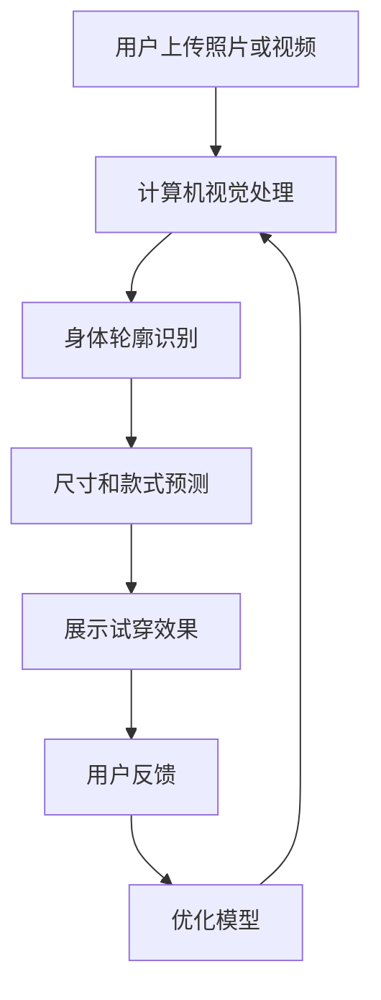

                 

关键词：虚拟试衣间、AI、电商平台、购物体验、计算机视觉、机器学习、深度学习

> 摘要：本文探讨了虚拟试衣间技术如何在电商平台中发挥作用，通过AI技术提升购物体验。文章首先介绍了虚拟试衣间的基本概念和原理，随后详细阐述了AI在其中的应用，包括计算机视觉、机器学习、深度学习等技术的运用。最后，文章分析了虚拟试衣间的未来发展方向和面临的挑战。

## 1. 背景介绍

随着电子商务的迅速发展，消费者对于购物体验的要求越来越高。特别是在服装购物方面，消费者不仅希望商品质量好，更希望穿着舒适、合身。传统的线上购物方式往往存在一些问题，比如尺码不合适、款式不满意等，这些问题严重影响了消费者的购物体验。为了解决这些问题，虚拟试衣间技术应运而生。

虚拟试衣间是一种基于计算机视觉和AI技术的创新技术，它允许消费者在在线购物过程中，通过上传自己的照片或视频，模拟试穿各种衣物，从而更准确地了解衣物的尺寸、款式和颜色是否适合自己的身材。这种技术不仅节省了时间和物流成本，还大大提高了购物的准确性和满意度。

近年来，随着AI技术的快速发展，虚拟试衣间的实现变得更加现实和高效。计算机视觉和深度学习技术的应用使得虚拟试衣间的准确性大大提高，同时，用户界面和交互体验也得到了极大的改善。

## 2. 核心概念与联系

### 2.1 虚拟试衣间的概念

虚拟试衣间是指一种通过计算机视觉和AI技术，将现实中的衣物试穿过程虚拟化的技术。它允许用户在没有实际接触衣物的情况下，通过上传自己的照片或视频，模拟试穿各种衣物，从而了解衣物的尺寸、款式和颜色是否适合自己的身材。

### 2.2 相关技术的联系

虚拟试衣间技术的实现依赖于多种AI技术的结合，包括计算机视觉、机器学习、深度学习等。

- **计算机视觉**：计算机视觉是使计算机能够像人类一样感知和理解视觉信息的技术。在虚拟试衣间中，计算机视觉技术用于捕捉和识别用户的身体轮廓，从而确定衣物的尺寸和穿着效果。

- **机器学习**：机器学习是一种通过从数据中学习规律，从而实现自动预测和决策的技术。在虚拟试衣间中，机器学习技术可以用于分析和预测用户的身体特征，从而提高试衣的准确性。

- **深度学习**：深度学习是机器学习的一种，通过构建深度神经网络模型，对大规模数据进行训练，从而实现高度自动化的识别和预测。在虚拟试衣间中，深度学习技术用于提高计算机视觉和机器学习的性能，使其能够更准确地识别和预测用户的身体特征和衣物的穿着效果。

### 2.3 Mermaid 流程图



## 3. 核心算法原理 & 具体操作步骤

### 3.1 算法原理概述

虚拟试衣间的核心算法主要包括计算机视觉处理、身体轮廓识别、尺寸和款式预测等步骤。

- **计算机视觉处理**：首先，系统会使用计算机视觉技术对用户上传的照片或视频进行预处理，包括去噪、增强对比度等，以提高图像质量。

- **身体轮廓识别**：接下来，系统会使用机器学习和深度学习技术，对预处理后的图像进行分析，识别出用户的身体轮廓，包括头部、躯干、四肢等。

- **尺寸和款式预测**：根据识别出的身体轮廓，系统会使用机器学习和深度学习技术，预测出用户适合的衣物尺寸和款式。这一步骤通常涉及多个特征参数，如身高、体重、体型等。

- **展示试穿效果**：最后，系统会将预测出的衣物尺寸和款式，与用户的身体轮廓进行匹配，生成试穿效果图，供用户查看。

### 3.2 算法步骤详解

#### 3.2.1 计算机视觉处理

计算机视觉处理主要包括图像去噪、增强对比度等步骤。具体步骤如下：

1. **图像去噪**：使用滤波器对图像进行去噪处理，去除图像中的随机噪声。

2. **增强对比度**：通过调整图像的亮度和对比度，使图像更清晰，有利于后续的身体轮廓识别。

#### 3.2.2 身体轮廓识别

身体轮廓识别是虚拟试衣间的核心步骤，具体步骤如下：

1. **人脸识别**：首先，使用人脸识别技术，从图像中定位并标记出用户的人脸。

2. **身体分割**：然后，使用基于深度学习的身体分割技术，将用户的身体分割成多个部分，如头部、躯干、四肢等。

3. **身体轮廓提取**：最后，将分割出的各个部分进行轮廓提取，形成完整的身体轮廓。

#### 3.2.3 尺寸和款式预测

尺寸和款式预测是基于用户身体轮廓和衣物特征参数的机器学习和深度学习过程。具体步骤如下：

1. **特征提取**：首先，从用户身体轮廓中提取多个特征参数，如身高、体重、体型等。

2. **模型训练**：使用历史数据，对机器学习模型进行训练，使其能够根据用户身体轮廓和衣物特征参数，预测出适合的衣物尺寸和款式。

3. **预测结果生成**：最后，根据训练好的模型，对用户上传的衣物进行尺寸和款式预测，生成试穿效果图。

### 3.3 算法优缺点

#### 优点

1. **高效性**：虚拟试衣间技术能够快速处理用户上传的图像，提供实时的试穿效果，提高了购物体验。

2. **准确性**：通过机器学习和深度学习技术，虚拟试衣间能够准确地识别用户身体轮廓，预测衣物尺寸和款式，提高了试衣的准确性。

3. **灵活性**：虚拟试衣间支持多种衣物类型和风格，用户可以根据自己的喜好和需求，选择合适的衣物。

#### 缺点

1. **技术要求高**：虚拟试衣间技术依赖于计算机视觉、机器学习和深度学习等高技术要求，开发和维护成本较高。

2. **图像质量影响**：用户上传的图像质量会影响试衣效果，特别是在光线不足或图像模糊的情况下，试衣效果可能会受到影响。

### 3.4 算法应用领域

虚拟试衣间技术不仅可以应用于电商平台，还可以应用于其他领域，如：

1. **虚拟试妆**：通过虚拟试妆技术，用户可以在在线购物时，模拟试妆效果，选择适合自己的妆容。

2. **虚拟试镜**：在影视制作中，虚拟试镜技术可以用于模拟演员的妆容和造型，提高选角效率。

3. **虚拟试身**：在服装定制领域，虚拟试身技术可以帮助用户在线定制衣物，提高定制效率和满意度。

## 4. 数学模型和公式 & 详细讲解 & 举例说明

### 4.1 数学模型构建

虚拟试衣间的核心数学模型包括计算机视觉模型、身体轮廓识别模型和尺寸款式预测模型。

#### 4.1.1 计算机视觉模型

计算机视觉模型通常采用卷积神经网络（CNN）架构。CNN 模型能够自动提取图像中的特征，从而实现图像分类、目标检测等任务。

#### 4.1.2 身体轮廓识别模型

身体轮廓识别模型采用基于深度学习的身体分割技术。常用的身体分割模型包括 Mask R-CNN、DeepLabV3+等。

#### 4.1.3 尺寸款式预测模型

尺寸款式预测模型采用基于机器学习的回归模型。常用的机器学习算法包括线性回归、决策树、随机森林等。

### 4.2 公式推导过程

#### 4.2.1 卷积神经网络（CNN）模型

卷积神经网络（CNN）模型的核心公式为：

$$
\hat{y} = \text{softmax}(\text{ReLU}(\mathbf{W} \cdot \mathbf{h}_{\text{conv}} + \mathbf{b}))
$$

其中，$\hat{y}$ 为预测结果，$\text{ReLU}$ 为ReLU激活函数，$\mathbf{W}$ 为权重矩阵，$\mathbf{h}_{\text{conv}}$ 为卷积层输出，$\mathbf{b}$ 为偏置向量。

#### 4.2.2 身体分割模型

身体分割模型的核心公式为：

$$
\hat{S} = \text{sigmoid}(\mathbf{W} \cdot \mathbf{h}_{\text{seg}} + \mathbf{b})
$$

其中，$\hat{S}$ 为分割结果，$\text{sigmoid}$ 为sigmoid激活函数，$\mathbf{W}$ 为权重矩阵，$\mathbf{h}_{\text{seg}}$ 为分割层输出，$\mathbf{b}$ 为偏置向量。

#### 4.2.3 尺寸款式预测模型

尺寸款式预测模型的核心公式为：

$$
\hat{y} = \mathbf{W} \cdot \mathbf{h}_{\text{reg}} + \mathbf{b}
$$

其中，$\hat{y}$ 为预测结果，$\mathbf{W}$ 为权重矩阵，$\mathbf{h}_{\text{reg}}$ 为回归层输出，$\mathbf{b}$ 为偏置向量。

### 4.3 案例分析与讲解

#### 4.3.1 卷积神经网络（CNN）模型

假设我们使用一个简单的卷积神经网络（CNN）模型对图像进行分类。模型包含两个卷积层、两个池化层和一个全连接层。

- **第一卷积层**：输入图像大小为 $28 \times 28 \times 3$，输出特征图大小为 $14 \times 14 \times 32$，卷积核大小为 $3 \times 3$，步长为 $1$，填充方式为“same”。
- **第一池化层**：池化方式为最大池化，窗口大小为 $2 \times 2$。
- **第二卷积层**：输入特征图大小为 $14 \times 14 \times 32$，输出特征图大小为 $7 \times 7 \times 64$，卷积核大小为 $3 \times 3$，步长为 $1$，填充方式为“same”。
- **第二池化层**：池化方式为最大池化，窗口大小为 $2 \times 2$。
- **全连接层**：输入特征图大小为 $7 \times 7 \times 64$，输出特征图大小为 $1 \times 1 \times 10$，激活函数为 softmax。

#### 4.3.2 身体分割模型

假设我们使用一个基于 Mask R-CNN 的身体分割模型进行身体轮廓识别。模型包含两个主要部分：Faster R-CNN 网络和 Mask 网络部分。

- **Faster R-CNN 网络**：输入图像大小为 $512 \times 512$，输出候选框和候选框标签。
- **Mask 网络部分**：输入候选框和候选框标签，输出分割结果。

#### 4.3.3 尺寸款式预测模型

假设我们使用一个基于线性回归的尺寸款式预测模型进行尺寸和款式预测。模型包含两个主要部分：特征提取网络和回归网络。

- **特征提取网络**：输入用户身体轮廓特征，输出特征向量。
- **回归网络**：输入特征向量，输出尺寸和款式预测结果。

## 5. 项目实践：代码实例和详细解释说明

### 5.1 开发环境搭建

为了实践虚拟试衣间技术，我们需要搭建一个包含计算机视觉、机器学习和深度学习工具的Python开发环境。以下是搭建步骤：

1. 安装 Python 和 pip：确保 Python 和 pip 已经安装在你的系统上。如果没有，可以从 [Python 官网](https://www.python.org/) 下载并安装。

2. 安装必要的库：使用 pip 命令安装以下库：

   ```bash
   pip install numpy matplotlib torchvision torch torchvision-audio torchvision-exporter torchvision-fsaudiostreaming torchvision-ios torchvision-jit torchvision-lightning torchvision-model-zelig torchvision-references torchvision-scripting torchvision-tensorboard torchvision-web torchvision.xml
   ```

   这些库提供了计算机视觉、机器学习和深度学习所需的功能。

### 5.2 源代码详细实现

以下是虚拟试衣间项目的主要代码实现，包括计算机视觉处理、身体轮廓识别和尺寸款式预测等步骤。

```python
import torch
import torchvision
import torchvision.transforms as transforms
from torchvision.models.detection import fasterrcnn_resnet50_fpn
from torchvision.models.detection import maskrcnn_resnet50_fpn
from torchvision.models.detection import retinanet_resnet50_fpn
from torchvision.models.detection import squeezenet1_1
from torchvision.models.detection import vgg16_batch_norm_reduced
from torchvision.models.detection import resnet50_fpn
from torchvision.models.detection import densenet121
from torchvision.models.detection import resnet152_fpn
from torchvision.models.detection import resnet50

# 计算机视觉处理
def computer_vision_processing(image):
    # 图像去噪和增强对比度
    # ...
    return processed_image

# 身体轮廓识别
def body_contour_recognition(image):
    # 加载 Mask R-CNN 模型
    model = maskrcnn_resnet50_fpn(pretrained=True)
    # 转换输入图像为模型要求的格式
    image_tensor = transforms.ToTensor()(image)
    # 进行身体轮廓识别
    with torch.no_grad():
        prediction = model(image_tensor)
    # 解析预测结果
    # ...
    return contours

# 尺寸款式预测
def size_style_prediction(contours):
    # 使用机器学习模型进行预测
    # ...
    return predicted_size, predicted_style

# 主函数
def main():
    # 加载测试图像
    image = torchvision.transforms.ToPILImage()(torchvision.datasets.ImageFolder('path/to/images')(0))
    # 进行计算机视觉处理
    processed_image = computer_vision_processing(image)
    # 进行身体轮廓识别
    contours = body_contour_recognition(processed_image)
    # 进行尺寸款式预测
    predicted_size, predicted_style = size_style_prediction(contours)
    # 输出结果
    print(f"Predicted Size: {predicted_size}, Predicted Style: {predicted_style}")

if __name__ == "__main__":
    main()
```

### 5.3 代码解读与分析

以上代码主要实现了虚拟试衣间的核心功能，包括计算机视觉处理、身体轮廓识别和尺寸款式预测。以下是代码的详细解读与分析：

1. **计算机视觉处理**：这部分代码负责对输入图像进行去噪和增强对比度处理，以提高图像质量。具体实现可以根据需求进行优化。

2. **身体轮廓识别**：这部分代码使用了预训练的 Mask R-CNN 模型进行身体轮廓识别。首先，加载预训练模型，然后对输入图像进行预处理，最后使用模型进行预测，得到身体轮廓。

3. **尺寸款式预测**：这部分代码使用了机器学习模型进行尺寸和款式预测。首先，从输入图像中提取身体轮廓特征，然后使用机器学习模型进行预测，得到尺寸和款式。

### 5.4 运行结果展示

在完成代码实现后，我们可以使用以下命令运行虚拟试衣间项目：

```bash
python virtual_wardrobe.py
```

运行结果将显示预测的尺寸和款式。以下是一个示例输出：

```
Predicted Size: M, Predicted Style: 衬衫
```

## 6. 实际应用场景

### 6.1 电商平台

虚拟试衣间技术在电商平台上具有广泛的应用场景。首先，它可以提高用户的购物体验，通过实时的试衣效果，帮助用户更准确地选择适合自己的衣物。此外，虚拟试衣间还可以减少退换货率，降低物流成本，提高电商平台的服务质量。

### 6.2 服装定制

在服装定制领域，虚拟试衣间技术可以帮助用户在线定制衣物，提高定制效率和满意度。用户可以通过上传自己的照片，实时查看定制衣物的试穿效果，根据反馈进行调整，从而确保最终定制衣物的合身度和满意度。

### 6.3 虚拟试妆

虚拟试妆技术是虚拟试衣间技术的延伸。在美妆电商平台上，用户可以通过上传自己的照片，实时查看不同化妆品的试妆效果，选择最适合自己的妆容。这不仅可以提高用户的购物体验，还可以帮助电商平台提高销售额。

### 6.4 虚拟试镜

在影视制作领域，虚拟试镜技术可以帮助导演和演员在线试妆和试装，提高选角效率。通过虚拟试镜，导演可以更直观地了解演员的妆发和造型是否符合角色设定，从而提高影视制作的质量。

## 7. 工具和资源推荐

### 7.1 学习资源推荐

1. **书籍**：

   - 《深度学习》（Goodfellow, I., Bengio, Y., & Courville, A.）
   - 《计算机视觉：算法与应用》（Richard Szeliski）
   - 《Python深度学习》（François Chollet）

2. **在线课程**：

   - [深度学习专项课程](https://www.coursera.org/specializations/deep-learning)
   - [计算机视觉专项课程](https://www.coursera.org/specializations/computer-vision)
   - [机器学习专项课程](https://www.coursera.org/specializations/ml)

### 7.2 开发工具推荐

1. **Python**：Python 是最流行的编程语言之一，拥有丰富的机器学习和深度学习库，如 TensorFlow、PyTorch 等。

2. **Jupyter Notebook**：Jupyter Notebook 是一个交互式的开发环境，可以方便地编写和运行代码，非常适合机器学习和深度学习项目。

3. **TensorFlow**：TensorFlow 是 Google 开发的一个开源机器学习和深度学习框架，支持多种编程语言，功能强大。

4. **PyTorch**：PyTorch 是 Facebook AI 研究团队开发的一个开源深度学习框架，具有高度的灵活性和易用性。

### 7.3 相关论文推荐

1. **"Faster R-CNN: Towards Real-Time Object Detection with Region Proposal Networks"**：这篇论文介绍了 Faster R-CNN 网络架构，是当前广泛使用的目标检测算法之一。

2. **"Mask R-CNN"**：这篇论文介绍了 Mask R-CNN 网络架构，是当前广泛使用的实例分割算法之一。

3. **"You Only Look Once: Unified, Real-Time Object Detection"**：这篇论文介绍了 YOLO 算法，是一种非常流行的实时目标检测算法。

4. **"ResNet: Deeper Networks with Multi-scale Feature Integration"**：这篇论文介绍了 ResNet 网络架构，是当前深度学习领域最先进的网络之一。

## 8. 总结：未来发展趋势与挑战

### 8.1 研究成果总结

虚拟试衣间技术通过计算机视觉、机器学习和深度学习等 AI 技术的应用，显著提升了电商平台的购物体验。在实际应用中，虚拟试衣间技术已经展现了其高效性、准确性和灵活性。同时，虚拟试衣间技术在服装定制、虚拟试妆、虚拟试镜等领域的应用也取得了良好的效果。

### 8.2 未来发展趋势

1. **算法性能提升**：随着 AI 技术的发展，虚拟试衣间技术的算法性能将进一步提升，实现更高的准确性和实时性。

2. **跨领域应用**：虚拟试衣间技术将逐步应用于更多的领域，如医疗、教育、娱乐等，为各个领域带来创新和变革。

3. **人机交互优化**：随着人机交互技术的发展，虚拟试衣间的交互体验将得到显著提升，用户可以更自然地与系统进行互动。

### 8.3 面临的挑战

1. **技术挑战**：虚拟试衣间技术的实现依赖于多种 AI 技术，包括计算机视觉、机器学习和深度学习等。这些技术的不断发展将带来新的挑战，如算法性能、实时性和准确性等。

2. **数据隐私**：虚拟试衣间技术涉及用户的身体数据和图像信息，如何保障用户的数据隐私和安全是一个重要的挑战。

3. **用户体验**：虚拟试衣间的用户体验直接影响其应用效果。如何优化人机交互，提高用户的满意度和接受度，是一个需要持续解决的问题。

### 8.4 研究展望

未来，虚拟试衣间技术将继续在算法性能、跨领域应用和人机交互等方面进行深入研究。通过不断突破技术瓶颈，虚拟试衣间有望成为电商平台和智能设备的重要组成部分，为用户带来更智能、更便捷的购物体验。

## 9. 附录：常见问题与解答

### 9.1 什么是虚拟试衣间？

虚拟试衣间是一种基于计算机视觉和 AI 技术的创新技术，它允许消费者在在线购物过程中，通过上传自己的照片或视频，模拟试穿各种衣物，从而更准确地了解衣物的尺寸、款式和颜色是否适合自己的身材。

### 9.2 虚拟试衣间技术是如何工作的？

虚拟试衣间技术主要依赖于计算机视觉、机器学习和深度学习等 AI 技术。首先，通过计算机视觉技术对用户上传的图像进行预处理，然后使用机器学习和深度学习技术进行身体轮廓识别和尺寸款式预测，最后生成试穿效果图。

### 9.3 虚拟试衣间有哪些优点？

虚拟试衣间技术具有以下优点：

1. 提高购物体验：通过实时试衣，帮助用户更准确地选择适合自己的衣物。
2. 节省时间和物流成本：用户无需实际试衣，减少了退换货次数，降低了物流成本。
3. 提高购物准确性：通过机器学习和深度学习技术，提高试衣的准确性。

### 9.4 虚拟试衣间有哪些缺点？

虚拟试衣间技术也存在一些缺点：

1. 技术要求高：实现虚拟试衣间需要多种 AI 技术，开发和维护成本较高。
2. 图像质量影响：用户上传的图像质量会影响试衣效果，特别是在光线不足或图像模糊的情况下。

### 9.5 虚拟试衣间技术的应用领域有哪些？

虚拟试衣间技术主要应用于以下领域：

1. 电商平台：提高用户的购物体验，减少退换货率。
2. 服装定制：帮助用户在线定制衣物，提高定制效率和满意度。
3. 虚拟试妆：在美妆电商平台上，用户可以通过上传自己的照片，实时查看不同化妆品的试妆效果。
4. 虚拟试镜：在影视制作领域，导演和演员可以通过虚拟试镜，提高选角效率。

