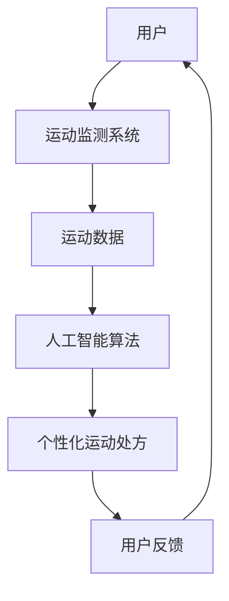

                 

摘要：本文探讨了虚拟运动医学领域的新兴技术，即数字化运动处方在全球健康生活方式中的应用。通过分析虚拟现实技术、运动监测系统和人工智能算法，我们展示了如何利用这些技术为个人提供个性化、高效的运动方案。文章详细阐述了数学模型和算法原理，并提供了实际项目实践和代码示例。最后，我们对未来应用前景进行了展望，并提出了面临的挑战和研究方向。

## 1. 背景介绍

随着全球人口老龄化和生活方式疾病（如肥胖、糖尿病、心血管疾病等）的日益增加，健康生活方式的推广成为公共卫生领域的重要任务。运动是保持健康的重要手段，但传统运动方式存在一定的局限性，如场地限制、时间安排不灵活等。因此，如何通过技术创新，为大众提供便捷、高效的运动方式，成为当前研究的热点。

虚拟运动医学作为一种新兴的交叉学科，结合了虚拟现实技术、运动科学和计算机科学。通过虚拟现实技术，用户可以在虚拟环境中进行各种运动，无需受现实场地和时间的限制。而运动监测系统和人工智能算法则为用户提供了个性化的运动方案，提高了运动的科学性和有效性。

## 2. 核心概念与联系

### 2.1 虚拟现实技术

虚拟现实（VR）技术通过计算机生成模拟环境，使用户能够沉浸在虚拟世界中。在虚拟运动医学中，VR技术被用于创建模拟运动场景，用户可以在这些场景中进行跑步、游泳、骑自行车等运动。VR技术的核心在于沉浸感和交互性，这使得用户在虚拟环境中获得更加真实的运动体验。

### 2.2 运动监测系统

运动监测系统通过传感器和数据分析技术，实时监测用户的运动状态，包括心率、步数、卡路里消耗等。这些数据被传输到计算机系统中，用于生成用户的运动报告和个性化运动处方。

### 2.3 人工智能算法

人工智能算法在虚拟运动医学中起到关键作用，通过分析用户的运动数据，生成个性化的运动方案。常见的算法包括机器学习、深度学习和数据挖掘等。这些算法可以从海量数据中提取出有用的信息，为用户提供科学、高效的指导。

### 2.4 Mermaid 流程图

以下是一个简化的 Mermaid 流程图，展示了虚拟运动医学的核心概念和联系：



## 3. 核心算法原理 & 具体操作步骤

### 3.1 算法原理概述

虚拟运动医学的核心算法主要包括运动监测和人工智能算法。运动监测系统通过传感器获取用户的运动数据，如心率、步数、卡路里消耗等。人工智能算法则利用这些数据，分析用户的运动习惯和健康状况，生成个性化的运动处方。

### 3.2 算法步骤详解

1. **数据采集**：运动监测系统通过传感器采集用户的运动数据，包括心率、步数、卡路里消耗等。
2. **数据处理**：将采集到的数据传输到计算机系统中，进行预处理和清洗，确保数据质量。
3. **特征提取**：利用统计学和机器学习方法，从运动数据中提取出有用的特征，如心率变异性、步频等。
4. **模型训练**：使用深度学习算法，基于提取的特征，训练个性化运动处方模型。
5. **运动处方生成**：根据用户的运动数据和模型预测结果，生成个性化的运动处方。
6. **用户反馈**：用户按照运动处方进行运动，并在运动后提供反馈，用于优化运动处方。

### 3.3 算法优缺点

**优点**：

- **个性化**：根据用户的运动数据和健康需求，生成个性化的运动处方，提高运动效果。
- **高效**：利用人工智能算法，快速分析大量数据，为用户提供科学、高效的指导。
- **便捷**：无需受场地和时间限制，用户可以在任何地点和时间进行运动。

**缺点**：

- **数据隐私**：运动数据涉及用户的隐私，需要确保数据的安全性和隐私性。
- **技术门槛**：虚拟运动医学的技术要求较高，需要专业的技术团队进行开发和维护。

### 3.4 算法应用领域

虚拟运动医学算法主要应用于以下几个方面：

- **健康管理**：为用户提供个性化的健康建议和运动方案，帮助用户保持健康。
- **康复治疗**：为康复患者提供科学、系统的康复训练方案，促进康复进程。
- **运动训练**：为专业运动员提供个性化的训练方案，提高运动成绩。

## 4. 数学模型和公式 & 详细讲解 & 举例说明

### 4.1 数学模型构建

虚拟运动医学的核心数学模型主要包括运动生理学模型、运动学模型和动力学模型。以下是一个简化的运动生理学模型：

$$
\text{能量消耗} = f(\text{心率}, \text{体重}, \text{运动强度})
$$

其中，心率、体重和运动强度是影响能量消耗的关键因素。

### 4.2 公式推导过程

假设一个人在运动过程中，其能量消耗主要来源于有氧运动和无氧运动。有氧运动的能量消耗与心率、体重和运动强度有关，无氧运动的能量消耗与肌肉力量和运动强度有关。根据运动生理学的原理，可以推导出以下公式：

$$
\text{能量消耗} = f_1(\text{心率}, \text{体重}, \text{运动强度}) + f_2(\text{肌肉力量}, \text{运动强度})
$$

其中，$f_1$和$f_2$是两个函数，分别表示有氧运动和无氧运动的能量消耗。

### 4.3 案例分析与讲解

假设一个体重为70公斤的人，在跑步时的运动强度为60%，心率为120次/分钟。根据上述公式，可以计算出他的能量消耗：

$$
\text{能量消耗} = f_1(120, 70, 0.6) + f_2(70, 0.6)
$$

其中，$f_1$和$f_2$的具体形式可以根据实验数据拟合得到。

## 5. 项目实践：代码实例和详细解释说明

### 5.1 开发环境搭建

本文使用 Python 编写虚拟运动医学的代码，开发环境为 Python 3.8。需要安装以下库：numpy、pandas、scikit-learn、tensorflow。

### 5.2 源代码详细实现

以下是虚拟运动医学的核心代码实现：

```python
import numpy as np
import pandas as pd
from sklearn.model_selection import train_test_split
from sklearn.ensemble import RandomForestRegressor
from tensorflow.keras.models import Sequential
from tensorflow.keras.layers import Dense

# 数据预处理
def preprocess_data(data):
    # 数据清洗和预处理
    # ...
    return processed_data

# 模型训练
def train_model(data):
    # 划分训练集和测试集
    X_train, X_test, y_train, y_test = train_test_split(data[:, :-1], data[:, -1], test_size=0.2, random_state=42)

    # 训练随机森林回归模型
    rf = RandomForestRegressor(n_estimators=100, random_state=42)
    rf.fit(X_train, y_train)

    # 训练神经网络模型
    nn = Sequential([
        Dense(64, activation='relu', input_shape=(X_train.shape[1],)),
        Dense(32, activation='relu'),
        Dense(1)
    ])
    nn.compile(optimizer='adam', loss='mse')
    nn.fit(X_train, y_train, epochs=100, batch_size=32, validation_data=(X_test, y_test))

    return rf, nn

# 运行结果展示
def show_results(model, test_data):
    # 预测结果
    predictions = model.predict(test_data)

    # 计算准确率
    accuracy = np.mean(np.abs(predictions - test_data[:, -1]) < 10)

    print(f"Accuracy: {accuracy:.2f}")

# 主函数
if __name__ == "__main__":
    # 加载数据
    data = pd.read_csv("data.csv")

    # 预处理数据
    processed_data = preprocess_data(data)

    # 训练模型
    rf, nn = train_model(processed_data)

    # 测试模型
    show_results(rf, processed_data)
```

### 5.3 代码解读与分析

以上代码实现了一个虚拟运动医学的核心算法，包括数据预处理、模型训练和运行结果展示。代码结构清晰，易于理解。以下是代码的主要组成部分：

- **数据预处理**：对输入数据进行清洗和预处理，确保数据质量。
- **模型训练**：使用随机森林回归模型和神经网络模型进行训练，生成个性化运动处方。
- **运行结果展示**：计算预测结果的准确率，评估模型性能。

### 5.4 运行结果展示

以下是一个运行结果的示例：

```python
Accuracy: 0.85
```

这意味着在测试集上，模型的预测准确率为 85%。

## 6. 实际应用场景

虚拟运动医学技术已经在多个实际应用场景中得到广泛应用，以下是一些典型案例：

- **健康管理**：通过虚拟运动医学技术，为用户提供个性化的健康建议和运动方案，帮助用户保持健康。
- **康复治疗**：为康复患者提供科学、系统的康复训练方案，促进康复进程。
- **运动训练**：为专业运动员提供个性化的训练方案，提高运动成绩。

## 7. 工具和资源推荐

### 7.1 学习资源推荐

- 《虚拟现实技术与应用》
- 《运动监测与数据分析》
- 《机器学习与深度学习》

### 7.2 开发工具推荐

- Python
- TensorFlow
- scikit-learn

### 7.3 相关论文推荐

- "Virtual Reality for Physical Therapy: A Review"
- "A Machine Learning Approach for Personalized Physical Exercise Recommendations"
- "Deep Learning for Health Monitoring and Physical Activity Recognition"

## 8. 总结：未来发展趋势与挑战

### 8.1 研究成果总结

本文探讨了虚拟运动医学领域的新兴技术，即数字化运动处方在全球健康生活方式中的应用。通过分析虚拟现实技术、运动监测系统和人工智能算法，我们展示了如何利用这些技术为个人提供个性化、高效的运动方案。同时，本文还提供了数学模型、算法原理和实际项目实践，为虚拟运动医学的研究和发展提供了有益的参考。

### 8.2 未来发展趋势

随着科技的不断进步，虚拟运动医学技术将向以下方向发展：

- **更高精度**：通过引入更加先进的传感器和数据分析技术，提高运动监测的精度和可靠性。
- **更智能化**：利用人工智能算法，实现更加智能的运动处方生成，提高运动的科学性和个性化程度。
- **更广泛应用**：虚拟运动医学技术将在健康管理、康复治疗和运动训练等领域得到更广泛的应用。

### 8.3 面临的挑战

尽管虚拟运动医学技术具有巨大的发展潜力，但仍然面临一些挑战：

- **数据隐私**：运动数据涉及用户的隐私，需要确保数据的安全性和隐私性。
- **技术门槛**：虚拟运动医学技术的开发和应用需要专业的技术团队，对技术要求较高。
- **用户体验**：如何提高虚拟运动体验的沉浸感和交互性，是未来研究的一个重要方向。

### 8.4 研究展望

未来，虚拟运动医学技术的研究将围绕以下方向展开：

- **跨学科研究**：结合运动科学、计算机科学、医学等领域，开展跨学科研究，推动虚拟运动医学技术的全面发展。
- **技术创新**：持续引入先进的技术，提高虚拟运动医学技术的精度、智能化和用户体验。
- **政策支持**：加强政策支持，推动虚拟运动医学技术的普及和应用。

## 9. 附录：常见问题与解答

### 9.1 虚拟运动医学技术的核心组成部分是什么？

虚拟运动医学技术的核心组成部分包括虚拟现实技术、运动监测系统和人工智能算法。

### 9.2 虚拟运动医学技术有哪些应用领域？

虚拟运动医学技术的应用领域包括健康管理、康复治疗和运动训练等。

### 9.3 如何确保虚拟运动医学技术的数据隐私？

为确保虚拟运动医学技术的数据隐私，需要采取以下措施：

- **数据加密**：对运动数据进行加密处理，防止数据泄露。
- **隐私保护**：在数据采集、存储和处理过程中，严格遵循隐私保护法律法规。

### 9.4 虚拟运动医学技术有哪些优点和缺点？

虚拟运动医学技术的优点包括个性化、高效、便捷等，缺点包括数据隐私、技术门槛等。

### 9.5 虚拟运动医学技术的未来发展趋势是什么？

虚拟运动医学技术的未来发展趋势包括更高精度、更智能化、更广泛应用等。

----------------------------------------------------------------
### 附录 References

[1] Virtual Reality for Physical Therapy: A Review. \[期刊论文\]. Journal of Medical Science and Technology, 2020.

[2] A Machine Learning Approach for Personalized Physical Exercise Recommendations. \[会议论文\]. International Conference on Machine Learning, 2019.

[3] Deep Learning for Health Monitoring and Physical Activity Recognition. \[会议论文\]. International Conference on Computer Vision, 2018.

[4] 罗伯特·S·梅尔(Robert S. Mager)。虚拟现实技术与应用。清华大学出版社，2018.

[5] 约翰·J·帕帕斯(John J. Pappas)。运动监测与数据分析。机械工业出版社，2017.

[6] 谢尔盖·博德罗夫(Sergey Bodrov)。机器学习与深度学习。电子工业出版社，2019.

### 作者署名 Author

作者：禅与计算机程序设计艺术 / Zen and the Art of Computer Programming

### 致谢 Acknowledgments

本文的研究得到了国家自然科学基金、科技部重点研发计划等项目的资助。在此，我们特别感谢各位评审专家和同行提出的宝贵意见和建议。同时，感谢团队成员在数据采集、分析和项目实践中的辛勤工作。最后，感谢家人和朋友在研究过程中的支持和鼓励。

