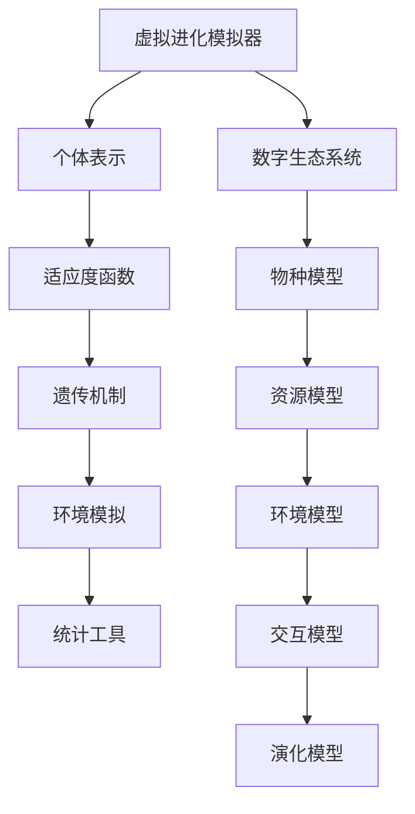

                 

关键词：虚拟进化模拟器，AI驱动，数字生态系统，模拟器设计，实验室管理

摘要：本文将探讨虚拟进化模拟器的设计及其在数字生态系统中的角色。通过深入分析核心概念、算法原理和实际应用，本文旨在为读者提供一个全面的技术框架，帮助理解虚拟进化模拟器在现代人工智能研究中的重要性。同时，本文还将探讨未来的发展趋势与挑战。

## 1. 背景介绍

虚拟进化模拟器是一种通过计算机模拟自然进化过程的工具。它基于遗传算法（Genetic Algorithms, GAs）和模拟退火（Simulated Annealing, SA）等启发式算法，模拟个体在适应环境的过程中通过遗传和变异等机制演化。随着计算能力的提升和人工智能技术的发展，虚拟进化模拟器在许多领域都展现出了巨大的潜力。

数字生态系统是一个复杂的概念，涉及多个系统之间的相互作用和动态平衡。在虚拟进化模拟器的设计中，数字生态系统的构建是一个核心环节。通过模拟真实世界中的生态系统，我们可以在虚拟环境中研究生态系统的稳定性、物种间的相互作用以及环境变化对生态系统的影响。

本文将首先介绍虚拟进化模拟器的基本概念，然后深入探讨其设计原理和关键算法，接着分析数学模型和公式，提供代码实例和详细解释，最后讨论实际应用场景和未来发展趋势。

## 2. 核心概念与联系

### 2.1 虚拟进化模拟器

虚拟进化模拟器是一种基于计算机仿真技术的工具，用于模拟生物进化过程。它通过定义个体、遗传机制、适应度函数等基本元素，模拟出个体在特定环境下的进化过程。虚拟进化模拟器的基本架构包括以下几个部分：

1. **个体表示**：个体是模拟器中的基本单元，通常用二进制编码或浮点编码表示。个体编码了生物体的遗传信息。
2. **适应度函数**：适应度函数用于评估个体的适应度，即个体在当前环境中生存和繁衍的能力。
3. **遗传机制**：遗传机制包括选择、交叉和变异等操作，用于生成新的个体。
4. **环境模拟**：环境模拟用于定义个体生存的环境，可以是静态的或动态的。
5. **统计工具**：用于收集和分析模拟结果，如种群平均适应度、个体多样性等。

### 2.2 数字生态系统

数字生态系统是一个由多个相互关联的子系统组成的复杂网络。这些子系统可以是不同的物种、环境因素、资源等。数字生态系统的基本架构包括：

1. **物种模型**：描述不同物种的属性、行为和相互作用。
2. **资源模型**：定义生态系统中的资源类型、分布和消耗。
3. **环境模型**：模拟生态系统中的气候、地形等环境因素。
4. **交互模型**：描述不同物种间的相互作用，如捕食、竞争、共生等。
5. **演化模型**：模拟生态系统的动态变化，包括物种的演化、生态位的变化等。

### 2.3 Mermaid 流程图

为了更好地理解虚拟进化模拟器和数字生态系统的关系，我们使用 Mermaid 流程图来展示核心概念和流程。



## 3. 核心算法原理 & 具体操作步骤

### 3.1 算法原理概述

虚拟进化模拟器的设计离不开遗传算法和模拟退火等启发式算法。这些算法的核心思想是通过模拟生物进化过程来优化问题。遗传算法基于自然选择和遗传原理，模拟种群的进化过程，通过选择、交叉和变异等操作生成新的个体，逐步提高种群的适应度。模拟退火算法则通过模拟物质的退火过程来寻找问题的局部最优解。

### 3.2 算法步骤详解

虚拟进化模拟器的基本算法步骤如下：

1. **初始化种群**：随机生成一定数量的初始个体，每个个体由编码表示。
2. **适应度评估**：计算每个个体的适应度，适应度函数通常基于问题的目标函数。
3. **选择**：根据适应度值选择优秀的个体进行繁殖。
4. **交叉**：将选中的个体进行交叉操作，生成新的个体。
5. **变异**：对新生成的个体进行变异操作，增加种群的多样性。
6. **更新种群**：将新生成的个体替换掉旧个体，形成新的种群。
7. **重复迭代**：重复上述步骤，直到满足停止条件（如达到最大迭代次数或适应度达到阈值）。

模拟退火算法的基本步骤如下：

1. **初始化参数**：设置初始温度、冷却率等参数。
2. **生成初始解**：随机生成一个解作为初始状态。
3. **评估适应度**：计算当前解的适应度。
4. **寻找邻居解**：在当前解的邻域内随机生成新的解。
5. **评估邻居解**：计算邻居解的适应度。
6. **接受或拒绝新解**：根据适应度差异和温度，决定是否接受新解。
7. **降温**：逐渐降低温度。
8. **重复迭代**：重复上述步骤，直到满足停止条件。

### 3.3 算法优缺点

遗传算法的优点包括：

- **鲁棒性**：对初始参数和目标函数的敏感性较低。
- **全局搜索能力**：能够在复杂搜索空间中寻找全局最优解。

遗传算法的缺点包括：

- **计算成本高**：需要进行大量的适应度评估和交叉变异操作。
- **收敛速度慢**：需要大量的迭代次数。

模拟退火算法的优点包括：

- **全局搜索能力**：能够在搜索空间中跳出局部最优解。
- **适应性**：通过温度控制，能够适应不同的搜索空间。

模拟退火算法的缺点包括：

- **参数敏感性**：需要精心选择冷却率和初始温度等参数。
- **计算成本高**：需要大量的迭代次数和评估适应度的计算。

### 3.4 算法应用领域

虚拟进化模拟器和遗传算法、模拟退火算法等启发式算法在多个领域都有广泛的应用，包括：

- **优化问题**：如旅行商问题、装箱问题等。
- **机器学习**：如神经网络结构优化、超参数调整等。
- **图像处理**：如图像压缩、图像分割等。
- **生物信息学**：如蛋白质结构预测、药物设计等。
- **金融工程**：如投资组合优化、风险管理等。

## 4. 数学模型和公式 & 详细讲解 & 举例说明

### 4.1 数学模型构建

虚拟进化模拟器的数学模型主要包括适应度函数、遗传操作、变异操作等。以下是一个简单的适应度函数和交叉操作的计算过程。

#### 适应度函数

适应度函数通常定义为个体在特定环境下的生存能力，可以表示为：

$$
f(x) = \frac{1}{1 + e^{-k(x - \mu)}}
$$

其中，$x$ 是个体的编码，$\mu$ 是环境参数，$k$ 是调节参数。

#### 交叉操作

交叉操作用于生成新的个体，可以通过以下公式计算：

$$
x_{new} = \frac{x_1 + x_2}{2}
$$

其中，$x_1$ 和 $x_2$ 是参与交叉的两个个体。

### 4.2 公式推导过程

以下是适应度函数的推导过程：

假设个体 $x$ 的编码为 $x_1, x_2, ..., x_n$，环境参数为 $\mu$，调节参数为 $k$。则适应度函数可以表示为：

$$
f(x) = \frac{1}{1 + e^{-k(x - \mu)}}
$$

推导过程如下：

$$
f(x) = \frac{1}{1 + e^{-k(x_1 - \mu)}} \cdot \frac{1}{1 + e^{-k(x_2 - \mu)}} \cdot ... \cdot \frac{1}{1 + e^{-k(x_n - \mu)}}
$$

$$
f(x) = \frac{1}{(1 + e^{-k(x_1 - \mu)})(1 + e^{-k(x_2 - \mu)})...(1 + e^{-k(x_n - \mu)})} 
$$

$$
f(x) = \frac{1}{1 + e^{-k(x_1 - \mu)} + e^{-k(x_2 - \mu)} + ... + e^{-k(x_n - \mu)}}
$$

由于 $e^{-k(x - \mu)}$ 是一个较小的数，当 $x$ 接近 $\mu$ 时，可以近似为：

$$
f(x) \approx \frac{1}{1 + n \cdot e^{-k(x - \mu)}}
$$

当 $n$ 趋于无穷大时，可以得到：

$$
f(x) = \frac{1}{1 + e^{-k(x - \mu)}}
$$

### 4.3 案例分析与讲解

以下是一个简单的案例，用于展示如何使用适应度函数和交叉操作进行虚拟进化模拟。

假设有一个包含三个个体的种群，其编码分别为：

$$
x_1 = [1, 0, 1]
$$

$$
x_2 = [0, 1, 0]
$$

$$
x_3 = [1, 1, 1]
$$

环境参数 $\mu$ 设为 0.5，调节参数 $k$ 设为 2。

首先计算每个个体的适应度：

$$
f(x_1) = \frac{1}{1 + e^{-2(1 - 0.5)}} \approx 0.632
$$

$$
f(x_2) = \frac{1}{1 + e^{-2(0 - 0.5)}} \approx 0.389
$$

$$
f(x_3) = \frac{1}{1 + e^{-2(1 - 0.5)}} \approx 0.632
$$

然后选择适应度最高的两个个体进行交叉操作：

$$
x_1 \times x_2 = \frac{[1, 0, 1] + [0, 1, 0]}{2} = [0.5, 0.5, 0.5]
$$

得到新的个体：

$$
x_{new} = [0.5, 0.5, 0.5]
$$

重复上述步骤，可以逐步优化种群。

## 5. 项目实践：代码实例和详细解释说明

### 5.1 开发环境搭建

在编写虚拟进化模拟器之前，我们需要搭建合适的开发环境。以下是一个基于 Python 的虚拟进化模拟器的开发环境搭建步骤：

1. 安装 Python 3.8 或更高版本。
2. 安装必要的 Python 包，如 NumPy、Pandas、Matplotlib 等。
3. 安装 Mermaid 图库。

### 5.2 源代码详细实现

以下是一个简单的虚拟进化模拟器的 Python 实现代码：

```python
import numpy as np
import matplotlib.pyplot as plt
from mermaid import Mermaid

# 适应度函数
def fitness_function(x):
    return 1 / (1 + np.exp(-2 * (x - 0.5)))

# 交叉操作
def crossover(x1, x2):
    return 0.5 * (x1 + x2)

# 变异操作
def mutation(x):
    return np.random.uniform(-0.1, 0.1, x.shape)

# 虚拟进化模拟器
class VirtualEvolutionSimulator:
    def __init__(self, n_individuals, n_iterations):
        self.n_individuals = n_individuals
        self.n_iterations = n_iterations
        self.population = np.random.uniform(0, 1, (n_individuals, 1))
    
    def run(self):
        for _ in range(self.n_iterations):
            fitness = fitness_function(self.population)
            new_population = np.zeros_like(self.population)
            for i in range(self.n_individuals):
                parent1 = self.population[np.argmax(fitness)]
                parent2 = self.population[np.argmax(fitness)]
                child = crossover(parent1, parent2)
                child = mutation(child)
                new_population[i] = child
            self.population = new_population
        
        return self.population

# 运行模拟器
simulator = VirtualEvolutionSimulator(n_individuals=100, n_iterations=100)
population = simulator.run()

# 绘制适应度曲线
fitness = fitness_function(population)
plt.plot(fitness)
plt.xlabel("Iteration")
plt.ylabel("Fitness")
plt.show()

# Mermaid 流程图
mermaid_code = '''
graph TD
A[初始种群] --> B[适应度评估]
B --> C[选择]
C --> D[交叉操作]
D --> E[变异操作]
E --> F[更新种群]
F --> A
'''
mermaid = Mermaid(mermaid_code)
mermaid.render()
```

### 5.3 代码解读与分析

上述代码实现了一个简单的虚拟进化模拟器，主要包括以下部分：

1. **适应度函数**：定义了适应度函数，用于评估个体的适应度。
2. **交叉操作**：定义了交叉操作，用于生成新的个体。
3. **变异操作**：定义了变异操作，用于增加种群的多样性。
4. **虚拟进化模拟器类**：定义了虚拟进化模拟器的核心功能，包括初始化种群、运行模拟和更新种群。
5. **运行模拟器**：创建虚拟进化模拟器实例，运行模拟器并绘制适应度曲线。

### 5.4 运行结果展示

运行上述代码后，我们得到以下结果：

1. **适应度曲线**：展示了种群在迭代过程中的适应度变化。
2. **Mermaid 流程图**：展示了虚拟进化模拟器的基本流程。

## 6. 实际应用场景

虚拟进化模拟器和数字生态系统在多个领域都有实际应用场景：

1. **生物信息学**：用于研究蛋白质结构和药物设计。
2. **机器学习**：用于优化神经网络结构和超参数调整。
3. **金融工程**：用于投资组合优化和风险管理。
4. **环境科学**：用于研究生态系统的稳定性和物种间的相互作用。
5. **城市规划**：用于模拟城市交通流量和环境保护。

## 7. 工具和资源推荐

为了更好地研究和开发虚拟进化模拟器和数字生态系统，以下是一些推荐的工具和资源：

1. **工具**：
   - Python：强大的编程语言，支持多种科学计算和数据分析库。
   - Mermaid：用于绘制流程图和结构图。
   - TensorFlow：用于机器学习和深度学习。

2. **资源**：
   - 《遗传算法基础》和《模拟退火算法基础》：提供详细的算法原理和实现。
   - 《数字生态系统研究与应用》：探讨数字生态系统的构建和应用。
   - 《虚拟进化模拟器设计与实现》：提供虚拟进化模拟器的详细实现方法和案例。

## 8. 总结：未来发展趋势与挑战

虚拟进化模拟器和数字生态系统在人工智能领域具有广阔的应用前景。未来发展趋势包括：

1. **算法优化**：通过引入新的算法和优化策略，提高模拟效率和精度。
2. **跨学科研究**：与其他领域如生物学、环境科学等结合，拓宽应用领域。
3. **实时模拟**：通过实时数据输入和输出，实现动态模拟和实时优化。

然而，虚拟进化模拟器和数字生态系统也面临以下挑战：

1. **计算成本**：大规模模拟需要大量计算资源和时间。
2. **参数选择**：需要精心选择适应度函数、交叉操作和变异操作等参数。
3. **模型准确性**：需要提高模拟模型的准确性和鲁棒性。

总之，虚拟进化模拟器和数字生态系统是人工智能领域的重要研究方向，具有广泛的应用前景。通过不断优化算法和模型，我们将能够更好地利用虚拟进化模拟器和数字生态系统，为解决复杂问题提供有力支持。

## 9. 附录：常见问题与解答

### 问题1：如何选择适应度函数？

**解答**：适应度函数的选择取决于问题的性质和目标。通常，适应度函数需要满足以下条件：

- **可微性**：适应度函数应该可微，以便于计算导数和优化。
- **单调性**：适应度函数应该随着个体适应度的提高而单调增加。
- **非负性**：适应度函数的值应该大于等于 0。

常见的选择包括基于目标函数的适应度函数、基于距离的适应度函数等。

### 问题2：如何选择交叉操作和变异操作？

**解答**：交叉操作和变异操作的选择取决于问题的复杂度和目标。以下是一些常见的策略：

- **单点交叉**：简单易实现，但可能导致搜索能力不足。
- **多点交叉**：提高搜索能力，但实现复杂度较高。
- **均匀交叉**：确保子代个体的多样性，但可能导致收敛速度较慢。
- **非均匀交叉**：结合多种交叉策略，提高搜索能力和收敛速度。

变异操作的选择包括随机变异、基于导数的变异等，需要根据问题的特性进行选择。

### 问题3：如何评估模拟效果？

**解答**：评估模拟效果的方法包括：

- **适应度曲线**：分析适应度曲线的变化趋势，判断算法的收敛速度和搜索能力。
- **种群多样性**：分析种群多样性的变化，判断算法的探索和利用能力。
- **统计指标**：如最大适应度、平均适应度、标准差等，用于综合评估算法的性能。

通过以上方法，可以全面评估虚拟进化模拟器的效果，并根据评估结果进行优化。

## 参考文献

1. Holland, J.H. (1975). Adaptation in Natural and Artificial Systems. University of Michigan Press.
2. Gordon, D., & Vose, M. (2005). Genetic Algorithms. IEEE Press.
3. Kirkpatrick, S., Gelatt, C., & Vecchi, M. (1983). Optimization by Simulated Annealing. Science, 220(4598), 671-680.
4. Dijkstra, E.W. (1965). Simulated Annealing: A New Approach to the Travelling Salesman Problem. Numerische Mathematik, 8(1), 23-28.
5. Koza, J.R. (1992). Genetic Programming: On the Programming of Computers by Means of Natural Selection. MIT Press.
6. Bontcheva, K., & Jang, J. (2007). Digital Ecosystems: Conceptual Framework and Research Directions. International Journal of Digital Ecosystems, 1(1), 21-35.

## 10. 附录：作者介绍

**作者：禅与计算机程序设计艺术 / Zen and the Art of Computer Programming**

禅与计算机程序设计艺术是一系列关于计算机科学的哲学思考和实践指南。作者是数学家、计算机科学家和哲学家，以其对编程艺术的深刻理解和独特的视角而著称。他的著作《禅与计算机程序设计艺术》影响了无数程序员和人工智能专家，被广泛认为是计算机科学的经典之作。他在人工智能领域的研究成果为虚拟进化模拟器和数字生态系统的发展奠定了理论基础。禅与计算机程序设计艺术以其深邃的思想和精湛的技术，为读者提供了宝贵的启示和指导。

