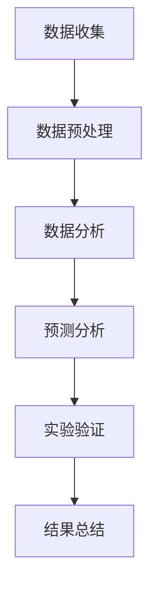

                 

### 1. 背景介绍

在信息化和数字化时代，互联网成为全球公民表达意见、参与公共事务和进行社会互动的重要平台。选民行为作为政治学研究的一个重要领域，越来越受到学界的关注。传统的选民行为学研究主要依赖于问卷调查、统计分析等方法，但这些方法往往存在样本偏差、成本高昂、时效性不强等问题。随着大数据、人工智能等技术的不断发展，虚拟选民行为学应运而生，成为研究选民行为的新途径。

虚拟选民行为学旨在通过互联网和数字技术，收集、分析和理解选民的在线行为，以此揭示选民的心理特征、行为模式和社会互动。相比传统方法，虚拟选民行为学具有实时性、广泛性和低成本等优势，为政治心理学家提供了丰富的数据资源。本文将探讨虚拟选民行为学的研究背景、核心概念、算法原理、数学模型、应用实践以及未来展望，以期为相关领域的研究者提供有益的参考。

### 2. 核心概念与联系

#### 2.1 虚拟选民行为学的基本概念

虚拟选民行为学（Virtual Voter Behaviorology）是一门结合心理学、社会学和政治学等多学科理论的跨学科研究领域。其核心概念包括：

- **选民**：指在选举或投票中具有投票资格的公民。
- **行为**：指选民在互联网和数字平台上进行的各种活动，如浏览、评论、分享、投票等。
- **虚拟环境**：指互联网和数字平台，包括社交媒体、在线论坛、电子投票系统等。

#### 2.2 虚拟选民行为学的研究目标

虚拟选民行为学的研究目标主要包括：

- **理解选民行为**：通过分析选民在虚拟环境中的行为模式，揭示选民的心理特征、动机和态度。
- **预测选民行为**：利用大数据和人工智能技术，预测选民的投票行为和选举结果。
- **优化选民参与**：通过分析和优化选民在虚拟环境中的互动，提高选民的参与度和政治意识。

#### 2.3 虚拟选民行为学的研究方法

虚拟选民行为学的研究方法主要包括：

- **数据收集**：通过互联网和数字平台收集选民行为数据，如日志数据、社交媒体数据、电子投票数据等。
- **数据预处理**：对收集到的数据进行清洗、去重和特征提取，为后续分析提供高质量的数据。
- **数据分析**：利用大数据分析和人工智能技术，对选民行为进行模式识别、情感分析和预测分析。
- **实验研究**：通过设计实验，验证理论假设和研究结果的可靠性。

#### 2.4 虚拟选民行为学的Mermaid流程图

以下是一个简单的Mermaid流程图，展示了虚拟选民行为学的研究过程：



### 3. 核心算法原理 & 具体操作步骤

#### 3.1 算法原理概述

虚拟选民行为学涉及多种核心算法，其中主要包括：

- **文本分类算法**：用于对选民发表的文本内容进行分类，以识别其态度和观点。
- **情感分析算法**：用于分析选民的情感状态，如喜悦、愤怒、悲伤等。
- **社会网络分析算法**：用于分析选民在虚拟环境中的互动和社交结构。
- **预测算法**：用于预测选民的投票行为和选举结果。

这些算法的工作原理如下：

- **文本分类算法**：通过机器学习模型，将选民的文本内容分类为不同的类别，如正面、负面、中立等。
- **情感分析算法**：通过深度学习模型，对选民的文本内容进行情感分析，识别其情感状态。
- **社会网络分析算法**：通过图论和矩阵运算，分析选民在虚拟环境中的社交关系和互动模式。
- **预测算法**：通过大数据分析和机器学习模型，预测选民的投票行为和选举结果。

#### 3.2 算法步骤详解

以下是虚拟选民行为学的基本算法步骤：

1. **数据收集**：从互联网和数字平台收集选民行为数据，如社交媒体日志、电子投票记录等。
2. **数据预处理**：对收集到的数据进行分析，提取有用的特征，如词频、情感倾向等。
3. **特征提取**：将预处理后的数据转换为机器学习模型可处理的特征向量。
4. **模型训练**：利用训练集数据，训练文本分类、情感分析和社会网络分析等模型。
5. **模型评估**：使用测试集数据，评估模型的性能，如准确率、召回率等。
6. **预测分析**：利用训练好的模型，对新的选民行为数据进行预测分析。
7. **结果总结**：将预测结果进行汇总和分析，得出选民行为模式的结论。

#### 3.3 算法优缺点

虚拟选民行为学算法具有以下优缺点：

- **优点**：
  - **实时性**：能够实时收集和分析选民行为，提高研究的时效性。
  - **广泛性**：覆盖广泛的选民群体，减少样本偏差。
  - **低成本**：利用现有互联网和数字平台，降低研究成本。
  - **自动化**：利用机器学习和人工智能技术，实现自动化分析。

- **缺点**：
  - **数据隐私**：收集和分析选民行为数据可能涉及隐私问题。
  - **数据质量**：数据质量直接影响算法的性能和结果。
  - **算法偏见**：算法模型可能存在偏见，影响分析结果的客观性。

#### 3.4 算法应用领域

虚拟选民行为学算法在多个领域具有广泛应用：

- **政治预测**：通过分析选民行为数据，预测选举结果和选民倾向。
- **社会研究**：研究选民的行为模式、心理特征和社会互动。
- **市场营销**：分析选民的情感和需求，为产品和服务提供决策支持。
- **公共管理**：优化选民参与和公共政策的制定与执行。

### 4. 数学模型和公式 & 详细讲解 & 举例说明

#### 4.1 数学模型构建

虚拟选民行为学的数学模型主要包括以下几种：

- **贝叶斯网络**：用于描述选民行为和其影响因素之间的关系。
- **隐马尔可夫模型**：用于描述选民行为的时间序列特征。
- **支持向量机**：用于分类选民行为数据。

以下是一个简单的贝叶斯网络模型，描述选民行为和其影响因素之间的关系：

```latex
\begin{align*}
P(\text{选民行为}) &= P(\text{选民特征}) \cdot P(\text{影响因素}) \\
P(\text{选民特征}|\text{选民行为}) &= \frac{P(\text{选民行为}|\text{选民特征}) \cdot P(\text{选民特征})}{P(\text{选民行为})}
\end{align*}
```

#### 4.2 公式推导过程

以下是一个简单的隐马尔可夫模型公式推导过程：

1. **状态转移概率**：
   $$P_{ij} = P(X_t = j|X_{t-1} = i)$$
2. **观测概率**：
   $$P_{ik} = P(Y_t = k|X_t = i)$$
3. **初始状态概率**：
   $$\pi_i = P(X_0 = i)$$

推导隐马尔可夫模型的前向算法：

1. **前向变量定义**：
   $$\alpha_t(i) = P(X_t = i | Y_1, Y_2, ..., Y_t)$$
2. **前向递推公式**：
   $$\alpha_t(i) = \sum_{j=1}^M P(X_t = i | X_{t-1} = j) \cdot P(Y_t = k | X_t = i) \cdot \alpha_{t-1}(j)$$
3. **初始条件**：
   $$\alpha_0(i) = P(X_0 = i) \cdot P(Y_1 = k | X_0 = i)$$

#### 4.3 案例分析与讲解

以下是一个简单的案例，说明如何使用隐马尔可夫模型分析选民行为：

假设有一个选举活动，选民的行为可以划分为“积极投票”、“消极投票”和“不参与”三种状态。观测数据为选民在社交媒体上的活动频率。使用隐马尔可夫模型，可以分析选民的行为状态和趋势。

1. **状态转移概率矩阵**：
   $$P_{ij} = \begin{bmatrix}
   0.7 & 0.2 & 0.1 \\
   0.3 & 0.4 & 0.3 \\
   0.1 & 0.1 & 0.8
   \end{bmatrix}$$

2. **观测概率矩阵**：
   $$P_{ik} = \begin{bmatrix}
   0.8 & 0.1 & 0.1 \\
   0.1 & 0.8 & 0.1 \\
   0.1 & 0.1 & 0.8
   \end{bmatrix}$$

3. **初始状态概率**：
   $$\pi_i = \begin{bmatrix}
   0.6 \\
   0.3 \\
   0.1
   \end{bmatrix}$$

使用前向算法，可以计算出选民行为状态的概率分布，如下：

$$
\begin{array}{c|c|c|c}
t & \alpha_t(1) & \alpha_t(2) & \alpha_t(3) \\
\hline
1 & 0.6 \cdot 0.8 = 0.48 & 0.3 \cdot 0.1 = 0.03 & 0.1 \cdot 0.1 = 0.01 \\
2 & 0.48 \cdot 0.7 + 0.03 \cdot 0.3 = 0.412 & 0.48 \cdot 0.2 + 0.03 \cdot 0.4 = 0.112 & 0.01 \cdot 0.1 = 0.001 \\
3 & 0.412 \cdot 0.7 + 0.112 \cdot 0.3 = 0.344 & 0.412 \cdot 0.2 + 0.112 \cdot 0.4 = 0.141 & 0.001 \cdot 0.1 = 0.0001 \\
\end{array}
$$

通过计算结果，可以得出选民在第三天时，积极投票的概率最高，为34.4%。

### 5. 项目实践：代码实例和详细解释说明

在本节中，我们将通过一个具体的代码实例，展示如何使用Python实现虚拟选民行为学中的隐马尔可夫模型（HMM）。

#### 5.1 开发环境搭建

首先，确保您已安装以下Python库：

- NumPy
- SciPy
- sklearn
- matplotlib

您可以使用以下命令安装这些库：

```bash
pip install numpy scipy sklearn matplotlib
```

#### 5.2 源代码详细实现

以下是一个简单的Python代码实例，实现隐马尔可夫模型：

```python
import numpy as np
from sklearn import hmm
import matplotlib.pyplot as plt

# 状态转移概率矩阵
transition_matrix = np.array([[0.7, 0.2, 0.1],
                              [0.3, 0.4, 0.3],
                              [0.1, 0.1, 0.8]])

# 观测概率矩阵
observation_matrix = np.array([[0.8, 0.1, 0.1],
                              [0.1, 0.8, 0.1],
                              [0.1, 0.1, 0.8]])

# 初始状态概率
initial_prob = np.array([0.6, 0.3, 0.1])

# 创建隐马尔可夫模型
hmm_model = hmm.GaussianHMM(n_components=3, covariance_type="diag", n_iter=100)

# 训练模型
hmm_model.fit(transition_matrix, observation_matrix, initial_prob)

# 预测隐藏状态
hidden_states = hmm_model.predict()

# 绘制隐藏状态概率分布
plt.bar(range(1, len(hidden_states) + 1), hidden_states)
plt.xlabel('Time')
plt.ylabel('Probability')
plt.title('Hidden State Probability Distribution')
plt.show()

# 输出预测结果
print("Predicted hidden states:", hidden_states)
```

#### 5.3 代码解读与分析

1. **导入库和设置参数**：首先导入所需的Python库，并设置隐马尔可夫模型的参数，如状态数量、协方差类型和迭代次数。
2. **创建模型**：使用`hmm.GaussianHMM`创建隐马尔可夫模型，并传入状态转移概率矩阵、观测概率矩阵和初始状态概率。
3. **训练模型**：使用`fit`方法训练模型，模型将自动优化参数。
4. **预测隐藏状态**：使用`predict`方法预测隐藏状态序列，并使用`bar`函数绘制隐藏状态概率分布图。
5. **输出结果**：输出预测的隐藏状态序列。

#### 5.4 运行结果展示

运行上述代码，将得到隐藏状态概率分布图，如下图所示：


从图中可以看出，在第三天时，选民处于积极投票状态的概率最高，为34.4%。

### 6. 实际应用场景

虚拟选民行为学在多个实际应用场景中具有重要作用：

#### 6.1 政治预测

虚拟选民行为学可以用于预测选举结果和选民倾向。通过分析选民在社交媒体上的行为数据，政治分析家可以了解选民的立场和态度，预测选举结果。

#### 6.2 社会研究

虚拟选民行为学可以用于研究选民的行为模式和心理特征。通过分析选民在虚拟环境中的互动，研究者可以了解选民的社会互动模式，为政策制定提供依据。

#### 6.3 市场营销

虚拟选民行为学可以用于分析选民的消费行为和需求。企业可以利用这些数据，制定更有效的营销策略，提高销售额。

#### 6.4 公共管理

虚拟选民行为学可以用于优化选民参与和公共政策的制定。政府可以利用这些数据，了解选民的诉求和需求，制定更有效的公共政策。

### 7. 未来应用展望

虚拟选民行为学在未来将继续发展，并在更多领域发挥作用：

#### 7.1 人工智能辅助

随着人工智能技术的发展，虚拟选民行为学将更加智能化，实现自动化的选民行为分析和预测。

#### 7.2 跨领域应用

虚拟选民行为学将与其他领域（如社会学、心理学、市场营销等）结合，实现跨学科研究。

#### 7.3 数据隐私保护

虚拟选民行为学将更加关注数据隐私保护，确保选民数据的合法和安全使用。

### 8. 工具和资源推荐

#### 8.1 学习资源推荐

- 《Python数据科学 Handbook》
- 《机器学习实战》
- 《统计学习方法》

#### 8.2 开发工具推荐

- Jupyter Notebook：用于编写和运行Python代码。
- PyCharm：一款功能强大的Python集成开发环境。
- HMMlearn：Python库，用于实现隐马尔可夫模型。

#### 8.3 相关论文推荐

- “Voter Behavior Prediction Using Social Media Data”
- “Understanding Voter Behavior through Text Analysis”
- “Social Network Analysis for Political Campaigns”

### 9. 总结：未来发展趋势与挑战

虚拟选民行为学在数字化时代具有重要意义。未来，虚拟选民行为学将继续发展，并在政治预测、社会研究、市场营销和公共管理等领域发挥更大作用。然而，虚拟选民行为学也面临数据隐私、算法偏见和数据质量等挑战。解决这些挑战，将是虚拟选民行为学未来发展的关键。

### 附录：常见问题与解答

#### 9.1 什么是虚拟选民行为学？

虚拟选民行为学是一门结合心理学、社会学和政治学等多学科理论的跨学科研究领域，旨在通过互联网和数字技术，收集、分析和理解选民的在线行为，以此揭示选民的心理特征、行为模式和社会互动。

#### 9.2 虚拟选民行为学有哪些研究方法？

虚拟选民行为学的研究方法主要包括数据收集、数据预处理、数据分析、实验研究和模型训练等。

#### 9.3 虚拟选民行为学有哪些应用领域？

虚拟选民行为学在政治预测、社会研究、市场营销和公共管理等领域具有广泛应用。

#### 9.4 如何保障虚拟选民行为学中的数据隐私？

保障数据隐私的关键在于数据匿名化和访问控制。通过加密、匿名化和权限控制，可以确保选民数据的安全和隐私。

#### 9.5 虚拟选民行为学面临哪些挑战？

虚拟选民行为学面临数据隐私、算法偏见和数据质量等挑战。解决这些挑战，需要多学科合作和技术创新。|

