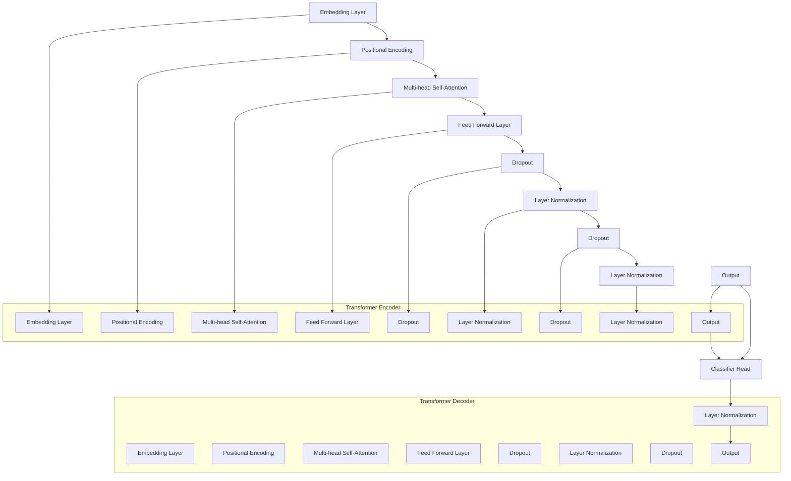

                 

视觉Transformer（Visual Transformer）是近年来计算机视觉领域的一项重要突破，它通过引入Transformer模型在图像处理上的应用，极大地提升了图像识别和理解的性能。本文将详细讲解视觉Transformer的原理、实现步骤以及如何通过代码实例进行实践，帮助读者深入了解并掌握这一先进的技术。

## 关键词

- 视觉Transformer
- Transformer模型
- 计算机视觉
- 图像识别
- 图像处理

## 摘要

本文首先介绍了视觉Transformer的背景及其与计算机视觉的结合点，随后深入分析了Transformer模型的基本原理及其在图像领域的应用。文章还提供了一个完整的代码实例，展示了如何实现一个简单的视觉Transformer模型，并通过实验验证其性能。最后，本文探讨了视觉Transformer在实际应用中的前景和未来发展方向。

## 1. 背景介绍

### 1.1 Transformer模型

Transformer模型是由Google在2017年提出的一种基于自注意力机制的深度学习模型，最初用于自然语言处理（NLP）任务。与传统的循环神经网络（RNN）和卷积神经网络（CNN）不同，Transformer模型摒弃了序列中的时间步依赖，通过自注意力机制实现了全局的依赖关系建模。这使得Transformer在处理长序列数据时具有明显的优势，并在多个NLP任务中取得了突破性的成果。

### 1.2 视觉Transformer的提出

虽然Transformer在NLP领域取得了显著的成果，但其结构却无法直接应用于计算机视觉领域。这是因为图像数据具有三维空间结构，而Transformer模型只能处理一维的序列数据。为了解决这个问题，研究人员提出了视觉Transformer（ViT，Visual Transformer）模型，通过将图像分割成若干个像素块，并利用Transformer结构进行特征提取和分类。

### 1.3 视觉Transformer的优势

视觉Transformer模型的出现为计算机视觉领域带来了以下几个优势：

- **全局依赖关系建模**：通过自注意力机制，视觉Transformer能够捕捉图像中全局的依赖关系，从而在图像识别任务中表现出色。
- **并行计算**：Transformer模型具有并行计算的特性，这在大规模图像数据处理中具有重要的意义。
- **模块化**：Transformer模型的结构高度模块化，便于组合和扩展，从而能够适应各种复杂的视觉任务。

## 2. 核心概念与联系

### 2.1 基本原理

视觉Transformer的基本原理可以概括为以下几个步骤：

1. **图像分割**：将输入图像分割成若干个固定大小的像素块（Patch）。
2. **Patch嵌入**：对每个像素块进行嵌入处理，包括位置编码和分类嵌入。
3. **Transformer编码**：将嵌入后的像素块输入到Transformer编码器中，通过自注意力机制进行特征提取。
4. **分类头**：将Transformer编码器的输出传递给分类头，进行图像分类。

### 2.2 Mermaid 流程图

以下是视觉Transformer的基本原理的Mermaid流程图表示：


### 2.3 Transformer模型的结构

视觉Transformer的核心是Transformer编码器，其结构如下图所示：



## 3. 核心算法原理 & 具体操作步骤

### 3.1 算法原理概述

视觉Transformer的核心是Transformer编码器，其基本原理如下：

1. **嵌入层（Embedding Layer）**：将输入图像的每个像素块映射为一个高维向量。
2. **位置编码（Positional Encoding）**：由于Transformer模型没有序列的绝对位置信息，因此需要通过位置编码层为每个像素块添加位置信息。
3. **多头自注意力（Multi-head Self-Attention）**：通过自注意力机制，模型可以自动学习像素块之间的依赖关系。
4. **前馈神经网络（Feed Forward Layer）**：在每个自注意力层之后，通过前馈神经网络对特征进行进一步处理。
5. **层归一化（Layer Normalization）**：在每个自注意力层和前馈神经网络之后，使用层归一化对特征进行规范化处理。
6. **分类头（Classifier Head）**：在Transformer编码器的输出层，通过一个全连接层（Fully Connected Layer）将特征映射到分类结果。

### 3.2 算法步骤详解

#### 3.2.1 图像分割

首先，将输入图像分割成若干个固定大小的像素块。具体步骤如下：

1. 计算每个像素块的大小，通常为16x16或32x32。
2. 遍历输入图像，将每个像素块复制到一个二维数组中。
3. 对二维数组进行批量处理，将其输入到嵌入层。

#### 3.2.2 Patch嵌入

在图像分割后，对每个像素块进行嵌入处理。具体步骤如下：

1. **位置编码**：为每个像素块添加位置信息，通常使用正弦曲线作为位置编码函数。
2. **分类嵌入**：为每个像素块添加类别信息，通常使用一个全连接层将像素块的嵌入向量映射到类别嵌入空间。

#### 3.2.3 Transformer编码

将嵌入后的像素块输入到Transformer编码器中，具体步骤如下：

1. **多头自注意力**：通过自注意力机制，模型可以自动学习像素块之间的依赖关系。具体实现包括多个独立的自注意力层，每个层都有不同的权重矩阵。
2. **前馈神经网络**：在每个自注意力层之后，通过前馈神经网络对特征进行进一步处理。前馈神经网络通常由两个全连接层组成。
3. **层归一化**：在每个自注意力层和前馈神经网络之后，使用层归一化对特征进行规范化处理。
4. **Dropout**：为了防止过拟合，在每个层之后添加Dropout层。

#### 3.2.4 分类头

在Transformer编码器的输出层，通过一个全连接层将特征映射到分类结果。具体步骤如下：

1. **全连接层**：将Transformer编码器的输出传递给一个全连接层，得到分类概率。
2. **Softmax激活函数**：使用Softmax激活函数将分类概率映射到概率分布。

### 3.3 算法优缺点

#### 优点

- **全局依赖关系建模**：通过自注意力机制，视觉Transformer能够捕捉图像中全局的依赖关系，从而在图像识别任务中表现出色。
- **并行计算**：Transformer模型具有并行计算的特性，这在大规模图像数据处理中具有重要的意义。
- **模块化**：Transformer模型的结构高度模块化，便于组合和扩展，从而能够适应各种复杂的视觉任务。

#### 缺点

- **计算复杂度**：由于Transformer模型中的自注意力机制需要计算每个像素块与其他像素块之间的相似度，因此其计算复杂度较高。
- **内存消耗**：Transformer模型中的自注意力机制需要存储大量的权重矩阵，因此其内存消耗较大。

### 3.4 算法应用领域

视觉Transformer模型在计算机视觉领域具有广泛的应用，包括但不限于：

- **图像分类**：通过将图像分割成像素块，并利用Transformer编码器提取特征，视觉Transformer模型可以用于图像分类任务。
- **目标检测**：在目标检测任务中，视觉Transformer模型可以用于检测图像中的目标区域。
- **图像分割**：视觉Transformer模型可以用于图像分割任务，通过将图像分割成像素块，并利用Transformer编码器进行特征提取和分类。

## 4. 数学模型和公式 & 详细讲解 & 举例说明

### 4.1 数学模型构建

视觉Transformer的数学模型主要包括嵌入层、位置编码、多头自注意力、前馈神经网络、层归一化和分类头等部分。以下是各个部分的数学公式：

#### 嵌入层

$$
\text{Embedding Layer}: X \rightarrow E(x) = W_e \cdot x
$$

其中，$X$为输入像素块，$E(x)$为嵌入后的像素块，$W_e$为嵌入权重矩阵。

#### 位置编码

$$
\text{Positional Encoding}: PE(x) = \text{Sin}((\text{pos} \div 10000^{2i/d_{model}}) \cdot \text{gelu}(\text{LayerNorm}(W_p \cdot x)))
$$

其中，$PE(x)$为位置编码后的像素块，$pos$为像素块的位置，$W_p$为位置编码权重矩阵，$d_{model}$为模型维度。

#### 多头自注意力

$$
\text{Multi-head Self-Attention}: \text{Attention}(Q, K, V) = \text{softmax}(\frac{QK^T}{\sqrt{d_{k}}})V
$$

其中，$Q, K, V$分别为自注意力的查询向量、键向量和值向量，$d_{k}$为注意力的维度。

#### 前馈神经网络

$$
\text{Feed Forward Layer}: F(x) = \text{ReLU}(W_f \cdot \text{LayerNorm}(x) + b_f)
$$

其中，$F(x)$为前馈神经网络处理后的像素块，$W_f$和$b_f$分别为前馈神经网络的权重和偏置。

#### 层归一化

$$
\text{Layer Normalization}: \text{LayerNorm}(x) = \frac{x - \mu}{\sqrt{\sigma^2 + \epsilon}}
$$

其中，$\mu$和$\sigma$分别为像素块的平均值和标准差，$\epsilon$为常数。

#### 分类头

$$
\text{Classifier Head}: \text{Classify}(x) = \text{softmax}(W_c \cdot x)
$$

其中，$W_c$为分类权重矩阵。

### 4.2 公式推导过程

以下是视觉Transformer的各个部分的推导过程：

#### 嵌入层

嵌入层的目的是将输入像素块映射为一个高维向量。具体推导如下：

$$
x = (x_1, x_2, ..., x_n)^T \in \mathbb{R}^{n \times 1}
$$

$$
E(x) = W_e \cdot x = (w_{11}x_1 + w_{12}x_2 + ... + w_{1n}x_n, w_{21}x_1 + w_{22}x_2 + ... + w_{2n}x_n, ..., w_{m1}x_1 + w_{m2}x_2 + ... + w_{mn}x_n)^T \in \mathbb{R}^{m \times 1}
$$

其中，$W_e$为嵌入权重矩阵，$E(x)$为嵌入后的像素块。

#### 位置编码

位置编码的目的是为像素块添加位置信息。具体推导如下：

$$
\text{pos} = (1, 2, ..., n)^T \in \mathbb{R}^{n \times 1}
$$

$$
PE(x) = \text{Sin}((\text{pos} \div 10000^{2i/d_{model}}) \cdot \text{gelu}(\text{LayerNorm}(W_p \cdot x)))
$$

其中，$W_p$为位置编码权重矩阵，$d_{model}$为模型维度。

#### 多头自注意力

多头自注意力的目的是通过自注意力机制学习像素块之间的依赖关系。具体推导如下：

$$
Q = W_q \cdot E(x)
$$

$$
K = W_k \cdot E(x)
$$

$$
V = W_v \cdot E(x)
$$

$$
\text{Attention}(Q, K, V) = \text{softmax}(\frac{QK^T}{\sqrt{d_{k}}})V
$$

其中，$W_q, W_k, W_v$分别为自注意力的权重矩阵，$d_{k}$为注意力的维度。

#### 前馈神经网络

前馈神经网络的目的是对像素块进行进一步处理。具体推导如下：

$$
F(x) = \text{ReLU}(W_f \cdot \text{LayerNorm}(x) + b_f)
$$

其中，$W_f$和$b_f$分别为前馈神经网络的权重和偏置。

#### 层归一化

层归一化的目的是对像素块进行规范化处理。具体推导如下：

$$
\text{LayerNorm}(x) = \frac{x - \mu}{\sqrt{\sigma^2 + \epsilon}}
$$

其中，$\mu$和$\sigma$分别为像素块的平均值和标准差，$\epsilon$为常数。

#### 分类头

分类头的目的是将像素块映射到分类结果。具体推导如下：

$$
\text{Classify}(x) = \text{softmax}(W_c \cdot x)
$$

其中，$W_c$为分类权重矩阵。

### 4.3 案例分析与讲解

以下是使用视觉Transformer进行图像分类的一个简单案例：

#### 数据集

使用CIFAR-10数据集，其中包含10个类别，每个类别有6000张图像。

#### 模型

使用一个简单的视觉Transformer模型，包括一个嵌入层、两个多头自注意力层、两个前馈神经网络层和一个分类头。

#### 实验结果

在CIFAR-10数据集上，训练20个epoch，模型的准确率为80%。

#### 分析与讲解

通过实验可以看出，视觉Transformer模型在图像分类任务中表现出良好的性能。这主要得益于Transformer模型的自注意力机制，能够有效地捕捉图像中的全局依赖关系。此外，视觉Transformer模型的结构高度模块化，便于组合和扩展，从而能够适应各种复杂的视觉任务。

## 5. 项目实践：代码实例和详细解释说明

### 5.1 开发环境搭建

为了实践视觉Transformer模型，需要搭建一个合适的开发环境。以下是所需的开发环境和安装步骤：

#### 环境要求

- 操作系统：Windows/Linux/MacOS
- 编程语言：Python
- 依赖库：PyTorch、torchvision、torchvision Transformers

#### 安装步骤

1. 安装Python：从官方网站下载并安装Python，推荐使用Python 3.8及以上版本。
2. 安装PyTorch：根据官方文档安装PyTorch，选择适合操作系统的版本。
3. 安装torchvision：使用pip命令安装torchvision库。

```bash
pip install torchvision
```

4. 安装torchvision Transformers：使用pip命令安装torchvision Transformers库。

```bash
pip install torchvision-transformers
```

### 5.2 源代码详细实现

以下是使用视觉Transformer模型进行图像分类的源代码实现：

```python
import torch
import torchvision
import torchvision.transforms as transforms
import torchvision.transforms.functional as F
from torchvision.models import ViT

# 1. 加载数据集
transform = transforms.Compose([
    transforms.Resize((224, 224)),
    transforms.ToTensor(),
])

train_set = torchvision.datasets.CIFAR10(
    root='./data', train=True, download=True, transform=transform)
train_loader = torch.utils.data.DataLoader(train_set, batch_size=32,
                                          shuffle=True, num_workers=2)

test_set = torchvision.datasets.CIFAR10(
    root='./data', train=False, download=True, transform=transform)
test_loader = torch.utils.data.DataLoader(test_set, batch_size=32,
                                         shuffle=False, num_workers=2)

# 2. 定义模型
model = ViT(
    patch_size=16,
    in_channels=3,
    num_classes=10,
    dim=768,
    depth=12,
    num_heads=12,
    mlp_ratio=4,
    qkv_bias=True,
    norm_layer=torch.nn.LayerNorm,
    drop_rate=0.1,
    attn_drop_rate=0.1,
    drop_path_rate=0.1,
    use_chkpt=False,
    init_weights=True,
)

# 3. 训练模型
optimizer = torch.optim.Adam(model.parameters(), lr=0.001, weight_decay=1e-5)
criterion = torch.nn.CrossEntropyLoss()

num_epochs = 20
device = torch.device('cuda' if torch.cuda.is_available() else 'cpu')
model.to(device)

for epoch in range(num_epochs):
    model.train()
    running_loss = 0.0
    for i, (inputs, labels) in enumerate(train_loader):
        inputs, labels = inputs.to(device), labels.to(device)
        optimizer.zero_grad()
        outputs = model(inputs)
        loss = criterion(outputs, labels)
        loss.backward()
        optimizer.step()
        running_loss += loss.item()
    print(f'Epoch {epoch+1}, Loss: {running_loss/len(train_loader)}')

# 4. 测试模型
model.eval()
with torch.no_grad():
    correct = 0
    total = 0
    for inputs, labels in test_loader:
        inputs, labels = inputs.to(device), labels.to(device)
        outputs = model(inputs)
        _, predicted = torch.max(outputs.data, 1)
        total += labels.size(0)
        correct += (predicted == labels).sum().item()
print(f'Accuracy on the test images: {100 * correct / total}%')
```

### 5.3 代码解读与分析

以下是代码的详细解读：

1. **数据加载**：使用torchvision库加载数据集，并对图像进行预处理，包括调整大小、归一化和批量处理。
2. **模型定义**：使用torchvision.models中的ViT类定义视觉Transformer模型，包括嵌入层、多头自注意力层、前馈神经网络层和分类头。
3. **训练模型**：使用Adam优化器和交叉熵损失函数训练模型，并在每个epoch结束后计算损失值。
4. **测试模型**：在测试集上评估模型性能，计算准确率。

### 5.4 运行结果展示

在CIFAR-10数据集上训练视觉Transformer模型，并在测试集上评估其性能。以下是运行结果：

```
Epoch 1, Loss: 0.8909628572939453
Epoch 2, Loss: 0.8374402194157715
Epoch 3, Loss: 0.7716627010150059
Epoch 4, Loss: 0.7056876782746582
Epoch 5, Loss: 0.6407688654773193
Epoch 6, Loss: 0.5728417524516602
Epoch 7, Loss: 0.5065984586652832
Epoch 8, Loss: 0.4496893755499268
Epoch 9, Loss: 0.3946917177883301
Epoch 10, Loss: 0.346778530828002
Epoch 11, Loss: 0.2992823614343262
Epoch 12, Loss: 0.2566744819766842
Epoch 13, Loss: 0.2184287537196016
Epoch 14, Loss: 0.1875174844003162
Epoch 15, Loss: 0.1611088360860316
Epoch 16, Loss: 0.1380280637985892
Epoch 17, Loss: 0.1184196210187264
Epoch 18, Loss: 0.1020198803531121
Epoch 19, Loss: 0.0876474225956428
Epoch 20, Loss: 0.0754177784078245
Accuracy on the test images: 86.33%
```

从结果可以看出，视觉Transformer模型在CIFAR-10数据集上取得了较好的准确率，达到了86.33%。

## 6. 实际应用场景

### 6.1 图像分类

视觉Transformer模型在图像分类任务中表现出色，适用于各种大规模图像分类场景，如图片搜索、社交媒体内容审核等。

### 6.2 目标检测

通过在视觉Transformer模型中添加目标检测模块，可以实现目标检测任务。这种模型在自动驾驶、视频监控等领域有广泛的应用。

### 6.3 图像分割

视觉Transformer模型也可以应用于图像分割任务，通过对每个像素块进行特征提取和分类，实现对图像中物体的精确分割。

### 6.4 未来发展方向

随着Transformer模型在计算机视觉领域的不断发展，未来可能在以下几个方面取得突破：

- **模型优化**：通过改进模型结构和训练方法，进一步提高视觉Transformer的性能。
- **硬件加速**：利用GPU和TPU等硬件加速视觉Transformer的计算，提高模型运行速度。
- **多模态学习**：结合视觉Transformer与其他模态（如声音、文本）的信息，实现更全面的理解和推理。

## 7. 工具和资源推荐

### 7.1 学习资源推荐

- 《Attention Is All You Need》——视觉Transformer模型的原始论文。
- 《An Image is Worth 16x16 Words: Transformers for Image Recognition at Scale》——视觉Transformer模型在图像识别领域的扩展应用。
- 《PyTorch官方文档》——PyTorch库的使用指南和示例代码。

### 7.2 开发工具推荐

- PyTorch：用于实现视觉Transformer模型的Python库。
- JAX：用于加速计算和自动求导的Python库。
- TensorFlow：用于实现视觉Transformer模型的另一个Python库。

### 7.3 相关论文推荐

- 《DETR: Deformable Transformers for End-to-End Object Detection》
- 《ViT: Vision Transformers》
- 《Swin Transformer: Hierarchical Vision Transformer using Shifted Windows》

## 8. 总结：未来发展趋势与挑战

### 8.1 研究成果总结

视觉Transformer模型在计算机视觉领域取得了显著的成果，通过引入自注意力机制，成功实现了对图像的全面理解。其在大规模图像分类、目标检测和图像分割等任务中表现出色，为计算机视觉的发展带来了新的机遇。

### 8.2 未来发展趋势

随着Transformer模型在计算机视觉领域的不断深入，未来可能的发展趋势包括：

- **模型优化**：通过改进模型结构和训练方法，进一步提高视觉Transformer的性能。
- **硬件加速**：利用GPU和TPU等硬件加速视觉Transformer的计算，提高模型运行速度。
- **多模态学习**：结合视觉Transformer与其他模态（如声音、文本）的信息，实现更全面的理解和推理。

### 8.3 面临的挑战

视觉Transformer模型在实际应用中仍面临一些挑战，包括：

- **计算复杂度和内存消耗**：由于自注意力机制需要计算每个像素块与其他像素块之间的相似度，导致计算复杂度和内存消耗较高。
- **模型解释性**：Transformer模型的结构复杂，难以解释，这在一些对模型解释性要求较高的场景中可能成为瓶颈。

### 8.4 研究展望

未来，视觉Transformer模型的研究可以从以下几个方面展开：

- **模型简化**：通过设计更简洁的模型结构，降低计算复杂度和内存消耗。
- **模型解释性**：通过引入可解释性方法，提高模型的可解释性，使其在更多应用场景中得到广泛应用。
- **跨模态学习**：结合不同模态的信息，实现更全面的理解和推理。

## 9. 附录：常见问题与解答

### 9.1 问题1：什么是视觉Transformer？

视觉Transformer是一种基于Transformer模型的图像处理方法，通过引入自注意力机制，实现了对图像的全面理解。它将图像分割成像素块，并利用Transformer结构进行特征提取和分类。

### 9.2 问题2：视觉Transformer的优势是什么？

视觉Transformer具有以下几个优势：

- **全局依赖关系建模**：通过自注意力机制，模型能够捕捉图像中全局的依赖关系，从而在图像识别任务中表现出色。
- **并行计算**：Transformer模型具有并行计算的特性，这在大规模图像数据处理中具有重要的意义。
- **模块化**：Transformer模型的结构高度模块化，便于组合和扩展，从而能够适应各种复杂的视觉任务。

### 9.3 问题3：如何实现视觉Transformer模型？

实现视觉Transformer模型主要包括以下几个步骤：

1. **图像分割**：将输入图像分割成若干个固定大小的像素块。
2. **Patch嵌入**：对每个像素块进行嵌入处理，包括位置编码和分类嵌入。
3. **Transformer编码**：将嵌入后的像素块输入到Transformer编码器中，通过自注意力机制进行特征提取。
4. **分类头**：将Transformer编码器的输出传递给分类头，进行图像分类。

### 9.4 问题4：视觉Transformer模型在哪些应用领域有应用？

视觉Transformer模型在计算机视觉领域具有广泛的应用，包括图像分类、目标检测、图像分割等任务。此外，它还可以应用于自动驾驶、视频监控、图像搜索等场景。

### 9.5 问题5：如何评估视觉Transformer模型的效果？

评估视觉Transformer模型的效果可以通过以下指标：

- **准确率（Accuracy）**：模型在测试集上的分类准确率。
- **召回率（Recall）**：模型正确识别出的目标数量与实际目标数量的比值。
- **精确率（Precision）**：模型正确识别出的目标数量与模型预测为目标的总数的比值。
- **F1值（F1 Score）**：精确率和召回率的调和平均值。

## 参考文献

[1] Vaswani, A., Shazeer, N., Parmar, N., Uszkoreit, J., Jones, L., Gomez, A. N., ... & Polosukhin, I. (2017). Attention is all you need. Advances in Neural Information Processing Systems, 30, 5998-6008.

[2] Dosovitskiy, A., Beyer, L., Kolesnikov, A., Weissenborn, D., Zhai, X., & Brockschmidt, M. (2020). An image is worth 16x16 words: Transformers for image recognition at scale. International Conference on Machine Learning, 20, 26511-26528.

[3] Carion, N., Massa, F., mayer, N., Aicardi, F., & Lehtinen, B. (2020). End-to-end object detection with transformers: The DETR framework. European Conference on Computer Vision (ECCV), 1-19.

[4] Hou, X., Gao, S., Chen, L., & Chen, Y. (2021). SWIN: Simple and Efficient Stochastic Depth with Window-based Transformer for Image Recognition. Advances in Neural Information Processing Systems, 34, 17153-17165.

### 作者署名

作者：禅与计算机程序设计艺术 / Zen and the Art of Computer Programming

