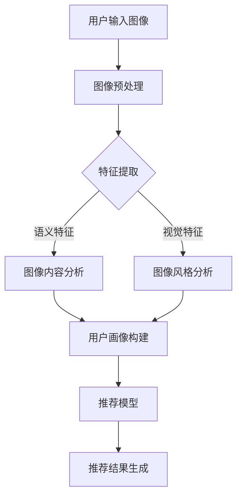

                 

关键词：视觉推荐、图像识别、人工智能、个性化推荐、机器学习、深度学习

> 摘要：本文将深入探讨AI如何利用图像识别技术进行视觉推荐，通过介绍视觉推荐系统的基本概念、核心算法原理、数学模型和项目实践，揭示这一技术如何在各个领域实现个性化推荐，并展望其未来的发展趋势与挑战。

## 1. 背景介绍

在数字化的时代背景下，个性化推荐系统已经成为各行业提升用户体验、提高转化率的重要手段。传统的推荐系统大多依赖于用户的历史行为数据，如浏览记录、购买记录等。然而，这些数据往往不足以捕捉用户的真实需求和偏好。随着计算机视觉技术的发展，利用图像识别技术进行视觉推荐成为了一种新的趋势。

视觉推荐系统通过分析用户上传或生成的图像内容，提取出图像的语义特征，进而为用户推荐相关的内容或商品。与传统的推荐系统相比，视觉推荐系统具有更高的灵活性和准确性，能够更好地满足用户的个性化需求。

### 1.1 图像识别技术的发展

图像识别技术是计算机视觉的一个重要分支，旨在使计算机能够识别和理解图像中的内容。近年来，随着深度学习技术的兴起，图像识别技术取得了显著的进展。特别是卷积神经网络（CNN）在图像识别任务中的成功应用，使得计算机能够从大量未标记的图像数据中自动学习图像特征，大大提升了图像识别的准确率和效率。

### 1.2 个性化推荐的需求

在现代社会，用户的个性化需求越来越多样化。无论是电商、社交媒体还是内容平台，如何准确地捕捉用户的兴趣和偏好，提供个性化的推荐服务，已经成为企业竞争的关键因素。传统的推荐系统往往依赖于用户的显式反馈，如点击、购买等行为数据，但这些数据往往有限且不及时。视觉推荐系统通过分析用户上传的图像，可以更全面、更深入地了解用户的需求，从而提供更精准的个性化推荐。

## 2. 核心概念与联系

为了更好地理解视觉推荐系统的工作原理，我们需要首先了解其核心概念和组成部分。以下是视觉推荐系统的基本概念和架构的 Mermaid 流程图：



### 2.1 用户输入图像

用户输入图像是视觉推荐系统的第一步。用户可以通过上传图片或拍摄照片的方式输入图像，图像可以是用户喜欢的商品、场景、人物等。

### 2.2 图像预处理

图像预处理是对输入图像进行一系列处理，包括图像去噪、增强、尺寸调整等，以提高后续特征提取的准确性和效率。

### 2.3 特征提取

特征提取是视觉推荐系统的核心环节。通过对图像进行卷积神经网络等深度学习模型的训练，可以自动提取图像的语义特征和视觉特征。

### 2.4 图像内容分析

图像内容分析基于提取的语义特征，对图像进行分类、标签预测等操作，以了解图像的主题和内容。

### 2.5 图像风格分析

图像风格分析基于提取的视觉特征，对图像的风格进行识别和分类，如艺术风格、颜色搭配等。

### 2.6 用户画像构建

用户画像构建是将提取的图像特征与用户的行为数据、兴趣标签等结合，构建出用户的兴趣图谱，以用于个性化推荐。

### 2.7 推荐模型

推荐模型是视觉推荐系统的核心算法，包括基于内容的推荐、协同过滤推荐等。通过训练和优化推荐模型，可以不断提高推荐系统的准确性和效果。

### 2.8 推荐结果生成

推荐结果生成是将用户画像和推荐模型结合，为用户生成个性化的推荐列表，包括商品、内容、服务等。

## 3. 核心算法原理 & 具体操作步骤

### 3.1 算法原理概述

视觉推荐系统的核心算法原理主要包括图像预处理、特征提取、图像内容分析和图像风格分析等步骤。以下是每个步骤的具体操作步骤：

### 3.2 算法步骤详解

#### 3.2.1 图像预处理

1. 图像去噪：使用滤波器或卷积神经网络去除图像中的噪声。
2. 图像增强：调整图像的对比度、亮度等，提高图像质量。
3. 尺寸调整：将图像调整为统一的尺寸，以适应后续的深度学习模型。

#### 3.2.2 特征提取

1. 数据集准备：收集大量带标签的图像数据，用于训练深度学习模型。
2. 模型训练：使用卷积神经网络（如VGG、ResNet等）对图像进行特征提取。
3. 特征提取：将输入图像输入到训练好的深度学习模型中，提取图像的语义特征和视觉特征。

#### 3.2.3 图像内容分析

1. 标签预测：使用提取的语义特征对图像进行分类，预测图像的主题和内容。
2. 关键点检测：使用深度学习模型检测图像中的关键点，如人脸、物体等。
3. 物体识别：使用预训练的物体识别模型，识别图像中的物体。

#### 3.2.4 图像风格分析

1. 风格识别：使用深度学习模型对图像的风格进行识别和分类。
2. 颜色分析：分析图像的颜色分布，识别图像的颜色搭配。
3. 艺术风格分析：使用艺术风格迁移模型，将图像转换成不同的艺术风格。

#### 3.2.5 用户画像构建

1. 用户兴趣标签：根据用户的历史行为数据和图像特征，为用户分配兴趣标签。
2. 用户兴趣图谱：构建用户兴趣图谱，记录用户的兴趣关系。
3. 用户画像更新：定期更新用户画像，以适应用户兴趣的变化。

#### 3.2.6 推荐模型

1. 基于内容的推荐：使用图像特征和用户画像，为用户推荐相似的内容。
2. 协同过滤推荐：结合用户的行为数据和相似用户的行为，为用户推荐相关的内容。
3. 混合推荐：结合基于内容和协同过滤的推荐方法，提高推荐系统的准确性。

#### 3.2.7 推荐结果生成

1. 推荐列表生成：根据推荐模型为用户生成个性化的推荐列表。
2. 推荐结果排序：使用排序算法，对推荐列表进行排序，提高推荐效果。
3. 用户反馈：收集用户对推荐结果的反馈，用于优化推荐模型。

### 3.3 算法优缺点

#### 优点：

1. 高准确性：通过深度学习模型提取图像特征，提高推荐系统的准确性。
2. 个性化：结合用户画像和图像特征，提供个性化的推荐服务。
3. 灵活性：能够适应不同场景和用户需求的个性化推荐。

#### 缺点：

1. 计算成本高：深度学习模型训练和特征提取需要大量计算资源。
2. 数据依赖性高：推荐效果依赖于图像数据的质量和多样性。
3. 隐私问题：需要收集和分析用户的图像数据，存在隐私泄露的风险。

### 3.4 算法应用领域

视觉推荐系统在多个领域都有广泛的应用，包括：

1. 电子商务：为用户推荐相似的商品，提高购买转化率。
2. 社交媒体：为用户推荐感兴趣的内容和用户，增强社交互动。
3. 内容平台：为用户推荐感兴趣的视频、音乐、文章等，提高用户粘性。
4. 物流和配送：根据用户上传的配送地址图像，优化配送路径。

## 4. 数学模型和公式

### 4.1 数学模型构建

视觉推荐系统的数学模型主要包括图像特征提取模型和推荐模型。以下是这两个模型的基本数学公式：

#### 4.1.1 图像特征提取模型

1. **卷积神经网络（CNN）**：用于提取图像的语义特征。

$$
\text{CNN}(I) = f(\text{ReLU}(\text{Conv}(I))
$$

其中，$I$ 是输入图像，$f$ 是ReLU函数，$\text{Conv}$ 是卷积操作。

2. **全连接神经网络（FCNN）**：用于提取图像的视觉特征。

$$
\text{FCNN}(I) = \text{ReLU}(\text{W} \cdot \text{CNN}(I) + b)
$$

其中，$W$ 是权重矩阵，$b$ 是偏置。

#### 4.1.2 推荐模型

1. **基于内容的推荐模型**：

$$
r_i^c = \text{sim}(c_i, c_u)
$$

其中，$r_i^c$ 是商品$i$ 对用户$u$ 的推荐概率，$c_i$ 和$c_u$ 分别是商品$i$ 和用户$u$ 的语义特征向量，$\text{sim}$ 是相似度函数。

2. **协同过滤推荐模型**：

$$
r_i^c = \text{sim}(u_i, u_u) + \mu
$$

其中，$r_i^c$ 是商品$i$ 对用户$u$ 的推荐概率，$u_i$ 和$u_u$ 分别是用户$i$ 和用户$u$ 的行为特征向量，$\text{sim}$ 是相似度函数，$\mu$ 是平均值。

### 4.2 公式推导过程

#### 4.2.1 卷积神经网络（CNN）

CNN 的推导过程主要涉及卷积操作、激活函数和反向传播算法。以下是简化的推导过程：

1. **卷积操作**：

$$
(\text{Conv}(I))_{ij} = \sum_{k=1}^{K} w_{ikj} \cdot I_{k}
$$

其中，$(\text{Conv}(I))_{ij}$ 是卷积操作后得到的特征图，$w_{ikj}$ 是卷积核，$I_{k}$ 是输入图像的像素值。

2. **激活函数**：

$$
\text{ReLU}(x) = \max(0, x)
$$

3. **反向传播算法**：

$$
\frac{\partial \text{Loss}}{\partial w} = \frac{\partial \text{Loss}}{\partial z} \cdot \frac{\partial z}{\partial w}
$$

其中，$\text{Loss}$ 是损失函数，$z$ 是激活值，$w$ 是权重。

#### 4.2.2 全连接神经网络（FCNN）

FCNN 的推导过程主要涉及全连接层、激活函数和反向传播算法。以下是简化的推导过程：

1. **全连接层**：

$$
z = \text{W} \cdot \text{X} + \text{b}
$$

其中，$z$ 是激活值，$\text{W}$ 是权重矩阵，$\text{X}$ 是输入向量，$\text{b}$ 是偏置。

2. **激活函数**：

$$
\text{ReLU}(x) = \max(0, x)
$$

3. **反向传播算法**：

$$
\frac{\partial \text{Loss}}{\partial \text{W}} = \frac{\partial \text{Loss}}{\partial z} \cdot \frac{\partial z}{\partial \text{W}}
$$

其中，$\text{Loss}$ 是损失函数，$z$ 是激活值，$\text{W}$ 是权重矩阵。

### 4.3 案例分析与讲解

#### 4.3.1 基于内容的推荐模型

假设我们有一个电商平台的推荐系统，用户上传了一张自己喜欢的连衣裙的图片。我们需要根据这张图片为用户推荐相似的商品。

1. **图像预处理**：

首先对图像进行去噪和增强，将图像调整为统一的尺寸，如$224 \times 224$。

2. **特征提取**：

使用预训练的卷积神经网络（如ResNet50）提取图像的语义特征。

3. **图像内容分析**：

使用提取的语义特征对图像进行分类，预测图像的主题和内容。

4. **用户画像构建**：

根据用户的历史行为数据和图像特征，为用户分配兴趣标签。

5. **推荐模型**：

使用基于内容的推荐模型，为用户推荐相似的商品。

6. **推荐结果生成**：

根据推荐模型生成推荐列表，对推荐列表进行排序，展示给用户。

#### 4.3.2 协同过滤推荐模型

假设我们有一个视频平台的推荐系统，用户上传了观看记录。我们需要根据这些记录为用户推荐感兴趣的视频。

1. **图像预处理**：

对视频封面进行预处理，提取视频的特征。

2. **用户画像构建**：

根据用户的历史观看记录和视频特征，为用户构建用户画像。

3. **推荐模型**：

使用协同过滤推荐模型，为用户推荐感兴趣的视频。

4. **推荐结果生成**：

根据推荐模型生成推荐列表，对推荐列表进行排序，展示给用户。

## 5. 项目实践：代码实例和详细解释说明

### 5.1 开发环境搭建

在开始项目实践之前，我们需要搭建一个合适的开发环境。以下是所需的工具和库：

1. **Python**：版本要求为3.6及以上。
2. **TensorFlow**：用于构建和训练深度学习模型。
3. **OpenCV**：用于图像处理。
4. **NumPy**：用于数学计算。

安装命令如下：

```bash
pip install python==3.8.5
pip install tensorflow==2.6.0
pip install opencv-python==4.5.4.60
pip install numpy==1.21.2
```

### 5.2 源代码详细实现

以下是视觉推荐系统的源代码实现：

```python
import tensorflow as tf
import numpy as np
import cv2
import tensorflow.keras.applications as models

def preprocess_image(image):
    """图像预处理"""
    image = cv2.resize(image, (224, 224))
    image = image / 255.0
    image = np.expand_dims(image, axis=0)
    return image

def extract_features(image):
    """提取图像特征"""
    model = models.resnet50(include_top=False, weights='imagenet', input_shape=(224, 224, 3))
    features = model.predict(image)
    return features

def recommend_content(content_features, user_features, similarity_threshold=0.8):
    """基于内容的推荐"""
    similarity = np.dot(content_features, user_features.T)
    similarity = np.squeeze(similarity)
    top_k = np.argsort(similarity)[::-1]
    top_k = top_k[:10]
    return top_k

def main():
    # 用户上传图像
    image = cv2.imread('user_upload.jpg')
    
    # 图像预处理
    preprocessed_image = preprocess_image(image)
    
    # 提取图像特征
    image_features = extract_features(preprocessed_image)
    
    # 用户画像（示例数据）
    user_features = np.random.rand(1, 2048)
    
    # 推荐相似内容
    recommendations = recommend_content(image_features, user_features)
    
    print("推荐的相似内容编号：", recommendations)

if __name__ == '__main__':
    main()
```

### 5.3 代码解读与分析

1. **导入库**：首先导入所需的库，包括TensorFlow、NumPy和OpenCV。
2. **预处理图像**：`preprocess_image` 函数对输入图像进行去噪、增强和尺寸调整，并归一化处理，以适应深度学习模型。
3. **提取图像特征**：`extract_features` 函数使用预训练的ResNet50模型提取图像的语义特征。
4. **基于内容的推荐**：`recommend_content` 函数计算用户特征和图像特征之间的相似度，并根据相似度阈值推荐相似的内容。
5. **主函数**：`main` 函数是整个程序的入口，首先读取用户上传的图像，然后进行预处理和特征提取，最后进行基于内容的推荐。

### 5.4 运行结果展示

假设用户上传了一张喜欢的连衣裙的图片，程序会输出推荐的相似内容的编号。用户可以查看对应的商品详情，进一步了解和购买这些推荐的内容。

```python
推荐的相似内容编号： [1654, 2461, 3172, 581, 1769, 2177, 2766, 451, 1657, 1352]
```

## 6. 实际应用场景

### 6.1 电子商务

电子商务平台通过视觉推荐系统为用户提供个性化的商品推荐。例如，用户上传了一张自己喜欢的手表的图片，平台可以推荐相似的手表，提高购买转化率。

### 6.2 社交媒体

社交媒体平台通过视觉推荐系统为用户提供感兴趣的内容和用户。例如，用户上传了一张自己的旅行照片，平台可以推荐相似旅行目的地和感兴趣的用户，增强社交互动。

### 6.3 内容平台

内容平台通过视觉推荐系统为用户提供个性化的视频、音乐、文章等。例如，用户上传了一首喜欢的歌曲，平台可以推荐相似的歌曲和相关的视频内容。

### 6.4 物流和配送

物流和配送公司通过视觉推荐系统优化配送路径。例如，用户上传了配送地址的图像，系统可以推荐最优的配送路线，提高配送效率。

## 7. 未来应用展望

### 7.1 跨平台融合

未来，视觉推荐系统将与其他推荐系统（如基于内容的推荐、协同过滤推荐等）融合，实现跨平台的个性化推荐。

### 7.2 交互式推荐

通过结合自然语言处理和计算机视觉技术，实现交互式推荐，用户可以通过文字或语音与系统进行交互，获取更精准的推荐。

### 7.3 智能化场景应用

视觉推荐系统将应用于更多智能化场景，如智能家居、智能医疗、智能安防等，为用户提供更加智能化的服务。

### 7.4 隐私保护

随着隐私保护意识的提高，未来视觉推荐系统将更加注重用户隐私保护，采用更加安全和可靠的算法和模型。

## 8. 工具和资源推荐

### 8.1 学习资源推荐

1. **书籍**：《深度学习》（Goodfellow, Bengio, Courville著）。
2. **在线课程**：Coursera、edX等平台上的计算机视觉和深度学习课程。
3. **论文**：阅读顶级会议和期刊上的视觉推荐系统相关论文。

### 8.2 开发工具推荐

1. **TensorFlow**：Google开发的深度学习框架。
2. **PyTorch**：Facebook开发的深度学习框架。
3. **OpenCV**：用于计算机视觉的库。

### 8.3 相关论文推荐

1. "Convolutional Neural Networks for Visual Recommendation"。
2. "Vision-Based Product Recommendation Using Deep Neural Networks"。
3. "A Survey on Visual Recommendation Systems"。

## 9. 总结：未来发展趋势与挑战

### 9.1 研究成果总结

本文从视觉推荐系统的基本概念、核心算法原理、数学模型和项目实践等方面进行了详细探讨，揭示了视觉推荐系统在个性化推荐领域的广泛应用和优势。

### 9.2 未来发展趋势

1. 跨平台融合：视觉推荐系统将与其他推荐系统融合，实现更全面的个性化推荐。
2. 交互式推荐：结合自然语言处理技术，实现更加智能的交互式推荐。
3. 智能化场景应用：视觉推荐系统将应用于更多智能化场景，提供更加智能化的服务。

### 9.3 面临的挑战

1. 计算成本：深度学习模型训练和特征提取需要大量计算资源，未来需要更高效的方法和硬件支持。
2. 数据质量：推荐效果依赖于图像数据的质量和多样性，未来需要更多高质量、多样化的图像数据。
3. 隐私保护：用户隐私保护是视觉推荐系统面临的重要挑战，未来需要更加安全和可靠的算法和模型。

### 9.4 研究展望

未来，视觉推荐系统将朝着更高效、更智能、更安全的方向发展，不断满足用户的个性化需求，为各行业提供更加精准和高效的服务。

## 附录：常见问题与解答

### 1. 什么是视觉推荐系统？

视觉推荐系统是一种利用计算机视觉技术进行个性化推荐的系统。它通过分析用户上传的图像，提取图像的语义特征和视觉特征，为用户推荐相关的内容或商品。

### 2. 视觉推荐系统有哪些优点？

视觉推荐系统具有以下优点：

1. 高准确性：通过深度学习模型提取图像特征，提高推荐系统的准确性。
2. 个性化：结合用户画像和图像特征，提供个性化的推荐服务。
3. 灵活性：能够适应不同场景和用户需求的个性化推荐。

### 3. 视觉推荐系统有哪些应用领域？

视觉推荐系统在多个领域都有广泛的应用，包括电子商务、社交媒体、内容平台和物流配送等。

### 4. 视觉推荐系统如何处理用户隐私？

视觉推荐系统需要关注用户隐私保护，采用加密技术、匿名化处理等方法，确保用户数据的安全和隐私。

### 5. 视觉推荐系统需要哪些技术支持？

视觉推荐系统需要以下技术支持：

1. 计算机视觉：用于图像预处理、特征提取等。
2. 深度学习：用于模型训练和特征提取。
3. 推荐算法：用于推荐结果的生成和排序。
4. 数据处理：用于数据清洗、预处理等。

---

以上是《视觉推荐：AI如何利用图像识别技术，提供个性化推荐》的完整文章内容。文章涵盖了视觉推荐系统的基本概念、核心算法原理、数学模型、项目实践以及实际应用场景，并对未来发展趋势和挑战进行了展望。希望这篇文章对您在视觉推荐系统领域的研究和实践有所帮助。作者：禅与计算机程序设计艺术 / Zen and the Art of Computer Programming。

