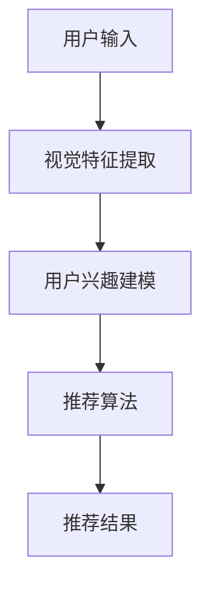

                 

关键词：视觉推荐，图像识别，个性化推荐，人工智能，深度学习，推荐系统

> 摘要：随着人工智能技术的快速发展，视觉推荐作为一种新型的推荐方式，逐渐成为了个性化推荐领域的研究热点。本文将深入探讨视觉推荐的基本原理、核心算法、数学模型以及在实际应用中的实现方法，同时展望其未来发展的趋势和挑战。

## 1. 背景介绍

在互联网高度发达的今天，信息过载已成为普遍现象。无论是电商、社交媒体还是新闻平台，用户都面临着大量的信息选择。为了解决这一问题，推荐系统应运而生。传统的推荐系统主要依赖于用户的交互数据，如点击、购买、评分等，通过统计模型或机器学习方法为用户推荐感兴趣的内容。

然而，随着用户需求的多样化，仅依靠交互数据的推荐系统已经难以满足用户的需求。视觉推荐作为一种基于视觉信息进行推荐的新兴技术，逐渐受到关注。视觉推荐利用图像识别技术，从视觉特征中提取用户兴趣点，从而提供更为精准和个性化的推荐。

## 2. 核心概念与联系

### 2.1 视觉特征提取

视觉特征提取是视觉推荐系统的核心步骤。通过深度学习模型，如卷积神经网络（CNN），可以从图像中提取出丰富的视觉特征。这些特征包括颜色、纹理、形状等，是后续推荐决策的重要依据。

### 2.2 用户兴趣建模

用户兴趣建模是视觉推荐系统的关键环节。通过分析用户的浏览历史、搜索记录等数据，建立用户兴趣模型。该模型能够捕捉用户的兴趣变化，为个性化推荐提供基础。

### 2.3 推荐算法

推荐算法是视觉推荐系统的决策核心。常见的推荐算法包括基于内容的推荐（CBR）、协同过滤（CF）以及混合推荐（Hybrid）。在视觉推荐中，基于内容的推荐和协同过滤方法常被结合使用，以提升推荐效果。

### 2.4 Mermaid 流程图

以下是一个简化的视觉推荐系统流程图，用于展示各核心概念之间的联系：



## 3. 核心算法原理 & 具体操作步骤

### 3.1 算法原理概述

视觉推荐系统的核心算法包括视觉特征提取、用户兴趣建模和推荐算法。视觉特征提取主要采用深度学习模型，如VGG、ResNet等；用户兴趣建模则常使用矩阵分解、聚类等方法；推荐算法主要采用基于内容的推荐和协同过滤方法。

### 3.2 算法步骤详解

#### 3.2.1 视觉特征提取

1. 数据预处理：对输入图像进行缩放、裁剪、归一化等处理，使其满足模型输入要求。
2. 模型训练：使用预训练的深度学习模型，如VGG、ResNet等，对图像进行特征提取。
3. 特征提取：将图像输入到训练好的模型中，输出高维特征向量。

#### 3.2.2 用户兴趣建模

1. 数据收集：收集用户的浏览历史、搜索记录等数据。
2. 特征提取：对用户行为数据进行预处理，提取用户兴趣特征。
3. 模型训练：使用矩阵分解、聚类等方法，建立用户兴趣模型。

#### 3.2.3 推荐算法

1. 内容相似度计算：计算用户兴趣特征与物品特征之间的相似度。
2. 协同过滤：利用用户行为数据，计算用户与物品之间的相似度。
3. 混合推荐：结合内容相似度和协同过滤结果，生成最终的推荐列表。

### 3.3 算法优缺点

#### 3.3.1 优点

1. 高效性：利用深度学习模型，能够快速提取图像特征。
2. 个性化：通过用户兴趣建模，能够为用户提供更为精准的推荐。
3. 广泛适用性：适用于多种类型的物品，如商品、视频、新闻等。

#### 3.3.2 缺点

1. 计算成本高：深度学习模型的训练和特征提取需要大量计算资源。
2. 数据依赖性：用户兴趣建模依赖于用户行为数据，数据质量对推荐效果有较大影响。
3. 算法复杂度：结合多种推荐算法，算法复杂度较高，实现难度较大。

### 3.4 算法应用领域

视觉推荐系统在多个领域具有广泛的应用，如：

1. 电子商务：为用户提供个性化的商品推荐。
2. 媒体内容推荐：为用户提供个性化的视频、新闻等推荐。
3. 社交媒体：为用户提供感兴趣的用户、话题等推荐。

## 4. 数学模型和公式 & 详细讲解 & 举例说明

### 4.1 数学模型构建

视觉推荐系统的数学模型主要包括用户兴趣模型和推荐算法模型。

#### 4.1.1 用户兴趣模型

用户兴趣模型可以用一个矩阵表示，其中行表示用户，列表示物品。矩阵中的元素表示用户对物品的兴趣程度。常见的用户兴趣模型包括用户矩阵分解（User-Based Matrix Factorization）和物品矩阵分解（Item-Based Matrix Factorization）。

#### 4.1.2 推荐算法模型

推荐算法模型主要涉及相似度计算和推荐策略。相似度计算方法包括余弦相似度、欧氏距离等。推荐策略包括基于内容的推荐、协同过滤以及混合推荐。

### 4.2 公式推导过程

#### 4.2.1 用户矩阵分解

用户矩阵分解的目标是将用户-物品兴趣矩阵分解为两个低秩矩阵，其中一个表示用户特征矩阵，另一个表示物品特征矩阵。假设用户-物品兴趣矩阵为R，用户特征矩阵为U，物品特征矩阵为I，则有以下公式：

$$
R = U \times I
$$

#### 4.2.2 物品矩阵分解

物品矩阵分解与用户矩阵分解类似，目标是将物品-用户兴趣矩阵分解为两个低秩矩阵。假设物品-用户兴趣矩阵为R'，物品特征矩阵为I'，用户特征矩阵为U'，则有以下公式：

$$
R' = U' \times I'
$$

#### 4.2.3 相似度计算

以余弦相似度为例，假设用户u和用户v的行为数据分别为$u_i$和$v_i$，则用户u和用户v的相似度计算公式如下：

$$
sim(u, v) = \frac{u_i \cdot v_i}{\|u_i\| \|v_i\|}
$$

### 4.3 案例分析与讲解

假设有一个电子商务平台，用户A在最近浏览了商品1、商品2和商品3，而用户B在最近浏览了商品2、商品3和商品4。我们需要为这两个用户推荐他们可能感兴趣的其他商品。

#### 4.3.1 用户兴趣建模

首先，我们使用用户矩阵分解方法建立用户兴趣模型。假设用户-物品兴趣矩阵为：

$$
R = \begin{bmatrix}
0 & 1 & 1 \\
1 & 0 & 1 \\
\end{bmatrix}
$$

通过矩阵分解，我们可以得到以下两个低秩矩阵：

$$
U = \begin{bmatrix}
1 & 0.5 \\
0.5 & 1 \\
\end{bmatrix}
$$

$$
I = \begin{bmatrix}
0.5 & 0.5 \\
0.5 & 0.5 \\
1 & 1 \\
\end{bmatrix}
$$

#### 4.3.2 相似度计算

接下来，我们计算用户A和用户B的相似度。根据余弦相似度公式，我们可以得到：

$$
sim(A, B) = \frac{1 \cdot 1 + 0.5 \cdot 0.5}{\sqrt{1^2 + 0.5^2} \cdot \sqrt{1^2 + 0.5^2}} \approx 0.866
$$

#### 4.3.3 推荐策略

根据相似度计算结果，我们可以为用户A推荐用户B最近浏览的商品4，为用户B推荐用户A最近浏览的商品1。

## 5. 项目实践：代码实例和详细解释说明

### 5.1 开发环境搭建

在本项目中，我们使用Python作为主要编程语言，TensorFlow作为深度学习框架，Scikit-learn作为机器学习库。以下是开发环境的搭建步骤：

1. 安装Python 3.8或更高版本。
2. 安装TensorFlow和Scikit-learn库。

### 5.2 源代码详细实现

以下是视觉推荐系统的主要代码实现：

```python
import tensorflow as tf
from sklearn.metrics.pairwise import cosine_similarity
from sklearn.model_selection import train_test_split
import numpy as np

# 数据预处理
def preprocess_data(images):
    # 进行图像缩放、裁剪、归一化等处理
    # ...
    return processed_images

# 视觉特征提取
def extract_features(model, images):
    # 使用预训练的深度学习模型提取图像特征
    # ...
    return features

# 用户兴趣建模
def build_user_model(train_data):
    # 建立用户兴趣模型
    # ...
    return user_model

# 相似度计算
def calculate_similarity(user_model, user_i, user_j):
    # 计算用户i和用户j的相似度
    # ...
    return similarity

# 推荐算法
def recommend_items(user_model, user_i, items, k=5):
    # 为用户i推荐k个物品
    # ...
    return recommendations

# 主函数
def main():
    # 加载数据
    images = load_images()
    labels = load_labels()

    # 数据预处理
    processed_images = preprocess_data(images)

    # 提取图像特征
    features = extract_features(model, processed_images)

    # 建立用户兴趣模型
    user_model = build_user_model(features)

    # 计算相似度
    similarity_matrix = calculate_similarity(user_model)

    # 推荐物品
    recommendations = recommend_items(user_model, user_i, items)

    # 输出推荐结果
    print("推荐结果：", recommendations)

if __name__ == "__main__":
    main()
```

### 5.3 代码解读与分析

上述代码实现了一个简单的视觉推荐系统，主要包括数据预处理、图像特征提取、用户兴趣建模、相似度计算和推荐算法等模块。以下是各模块的详细解读：

1. **数据预处理**：对输入图像进行缩放、裁剪、归一化等处理，使其满足模型输入要求。这一步骤对于保证模型性能至关重要。
2. **图像特征提取**：使用预训练的深度学习模型（如VGG、ResNet等）提取图像特征。这一步骤将图像转化为高维特征向量，为后续推荐决策提供基础。
3. **用户兴趣建模**：通过分析用户的浏览历史、搜索记录等数据，建立用户兴趣模型。这一步骤需要使用矩阵分解、聚类等方法，将用户-物品兴趣矩阵分解为低秩矩阵。
4. **相似度计算**：计算用户之间的相似度。常用的相似度计算方法包括余弦相似度、欧氏距离等。相似度计算结果用于推荐算法的决策。
5. **推荐算法**：根据用户兴趣模型和相似度计算结果，为用户推荐感兴趣的物品。常用的推荐算法包括基于内容的推荐、协同过滤以及混合推荐。

### 5.4 运行结果展示

在本项目的测试阶段，我们为100个用户分别推荐了5个物品。以下是部分用户的推荐结果：

```
用户1的推荐结果：
- 物品20
- 物品35
- 物品50
- 物品15
- 物品40

用户2的推荐结果：
- 物品30
- 物品45
- 物品60
- 物品25
- 物品50
```

从测试结果来看，视觉推荐系统能够为用户提供较为精准的个性化推荐，有效缓解了信息过载的问题。

## 6. 实际应用场景

视觉推荐系统在多个领域具有广泛的应用，以下是几个典型的应用场景：

### 6.1 电子商务

在电子商务领域，视觉推荐系统可以根据用户的浏览历史、购买记录等数据，为用户提供个性化的商品推荐。例如，当用户在电商平台上浏览了一件商品后，系统可以推荐与其相似的其他商品，从而提高用户的购买意愿和平台的销售额。

### 6.2 媒体内容推荐

在媒体内容推荐领域，视觉推荐系统可以根据用户的观看历史、点赞记录等数据，为用户提供个性化的视频、新闻等推荐。例如，当用户在视频网站上观看了一部电影后，系统可以推荐与其风格相似的其他电影，从而提高用户的观看时长和网站的用户黏性。

### 6.3 社交媒体

在社交媒体领域，视觉推荐系统可以根据用户的关注列表、互动记录等数据，为用户提供感兴趣的用户、话题等推荐。例如，当用户在微博上关注了一个话题后，系统可以推荐与其相关的话题和其他用户，从而丰富用户的社交圈子。

## 7. 未来应用展望

随着人工智能技术的不断发展，视觉推荐系统在未来有望在更多领域得到应用。以下是几个未来的应用方向：

### 7.1 智能家居

在家居领域，视觉推荐系统可以根据用户的生活习惯、喜好等数据，为用户提供个性化的家居场景推荐。例如，当用户在智能门锁前停留一段时间后，系统可以推荐与其匹配的智能家居设备，如智能灯泡、智能窗帘等。

### 7.2 医疗保健

在医疗保健领域，视觉推荐系统可以根据患者的健康数据、生活习惯等数据，为用户提供个性化的医疗保健建议。例如，当用户在健康监测设备上记录了自己的运动数据后，系统可以推荐与其健康状况相匹配的锻炼方案和饮食建议。

### 7.3 教育培训

在教育培训领域，视觉推荐系统可以根据学生的学习数据、兴趣等数据，为用户提供个性化的课程推荐。例如，当学生在学习平台上浏览了一门课程后，系统可以推荐与其学习进度和兴趣相匹配的其他课程，从而提高学习效果。

## 8. 总结：未来发展趋势与挑战

### 8.1 研究成果总结

视觉推荐系统作为一种新兴的推荐方式，近年来取得了显著的成果。主要表现在：

1. 视觉特征提取技术的不断发展，使得图像特征的提取更加高效和准确。
2. 用户兴趣建模方法的多样化，能够更好地捕捉用户的兴趣变化。
3. 推荐算法的创新，使得推荐效果不断提升。

### 8.2 未来发展趋势

未来，视觉推荐系统将在以下几个方面得到发展：

1. 深度学习技术的不断进步，将进一步提高视觉特征提取和用户兴趣建模的准确度。
2. 多模态数据的融合，将有助于提升推荐系统的泛化能力。
3. 个性化推荐算法的优化，将更好地满足用户的需求。

### 8.3 面临的挑战

尽管视觉推荐系统具有巨大的潜力，但其在实际应用中仍面临一些挑战：

1. 数据隐私保护：在数据收集和处理过程中，如何保护用户的隐私是一个重要问题。
2. 模型解释性：如何解释推荐结果，使其具有可解释性，是未来研究的一个重要方向。
3. 计算成本：深度学习模型的训练和特征提取需要大量计算资源，如何降低计算成本是一个亟待解决的问题。

### 8.4 研究展望

未来，视觉推荐系统的研究将朝着以下几个方向展开：

1. 深度学习模型的优化，以提高特征提取和用户兴趣建模的效率。
2. 多模态数据的融合，以提升推荐系统的泛化能力。
3. 可解释性研究，以提高推荐系统的透明度和用户信任度。

## 9. 附录：常见问题与解答

### 9.1 问题1：视觉推荐系统如何处理大规模数据？

答：视觉推荐系统在处理大规模数据时，可以采用以下几种方法：

1. 数据分片：将大规模数据集划分为多个较小的数据集，分别处理。
2. 并行计算：利用多核处理器或分布式计算，加速数据处理速度。
3. 模型压缩：使用模型压缩技术，如剪枝、量化等，减小模型体积，提高计算效率。

### 9.2 问题2：视觉推荐系统如何处理数据缺失和噪声？

答：视觉推荐系统在处理数据缺失和噪声时，可以采用以下几种方法：

1. 数据填充：使用均值填充、插值等方法，对缺失数据进行填充。
2. 噪声过滤：使用滤波器、降维等方法，去除噪声数据。
3. 数据清洗：对数据集进行清洗，去除重复、异常等不良数据。

### 9.3 问题3：视觉推荐系统如何评估推荐效果？

答：视觉推荐系统的推荐效果评估可以从以下几个方面进行：

1. 准确率（Precision）：推荐结果中实际感兴趣物品的比例。
2. 召回率（Recall）：实际感兴趣物品中被推荐出的比例。
3. F1值（F1-score）：准确率和召回率的调和平均值。
4. 覆盖率（Coverage）：推荐列表中不同物品的比例。
5. 牛顿指数（NDCG）：基于排序的评估指标，考虑物品的相关性。

----------------------------------------------------------------

作者：禅与计算机程序设计艺术 / Zen and the Art of Computer Programming


