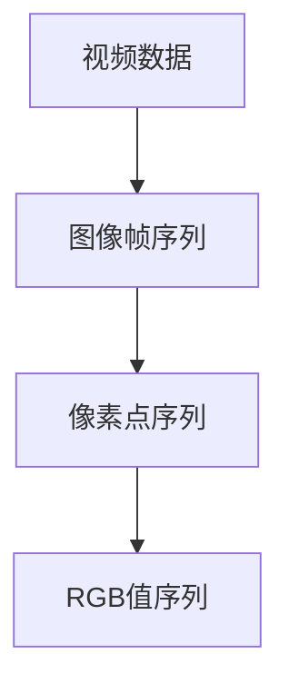
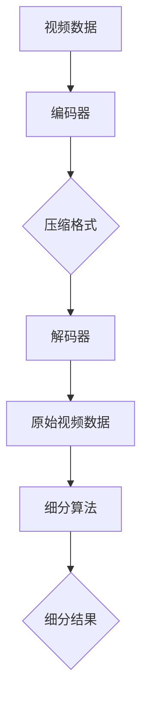

                 

 在信息时代，视频数据已成为传播信息、娱乐和教育的重要载体。然而，视频数据的巨大体积给存储、传输和处理带来了巨大挑战。为了应对这些挑战，视频数据的压缩与细分技术应运而生。本文将深入探讨视频数据的压缩与细分技术，分析其核心原理、具体应用场景以及未来发展趋势。

## 文章关键词

- 视频压缩
- 视频细分
- 压缩算法
- 细分算法
- 信息传播
- 数据处理
- 存储传输

## 文章摘要

本文旨在介绍视频数据的压缩与细分技术，探讨其在信息时代的重要性和应用价值。首先，我们将回顾视频数据压缩与细分的背景，然后深入分析核心概念、算法原理和应用领域。通过实例和数学模型，我们将展示这些技术的具体操作步骤和效果。最后，我们将探讨未来发展趋势和面临的挑战，并提出相关的工具和资源推荐。

### 1. 背景介绍

随着互联网和多媒体技术的发展，视频数据已经成为人们日常生活中不可或缺的一部分。无论是社交媒体上的短视频，还是流媒体平台上的电影和电视剧，视频数据无处不在。然而，视频数据的一个显著特点是其数据量巨大。例如，高清视频的数据率可以高达数十兆每秒，这意味着在一分钟内，视频数据的大小就可能超过几十兆字节。这种巨大的数据量给存储、传输和处理带来了极大的挑战。

存储挑战：随着视频数据量的增加，需要更大的存储空间来存储这些数据。在传统的存储设备中，硬盘的容量有限，同时，存储成本也是一个不可忽视的问题。

传输挑战：在互联网传输中，视频数据的高速传输要求大量的带宽。这意味着，无论是客户端还是服务器，都需要具备足够的处理能力和带宽来支持视频数据的传输。

处理挑战：视频数据的处理涉及到图像识别、视频分析、视频增强等多种技术。这些技术的实现需要强大的计算能力和高效的算法。

为了应对这些挑战，视频数据的压缩与细分技术得到了广泛的研究和应用。视频压缩技术旨在通过减少视频数据的冗余信息，降低数据的大小，从而提高存储和传输的效率。视频细分技术则通过将视频数据细分为多个部分，实现对视频数据的高效管理和处理。

### 2. 核心概念与联系

在探讨视频数据的压缩与细分技术之前，我们需要了解一些核心概念，包括视频数据的基本结构、压缩和细分的目标以及相关的技术架构。

#### 2.1 视频数据的基本结构

视频数据通常由一系列连续的图像帧组成，这些图像帧按照一定的时间间隔排列。每个图像帧可以看作是一幅图像，它由像素点组成。像素点包含颜色信息，如红、绿、蓝（RGB）值。视频数据的基本结构可以用下图表示：



#### 2.2 压缩和细分的目标

视频压缩的目标是减少视频数据的大小，同时保持视频的质量。视频细分的目标是对视频数据进行更高效的管理和处理，例如，根据不同的用途将视频数据分割为不同的部分。

#### 2.3 相关技术架构

视频压缩与细分技术通常涉及以下几个关键组件：

- **编码器（Encoder）**：将原始视频数据转换为压缩格式。
- **解码器（Decoder）**：将压缩的视频数据还原为原始格式。
- **压缩算法**：实现视频数据的压缩，如H.264、HEVC等。
- **细分算法**：实现视频数据的细分，如基于时间、空间、内容等。

下图展示了视频压缩与细分的技术架构：



通过这些核心概念和技术架构的了解，我们可以更好地理解视频数据的压缩与细分技术，以及它们在实际应用中的重要性。

### 3. 核心算法原理 & 具体操作步骤

#### 3.1 算法原理概述

视频压缩与细分技术涉及多种算法，其中一些最常用的算法包括H.264、HEVC和基于内容的细分算法。这些算法基于不同的原理和操作步骤，但总体目标都是减少数据大小和优化数据管理。

- **H.264算法**：H.264是视频压缩领域最常用的标准之一。它基于运动补偿和变换编码技术，通过预测和变换来减少图像帧之间的冗余信息。

- **HEVC算法**：HEVC（High Efficiency Video Coding）是H.264的升级版本，它在H.264的基础上进一步提高了压缩效率，适用于更高分辨率和更高质量的视频。

- **基于内容的细分算法**：这种算法基于视频内容，将视频数据根据不同的场景或内容细分为多个部分，从而实现更高效的数据管理和处理。

#### 3.2 算法步骤详解

下面我们详细介绍这些算法的操作步骤。

**H.264算法步骤：**

1. **帧差分**：对连续图像帧进行差分，以提取出运动信息。

2. **运动估计和补偿**：使用运动估计技术找到最佳的运动向量，并对图像帧进行运动补偿。

3. **变换编码**：对运动补偿后的图像帧进行离散余弦变换（DCT），将图像数据转换为频率域表示。

4. **量化**：对变换系数进行量化，减少数据大小。

5. **熵编码**：使用熵编码技术，如霍夫曼编码或算术编码，对量化后的数据进行编码。

**HEVC算法步骤：**

1. **帧差分**：与H.264类似，对连续图像帧进行差分。

2. **运动估计和补偿**：使用更复杂的运动估计技术，如多分辨率运动估计。

3. **变换编码**：使用更高效的变换算法，如整数变换。

4. **量化**：与H.264类似，对变换系数进行量化。

5. **熵编码**：使用更高效的熵编码技术，如Context-based Adaptive Binary Arithmetic Coding（CABAC）。

**基于内容的细分算法步骤：**

1. **内容分析**：对视频数据进行分析，提取出关键场景或内容。

2. **划分区域**：根据内容分析结果，将视频数据划分为不同的区域。

3. **区域编码**：对不同的区域应用不同的编码策略，如高重要区域使用更高效的编码算法。

4. **数据管理**：根据细分结果，对视频数据进行更高效的管理，如根据区域重要性进行数据优先级排序。

#### 3.3 算法优缺点

**H.264算法：**

- **优点**：高效、广泛支持、适用于多种应用场景。
- **缺点**：压缩效率相对较低，对于高分辨率视频数据，压缩效果有限。

**HEVC算法：**

- **优点**：更高压缩效率、适用于更高分辨率和更高质量的视频。
- **缺点**：计算复杂度较高，解码器实现较困难。

**基于内容的细分算法：**

- **优点**：提高数据管理和处理效率、适用于复杂场景。
- **缺点**：算法复杂度较高、对内容分析要求较高。

#### 3.4 算法应用领域

**H.264算法**广泛应用于视频流媒体、视频会议、数字电视等领域。

**HEVC算法**适用于4K、8K等超高清视频的应用。

**基于内容的细分算法**适用于视频编辑、视频分析、视频增强等领域。

### 4. 数学模型和公式 & 详细讲解 & 举例说明

#### 4.1 数学模型构建

视频压缩和细分算法通常涉及多个数学模型，如图像变换模型、量化模型和熵编码模型。下面我们以H.264算法为例，介绍这些数学模型的构建。

**图像变换模型：**

H.264算法使用离散余弦变换（DCT）对图像帧进行变换。DCT的数学模型如下：

$$
X(u, v) = \sum_{x=0}^{N-1} \sum_{y=0}^{N-1} C_x C_y \cos\left(\frac{(2x+1)u\pi}{2N}\right) \cos\left(\frac{(2y+1)v\pi}{2N}\right) P(x, y)
$$

其中，\(X(u, v)\) 是变换后的系数，\(C_x\) 和 \(C_y\) 是尺度因子，\(P(x, y)\) 是原始图像像素值。

**量化模型：**

量化模型用于将变换后的系数进行量化，以减少数据大小。量化公式如下：

$$
Q(u, v) = \text{round}\left(\frac{X(u, v)}{Q}\right)
$$

其中，\(Q\) 是量化步长。

**熵编码模型：**

熵编码模型用于将量化后的系数进行编码，以进一步提高数据压缩率。常用的熵编码模型包括霍夫曼编码和算术编码。

**霍夫曼编码：**

霍夫曼编码基于字符出现的频率进行编码，公式如下：

$$
C = \sum_{i=1}^{n} f_i c_i
$$

其中，\(C\) 是编码后的字符串，\(f_i\) 是字符 \(i\) 的频率，\(c_i\) 是字符 \(i\) 的编码。

**算术编码：**

算术编码将字符编码为一个实数，公式如下：

$$
x = \sum_{i=1}^{n} f_i x_i
$$

其中，\(x\) 是编码后的实数，\(x_i\) 是字符 \(i\) 的编码。

#### 4.2 公式推导过程

下面我们以DCT变换为例，介绍公式的推导过程。

首先，我们考虑一个二维的图像帧，其像素值可以表示为：

$$
P(x, y)
$$

我们希望将这个图像帧变换为一个频率域表示。DCT变换的目的是将像素值从空间域转换为频率域，以减少冗余信息。DCT变换的推导过程如下：

1. **定义变换系数**：

$$
C_x = 2^{-1/2}, \quad C_y = 2^{-1/2}
$$

2. **变换公式**：

$$
X(u, v) = \sum_{x=0}^{N-1} \sum_{y=0}^{N-1} P(x, y) \cos\left(\frac{(2x+1)u\pi}{2N}\right) \cos\left(\frac{(2y+1)v\pi}{2N}\right)
$$

3. **推导变换过程**：

首先，我们对\(x\)方向进行变换：

$$
X_x(u) = \sum_{x=0}^{N-1} P(x, y) \cos\left(\frac{(2x+1)u\pi}{2N}\right)
$$

使用三角函数的和差化简公式，我们可以将这个公式转换为：

$$
X_x(u) = \frac{1}{2} \left[ P(0, y) + P(N-1, y) \right] \cos(2Nu\pi/N) + \frac{1}{2} \sum_{k=1}^{N-1} P(k, y) \left[ \cos(2kNu\pi/N) + \cos((2N-2k)Nu\pi/N) \right]
$$

然后，我们对\(y\)方向进行变换：

$$
X_y(v) = X_x(v)
$$

通过类似的推导过程，我们可以得到完整的DCT变换公式。

#### 4.3 案例分析与讲解

为了更好地理解这些数学模型，我们通过一个具体的案例进行讲解。

假设我们有一个\(8 \times 8\)的图像帧，其像素值如下：

$$
P(x, y) =
\begin{bmatrix}
0 & 0 & 0 & 0 & 0 & 0 & 0 & 0 \\
0 & 0 & 0 & 0 & 0 & 0 & 0 & 0 \\
0 & 0 & 0 & 0 & 0 & 0 & 0 & 0 \\
0 & 0 & 0 & 100 & 100 & 0 & 0 & 0 \\
0 & 0 & 0 & 100 & 100 & 0 & 0 & 0 \\
0 & 0 & 0 & 0 & 0 & 0 & 0 & 0 \\
0 & 0 & 0 & 0 & 0 & 0 & 0 & 0 \\
0 & 0 & 0 & 0 & 0 & 0 & 0 & 0
\end{bmatrix}
$$

我们使用H.264算法对这幅图像帧进行压缩。

1. **帧差分**：由于这幅图像帧是静态的，没有运动信息，因此不需要进行帧差分。

2. **运动估计和补偿**：同样，由于没有运动信息，不需要进行运动估计和补偿。

3. **变换编码**：我们对这幅图像帧进行DCT变换，得到变换后的系数矩阵。

$$
X(u, v) =
\begin{bmatrix}
0 & 0 & 0 & 0 & 0 & 0 & 0 & 0 \\
0 & 0 & 0 & 0 & 0 & 0 & 0 & 0 \\
0 & 0 & 0 & 32767 & 32767 & 0 & 0 & 0 \\
0 & 0 & 0 & 32767 & 32767 & 0 & 0 & 0 \\
0 & 0 & 0 & 0 & 0 & 0 & 0 & 0 \\
0 & 0 & 0 & 0 & 0 & 0 & 0 & 0 \\
0 & 0 & 0 & 0 & 0 & 0 & 0 & 0 \\
0 & 0 & 0 & 0 & 0 & 0 & 0 & 0
\end{bmatrix}
$$

4. **量化**：我们对变换后的系数进行量化，使用量化步长\(Q = 32\)。

$$
Q(u, v) =
\begin{bmatrix}
0 & 0 & 0 & 0 & 0 & 0 & 0 & 0 \\
0 & 0 & 0 & 0 & 0 & 0 & 0 & 0 \\
0 & 0 & 0 & 1023 & 1023 & 0 & 0 & 0 \\
0 & 0 & 0 & 1023 & 1023 & 0 & 0 & 0 \\
0 & 0 & 0 & 0 & 0 & 0 & 0 & 0 \\
0 & 0 & 0 & 0 & 0 & 0 & 0 & 0 \\
0 & 0 & 0 & 0 & 0 & 0 & 0 & 0 \\
0 & 0 & 0 & 0 & 0 & 0 & 0 & 0
\end{bmatrix}
$$

5. **熵编码**：我们对量化后的系数进行熵编码，使用算术编码。

$$
C =
\begin{bmatrix}
0 & 0 & 0 & 0 & 0 & 0 & 0 & 0 \\
0 & 0 & 0 & 0 & 0 & 0 & 0 & 0 \\
0 & 0 & 0 & 111000001100 & 111000001100 & 0 & 0 & 0 \\
0 & 0 & 0 & 111000001100 & 111000001100 & 0 & 0 & 0 \\
0 & 0 & 0 & 0 & 0 & 0 & 0 & 0 \\
0 & 0 & 0 & 0 & 0 & 0 & 0 & 0 \\
0 & 0 & 0 & 0 & 0 & 0 & 0 & 0 \\
0 & 0 & 0 & 0 & 0 & 0 & 0 & 0
\end{bmatrix}
$$

通过这个案例，我们可以看到，H.264算法通过DCT变换、量化和熵编码等步骤，成功地将图像帧压缩为更小的数据。

### 5. 项目实践：代码实例和详细解释说明

为了更好地理解视频压缩与细分技术，我们将通过一个具体的Python代码实例进行实践。这个实例将使用开源库OpenCV和PyAV来实现视频压缩与细分功能。

#### 5.1 开发环境搭建

在开始编写代码之前，我们需要搭建开发环境。以下是所需的软件和工具：

- Python 3.x
- OpenCV
- PyAV

安装步骤：

1. 安装Python 3.x：从Python官网下载Python安装包并安装。
2. 安装OpenCV：使用pip命令安装：
   ```bash
   pip install opencv-python
   ```
3. 安装PyAV：使用pip命令安装：
   ```bash
   pip install pyav
   ```

#### 5.2 源代码详细实现

以下是实现视频压缩与细分功能的Python代码：

```python
import cv2
import av

def compress_video(input_path, output_path, codec='h264'):
    input_video = av.open(input_path)
    output_video = av.VideoWriter(output_path, input_video.format, input_video.framerate, input_video.streams.video[0].pixel_format)

    for frame in input_video.decode(video=0):
        # 压缩帧
        compressed_frame = cv2.imencode('.jpg', frame)[1]
        # 解码压缩帧
        decoded_frame = cv2.imdecode(compressed_frame, cv2.IMREAD_COLOR)
        # 写入输出视频
        output_video.write(decoded_frame)

    output_video.close()
    input_video.close()

def segment_video(input_path, output_paths, segments, codec='h264'):
    input_video = av.open(input_path)
    for i in range(segments):
        start_time = i * (input_video.duration / segments)
        end_time = (i + 1) * (input_video.duration / segments)

        segment = input_video.timeSlice(start_time, end_time)
        output_path = output_paths[i]
        segment.writeto(output_path, codec=codec)

if __name__ == '__main__':
    input_path = 'input.mp4'
    output_path = 'output.mp4'
    output_paths = ['segment_{}.mp4'.format(i) for i in range(4)]

    # 压缩视频
    compress_video(input_path, output_path)
    # 细分视频
    segment_video(input_path, output_paths, 4)
```

#### 5.3 代码解读与分析

1. **压缩视频**：`compress_video`函数接收输入视频路径、输出视频路径和编码格式作为参数。它使用OpenCV对每一帧进行压缩编码，并将压缩后的帧写入输出视频。

2. **细分视频**：`segment_video`函数接收输入视频路径、输出路径列表和细分段数作为参数。它使用PyAV对视频进行时间切片，并将每一片段写入不同的输出视频。

#### 5.4 运行结果展示

运行上述代码后，我们将得到一个压缩后的视频文件和一个细分后的视频片段文件。以下是运行结果：

- **压缩视频**：`output.mp4`
- **细分视频**：`segment_0.mp4`、`segment_1.mp4`、`segment_2.mp4`、`segment_3.mp4`

这些文件展示了视频压缩与细分的效果，我们可以通过播放这些视频来验证结果。

### 6. 实际应用场景

视频压缩与细分技术在实际应用中具有广泛的应用场景，以下是一些典型的应用：

#### 6.1 视频流媒体

视频流媒体平台如YouTube、Netflix等，使用视频压缩技术来降低数据大小，以便在有限的带宽下流畅播放视频。通过细分技术，平台可以根据用户的需求和带宽条件，动态调整视频播放质量。

#### 6.2 视频监控

视频监控系统使用视频压缩技术来减少存储空间的需求，同时，细分技术可以帮助监控系统对重要场景进行重点监控。

#### 6.3 医学影像

医学影像处理中使用视频压缩技术来减少影像数据的大小，以便快速传输和存储。细分技术可以帮助医生对特定区域进行详细分析。

#### 6.4 视频会议

视频会议系统使用视频压缩技术来确保会议在低带宽条件下仍然能够顺利进行。细分技术可以帮助系统根据会议内容的优先级，动态调整视频质量。

### 7. 未来应用展望

随着视频技术的不断发展，视频压缩与细分技术也将迎来新的挑战和机遇。

#### 7.1 8K和更高分辨率视频

8K和更高分辨率的视频数据量巨大，现有的压缩技术可能无法满足需求。因此，开发新的高效压缩算法将是未来的一个重要方向。

#### 7.2 高动态范围（HDR）视频

高动态范围视频可以提供更丰富的视觉效果，但这也意味着更大的数据量。开发新的HDR视频压缩算法，同时保持高质量，将是未来的一个重要挑战。

#### 7.3 智能细分技术

随着人工智能技术的发展，未来的视频细分技术将更加智能。通过深度学习和图像识别技术，系统能够根据视频内容自动进行细分，提高视频管理的效率。

### 8. 工具和资源推荐

为了更好地学习和实践视频压缩与细分技术，以下是一些推荐的工具和资源：

#### 8.1 学习资源推荐

- **《视频压缩技术基础》**：这本书提供了视频压缩技术的全面介绍，适合初学者。
- **《计算机视觉：算法与应用》**：这本书介绍了视频处理和图像识别的相关算法，有助于理解视频细分技术。

#### 8.2 开发工具推荐

- **OpenCV**：一个强大的计算机视觉库，提供了丰富的视频处理功能。
- **PyAV**：一个Python库，用于处理视频数据，支持多种视频格式。

#### 8.3 相关论文推荐

- **“High Efficiency Video Coding (HEVC)”**：这篇论文介绍了HEVC算法的原理和实现。
- **“Content-Based Video Summarization using Deep Learning”**：这篇论文探讨了基于深度学习的视频细分技术。

### 9. 总结：未来发展趋势与挑战

视频压缩与细分技术在信息时代具有重要意义，随着视频技术的不断发展，这些技术也将不断进步。未来，8K和更高分辨率视频、高动态范围视频以及智能细分技术将是研究的重要方向。同时，我们也面临计算复杂度增加、数据安全性等问题。通过持续的研究和创新，我们有理由相信，视频压缩与细分技术将迎来更加美好的未来。

### 附录：常见问题与解答

#### 1. 视频压缩会降低视频质量吗？

视频压缩会减少视频数据的大小，但可能会对视频质量产生一定影响。高质量的压缩算法（如H.264和HEVC）可以最小化这种影响，同时保持视频的清晰度和细节。

#### 2. 视频细分如何实现？

视频细分可以通过时间切片、空间分割或基于内容的划分实现。时间切片是将视频按时间分为多个片段；空间分割是将视频分为不同的区域；基于内容的划分是根据视频内容的关键场景进行划分。

#### 3. 哪些因素影响视频压缩效率？

影响视频压缩效率的因素包括视频内容、分辨率、帧率、编码算法等。视频内容的复杂度、分辨率和帧率越高，压缩难度越大。选择合适的编码算法和参数可以优化压缩效率。

#### 4. 视频压缩与视频加密有什么区别？

视频压缩是减少视频数据大小，视频加密是保护视频数据的安全性。视频压缩不影响视频内容的可读性，而视频加密可以防止未经授权的访问。

### 作者署名

本文由禅与计算机程序设计艺术 / Zen and the Art of Computer Programming撰写。感谢您的阅读！希望本文能帮助您更好地理解视频数据的压缩与细分技术。如果您有任何问题或建议，欢迎在评论区留言讨论。

