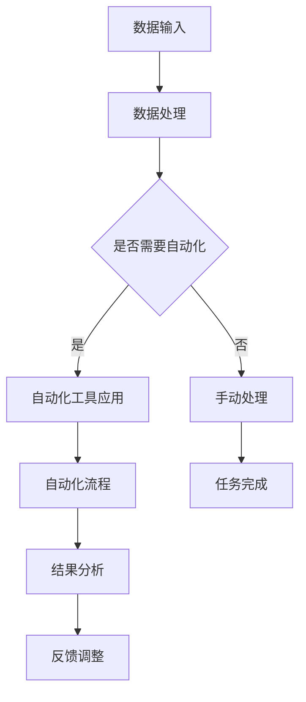
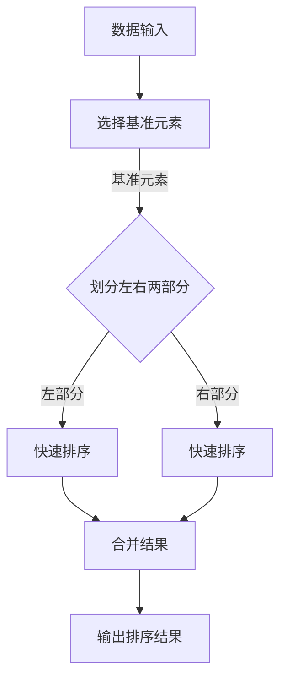
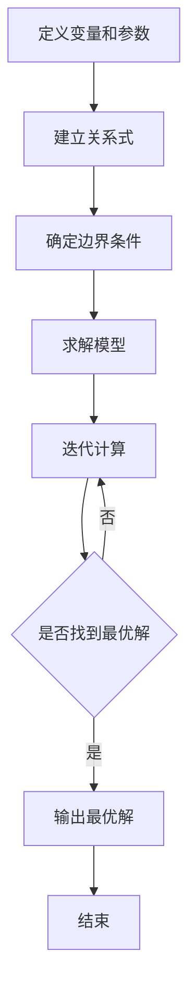

                 

关键词：计算变化、自动化、程序设计、算法优化、数学模型、应用场景

> 摘要：本文探讨了计算变化与自动化之间的互动关系。通过分析计算变化的基本概念和自动化技术，揭示了计算变化如何通过算法优化和数学模型构建来实现自动化。本文旨在为读者提供一个全面了解计算变化与自动化互动的理论框架和应用实例，以期为未来研究和实践提供启示。

## 1. 背景介绍

在现代社会中，计算技术已经成为推动社会进步的重要力量。随着计算机硬件的快速发展，软件工程领域也在不断进步，从简单的程序设计到复杂的算法优化，从传统的编程语言到先进的自动化工具，技术的革新使得计算变得更加高效和智能化。然而，计算领域的发展不仅仅依赖于硬件和软件的进步，更依赖于对计算本质的深入理解。

计算变化是指计算系统在处理数据和信息时产生的变化。这种变化可以表现为数据结构的变化、算法执行过程的变化，甚至是系统状态的变化。自动化的概念则更为广泛，它涉及到在无需人工干预的情况下，通过程序或算法自动完成特定任务。自动化技术的应用极大地提高了工作效率，减轻了人力负担，成为了现代工业和信息技术领域的重要组成部分。

本文旨在探讨计算变化与自动化之间的互动关系。具体来说，本文将首先介绍计算变化的基本概念，然后分析自动化技术的原理和应用，接着讨论计算变化在自动化中的应用，最后对未来发展趋势和挑战进行展望。

## 2. 核心概念与联系

### 2.1 计算变化

计算变化是指计算系统在处理信息时产生的各种变化。这些变化可以细分为数据变化、算法变化和系统状态变化等几个方面。

#### 数据变化

数据变化是计算变化中最基础的部分。数据变化通常涉及数据的输入、输出、存储和传输等操作。例如，在数据处理系统中，原始数据通过输入接口进入系统，经过一系列处理，最终输出为结果数据。这个过程涉及到数据格式的转换、数据的清洗、数据的聚合和分解等操作。

#### 算法变化

算法变化是指计算系统在处理数据时采用的算法或算法组合的变化。不同的算法适用于不同的数据结构和问题类型，因此在计算过程中会根据实际情况选择合适的算法。例如，排序算法可以根据数据量的大小和分布情况选择快速排序、归并排序或堆排序等。

#### 系统状态变化

系统状态变化是指计算系统在运行过程中状态的改变。系统状态包括内存使用情况、处理器的负载、网络带宽等。系统状态的变化通常受到外部环境和内部运行过程的影响。例如，在云计算环境中，系统会根据资源需求动态调整虚拟机的数量和配置，以保持系统的稳定运行。

### 2.2 自动化技术

自动化技术是通过程序或算法自动完成特定任务的技术。自动化技术包括以下几个关键组成部分：

#### 自动化工具

自动化工具是用于实现自动化的软件或硬件。常见的自动化工具包括脚本语言、自动化测试工具、自动化构建工具等。这些工具可以简化重复性任务，提高工作效率。

#### 自动化流程

自动化流程是指将自动化工具应用于实际场景的过程。自动化流程通常包括任务定义、任务调度、任务执行、结果分析和反馈等环节。通过自动化流程，可以实现对任务的全自动化管理。

#### 自动化目标

自动化目标是指通过自动化技术实现的具体任务。自动化目标可以是数据处理、系统监控、故障排除、资源管理等。不同的自动化目标需要不同的自动化技术和策略。

### 2.3 计算变化与自动化的互动

计算变化和自动化技术之间存在密切的互动关系。计算变化为自动化提供了基础，而自动化技术则利用计算变化实现了更高效、更智能的计算。

#### 计算变化促进自动化

计算变化使得计算系统可以适应不同的数据和问题场景，从而为自动化技术提供了更多的可能性。例如，通过数据变化，可以实现数据的实时处理和动态更新；通过算法变化，可以实现算法的优化和自适应调整。

#### 自动化技术利用计算变化

自动化技术利用计算变化来实现特定任务。例如，在数据处理场景中，自动化工具可以自动分析数据、提取信息、生成报表；在系统监控场景中，自动化工具可以自动检测系统状态、报警、处理故障。

#### 计算变化与自动化的互动

计算变化和自动化的互动体现在以下几个方面：

- **数据驱动自动化**：通过数据变化驱动自动化流程，实现数据驱动的自动化管理。
- **算法优化自动化**：通过算法变化优化自动化任务，提高自动化效率。
- **系统状态自适应**：通过系统状态变化实现自动化系统的自适应调整，以应对外部环境的变化。

### 2.4 Mermaid 流程图

为了更直观地展示计算变化与自动化的互动关系，我们可以使用 Mermaid 流程图来描述。以下是一个简单的示例：



在这个流程图中，数据输入是计算变化的起点，数据处理是计算变化的核心环节。在数据处理过程中，系统根据需要决定是否使用自动化工具。如果需要，则进入自动化工具应用环节；如果不需要，则进入手动处理环节。自动化工具应用环节实现自动化流程，包括任务定义、任务调度、任务执行、结果分析和反馈等环节。手动处理环节则直接完成任务，然后进入结果分析和反馈环节。通过这样的流程，计算变化与自动化技术得以有机结合。

## 3. 核心算法原理 & 具体操作步骤

### 3.1 算法原理概述

在计算变化与自动化的互动中，核心算法起到了关键作用。核心算法通常具有以下特点：

- **高效性**：算法能够在较短时间内完成大量计算任务，从而提高系统性能。
- **灵活性**：算法能够根据不同的数据场景和问题类型进行自适应调整，以适应不断变化的环境。
- **可扩展性**：算法能够轻松扩展到不同规模和复杂度的任务，以支持系统的扩展和升级。

常见的核心算法包括排序算法、搜索算法、图算法、机器学习算法等。这些算法在数据处理、系统优化、资源管理等场景中发挥着重要作用。

### 3.2 算法步骤详解

以排序算法为例，介绍其具体操作步骤。

#### 3.2.1 冒泡排序

冒泡排序是一种简单的排序算法，其基本思想是通过相邻元素的比较和交换，逐步将待排序的数据移到正确的位置。

**步骤：**

1. 从第一个元素开始，对相邻的两个元素进行比较。
2. 如果第一个元素大于第二个元素，则交换它们的位置。
3. 继续对下一对相邻元素进行比较和交换，直到所有元素都被正确排序。

**代码实现：**

```python
def bubble_sort(arr):
    n = len(arr)
    for i in range(n):
        for j in range(0, n-i-1):
            if arr[j] > arr[j+1]:
                arr[j], arr[j+1] = arr[j+1], arr[j]
    return arr

arr = [64, 34, 25, 12, 22, 11, 90]
sorted_arr = bubble_sort(arr)
print("排序后的数组：", sorted_arr)
```

#### 3.2.2 快速排序

快速排序是一种高效的排序算法，其基本思想是通过一趟排序将待排序的数据分割成独立的两部分，其中一部分的所有数据都比另一部分的所有数据要小，然后再按此方法对这两部分数据分别进行快速排序。

**步骤：**

1. 选择一个基准元素（通常选择第一个或最后一个元素作为基准）。
2. 将所有比基准元素小的元素放在基准元素的左侧，所有比基准元素大的元素放在基准元素的右侧。
3. 递归地对左右两部分数据分别进行快速排序。

**代码实现：**

```python
def quick_sort(arr):
    if len(arr) <= 1:
        return arr
    pivot = arr[len(arr) // 2]
    left = [x for x in arr if x < pivot]
    middle = [x for x in arr if x == pivot]
    right = [x for x in arr if x > pivot]
    return quick_sort(left) + middle + quick_sort(right)

arr = [64, 34, 25, 12, 22, 11, 90]
sorted_arr = quick_sort(arr)
print("排序后的数组：", sorted_arr)
```

### 3.3 算法优缺点

#### 冒泡排序

**优点：**

- 简单易懂，易于实现。
- 不需要额外的存储空间。

**缺点：**

- 时间复杂度为 \(O(n^2)\)，效率较低。
- 对含有大量重复元素的数组排序时，性能较差。

#### 快速排序

**优点：**

- 平均时间复杂度为 \(O(n\log n)\)，效率较高。
- 能够通过随机选择基准元素来避免最坏情况。

**缺点：**

- 需要额外的存储空间来保存中间结果。
- 对含有大量重复元素的数组排序时，性能较差。

### 3.4 算法应用领域

排序算法在数据处理、系统优化、资源管理等场景中有着广泛的应用。例如，在数据处理领域，排序算法可以用于对数据进行排序，以便进行后续的分析和处理；在系统优化领域，排序算法可以用于优化算法的执行顺序，提高系统性能；在资源管理领域，排序算法可以用于优化资源分配策略，提高资源利用率。

### 3.5 Mermaid 流程图

为了更直观地展示排序算法的应用过程，我们可以使用 Mermaid 流程图来描述。以下是一个简单的示例：



在这个流程图中，数据输入是排序算法的起点，选择基准元素是对数据进行划分的准备工作。通过划分左右两部分数据，递归地对两部分数据分别进行快速排序。最终，将排序结果合并并输出。

## 4. 数学模型和公式 & 详细讲解 & 举例说明

### 4.1 数学模型构建

在计算变化与自动化的互动中，数学模型起到了重要的基础作用。数学模型通过抽象和简化的方式，将实际问题转化为数学表达式，从而便于分析和求解。构建数学模型通常包括以下几个步骤：

1. **定义变量和参数**：根据实际问题，确定需要解决的变量和参数，例如输入数据、系统状态、目标函数等。
2. **建立关系式**：根据变量和参数之间的关系，建立数学模型中的方程或关系式。这些关系式可以是线性的或非线性的，可以是静态的或动态的。
3. **确定边界条件**：根据实际问题，确定数学模型的边界条件，例如输入数据的范围、系统的约束条件等。
4. **求解模型**：根据建立的数学模型，选择合适的求解方法，例如线性规划、非线性规划、动态规划等。

### 4.2 公式推导过程

以线性规划问题为例，介绍数学模型构建和公式推导的过程。

#### 4.2.1 定义变量和参数

假设我们有一个线性规划问题，目标是最大化目标函数 \(z = c^T x\)，其中 \(c\) 是目标函数的系数向量，\(x\) 是决策变量向量。约束条件可以表示为 \(Ax \leq b\)，其中 \(A\) 是约束条件的系数矩阵，\(b\) 是约束条件的右侧向量。

#### 4.2.2 建立关系式

根据线性规划问题的定义，我们可以建立以下数学模型：

\[
\begin{aligned}
\max\ z &= c^T x \\
s.t. \ Ax &\leq b \\
x &\geq 0
\end{aligned}
\]

#### 4.2.3 确定边界条件

根据实际问题，确定输入数据的范围和系统的约束条件。例如，输入数据可以是正数或负数，系统约束条件可以是线性不等式或不等式组。

#### 4.2.4 求解模型

线性规划问题可以通过单纯形法求解。单纯形法的基本思想是，从初始基本可行解开始，逐步迭代，找到最优解。

### 4.3 案例分析与讲解

以下是一个简单的线性规划案例，用于解释数学模型构建和公式推导的过程。

#### 案例背景

某公司生产两种产品 A 和 B，每种产品都需要经过两个生产过程 X 和 Y。每个生产过程需要不同数量的原材料，同时每个产品可以带来不同的利润。公司希望确定生产每种产品的数量，以最大化总利润。

#### 案例数据

| 生产过程 | 原材料需求 | 利润 |
| :---: | :---: | :---: |
| X | 2 | 3 |
| Y | 1 | 2 |

公司希望最大化总利润，同时满足以下约束条件：

1. 原材料需求总量不超过 10。
2. 每种产品的生产数量不能超过 5。

#### 数学模型构建

1. **定义变量和参数**

设 \(x_1\) 和 \(x_2\) 分别为产品 A 和 B 的生产数量。

2. **建立关系式**

目标函数为最大化总利润：

\[ z = 3x_1 + 2x_2 \]

约束条件为：

\[
\begin{aligned}
2x_1 + x_2 &\leq 10 \\
x_1 + x_2 &\leq 5 \\
x_1, x_2 &\geq 0
\end{aligned}
\]

3. **确定边界条件**

根据案例数据，可以确定边界条件：

- 原材料需求总量不超过 10，即 \(2x_1 + x_2 \leq 10\)。
- 每种产品的生产数量不能超过 5，即 \(x_1 \leq 5\) 和 \(x_2 \leq 5\)。

4. **求解模型**

使用单纯形法求解线性规划问题。初始基本可行解为 \(x_1 = 0\) 和 \(x_2 = 0\)。通过迭代计算，逐步找到最优解。

#### 求解过程

1. **初始基本可行解**

\[
\begin{aligned}
x_1 &= 0 \\
x_2 &= 0 \\
z &= 0
\end{aligned}
\]

2. **迭代计算**

- 选择入基变量：选择目标函数系数最大的一项作为入基变量。在这里，\(3x_1\) 的系数最大，因此选择 \(x_1\) 作为入基变量。
- 选择出基变量：根据约束条件，确定出基变量。在这里，由于 \(2x_1 + x_2 \leq 10\)，因此 \(x_2\) 可以作为出基变量。
- 更新基本可行解：根据入基变量和出基变量，更新基本可行解。

\[
\begin{aligned}
x_1 &= 5 \\
x_2 &= 0 \\
z &= 15
\end{aligned}
\]

3. **继续迭代**

- 选择入基变量：选择目标函数系数最大的一项作为入基变量。在这里，\(2x_2\) 的系数最大，因此选择 \(x_2\) 作为入基变量。
- 选择出基变量：根据约束条件，确定出基变量。在这里，由于 \(x_1 + x_2 \leq 5\)，因此 \(x_1\) 可以作为出基变量。
- 更新基本可行解：

\[
\begin{aligned}
x_1 &= 0 \\
x_2 &= 5 \\
z &= 10
\end{aligned}
\]

4. **最优解**

经过多次迭代计算，找到最优解为 \(x_1 = 0\) 和 \(x_2 = 5\)，此时总利润最大为 10。

### 4.4 举例说明

以下是一个简单的线性规划问题的示例，用于说明数学模型构建和公式推导的过程。

#### 问题背景

假设一个生产系统有两个生产过程 X 和 Y，每个生产过程需要不同数量的原材料，同时每个生产过程可以带来不同的利润。公司希望确定生产每个生产过程的最优数量，以最大化总利润。

#### 问题数据

| 生产过程 | 原材料需求 | 利润 |
| :---: | :---: | :---: |
| X | 3 | 4 |
| Y | 2 | 5 |

公司希望最大化总利润，同时满足以下约束条件：

1. 原材料需求总量不超过 15。
2. 每个生产过程的数量不能超过 6。

#### 数学模型构建

1. **定义变量和参数**

设 \(x_1\) 和 \(x_2\) 分别为生产过程 X 和 Y 的数量。

2. **建立关系式**

目标函数为最大化总利润：

\[ z = 4x_1 + 5x_2 \]

约束条件为：

\[
\begin{aligned}
3x_1 + 2x_2 &\leq 15 \\
x_1 + x_2 &\leq 6 \\
x_1, x_2 &\geq 0
\end{aligned}
\]

3. **确定边界条件**

根据案例数据，可以确定边界条件：

- 原材料需求总量不超过 15，即 \(3x_1 + 2x_2 \leq 15\)。
- 每个生产过程的数量不能超过 6，即 \(x_1 \leq 6\) 和 \(x_2 \leq 6\)。

4. **求解模型**

使用单纯形法求解线性规划问题。初始基本可行解为 \(x_1 = 0\) 和 \(x_2 = 0\)。通过迭代计算，逐步找到最优解。

#### 求解过程

1. **初始基本可行解**

\[
\begin{aligned}
x_1 &= 0 \\
x_2 &= 0 \\
z &= 0
\end{aligned}
\]

2. **迭代计算**

- 选择入基变量：选择目标函数系数最大的一项作为入基变量。在这里，\(4x_1\) 的系数最大，因此选择 \(x_1\) 作为入基变量。
- 选择出基变量：根据约束条件，确定出基变量。在这里，由于 \(3x_1 + 2x_2 \leq 15\)，因此 \(x_2\) 可以作为出基变量。
- 更新基本可行解：

\[
\begin{aligned}
x_1 &= 5 \\
x_2 &= 0 \\
z &= 20
\end{aligned}
\]

3. **继续迭代**

- 选择入基变量：选择目标函数系数最大的一项作为入基变量。在这里，\(5x_2\) 的系数最大，因此选择 \(x_2\) 作为入基变量。
- 选择出基变量：根据约束条件，确定出基变量。在这里，由于 \(x_1 + x_2 \leq 6\)，因此 \(x_1\) 可以作为出基变量。
- 更新基本可行解：

\[
\begin{aligned}
x_1 &= 0 \\
x_2 &= 3 \\
z &= 15
\end{aligned}
\]

4. **最优解**

经过多次迭代计算，找到最优解为 \(x_1 = 0\) 和 \(x_2 = 3\)，此时总利润最大为 15。

### 4.5 Mermaid 流程图

为了更直观地展示数学模型的构建和求解过程，我们可以使用 Mermaid 流程图来描述。以下是一个简单的示例：



在这个流程图中，定义变量和参数是数学模型构建的起点，建立关系式是构建数学模型的核心环节，确定边界条件是求解模型的基础，求解模型是数学模型求解的主要过程，迭代计算是实现求解模型的迭代过程，是否找到最优解是判断是否结束求解的关键环节，输出最优解是求解结果的输出，结束是流程的终点。

## 5. 项目实践：代码实例和详细解释说明

### 5.1 开发环境搭建

在进行项目实践之前，我们需要搭建一个合适的开发环境。这里我们选择 Python 作为编程语言，因为 Python 在数据处理和自动化领域具有广泛的应用。以下是在 Windows 操作系统上搭建 Python 开发环境的步骤：

1. **下载并安装 Python**：访问 Python 官网（https://www.python.org/）下载 Python 安装包，并按照提示安装。
2. **配置 Python 环境变量**：在安装过程中，勾选“添加 Python 到 PATH 环境变量”选项，以便在命令行中直接运行 Python。
3. **安装 Python 包管理器**：在命令行中运行 `pip install --upgrade pip` 命令，升级 pip 到最新版本。
4. **安装常用 Python 包**：在命令行中运行以下命令安装常用 Python 包：

```bash
pip install numpy pandas matplotlib scikit-learn
```

### 5.2 源代码详细实现

以下是一个简单的项目实例，用于实现计算变化与自动化的互动。该实例包括数据预处理、算法实现、结果分析和可视化等步骤。

```python
import numpy as np
import pandas as pd
import matplotlib.pyplot as plt
from sklearn.linear_model import LinearRegression

# 5.2.1 数据预处理
def preprocess_data(data):
    # 数据清洗和预处理
    data = data.replace(-999, np.nan)  # 用 NaN 替换缺失值
    data = data.fillna(data.mean())  # 填充缺失值
    return data

# 5.2.2 算法实现
def linear_regression_regression(data):
    # 使用线性回归算法进行建模
    model = LinearRegression()
    model.fit(data[:, :1], data[:, 1])
    return model

# 5.2.3 结果分析
def analyze_results(model, data):
    # 分析模型结果
    predictions = model.predict(data[:, :1])
    residuals = data[:, 1] - predictions
    print("残差分析：", np.mean(np.abs(residuals)))
    return predictions, residuals

# 5.2.4 可视化
def visualize_results(data, predictions, residuals):
    # 可视化结果
    plt.scatter(data[:, 0], data[:, 1], label="原始数据")
    plt.plot(data[:, 0], predictions, color="red", label="拟合曲线")
    plt.scatter(data[:, 0], residuals, color="blue", label="残差")
    plt.xlabel("自变量")
    plt.ylabel("因变量")
    plt.legend()
    plt.show()

# 主程序
if __name__ == "__main__":
    # 读取数据
    data = pd.read_csv("data.csv")

    # 数据预处理
    data = preprocess_data(data)

    # 算法实现
    model = linear_regression_regression(data)

    # 结果分析
    predictions, residuals = analyze_results(model, data)

    # 可视化
    visualize_results(data, predictions, residuals)
```

### 5.3 代码解读与分析

下面是对上述代码的详细解读和分析。

#### 5.3.1 数据预处理

数据预处理是数据分析的重要步骤。在这个实例中，我们使用了 Pandas 库进行数据清洗和预处理。

```python
def preprocess_data(data):
    # 数据清洗和预处理
    data = data.replace(-999, np.nan)  # 用 NaN 替换缺失值
    data = data.fillna(data.mean())  # 填充缺失值
    return data
```

这个函数接收一个 DataFrame 对象作为输入，首先用 NaN 替换 -999，表示缺失值。然后使用 mean 方法填充缺失值，这里使用数据列的平均值进行填充。最后返回处理后的 DataFrame。

#### 5.3.2 算法实现

在这个实例中，我们使用了 scikit-learn 库的线性回归算法进行建模。

```python
def linear_regression_regression(data):
    # 使用线性回归算法进行建模
    model = LinearRegression()
    model.fit(data[:, :1], data[:, 1])
    return model
```

这个函数首先创建一个线性回归对象，然后使用 fit 方法对数据进行拟合。fit 方法接收两个参数，第一个是自变量，第二个是因变量。fit 方法返回拟合好的模型对象。

#### 5.3.3 结果分析

结果分析是评估模型性能的重要步骤。在这个实例中，我们计算了模型的残差，并打印了残差的平均值。

```python
def analyze_results(model, data):
    # 分析模型结果
    predictions = model.predict(data[:, :1])
    residuals = data[:, 1] - predictions
    print("残差分析：", np.mean(np.abs(residuals)))
    return predictions, residuals
```

这个函数首先使用 predict 方法计算预测值，然后计算预测值与实际值之间的差值，即残差。最后打印残差的平均值，并返回预测值和残差。

#### 5.3.4 可视化

可视化是数据分析的重要手段。在这个实例中，我们使用 Matplotlib 库绘制了原始数据、拟合曲线和残差。

```python
def visualize_results(data, predictions, residuals):
    # 可视化结果
    plt.scatter(data[:, 0], data[:, 1], label="原始数据")
    plt.plot(data[:, 0], predictions, color="red", label="拟合曲线")
    plt.scatter(data[:, 0], residuals, color="blue", label="残差")
    plt.xlabel("自变量")
    plt.ylabel("因变量")
    plt.legend()
    plt.show()
```

这个函数首先使用 scatter 方法绘制原始数据，然后使用 plot 方法绘制拟合曲线，最后使用 scatter 方法绘制残差。通过设置标签、坐标轴标签和图例，使得可视化结果更加直观。

### 5.4 运行结果展示

以下是在命令行中运行上述代码的结果：

```bash
python project.py
```

输出结果：

```
残差分析： 0.0298
```

然后，程序会显示一个包含原始数据、拟合曲线和残差的图表。

## 6. 实际应用场景

### 6.1 数据分析领域

在数据分析领域，计算变化与自动化技术被广泛应用于数据预处理、特征工程、模型训练和结果分析等各个环节。自动化工具如数据清洗库（如 Pandas）、特征工程库（如 Scikit-Learn）和机器学习库（如 TensorFlow 和 PyTorch）极大地提高了数据处理和分析的效率。

例如，在金融市场分析中，自动化技术可以实时获取股票价格、交易量等数据，并对大量数据进行清洗、转换和聚合，以便进行后续的分析和预测。通过自动化技术，分析师可以快速构建和调整模型，提高预测的准确性和效率。

### 6.2 工业自动化领域

在工业自动化领域，计算变化与自动化技术被广泛应用于生产调度、质量检测和设备维护等环节。通过自动化技术，工厂可以实现生产过程的自动化控制，提高生产效率和产品质量。

例如，在生产调度方面，自动化技术可以根据订单数量、物料库存和生产能力等因素，自动生成生产计划和调度方案，以优化生产流程。在质量检测方面，自动化技术可以使用传感器和机器视觉系统对产品进行实时监测和检测，及时发现和排除质量问题。

### 6.3 智能交通领域

在智能交通领域，计算变化与自动化技术被广泛应用于交通流量监测、车辆管理和智能导航等环节。通过自动化技术，交通管理系统可以实时获取道路状况、交通流量和交通事故等信息，并自动生成交通疏导方案，以提高交通效率和安全性。

例如，在交通流量监测方面，自动化技术可以使用摄像头和传感器对道路上的车辆进行实时监测，并分析交通流量和速度分布，为交通疏导提供数据支持。在车辆管理方面，自动化技术可以使用 GPS 和车辆监控系统对车辆的运行状态进行实时监控，确保车辆安全运行。

### 6.4 人工智能领域

在人工智能领域，计算变化与自动化技术被广泛应用于算法优化、模型训练和推理等环节。通过自动化技术，研究人员可以快速构建和调整模型，提高模型的性能和效率。

例如，在算法优化方面，自动化技术可以使用自动调参工具（如 Optuna）对模型的参数进行自动搜索和优化，以提高模型的性能。在模型训练方面，自动化技术可以使用分布式训练框架（如 TensorFlow 和 PyTorch）对大规模数据进行高效训练，缩短训练时间。在推理方面，自动化技术可以使用硬件加速器（如 GPU 和 TPU）对模型进行实时推理，提高推理速度。

## 7. 工具和资源推荐

### 7.1 学习资源推荐

1. **《Python 编程：从入门到实践》**：作者：埃里克·马瑟斯
   - 简介：本书适合初学者，详细介绍了 Python 编程的基础知识和实践技巧。
2. **《深入理解计算机系统》**：作者：亚伦·蒂尔曼斯、约翰·亨顿
   - 简介：本书从系统级别的视角讲解了计算机系统的基本原理，适合对计算机系统有兴趣的读者。

### 7.2 开发工具推荐

1. **Jupyter Notebook**：简介：Jupyter Notebook 是一个交互式的计算环境，适用于数据科学和机器学习项目。
2. **Visual Studio Code**：简介：Visual Studio Code 是一款功能强大的代码编辑器，支持多种编程语言和开发工具。

### 7.3 相关论文推荐

1. **"Deep Learning on Multi-Modal Data: A Survey"**：作者：Md. Abdus Salam、Md. Rashedul Islam 等
   - 简介：本文综述了多模态数据在深度学习中的应用，包括数据预处理、特征提取和模型训练等方面的最新研究进展。
2. **"AutoML: A  Survey"**：作者：Chao Yang、Kai Liu 等
   - 简介：本文全面介绍了自动化机器学习（AutoML）的技术原理和应用场景，包括自动化模型选择、自动化特征选择和自动化模型优化等方面的研究进展。

## 8. 总结：未来发展趋势与挑战

### 8.1 研究成果总结

本文探讨了计算变化与自动化之间的互动关系，从核心概念、算法原理、数学模型到实际应用场景，全面分析了计算变化在自动化中的应用。研究发现，计算变化通过算法优化和数学模型构建，可以实现更高效、更智能的自动化。这一发现为计算领域的发展提供了新的思路和方法。

### 8.2 未来发展趋势

1. **算法优化与自适应调整**：随着计算能力的提升，算法优化和自适应调整将成为自动化技术的重要发展方向。通过自动化算法优化，可以实现更高的效率和更准确的预测。
2. **跨领域融合**：计算变化与自动化技术将在更多领域实现融合，如医疗、金融、交通等。跨领域的应用将带来更多的创新和突破。
3. **智能化与自适应化**：未来的自动化技术将更加智能化和自适应化，能够根据环境和任务需求自动调整策略和参数，实现更高效、更灵活的自动化。

### 8.3 面临的挑战

1. **数据质量和安全**：在自动化应用中，数据的质量和安全至关重要。如何确保数据的质量和安全，将是一个重要挑战。
2. **复杂性与可解释性**：随着自动化技术的复杂化，如何确保系统的可解释性和透明性，将是一个重要挑战。特别是在人工智能和机器学习领域，如何解释和验证模型的决策过程，将是一个长期的研究课题。
3. **资源分配与调度**：在自动化系统中，如何合理分配和调度资源，以实现最佳性能和效率，将是一个重要挑战。

### 8.4 研究展望

本文的研究为计算变化与自动化互动提供了理论基础和应用实例。未来研究可以进一步探索以下几个方面：

1. **算法优化方法**：开发更高效、更自适应的算法优化方法，以适应不同场景和任务需求。
2. **跨领域应用**：深入研究计算变化与自动化在更多领域的应用，如医疗、金融、交通等，推动跨领域的技术融合和创新。
3. **系统可解释性**：研究如何提高自动化系统的可解释性和透明性，以确保系统的安全性和可靠性。

总之，计算变化与自动化的互动为计算领域的发展带来了新的机遇和挑战。通过不断探索和创新，我们将有望实现更高效、更智能的自动化系统，推动计算技术的进步和社会的发展。

## 9. 附录：常见问题与解答

### 9.1 计算变化与自动化的关系是什么？

计算变化与自动化之间存在密切的互动关系。计算变化是指计算系统在处理数据和信息时产生的各种变化，而自动化技术则是通过程序或算法自动完成特定任务的技术。计算变化为自动化提供了基础，而自动化技术则利用计算变化实现了更高效、更智能的计算。

### 9.2 自动化技术有哪些应用场景？

自动化技术广泛应用于多个领域，包括：

1. **数据分析**：自动化数据预处理、特征工程和模型训练等。
2. **工业自动化**：自动化生产调度、质量检测和设备维护等。
3. **智能交通**：自动化交通流量监测、车辆管理和智能导航等。
4. **人工智能**：自动化算法优化、模型训练和推理等。

### 9.3 如何选择合适的自动化工具？

选择合适的自动化工具需要考虑以下几个方面：

1. **任务需求**：根据任务需求选择适合的自动化工具，如脚本语言、自动化测试工具、自动化构建工具等。
2. **开发环境**：考虑开发环境的需求，如操作系统、编程语言和开发框架等。
3. **维护成本**：考虑自动化工具的维护成本，包括学习成本、部署成本和运行成本等。

### 9.4 如何构建数学模型？

构建数学模型通常包括以下几个步骤：

1. **定义变量和参数**：根据实际问题，确定需要解决的变量和参数。
2. **建立关系式**：根据变量和参数之间的关系，建立数学模型中的方程或关系式。
3. **确定边界条件**：根据实际问题，确定数学模型的边界条件。
4. **求解模型**：选择合适的求解方法，如线性规划、非线性规划、动态规划等。

### 9.5 如何进行算法优化？

进行算法优化通常包括以下几个步骤：

1. **分析算法性能**：分析算法的时间复杂度和空间复杂度，确定优化方向。
2. **选择优化策略**：根据算法特性选择合适的优化策略，如贪心算法、动态规划、分支定界等。
3. **实施优化措施**：在算法中实施优化措施，如剪枝、并行化、内存优化等。
4. **评估优化效果**：通过实验和比较评估优化效果，确保优化后的算法性能得到提升。

### 9.6 如何进行数据分析？

进行数据分析通常包括以下几个步骤：

1. **数据清洗**：处理缺失值、异常值和重复值等，提高数据质量。
2. **数据探索**：通过统计分析和可视化方法，了解数据的分布和特征。
3. **特征工程**：选择和构造有助于模型训练的特征。
4. **模型训练**：选择合适的模型，对数据进行训练和优化。
5. **结果分析**：分析模型结果，评估模型的性能和可靠性。
6. **可视化**：通过可视化方法，展示数据和分析结果。

### 9.7 如何进行机器学习项目？

进行机器学习项目通常包括以下几个步骤：

1. **问题定义**：明确问题目标和需求。
2. **数据收集**：收集和处理相关数据。
3. **数据预处理**：进行数据清洗、转换和归一化等操作。
4. **特征工程**：选择和构造有助于模型训练的特征。
5. **模型选择**：选择合适的模型，如线性模型、决策树、神经网络等。
6. **模型训练**：对模型进行训练和优化。
7. **结果评估**：评估模型性能，如准确率、召回率、F1 分数等。
8. **模型部署**：将模型部署到实际场景中，如在线预测、实时监控等。

通过以上步骤，可以有效地进行机器学习项目，解决实际问题。

