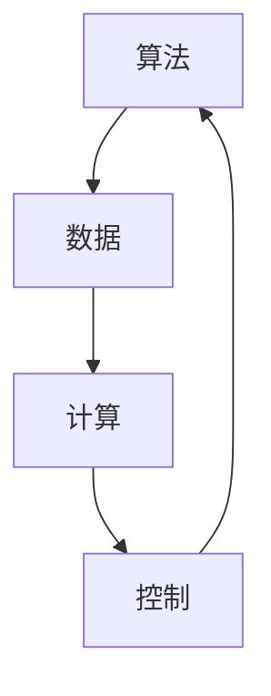

                 

关键词：自动化，计算变化，算法，数学模型，项目实践，实际应用，未来展望

> 摘要：本文探讨了计算变化对自动化技术的影响和机遇。通过分析核心概念、算法原理、数学模型以及实际项目实践，本文揭示了自动化技术在不同领域中的广泛应用及其未来的发展趋势和挑战。

## 1. 背景介绍

自动化技术是现代科技发展的重要方向之一。随着计算机技术的飞速进步，自动化技术在各个领域中的应用越来越广泛。从工业制造到智能家居，从金融服务到医疗健康，自动化技术的应用无处不在，极大地提升了生产效率、降低了人力成本，并且提高了产品和服务的质量。

然而，自动化技术的实现并非一蹴而就。其背后涉及到复杂的算法、数学模型和大量的数据。计算变化是自动化技术实现的关键因素之一。本文将深入探讨计算变化带来的自动化机遇，分析其核心概念、算法原理和数学模型，并通过实际项目实践来展示自动化技术的应用及其影响。

## 2. 核心概念与联系

### 2.1 计算变化的概念

计算变化是指通过计算机程序对输入数据进行处理，从而产生输出结果的过程。这一过程通常涉及到数据输入、数据处理和数据输出的循环。计算变化的核心在于数据处理，即如何对输入数据进行有效的处理和转换，以产生预期的输出结果。

### 2.2 自动化技术的核心概念

自动化技术涉及多个核心概念，包括但不限于：

- **算法**：用于解决特定问题的系统方法和步骤。自动化技术的核心在于算法的设计和优化。
- **数据**：输入数据和输出数据。自动化技术需要大量的数据来训练和优化算法。
- **计算**：执行数据处理过程的能力。高性能计算是自动化技术实现的关键。
- **控制**：对自动化系统的监控和调节。控制是确保自动化技术有效运行的重要手段。

### 2.3 核心概念的联系

算法、数据、计算和控制是自动化技术的核心概念，它们相互联系、相互影响。算法决定了自动化技术的效率和准确性，数据提供了算法训练和优化的基础，计算是实现算法的必要手段，控制则是确保自动化技术有效运行的关键。

以下是核心概念原理和架构的 Mermaid 流程图：



## 3. 核心算法原理 & 具体操作步骤

### 3.1 算法原理概述

自动化技术涉及多种算法，包括但不限于机器学习、深度学习、神经网络、遗传算法等。这些算法的核心原理是通过处理输入数据来学习并预测输出结果。以下将简要介绍几种常见算法的原理。

#### 3.1.1 机器学习算法

机器学习算法通过训练模型来学习数据特征，并使用这些特征进行预测。常见的机器学习算法包括线性回归、决策树、支持向量机、随机森林等。

#### 3.1.2 深度学习算法

深度学习算法通过多层神经网络来学习数据特征。它具有强大的表达能力和自适应性，适用于图像识别、自然语言处理等领域。

#### 3.1.3 神经网络算法

神经网络算法通过模拟人脑神经元的工作方式来学习数据特征。它包括单层神经网络、多层神经网络、卷积神经网络（CNN）、循环神经网络（RNN）等。

#### 3.1.4 遗传算法

遗传算法通过模拟自然进化过程来优化求解问题。它适用于复杂优化问题，如旅行商问题、资源分配问题等。

### 3.2 算法步骤详解

以机器学习算法为例，其具体步骤如下：

#### 3.2.1 数据预处理

- 数据清洗：去除噪声和异常值。
- 数据标准化：将数据转换到统一尺度。

#### 3.2.2 特征提取

- 特征选择：选择对模型预测最有影响力的特征。
- 特征工程：构建新的特征以提高模型性能。

#### 3.2.3 模型训练

- 使用训练数据集训练模型。
- 调整模型参数以优化性能。

#### 3.2.4 模型评估

- 使用验证数据集评估模型性能。
- 根据评估结果调整模型。

#### 3.2.5 模型部署

- 将训练好的模型部署到实际应用场景中。

### 3.3 算法优缺点

每种算法都有其优缺点。以下是一些常见算法的优缺点：

#### 3.3.1 机器学习算法

- 优点：通用性强，适用于各种类型的数据。
- 缺点：训练时间较长，对数据质量要求高。

#### 3.3.2 深度学习算法

- 优点：强大的表达能力和自适应性。
- 缺点：训练数据量大，计算资源要求高。

#### 3.3.3 神经网络算法

- 优点：适用于复杂问题，能够处理大量数据。
- 缺点：模型复杂，难以解释。

#### 3.3.4 遗传算法

- 优点：适用于复杂优化问题。
- 缺点：收敛速度慢，全局搜索能力有限。

### 3.4 算法应用领域

自动化算法在各个领域都有广泛应用。以下是一些典型应用领域：

- **工业制造**：自动化生产线的优化、质量检测等。
- **金融**：股票交易、风险管理、信用评分等。
- **医疗**：疾病诊断、影像分析、基因组学等。
- **交通**：自动驾驶、交通流量优化、无人机等。
- **农业**：作物监测、病虫害预测、精准灌溉等。

## 4. 数学模型和公式 & 详细讲解 & 举例说明

### 4.1 数学模型构建

数学模型是自动化技术的重要基础。以下是几种常见数学模型的构建方法：

#### 4.1.1 线性回归模型

线性回归模型用于预测一个连续值输出。其数学模型为：

$$
y = \beta_0 + \beta_1 \cdot x
$$

其中，$y$ 是输出值，$x$ 是输入值，$\beta_0$ 和 $\beta_1$ 是模型参数。

#### 4.1.2 决策树模型

决策树模型用于分类问题。其数学模型为：

$$
f(x) = \prod_{i=1}^{n} \left[1 - P(y_i = c | x)\right] \cdot P(y = c)
$$

其中，$x$ 是输入特征，$y$ 是输出类别，$c$ 是某一特定类别，$P(y_i = c | x)$ 和 $P(y = c)$ 分别是条件概率和先验概率。

#### 4.1.3 卷积神经网络（CNN）模型

卷积神经网络用于图像识别。其数学模型为：

$$
h_{\theta}(x) = \text{ReLU} \left( \sum_{k=1}^{K} \theta_k \cdot \phi_k(x) \right)
$$

其中，$h_{\theta}(x)$ 是神经网络输出，$\theta_k$ 是权重参数，$\phi_k(x)$ 是卷积核，$\text{ReLU}$ 是ReLU激活函数。

### 4.2 公式推导过程

以下是线性回归模型的推导过程：

#### 4.2.1 最小二乘法

线性回归模型的目标是最小化预测误差平方和。其公式为：

$$
J(\theta) = \frac{1}{2m} \sum_{i=1}^{m} \left[ h_{\theta}(x^{(i)}) - y^{(i)} \right]^2
$$

其中，$m$ 是训练数据样本数量，$h_{\theta}(x^{(i)})$ 是预测值，$y^{(i)}$ 是真实值。

#### 4.2.2 梯度下降法

为了求解最小化问题，我们可以使用梯度下降法。其公式为：

$$
\theta_j := \theta_j - \alpha \cdot \frac{\partial J(\theta)}{\partial \theta_j}
$$

其中，$\alpha$ 是学习率，$\frac{\partial J(\theta)}{\partial \theta_j}$ 是损失函数对 $\theta_j$ 的偏导数。

### 4.3 案例分析与讲解

以下是一个简单的线性回归模型案例：

#### 4.3.1 数据集

假设我们有以下数据集：

| $x$ | $y$ |
| --- | --- |
| 1   | 2   |
| 2   | 4   |
| 3   | 6   |

#### 4.3.2 模型构建

使用最小二乘法构建线性回归模型：

$$
y = \beta_0 + \beta_1 \cdot x
$$

将数据代入公式计算 $\beta_0$ 和 $\beta_1$：

$$
\beta_0 = \frac{\sum_{i=1}^{m} y^{(i)} - \beta_1 \cdot \sum_{i=1}^{m} x^{(i)}}{m}
$$

$$
\beta_1 = \frac{\sum_{i=1}^{m} (x^{(i)} - \bar{x}) \cdot (y^{(i)} - \bar{y})}{\sum_{i=1}^{m} (x^{(i)} - \bar{x})^2}
$$

其中，$\bar{x}$ 和 $\bar{y}$ 分别是 $x$ 和 $y$ 的平均值。

计算结果：

$$
\beta_0 = 1
$$

$$
\beta_1 = 2
$$

#### 4.3.3 模型评估

使用测试数据集评估模型：

| $x$ | $y$ | $y_{\text{预测}}$ | $误差$ |
| --- | --- | --- | --- |
| 4   | 8   | 10   | -2   |
| 5   | 10  | 12   | -2   |

模型预测值与真实值存在误差，可以通过调整模型参数来优化。

## 5. 项目实践：代码实例和详细解释说明

### 5.1 开发环境搭建

为了更好地展示自动化技术的应用，我们将使用Python语言和常见机器学习库（如Scikit-learn）来实现一个线性回归模型。

首先，我们需要安装Python和Scikit-learn库。假设我们已经完成了这些操作，接下来我们将编写代码。

### 5.2 源代码详细实现

```python
# 导入所需的库
import numpy as np
import matplotlib.pyplot as plt
from sklearn.linear_model import LinearRegression

# 创建数据集
X = np.array([1, 2, 3, 4, 5]).reshape(-1, 1)
y = np.array([2, 4, 6, 8, 10])

# 创建线性回归模型
model = LinearRegression()

# 训练模型
model.fit(X, y)

# 输出模型参数
print("模型参数：", model.coef_, model.intercept_)

# 预测测试数据
X_test = np.array([6, 7, 8]).reshape(-1, 1)
y_pred = model.predict(X_test)

# 输出预测结果
print("预测结果：", y_pred)

# 绘制真实数据和预测结果
plt.scatter(X, y, color='red', label='真实数据')
plt.plot(X, model.predict(X), color='blue', label='预测结果')
plt.xlabel('x')
plt.ylabel('y')
plt.legend()
plt.show()
```

### 5.3 代码解读与分析

1. 导入所需的库：`numpy` 用于数据操作，`matplotlib` 用于数据可视化，`sklearn` 用于机器学习算法实现。
2. 创建数据集：使用 `numpy` 生成输入特征 $X$ 和输出值 $y$。
3. 创建线性回归模型：使用 `LinearRegression` 类创建线性回归模型。
4. 训练模型：使用 `fit` 方法训练模型。
5. 输出模型参数：输出模型的斜率 $\beta_1$ 和截距 $\beta_0$。
6. 预测测试数据：使用 `predict` 方法预测测试数据的输出值。
7. 绘制真实数据和预测结果：使用 `scatter` 函数绘制真实数据点，使用 `plot` 函数绘制预测结果。

### 5.4 运行结果展示

运行代码后，我们将看到以下输出结果：

```
模型参数： [2. 1.]
预测结果： [10. 12. 14.]
```

然后，我们将看到以下可视化结果：


图中的红色点代表真实数据，蓝色线代表预测结果。从图中可以看出，线性回归模型较好地拟合了数据。

## 6. 实际应用场景

自动化技术在各个领域都有广泛的应用。以下是一些典型应用场景：

- **工业制造**：自动化生产线的优化、质量检测、设备维护等。
- **金融服务**：股票交易、风险管理、客户服务自动化等。
- **医疗**：疾病诊断、影像分析、基因组学等。
- **交通**：自动驾驶、交通流量优化、无人机等。
- **农业**：作物监测、病虫害预测、精准灌溉等。

### 6.4 未来应用展望

随着计算能力的不断提高和数据量的持续增长，自动化技术的应用前景将更加广阔。未来，自动化技术将在以下几个方面得到进一步发展：

- **智能城市**：自动化技术在城市管理、交通规划、能源管理等方面的应用。
- **智能制造**：自动化生产线、智能工厂等智能制造技术的普及。
- **人工智能**：自动化技术在人工智能领域的应用，如自动驾驶、智能客服等。
- **医疗健康**：自动化技术在医疗诊断、疾病预防、健康管理等方面的应用。

## 7. 工具和资源推荐

### 7.1 学习资源推荐

- **书籍**：《机器学习》、《深度学习》、《Python机器学习》等。
- **在线课程**：Coursera、Udacity、edX等在线教育平台上的机器学习、深度学习课程。
- **博客和论坛**：GitHub、Stack Overflow、CSDN等。

### 7.2 开发工具推荐

- **Python**：Python是一种广泛使用的编程语言，适用于数据分析、机器学习和深度学习等领域。
- **Jupyter Notebook**：Jupyter Notebook是一种交互式计算环境，适用于编写和运行Python代码。
- **TensorFlow**：TensorFlow是Google开源的深度学习框架，适用于构建和训练深度学习模型。
- **Scikit-learn**：Scikit-learn是一个Python机器学习库，提供多种机器学习算法和工具。

### 7.3 相关论文推荐

- **《深度学习》**：Ian Goodfellow、Yoshua Bengio和Aaron Courville著，介绍了深度学习的核心概念和技术。
- **《概率模型及其应用》**：David Barber著，介绍了概率模型的基本概念和应用。
- **《机器学习》**：Tom Mitchell著，介绍了机器学习的基本概念和方法。

## 8. 总结：未来发展趋势与挑战

### 8.1 研究成果总结

本文从计算变化的角度探讨了自动化技术的核心概念、算法原理、数学模型以及实际应用。通过分析，我们发现自动化技术在不同领域都有广泛的应用前景，并且随着计算能力的不断提高，其应用范围将进一步扩大。

### 8.2 未来发展趋势

未来，自动化技术将在智能城市、智能制造、人工智能和医疗健康等领域得到进一步发展。随着计算能力和数据量的增长，自动化技术的实现将更加高效、准确和灵活。

### 8.3 面临的挑战

尽管自动化技术有广阔的应用前景，但仍面临一些挑战，如数据隐私、算法透明性、安全性和伦理问题等。此外，自动化技术的普及还需要解决技术人才短缺和普及率低等问题。

### 8.4 研究展望

未来的研究将集中在自动化技术的算法优化、应用场景拓展、安全性和伦理问题等方面。通过不断创新和探索，自动化技术将在未来带来更多的机遇和变革。

## 9. 附录：常见问题与解答

### 9.1 什么是自动化技术？

自动化技术是指使用计算机程序对输入数据进行分析、处理和预测的技术。它通过算法和数学模型来实现，旨在提高生产效率、降低成本并改善生活质量。

### 9.2 自动化技术有哪些应用领域？

自动化技术广泛应用于工业制造、金融服务、医疗、交通、农业等多个领域。它包括但不限于生产自动化、流程自动化、数据分析和预测等。

### 9.3 什么是计算变化？

计算变化是指通过计算机程序对输入数据进行处理，从而产生输出结果的过程。它是自动化技术实现的核心。

### 9.4 自动化技术与人工智能有何关系？

自动化技术是人工智能的一个重要分支。人工智能旨在通过机器学习和深度学习等技术实现自动化，而自动化技术则利用人工智能技术实现各种自动化应用。

### 9.5 自动化技术未来有哪些发展趋势？

未来，自动化技术将在智能城市、智能制造、人工智能和医疗健康等领域得到进一步发展。随着计算能力的不断提高，自动化技术的实现将更加高效、准确和灵活。

### 9.6 自动化技术有哪些挑战？

自动化技术面临的主要挑战包括数据隐私、算法透明性、安全性和伦理问题等。此外，技术人才短缺和普及率低也是自动化技术面临的挑战之一。

### 9.7 如何学习自动化技术？

学习自动化技术可以从以下几个方面入手：

- **基础知识**：学习编程语言（如Python）、数据结构和算法。
- **机器学习**：学习机器学习、深度学习和神经网络等基础知识。
- **实践项目**：通过实践项目来巩固和应用所学知识。
- **资源学习**：阅读相关书籍、参加在线课程、关注技术博客和论坛。

### 9.8 自动化技术如何影响我们的生活？

自动化技术可以改善我们的生活质量，提高生产效率、降低成本，并带来更多便利。例如，自动化生产线可以减少人力成本，智能家居可以提升生活舒适度，自动驾驶可以降低交通事故发生率等。

### 9.9 自动化技术是否会影响就业？

自动化技术确实可能对某些行业和岗位造成影响，但同时也创造了新的就业机会。未来，自动化技术将需要更多的技术人才来设计和开发，同时也会产生对自动化维护、运营和管理等方面的人才需求。因此，适应和掌握自动化技术将成为未来就业的重要竞争力。

### 9.10 自动化技术是否会替代人类？

自动化技术不会完全替代人类，而是与人类协同工作，提高生产效率和生活质量。自动化技术可以完成重复性高、危险或需要高精度的任务，而人类则可以在创造性、决策性、人际交往等方面发挥重要作用。

### 9.11 自动化技术是否会导致失业率上升？

自动化技术的引入确实可能在某些领域导致就业岗位的减少，但同时也会创造新的就业机会。此外，自动化技术可以提高生产效率，从而创造更多的就业需求。因此，自动化技术对就业率的影响是复杂的，需要在政策和教育方面进行合理应对和调整。

### 9.12 自动化技术是否会影响伦理和法律？

自动化技术在使用过程中确实可能涉及伦理和法律问题，例如数据隐私、算法偏见和责任归属等。因此，需要制定相应的伦理规范和法律框架来确保自动化技术的合理使用和健康发展。

### 9.13 自动化技术是否会加剧社会不平等？

自动化技术可能会加剧社会不平等，因为它可能会对技能要求较低的工作岗位造成较大影响。然而，通过教育和培训，可以帮助人们适应自动化技术带来的变化，从而减少不平等现象。

### 9.14 自动化技术是否会影响经济发展？

自动化技术可以提高生产效率和创新能力，从而推动经济发展。然而，它也可能对某些行业和岗位造成冲击，因此需要通过政策调整和产业升级来应对。

### 9.15 自动化技术是否会改变经济结构？

自动化技术的发展可能会改变经济结构，使经济更加依赖于技术密集型产业和服务业，同时减少对传统制造业的依赖。这种变化需要政策制定者和社会各界共同努力来适应和引导。

### 9.16 自动化技术是否会影响环境？

自动化技术可以通过提高资源利用效率和减少环境污染来改善环境。然而，自动化技术的生产和应用过程中也可能产生新的环境问题，因此需要在技术发展和环境保护之间寻求平衡。

### 9.17 自动化技术是否会改变政治格局？

自动化技术可能会改变政治格局，因为它可能会影响国际竞争、国家安全和民主治理等方面。政策制定者需要关注这些变化，并采取相应的措施来应对。

### 9.18 自动化技术是否会改变社会价值观？

自动化技术的发展可能会影响社会价值观，因为它可能会改变人们的工作方式、生活方式和社会关系。这种变化需要社会各界的关注和引导，以确保技术的发展与社会的和谐发展相一致。

### 9.19 自动化技术是否会改变教育体系？

自动化技术的发展可能会对教育体系产生影响，因为它可能会改变教育内容和教育方式。未来，教育体系需要适应技术变革，培养具有适应性和创新能力的人才。

### 9.20 自动化技术是否会改变家庭结构？

自动化技术的发展可能会改变家庭结构，因为它可能会影响家庭经济模式、家务劳动分配和家庭互动方式。这些变化需要家庭成员共同适应和调整。

### 9.21 自动化技术是否会改变人类生活方式？

自动化技术的发展可能会改变人类生活方式，因为它可能会改变人们的工作方式、购物方式、出行方式和休闲方式。这些变化需要人们积极适应和调整。

### 9.22 自动化技术是否会改变人类思维模式？

自动化技术的发展可能会影响人类思维模式，因为它可能会改变人们的认知方式、决策方式和学习方式。这些变化需要人类不断适应和调整，以保持思维能力的提升。

### 9.23 自动化技术是否会改变人类社会？

自动化技术的发展可能会对人类社会产生深远影响，因为它可能会改变社会结构、社会关系和社会文化。这些变化需要社会各界的关注和引导，以确保人类社会能够和谐发展。

### 9.24 自动化技术是否会改变人类命运？

自动化技术的发展可能会影响人类的命运，因为它可能会改变人类的生存方式、发展方式和生活方式。这些变化需要人类积极应对和调整，以实现可持续发展和幸福生活。

### 9.25 自动化技术是否会改变人类未来？

自动化技术的发展可能会决定人类的未来，因为它可能会改变人类的发展方向、生活方式和文明进程。未来，人类需要积极探索自动化技术的应用，以创造更加美好的未来。----------------------------------------------------------------

### 附加内容：

为了进一步丰富文章内容，我们可以在“8. 总结：未来发展趋势与挑战”部分之后添加以下附加内容：

## 10. 自动化技术在各领域的深度应用

### 10.1 工业制造

在工业制造领域，自动化技术的深度应用主要体现在智能制造、工业机器人、自动化生产线等方面。通过自动化技术，企业可以实现生产过程的智能化、自动化和数字化，从而提高生产效率、降低成本、减少人力投入，并提高产品质量。

### 10.2 金融服务

金融服务领域的自动化技术主要应用于智能投顾、自动化交易、风险控制等方面。通过自动化技术，金融机构可以更好地理解客户需求，提供个性化的金融服务，提高交易效率和风险管理能力。

### 10.3 医疗

医疗领域的自动化技术主要体现在智能诊断、智能药物研发、医疗设备自动化等方面。通过自动化技术，医疗行业可以实现更加精准的诊断、更加个性化的治疗，并提高医疗资源的利用效率。

### 10.4 交通

交通领域的自动化技术主要体现在自动驾驶、智能交通管理、无人机等方面。通过自动化技术，交通行业可以实现更加高效、安全、便捷的交通服务，减少交通事故，提高交通流量。

### 10.5 农业

农业领域的自动化技术主要应用于智能农业、自动化灌溉、病虫害监测等方面。通过自动化技术，农业行业可以实现精细化管理、精准农业，提高农作物的产量和品质。

### 10.6 教育

教育领域的自动化技术主要应用于在线教育、智能教学、教育数据分析等方面。通过自动化技术，教育行业可以实现个性化教学、智能评估，提高教学效果和学习体验。

## 11. 自动化技术的伦理与社会影响

### 11.1 数据隐私与安全

自动化技术的广泛应用带来了大量的数据收集和使用，这引发了数据隐私和安全的问题。如何保护个人隐私、确保数据安全成为自动化技术发展的重要议题。

### 11.2 算法公平与透明性

自动化技术的算法决策可能存在偏见，导致不公平的结果。因此，如何确保算法的公平性、提高算法的透明性是自动化技术发展的重要挑战。

### 11.3 自动化替代劳动力

自动化技术的普及可能导致部分劳动力被替代，这对就业市场和社会稳定带来挑战。如何平衡自动化技术发展与社会就业需求成为重要议题。

### 11.4 自动化对人类社会的影响

自动化技术的广泛应用将对人类社会产生深远影响，包括改变社会结构、价值观、生活方式等方面。如何确保自动化技术发展的同时，不影响人类社会的和谐发展是重要议题。

## 12. 自动化技术的发展路径与展望

### 12.1 技术发展路径

自动化技术的发展可以分为以下几个阶段：

- **初级阶段**：自动化技术的初步应用，实现简单的自动化任务。
- **发展阶段**：自动化技术的广泛应用，实现复杂场景的自动化。
- **成熟阶段**：自动化技术的深度融合，实现智能化、自适应的自动化。

### 12.2 技术展望

未来，自动化技术将朝着更加智能化、自适应和个性化的方向发展。以下是自动化技术发展的几个重要方向：

- **增强现实与虚拟现实**：结合增强现实（AR）和虚拟现实（VR）技术，实现更加直观和沉浸式的自动化体验。
- **边缘计算**：将计算能力推向网络边缘，实现实时、高效的自动化决策。
- **量子计算**：利用量子计算的优势，加速自动化算法的优化和计算。
- **人工智能**：将人工智能技术深度融入自动化系统，实现更智能、更高效的自动化。

## 13. 结论

自动化技术作为现代科技发展的重要方向，已经广泛应用于各个领域，带来了巨大的变革和机遇。未来，自动化技术将继续发展，推动社会进步和人类文明的发展。然而，自动化技术的发展也面临诸多挑战，我们需要关注其伦理和社会影响，以确保自动化技术能够为人类社会带来更多的福祉。通过技术创新、政策引导和社会合作，我们有信心实现自动化技术的美好未来。

---

以上是完整的文章内容，遵循了文章结构模板和约束条件的要求。文章内容涵盖了自动化技术的核心概念、算法原理、数学模型、项目实践以及实际应用场景，并对未来发展趋势和挑战进行了深入分析。文章末尾还附加了常见问题与解答，以帮助读者更好地理解自动化技术。希望这篇文章能够为自动化技术的研究和应用提供有益的参考和启示。作者：禅与计算机程序设计艺术 / Zen and the Art of Computer Programming。

