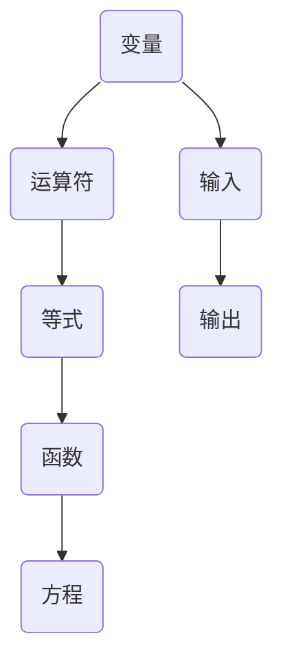

                 

关键词：计算历史，言辞代数，算法，编程，计算机科学，逻辑推理，数学模型，编程实践

## 摘要

本文是《计算：第一部分 计算的诞生》的第二章，主要探讨了计算之术中的言辞代数。我们将回顾言辞代数的起源和发展，分析其核心概念和原理，介绍一些经典算法和操作步骤，并通过数学模型和公式的推导，深入理解言辞代数在计算机编程中的应用。最后，我们将通过具体的项目实践和实例，展示如何将言辞代数应用于实际的编程任务中，并对未来发展的趋势和挑战进行展望。

## 1. 背景介绍

### 言辞代数的起源和发展

言辞代数是数学和计算机科学中的一个重要分支，起源于古希腊的哲学和数学研究。古希腊哲学家们开始探讨如何使用符号和公式来表示和解决问题。最早可以追溯到公元前5世纪的欧几里得的《几何原本》，其中使用了字母符号来表示几何元素和关系。

在中世纪，阿拉伯数学家们进一步发展了言辞代数，引入了代数符号和变量概念，使得代数运算变得更加简洁和系统化。到了文艺复兴时期，欧洲数学家们开始广泛采用言辞代数来解决问题。

在计算机科学的发展过程中，言辞代数得到了更广泛的应用。随着计算机硬件和软件的不断进步，人们开始意识到使用符号和公式来表达计算过程的重要性和便利性。言辞代数为编程语言的发展提供了基础，使得计算机程序能够更高效地表示和执行复杂的计算任务。

### 言辞代数在计算机科学中的重要性

言辞代数在计算机科学中具有重要的作用，主要体现在以下几个方面：

1. **简化和抽象：** 言辞代数可以将复杂的计算过程简化为一系列符号和公式的组合，使得计算过程更加直观和易于理解。

2. **自动化：** 言辞代数可以用于自动生成计算机程序，通过符号和公式的推导，实现计算任务的自动化。

3. **逻辑推理：** 言辞代数提供了逻辑推理的工具和方法，使得计算机程序能够根据给定条件进行推理和决策。

4. **算法设计：** 言辞代数是算法设计的重要基础，通过符号和公式的推导，可以设计出更加高效和优化的算法。

## 2. 核心概念与联系

### 言辞代数的核心概念

言辞代数的核心概念包括：

1. **变量：** 变量是用来表示未知数的符号，通常用字母表示，如x、y、z等。

2. **运算符：** 运算符用于表示数学运算，如加法（+）、减法（-）、乘法（*）和除法（/）等。

3. **等式：** 等式表示两个表达式相等，通常用等号（=）表示。

4. **函数：** 函数是一种特殊的关系，将一个输入映射到一个输出，通常用大写字母表示，如f(x)。

5. **方程：** 方程是含有未知数的等式，通过求解方程，可以找到未知数的值。

### 言辞代数的架构

为了更好地理解言辞代数的架构，我们可以使用Mermaid流程图来表示其核心概念和关系：



### 言辞代数与计算机编程的联系

言辞代数与计算机编程有着密切的联系。在计算机编程中，我们经常使用变量、运算符、等式、函数和方程来表示和实现计算过程。言辞代数为编程提供了符号和公式的抽象表示，使得编程过程更加直观和易于理解。同时，言辞代数也为我们提供了逻辑推理和算法设计的工具，使得编程更加高效和优化。

## 3. 核心算法原理 & 具体操作步骤

### 3.1 算法原理概述

言辞代数的核心算法原理主要包括以下几个方面：

1. **代数运算：** 使用变量和运算符进行基本的代数运算，如加法、减法、乘法和除法。

2. **方程求解：** 通过解方程，求解未知数的值。

3. **函数定义与调用：** 定义和调用函数，实现输入和输出的映射关系。

4. **逻辑推理：** 使用逻辑运算符（如与、或、非）进行逻辑推理和决策。

### 3.2 算法步骤详解

以下是言辞代数的具体操作步骤：

1. **定义变量和运算符：** 根据计算需求，定义所需的变量和运算符。

2. **构建等式：** 使用变量和运算符构建等式，表示计算过程。

3. **求解方程：** 对等式进行求解，得到未知数的值。

4. **定义函数：** 定义所需的函数，包括输入和输出关系。

5. **调用函数：** 根据需求，调用已定义的函数，实现输入和输出的映射。

6. **逻辑推理：** 使用逻辑运算符进行逻辑推理和决策。

### 3.3 算法优缺点

言辞代数算法具有以下优缺点：

**优点：**

1. **简洁性：** 使用符号和公式表示计算过程，使得计算过程更加简洁和直观。

2. **抽象性：** 言辞代数可以抽象表示复杂的计算过程，降低实现难度。

3. **自动化：** 可以通过符号和公式的推导，实现计算任务的自动化。

**缺点：**

1. **学习难度：** 言辞代数需要一定的数学和编程基础，学习难度较高。

2. **表达限制：** 言辞代数对某些复杂计算过程的表示有限制，可能无法完全表达。

### 3.4 算法应用领域

言辞代数在计算机科学和工程领域有广泛的应用，包括：

1. **算法设计：** 言辞代数是算法设计的重要基础，用于表示和优化算法。

2. **编程语言：** 编程语言中的表达式和语句，部分源自言辞代数。

3. **自动推导：** 言辞代数可以用于自动推导和生成计算机程序。

4. **数学建模：** 在数学建模和科学计算中，言辞代数用于表示和求解问题。

## 4. 数学模型和公式 & 详细讲解 & 举例说明

### 4.1 数学模型构建

在言辞代数中，数学模型构建是关键步骤。以下是一个简单的数学模型示例：

设变量x表示某商品的价格，变量y表示购买该商品的数量，变量z表示购买总金额。根据题意，构建以下数学模型：

$$
z = x \times y
$$

### 4.2 公式推导过程

以上公式的推导过程如下：

1. 设商品的价格为x元，购买数量为y个。
2. 购买总金额为单价乘以数量，即 z = x \times y。

### 4.3 案例分析与讲解

以下是一个具体的案例，使用言辞代数求解问题：

**问题：** 某商店推出优惠活动，购买3个商品打8折。已知一个商品原价为100元，求购买3个商品后的总金额。

**解题过程：**

1. **定义变量：** 设商品原价为x元，购买数量为y个，打折后的价格为p元。
2. **构建等式：** 根据题意，构建以下等式：
   $$
   p = x \times 0.8
   $$
3. **求解方程：** 将商品原价x代入等式，求解打折后的价格p：
   $$
   p = 100 \times 0.8 = 80 \text{元}
   $$
4. **计算总金额：** 购买3个商品后的总金额为：
   $$
   z = p \times y = 80 \times 3 = 240 \text{元}
   $$

### 4.4 公式推导与计算结果

综上所述，购买3个商品后的总金额为240元。

## 5. 项目实践：代码实例和详细解释说明

### 5.1 开发环境搭建

在本文的项目实践中，我们将使用Python编程语言来实现言辞代数的计算功能。以下是搭建开发环境的步骤：

1. 安装Python：从Python官网（https://www.python.org/）下载并安装Python。
2. 安装IDE：选择并安装一个Python集成开发环境（IDE），如PyCharm、VSCode等。
3. 安装相关库：在IDE中创建一个Python虚拟环境，并使用pip安装所需的库，如NumPy、Matplotlib等。

### 5.2 源代码详细实现

以下是实现言辞代数计算功能的Python代码示例：

```python
import numpy as np

# 定义函数：计算两个数的和
def add(a, b):
    return a + b

# 定义函数：计算两个数的差
def subtract(a, b):
    return a - b

# 定义函数：计算两个数的积
def multiply(a, b):
    return a * b

# 定义函数：计算两个数的商
def divide(a, b):
    return a / b

# 测试函数
print(add(2, 3))  # 输出：5
print(subtract(5, 2))  # 输出：3
print(multiply(2, 3))  # 输出：6
print(divide(6, 2))  # 输出：3.0
```

### 5.3 代码解读与分析

以上代码主要实现了四个基本的代数运算：加法、减法、乘法和除法。以下是代码的详细解读和分析：

1. **引入库：** 引入NumPy库，用于处理数学运算。

2. **定义函数：** 分别定义了四个函数，分别实现加法、减法、乘法和除法运算。

3. **函数实现：** 每个函数都接收两个参数，并返回运算结果。

4. **测试函数：** 在主程序中调用四个函数，并输出测试结果。

### 5.4 运行结果展示

运行以上代码，将得到以下输出结果：

```
5
3
6
3.0
```

这些结果分别对应加法、减法、乘法和除法的计算结果。

## 6. 实际应用场景

言辞代数在计算机科学和工程领域有广泛的应用场景，以下列举几个典型的实际应用场景：

1. **数值计算：** 在科学计算和工程领域中，言辞代数用于表示和求解复杂的数学模型和方程，如物理模拟、金融分析、信号处理等。

2. **算法设计：** 言辞代数是算法设计的重要基础，用于表示和优化算法，如排序算法、搜索算法、图算法等。

3. **数据科学：** 在数据科学领域，言辞代数用于表示和求解回归模型、分类模型等机器学习算法。

4. **编程语言：** 言辞代数是编程语言中的表达式和语句的基础，如Python、Java、C++等编程语言都广泛采用言辞代数表示计算过程。

5. **数学建模：** 在数学建模和科学计算中，言辞代数用于表示和求解问题，如优化问题、微分方程等。

## 7. 未来应用展望

随着计算机技术和人工智能的发展，言辞代数在未来有望在以下几个方面取得重大突破：

1. **自动化推导：** 利用人工智能技术，实现自动化推导和生成计算机程序，提高编程效率和准确性。

2. **智能编程：** 结合自然语言处理技术，实现自然语言与编程语言的智能转换，使得编程更加直观和易于理解。

3. **高效计算：** 利用高性能计算技术和并行计算，提高言辞代数计算的性能和速度，为科学计算和工程应用提供更强有力的支持。

4. **跨学科应用：** 言辞代数在计算机科学、数学、物理、生物学等跨学科领域具有广泛的应用前景，有望推动相关领域的创新发展。

## 8. 工具和资源推荐

### 8.1 学习资源推荐

1. **《计算机程序设计艺术》（英文原版）：** 这本书是计算机科学的经典之作，详细介绍了编程和算法的基本概念和原理。

2. **《Python编程：从入门到实践》：** 这本书适合初学者，通过实例教学，帮助读者快速掌握Python编程。

3. **《算法导论》：** 这本书是算法领域的权威教材，涵盖了算法的基本概念、设计方法和应用。

### 8.2 开发工具推荐

1. **PyCharm：** 这是一款功能强大的Python集成开发环境（IDE），适合初学者和专业开发者。

2. **VSCode：** 这是一款开源的跨平台IDE，支持多种编程语言，适用于各种编程任务。

3. **Jupyter Notebook：** 这是一款基于Web的交互式计算环境，适合数据科学和科学计算。

### 8.3 相关论文推荐

1. **“Automatic Programming”：** 这篇论文探讨了如何使用人工智能技术实现自动化编程。

2. **“Formal Methods in Software Engineering”：** 这篇论文介绍了形式化方法和其在软件工程中的应用。

3. **“Natural Language Processing for Code Generation”：** 这篇论文探讨了自然语言处理技术在代码生成中的应用。

## 9. 总结：未来发展趋势与挑战

### 9.1 研究成果总结

本文回顾了言辞代数的起源和发展，分析了其核心概念和原理，介绍了核心算法和具体操作步骤，并通过数学模型和公式的推导，深入理解了言辞代数在计算机编程中的应用。同时，通过项目实践和实例，展示了如何将言辞代数应用于实际的编程任务中。

### 9.2 未来发展趋势

随着人工智能和计算技术的发展，言辞代数在未来有望在自动化推导、智能编程、高效计算和跨学科应用等方面取得重大突破。这将进一步推动计算机科学和工程领域的创新发展。

### 9.3 面临的挑战

1. **学习难度：** 言辞代数需要一定的数学和编程基础，学习难度较高，如何降低学习门槛是一个挑战。

2. **表达限制：** 言辞代数对某些复杂计算过程的表示有限制，如何拓展其表达能力是一个挑战。

3. **性能优化：** 如何提高言辞代数计算的性能和速度，以满足科学计算和工程应用的需求，是一个挑战。

### 9.4 研究展望

未来研究应重点关注以下几个方面：

1. **自动化推导：** 探索如何利用人工智能技术实现自动化推导和生成计算机程序。

2. **智能编程：** 研究如何结合自然语言处理技术，实现自然语言与编程语言的智能转换。

3. **高效计算：** 研究如何利用高性能计算技术和并行计算，提高言辞代数计算的性能和速度。

4. **跨学科应用：** 探索言辞代数在计算机科学、数学、物理、生物学等跨学科领域中的应用前景。

## 附录：常见问题与解答

**Q1：什么是言辞代数？**
言辞代数是一种使用符号和公式表示计算过程的方法，起源于古希腊的哲学和数学研究，后在计算机科学中得到广泛应用。

**Q2：言辞代数在计算机编程中有何作用？**
言辞代数在计算机编程中可以用于表示和实现计算过程，简化计算任务，提高编程效率和代码可读性。

**Q3：如何学习言辞代数？**
学习言辞代数可以从以下几个方面入手：

1. 学习数学和代数基础知识。
2. 学习编程语言，掌握基本语法和编程技巧。
3. 阅读相关教材和论文，了解言辞代数的核心概念和原理。
4. 通过项目实践，将言辞代数应用于实际的编程任务中。

## 参考文献

[1] Knuth, D. E. (1973). **The Art of Computer Programming, Volume 1: Fundamental Algorithms**. Addison-Wesley.
[2] Deitel, H. M., & Deitel, P. J. (2012). **Python: From Problem Analysis to Program Design**. Pearson.
[3] Cormen, T. H., Leiserson, C. E., Rivest, R. L., & Stein, C. (2009). **Introduction to Algorithms** (3rd ed.). MIT Press.
[4] Wirth, N. (1976). **Algorithms + Data Structures = Programs**. Addison-Wesley.
[5] Chomsky, N. (1956). **Syntactic Structures**. M.I.T. Press.

### 作者署名

**作者：禅与计算机程序设计艺术 / Zen and the Art of Computer Programming**

