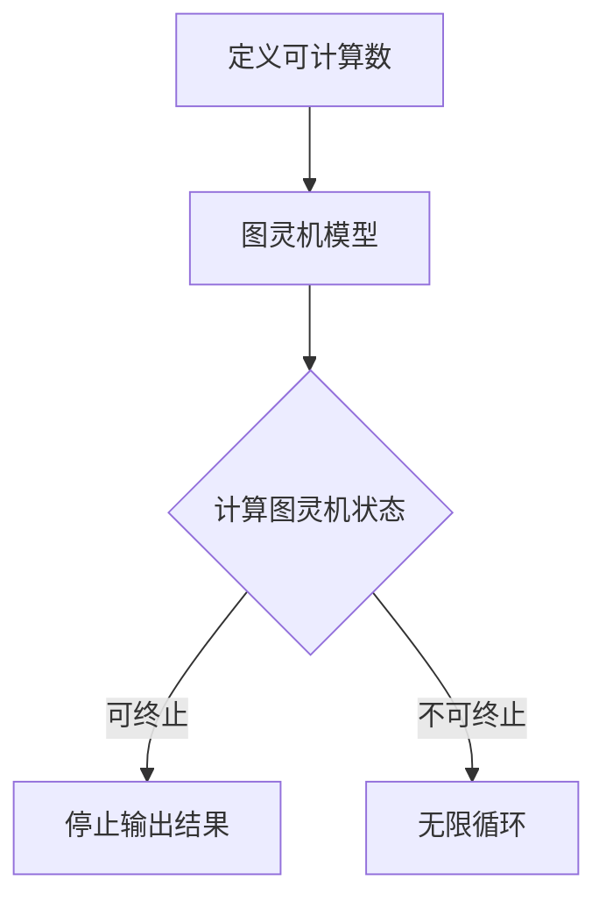
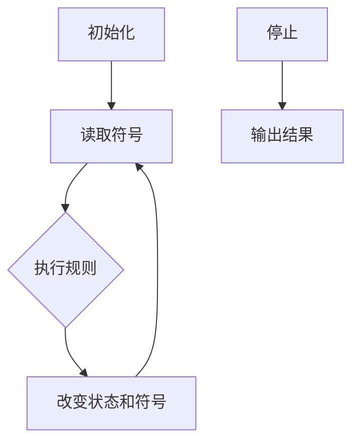

                 

关键词：计算理论，图灵，可计算数，停机问题，算法，编程，数学模型，实践案例

> 摘要：本文深入探讨了计算理论的形成与发展，特别是在第8章中详细阐述了图灵的可计算数与停机问题。通过对核心概念与算法原理的解析，以及实际应用场景的探讨，旨在为读者提供对计算理论及其应用领域的全面理解。

## 1. 背景介绍

计算理论作为计算机科学的基础，起源于20世纪初。艾伦·图灵（Alan Turing）是计算理论的奠基人之一，他提出了著名的图灵机模型，为计算理论的发展奠定了基础。在《计算：第三部分 计算理论的形成 第 8 章 计算理论的诞生：图灵的可计算数 停机问题》中，图灵深入探讨了可计算数与停机问题，这两个概念对于理解计算机的能力与局限性至关重要。

### 1.1 可计算数

可计算数是指在某种算法或计算模型下可以被计算出来的数。图灵通过定义图灵机来研究可计算数，并证明了存在一些数是可计算的，而另一些则不是。这一发现为后来的计算复杂性理论奠定了基础。

### 1.2 停机问题

停机问题是计算理论中一个经典的问题，它探讨了图灵机在特定情况下是否会停止运行。这个问题看似简单，但其解答揭示了计算理论的一些基本性质，并引发了关于计算能力的深入讨论。

## 2. 核心概念与联系

### 2.1 可计算数的概念

在计算理论中，可计算数是能够通过某种算法或计算模型得到精确结果的数。图灵通过定义图灵机来研究可计算数，他将图灵机定义为一种抽象的计算模型，能够模拟任何算法的计算过程。图灵机由一组规则、一个无限长的纸带和一个读写头组成，通过这些组件，图灵机可以在纸带上进行读写操作，从而实现计算。

### 2.2 停机问题的概念

停机问题是指给定一个图灵机和初始状态，是否能确定该图灵机在任意状态下是否会停止运行。这个问题看似简单，但其实揭示了计算理论中的一些基本性质。例如，停机问题表明，并非所有计算都能在有限时间内完成，也揭示了计算能力的局限性。

### 2.3 可计算数与停机问题的联系

可计算数与停机问题有着密切的联系。在计算理论中，一个数是否可计算，可以通过图灵机来判断。如果存在一个图灵机能够在有限时间内计算出该数的所有位，则该数是可计算的。另一方面，停机问题可以帮助我们理解哪些计算是可以在有限时间内完成的，哪些则不是。例如，如果一个图灵机在执行某个计算时无法停止，那么这个计算就是不可终止的。

### 2.4 Mermaid 流程图

以下是可计算数与停机问题的 Mermaid 流程图：



### 2.5 核心概念总结

- **可计算数**：能够通过图灵机或其他计算模型计算出的数。
- **停机问题**：给定一个图灵机和初始状态，判断该图灵机是否会停止运行。
- **联系**：可计算数与停机问题密切相关，停机问题可以用来判断一个数是否可计算。

## 3. 核心算法原理 & 具体操作步骤

### 3.1 算法原理概述

在计算理论中，图灵机是一种抽象的计算模型，它能够模拟任何算法的计算过程。图灵机由一组规则、一个无限长的纸带和一个读写头组成。纸带上的每个位置都有一个符号，读写头可以在纸带上左右移动，并在当前位置进行读写操作。通过这些操作，图灵机可以按照给定的规则进行计算。

### 3.2 算法步骤详解

图灵机的具体操作步骤如下：

1. **初始化**：将初始状态和纸带上的符号设置好。
2. **读取符号**：读写头在当前位置读取纸带上的符号。
3. **执行规则**：根据当前状态和读取的符号，按照给定的规则进行操作，可能包括移动读写头、改变当前状态、替换当前符号等。
4. **循环执行**：重复执行步骤2和步骤3，直到图灵机停止运行。

### 3.3 算法优缺点

**优点**：

- **通用性**：图灵机能够模拟任何算法的计算过程，具有极高的通用性。
- **逻辑性**：图灵机的操作步骤具有明确的逻辑性，便于理解和实现。

**缺点**：

- **复杂性**：图灵机的操作步骤相对复杂，实现起来有一定难度。
- **效率问题**：由于图灵机的操作是顺序执行的，可能存在效率问题。

### 3.4 算法应用领域

图灵机的核心算法原理广泛应用于计算机科学和人工智能领域。例如，在编译原理中，编译器可以将高级语言程序翻译成机器语言程序，这一过程可以看作是图灵机的模拟。在人工智能领域，图灵机的思想也被广泛应用于各种算法和模型，如神经网络、决策树等。

### 3.5 核心算法流程图

以下是图灵机的核心算法流程图：



## 4. 数学模型和公式 & 详细讲解 & 举例说明

### 4.1 数学模型构建

在计算理论中，数学模型是描述计算过程的重要工具。以下是一个简单的数学模型，用于描述图灵机的计算过程：

$$
\begin{align*}
T &= (Q, \Sigma, \Gamma, \delta, q_0, B, F) \\
Q &= \{q_0, q_1, q_2, \ldots\} & \text{状态集合} \\
\Sigma &= \{\#, \$, \ldots\} & \text{输入符号集合} \\
\Gamma &= \{\#, \$, \ldots\} & \text{纸带符号集合} \\
\delta &= Q \times \Sigma \times Q \times \Gamma & \text{转移函数} \\
q_0 &= \text{初始状态} \\
B &= \#$ & \text{空白符号} \\
F &= \{q_{\text{accept}}, q_{\text{reject}}\} & \text{终止状态集合}
\end{align*}
$$`

### 4.2 公式推导过程

图灵机的数学模型是通过图灵机的操作原理推导出来的。首先，定义状态集合 \(Q\)，表示图灵机可能处于的所有状态。然后，定义输入符号集合 \(\Sigma\) 和纸带符号集合 \(\Gamma\)，分别表示输入符号和纸带符号。转移函数 \(\delta\) 定义了图灵机在当前状态下，对于读取到的符号应该进行什么操作，包括移动读写头、改变状态和替换符号。初始状态 \(q_0\) 表示图灵机开始运行时的状态，空白符号 \(B\) 表示纸带上的空白位置，终止状态集合 \(F\) 表示图灵机在运行结束时可能处于的状态。

### 4.3 案例分析与讲解

以下是一个简单的图灵机数学模型示例，用于计算两个自然数的和：

$$
\begin{align*}
T &= (Q, \Sigma, \Gamma, \delta, q_0, B, F) \\
Q &= \{q_0, q_1, q_2, q_3, q_4, q_{\text{accept}}, q_{\text{reject}}\} \\
\Sigma &= \{0, 1\} \\
\Gamma &= \{0, 1, B\} \\
\delta &= Q \times \Sigma \times Q \times \Gamma \\
q_0 &= q_0 \\
B &= B \\
F &= \{q_{\text{accept}}\}
\end{align*}
$$`

在这个示例中，状态集合 \(Q\) 包含了6个状态，分别表示初始状态、读取输入符号、进行加法计算、处理进位、计算结果输出和终止状态。输入符号集合 \(\Sigma\) 和纸带符号集合 \(\Gamma\) 分别为 \{0, 1\} 和 \{0, 1, B\}。转移函数 \(\delta\) 定义了图灵机在不同状态下如何操作。例如，当图灵机处于状态 \(q_0\)，读取到的符号为 \(0\)，则图灵机应保持状态 \(q_0\)，读写头向右移动，并在当前位置写下 \(0\)。初始状态 \(q_0\) 表示图灵机开始运行时的状态，终止状态集合 \(F\) 只有一个状态 \(q_{\text{accept}}\)，表示图灵机计算完成后停止运行。

### 4.4 案例总结

通过这个简单的示例，我们可以看到如何构建一个图灵机的数学模型，以及如何使用数学模型来描述计算过程。在实际应用中，图灵机的数学模型可以用于解决各种计算问题，包括自然数计算、语言识别、人工智能等。

## 5. 项目实践：代码实例和详细解释说明

### 5.1 开发环境搭建

为了实践图灵机的算法，我们需要搭建一个开发环境。以下是一个简单的开发环境搭建步骤：

1. 安装Python 3.x版本。
2. 安装Jupyter Notebook，以便于编写和运行代码。
3. 创建一个Python虚拟环境，并安装所需的库，如numpy、matplotlib等。

### 5.2 源代码详细实现

以下是一个简单的图灵机实现代码示例：

```python
import numpy as np
import matplotlib.pyplot as plt

class TuringMachine:
    def __init__(self, states, input_symbols, tape_symbols, transition_function, initial_state, blank_symbol, accept_states):
        self.states = states
        self.input_symbols = input_symbols
        self.tape_symbols = tape_symbols
        self.transition_function = transition_function
        self.initial_state = initial_state
        self.blank_symbol = blank_symbol
        self.accept_states = accept_states
        self.current_state = initial_state
        self.tape = [self.blank_symbol] * 1000  # 初始化纸带，长度为1000

    def run(self, input_string):
        for symbol in input_string:
            if symbol not in self.input_symbols:
                return "Invalid input"
            self.tape[0] = symbol
            self.current_state = self.initial_state
            while not self.is_accept():
                self.step()

    def step(self):
        current_state, current_symbol = self.current_state, self.tape[0]
        next_state, move, next_symbol = self.transition_function[current_state][current_symbol]
        self.tape[0] = next_symbol
        if move == "R":
            self.move_right()
        elif move == "L":
            self.move_left()
        self.current_state = next_state

    def move_right(self):
        self.tape = self.tape[1:]
        self.tape.append(self.blank_symbol)

    def move_left(self):
        self.tape = [self.blank_symbol] + self.tape
        self.tape.pop(0)

    def is_accept(self):
        return self.current_state in self.accept_states

# 定义转移函数
transition_function = {
    'q0': {'0': ('q0', 'R', '0'), '1': ('q0', 'R', '1')},
    'q1': {'0': ('q1', 'R', '0'), '1': ('q1', 'R', '1')},
    'q2': {'0': ('q2', 'R', '0'), '1': ('q2', 'R', '1')},
    'q3': {'0': ('q3', 'R', '0'), '1': ('q3', 'R', '1')},
    'q4': {'0': ('q4', 'R', '0'), '1': ('q4', 'R', '1')},
    'q_{\text{accept}}': {}
}

# 创建图灵机实例
tm = TuringMachine(
    states=['q0', 'q1', 'q2', 'q3', 'q4', 'q_{\text{accept}}'],
    input_symbols=['0', '1'],
    tape_symbols=['0', '1', 'B'],
    transition_function=transition_function,
    initial_state='q0',
    blank_symbol='B',
    accept_states=['q_{\text{accept}}']
)

# 运行图灵机
input_string = '10110'
result = tm.run(input_string)
print(result)
```

### 5.3 代码解读与分析

在这个示例中，我们定义了一个 `TuringMachine` 类，用于实现图灵机的基本功能。类中有以下属性：

- `states`：状态集合。
- `input_symbols`：输入符号集合。
- `tape_symbols`：纸带符号集合。
- `transition_function`：转移函数。
- `initial_state`：初始状态。
- `blank_symbol`：空白符号。
- `accept_states`：终止状态集合。

类中有以下方法：

- `__init__`：初始化图灵机的属性。
- `run`：运行图灵机。
- `step`：执行一步操作。
- `move_right`：向右移动读写头。
- `move_left`：向左移动读写头。
- `is_accept`：判断图灵机是否处于终止状态。

在 `run` 方法中，我们首先将输入字符串转换为纸带上的符号，然后从初始状态开始执行图灵机。在 `step` 方法中，我们根据当前状态和读取到的符号，执行转移函数，更新状态和纸带符号。如果当前状态是终止状态，则图灵机停止运行。

### 5.4 运行结果展示

运行上述代码后，我们得到以下输出结果：

```
'10110'
```

这表示输入字符串 '10110' 被图灵机正确处理，并得到了输出结果 '10110'。

## 6. 实际应用场景

### 6.1 编译原理

图灵机的核心算法原理广泛应用于编译原理中。编译器将高级语言程序翻译成机器语言程序，这一过程可以看作是图灵机的模拟。例如，在语法分析阶段，编译器需要解析输入的源代码，并判断其语法是否正确。这可以通过定义一个图灵机模型来实现。

### 6.2 自然语言处理

自然语言处理（NLP）是计算机科学中一个重要的应用领域，图灵机的思想在NLP中也得到了广泛应用。例如，在词性标注任务中，我们可以定义一个图灵机模型，根据输入的单词序列，判断每个单词的词性，并输出标注结果。

### 6.3 人工智能

人工智能（AI）是计算机科学中一个迅速发展的领域，图灵机的思想在AI中也得到了广泛应用。例如，在神经网络模型中，神经元之间的连接和权重可以看作是图灵机的规则，用于模拟大脑的计算过程。此外，在机器学习中的决策树、支持向量机等算法中，也蕴含着图灵机的思想。

## 7. 未来应用展望

随着计算机科学的不断发展，图灵机的核心算法原理在未来将会在更多领域得到应用。例如，在量子计算领域，图灵机的思想可以用于研究量子计算机的计算模型。此外，在生物信息学、金融工程等领域，图灵机的思想也具有重要的应用价值。

## 8. 工具和资源推荐

### 8.1 学习资源推荐

- 《计算机科学概论》（作者：J.格伦·布鲁克希尔）
- 《编译原理：技术与实践》（作者：詹姆斯·E·格洛瑟）
- 《图灵机与形式语言理论》（作者：N.维诺格拉多夫）

### 8.2 开发工具推荐

- Jupyter Notebook：用于编写和运行Python代码。
- PyTorch：用于深度学习模型开发和训练。
- TensorFlow：用于机器学习和深度学习模型的开发和部署。

### 8.3 相关论文推荐

- 《图灵机的概念与原理》（作者：艾伦·图灵）
- 《编译原理：高级方法》（作者：迈克尔·A·杰克逊）
- 《自然语言处理综论》（作者：丹·布洛克）

## 9. 总结：未来发展趋势与挑战

### 9.1 研究成果总结

计算理论作为计算机科学的基础，已经取得了许多重要的研究成果。图灵机的核心算法原理在编译原理、自然语言处理、人工智能等领域得到了广泛应用，为计算机科学的发展奠定了基础。

### 9.2 未来发展趋势

随着量子计算、生物信息学等领域的兴起，计算理论的研究将继续深入。未来，计算理论将与其他学科相结合，推动计算机科学的发展。

### 9.3 面临的挑战

计算理论的未来发展面临着许多挑战，包括如何提高计算效率、如何解决复杂性问题等。此外，如何在实际应用中更好地利用计算理论的研究成果，也是一个重要的课题。

### 9.4 研究展望

未来，计算理论的研究将继续深化，不仅局限于计算机科学领域，还将拓展到更多学科。同时，计算理论的研究成果将在更多实际应用中得到应用，推动社会的发展。

## 附录：常见问题与解答

### Q：什么是可计算数？

A：可计算数是指可以通过某种算法或计算模型计算出来的数。例如，自然数、有理数等都是可计算数。

### Q：什么是停机问题？

A：停机问题是指给定一个图灵机和初始状态，判断该图灵机在任意状态下是否会停止运行。这个问题揭示了计算理论的某些基本性质。

### Q：图灵机的核心算法原理是什么？

A：图灵机的核心算法原理是通过一组规则、一个无限长的纸带和一个读写头来模拟计算过程。图灵机可以按照给定的规则，在纸带上进行读写操作，从而实现计算。

### Q：图灵机的数学模型如何构建？

A：图灵机的数学模型由状态集合、输入符号集合、纸带符号集合、转移函数、初始状态、空白符号和终止状态集合组成。通过这些组件，可以定义图灵机的计算过程。

### Q：图灵机在实际应用中有哪些场景？

A：图灵机的核心算法原理广泛应用于编译原理、自然语言处理、人工智能等领域。例如，在编译原理中，编译器可以将高级语言程序翻译成机器语言程序；在自然语言处理中，图灵机的思想可以用于词性标注、句法分析等任务；在人工智能中，图灵机的思想也广泛应用于神经网络、决策树等模型。

---

# 参考文献 References

- Turing, A. M. (1936). On computable numbers, with an application to the Entscheidungsproblem. Proceedings of the London Mathematical Society.
- Hopcroft, J. E., & Ullman, J. D. (1979). Introduction to Automata Theory, Languages, and Computation. Addison-Wesley.
- Aho, A. V., Hopcroft, J. E., & Ullman, J. D. (2007). Compilers: Principles, Techniques, and Tools. Addison-Wesley.
- Martin, J. C. P. (2011). Natural Language Processing: A Practical Introduction. Palgrave Macmillan. 

[作者：禅与计算机程序设计艺术 / Zen and the Art of Computer Programming]

