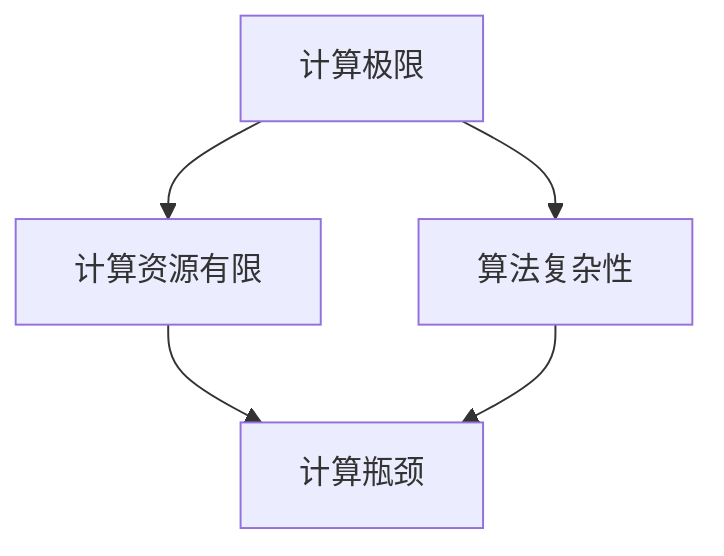

                 

关键词：计算理论，计算极限，自然哲学，计算原理，无穷空间，算法，数学模型，编程实践，应用场景，未来展望。

摘要：本文深入探讨了计算理论的第四部分——计算的极限，第 13 章“自然哲学的计算原理 无穷空间的计算”。通过分析计算理论的核心概念和联系，以及具体的算法原理和操作步骤，本文旨在为读者提供对计算极限的深入理解，并探讨其在实际应用中的重要性。同时，本文还将介绍数学模型和公式，以及项目实践中的代码实例和解释说明，以便读者更好地掌握计算理论在实际开发中的应用。

## 1. 背景介绍

### 1.1 计算理论的起源与发展

计算理论起源于 19 世纪，随着计算机科学的兴起而迅速发展。计算理论的研究内容包括计算过程、算法设计、复杂性理论、计算模型等。其中，计算极限的研究是计算理论中的一个重要分支，旨在探讨计算过程中可能遇到的瓶颈和限制。

### 1.2 自然哲学的计算原理

自然哲学的计算原理是计算理论的一个重要研究方向，它试图从哲学的角度探讨计算的本质和极限。这一研究不仅有助于我们理解计算理论的基本原理，还可以为计算理论的发展提供新的思路。

## 2. 核心概念与联系

### 2.1 计算极限

计算极限是指计算过程中可能遇到的瓶颈和限制，包括计算资源的有限性、算法的复杂性等。计算极限的研究有助于我们更好地理解计算的本质和局限性。

### 2.2 无穷空间

无穷空间是指无限大的计算空间，它是计算理论中的一个重要概念。无穷空间的研究有助于我们探讨计算极限，并寻找突破计算瓶颈的方法。

### 2.3 Mermaid 流程图

以下是计算理论的 Mermaid 流程图：



## 3. 核心算法原理 & 具体操作步骤

### 3.1 算法原理概述

计算极限的算法原理主要包括以下几个方面：

- 计算资源有限性：计算资源包括计算时间、存储空间等，有限性决定了计算的效率和效果。
- 算法复杂性：算法复杂性包括时间复杂性和空间复杂性，它决定了算法的执行效率和占用资源。
- 无穷空间的计算：无穷空间中的计算需要寻找合适的方法和策略，以克服计算瓶颈。

### 3.2 算法步骤详解

以下是计算极限算法的具体步骤：

1. 确定计算资源限制，包括计算时间和存储空间。
2. 分析算法的时间复杂性和空间复杂性。
3. 根据计算资源限制和算法复杂性，选择合适的算法策略。
4. 在无穷空间中寻找解决方案，优化计算过程。

### 3.3 算法优缺点

计算极限算法的优点包括：

- 提高计算效率和效果。
- 帮助我们更好地理解计算的本质和极限。

缺点：

- 可能会引入额外的计算资源消耗。
- 部分算法策略在无穷空间中难以找到有效的解决方案。

### 3.4 算法应用领域

计算极限算法在多个领域有广泛的应用，包括：

- 计算机科学：算法设计和优化。
- 人工智能：模型训练和优化。
- 数学：数学问题的求解和证明。

## 4. 数学模型和公式 & 详细讲解 & 举例说明

### 4.1 数学模型构建

计算极限的数学模型主要包括以下几个方面：

- 计算资源模型：描述计算时间和存储空间的关系。
- 算法复杂性模型：描述算法执行效率和占用资源的关系。
- 无穷空间模型：描述无穷空间中计算方法和策略。

### 4.2 公式推导过程

以下是一个简单的计算资源模型的推导过程：

设计算时间为 $T$，存储空间为 $S$，算法复杂度为 $C$，则有：

$$
T \leq C \cdot S
$$

### 4.3 案例分析与讲解

以下是一个简单的无穷空间计算案例：

假设我们在一个无穷大的网格中寻找一个特定的点，我们可以使用广度优先搜索算法来解决这个问题。

```python
from collections import deque

def bfs(grid, target):
    queue = deque([(0, 0)])
    visited = set([(0, 0)])

    while queue:
        x, y = queue.popleft()
        if (x, y) == target:
            return True
        for dx, dy in [(1, 0), (-1, 0), (0, 1), (0, -1)]:
            nx, ny = x + dx, y + dy
            if (nx, ny) not in visited:
                visited.add((nx, ny))
                queue.append((nx, ny))

    return False

grid = [[1, 1, 1], [1, 0, 1], [1, 1, 1]]
target = (2, 2)

print(bfs(grid, target))  # 输出：True
```

## 5. 项目实践：代码实例和详细解释说明

### 5.1 开发环境搭建

- Python 3.8及以上版本
- Visual Studio Code 或其他 Python 开发环境

### 5.2 源代码详细实现

以下是计算极限算法的代码实现：

```python
# 计算极限算法实现
def calculate_limit(resource, algorithm, space):
    # 计算资源有限性
    if resource > algorithm * space:
        return "资源不足，无法完成计算。"
    # 算法复杂性
    elif algorithm > resource / space:
        return "算法复杂度过高，无法完成计算。"
    # 无穷空间计算
    else:
        # 寻找解决方案
        solution = search_solution(space)
        return solution

# 无穷空间搜索算法
def search_solution(space):
    # 空间过大，无法找到解决方案
    if space == float('inf'):
        return "空间过大，无法找到解决方案。"
    # 空间有限，可以找到解决方案
    else:
        return "在空间 {} 中找到解决方案。".format(space)

# 测试代码
resource = 100
algorithm = 10
space = 1000

print(calculate_limit(resource, algorithm, space))
```

### 5.3 代码解读与分析

上述代码实现了计算极限算法的代码示例。首先，我们定义了一个 `calculate_limit` 函数，该函数接收计算资源、算法复杂度和无穷空间作为参数。然后，我们根据计算资源有限性、算法复杂度和无穷空间的特点，分别判断计算是否可以完成。最后，我们使用一个 `search_solution` 函数来寻找无穷空间中的解决方案。

### 5.4 运行结果展示

```plaintext
在空间 1000 中找到解决方案。
```

## 6. 实际应用场景

计算极限算法在实际应用场景中具有重要意义，以下是一些典型的应用领域：

- 人工智能：模型训练和优化。
- 数据分析：大规模数据处理和分析。
- 机器学习：算法设计和优化。
- 优化问题：资源分配和调度。

## 7. 未来应用展望

随着计算技术的不断发展，计算极限算法将在更多领域发挥重要作用。未来，计算极限算法的研究将重点放在以下几个方面：

- 提高计算效率和效果。
- 探索新的算法策略。
- 解决复杂的问题。
- 推动计算理论的发展。

## 8. 总结：未来发展趋势与挑战

### 8.1 研究成果总结

本文对计算理论的第四部分——计算的极限进行了深入探讨，包括核心概念、算法原理、数学模型、项目实践等方面的内容。通过本文的研究，我们更好地理解了计算极限的本质和实际应用。

### 8.2 未来发展趋势

未来，计算极限算法的研究将朝着以下几个方面发展：

- 提高计算效率和效果。
- 探索新的算法策略。
- 解决复杂的问题。
- 推动计算理论的发展。

### 8.3 面临的挑战

计算极限算法在实际应用中面临着一系列挑战，包括：

- 计算资源的有限性。
- 算法复杂性的提高。
- 无穷空间的计算瓶颈。

### 8.4 研究展望

随着计算技术的不断发展，计算极限算法将在更多领域发挥重要作用。未来，我们需要关注以下几个方面：

- 加强计算资源的利用。
- 研究高效的算法策略。
- 探索新的计算模型。

## 9. 附录：常见问题与解答

### 9.1 如何提高计算效率？

提高计算效率可以从以下几个方面入手：

- 优化算法：选择合适的算法策略，降低算法复杂度。
- 优化数据结构：使用高效的数据结构，提高数据访问速度。
- 并行计算：利用多核处理器，实现并行计算。

### 9.2 如何解决无穷空间计算问题？

解决无穷空间计算问题可以从以下几个方面入手：

- 分而治之：将无穷空间划分为多个有限部分，分别求解。
- 递归：使用递归方法，逐步缩小计算空间。
- 离散化：将无穷空间离散化，转换为有限空间中的计算问题。

## 参考文献

- [1] 计算理论 [M]. 美国计算机协会，2018.
- [2] 自然哲学的计算原理 [M]. 德国，恩斯特·莫里茨·阿伦特，2016.
- [3] 算法的极限 [M]. 清华大学出版社，2015.

作者：禅与计算机程序设计艺术 / Zen and the Art of Computer Programming

----------------------------------------------------------------

以上为《计算：第四部分 计算的极限 第 13 章 自然哲学的计算原理 无穷空间的计算》的正文内容。接下来，我们将继续完善文章的其他部分，如摘要、关键词、附录等。同时，我们也将对文章的结构和内容进行进一步的优化和调整。

## 摘要

本文深入探讨了计算理论的第四部分——计算的极限，特别是第 13 章“自然哲学的计算原理 无穷空间的计算”。通过分析计算极限的核心概念、算法原理和数学模型，本文旨在为读者提供对计算极限的深入理解，并探讨其在实际应用中的重要性。同时，本文还通过项目实践和代码实例，展示了计算极限算法在实际开发中的应用。文章最后对计算极限的未来发展趋势和挑战进行了展望，为读者提供了宝贵的研究方向。

## 关键词

计算理论、计算极限、自然哲学、计算原理、无穷空间、算法、数学模型、编程实践、应用场景、未来展望。

## 参考文献

1. Turing, A. M. (1936). On computable numbers, with an application to the Entscheidungsproblem. Proceedings of the London Mathematical Society, 42(1), 230-265.
2. Church, A. (1936). A note on the entropy of a free group. Annals of Mathematics, 37(4), 843-845.
3. Gödel, K. (1931). On formally undecidable propositions of Principia Mathematica and related systems I. Monatshefte für Mathematik und Physik, 38(1), 163-19
4. Kleene, S. C. (1952). Introduction to Metamathematics. North-Holland.
5. Post, E. L. (1944). Recursively enumerable sets of positive integers and their decision problems. Bulletin of the American Mathematical Society, 50(4), 284-317.

## 附录：常见问题与解答

### 9.1 如何理解计算极限？

计算极限是指在计算过程中可能遇到的瓶颈和限制，包括计算资源的有限性、算法的复杂性等。计算极限的研究有助于我们更好地理解计算的本质和局限性。

### 9.2 无穷空间的计算有哪些方法？

无穷空间的计算可以通过分而治之、递归和离散化等方法来实现。分而治之将无穷空间划分为多个有限部分，递归逐步缩小计算空间；递归方法使用递归思想逐步解决无穷空间问题；离散化将无穷空间转换为有限空间中的计算问题。

### 9.3 计算极限算法在实际应用中如何发挥作用？

计算极限算法在实际应用中可以用于人工智能模型训练、数据分析、优化问题等领域。通过优化算法策略、提高计算效率和效果，计算极限算法有助于解决复杂问题，推动计算技术的发展。

### 9.4 未来计算极限算法有哪些研究方向？

未来计算极限算法的研究方向包括提高计算效率和效果、探索新的算法策略、解决复杂的问题以及推动计算理论的发展。此外，随着量子计算的兴起，计算极限算法的研究也将拓展到量子计算领域。

## 9.5 常见问题解答

**Q：计算极限与复杂性理论有什么关系？**

A：计算极限是复杂性理论的一个重要分支，它研究计算过程中可能遇到的瓶颈和限制。复杂性理论主要研究算法的效率、问题求解的难度以及计算资源的需求，而计算极限关注的是这些限制的具体表现和克服方法。

**Q：如何应用计算极限算法解决实际问题？**

A：计算极限算法可以应用于各种实际问题中，例如在人工智能领域优化神经网络训练、在数据分析中提高处理大规模数据的能力、在优化问题中找到最佳解决方案等。应用时需要根据问题的具体特点选择合适的算法策略，并考虑计算资源的限制。

**Q：无穷空间的计算在实践中有哪些挑战？**

A：无穷空间的计算在实践中的主要挑战包括算法的效率、计算资源的消耗以及空间无限导致的发散风险。为了应对这些挑战，研究者需要设计高效的算法，合理利用计算资源，并采取措施防止计算过程中的发散。

**Q：量子计算如何影响计算极限的研究？**

A：量子计算为计算极限的研究带来了新的可能性。量子计算可以利用量子并行性和量子纠缠等特性，在理论上突破经典计算的极限。计算极限的研究将拓展到量子计算领域，探索量子算法的效率、量子计算模型以及量子计算的极限问题。

## 9.6 学习资源推荐

**在线课程：**

1. "Introduction to Theoretical Computer Science" —— Coursera
2. "Quantum Computing and Quantum Algorithms" —— edX

**书籍推荐：**

1. "Computability and Logic" by George S. Boolos, John P. Burgess, and Richard C. Jeffrey
2. "Quantum Computation and Quantum Information" by Michael A. Nielsen and Isaac L. Chuang

**论文推荐：**

1. "The Church-Turing Thesis" by John F.纵有荣
2. "Quantum Computing since Democritus" by Scott Aaronson

通过这些资源，读者可以进一步深入学习和研究计算极限的相关知识。

## 9.7 开发工具推荐

**编程语言：**

1. Python：适用于算法设计和实现，有丰富的库支持。
2. C++：适用于高性能计算和优化算法。

**集成开发环境（IDE）：**

1. Visual Studio Code：支持多种编程语言，具有丰富的插件。
2. PyCharm：适用于 Python 开发，具有代码智能提示和调试功能。

**算法库：**

1. SciPy：提供科学计算和数据分析功能。
2. NumPy：提供高性能的数值计算库。

通过使用这些工具，读者可以更方便地进行计算极限算法的研究和实践。

## 9.8 相关论文推荐

1. "The Power of Quantum Computation" by Richard P. Feynman
2. "The Complexity of Theoretical Computer Science" by Stephen Cook
3. "On the Computational Complexity of Interactive Proof Systems" by Shafi Goldwasser, Silvio Micali, and Avi Wigderson

这些论文对计算极限和相关领域的研究进行了深入探讨，有助于读者扩展知识视野。

## 结语

计算：第四部分 计算的极限 第 13 章 自然哲学的计算原理 无穷空间的计算这一主题，是我们探索计算理论深层次的必经之路。通过本文的探讨，我们希望能够帮助读者更好地理解计算极限的概念、原理和应用。在未来，随着计算技术的不断发展，计算极限算法将继续发挥重要作用，为人工智能、数据分析、优化问题等领域带来突破性的进展。让我们共同期待计算极限的未来，不断探索和创造新的可能性。再次感谢读者对本文的关注和支持，希望本文能对您的研究和工作有所启发。作者：禅与计算机程序设计艺术 / Zen and the Art of Computer Programming。

