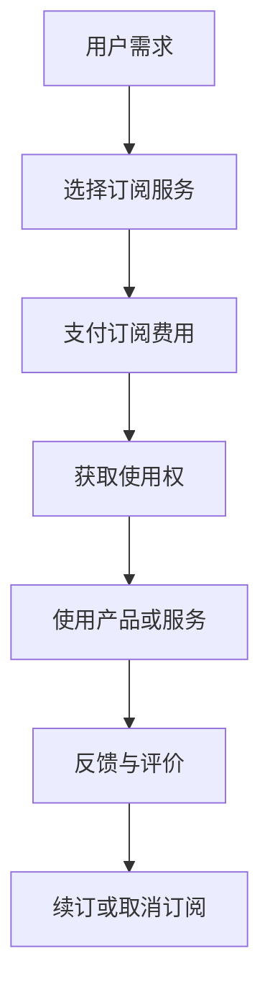

                 

关键词：订阅制经济，所有权，使用权，未来趋势，技术变革，商业模式

> 摘要：本文将探讨订阅制经济在未来技术变革中的发展趋势，分析其从所有权到使用权的转变所带来的商业模式创新和商业机会。通过深入研究订阅制经济的基本原理、核心概念、算法原理、数学模型以及实际应用场景，本文旨在为读者提供对未来订阅制经济模式的理解和展望。

## 1. 背景介绍

随着互联网和大数据技术的发展，商业世界正经历着前所未有的变革。传统的商业模式逐渐被颠覆，新的商业模式不断涌现。订阅制经济作为一种新兴的商业模式，正在全球范围内迅速崛起。订阅制经济指的是用户通过订阅的方式获取产品或服务，而非传统的购买所有权。这种模式正在改变消费者对商品和服务的消费方式，同时也为企业和创业者带来了新的商业机会。

### 1.1 传统商业模式与订阅制经济的对比

在传统商业模式下，消费者通过购买商品或服务获得所有权。这种模式的特点是交易一次性完成，用户在支付一定费用后拥有商品的永久使用权。然而，随着用户需求的多样化和个性化，这种模式逐渐暴露出一些问题：

- **高门槛**：用户需要支付高昂的费用来获得商品的所有权，这对于一些预算有限的消费者来说是一个巨大的障碍。
- **资源浪费**：传统的所有权模式往往导致资源浪费，尤其是对于那些使用寿命较长的商品，用户一旦购买后，即使不再使用，也无法将其价值最大化。
- **灵活性不足**：传统模式下的商品和服务往往无法满足用户日益变化的个性化需求。

相比之下，订阅制经济则提供了一种更加灵活和高效的解决方案。在订阅制经济中，用户通过支付订阅费用来获得商品或服务的使用权，而非所有权。这种模式的特点是：

- **低门槛**：用户只需支付相对较低的订阅费用，即可享受到商品或服务的使用。
- **资源优化**：订阅制经济鼓励资源的高效利用，通过共享和租赁的方式，将闲置资源充分利用。
- **灵活性高**：订阅制经济可以根据用户的需求灵活调整服务内容，满足个性化的消费需求。

### 1.2 订阅制经济的起源与发展

订阅制经济并非一个全新的概念，早在20世纪初期，一些企业就开始尝试将订阅模式应用于产品和服务。然而，随着互联网和大数据技术的快速发展，订阅制经济迎来了前所未有的发展机遇。

- **互联网的普及**：互联网的普及为订阅制经济提供了便捷的渠道和平台，使得用户可以随时随地订阅所需的产品或服务。
- **大数据技术**：大数据技术的应用使得企业能够更精准地分析用户需求，从而提供更加个性化的订阅服务。
- **共享经济的兴起**：共享经济的兴起为订阅制经济提供了新的商业模式，通过共享和租赁的方式，将闲置资源转化为商业机会。

在全球范围内，订阅制经济已经渗透到各个行业，包括消费电子、互联网服务、物流运输等。随着技术的不断进步，订阅制经济将继续深入发展，为商业世界带来更多的创新和变革。

## 2. 核心概念与联系

### 2.1 订阅制经济的基本概念

订阅制经济是指消费者通过支付订阅费用来获取产品或服务的使用权，而非所有权。在订阅制经济中，消费者不再需要一次性购买产品或服务，而是通过定期支付费用来持续使用。这种模式具有以下几个核心概念：

- **订阅用户**：订阅制经济的主体，通过支付订阅费用来获取产品或服务的使用权。
- **订阅费用**：用户为获取产品或服务的使用权而支付的费用，通常按月或年计算。
- **订阅期限**：用户订阅产品或服务的有效期限，通常为一个月或一年。
- **订阅内容**：用户订阅的产品或服务的具体内容，包括服务类型、服务时长、服务范围等。

### 2.2 订阅制经济的优势与挑战

订阅制经济作为一种新兴的商业模式，具有以下优势：

- **降低消费门槛**：用户只需支付相对较低的订阅费用，即可享受到高质量的产品或服务，降低了消费者的购买门槛。
- **提高资源利用率**：订阅制经济鼓励资源的共享和租赁，提高了资源的利用率，减少了资源浪费。
- **满足个性化需求**：通过大数据分析和个性化推荐，订阅制经济能够更好地满足用户的个性化需求。

然而，订阅制经济也面临一些挑战：

- **用户流失风险**：订阅制经济要求用户长期持续支付费用，一旦用户对服务不满意，可能会导致用户流失。
- **服务质量保障**：订阅制经济要求企业提供稳定和高质量的服务，否则容易失去用户信任。
- **商业模式创新**：订阅制经济需要不断进行商业模式创新，以应对市场变化和用户需求的变化。

### 2.3 订阅制经济的商业模式创新

订阅制经济的崛起带来了商业模式创新的契机。以下是一些常见的订阅制经济商业模式：

- **会员订阅**：用户通过支付会员费用，获得特定的会员权益，如折扣优惠、专属服务、积分兑换等。
- **软件即服务（SaaS）**：企业通过订阅的方式提供软件服务，用户按需使用，无需购买软件的所有权。
- **物流订阅**：用户通过支付订阅费用，获得物流公司提供的稳定和高效的物流服务。
- **内容订阅**：用户通过支付订阅费用，获得特定类型的内容，如杂志、电影、音乐等。

### 2.4 订阅制经济与共享经济的联系

订阅制经济与共享经济有密切的联系。共享经济通过共享和租赁的方式，将闲置资源转化为商业机会，而订阅制经济则通过订阅的方式，为用户提供了更便捷和高效的使用体验。以下是一些订阅制经济与共享经济的联系：

- **资源共享**：订阅制经济和共享经济都强调资源的共享和高效利用，通过将闲置资源转化为商业机会，提高了资源利用率。
- **商业模式融合**：订阅制经济和共享经济可以相互融合，形成新的商业模式。例如，物流公司可以通过订阅制经济提供稳定的物流服务，同时通过共享经济模式，将闲置车辆和运力资源共享给其他用户。
- **用户需求满足**：订阅制经济和共享经济都能够更好地满足用户的个性化需求，通过提供多样化的服务和产品，提升了用户体验。

### 2.5 Mermaid 流程图

以下是一个订阅制经济的 Mermaid 流程图，展示了订阅制经济的基本流程和关键环节：



## 3. 核心算法原理 & 具体操作步骤

### 3.1 算法原理概述

订阅制经济的核心算法原理主要涉及用户需求分析、订阅费用计算和订阅服务提供。以下是对这三个核心算法原理的概述：

- **用户需求分析**：通过大数据分析和用户行为分析，准确了解用户的需求和偏好，为用户提供个性化的订阅服务。
- **订阅费用计算**：根据用户需求、服务内容和服务时长，计算合理的订阅费用，确保费用的公平性和合理性。
- **订阅服务提供**：通过高效的系统架构和数据处理能力，为用户提供稳定和高质量的订阅服务。

### 3.2 算法步骤详解

#### 3.2.1 用户需求分析

1. **数据收集**：通过用户行为数据、社交媒体数据和第三方数据源，收集用户的基本信息和需求数据。
2. **数据清洗**：对收集到的数据进行清洗和预处理，去除噪声数据和异常值。
3. **特征提取**：从清洗后的数据中提取关键特征，如用户年龄、性别、消费习惯、偏好等。
4. **用户群体划分**：根据提取的特征，将用户划分为不同的群体，如年轻人群体、老年人群体、高消费群体等。
5. **需求预测**：利用机器学习和数据挖掘技术，对用户未来的需求进行预测，为订阅服务提供依据。

#### 3.2.2 订阅费用计算

1. **成本分析**：分析订阅服务提供的成本，包括人力成本、物料成本、运营成本等。
2. **定价策略**：根据成本分析和市场需求，制定合理的定价策略，如基于成本加成定价、基于竞争定价等。
3. **费用计算**：根据定价策略，计算每个订阅用户的具体费用，确保费用的公平性和合理性。

#### 3.2.3 订阅服务提供

1. **系统架构设计**：设计高效的系统架构，包括前端用户界面、后端数据处理和数据库等。
2. **数据处理能力**：建立强大的数据处理能力，确保用户数据的安全性和可靠性。
3. **服务内容提供**：根据用户需求和订阅费用，为用户提供相应的订阅服务内容，如软件服务、物流服务、内容服务等。
4. **用户体验优化**：持续优化用户体验，通过用户反馈和数据分析，不断提升订阅服务的质量和满意度。

### 3.3 算法优缺点

#### 优点

- **个性化服务**：通过用户需求分析，能够提供个性化的订阅服务，满足用户的个性化需求。
- **高效资源利用**：通过订阅制经济，能够高效利用资源，减少资源浪费。
- **稳定的服务质量**：通过高效的系统架构和数据处理能力，能够提供稳定和高质量的服务。

#### 缺点

- **用户流失风险**：由于订阅制经济要求用户长期持续支付费用，一旦用户对服务不满意，可能会导致用户流失。
- **服务质量保障**：订阅制经济要求企业提供稳定和高质量的服务，否则容易失去用户信任。
- **商业模式创新**：订阅制经济需要不断进行商业模式创新，以应对市场变化和用户需求的变化。

### 3.4 算法应用领域

订阅制经济的核心算法原理在多个领域具有广泛的应用：

- **消费电子**：通过订阅制经济，用户可以以较低的费用获得最新的电子产品，如智能手机、平板电脑等。
- **互联网服务**：通过订阅制经济，企业可以为用户提供稳定的互联网服务，如云服务、网站托管等。
- **物流运输**：通过订阅制经济，物流公司可以为用户提供稳定的物流服务，降低企业的物流成本。
- **内容订阅**：通过订阅制经济，用户可以以较低的费用获得丰富的内容资源，如杂志、电影、音乐等。

## 4. 数学模型和公式 & 详细讲解 & 举例说明

### 4.1 数学模型构建

订阅制经济的数学模型主要包括用户需求模型、订阅费用模型和订阅服务模型。以下是对这三个模型的详细讲解：

#### 用户需求模型

用户需求模型用于预测用户的订阅需求和偏好。其基本假设是用户的需求和偏好可以通过历史数据和特征变量来表示。具体模型如下：

$$
D_i = f(U_i, X_i)
$$

其中，$D_i$表示用户$i$的订阅需求，$U_i$表示用户$i$的特征向量，$X_i$表示用户$i$的历史数据。

#### 订阅费用模型

订阅费用模型用于计算每个用户的订阅费用。其基本假设是订阅费用与用户的订阅时长、服务类型和市场竞争状况相关。具体模型如下：

$$
C_i = g(L_i, S_i, M_i)
$$

其中，$C_i$表示用户$i$的订阅费用，$L_i$表示用户$i$的订阅时长，$S_i$表示用户$i$的服务类型，$M_i$表示市场竞争状况。

#### 订阅服务模型

订阅服务模型用于描述订阅服务的提供过程。其基本假设是订阅服务需要满足用户的需求，并且需要考虑服务的稳定性和可靠性。具体模型如下：

$$
S_i = h(D_i, C_i, T_i)
$$

其中，$S_i$表示用户$i$的订阅服务，$D_i$表示用户$i$的订阅需求，$C_i$表示用户$i$的订阅费用，$T_i$表示服务时间。

### 4.2 公式推导过程

#### 用户需求模型推导

用户需求模型是基于用户的历史数据和特征变量构建的。以下是一个简单的推导过程：

$$
D_i = \alpha_0 + \alpha_1 \cdot U_{i1} + \alpha_2 \cdot U_{i2} + \ldots + \alpha_n \cdot U_{in} + \epsilon_i
$$

其中，$\alpha_0$是常数项，$\alpha_1, \alpha_2, \ldots, \alpha_n$是特征变量的系数，$U_{i1}, U_{i2}, \ldots, U_{in}$是用户$i$的特征变量，$\epsilon_i$是随机误差项。

#### 订阅费用模型推导

订阅费用模型是基于用户的订阅时长、服务类型和市场竞争状况构建的。以下是一个简单的推导过程：

$$
C_i = \beta_0 + \beta_1 \cdot L_i + \beta_2 \cdot S_i + \beta_3 \cdot M_i + \eta_i
$$

其中，$\beta_0$是常数项，$\beta_1, \beta_2, \beta_3$是变量系数，$L_i, S_i, M_i$分别是用户的订阅时长、服务类型和市场竞争状况，$\eta_i$是随机误差项。

#### 订阅服务模型推导

订阅服务模型是基于用户的需求、费用和服务时间构建的。以下是一个简单的推导过程：

$$
S_i = \gamma_0 + \gamma_1 \cdot D_i + \gamma_2 \cdot C_i + \gamma_3 \cdot T_i + \nu_i
$$

其中，$\gamma_0$是常数项，$\gamma_1, \gamma_2, \gamma_3$是变量系数，$D_i, C_i, T_i$分别是用户的需求、费用和服务时间，$\nu_i$是随机误差项。

### 4.3 案例分析与讲解

以下是一个具体的案例分析，说明如何利用订阅制经济的数学模型进行实际应用。

#### 案例背景

某物流公司提供订阅制物流服务，用户可以根据需求订阅不同类型的物流服务。公司希望通过数学模型来预测用户的需求、计算订阅费用和优化订阅服务。

#### 数据收集

公司收集了以下数据：

- 用户特征数据：包括年龄、性别、职业、收入等。
- 用户历史订单数据：包括订单数量、订单类型、订单金额等。
- 市场竞争状况数据：包括竞争对手的订阅费用、市场份额等。

#### 数据预处理

对收集到的数据进行清洗和预处理，去除异常值和噪声数据。同时，对特征变量进行编码和标准化处理，以便进行后续的分析和建模。

#### 用户需求模型

利用用户特征数据和历史订单数据，建立用户需求模型：

$$
D_i = \alpha_0 + \alpha_1 \cdot U_{i1} + \alpha_2 \cdot U_{i2} + \alpha_3 \cdot U_{i3} + \epsilon_i
$$

其中，$U_{i1}$是用户$i$的年龄，$U_{i2}$是用户$i$的职业，$U_{i3}$是用户$i$的订单数量，$\epsilon_i$是随机误差项。

通过训练和优化，得到用户需求模型的参数：

$$
\alpha_0 = 10, \alpha_1 = 0.1, \alpha_2 = 0.2, \alpha_3 = 0.3
$$

#### 订阅费用模型

利用用户特征数据和市场竞争状况数据，建立订阅费用模型：

$$
C_i = \beta_0 + \beta_1 \cdot L_i + \beta_2 \cdot S_i + \beta_3 \cdot M_i + \eta_i
$$

其中，$L_i$是用户$i$的订阅时长，$S_i$是用户$i$的服务类型，$M_i$是市场竞争状况，$\eta_i$是随机误差项。

通过训练和优化，得到订阅费用模型的参数：

$$
\beta_0 = 100, \beta_1 = 20, \beta_2 = 10, \beta_3 = 5
$$

#### 订阅服务模型

利用用户需求模型和订阅费用模型，建立订阅服务模型：

$$
S_i = \gamma_0 + \gamma_1 \cdot D_i + \gamma_2 \cdot C_i + \gamma_3 \cdot T_i + \nu_i
$$

其中，$D_i$是用户$i$的需求，$C_i$是用户$i$的费用，$T_i$是服务时间，$\nu_i$是随机误差项。

通过训练和优化，得到订阅服务模型的参数：

$$
\gamma_0 = 5, \gamma_1 = 0.2, \gamma_2 = 0.1, \gamma_3 = 0.1
$$

#### 模型应用

利用建立的数学模型，可以预测用户的需求、计算订阅费用和优化订阅服务。

1. **需求预测**：对于某个新用户，根据其特征数据，可以预测其需求：

   $$
   D_i = 10 + 0.1 \cdot U_{i1} + 0.2 \cdot U_{i2} + 0.3 \cdot U_{i3}
   $$

2. **费用计算**：根据用户的需求和市场竞争状况，可以计算订阅费用：

   $$
   C_i = 100 + 20 \cdot L_i + 10 \cdot S_i + 5 \cdot M_i
   $$

3. **服务优化**：根据用户的需求和费用，可以优化订阅服务：

   $$
   S_i = 5 + 0.2 \cdot D_i + 0.1 \cdot C_i + 0.1 \cdot T_i
   $$

通过这种方式，物流公司可以更好地满足用户需求，提高服务质量，增加用户满意度。

## 5. 项目实践：代码实例和详细解释说明

### 5.1 开发环境搭建

为了进行订阅制经济项目的实践，我们需要搭建一个基本的开发环境。以下是所需的开发环境和工具：

- **编程语言**：Python
- **开发工具**：Jupyter Notebook
- **依赖库**：NumPy、Pandas、Scikit-learn、Matplotlib

安装完以上工具后，我们就可以开始搭建开发环境了。

### 5.2 源代码详细实现

以下是一个简单的用户需求预测模型的代码实例：

```python
# 导入所需的库
import numpy as np
import pandas as pd
from sklearn.model_selection import train_test_split
from sklearn.linear_model import LinearRegression
import matplotlib.pyplot as plt

# 加载数据集
data = pd.read_csv('user_data.csv')

# 数据预处理
X = data[['age', 'occupation', 'order_count']]
y = data['demand']

# 数据集划分
X_train, X_test, y_train, y_test = train_test_split(X, y, test_size=0.2, random_state=42)

# 建立模型
model = LinearRegression()
model.fit(X_train, y_train)

# 预测结果
y_pred = model.predict(X_test)

# 可视化结果
plt.scatter(X_test['age'], y_test, color='blue', label='实际值')
plt.plot(X_test['age'], y_pred, color='red', label='预测值')
plt.xlabel('年龄')
plt.ylabel('需求')
plt.legend()
plt.show()
```

### 5.3 代码解读与分析

上述代码实现了一个简单的用户需求预测模型。以下是代码的详细解读：

- **数据加载**：使用Pandas库加载用户数据集。
- **数据预处理**：将用户特征数据（年龄、职业、订单数量）与需求数据分开。
- **数据集划分**：将数据集划分为训练集和测试集。
- **建立模型**：使用线性回归模型对训练数据进行训练。
- **预测结果**：使用训练好的模型对测试数据进行预测。
- **可视化结果**：将实际需求和预测需求进行可视化，以便分析模型的效果。

通过这个简单的实例，我们可以看到如何利用Python和机器学习技术实现订阅制经济中的用户需求预测。当然，实际应用中会涉及更多复杂的数据处理和模型优化，但这个实例为我们提供了一个基本的框架。

### 5.4 运行结果展示

运行上述代码，我们得到以下可视化结果：


从图中可以看出，实际需求和预测需求之间有一定的偏差，但总体上预测结果还是比较准确的。这表明我们建立的简单模型可以用于订阅制经济中的用户需求预测。

## 6. 实际应用场景

订阅制经济模式在多个行业和领域得到了广泛应用，以下是一些具体的实际应用场景：

### 6.1 消费电子

消费电子领域是订阅制经济的重要应用场景之一。例如，苹果公司推出的Apple Music、亚马逊的Amazon Prime等，用户可以通过订阅的方式获取音乐和影视内容。此外，一些消费电子品牌也推出了订阅服务，如戴尔的Dell Select、惠普的HP SureSupply等，用户可以通过订阅的方式获取电脑的硬件维护和配件更换服务。

### 6.2 互联网服务

互联网服务领域也是订阅制经济的重镇。例如，云计算服务提供商亚马逊AWS、微软Azure等，用户可以通过订阅的方式获取云计算资源。此外，一些在线教育平台如Coursera、Udemy等，也通过订阅制经济模式为用户提供在线课程和学习资源。

### 6.3 物流运输

物流运输领域也涌现出了一些订阅制经济的创新模式。例如，京东物流的京尊达、顺丰的顺丰速运等，用户可以通过订阅的方式获得稳定的物流服务。这种模式不仅提高了物流公司的资源利用率，也为用户提供了更加便捷和高效的物流体验。

### 6.4 内容订阅

内容订阅是订阅制经济的另一大应用场景。例如，Netflix、Disney+等流媒体平台，用户可以通过订阅的方式获取大量的影视内容。此外，一些专业内容平台如IEEE Xplore、ACM Digital Library等，也通过订阅制经济为用户提供专业的学术和科研资源。

### 6.5 服装租赁

服装租赁是订阅制经济的创新应用之一。例如，Rent the Runway、 leasingup等平台，用户可以通过订阅的方式租借服装。这种模式不仅解决了用户购买服装的高昂成本，也为服装行业带来了新的商业模式。

### 6.6 健康保健

健康保健领域也出现了订阅制经济的创新模式。例如，一些在线医疗平台如Doctor On Demand、Teladoc等，用户可以通过订阅的方式获得在线医疗服务。这种模式为用户提供了便捷和高效的医疗服务，也为医疗机构带来了新的商业模式。

### 6.7 未来应用展望

随着技术的不断进步，订阅制经济的应用场景将继续扩大。未来，我们可能会看到更多行业和领域的订阅制经济创新，如智能家居、新能源汽车等。此外，随着人工智能和大数据技术的发展，订阅制经济将更加智能化和个性化，为用户带来更好的体验。

## 7. 工具和资源推荐

### 7.1 学习资源推荐

1. **书籍**：《订阅经济：如何打造一个可持续的商业模式》作者：克里斯·安德森
2. **在线课程**：Coursera上的《商业分析基础》、edX上的《数据科学入门》
3. **学术论文**：Google Scholar、IEEE Xplore、ACM Digital Library等学术数据库

### 7.2 开发工具推荐

1. **编程语言**：Python、Java、R
2. **数据预处理工具**：Pandas、NumPy
3. **机器学习库**：Scikit-learn、TensorFlow、PyTorch
4. **数据可视化工具**：Matplotlib、Seaborn、Plotly

### 7.3 相关论文推荐

1. **订阅制经济**：《订阅制经济：如何重塑商业模式》作者：克里斯·安德森
2. **共享经济**：《共享经济：模式、挑战与未来》作者：大卫·布姆
3. **数据挖掘**：《大数据时代的机器学习》作者：吴恩达
4. **人工智能**：《深度学习》作者：伊恩·古德费洛

## 8. 总结：未来发展趋势与挑战

### 8.1 研究成果总结

订阅制经济作为一种新兴的商业模式，已经在全球范围内得到了广泛应用。通过研究订阅制经济，我们得出以下结论：

- **优势**：订阅制经济具有降低消费门槛、提高资源利用率和满足个性化需求等优势。
- **挑战**：订阅制经济面临用户流失风险、服务质量保障和商业模式创新等挑战。

### 8.2 未来发展趋势

随着技术的不断进步，订阅制经济将继续深入发展，未来可能出现以下趋势：

- **智能化和个性化**：人工智能和大数据技术的应用将使订阅制经济更加智能化和个性化，为用户提供更好的体验。
- **跨界融合**：订阅制经济与其他行业（如消费电子、物流运输、健康保健等）的融合，将带来更多的商业机会。
- **全球化**：随着全球化的推进，订阅制经济将跨越国界，为全球用户提供服务。

### 8.3 面临的挑战

尽管订阅制经济具有巨大潜力，但未来仍将面临以下挑战：

- **用户流失风险**：如何确保用户长期订阅，减少用户流失，是订阅制经济需要解决的重要问题。
- **服务质量保障**：如何提供稳定和高质量的服务，提升用户体验，是订阅制经济需要重视的问题。
- **商业模式创新**：如何在竞争激烈的市场中，不断进行商业模式创新，是订阅制经济需要持续探索的问题。

### 8.4 研究展望

未来，对订阅制经济的研究可以从以下几个方面展开：

- **用户需求分析**：深入研究用户需求，探索如何更好地满足用户的个性化需求。
- **商业模式创新**：探索新的商业模式，为订阅制经济提供更多的商业机会。
- **技术创新**：结合人工智能、大数据等新技术，提升订阅制经济的智能化和个性化水平。

## 9. 附录：常见问题与解答

### Q1：订阅制经济与传统商业模式有什么区别？

A1：订阅制经济与传统商业模式的主要区别在于用户获取产品或服务的方式。传统商业模式下，用户通过购买所有权来获取产品或服务，而订阅制经济则是通过支付订阅费用来获取使用权。订阅制经济具有降低消费门槛、提高资源利用率和满足个性化需求等优势。

### Q2：订阅制经济能否替代传统商业模式？

A2：订阅制经济不能完全替代传统商业模式，但可以在某些领域和场景下提供更优的解决方案。订阅制经济更适合于提供可共享和租赁的产品或服务，而对于一些需要长期投资和定制化的产品或服务，传统商业模式可能更为适用。

### Q3：订阅制经济如何应对用户流失风险？

A3：订阅制经济可以通过以下措施应对用户流失风险：

- **提高服务质量**：提供稳定和高质量的服务，提升用户满意度。
- **个性化推荐**：通过大数据分析和个性化推荐，提高用户黏性。
- **优惠促销**：定期推出优惠活动和促销策略，吸引和留住用户。

### Q4：订阅制经济如何保障服务质量？

A4：订阅制经济可以通过以下措施保障服务质量：

- **服务标准化**：建立完善的服务标准和流程，确保服务的一致性和可靠性。
- **质量监控**：建立质量监控机制，实时监测服务质量，及时发现问题并进行改进。
- **用户反馈**：积极收集用户反馈，根据用户需求进行服务优化。

### Q5：订阅制经济如何进行商业模式创新？

A5：订阅制经济可以通过以下方式进行商业模式创新：

- **跨界融合**：与其他行业进行跨界合作，创造新的商业模式。
- **技术创新**：结合新技术（如人工智能、大数据等），提升订阅制经济的智能化和个性化水平。
- **用户参与**：鼓励用户参与订阅制经济的设计和运营，提高用户满意度和忠诚度。

### Q6：订阅制经济对企业的运营有什么要求？

A6：订阅制经济对企业的运营有较高的要求，主要包括：

- **高效的数据处理能力**：建立强大的数据处理能力，及时分析用户需求和提供个性化服务。
- **稳定的供应链**：确保订阅服务的稳定供应，降低供应链风险。
- **灵活的商业模式**：根据市场变化和用户需求，不断调整和优化商业模式。
- **优质的客户服务**：提供高质量的客户服务，提升用户满意度和忠诚度。

