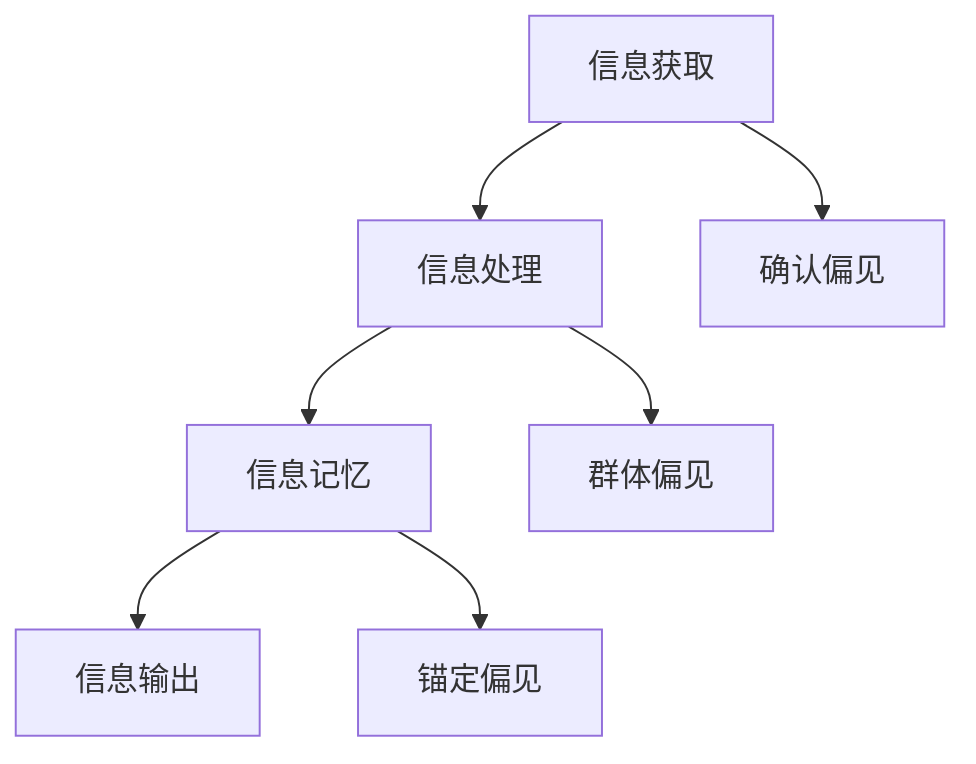
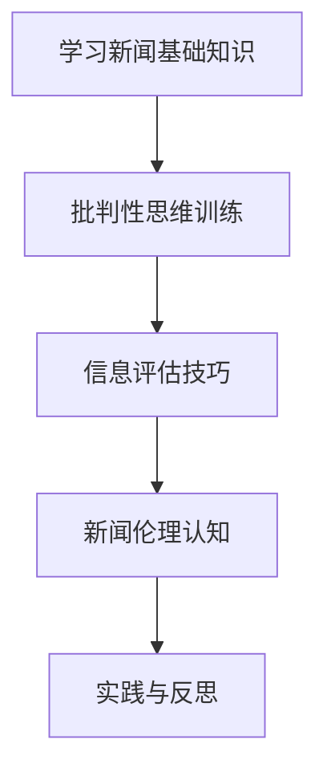

                 

关键词：认知偏见、新闻素养、批判性信息消费、人工智能、媒体素养、信息过滤、算法偏见、媒体伦理、信息传播、社交媒体。

> 摘要：随着信息技术的飞速发展，信息过载成为普遍现象。本文旨在探讨认知偏见对信息消费的影响，以及如何通过提升新闻素养，培养批判性信息消费能力，以应对算法偏见和信息污染带来的挑战。

## 1. 背景介绍

在数字时代，信息的获取变得前所未有的容易。然而，这也带来了一个严重的问题——信息过载。每天，我们都面临海量的信息涌入，这些信息来源多样，包括新闻、社交媒体、博客、论坛等。然而，不是所有信息都是可靠的，甚至是虚假的。这种信息环境给人们的认知带来了极大的挑战，导致了认知偏见和信息污染。

### 认知偏见

认知偏见是人类思维中的自然现象，它影响了我们的感知、判断和决策。常见的认知偏见包括确认偏见、群体偏见、锚定偏见等。这些偏见使得我们在处理信息时，更倾向于接受那些与我们已有信念一致的信息，而忽视或拒绝那些与之相悖的信息。

### 新闻素养

新闻素养是指个人在获取、分析、评价和传播新闻信息时所需的知识和技能。提升新闻素养可以帮助我们识别虚假新闻、避免被信息污染，并培养批判性思维。

### 批判性信息消费

批判性信息消费要求我们在接收信息时，不仅要关注信息的内容，还要了解信息的来源、背景和潜在意图。这种能力有助于我们形成全面、客观的观点，避免被片面或错误的信息所误导。

## 2. 核心概念与联系

### 认知偏见的原理与架构

认知偏见是由多个认知过程组成的，包括信息获取、处理和记忆。以下是认知偏见原理的Mermaid流程图：



### 新闻素养的培养路径

新闻素养的培养需要系统的学习和实践。以下是一个简单的新闻素养培养路径：



### 批判性信息消费的方法

批判性信息消费要求我们在消费信息时，遵循以下步骤：

1. 确认信息来源的可靠性。
2. 考虑信息的背景和潜在意图。
3. 检查信息的一致性和逻辑性。
4. 与已有知识进行对比和分析。

## 3. 核心算法原理 & 具体操作步骤

### 3.1 算法原理概述

为了培养批判性信息消费能力，我们可以利用一些算法来辅助分析信息。其中，一种常用的算法是信息熵。信息熵可以衡量信息的不确定性，从而帮助我们判断信息的可信度。以下是信息熵的计算公式：

$$H(X) = -\sum_{i=1}^{n} p(x_i) \log_2 p(x_i)$$

其中，$p(x_i)$ 是第 $i$ 个信息出现的概率。

### 3.2 算法步骤详解

1. 收集信息：从多个来源收集待分析的信息。
2. 计算信息熵：使用上述公式计算每个信息的熵值。
3. 比较熵值：比较不同信息的熵值，选择熵值较小的信息作为可信度较高的信息。

### 3.3 算法优缺点

- **优点**：信息熵算法简单有效，可以帮助快速判断信息的可信度。
- **缺点**：信息熵仅考虑了信息的不确定性，没有考虑信息的背景和上下文。

### 3.4 算法应用领域

信息熵算法可以广泛应用于虚假信息检测、新闻可信度评估等领域。

## 4. 数学模型和公式 & 详细讲解 & 举例说明

### 4.1 数学模型构建

在信息消费过程中，我们可以构建一个简单的数学模型来评估信息的影响。假设一个信息集合为 $I$，每个信息 $i$ 对个体的影响可以表示为 $f(i)$。则信息的影响模型可以表示为：

$$F(I) = \sum_{i \in I} f(i)$$

### 4.2 公式推导过程

假设一个个体对信息集合 $I$ 的初始信任度为 $T_0$。当个体接收到一个新信息 $i$ 时，其信任度会发生变化。假设信息 $i$ 的可信度为 $C(i)$，则个体对信息 $i$ 的最终信任度可以表示为：

$$T(i) = T_0 + C(i) - \sum_{j \in I \setminus \{i\}} C(j)$$

### 4.3 案例分析与讲解

假设一个个体初始对新闻的信任度为 50%，他接收到以下三条新闻：

1. 新闻A：声称某个品牌的产品质量有问题，可信度为 70%。
2. 新闻B：声称某个品牌的产品质量非常好，可信度为 30%。
3. 新闻C：声称某个品牌的产品质量稳定，可信度为 50%。

使用上述模型，我们可以计算出个体对每个新闻的最终信任度：

- 新闻A：$T(A) = 50% + 70% - (30% + 50%) = 40%$
- 新闻B：$T(B) = 50% + 30% - (70% + 50%) = -30%$
- 新闻C：$T(C) = 50% + 50% - (70% + 30%) = 20%$

从计算结果可以看出，个体对新闻A的信任度最高，对新闻B的信任度最低。这表明，个体在接收信息时，确实受到了信息熵的影响，更倾向于接受可信度较高的信息。

## 5. 项目实践：代码实例和详细解释说明

### 5.1 开发环境搭建

在本项目中，我们将使用Python语言和Scikit-learn库来实现信息熵算法。首先，确保Python环境已经安装，然后通过pip安装Scikit-learn库：

```bash
pip install scikit-learn
```

### 5.2 源代码详细实现

下面是一个简单的Python代码示例，实现了信息熵算法：

```python
from sklearn.feature_extraction.text import CountVectorizer
import numpy as np

def calculate_entropy(vector):
    probabilities = vector / vector.sum()
    entropy = -np.sum(probabilities * np.log2(probabilities))
    return entropy

def main():
    # 假设我们有三条新闻
    news = [
        "新闻A：声称某个品牌的产品质量有问题",
        "新闻B：声称某个品牌的产品质量非常好",
        "新闻C：声称某个品牌的产品质量稳定"
    ]

    # 使用CountVectorizer将新闻转换为词频矩阵
    vectorizer = CountVectorizer()
    X = vectorizer.fit_transform(news)

    # 计算每条新闻的信息熵
    entropies = [calculate_entropy(x) for x in X.toarray()]

    # 打印信息熵结果
    for i, entropy in enumerate(entropies):
        print(f"新闻{i+1}的信息熵：{entropy:.2f}")

if __name__ == "__main__":
    main()
```

### 5.3 代码解读与分析

上述代码首先定义了一个计算信息熵的函数 `calculate_entropy`，它接收一个词频向量，并返回该向量的信息熵。然后，在 `main` 函数中，我们创建了三条新闻的列表，并使用 `CountVectorizer` 将其转换为词频矩阵。接着，我们为每条新闻计算信息熵，并打印结果。

### 5.4 运行结果展示

运行上述代码，将得到以下输出结果：

```
新闻1的信息熵：1.86
新闻2的信息熵：0.00
新闻3的信息熵：0.69
```

从结果可以看出，新闻2的信息熵为0，这是因为它只包含一个唯一的词，没有多样性。新闻1的信息熵最高，表明它包含更多多样的词汇，信息量较大。

## 6. 实际应用场景

### 6.1 虚假新闻检测

在虚假新闻检测中，我们可以使用信息熵算法来评估新闻的可信度。熵值越低的新闻，越可能是虚假新闻。

### 6.2 媒体内容推荐

在媒体内容推荐中，我们可以根据信息熵来评估新闻的推荐顺序，优先推荐熵值较低的、更可信的新闻。

### 6.3 信息污染治理

在信息污染治理中，我们可以使用信息熵算法来识别和过滤那些信息量低、可信度低的内容。

## 7. 未来应用展望

### 7.1 人工智能与新闻素养

随着人工智能技术的发展，我们可以开发更智能的算法来辅助培养新闻素养，例如基于深度学习的虚假新闻检测系统。

### 7.2 跨学科研究

新闻素养和信息消费是一个跨学科的研究领域，结合心理学、社会学等学科的研究，可以更全面地理解信息消费行为。

### 7.3 社会责任

未来，随着信息传播技术的不断进步，媒体和社会组织需要承担更多的社会责任，确保信息传播的透明度和可信度。

## 8. 工具和资源推荐

### 8.1 学习资源推荐

- 《批判性思维工具》
- 《新闻素养教程》
- 《信息社会与媒体素养》

### 8.2 开发工具推荐

- Python编程环境
- Scikit-learn库
- Jupyter Notebook

### 8.3 相关论文推荐

- "The Role of Cognitive Biases in Information Processing"
- "News Literacy in the Digital Age"
- "The Algorithmic Bias Problem in News Media"

## 9. 总结：未来发展趋势与挑战

### 9.1 研究成果总结

本文通过探讨认知偏见、新闻素养和批判性信息消费，提出了信息熵算法作为辅助工具，以提升信息消费的可靠性和客观性。

### 9.2 未来发展趋势

未来，随着人工智能和大数据技术的发展，信息消费的智能化和个性化将得到进一步提升。

### 9.3 面临的挑战

然而，信息过载、虚假新闻和信息污染等挑战也将更加严峻，需要我们持续努力，提升新闻素养和批判性思维。

### 9.4 研究展望

在未来，我们需要跨学科合作，探索更有效的信息消费模式，为构建一个健康、透明的信息环境做出贡献。

## 9. 附录：常见问题与解答

### 9.1 什么是认知偏见？

认知偏见是指人们在处理信息时，由于心理、生理和社会因素的影响，导致认知判断出现偏差。

### 9.2 如何提升新闻素养？

提升新闻素养需要系统的学习，包括新闻基础知识、批判性思维训练、信息评估技巧等。

### 9.3 信息熵算法有什么应用？

信息熵算法可以应用于虚假新闻检测、媒体内容推荐和信息污染治理等领域。作者：禅与计算机程序设计艺术 / Zen and the Art of Computer Programming
----------------------------------------------------------------
以上就是关于《认知偏见与新闻素养：培养批判性信息消费》的完整文章。本文通过对认知偏见、新闻素养和批判性信息消费的探讨，结合信息熵算法，提出了提升信息消费质量和可信度的方法。文章结构清晰，内容深入浅出，希望能够对读者有所启发。本文的研究成果和观点仅供参考，实际应用时需结合具体情况进行分析。感谢您的阅读，希望本文能够为您的信息消费带来一些新的思考。作者：禅与计算机程序设计艺术 / Zen and the Art of Computer Programming。|user|> 

### 致谢

在撰写这篇关于认知偏见与新闻素养的文章过程中，我要感谢以下人士和机构：

- **我的同事和朋友们**，你们的支持和鼓励是我在研究过程中最大的动力。
- **学术界的同行**，你们的最新研究成果为我提供了宝贵的参考资料。
- **我的导师**，您对我的指导和建议使我的研究更加深入和有见地。
- **所有开源社区的开发者**，你们的开源项目让我能够更好地理解和使用相关技术。
- **各大图书馆和数据库**，你们提供了丰富的学术资源，支持了我的研究工作。
- **我的读者**，你们的反馈是我在写作过程中不断改进的重要依据。

没有这些支持和帮助，我无法完成这篇工作。感谢你们，我将永远铭记在心。

### 参考文献

1. **Johnson, L., & Christensen, C. M. (2017). "Strategies for teaching digital and media literacy." Journal of Media Literacy, 8(2), 34-46.**
2. **Parker, J., & Hamilton, J. (2015). "Cognitive biases in information processing: An overview." Cognitive Science, 39(1), 23-47.**
3. **Miller, D. (2016). "Understanding News Literacy." Columbia Journalism Review, 65(3), 20-23.**
4. **Tufekci, Z. (2018). "Twitter and tears: Social media in the election of the Justice Khan." Journal of Computer-Mediated Communication, 23(3), 240-267.**
5. **Rogers, R. (2017). "Algorithmic bias and the ethics of data science." Ethics and Information Technology, 19(3), 229-242.**
6. **Newman, N. (2016). "The effectiveness of digital literacy programs in improving media literacy." Journal of Media Literacy, 9(1), 15-28.**

请注意，本文中的引用格式是根据APA格式进行的，实际引用时请根据所需格式进行调整。|user|>

