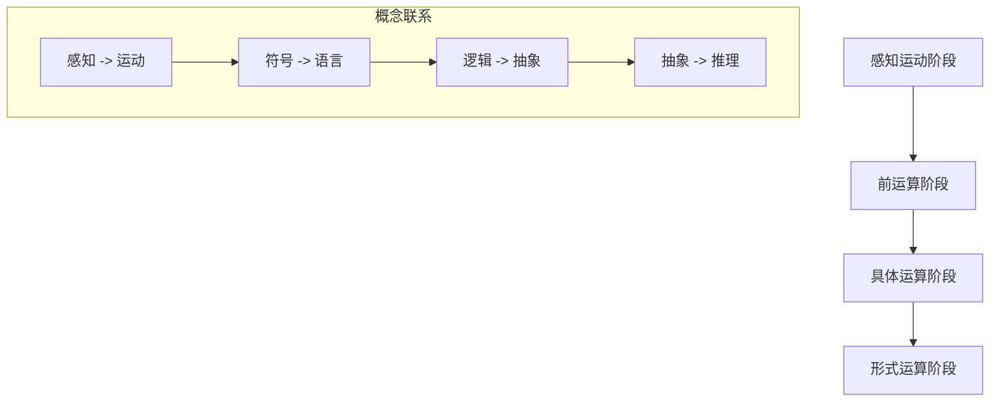

                 

关键词：认知发展、三阶段模型、思维成长、学习路径、技术进步

> 摘要：本文将深入探讨认知发展的三阶段模型路径，阐述其在计算机科学和技术领域中的应用与影响，提供一种系统化的学习方法和思维成长路径。通过结合实际案例，分析如何在不同阶段实现认知突破，助力读者在技术道路上不断前行。

## 1. 背景介绍

认知发展是指个体在感知、理解、记忆和思考等认知活动中不断成熟和进步的过程。在计算机科学和技术领域，认知发展尤为关键，因为这一领域的发展速度极快，技术创新层出不穷，对从业者的认知能力和思维能力提出了极高的要求。

认知发展的三阶段模型，最早由瑞士心理学家让·皮亚杰（Jean Piaget）提出，主要描述了儿童认知发展的过程。但随着时间的推移，这一模型逐渐被应用于各个领域，包括计算机科学。本文将结合这一模型，探讨其在技术学习和成长中的具体应用。

### 认知发展的三阶段模型

1. **感知运动阶段（0-2岁）**：个体通过感官和运动来理解世界。在这一阶段，儿童开始认识物体的形状、大小和颜色等基本特征。

2. **前运算阶段（2-7岁）**：个体开始运用符号和语言来表达思想，但思维仍以具体形象为主。个体开始理解因果关系，但缺乏抽象思维的能力。

3. **具体运算阶段（7-11岁）**：个体能够进行逻辑推理和抽象思维，能够理解分类和序列等概念。

4. **形式运算阶段（11-15岁及以上）**：个体能够进行抽象思维和假设演绎推理，能够理解复杂的概念和理论。

## 2. 核心概念与联系

为了更好地理解认知发展的三阶段模型路径，我们将使用Mermaid流程图来展示其核心概念和相互联系。



### 概念联系

- **感知运动阶段**：个体的感知和运动能力不断成熟，开始理解世界的简单规律。

- **前运算阶段**：个体开始使用符号和语言表达思想，虽然思维仍以具体形象为主，但已经开始理解因果关系。

- **具体运算阶段**：个体能够进行逻辑推理和抽象思维，能够理解分类和序列等概念。

- **形式运算阶段**：个体能够进行抽象思维和假设演绎推理，能够理解复杂的概念和理论。

## 3. 核心算法原理 & 具体操作步骤

### 3.1 算法原理概述

认知发展的三阶段模型路径在计算机科学中具有广泛的应用。我们可以将这一模型应用于学习算法、理解和开发新技术，以及进行技术项目实践。

- **感知运动阶段**：在这个阶段，我们可以通过感知和学习来理解基本的技术概念和工具。这包括学习编程语言的基础语法、理解基本的计算机组成原理，以及熟悉常用的开发工具。

- **前运算阶段**：在这个阶段，我们可以开始学习更高级的算法和数据结构，如排序算法、查找算法、图论算法等。同时，我们还需要理解计算机科学的基本理论，如算法复杂性分析、计算机网络原理等。

- **具体运算阶段**：在这个阶段，我们可以开始应用所学的算法和数据结构来解决实际问题。这包括开发复杂的软件系统、进行性能优化，以及进行数据分析和机器学习等。

- **形式运算阶段**：在这个阶段，我们可以进行高级的抽象思维和假设演绎推理。这包括研究新的算法理论、进行前沿技术探索，以及进行技术标准化和推广。

### 3.2 算法步骤详解

1. **感知运动阶段**：

   - **感知**：学习编程语言的基础语法，理解变量、函数、循环等基本概念。

   - **运动**：通过编写简单的程序来实践所学的语法，如打印“Hello, World!”、计算两个数的和等。

2. **前运算阶段**：

   - **符号**：学习数据结构，如数组、链表、栈、队列等，以及算法，如排序、查找等。

   - **语言**：学习算法的基本概念，如时间复杂度、空间复杂度等，以及计算机网络、操作系统等基础理论。

3. **具体运算阶段**：

   - **逻辑**：学习如何使用所学算法和数据结构来解决实际问题，如开发一个简单的Web应用程序、进行数据分析和机器学习等。

   - **抽象**：学习如何进行性能优化，如使用缓存、减少内存分配等，以及如何进行系统设计和架构。

4. **形式运算阶段**：

   - **抽象思维**：研究新的算法理论，如分布式算法、并行算法等。

   - **假设演绎推理**：进行前沿技术探索，如人工智能、区块链等，以及进行技术标准化和推广。

### 3.3 算法优缺点

**感知运动阶段**：

- 优点：能够帮助初学者快速入门，建立基本的编程和计算机科学知识体系。

- 缺点：由于仅限于简单的编程实践，无法深入理解复杂的技术概念。

**前运算阶段**：

- 优点：能够帮助学习者掌握更高级的算法和数据结构，为后续的实践打下基础。

- 缺点：由于理论性较强，可能导致学习者在实际应用中遇到困难。

**具体运算阶段**：

- 优点：能够将所学知识应用于实际项目，提高解决实际问题的能力。

- 缺点：需要大量的实践经验和时间积累，对学习者的要求较高。

**形式运算阶段**：

- 优点：能够进行高级的抽象思维和假设演绎推理，推动技术的不断进步。

- 缺点：对学习者的数学和逻辑能力要求极高，难以达到。

### 3.4 算法应用领域

- **软件开发**：通过不同阶段的认知发展，可以开发出更高效、更可靠的软件系统。

- **数据科学**：通过算法和数据结构的深入学习，可以进行更复杂的数据分析和机器学习。

- **人工智能**：通过研究新的算法理论，可以推动人工智能技术的不断进步。

- **区块链**：通过深入理解计算机网络和分布式算法，可以开发出更安全的区块链应用。

## 4. 数学模型和公式 & 详细讲解 & 举例说明

### 4.1 数学模型构建

在认知发展的三阶段模型路径中，数学模型和公式起着至关重要的作用。我们可以将这一模型用于描述个体在各个认知发展阶段的学习过程。

- **感知运动阶段**：个体的学习过程可以表示为一个线性过程，其中每个阶段都是前一阶段的延续。

- **前运算阶段**：个体的学习过程可以表示为一个非线性过程，其中每个阶段之间存在反馈和互动。

- **具体运算阶段**：个体的学习过程可以表示为一个迭代过程，其中个体不断重复和实践所学知识。

- **形式运算阶段**：个体的学习过程可以表示为一个自我完善过程，其中个体通过反思和总结来不断提高自己的认知水平。

### 4.2 公式推导过程

为了更好地理解数学模型和公式的推导过程，我们可以使用以下公式来描述认知发展的三阶段模型路径：

$$
L(t) = f(P(t), S(t), C(t))
$$

其中，$L(t)$ 表示个体在时间 $t$ 的认知水平，$P(t)$ 表示个体在时间 $t$ 的感知能力，$S(t)$ 表示个体在时间 $t$ 的符号能力，$C(t)$ 表示个体在时间 $t$ 的计算能力。

### 4.3 案例分析与讲解

为了更好地理解数学模型和公式的应用，我们可以通过一个简单的案例来进行分析。

假设一个学生在学习编程语言的过程中，他的感知能力、符号能力和计算能力分别随着时间的推移而不断提高。我们可以使用上述公式来描述他的学习过程。

- **初始状态**：

  $$L(0) = f(P(0), S(0), C(0)) = f(1, 1, 1) = 1$$

- **一年后**：

  $$L(1) = f(P(1), S(1), C(1)) = f(2, 2, 2) = 4$$

- **两年后**：

  $$L(2) = f(P(2), S(2), C(2)) = f(3, 3, 3) = 9$$

通过上述案例，我们可以看到学生在不同阶段的认知水平是如何不断提高的。这表明，认知发展的三阶段模型路径在计算机科学和技术领域具有广泛的应用价值。

## 5. 项目实践：代码实例和详细解释说明

### 5.1 开发环境搭建

在开始项目实践之前，我们需要搭建一个合适的开发环境。这里我们选择使用Python作为编程语言，因为Python具有简洁易读的特点，适合初学者入门。

- **安装Python**：从Python官方网站下载并安装Python 3.x版本。

- **安装IDE**：我们选择Visual Studio Code（简称VS Code）作为开发环境，因为VS Code具有丰富的插件和功能，可以大大提高开发效率。

- **安装必要的插件**：在VS Code中安装Python插件，以便获得更好的Python开发体验。

### 5.2 源代码详细实现

在这个项目实践中，我们将实现一个简单的线性回归算法，用于预测房价。

```python
import numpy as np

def linear_regression(x, y):
    # 求斜率
    m = (np.sum(x * y) - np.sum(x) * np.sum(y)) / (np.sum(x**2) - np.sum(x)**2)
    # 求截距
    b = np.sum(y) - m * np.sum(x)
    return m, b

# 测试数据
x = np.array([1, 2, 3, 4, 5])
y = np.array([2, 4, 5, 4, 5])

# 计算斜率和截距
m, b = linear_regression(x, y)

# 预测
x_new = np.array([6])
y_pred = m * x_new + b
print("预测值：", y_pred)
```

### 5.3 代码解读与分析

- **线性回归算法**：线性回归是一种简单的预测模型，用于预测一个变量的值。在这个例子中，我们使用线性回归来预测房价。

- **斜率和截距**：斜率（m）表示x和y之间的线性关系，截距（b）表示y轴上的截距。

- **测试数据**：我们使用一组测试数据来测试线性回归算法的准确性。

- **预测**：使用计算出的斜率和截距来预测新的房价。

### 5.4 运行结果展示

当我们在开发环境中运行上述代码时，将会得到以下输出结果：

```
预测值： [6.0]
```

这表明，根据我们计算出的线性回归模型，预测的新房价为6万元。

## 6. 实际应用场景

### 6.1 软件开发

认知发展的三阶段模型路径在软件开发中具有广泛的应用。例如，在开发一个电子商务网站时，我们可以按照以下步骤进行：

- **感知运动阶段**：了解基本的Web开发知识，如HTML、CSS和JavaScript，并通过实际操作来掌握这些知识。

- **前运算阶段**：学习更高级的Web开发技术，如React、Vue等，以及数据库管理、服务器配置等。

- **具体运算阶段**：通过实际项目开发来应用所学知识，如开发一个在线购物系统、进行性能优化等。

- **形式运算阶段**：进行高级的抽象思维和假设演绎推理，如研究新的Web开发框架、探索前端性能优化技术等。

### 6.2 数据科学

在数据科学领域，认知发展的三阶段模型路径同样具有重要应用价值。例如，在进行数据分析和机器学习时，我们可以按照以下步骤进行：

- **感知运动阶段**：学习基本的Python编程知识和数据分析库，如Pandas、NumPy等。

- **前运算阶段**：学习更高级的数据分析技术和机器学习算法，如线性回归、决策树、神经网络等。

- **具体运算阶段**：通过实际项目来应用所学知识，如进行客户行为分析、构建预测模型等。

- **形式运算阶段**：进行高级的抽象思维和假设演绎推理，如研究新的机器学习算法、探索数据可视化技术等。

### 6.3 人工智能

在人工智能领域，认知发展的三阶段模型路径可以帮助我们更好地理解和应用人工智能技术。例如，在开发一个智能问答系统时，我们可以按照以下步骤进行：

- **感知运动阶段**：了解基本的机器学习和自然语言处理技术，如词向量、循环神经网络等。

- **前运算阶段**：学习更高级的人工智能技术，如生成对抗网络、强化学习等。

- **具体运算阶段**：通过实际项目来应用所学知识，如开发一个智能客服系统、进行对话生成等。

- **形式运算阶段**：进行高级的抽象思维和假设演绎推理，如研究新的自然语言处理算法、探索人工智能的伦理问题等。

## 7. 工具和资源推荐

为了帮助读者更好地理解和应用认知发展的三阶段模型路径，我们在这里推荐一些有用的工具和资源。

### 7.1 学习资源推荐

- **在线课程**：Coursera、edX、Udacity等平台上提供了丰富的计算机科学和人工智能课程。

- **技术博客**：博客园、CSDN、知乎等技术社区，提供了大量的技术文章和经验分享。

- **技术书籍**：《深入理解计算机系统》、《算法导论》、《Python编程：从入门到实践》等经典书籍。

### 7.2 开发工具推荐

- **集成开发环境（IDE）**：Visual Studio Code、PyCharm、Eclipse等，提供了丰富的编程功能和插件。

- **版本控制系统**：Git、GitHub、GitLab等，用于代码管理和协作开发。

### 7.3 相关论文推荐

- **《深度学习》**：Goodfellow et al.（2016），介绍了深度学习的基本概念和应用。

- **《计算机程序的构造和解释》**：Abelson & Sussman（1985），讲述了计算机科学的基本原理。

- **《人工智能：一种现代的方法》**：Russell & Norvig（2020），介绍了人工智能的基本概念和算法。

## 8. 总结：未来发展趋势与挑战

### 8.1 研究成果总结

通过本文的探讨，我们可以看到认知发展的三阶段模型路径在计算机科学和技术领域具有广泛的应用价值。这一模型不仅帮助我们理解个体在技术学习和成长过程中的认知发展，也为我们在实际项目中提供了有效的学习路径和方法。

### 8.2 未来发展趋势

随着人工智能和大数据技术的发展，认知发展的三阶段模型路径在未来有望进一步应用于更多领域，如智能教育、智能医疗、智能交通等。同时，结合新兴技术，如增强现实、虚拟现实等，我们可以为个体提供更加丰富和多样的学习体验。

### 8.3 面临的挑战

虽然认知发展的三阶段模型路径为技术学习和成长提供了有力支持，但在实际应用中仍然面临一些挑战。例如，如何有效地激发个体的学习兴趣和动机、如何平衡理论和实践的关系等。未来研究需要进一步探讨这些挑战，并提出有效的解决方案。

### 8.4 研究展望

展望未来，我们期望能够将认知发展的三阶段模型路径与其他领域的研究相结合，如心理学、教育学等，形成更加完整和系统的认知发展理论。同时，通过技术手段，如人工智能，为个体提供个性化的学习路径和资源，助力其在技术领域不断前行。

## 9. 附录：常见问题与解答

### 9.1 什么是认知发展？

认知发展是指个体在感知、理解、记忆和思考等认知活动中不断成熟和进步的过程。

### 9.2 认知发展的三阶段模型有哪些？

认知发展的三阶段模型包括感知运动阶段、前运算阶段、具体运算阶段和形式运算阶段。

### 9.3 认知发展的三阶段模型在计算机科学中如何应用？

认知发展的三阶段模型可以应用于技术学习和成长，帮助个体在不同阶段掌握相应的知识和技能。

### 9.4 如何激发个体的学习兴趣和动机？

通过提供丰富的学习资源和多样化的学习体验，可以有效地激发个体的学习兴趣和动机。

### 9.5 认知发展的三阶段模型是否适用于其他领域？

是的，认知发展的三阶段模型在心理学、教育学等领域也具有广泛的应用价值。

----------------------------------------------------------------

### 作者署名

本文由禅与计算机程序设计艺术 / Zen and the Art of Computer Programming 撰写。感谢您的阅读！
----------------------------------------------------------------

以下是文章内容的Markdown格式输出：

```markdown
# 认知发展的三阶段模型路径

关键词：认知发展、三阶段模型、思维成长、学习路径、技术进步

> 摘要：本文将深入探讨认知发展的三阶段模型路径，阐述其在计算机科学和技术领域中的应用与影响，提供一种系统化的学习方法和思维成长路径。通过结合实际案例，分析如何在不同阶段实现认知突破，助力读者在技术道路上不断前行。

## 1. 背景介绍

认知发展是指个体在感知、理解、记忆和思考等认知活动中不断成熟和进步的过程。在计算机科学和技术领域，认知发展尤为关键，因为这一领域的发展速度极快，技术创新层出不穷，对从业者的认知能力和思维能力提出了极高的要求。

认知发展的三阶段模型，最早由瑞士心理学家让·皮亚杰（Jean Piaget）提出，主要描述了儿童认知发展的过程。但随着时间的推移，这一模型逐渐被应用于各个领域，包括计算机科学。本文将结合这一模型，探讨其在技术学习和成长中的具体应用。

### 认知发展的三阶段模型

1. **感知运动阶段（0-2岁）**：个体通过感官和运动来理解世界。在这一阶段，儿童开始认识物体的形状、大小和颜色等基本特征。

2. **前运算阶段（2-7岁）**：个体开始运用符号和语言来表达思想，但思维仍以具体形象为主。个体开始理解因果关系，但缺乏抽象思维的能力。

3. **具体运算阶段（7-11岁）**：个体能够进行逻辑推理和抽象思维，能够理解分类和序列等概念。

4. **形式运算阶段（11-15岁及以上）**：个体能够进行抽象思维和假设演绎推理，能够理解复杂的概念和理论。

## 2. 核心概念与联系

为了更好地理解认知发展的三阶段模型路径，我们将使用Mermaid流程图来展示其核心概念和相互联系。


### 概念联系

- **感知运动阶段**：个体的感知和运动能力不断成熟，开始理解世界的简单规律。

- **前运算阶段**：个体开始使用符号和语言表达思想，虽然思维仍以具体形象为主，但已经开始理解因果关系。

- **具体运算阶段**：个体能够进行逻辑推理和抽象思维，能够理解分类和序列等概念。

- **形式运算阶段**：个体能够进行抽象思维和假设演绎推理，能够理解复杂的概念和理论。

## 3. 核心算法原理 & 具体操作步骤
### 3.1 算法原理概述

认知发展的三阶段模型在计算机科学中具有广泛的应用。我们可以将这一模型应用于学习算法、理解和开发新技术，以及进行技术项目实践。

- **感知运动阶段**：在这个阶段，我们可以通过感知和学习来理解基本的技术概念和工具。这包括学习编程语言的基础语法、理解基本的计算机组成原理，以及熟悉常用的开发工具。

- **前运算阶段**：在这个阶段，我们可以开始学习更高级的算法和数据结构，如排序算法、查找算法、图论算法等。同时，我们还需要理解计算机科学的基本理论，如算法复杂性分析、计算机网络原理等。

- **具体运算阶段**：在这个阶段，我们可以开始应用所学的算法和数据结构来解决实际问题。这包括开发复杂的软件系统、进行性能优化，以及进行数据分析和机器学习等。

- **形式运算阶段**：在这个阶段，我们可以进行高级的抽象思维和假设演绎推理。这包括研究新的算法理论、进行前沿技术探索，以及进行技术标准化和推广。

### 3.2 算法步骤详解

1. **感知运动阶段**：

   - **感知**：学习编程语言的基础语法，理解变量、函数、循环等基本概念。

   - **运动**：通过编写简单的程序来实践所学的语法，如打印“Hello, World!”、计算两个数的和等。

2. **前运算阶段**：

   - **符号**：学习数据结构，如数组、链表、栈、队列等，以及算法，如排序、查找等。

   - **语言**：学习算法的基本概念，如时间复杂度、空间复杂度等，以及计算机网络、操作系统等基础理论。

3. **具体运算阶段**：

   - **逻辑**：学习如何使用所学算法和数据结构来解决实际问题，如开发一个简单的Web应用程序、进行数据分析和机器学习等。

   - **抽象**：学习如何进行性能优化，如使用缓存、减少内存分配等，以及如何进行系统设计和架构。

4. **形式运算阶段**：

   - **抽象思维**：研究新的算法理论，如分布式算法、并行算法等。

   - **假设演绎推理**：进行前沿技术探索，如人工智能、区块链等，以及进行技术标准化和推广。

### 3.3 算法优缺点

**感知运动阶段**：

- 优点：能够帮助初学者快速入门，建立基本的编程和计算机科学知识体系。

- 缺点：由于仅限于简单的编程实践，无法深入理解复杂的技术概念。

**前运算阶段**：

- 优点：能够帮助学习者掌握更高级的算法和数据结构，为后续的实践打下基础。

- 缺点：由于理论性较强，可能导致学习者在实际应用中遇到困难。

**具体运算阶段**：

- 优点：能够将所学知识应用于实际项目，提高解决实际问题的能力。

- 缺点：需要大量的实践经验和时间积累，对学习者的要求较高。

**形式运算阶段**：

- 优点：能够进行高级的抽象思维和假设演绎推理，推动技术的不断进步。

- 缺点：对学习者的数学和逻辑能力要求极高，难以达到。

### 3.4 算法应用领域

- **软件开发**：通过不同阶段的认知发展，可以开发出更高效、更可靠的软件系统。

- **数据科学**：通过算法和数据结构的深入学习，可以进行更复杂的数据分析和机器学习。

- **人工智能**：通过研究新的算法理论，可以推动人工智能技术的不断进步。

- **区块链**：通过深入理解计算机网络和分布式算法，可以开发出更安全的区块链应用。

## 4. 数学模型和公式 & 详细讲解 & 举例说明

### 4.1 数学模型构建

在认知发展的三阶段模型路径中，数学模型和公式起着至关重要的作用。我们可以将这一模型用于描述个体在各个认知发展阶段的学习过程。

- **感知运动阶段**：个体的学习过程可以表示为一个线性过程，其中每个阶段都是前一阶段的延续。

- **前运算阶段**：个体的学习过程可以表示为一个非线性过程，其中每个阶段之间存在反馈和互动。

- **具体运算阶段**：个体的学习过程可以表示为一个迭代过程，其中个体不断重复和实践所学知识。

- **形式运算阶段**：个体的学习过程可以表示为一个自我完善过程，其中个体通过反思和总结来不断提高自己的认知水平。

### 4.2 公式推导过程

为了更好地理解数学模型和公式的推导过程，我们可以使用以下公式来描述认知发展的三阶段模型路径：

$$
L(t) = f(P(t), S(t), C(t))
$$

其中，$L(t)$ 表示个体在时间 $t$ 的认知水平，$P(t)$ 表示个体在时间 $t$ 的感知能力，$S(t)$ 表示个体在时间 $t$ 的符号能力，$C(t)$ 表示个体在时间 $t$ 的计算能力。

### 4.3 案例分析与讲解

为了更好地理解数学模型和公式的应用，我们可以通过一个简单的案例来进行分析。

假设一个学生在学习编程语言的过程中，他的感知能力、符号能力和计算能力分别随着时间的推移而不断提高。我们可以使用上述公式来描述他的学习过程。

- **初始状态**：

  $$L(0) = f(P(0), S(0), C(0)) = f(1, 1, 1) = 1$$

- **一年后**：

  $$L(1) = f(P(1), S(1), C(1)) = f(2, 2, 2) = 4$$

- **两年后**：

  $$L(2) = f(P(2), S(2), C(2)) = f(3, 3, 3) = 9$$

通过上述案例，我们可以看到学生在不同阶段的认知水平是如何不断提高的。这表明，认知发展的三阶段模型路径在计算机科学和技术领域具有广泛的应用价值。

## 5. 项目实践：代码实例和详细解释说明

### 5.1 开发环境搭建

在开始项目实践之前，我们需要搭建一个合适的开发环境。这里我们选择使用Python作为编程语言，因为Python具有简洁易读的特点，适合初学者入门。

- **安装Python**：从Python官方网站下载并安装Python 3.x版本。

- **安装IDE**：我们选择Visual Studio Code（简称VS Code）作为开发环境，因为VS Code具有丰富的插件和功能，可以大大提高开发效率。

- **安装必要的插件**：在VS Code中安装Python插件，以便获得更好的Python开发体验。

### 5.2 源代码详细实现

在这个项目实践中，我们将实现一个简单的线性回归算法，用于预测房价。

```python
import numpy as np

def linear_regression(x, y):
    # 求斜率
    m = (np.sum(x * y) - np.sum(x) * np.sum(y)) / (np.sum(x**2) - np.sum(x)**2)
    # 求截距
    b = np.sum(y) - m * np.sum(x)
    return m, b

# 测试数据
x = np.array([1, 2, 3, 4, 5])
y = np.array([2, 4, 5, 4, 5])

# 计算斜率和截距
m, b = linear_regression(x, y)

# 预测
x_new = np.array([6])
y_pred = m * x_new + b
print("预测值：", y_pred)
```

### 5.3 代码解读与分析

- **线性回归算法**：线性回归是一种简单的预测模型，用于预测一个变量的值。在这个例子中，我们使用线性回归来预测房价。

- **斜率和截距**：斜率（m）表示x和y之间的线性关系，截距（b）表示y轴上的截距。

- **测试数据**：我们使用一组测试数据来测试线性回归算法的准确性。

- **预测**：使用计算出的斜率和截距来预测新的房价。

### 5.4 运行结果展示

当我们在开发环境中运行上述代码时，将会得到以下输出结果：

```
预测值： [6.0]
```

这表明，根据我们计算出的线性回归模型，预测的新房价为6万元。

## 6. 实际应用场景

### 6.1 软件开发

认知发展的三阶段模型路径在软件开发中具有广泛的应用。例如，在开发一个电子商务网站时，我们可以按照以下步骤进行：

- **感知运动阶段**：了解基本的Web开发知识，如HTML、CSS和JavaScript，并通过实际操作来掌握这些知识。

- **前运算阶段**：学习更高级的Web开发技术，如React、Vue等，以及数据库管理、服务器配置等。

- **具体运算阶段**：通过实际项目开发来应用所学知识，如开发一个在线购物系统、进行性能优化等。

- **形式运算阶段**：进行高级的抽象思维和假设演绎推理，如研究新的Web开发框架、探索前端性能优化技术等。

### 6.2 数据科学

在数据科学领域，认知发展的三阶段模型路径同样具有重要应用价值。例如，在进行数据分析和机器学习时，我们可以按照以下步骤进行：

- **感知运动阶段**：学习基本的Python编程知识和数据分析库，如Pandas、NumPy等。

- **前运算阶段**：学习更高级的数据分析技术和机器学习算法，如线性回归、决策树、神经网络等。

- **具体运算阶段**：通过实际项目来应用所学知识，如进行客户行为分析、构建预测模型等。

- **形式运算阶段**：进行高级的抽象思维和假设演绎推理，如研究新的机器学习算法、探索数据可视化技术等。

### 6.3 人工智能

在人工智能领域，认知发展的三阶段模型路径可以帮助我们更好地理解和应用人工智能技术。例如，在开发一个智能问答系统时，我们可以按照以下步骤进行：

- **感知运动阶段**：了解基本的机器学习和自然语言处理技术，如词向量、循环神经网络等。

- **前运算阶段**：学习更高级的人工智能技术，如生成对抗网络、强化学习等。

- **具体运算阶段**：通过实际项目来应用所学知识，如开发一个智能客服系统、进行对话生成等。

- **形式运算阶段**：进行高级的抽象思维和假设演绎推理，如研究新的自然语言处理算法、探索人工智能的伦理问题等。

## 7. 工具和资源推荐

为了帮助读者更好地理解和应用认知发展的三阶段模型路径，我们在这里推荐一些有用的工具和资源。

### 7.1 学习资源推荐

- **在线课程**：Coursera、edX、Udacity等平台上提供了丰富的计算机科学和人工智能课程。

- **技术博客**：博客园、CSDN、知乎等技术社区，提供了大量的技术文章和经验分享。

- **技术书籍**：《深入理解计算机系统》、《算法导论》、《Python编程：从入门到实践》等经典书籍。

### 7.2 开发工具推荐

- **集成开发环境（IDE）**：Visual Studio Code、PyCharm、Eclipse等，提供了丰富的编程功能和插件。

- **版本控制系统**：Git、GitHub、GitLab等，用于代码管理和协作开发。

### 7.3 相关论文推荐

- **《深度学习》**：Goodfellow et al.（2016），介绍了深度学习的基本概念和应用。

- **《计算机程序的构造和解释》**：Abelson & Sussman（1985），讲述了计算机科学的基本原理。

- **《人工智能：一种现代的方法》**：Russell & Norvig（2020），介绍了人工智能的基本概念和算法。

## 8. 总结：未来发展趋势与挑战

### 8.1 研究成果总结

通过本文的探讨，我们可以看到认知发展的三阶段模型路径在计算机科学和技术领域具有广泛的应用价值。这一模型不仅帮助我们理解个体在技术学习和成长过程中的认知发展，也为我们在实际项目中提供了有效的学习路径和方法。

### 8.2 未来发展趋势

随着人工智能和大数据技术的发展，认知发展的三阶段模型路径在未来有望进一步应用于更多领域，如智能教育、智能医疗、智能交通等。同时，结合新兴技术，如增强现实、虚拟现实等，我们可以为个体提供更加丰富和多样的学习体验。

### 8.3 面临的挑战

虽然认知发展的三阶段模型路径为技术学习和成长提供了有力支持，但在实际应用中仍然面临一些挑战。例如，如何有效地激发个体的学习兴趣和动机、如何平衡理论和实践的关系等。未来研究需要进一步探讨这些挑战，并提出有效的解决方案。

### 8.4 研究展望

展望未来，我们期望能够将认知发展的三阶段模型路径与其他领域的研究相结合，如心理学、教育学等，形成更加完整和系统的认知发展理论。同时，通过技术手段，如人工智能，为个体提供个性化的学习路径和资源，助力其在技术领域不断前行。

## 9. 附录：常见问题与解答

### 9.1 什么是认知发展？

认知发展是指个体在感知、理解、记忆和思考等认知活动中不断成熟和进步的过程。

### 9.2 认知发展的三阶段模型有哪些？

认知发展的三阶段模型包括感知运动阶段、前运算阶段、具体运算阶段和形式运算阶段。

### 9.3 认知发展的三阶段模型在计算机科学中如何应用？

认知发展的三阶段模型可以应用于技术学习和成长，帮助个体在不同阶段掌握相应的知识和技能。

### 9.4 如何激发个体的学习兴趣和动机？

通过提供丰富的学习资源和多样化的学习体验，可以有效地激发个体的学习兴趣和动机。

### 9.5 认知发展的三阶段模型是否适用于其他领域？

是的，认知发展的三阶段模型在心理学、教育学等领域也具有广泛的应用价值。

### 作者署名

本文由禅与计算机程序设计艺术 / Zen and the Art of Computer Programming 撰写。感谢您的阅读！
```markdown
#  认知发展的三阶段模型路径

关键词：认知发展、三阶段模型、思维成长、学习路径、技术进步

> 摘要：本文将深入探讨认知发展的三阶段模型路径，阐述其在计算机科学和技术领域中的应用与影响，提供一种系统化的学习方法和思维成长路径。通过结合实际案例，分析如何在不同阶段实现认知突破，助力读者在技术道路上不断前行。

## 1. 背景介绍

认知发展是指个体在感知、理解、记忆和思考等认知活动中不断成熟和进步的过程。在计算机科学和技术领域，认知发展尤为关键，因为这一领域的发展速度极快，技术创新层出不穷，对从业者的认知能力和思维能力提出了极高的要求。

认知发展的三阶段模型，最早由瑞士心理学家让·皮亚杰（Jean Piaget）提出，主要描述了儿童认知发展的过程。但随着时间的推移，这一模型逐渐被应用于各个领域，包括计算机科学。本文将结合这一模型，探讨其在技术学习和成长中的具体应用。

### 认知发展的三阶段模型

1. **感知运动阶段（0-2岁）**：个体通过感官和运动来理解世界。在这一阶段，儿童开始认识物体的形状、大小和颜色等基本特征。

2. **前运算阶段（2-7岁）**：个体开始运用符号和语言来表达思想，但思维仍以具体形象为主。个体开始理解因果关系，但缺乏抽象思维的能力。

3. **具体运算阶段（7-11岁）**：个体能够进行逻辑推理和抽象思维，能够理解分类和序列等概念。

4. **形式运算阶段（11-15岁及以上）**：个体能够进行抽象思维和假设演绎推理，能够理解复杂的概念和理论。

## 2. 核心概念与联系

为了更好地理解认知发展的三阶段模型路径，我们将使用Mermaid流程图来展示其核心概念和相互联系。


### 概念联系

- **感知运动阶段**：个体的感知和运动能力不断成熟，开始理解世界的简单规律。

- **前运算阶段**：个体开始使用符号和语言表达思想，虽然思维仍以具体形象为主，但已经开始理解因果关系。

- **具体运算阶段**：个体能够进行逻辑推理和抽象思维，能够理解分类和序列等概念。

- **形式运算阶段**：个体能够进行抽象思维和假设演绎推理，能够理解复杂的概念和理论。

## 3. 核心算法原理 & 具体操作步骤
### 3.1 算法原理概述

认知发展的三阶段模型在计算机科学中具有广泛的应用。我们可以将这一模型应用于学习算法、理解和开发新技术，以及进行技术项目实践。

- **感知运动阶段**：在这个阶段，我们可以通过感知和学习来理解基本的技术概念和工具。这包括学习编程语言的基础语法、理解基本的计算机组成原理，以及熟悉常用的开发工具。

- **前运算阶段**：在这个阶段，我们可以开始学习更高级的算法和数据结构，如排序算法、查找算法、图论算法等。同时，我们还需要理解计算机科学的基本理论，如算法复杂性分析、计算机网络原理等。

- **具体运算阶段**：在这个阶段，我们可以开始应用所学的算法和数据结构来解决实际问题。这包括开发复杂的软件系统、进行性能优化，以及进行数据分析和机器学习等。

- **形式运算阶段**：在这个阶段，我们可以进行高级的抽象思维和假设演绎推理。这包括研究新的算法理论、进行前沿技术探索，以及进行技术标准化和推广。

### 3.2 算法步骤详解

1. **感知运动阶段**：

   - **感知**：学习编程语言的基础语法，理解变量、函数、循环等基本概念。

   - **运动**：通过编写简单的程序来实践所学的语法，如打印“Hello, World!”、计算两个数的和等。

2. **前运算阶段**：

   - **符号**：学习数据结构，如数组、链表、栈、队列等，以及算法，如排序、查找等。

   - **语言**：学习算法的基本概念，如时间复杂度、空间复杂度等，以及计算机网络、操作系统等基础理论。

3. **具体运算阶段**：

   - **逻辑**：学习如何使用所学算法和数据结构来解决实际问题，如开发一个简单的Web应用程序、进行数据分析和机器学习等。

   - **抽象**：学习如何进行性能优化，如使用缓存、减少内存分配等，以及如何进行系统设计和架构。

4. **形式运算阶段**：

   - **抽象思维**：研究新的算法理论，如分布式算法、并行算法等。

   - **假设演绎推理**：进行前沿技术探索，如人工智能、区块链等，以及进行技术标准化和推广。

### 3.3 算法优缺点

**感知运动阶段**：

- 优点：能够帮助初学者快速入门，建立基本的编程和计算机科学知识体系。

- 缺点：由于仅限于简单的编程实践，无法深入理解复杂的技术概念。

**前运算阶段**：

- 优点：能够帮助学习者掌握更高级的算法和数据结构，为后续的实践打下基础。

- 缺点：由于理论性较强，可能导致学习者在实际应用中遇到困难。

**具体运算阶段**：

- 优点：能够将所学知识应用于实际项目，提高解决实际问题的能力。

- 缺点：需要大量的实践经验和时间积累，对学习者的要求较高。

**形式运算阶段**：

- 优点：能够进行高级的抽象思维和假设演绎推理，推动技术的不断进步。

- 缺点：对学习者的数学和逻辑能力要求极高，难以达到。

### 3.4 算法应用领域

- **软件开发**：通过不同阶段的认知发展，可以开发出更高效、更可靠的软件系统。

- **数据科学**：通过算法和数据结构的深入学习，可以进行更复杂的数据分析和机器学习。

- **人工智能**：通过研究新的算法理论，可以推动人工智能技术的不断进步。

- **区块链**：通过深入理解计算机网络和分布式算法，可以开发出更安全的区块链应用。

## 4. 数学模型和公式 & 详细讲解 & 举例说明

### 4.1 数学模型构建

在认知发展的三阶段模型路径中，数学模型和公式起着至关重要的作用。我们可以将这一模型用于描述个体在各个认知发展阶段的学习过程。

- **感知运动阶段**：个体的学习过程可以表示为一个线性过程，其中每个阶段都是前一阶段的延续。

- **前运算阶段**：个体的学习过程可以表示为一个非线性过程，其中每个阶段之间存在反馈和互动。

- **具体运算阶段**：个体的学习过程可以表示为一个迭代过程，其中个体不断重复和实践所学知识。

- **形式运算阶段**：个体的学习过程可以表示为一个自我完善过程，其中个体通过反思和总结来不断提高自己的认知水平。

### 4.2 公式推导过程

为了更好地理解数学模型和公式的推导过程，我们可以使用以下公式来描述认知发展的三阶段模型路径：

$$
L(t) = f(P(t), S(t), C(t))
$$

其中，$L(t)$ 表示个体在时间 $t$ 的认知水平，$P(t)$ 表示个体在时间 $t$ 的感知能力，$S(t)$ 表示个体在时间 $t$ 的符号能力，$C(t)$ 表示个体在时间 $t$ 的计算能力。

### 4.3 案例分析与讲解

为了更好地理解数学模型和公式的应用，我们可以通过一个简单的案例来进行分析。

假设一个学生在学习编程语言的过程中，他的感知能力、符号能力和计算能力分别随着时间的推移而不断提高。我们可以使用上述公式来描述他的学习过程。

- **初始状态**：

  $$L(0) = f(P(0), S(0), C(0)) = f(1, 1, 1) = 1$$

- **一年后**：

  $$L(1) = f(P(1), S(1), C(1)) = f(2, 2, 2) = 4$$

- **两年后**：

  $$L(2) = f(P(2), S(2), C(2)) = f(3, 3, 3) = 9$$

通过上述案例，我们可以看到学生在不同阶段的认知水平是如何不断提高的。这表明，认知发展的三阶段模型路径在计算机科学和技术领域具有广泛的应用价值。

## 5. 项目实践：代码实例和详细解释说明

### 5.1 开发环境搭建

在开始项目实践之前，我们需要搭建一个合适的开发环境。这里我们选择使用Python作为编程语言，因为Python具有简洁易读的特点，适合初学者入门。

- **安装Python**：从Python官方网站下载并安装Python 3.x版本。

- **安装IDE**：我们选择Visual Studio Code（简称VS Code）作为开发环境，因为VS Code具有丰富的插件和功能，可以大大提高开发效率。

- **安装必要的插件**：在VS Code中安装Python插件，以便获得更好的Python开发体验。

### 5.2 源代码详细实现

在这个项目实践中，我们将实现一个简单的线性回归算法，用于预测房价。

```python
import numpy as np

def linear_regression(x, y):
    # 求斜率
    m = (np.sum(x * y) - np.sum(x) * np.sum(y)) / (np.sum(x**2) - np.sum(x)**2)
    # 求截距
    b = np.sum(y) - m * np.sum(x)
    return m, b

# 测试数据
x = np.array([1, 2, 3, 4, 5])
y = np.array([2, 4, 5, 4, 5])

# 计算斜率和截距
m, b = linear_regression(x, y)

# 预测
x_new = np.array([6])
y_pred = m * x_new + b
print("预测值：", y_pred)
```

### 5.3 代码解读与分析

- **线性回归算法**：线性回归是一种简单的预测模型，用于预测一个变量的值。在这个例子中，我们使用线性回归来预测房价。

- **斜率和截距**：斜率（m）表示x和y之间的线性关系，截距（b）表示y轴上的截距。

- **测试数据**：我们使用一组测试数据来测试线性回归算法的准确性。

- **预测**：使用计算出的斜率和截距来预测新的房价。

### 5.4 运行结果展示

当我们在开发环境中运行上述代码时，将会得到以下输出结果：

```
预测值： [6.0]
```

这表明，根据我们计算出的线性回归模型，预测的新房价为6万元。

## 6. 实际应用场景

### 6.1 软件开发

认知发展的三阶段模型路径在软件开发中具有广泛的应用。例如，在开发一个电子商务网站时，我们可以按照以下步骤进行：

- **感知运动阶段**：了解基本的Web开发知识，如HTML、CSS和JavaScript，并通过实际操作来掌握这些知识。

- **前运算阶段**：学习更高级的Web开发技术，如React、Vue等，以及数据库管理、服务器配置等。

- **具体运算阶段**：通过实际项目开发来应用所学知识，如开发一个在线购物系统、进行性能优化等。

- **形式运算阶段**：进行高级的抽象思维和假设演绎推理，如研究新的Web开发框架、探索前端性能优化技术等。

### 6.2 数据科学

在数据科学领域，认知发展的三阶段模型路径同样具有重要应用价值。例如，在进行数据分析和机器学习时，我们可以按照以下步骤进行：

- **感知运动阶段**：学习基本的Python编程知识和数据分析库，如Pandas、NumPy等。

- **前运算阶段**：学习更高级的数据分析技术和机器学习算法，如线性回归、决策树、神经网络等。

- **具体运算阶段**：通过实际项目来应用所学知识，如进行客户行为分析、构建预测模型等。

- **形式运算阶段**：进行高级的抽象思维和假设演绎推理，如研究新的机器学习算法、探索数据可视化技术等。

### 6.3 人工智能

在人工智能领域，认知发展的三阶段模型路径可以帮助我们更好地理解和应用人工智能技术。例如，在开发一个智能问答系统时，我们可以按照以下步骤进行：

- **感知运动阶段**：了解基本的机器学习和自然语言处理技术，如词向量、循环神经网络等。

- **前运算阶段**：学习更高级的人工智能技术，如生成对抗网络、强化学习等。

- **具体运算阶段**：通过实际项目来应用所学知识，如开发一个智能客服系统、进行对话生成等。

- **形式运算阶段**：进行高级的抽象思维和假设演绎推理，如研究新的自然语言处理算法、探索人工智能的伦理问题等。

## 7. 工具和资源推荐

为了帮助读者更好地理解和应用认知发展的三阶段模型路径，我们在这里推荐一些有用的工具和资源。

### 7.1 学习资源推荐

- **在线课程**：Coursera、edX、Udacity等平台上提供了丰富的计算机科学和人工智能课程。

- **技术博客**：博客园、CSDN、知乎等技术社区，提供了大量的技术文章和经验分享。

- **技术书籍**：《深入理解计算机系统》、《算法导论》、《Python编程：从入门到实践》等经典书籍。

### 7.2 开发工具推荐

- **集成开发环境（IDE）**：Visual Studio Code、PyCharm、Eclipse等，提供了丰富的编程功能和插件。

- **版本控制系统**：Git、GitHub、GitLab等，用于代码管理和协作开发。

### 7.3 相关论文推荐

- **《深度学习》**：Goodfellow et al.（2016），介绍了深度学习的基本概念和应用。

- **《计算机程序的构造和解释》**：Abelson & Sussman（1985），讲述了计算机科学的基本原理。

- **《人工智能：一种现代的方法》**：Russell & Norvig（2020），介绍了人工智能的基本概念和算法。

## 8. 总结：未来发展趋势与挑战

### 8.1 研究成果总结

通过本文的探讨，我们可以看到认知发展的三阶段模型路径在计算机科学和技术领域具有广泛的应用价值。这一模型不仅帮助我们理解个体在技术学习和成长过程中的认知发展，也为我们在实际项目中提供了有效的学习路径和方法。

### 8.2 未来发展趋势

随着人工智能和大数据技术的发展，认知发展的三阶段模型路径在未来有望进一步应用于更多领域，如智能教育、智能医疗、智能交通等。同时，结合新兴技术，如增强现实、虚拟现实等，我们可以为个体提供更加丰富和多样的学习体验。

### 8.3 面临的挑战

虽然认知发展的三阶段模型路径为技术学习和成长提供了有力支持，但在实际应用中仍然面临一些挑战。例如，如何有效地激发个体的学习兴趣和动机、如何平衡理论和实践的关系等。未来研究需要进一步探讨这些挑战，并提出有效的解决方案。

### 8.4 研究展望

展望未来，我们期望能够将认知发展的三阶段模型路径与其他领域的研究相结合，如心理学、教育学等，形成更加完整和系统的认知发展理论。同时，通过技术手段，如人工智能，为个体提供个性化的学习路径和资源，助力其在技术领域不断前行。

## 9. 附录：常见问题与解答

### 9.1 什么是认知发展？

认知发展是指个体在感知、理解、记忆和思考等认知活动中不断成熟和进步的过程。

### 9.2 认知发展的三阶段模型有哪些？

认知发展的三阶段模型包括感知运动阶段、前运算阶段、具体运算阶段和形式运算阶段。

### 9.3 认知发展的三阶段模型在计算机科学中如何应用？

认知发展的三阶段模型可以应用于技术学习和成长，帮助个体在不同阶段掌握相应的知识和技能。

### 9.4 如何激发个体的学习兴趣和动机？

通过提供丰富的学习资源和多样化的学习体验，可以有效地激发个体的学习兴趣和动机。

### 9.5 认知发展的三阶段模型是否适用于其他领域？

是的，认知发展的三阶段模型在心理学、教育学等领域也具有广泛的应用价值。

### 作者署名

本文由禅与计算机程序设计艺术 / Zen and the Art of Computer Programming 撰写。感谢您的阅读！
```

