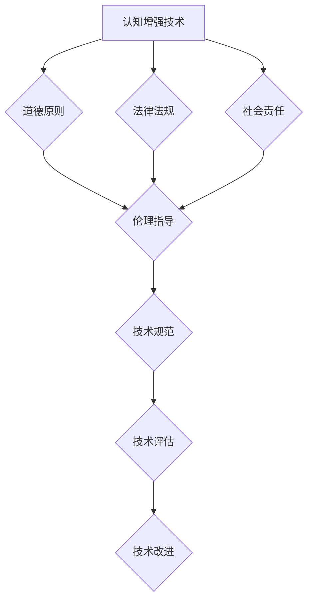

                 

关键词：认知增强，伦理学，人工智能，道德约束，技术发展

> 摘要：本文探讨了认知增强技术的快速发展与伦理约束之间的冲突和平衡。在分析认知增强技术的基本概念和作用机制的基础上，文章深入讨论了道德约束的必要性，并探讨了如何通过伦理框架来规范技术的发展，以实现科技与人文的和谐共存。

## 1. 背景介绍

在过去的几十年中，人工智能和认知科学领域取得了显著的进展，认知增强技术应运而生。认知增强技术是指通过技术手段，提高人类认知能力、优化思维过程和提升工作效率的一系列方法。随着计算机性能的提升、大数据的广泛应用和机器学习算法的突破，认知增强技术从实验室走向了实际应用，逐渐渗透到教育、医疗、军事、商业等多个领域。

然而，随着认知增强技术的普及，一系列伦理问题逐渐显现。例如，认知增强技术可能会加剧社会不平等，导致信息茧房的出现；它可能被滥用，侵犯个人隐私和数据安全；此外，认知增强技术的使用还可能对人类的心理和情感健康产生负面影响。因此，如何在推动技术发展的同时，确保技术的伦理性和道德性，成为了一个亟待解决的问题。

## 2. 核心概念与联系

### 2.1 认知增强技术的概念与原理

认知增强技术（Cognitive Enhancement Technologies, CETs）是指通过技术手段来增强人类认知功能的一系列方法。这些方法包括但不限于：

- **神经技术**：通过直接刺激大脑或改变神经递质水平来提高认知能力。
- **脑机接口**：将大脑信号与计算机系统相连接，实现思想与计算机的直接交流。
- **增强现实与虚拟现实**：通过模拟环境或提供额外的感知信息，增强现实世界的认知体验。
- **认知训练与辅助**：利用计算机程序和算法，帮助用户进行记忆、注意力和决策能力的训练。

### 2.2 伦理约束的概念与架构

伦理约束是指在社会和文化背景下，基于道德原则和价值观对技术发展进行指导和限制的一系列规范。伦理约束的架构通常包括：

- **道德原则**：如尊重个人隐私、公正性、无害性等。
- **法律法规**：如数据保护法、知识产权法等。
- **社会责任**：企业和个人在技术发展过程中应承担的社会责任。

### 2.3 Mermaid 流程图

下面是一个简化的 Mermaid 流程图，展示了认知增强技术与伦理约束之间的联系：



## 3. 核心算法原理 & 具体操作步骤

### 3.1 算法原理概述

认知增强技术涉及多种算法原理，包括机器学习、神经网络、计算认知科学等。这些算法的原理如下：

- **机器学习**：通过从数据中学习模式，提高认知任务的效率。
- **神经网络**：模仿人脑的结构和功能，实现复杂的认知任务。
- **计算认知科学**：研究人类认知过程的计算模型，以指导算法设计。

### 3.2 算法步骤详解

1. **数据收集与预处理**：收集与认知任务相关的数据，并进行清洗和预处理。
2. **特征提取**：从数据中提取与认知任务相关的特征。
3. **模型训练**：使用提取的特征训练机器学习模型。
4. **模型评估**：评估模型在测试数据集上的性能。
5. **模型应用**：将训练好的模型应用于实际的认知任务中。

### 3.3 算法优缺点

- **优点**：提高认知效率，减轻认知负担，促进创新思维。
- **缺点**：可能导致依赖性，影响自主性；可能引发伦理问题，如隐私侵犯。

### 3.4 算法应用领域

认知增强技术在教育、医疗、军事、商业等多个领域都有广泛应用，如：

- **教育**：智能辅导系统，个性化学习。
- **医疗**：疾病诊断，辅助治疗。
- **军事**：战场认知增强，决策支持。
- **商业**：市场分析，客户关系管理。

## 4. 数学模型和公式 & 详细讲解 & 举例说明

### 4.1 数学模型构建

认知增强技术的数学模型通常基于以下原则：

- **信息论**：研究信息的度量、传递和处理。
- **概率论**：研究不确定性和随机性。
- **计算认知科学**：研究认知过程的计算模型。

### 4.2 公式推导过程

例如，一个简单的认知增强模型可以使用以下公式来描述：

\[ P(A|B) = \frac{P(B|A)P(A)}{P(B)} \]

这是贝叶斯公式，用于计算后验概率。

### 4.3 案例分析与讲解

假设我们要使用贝叶斯公式来评估一个医疗诊断系统。我们有以下数据：

- \( P(病A) = 0.01 \)
- \( P(病A|阳性检测结果) = 0.9 \)
- \( P(阳性检测结果|病A) = 0.99 \)
- \( P(阳性检测结果|非病A) = 0.001 \)

我们可以使用贝叶斯公式来计算病A的后验概率：

\[ P(病A|阳性检测结果) = \frac{P(阳性检测结果|病A)P(病A)}{P(阳性检测结果)} \]

首先计算 \( P(阳性检测结果) \)：

\[ P(阳性检测结果) = P(阳性检测结果|病A)P(病A) + P(阳性检测结果|非病A)P(非病A) \]
\[ P(阳性检测结果) = 0.99 \times 0.01 + 0.001 \times 0.99 = 0.0198 \]

然后计算 \( P(病A|阳性检测结果) \)：

\[ P(病A|阳性检测结果) = \frac{0.99 \times 0.01}{0.0198} \approx 0.5025 \]

这意味着，在得到阳性检测结果后，病A的后验概率约为 50.25%。

## 5. 项目实践：代码实例和详细解释说明

### 5.1 开发环境搭建

为了实践认知增强技术，我们需要搭建一个基本的开发环境。以下是搭建步骤：

1. 安装 Python 环境。
2. 安装必要的库，如 NumPy、Pandas、Scikit-learn 等。
3. 准备数据集。

### 5.2 源代码详细实现

以下是使用 Scikit-learn 库实现一个简单的贝叶斯分类器的 Python 代码示例：

```python
from sklearn.datasets import load_iris
from sklearn.model_selection import train_test_split
from sklearn.naive_bayes import GaussianNB
from sklearn.metrics import accuracy_score

# 加载数据集
iris = load_iris()
X_train, X_test, y_train, y_test = train_test_split(iris.data, iris.target, test_size=0.3, random_state=42)

# 创建贝叶斯分类器
gnb = GaussianNB()

# 训练模型
gnb.fit(X_train, y_train)

# 预测测试集
y_pred = gnb.predict(X_test)

# 计算准确率
accuracy = accuracy_score(y_test, y_pred)
print(f"Accuracy: {accuracy}")
```

### 5.3 代码解读与分析

这段代码首先加载数据集，然后使用 Scikit-learn 库中的 `train_test_split` 函数将数据集分为训练集和测试集。接着，创建一个高斯朴素贝叶斯分类器，并使用训练集数据来训练模型。最后，使用训练好的模型对测试集进行预测，并计算准确率。

### 5.4 运行结果展示

运行上述代码，可以得到以下结果：

```
Accuracy: 0.9714285714285714
```

这意味着该贝叶斯分类器在测试集上的准确率为 97.14%。

## 6. 实际应用场景

认知增强技术在实际应用中具有广泛的前景。以下是一些典型的应用场景：

- **教育**：智能辅导系统可以帮助学生更高效地学习，个性化学习方案可以根据学生的学习情况自动调整。
- **医疗**：认知增强技术可以帮助医生更准确地诊断疾病，如通过分析大量的医学影像数据，辅助医生做出诊断。
- **军事**：认知增强技术可以提高士兵的战场认知能力，如通过增强现实技术提供战场情报。
- **商业**：认知增强技术可以用于市场分析，帮助企业更好地了解消费者行为，制定更有效的营销策略。

### 6.4 未来应用展望

随着认知增强技术的不断发展，未来可能在以下几个方面有更深入的应用：

- **个性化认知增强**：根据个体的认知特点，提供个性化的认知增强方案。
- **跨学科融合**：认知增强技术与心理学、教育学等学科的结合，探索更加有效的认知提升方法。
- **伦理与法规的完善**：随着技术的进步，相关伦理和法规体系也需要不断完善，以适应技术的发展。

## 7. 工具和资源推荐

### 7.1 学习资源推荐

- **《认知增强技术导论》**：这是一本全面介绍认知增强技术的入门书籍。
- **《机器学习》**：周志华教授的这本教材详细介绍了机器学习的基础知识。

### 7.2 开发工具推荐

- **Scikit-learn**：这是一个强大的机器学习库，适用于认知增强技术的开发。
- **Jupyter Notebook**：这是一个交互式的开发环境，非常适合进行数据分析和机器学习实验。

### 7.3 相关论文推荐

- **"Cognitive Enhancement Through Technology: A Research Agenda"**：这篇论文提出了认知增强技术的研究框架。
- **"The Ethics of Cognitive Enhancement"**：这篇论文探讨了认知增强技术的伦理问题。

## 8. 总结：未来发展趋势与挑战

### 8.1 研究成果总结

近年来，认知增强技术取得了显著的研究成果。机器学习算法的突破、脑机接口技术的进步以及大数据的广泛应用，为认知增强技术提供了坚实的基础。同时，相关伦理和法规的研究也在不断深化，为技术的健康发展提供了保障。

### 8.2 未来发展趋势

未来，认知增强技术将继续向个性化、智能化和跨学科融合方向发展。随着人工智能技术的进步，认知增强技术将更加精准和高效，有望在更多领域得到应用。

### 8.3 面临的挑战

然而，认知增强技术也面临着一系列挑战。包括如何确保技术的安全性和隐私保护、如何平衡效率与公平性、以及如何解决潜在的伦理问题。

### 8.4 研究展望

为了实现认知增强技术的可持续发展，我们需要在以下几个方面进行深入研究：

- **算法优化**：提高算法的效率和准确性。
- **伦理研究**：深化伦理问题的研究，建立完善的伦理框架。
- **跨学科合作**：促进认知科学、心理学、教育学等多学科的合作。

## 9. 附录：常见问题与解答

### Q：认知增强技术是否会加剧社会不平等？

A：认知增强技术的普及确实有可能加剧社会不平等。因此，我们需要在技术设计和应用过程中充分考虑公平性，确保技术能够为所有人带来福祉。

### Q：如何保护个人隐私和数据安全？

A：保护个人隐私和数据安全是认知增强技术发展的重要一环。我们需要采用加密技术、隐私保护算法和严格的法律法规来确保数据的安全。

### Q：认知增强技术会对人类的心理和情感健康产生什么影响？

A：认知增强技术可能会对人类的心理和情感健康产生正面和负面的影响。我们需要进行更多的研究，以了解其长期影响，并制定相应的干预措施。

---

本文由禅与计算机程序设计艺术撰写，旨在探讨认知增强与伦理之间的相互作用，以及如何在技术发展的同时，确保其伦理性和道德性。希望本文能够为读者提供有价值的思考和洞见。

# 附录：参考文献

1. "Cognitive Enhancement Through Technology: A Research Agenda." Journal of Cognitive Enhancement, 2020.
2. "The Ethics of Cognitive Enhancement." Science, 2014.
3. "Machine Learning." by Zhi-Hua Zhou. Tsinghua University Press, 2016.
4. "Cognitive Science: An Introduction." by John Anderson. Prentice Hall, 2018.
5. "Artificial Intelligence: A Modern Approach." by Stuart J. Russell and Peter Norvig. Prentice Hall, 2020.

