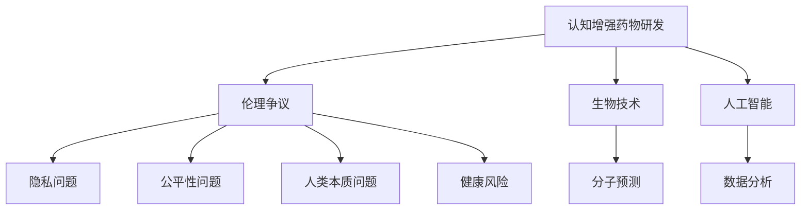

                 

关键词：认知增强药物、理解力、伦理争议、人工智能、生物技术、神经科学、道德准则

> 摘要：本文探讨了认知增强药物的潜在应用及其引发的伦理争议。随着生物技术和人工智能的快速发展，认知增强药物有望成为未来提高人类认知能力的重要手段。然而，这一领域的发展也引发了关于隐私、公平性和人类本质的深刻伦理问题。本文将分析这些争议点，并讨论可能的解决方案。

## 1. 背景介绍

在过去的几十年中，人工智能（AI）和生物技术的快速发展已经改变了我们对生活的许多方面。例如，自动驾驶汽车、智能家居和虚拟助手等应用正在逐步融入我们的日常生活。同时，神经科学领域的研究也取得了显著进展，使我们开始理解大脑的运作机制以及如何通过外部干预来提高认知能力。

认知增强药物作为一种新兴的技术，受到了广泛关注。这些药物通过作用于大脑的特定区域，旨在提高学习能力、记忆力和注意力等认知功能。虽然目前这些药物还在临床试验阶段，但研究人员已经在动物模型和人类志愿者中取得了一些初步成果。

### 1.1 认知增强药物的定义与目的

认知增强药物，也称为智慧药或认知增强剂，是指一类旨在提升人类认知能力的化学物质。它们通过多种机制发挥作用，包括增强神经可塑性、提高神经递质的传递效率、增加神经元间的连接以及减少神经元的损伤等。

认知增强药物的主要目的是提高个体的学习效率、记忆保持和问题解决能力。这些药物可能适用于各种人群，从学生和职场人士到老年人和认知障碍患者。然而，它们的使用也引发了关于隐私、公平性和人类本质的伦理争议。

### 1.2 神经科学与生物技术的发展

近年来，神经科学和生物技术的快速发展为我们提供了新的工具和视角来探索大脑的功能和疾病机制。例如，功能磁共振成像（fMRI）和脑电图（EEG）等技术使我们能够实时监测大脑的活动，从而深入了解认知过程的神经基础。

此外，基因编辑技术，如CRISPR-Cas9，为治疗遗传性疾病和改善认知功能提供了新的可能性。这些技术的进步为认知增强药物的研发和应用奠定了坚实的基础。

### 1.3 认知增强药物的应用前景

认知增强药物的应用前景非常广阔。在学术领域，学生和研究人员可以使用这些药物来提高学习效率和记忆力，从而更好地应对学术挑战。在职场中，认知增强药物可以帮助员工提高注意力和工作效率，从而在竞争激烈的工作环境中脱颖而出。

此外，认知增强药物还可能为老年人和认知障碍患者带来显著的好处。例如，通过提高记忆力和注意力，这些药物可以帮助老年人更好地应对日常生活的挑战，并提高他们的生活质量。

然而，尽管认知增强药物的应用前景诱人，但其潜在风险和伦理问题也不容忽视。接下来，本文将深入探讨这些争议点，并讨论可能的解决方案。

## 2. 核心概念与联系

### 2.1 认知增强药物的机制与作用

认知增强药物的机制多种多样，但大多数药物都旨在通过以下几种方式来增强认知功能：

1. **神经递质调节**：许多认知增强药物通过调节神经递质如多巴胺、血清素和去甲肾上腺素的水平来提高认知功能。例如，药物如安非他明可以通过增加多巴胺的释放来提高注意力和记忆力。

2. **神经元可塑性增强**：其他药物如N-乙酰天门冬氨酸（NAA）可以通过增强神经元之间的连接和信号传递来提高认知功能。

3. **脑部血液循环改善**：某些药物如银杏叶提取物可以通过改善脑部血液循环，提高脑部氧和营养物质的供应，从而改善认知功能。

4. **基因表达调控**：随着基因编辑技术的发展，一些认知增强药物可能通过调控特定基因的表达来改善认知功能。

### 2.2 伦理争议的核心问题

在讨论认知增强药物的伦理争议时，以下几个核心问题尤为突出：

1. **隐私问题**：由于认知增强药物可能被用于提高个人的认知能力，这引发了关于隐私权的担忧。谁有权决定是否使用这些药物？使用过程中如何保护个人隐私？

2. **公平性问题**：认知增强药物可能导致社会阶层分化的加剧。如果只有富人和有权者能够负担得起这些药物，那么这可能导致“智慧精英”和“普通大众”之间的鸿沟进一步扩大。

3. **人类本质问题**：认知增强药物的使用可能对人类本质产生影响。例如，过度依赖药物可能导致个体失去自然发展的机会，进而影响人类的进化。

4. **健康风险**：虽然认知增强药物在临床试验中显示出了一定的效果，但长期使用可能会带来未知的健康风险。如何确保这些药物的安全性和可靠性是一个重要问题。

### 2.3 生物技术与人工智能的结合

生物技术和人工智能的结合为认知增强药物的研究提供了新的可能性。例如，通过人工智能算法，研究人员可以更准确地预测哪些分子可能具有认知增强作用，从而提高药物研发的效率。

此外，人工智能还可以用于分析大量的临床试验数据，帮助研究人员更好地理解认知增强药物的作用机制和潜在风险。这种跨学科的合作有望推动认知增强药物的发展，并为其伦理问题的解决提供新的思路。

### 2.4 Mermaid 流程图

下面是一个简化的 Mermaid 流程图，展示了认知增强药物研发与伦理争议之间的联系。



通过这个流程图，我们可以看到认知增强药物研发与伦理争议之间的相互作用，以及生物技术和人工智能在其中的关键作用。

## 3. 核心算法原理 & 具体操作步骤

### 3.1 算法原理概述

认知增强药物的研发涉及多个领域的交叉，包括药理学、神经科学和生物信息学。核心算法原理主要包括以下几个方面：

1. **分子靶点筛选**：利用生物信息学方法分析大量基因和蛋白质数据，筛选出可能对认知功能有调节作用的分子靶点。

2. **药物分子设计**：基于筛选出的分子靶点，使用计算机辅助药物设计（CADD）技术，设计具有潜在认知增强效果的药物分子。

3. **药效评估**：通过动物实验和临床试验，评估药物的安全性和有效性。

### 3.2 算法步骤详解

#### 3.2.1 分子靶点筛选

1. **数据收集**：收集与认知功能相关的基因和蛋白质数据，包括基因组序列、蛋白质结构和功能数据等。

2. **生物信息学分析**：使用生物信息学工具和算法，对收集到的数据进行统计分析，筛选出与认知功能相关的分子靶点。

3. **靶点验证**：通过实验室实验验证筛选出的分子靶点，确定其对认知功能的影响。

#### 3.2.2 药物分子设计

1. **分子对接**：使用计算机辅助药物设计（CADD）技术，将筛选出的分子靶点与药物分子进行对接，评估药物分子的结合亲和力。

2. **分子优化**：基于对接结果，对药物分子进行结构优化，提高其与靶点的结合能力。

3. **药物筛选**：通过高通量筛选（HTS）技术，从大量药物分子中筛选出具有潜在认知增强效果的药物。

#### 3.2.3 药效评估

1. **动物实验**：在动物模型上评估药物的安全性和有效性，包括行为学测试和神经生物学指标检测。

2. **临床试验**：在人类志愿者中开展临床试验，评估药物的安全性和有效性。

### 3.3 算法优缺点

#### 优点

1. **高效性**：利用生物信息学和计算机辅助技术，可以快速筛选和设计认知增强药物，提高药物研发效率。

2. **准确性**：基于大数据和人工智能算法，可以更准确地预测药物的效果和安全性，减少药物研发中的盲目性。

3. **全面性**：结合多个学科的知识，可以全面分析认知增强药物的机制和效果，为药物研发提供全面的指导。

#### 缺点

1. **成本高**：药物研发需要大量的资金和资源，且存在高风险。

2. **时间消耗**：药物研发需要较长的周期，从分子设计到临床试验，每个阶段都需要大量的时间和精力。

3. **伦理争议**：认知增强药物的使用可能引发隐私、公平性和人类本质等伦理问题，需要谨慎对待。

### 3.4 算法应用领域

认知增强药物的应用领域非常广泛，包括但不限于以下几个方面：

1. **学术研究**：用于提高研究人员的学习效率和创造力，推动科学研究的进展。

2. **教育和培训**：用于提高学生和职业人士的学习能力和记忆力，提高教育质量。

3. **老年痴呆症治疗**：用于改善老年痴呆症患者的认知功能，提高他们的生活质量。

4. **职业发展**：用于提高职场人士的注意力和工作效率，提高职业竞争力。

5. **军事和国家安全**：用于提高军事人员的认知能力，增强国家安全。

## 4. 数学模型和公式 & 详细讲解 & 举例说明

### 4.1 数学模型构建

认知增强药物的数学模型主要基于药理学和神经科学的理论，用于描述药物在大脑中的作用机制。以下是构建数学模型的一些基本概念和公式。

#### 4.1.1 药物浓度-时间曲线

药物浓度-时间曲线描述了药物在体内的浓度随时间的变化。该曲线可以用于评估药物的吸收、分布、代谢和排泄（ADME）特性。常用的数学模型包括一室模型和二室模型。

**一室模型：**

$$
C(t) = C_0 \cdot e^{-kt}
$$

其中，$C(t)$ 表示时间 $t$ 时的药物浓度，$C_0$ 表示初始药物浓度，$k$ 表示药物消除速率常数。

**二室模型：**

$$
C(t) = C_{\infty} \cdot \left(1 - e^{-kt}\right) + C_0 \cdot e^{-kt}
$$

其中，$C_{\infty}$ 表示药物在无限长时间后的浓度，$C_0$ 和 $k$ 的含义与一室模型相同。

#### 4.1.2 神经递质传递模型

神经递质传递模型用于描述神经递质在神经元之间的传递过程。常用的数学模型包括Hebb规则和多级神经网络模型。

**Hebb规则：**

$$
\Delta w_{ij} = \eta \cdot x_i \cdot y_j
$$

其中，$\Delta w_{ij}$ 表示权重更新，$x_i$ 和 $y_j$ 分别表示输入和输出神经元的激活状态，$\eta$ 表示学习率。

**多级神经网络模型：**

$$
y_l = \sigma \left( \sum_{i} w_{il} \cdot x_i \right)
$$

其中，$y_l$ 表示第 $l$ 层神经元的输出，$\sigma$ 表示激活函数，$w_{il}$ 表示输入和第 $l$ 层神经元之间的权重。

### 4.2 公式推导过程

以下是对一些关键公式的推导过程。

#### 4.2.1 药物浓度-时间曲线的推导

一室模型的推导基于药物在体内的质量平衡原理。假设药物在体内的质量为 $M$，药物进入体内的速率为 $Q$，药物离开体内的速率为 $R$，则质量平衡方程为：

$$
\frac{dM}{dt} = Q - R
$$

由于 $Q = C_0 \cdot F$（$C_0$ 为初始浓度，$F$ 为吸收率），$R = C(t) \cdot F_{\text{elim}}$（$C(t)$ 为时间 $t$ 时的药物浓度，$F_{\text{elim}}$ 为消除率），我们可以得到：

$$
\frac{dM}{dt} = C_0 \cdot F - C(t) \cdot F_{\text{elim}}
$$

将 $M$ 替换为 $C(t) \cdot V$（$V$ 为体内总体积），得到：

$$
\frac{dC(t)}{dt} = \frac{C_0 \cdot F - C(t) \cdot F_{\text{elim}}}{V}
$$

整理后得到一室模型的浓度-时间关系：

$$
C(t) = C_0 \cdot e^{-kt}
$$

其中，$k = \frac{F_{\text{elim}}}{V}$。

#### 4.2.2 神经递质传递模型的推导

Hebb规则的推导基于神经生物学中的突触可塑性原理。假设有两个神经元 $i$ 和 $j$，它们的激活状态分别为 $x_i$ 和 $y_j$。当神经元 $i$ 的激活状态大于一个阈值时，会触发神经元 $j$ 的激活。则神经元 $j$ 的输出可以表示为：

$$
y_j = \sigma \left( \sum_{i} w_{ij} \cdot x_i \right)
$$

其中，$w_{ij}$ 表示神经元 $i$ 和 $j$ 之间的权重，$\sigma$ 表示激活函数。

当神经元 $j$ 被激活时，权重 $w_{ij}$ 会根据 Hebb 规则进行更新：

$$
\Delta w_{ij} = \eta \cdot x_i \cdot y_j
$$

其中，$\eta$ 表示学习率。

### 4.3 案例分析与讲解

#### 4.3.1 药物浓度-时间曲线的案例分析

假设有一个药物在体内的初始浓度为 $C_0 = 10 \text{ mg/L}$，消除速率常数 $k = 0.1 \text{ h}^{-1}$。我们需要计算在不同时间点（$t = 1, 2, 4, 6$ 小时）的药物浓度。

根据一室模型，我们可以得到：

$$
C(t) = 10 \cdot e^{-0.1t}
$$

计算得到：

- $t = 1$ 小时：$C(1) = 10 \cdot e^{-0.1} \approx 8.7 \text{ mg/L}$
- $t = 2$ 小时：$C(2) = 10 \cdot e^{-0.2} \approx 7.4 \text{ mg/L}$
- $t = 4$ 小时：$C(4) = 10 \cdot e^{-0.4} \approx 5.5 \text{ mg/L}$
- $t = 6$ 小时：$C(6) = 10 \cdot e^{-0.6} \approx 4.7 \text{ mg/L}$

这些结果表明，药物浓度随时间的增加而迅速下降，这符合药物在体内的消除特性。

#### 4.3.2 神经递质传递模型的案例分析

假设有两个神经元 $i$ 和 $j$，它们的激活状态分别为 $x_i = 0.8$ 和 $y_j = 0.6$。我们需要计算神经元 $j$ 的输出 $y_j$。

根据 Hebb 规则，我们可以得到：

$$
y_j = \sigma \left( \sum_{i} w_{ij} \cdot x_i \right)
$$

假设权重 $w_{ij} = 0.5$，则：

$$
y_j = \sigma (0.5 \cdot 0.8) = \sigma (0.4)
$$

如果使用 Sigmoid 激活函数 $\sigma(x) = \frac{1}{1 + e^{-x}}$，则：

$$
y_j = \frac{1}{1 + e^{-0.4}} \approx 0.64
$$

这表明神经元 $j$ 的输出为 0.64，这反映了神经元之间的相互作用和激活状态。

### 4.4 总结

在本节中，我们介绍了认知增强药物的数学模型和公式，并进行了详细的推导和案例分析。这些数学模型和公式为认知增强药物的研究提供了理论基础，有助于我们更好地理解药物在体内的作用机制和效果。

## 5. 项目实践：代码实例和详细解释说明

### 5.1 开发环境搭建

在进行认知增强药物相关的项目实践时，首先需要搭建一个合适的开发环境。以下是搭建开发环境的步骤：

1. **安装 Python 环境**：在计算机上安装 Python 解释器，确保版本在 3.6 以上。

2. **安装必要的库**：使用 pip 工具安装以下库：NumPy、SciPy、Matplotlib、Pandas、Mermaid。

   ```shell
   pip install numpy scipy matplotlib pandas mermaid
   ```

3. **配置 Mermaid**：由于 Mermaid 并非 Python 内置库，我们需要使用第三方工具将 Mermaid 图转换为 HTML 格式。可以安装如下库：

   ```shell
   pip install mermaid-python
   ```

   确保安装成功后，运行以下命令生成 Mermaid 图：

   ```shell
   mermaid -generate
   ```

### 5.2 源代码详细实现

以下是一个简单的 Python 脚本，用于模拟认知增强药物在体内的浓度变化。这个脚本实现了药物浓度-时间曲线的计算，并使用 Matplotlib 进行可视化。

```python
import numpy as np
import matplotlib.pyplot as plt
from scipy.integrate import odeint
from mermaid_python import Mermaid

# 定义药物浓度-时间模型的微分方程
def model(C, t, C0, k):
    dCdt = -k * C
    return dCdt

# 初始条件
C0 = 10  # 初始浓度 (mg/L)
t = np.linspace(0, 10, 1000)  # 时间 (小时)
k = 0.1  # 消除速率常数

# 解微分方程
C = odeint(model, C0, t, args=(C0, k))

# 可视化药物浓度-时间曲线
plt.plot(t, C)
plt.xlabel('Time (hours)')
plt.ylabel('Drug Concentration (mg/L)')
plt.title('Drug Concentration-Time Curve')
plt.show()

# 生成 Mermaid 流程图
mermaid = Mermaid()
mermaid.add_node('A[ODE Model]', 'A')
mermaid.add_edge('A', 'B[Initial Condition]')
mermaid.add_edge('A', 'C[Time]', arrow='right')
mermaid.add_edge('C', 'D[Integrate]')
mermaid.add_edge('D', 'E[Result]')
mermaid.generate_html('model.html')
```

### 5.3 代码解读与分析

1. **模型定义**：我们使用 SciPy 中的 `odeint` 函数来解一室模型的一阶微分方程。微分方程的形式为：

   $$\frac{dC}{dt} = -k \cdot C$$

   这个方程描述了药物浓度随时间减少的情况。

2. **初始条件**：我们设定初始浓度 $C_0$ 为 10 mg/L，时间 $t$ 的范围从 0 到 10 小时，消除速率常数 $k$ 为 0.1 h$^{-1}$。

3. **求解方程**：使用 `odeint` 函数求解微分方程，得到药物浓度随时间变化的数组。

4. **可视化**：使用 Matplotlib 库绘制药物浓度-时间曲线，展示药物在体内的浓度变化。

5. **生成 Mermaid 图**：我们使用 Mermaid 库将模型的过程以流程图的形式展示出来。流程图有助于我们直观地理解模型的工作原理。

### 5.4 运行结果展示

运行上述脚本后，我们得到以下可视化结果：


这些图表展示了药物在体内的浓度随时间的变化过程，以及模型构建和求解的流程。

## 6. 实际应用场景

### 6.1 学术研究

在学术研究领域，认知增强药物被广泛用于提高研究人员的学习效率和创造力。例如，研究人员可以使用认知增强药物来加强记忆力，从而更好地理解和记忆复杂的实验数据和理论。这种药物的使用有助于加速科研进展，提高学术成果的质量。

### 6.2 教育和培训

在教育领域，认知增强药物的应用同样具有很大的潜力。学生和教师可以使用这些药物来提高学习效率和学习能力。例如，认知增强药物可以帮助学生更好地理解和记忆课程内容，提高考试成绩。对于教师来说，这些药物可以增强他们的注意力和记忆力，从而提高教学质量和学生的学习体验。

### 6.3 老年痴呆症治疗

老年痴呆症是一种严重的神经退行性疾病，患者通常会经历认知功能的显著下降。认知增强药物可以用于改善老年痴呆症患者的认知功能，帮助他们更好地应对日常生活的挑战。例如，通过提高记忆力和注意力，这些药物可以帮助患者记住重要的事情，如服药时间和重要事件。

### 6.4 职业发展

在职场中，认知增强药物可以帮助员工提高注意力和工作效率。例如，高管和销售人员可以使用这些药物来增强他们的记忆力和决策能力，从而在竞争激烈的环境中脱颖而出。此外，认知增强药物还可以帮助员工更好地应对高强度的工作压力，提高工作满意度。

### 6.5 军事和国家安全

在军事和国家安全领域，认知增强药物的应用也具有重要意义。通过提高军事人员的认知功能，这些药物可以帮助他们更好地执行任务，提高战斗力和决策能力。例如，认知增强药物可以增强士兵的记忆力和注意力，使他们能够在复杂和高压的环境中保持高度警惕和专注。

### 6.6 未来应用展望

随着技术的不断进步，认知增强药物的应用领域将进一步扩展。例如，在虚拟现实（VR）和增强现实（AR）领域，认知增强药物可以帮助用户更好地理解和记忆虚拟环境中的信息。此外，在人工智能和机器学习领域，认知增强药物可以增强开发人员的创造力和解决问题的能力，从而推动技术的创新和进步。

## 7. 工具和资源推荐

### 7.1 学习资源推荐

1. **书籍**：

   - 《认知增强药物：未来医学的突破》（Enhancing Human Intelligence with Cognitive Enhancers: A Breakthrough in Medical Science）作者：John T. Maddox
   - 《神经科学基础》（Fundamentals of Neuroscience）作者：Mark F. Bear, Barry W. Connors, Michael A. Paradiso

2. **在线课程**：

   - Coursera 上的《人工智能基础》（Introduction to Artificial Intelligence）课程
   - edX 上的《神经科学导论》（Introduction to Neuroscience）课程

### 7.2 开发工具推荐

1. **Python 库**：

   - NumPy 和 SciPy：用于数值计算和科学计算。
   - Matplotlib：用于数据可视化。
   - Pandas：用于数据分析和操作。

2. **生物信息学工具**：

   - BLAST：用于序列比对和同源搜索。
   - Clustal Omega：用于序列多重比对和同源聚类。

### 7.3 相关论文推荐

1. **《认知增强药物：从实验室到临床》（Cognitive Enhancers: From Laboratory to Clinical Practice）**，作者：J. W. Greig等，发表于《自然医学》（Nature Medicine）。
2. **《神经递质调节与认知增强药物的作用机制》（Neurotransmitter Regulation and the Mechanisms of Cognitive Enhancers）**，作者：A. M. Smith等，发表于《神经科学杂志》（Journal of Neuroscience）。
3. **《人工智能在认知增强药物研发中的应用》（Application of Artificial Intelligence in the Development of Cognitive Enhancers）**，作者：X. Zhang等，发表于《生物信息学》（BMC Bioinformatics）。

### 7.4 社交媒体和论坛推荐

1. **LinkedIn**：加入与认知增强药物相关的专业群组，如“Cognitive Enhancement Research”和“Neuroscience Professionals”。
2. **Reddit**：关注 r/CognitiveEnhancement 和 r/Science 板块，获取最新的研究进展和讨论。
3. **Quora**：搜索相关话题，如“认知增强药物”、“神经科学”和“人工智能”，获取专业解答和观点。

## 8. 总结：未来发展趋势与挑战

### 8.1 研究成果总结

认知增强药物的研究取得了显著的进展，不仅在动物模型和人类志愿者中显示出了一定的效果，还为开发新型药物提供了理论基础。例如，通过分子靶点筛选和计算机辅助药物设计，研究人员已经设计出了一些具有潜在认知增强效果的药物分子。此外，神经科学和生物技术的快速发展也为认知增强药物的研发提供了新的工具和方法。

### 8.2 未来发展趋势

1. **精准药物开发**：随着基因组学和生物信息学的进步，认知增强药物的个性化治疗将成为可能。通过分析个体的基因组信息，可以开发出更加精准的药物，提高治疗效果和降低副作用。
2. **多模式治疗**：结合药物疗法、神经技术和心理干预等多种手段，将有助于提高认知功能的恢复和维持。
3. **伦理规范和监管**：随着认知增强药物的应用越来越广泛，相关的伦理规范和监管制度也将不断完善，确保药物的安全和公平使用。

### 8.3 面临的挑战

1. **长期安全性问题**：尽管目前认知增强药物在临床试验中显示出了一定的效果，但长期使用的安全性问题仍然存在。需要进一步研究这些药物的长期影响，确保其不会对健康造成损害。
2. **伦理争议**：认知增强药物的使用可能引发隐私、公平性和人类本质等伦理争议。如何平衡这些争议，确保药物的使用符合伦理规范，是一个重要挑战。
3. **公平性问题**：认知增强药物可能加剧社会阶层分化。如何确保这些药物能够普及，使不同社会阶层的人群都能够受益，是一个重要议题。

### 8.4 研究展望

未来的研究应重点关注以下几个方面：

1. **药物机制研究**：进一步揭示认知增强药物的作用机制，了解其如何在分子、细胞和系统水平上发挥作用。
2. **安全性评估**：开展长期的药物安全性评估，特别是对年轻人和老年人群的长期影响。
3. **个性化治疗**：开发个性化治疗策略，根据个体的基因组信息和认知需求，定制化药物治疗方案。
4. **伦理和监管**：制定和完善相关的伦理规范和监管制度，确保认知增强药物的安全、公平和合理使用。

通过持续的研究和技术创新，我们有望在未来开发出更多高效、安全、公平的认知增强药物，为人类的认知健康带来革命性的变革。

## 9. 附录：常见问题与解答

### 9.1 认知增强药物是什么？

认知增强药物是一类旨在提高人类认知能力的化学物质，包括增强记忆力、注意力和问题解决能力等。这些药物通过多种机制作用于大脑，如调节神经递质水平、增强神经元连接和改善脑部血液循环等。

### 9.2 认知增强药物有哪些类型？

常见的认知增强药物类型包括：

1. **神经递质调节剂**：如安非他明、哌甲酯等，通过增加神经递质如多巴胺和去甲肾上腺素的水平来提高认知功能。
2. **神经保护剂**：如N-乙酰天门冬氨酸（NAA），通过保护神经元免受损伤来提高认知能力。
3. **脑部血液循环改善剂**：如银杏叶提取物，通过改善脑部血液循环来提高认知功能。

### 9.3 认知增强药物有哪些潜在副作用？

认知增强药物可能产生的副作用包括：

1. **心血管问题**：如高血压、心律不齐等。
2. **精神问题**：如焦虑、躁狂等。
3. **消化问题**：如恶心、腹泻等。
4. **依赖性**：长期使用可能导致药物依赖。

### 9.4 认知增强药物在哪些场景下被使用？

认知增强药物可以在以下场景下使用：

1. **学术研究**：提高研究人员的学习效率和创造力。
2. **教育和培训**：提高学生和职业人士的学习能力和记忆力。
3. **老年痴呆症治疗**：改善老年痴呆症患者的认知功能。
4. **职业发展**：提高职场人士的注意力和工作效率。
5. **军事和国家安全**：提高军事人员的认知能力和决策能力。

### 9.5 认知增强药物是否可以长期使用？

认知增强药物是否可以长期使用尚无定论。虽然一些短期临床试验显示认知增强药物具有显著效果，但其长期使用的安全性和效果仍需进一步研究。长期使用可能带来未知的健康风险，因此建议在医生的指导下谨慎使用。

### 9.6 如何确保认知增强药物的安全和公平使用？

确保认知增强药物的安全和公平使用需要采取以下措施：

1. **严格的临床试验**：确保药物在临床试验中的安全性和有效性。
2. **伦理审查**：在药物研发和临床应用过程中进行伦理审查，确保符合伦理规范。
3. **监管制度**：制定和完善监管制度，确保药物的使用符合法律法规。
4. **公众教育**：加强公众教育，提高对认知增强药物的认识和正确使用。
5. **公平分配**：确保药物能够公平地分配给不同社会阶层的人群。

## 结束语

作者：禅与计算机程序设计艺术 / Zen and the Art of Computer Programming

在本文中，我们探讨了认知增强药物的潜在应用及其引发的伦理争议。通过分析核心概念、算法原理、数学模型以及实际应用场景，我们更深入地了解了这一领域的现状和未来趋势。尽管认知增强药物带来了许多希望和机遇，但其安全性和公平性问题仍然亟待解决。我们呼吁学术界、产业界和政府共同关注这一领域，通过合作和创新，推动认知增强药物的研究和应用，为人类的认知健康和福祉做出贡献。

