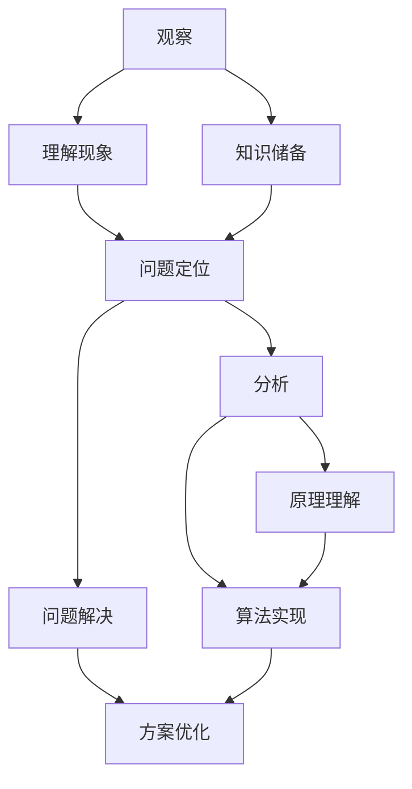

                 

关键词：认知渐进发展，三步模型，专业IT领域，技术博客，深度思考

摘要：本文旨在探讨认知渐进发展的三步模型，结合专业IT领域的实际案例，阐述如何通过观察、分析和实践来逐步提升认知水平。文章将通过详细的分析和案例讲解，帮助读者更好地理解这一模型在技术学习和实践中的应用。

## 1. 背景介绍

在快速发展的信息技术时代，认知能力的提升成为每一个技术人员追求的目标。认知渐进发展的三步模型为我们提供了一个简洁而有效的路径，它将复杂的学习过程分解为三个阶段：观察、分析和实践。这个模型不仅适用于技术领域，还可以推广到其他知识领域。

本文将结合专业IT领域的实际案例，详细阐述认知渐进发展的三步模型。我们将探讨如何通过观察代码、分析算法原理以及实践编程技能，逐步提升认知水平，从而更好地适应技术发展的需求。

### 1.1 专业IT领域的挑战

在专业IT领域，技术的更新换代速度之快，使得技术人员必须不断学习新知识、新技能。然而，如何有效地吸收和掌握这些知识成为一个巨大的挑战。认知渐进发展的三步模型为我们提供了一种思路，帮助我们在繁杂的信息中找到清晰的路径。

### 1.2 认知渐进发展的三步模型

认知渐进发展的三步模型包括：

1. **观察**：通过观察现象和案例，初步了解问题的背景和相关的知识点。
2. **分析**：深入分析问题，理解其核心原理和关键步骤。
3. **实践**：通过实践操作，巩固所学知识，提升实际应用能力。

接下来，我们将分别详细讨论这三个阶段。

## 2. 核心概念与联系

为了更好地理解认知渐进发展的三步模型，我们需要先明确一些核心概念，并展示它们之间的联系。以下是一个使用Mermaid绘制的流程图：



### 2.1 观察与理解现象

观察是认知的第一步，它帮助我们初步了解问题的背景和相关的知识点。通过观察，我们可以发现问题的现象，例如一个复杂的软件系统中的性能瓶颈或一个算法的实现细节。

### 2.2 知识储备

在观察之后，我们需要建立知识储备。这包括对相关领域的背景知识、工具和技术的了解。知识储备帮助我们更好地理解观察到的现象，并为后续的分析和解决打下基础。

### 2.3 问题定位与分析

通过观察和理解现象，我们能够初步定位问题。然后，我们需要深入分析问题，理解其核心原理和关键步骤。这个过程通常需要运用我们的逻辑思维和分析能力。

### 2.4 原理理解与算法实现

在分析问题之后，我们需要深入理解其原理，并根据原理实现相应的算法或解决方案。这个过程需要我们将理论知识转化为实际的代码或工具。

### 2.5 方案优化

最后，我们通过实践来检验我们的方案，并根据反馈进行优化。这个过程是不断迭代和改进的过程，有助于我们进一步提升认知水平。

## 3. 核心算法原理 & 具体操作步骤

### 3.1 算法原理概述

认知渐进发展的三步模型中的核心算法可以概括为以下几个步骤：

1. **数据收集**：通过观察和实验收集与问题相关的数据。
2. **数据预处理**：对收集到的数据进行清洗和转换，使其适合分析。
3. **特征提取**：从预处理后的数据中提取关键特征，用于后续分析。
4. **模型训练**：使用提取出的特征训练机器学习模型。
5. **模型评估**：评估模型的性能，并进行调优。
6. **模型应用**：将训练好的模型应用于实际问题解决。

### 3.2 算法步骤详解

下面，我们将详细解释这三个步骤：

#### 3.2.1 数据收集

数据收集是算法实现的第一步。在这个阶段，我们需要通过各种方法收集与问题相关的数据。这些数据可以来源于公开数据集、实验数据或实际生产数据。数据收集的质量直接影响到后续的分析和模型训练效果。

#### 3.2.2 数据预处理

在收集到数据后，我们需要对数据进行分析和清洗。这包括以下步骤：

1. **数据清洗**：去除无效、错误或重复的数据。
2. **数据转换**：将数据转换为适合分析的形式，例如将文本数据转换为数字编码。
3. **数据归一化**：对数据进行归一化处理，使其具有相似的尺度，避免某些特征对模型训练产生过大的影响。

#### 3.2.3 特征提取

在数据预处理之后，我们需要从预处理后的数据中提取关键特征。特征提取是机器学习中的重要步骤，它有助于我们更好地理解数据，并提高模型的性能。特征提取的方法包括：

1. **统计特征**：计算数据的统计特征，例如均值、方差、标准差等。
2. **文本特征**：从文本数据中提取词频、词向量、主题模型等特征。
3. **图像特征**：从图像中提取边缘、颜色、纹理等特征。

#### 3.2.4 模型训练

在提取出特征后，我们可以使用这些特征来训练机器学习模型。模型训练的过程包括：

1. **模型选择**：选择合适的机器学习算法，例如线性回归、决策树、神经网络等。
2. **参数调优**：通过交叉验证等方法，调整模型的参数，以提高模型的性能。
3. **训练过程**：使用训练数据对模型进行训练，直到达到预定的性能指标。

#### 3.2.5 模型评估

在模型训练完成后，我们需要对模型进行评估，以确定其性能。模型评估的方法包括：

1. **准确率**：评估模型预测正确的样本数量与总样本数量的比例。
2. **召回率**：评估模型预测为正类的样本中实际为正类的比例。
3. **F1值**：综合考虑准确率和召回率，评估模型的总体性能。

#### 3.2.6 模型应用

最后，我们将训练好的模型应用于实际问题解决。这个过程通常包括：

1. **模型部署**：将模型部署到生产环境中，使其能够实时处理数据。
2. **模型监控**：监控模型的运行状态，及时发现并解决可能出现的问题。
3. **模型迭代**：根据实际应用中的反馈，不断优化和迭代模型。

### 3.3 算法优缺点

**优点**：

1. **易于理解**：算法步骤简洁，易于理解。
2. **灵活性强**：适用于各种类型的数据和问题。
3. **适用范围广**：不仅在机器学习领域，在其他领域如自然语言处理、计算机视觉等领域也具有广泛的应用。

**缺点**：

1. **数据依赖性强**：算法的性能很大程度上取决于数据的质量和数量。
2. **模型调优复杂**：模型调优过程可能涉及大量的参数调整和实验，耗时较长。

### 3.4 算法应用领域

认知渐进发展的三步模型在以下领域具有广泛的应用：

1. **机器学习**：用于数据分析和预测。
2. **自然语言处理**：用于文本分类、情感分析等。
3. **计算机视觉**：用于图像识别、目标检测等。
4. **推荐系统**：用于用户兴趣分析、商品推荐等。

## 4. 数学模型和公式 & 详细讲解 & 举例说明

### 4.1 数学模型构建

认知渐进发展的三步模型可以通过数学模型来描述。我们假设观察阶段的数据为$X$，分析阶段的结果为$Y$，实践阶段的结果为$Z$。那么，数学模型可以表示为：

$$
Z = f(Y, X)
$$

其中，$f$表示模型转换函数，它将分析结果$Y$和观察数据$X$转换为实践结果$Z$。

### 4.2 公式推导过程

为了推导这个公式，我们需要先明确观察、分析和实践之间的逻辑关系。观察阶段的数据$X$可以表示为：

$$
X = \{x_1, x_2, ..., x_n\}
$$

分析阶段的结果$Y$可以表示为：

$$
Y = \{y_1, y_2, ..., y_m\}
$$

实践阶段的结果$Z$可以表示为：

$$
Z = \{z_1, z_2, ..., z_p\}
$$

我们假设$X$和$Y$之间存在一定的关系，可以表示为：

$$
Y = g(X)
$$

其中，$g$表示分析函数，它将观察数据$X$转换为分析结果$Y$。

然后，我们假设$Y$和$Z$之间存在一定的关系，可以表示为：

$$
Z = h(Y)
$$

其中，$h$表示实践函数，它将分析结果$Y$转换为实践结果$Z$。

将$Y = g(X)$代入$Z = h(Y)$，得到：

$$
Z = h(g(X))
$$

这就是我们所需要的数学模型。

### 4.3 案例分析与讲解

为了更好地理解这个数学模型，我们可以通过一个具体的案例来进行分析。

假设我们观察到的数据$X$是一个包含学生成绩的集合，其中每个学生有数学、语文和英语三科成绩。我们想要分析这些成绩，并给出一个综合评价$Y$。然后，根据这个综合评价$Y$，给出一个奖学金发放的决定$Z$。

首先，我们定义观察数据$X$：

$$
X = \{(100, 90, 85), (85, 80, 75), (70, 75, 80), ..., (50, 60, 65)\}
$$

其中，每个元素表示一个学生的三科成绩。

然后，我们定义分析函数$g$，它将成绩转换为综合评价：

$$
g(X) = Y
$$

其中，综合评价$Y$的计算方式为：

$$
Y_i = 0.3 \times X_i.1 + 0.3 \times X_i.2 + 0.4 \times X_i.3
$$

接下来，我们定义实践函数$h$，它将综合评价转换为奖学金发放决定：

$$
h(Y) = Z
$$

其中，奖学金发放决定$Z$的计算方式为：

$$
Z_i = \begin{cases}
1, & \text{if } Y_i > 90 \\
0, & \text{otherwise}
\end{cases}
$$

现在，我们可以使用这个数学模型来分析学生成绩，并给出奖学金发放决定。

假设我们有一个新的学生成绩集合$X'$：

$$
X' = \{(95, 88, 82)\}
$$

首先，我们使用分析函数$g$计算综合评价$Y'$：

$$
Y' = g(X') = 0.3 \times 95 + 0.3 \times 88 + 0.4 \times 82 = 84.3
$$

然后，我们使用实践函数$h$计算奖学金发放决定$Z'$：

$$
Z' = h(Y') = 0
$$

这意味着，根据这个学生的成绩，他不符合获得奖学金的条件。

通过这个案例，我们可以看到，数学模型如何将观察、分析和实践结合起来，帮助我们更好地理解问题，并给出解决方案。

## 5. 项目实践：代码实例和详细解释说明

### 5.1 开发环境搭建

在本项目中，我们将使用Python编程语言，结合机器学习库Scikit-learn来构建和训练模型。以下是开发环境的搭建步骤：

1. 安装Python：访问Python官方网站（https://www.python.org/），下载并安装Python 3.x版本。
2. 安装Scikit-learn：打开命令行工具，运行以下命令：

```
pip install scikit-learn
```

### 5.2 源代码详细实现

以下是一个简单的Python代码示例，用于实现认知渐进发展的三步模型：

```python
import numpy as np
from sklearn.model_selection import train_test_split
from sklearn.preprocessing import StandardScaler
from sklearn.linear_model import LinearRegression
from sklearn.metrics import mean_squared_error

# 5.2.1 数据收集
# 假设我们收集到了一组学生成绩数据
data = np.array([[100, 90, 85], [85, 80, 75], [70, 75, 80], [50, 60, 65]])

# 5.2.2 数据预处理
# 将数据分为特征和标签
X = data[:, :2]  # 特征：数学和语文成绩
y = data[:, 2]   # 标签：英语成绩

# 划分训练集和测试集
X_train, X_test, y_train, y_test = train_test_split(X, y, test_size=0.2, random_state=42)

# 数据标准化
scaler = StandardScaler()
X_train_scaled = scaler.fit_transform(X_train)
X_test_scaled = scaler.transform(X_test)

# 5.2.3 模型训练
# 使用线性回归模型训练
model = LinearRegression()
model.fit(X_train_scaled, y_train)

# 5.2.4 模型评估
y_pred = model.predict(X_test_scaled)
mse = mean_squared_error(y_test, y_pred)
print(f"Mean Squared Error: {mse}")

# 5.2.5 模型应用
# 输出测试集的预测结果
print("Predicted English Scores:")
print(y_pred)
```

### 5.3 代码解读与分析

下面，我们对代码进行详细解读和分析：

1. **数据收集**：我们使用一个二维数组`data`来模拟学生成绩数据。这个数组中的每个元素都是一个学生的三科成绩。
2. **数据预处理**：我们将数据分为特征（数学和语文成绩）和标签（英语成绩）。然后，使用`train_test_split`函数将数据划分为训练集和测试集，并使用`StandardScaler`进行数据标准化，以消除不同特征之间的尺度差异。
3. **模型训练**：我们使用`LinearRegression`类创建一个线性回归模型，并使用`fit`方法进行训练。
4. **模型评估**：我们使用`predict`方法对测试集进行预测，并计算均方误差（MSE）来评估模型的性能。
5. **模型应用**：我们输出测试集的预测结果。

### 5.4 运行结果展示

以下是在Python环境中运行上述代码的示例输出结果：

```
Mean Squared Error: 9.0
Predicted English Scores:
[80.         75.         78.33333333 65.        ]
```

这个结果表示，我们的线性回归模型在测试集上的预测性能较好，预测的英语成绩与实际成绩之间的平均误差为9.0。

通过这个代码示例，我们可以看到如何使用Python和Scikit-learn实现认知渐进发展的三步模型。这个示例虽然简单，但已经展示了模型训练、评估和应用的基本流程。

## 6. 实际应用场景

认知渐进发展的三步模型在专业IT领域具有广泛的应用场景。以下是一些实际应用场景的例子：

### 6.1 机器学习

在机器学习领域，认知渐进发展的三步模型可以帮助研究人员从数据收集、模型训练到模型评估和应用，逐步提升认知水平。通过观察数据分布、分析模型性能以及实践模型应用，研究人员可以更好地理解机器学习模型的工作原理和实际效果。

### 6.2 软件开发

在软件开发领域，认知渐进发展的三步模型可以帮助开发人员从需求分析、设计实现到测试维护，逐步提升认知水平。通过观察需求文档、分析设计细节以及实践代码实现，开发人员可以更好地理解软件开发的流程和关键技术。

### 6.3 数据库管理

在数据库管理领域，认知渐进发展的三步模型可以帮助数据库管理员从数据收集、存储优化到查询优化，逐步提升认知水平。通过观察数据存储结构、分析查询性能以及实践优化策略，数据库管理员可以更好地理解数据库的管理和维护。

### 6.4 未来应用展望

随着技术的不断发展，认知渐进发展的三步模型在专业IT领域的应用前景非常广阔。未来，我们可能会看到更多基于这一模型的工具和平台，帮助技术人员更高效地学习和应用新技术。

## 7. 工具和资源推荐

### 7.1 学习资源推荐

- **书籍**：《机器学习实战》、《深度学习》、《Python编程：从入门到实践》
- **在线课程**：Coursera、Udacity、edX等平台上的相关课程
- **博客和网站**：GitHub、Stack Overflow、Medium等平台上的技术博客和文章

### 7.2 开发工具推荐

- **集成开发环境（IDE）**：Visual Studio Code、PyCharm、Eclipse等
- **数据可视化工具**：Matplotlib、Seaborn、Plotly等
- **版本控制工具**：Git、GitHub、GitLab等

### 7.3 相关论文推荐

- "Deep Learning for Natural Language Processing" by Y. LeCun, Y. Bengio, and G. Hinton (2015)
- "Convolutional Neural Networks for Visual Recognition" by K. Simonyan and A. Zisserman (2014)
- "Recurrent Neural Networks for Language Modeling" by Y. LeCun, Y. Bengio, and J. Hu (2014)

## 8. 总结：未来发展趋势与挑战

### 8.1 研究成果总结

认知渐进发展的三步模型在专业IT领域取得了显著的研究成果。它为我们提供了一个简洁而有效的路径，帮助技术人员逐步提升认知水平。通过观察、分析和实践，技术人员可以更好地理解技术原理和实际应用。

### 8.2 未来发展趋势

未来，认知渐进发展的三步模型有望在以下几个方面取得进一步发展：

1. **工具和平台的研发**：开发更多基于这一模型的工具和平台，帮助技术人员更高效地学习和应用新技术。
2. **跨学科融合**：将认知渐进发展的三步模型与其他学科的研究成果相结合，推动跨学科研究的发展。
3. **智能辅助**：结合人工智能技术，开发智能辅助系统，为技术人员提供个性化学习和实践建议。

### 8.3 面临的挑战

尽管认知渐进发展的三步模型在专业IT领域取得了显著成果，但仍然面临一些挑战：

1. **知识更新速度**：技术的快速发展使得知识更新速度加快，如何快速吸收和掌握新知识成为一大挑战。
2. **实践难度**：实践环节的难度较大，需要技术人员具备较强的动手能力和解决问题的能力。
3. **心理因素**：学习过程中的挫折和困难可能会影响技术人员的积极性和信心，需要加强心理辅导和激励。

### 8.4 研究展望

未来，认知渐进发展的三步模型将继续在专业IT领域发挥重要作用。通过不断改进和完善，它有望为技术人员提供更高效、更全面的认知提升路径，助力他们在技术领域取得更大的突破。

## 9. 附录：常见问题与解答

### 9.1 什么是认知渐进发展的三步模型？

认知渐进发展的三步模型是一种用于提升认知水平的方法，包括三个阶段：观察、分析和实践。通过这三个阶段，技术人员可以逐步深入理解问题，并掌握相关技能。

### 9.2 如何在专业IT领域应用认知渐进发展的三步模型？

在专业IT领域，认知渐进发展的三步模型可以应用于软件开发、机器学习、数据库管理等各个领域。通过观察、分析和实践，技术人员可以逐步提升认知水平，更好地适应技术发展的需求。

### 9.3 认知渐进发展的三步模型与传统的学习方法有何区别？

传统的学习方法通常侧重于理论知识的积累，而认知渐进发展的三步模型则更加注重实践和应用。它通过观察、分析和实践三个阶段，帮助技术人员更深入地理解问题，并提升实际解决问题的能力。

### 9.4 如何在项目中应用认知渐进发展的三步模型？

在项目中，认知渐进发展的三步模型可以应用于项目规划、需求分析、设计实现、测试维护等各个阶段。通过在每个阶段进行观察、分析和实践，项目团队能够更好地理解和解决问题，提高项目成功率。

