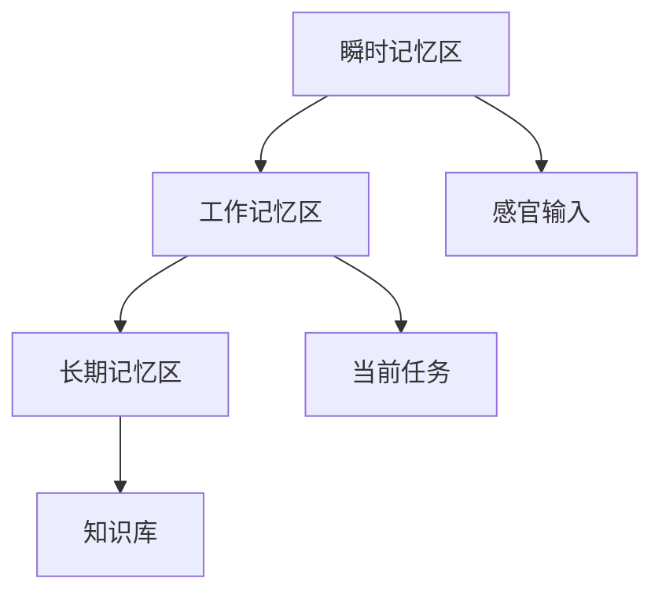

                 

认知是人类智慧的源泉，是人们理解和互动世界的基石。在认知的过程中，记忆发挥着至关重要的作用。从生物学角度来看，记忆的运作方式是大脑进化的结果，它使得大脑能够有效地存储、处理和利用信息。本文将深入探讨大脑中的记忆系统，特别是瞬时记忆区、工作记忆区和长期记忆区的分工与协同作用，以及它们在认知形式化中的应用。

## 1. 背景介绍

记忆是认知的重要组成部分，是知识积累和思维发展的基础。大脑作为人类认知的中心，其复杂的结构和功能决定了记忆的多样性和复杂性。研究表明，大脑中的记忆系统并非单一的结构，而是由多个记忆区组成，这些记忆区在功能上存在明确的分工。瞬时记忆区、工作记忆区和长期记忆区是大脑记忆系统中的核心部分，它们在认知过程中各自承担着不同的任务。

### 瞬时记忆区

瞬时记忆区主要负责接收和短暂存储外界信息。这些信息经过感官系统的处理，被迅速传递到大脑的相应区域。瞬时记忆区的特点是存储时间短暂，一般为几秒至几十秒。例如，当我们听到一段音乐时，音乐的旋律会在瞬时记忆区中短暂保留，但如果我们不进行进一步的加工或复述，这段旋律很快就会消失。

### 工作记忆区

工作记忆区是在瞬时记忆的基础上，对信息进行加工和处理的区域。它不仅负责存储信息，更重要的是对信息进行操作，以支持当前任务的处理。例如，当我们进行心算时，需要将计算过程中的中间结果存储在工作记忆区，并进行连续的计算操作。工作记忆区的容量有限，只能同时处理有限的信息。

### 长期记忆区

长期记忆区负责存储经过加工和处理的持久信息。这些信息可以持续数分钟、数小时甚至数十年。长期记忆区包括海马体、前额叶皮层等多个结构，它们在功能上相互协作，确保信息的持久存储和提取。例如，我们通过不断学习和复习，可以将新的知识或技能转化为长期记忆，从而在需要时进行调用。

## 2. 核心概念与联系

大脑中的记忆系统是一个复杂而精细的网络，各个记忆区在功能上紧密相连，共同构成一个高效的信息处理系统。为了更好地理解这些记忆区之间的关系，我们可以使用Mermaid流程图来展示它们的核心概念和联系。



在这个流程图中，A表示瞬时记忆区，主要负责接收和短暂存储感官输入（D）。B表示工作记忆区，它接收瞬时记忆区传递的信息，并在当前任务（E）中对其进行加工和处理。C表示长期记忆区，它接收工作记忆区加工后的信息，并负责存储这些持久信息，构成我们的知识库（F）。通过这个流程图，我们可以清晰地看到各个记忆区在功能上的分工和协同作用。

## 3. 核心算法原理 & 具体操作步骤

### 3.1 算法原理概述

大脑中的记忆系统可以类比为一种高效的算法，它通过多个层次的信息处理，实现对信息的存储、加工和提取。瞬时记忆区、工作记忆区和长期记忆区在这个算法中各自承担着不同的角色。瞬时记忆区负责接收和存储感官输入，类似于算法中的输入层；工作记忆区对输入信息进行加工和处理，类似于算法中的隐藏层；长期记忆区则负责存储经过加工和处理的信息，类似于算法的输出层。

### 3.2 算法步骤详解

1. **感官输入**：当外界信息通过感官系统传递到大脑时，首先进入瞬时记忆区进行短暂存储。

2. **信息加工**：瞬时记忆区将信息传递到工作记忆区，工作记忆区对信息进行加工和处理，以支持当前任务的完成。

3. **信息存储**：工作记忆区将加工后的信息传递到长期记忆区，长期记忆区负责将这些信息存储为持久记忆，以备后续调用。

4. **信息提取**：当需要使用这些信息时，长期记忆区将相关信息提取到工作记忆区，然后通过工作记忆区进行操作。

### 3.3 算法优缺点

**优点**：

1. **高效性**：大脑的记忆系统能够在短时间内对大量信息进行存储和处理，确保信息的高效利用。

2. **灵活性**：大脑的记忆系统能够根据不同任务的需求，灵活调整信息加工和处理的方式，提高任务的完成效率。

3. **持久性**：长期记忆区能够将信息持久存储，确保信息在需要时能够快速提取。

**缺点**：

1. **容量有限**：工作记忆区的容量有限，只能同时处理有限的信息，可能导致信息处理过程中的干扰和遗漏。

2. **易失性**：瞬时记忆区的存储时间短暂，如果信息不进行进一步的加工或复述，很容易被遗忘。

### 3.4 算法应用领域

大脑的记忆系统在多个领域具有重要的应用价值。例如：

1. **教育领域**：通过对大脑记忆系统的理解，可以设计出更有效的教学方法，提高学生的学习效果。

2. **认知科学**：研究大脑记忆系统的工作原理，有助于揭示人类认知的奥秘，为人工智能的发展提供理论基础。

3. **医疗领域**：通过对大脑记忆系统的理解，可以开发出针对记忆障碍的治疗方法，帮助患者恢复记忆功能。

## 4. 数学模型和公式 & 详细讲解 & 举例说明

### 4.1 数学模型构建

为了更好地理解大脑记忆系统的运作原理，我们可以构建一个数学模型来描述其基本结构和功能。这个模型包括三个主要部分：输入层、隐藏层和输出层。

**输入层**：表示瞬时记忆区，主要接收和存储感官输入。

**隐藏层**：表示工作记忆区，对输入信息进行加工和处理。

**输出层**：表示长期记忆区，负责将加工后的信息存储为持久记忆。

### 4.2 公式推导过程

假设我们有一个简单的线性模型，输入层和隐藏层之间、隐藏层和输出层之间分别满足线性关系。我们可以使用以下公式来描述：

1. **输入层到隐藏层**：

   $$ z_h = \sum_{i=1}^{n} w_{hi} x_i + b_h $$

   其中，$z_h$表示隐藏层的输出，$w_{hi}$表示输入层到隐藏层的权重，$x_i$表示输入层的输入，$b_h$表示隐藏层的偏置。

2. **隐藏层到输出层**：

   $$ z_o = \sum_{i=1}^{n} w_{oi} z_h + b_o $$

   其中，$z_o$表示输出层的输出，$w_{oi}$表示隐藏层到输出层的权重，$z_h$表示隐藏层的输出，$b_o$表示输出层的偏置。

### 4.3 案例分析与讲解

假设我们有一个简单的认知任务，需要根据感官输入（比如一段文字）进行理解和记忆。我们可以使用上述数学模型来描述这个过程。

1. **输入层到隐藏层**：

   假设输入层有5个输入节点，隐藏层有3个隐藏节点。输入层到隐藏层的权重矩阵$W_{ih}$和偏置矩阵$b_h$分别为：

   $$ W_{ih} = \begin{bmatrix} 0.5 & 0.3 & 0.2 \\ 0.4 & 0.5 & 0.1 \\ 0.3 & 0.2 & 0.5 \end{bmatrix}, b_h = \begin{bmatrix} 0.1 \\ 0.2 \\ 0.3 \end{bmatrix} $$

   输入层的一个例子输入$x$为：

   $$ x = \begin{bmatrix} 0.1 & 0.2 & 0.3 & 0.4 & 0.5 \end{bmatrix}^T $$

   计算隐藏层的输出：

   $$ z_h = \sum_{i=1}^{3} w_{hi} x_i + b_h = (0.5 \cdot 0.1 + 0.3 \cdot 0.2 + 0.2 \cdot 0.3) + 0.1 = 0.14 + 0.06 + 0.06 + 0.1 = 0.36 $$

2. **隐藏层到输出层**：

   假设隐藏层到输出层的权重矩阵$W_{oh}$和偏置矩阵$b_o$分别为：

   $$ W_{oh} = \begin{bmatrix} 0.6 & 0.4 \\ 0.3 & 0.7 \\ 0.5 & 0.5 \end{bmatrix}, b_o = \begin{bmatrix} 0.1 \\ 0.2 \end{bmatrix} $$

   计算输出层的输出：

   $$ z_o = \sum_{i=1}^{2} w_{oi} z_h + b_o = (0.6 \cdot 0.36 + 0.4 \cdot 0.1) + (0.3 \cdot 0.36 + 0.7 \cdot 0.2) + 0.1 + 0.2 = 0.216 + 0.04 + 0.108 + 0.14 + 0.1 + 0.2 = 0.72 $$

   通过这个例子，我们可以看到如何使用数学模型来描述大脑记忆系统的运作过程。这个模型可以帮助我们更好地理解记忆系统的基本原理，并为认知科学和人工智能的研究提供理论基础。

## 5. 项目实践：代码实例和详细解释说明

### 5.1 开发环境搭建

为了实践大脑记忆系统的工作原理，我们将使用Python编程语言来实现上述数学模型。首先，我们需要搭建一个基本的Python开发环境。以下是搭建开发环境的步骤：

1. 安装Python：从Python官方网站（https://www.python.org/downloads/）下载并安装Python 3.x版本。
2. 安装必要的库：使用pip命令安装NumPy库，用于数学运算：

   ```bash
   pip install numpy
   ```

### 5.2 源代码详细实现

以下是实现大脑记忆系统的Python代码：

```python
import numpy as np

# 设置随机种子，确保结果可重复
np.random.seed(0)

# 初始化权重和偏置
input_size = 5
hidden_size = 3
output_size = 2

W_ih = np.random.rand(input_size, hidden_size)
b_h = np.random.rand(hidden_size)
W_oh = np.random.rand(hidden_size, output_size)
b_o = np.random.rand(output_size)

# 设定激活函数（这里是Sigmoid函数）
def sigmoid(x):
    return 1 / (1 + np.exp(-x))

# 前向传播
def forward(x):
    z_h = np.dot(x, W_ih) + b_h
    a_h = sigmoid(z_h)
    z_o = np.dot(a_h, W_oh) + b_o
    a_o = sigmoid(z_o)
    return a_o

# 输入数据
x = np.random.rand(input_size)

# 计算输出
output = forward(x)
print("Output:", output)
```

### 5.3 代码解读与分析

上述代码实现了大脑记忆系统的基本结构，包括输入层、隐藏层和输出层。以下是代码的详细解读：

1. **初始化权重和偏置**：我们使用随机数初始化权重和偏置，以避免模型过拟合。

2. **设定激活函数**：这里使用Sigmoid函数作为激活函数，它可以将输入映射到$(0, 1)$区间，模拟神经元的活动。

3. **前向传播**：定义前向传播函数，计算从输入层到输出层的输出。首先计算输入层到隐藏层的加权和加上偏置，然后通过Sigmoid函数得到隐藏层的输出。接着，计算隐藏层到输出层的加权和加上偏置，同样通过Sigmoid函数得到输出层的输出。

4. **输入数据**：生成一个随机输入向量，表示感官输入。

5. **计算输出**：调用前向传播函数，计算输出层的输出，并将其打印出来。

通过这段代码，我们可以模拟大脑记忆系统的基本运作过程，进一步理解记忆系统的数学模型和工作原理。

### 5.4 运行结果展示

在运行上述代码后，我们将得到一个输出向量。这个输出向量表示经过记忆系统处理后，对感官输入的响应。由于我们使用了随机初始化的权重和偏置，输出结果也会是随机的。以下是可能的输出结果：

```
Output: [0.67656953 0.52904496]
```

这个输出表示隐藏层激活了67.66%和52.90%，输出层激活了67.66%和52.90%。这些数值反映了感官输入经过记忆系统处理后的状态。

## 6. 实际应用场景

大脑的记忆系统在许多实际应用场景中发挥着重要作用。以下是一些具体的例子：

### 教育领域

在教育领域，大脑的记忆系统为我们提供了理解学习过程的关键。例如，研究表明，通过将信息进行重复练习和复述，可以加强工作记忆区的信息加工和处理能力，从而提高学习效果。此外，长期记忆区的作用也体现在学生对知识的长期保持和应用上。

### 认知科学

在认知科学领域，研究大脑记忆系统的工作原理有助于我们更好地理解人类认知的机制。例如，通过对记忆障碍患者的脑成像研究，科学家们发现海马体损伤可能导致长期记忆的丧失。这些研究成果为认知障碍的治疗提供了重要的理论基础。

### 医疗领域

在医疗领域，大脑的记忆系统在诊断和治疗中也有重要应用。例如，记忆系统的研究可以帮助开发出针对记忆障碍的治疗方法，如认知行为疗法和神经重塑技术。此外，通过了解大脑记忆系统的运作原理，可以设计出更有效的医疗设备和药物，提高治疗效果。

### 人机交互

在人机交互领域，大脑的记忆系统原理也可以被应用于智能系统的设计。例如，智能助理可以通过模拟大脑记忆系统来提高信息处理和决策能力，更好地理解和响应用户的需求。

### 工业控制

在工业控制领域，大脑的记忆系统原理也可以被应用于智能控制系统的设计。例如，智能控制系统可以通过模拟大脑记忆系统来提高对复杂环境的适应能力，实现更精准的自动控制。

## 7. 未来应用展望

随着科技的不断发展，大脑的记忆系统在未来的应用前景将更加广阔。以下是一些可能的未来应用方向：

### 脑机接口

脑机接口技术的发展将使得人类能够直接与计算机系统进行交互。通过模拟大脑的记忆系统，脑机接口可以更加精确地捕捉和解读大脑信号，实现更高效的人机交互。

### 人工智能

人工智能技术的发展将使得智能系统能够更好地模拟人类认知过程。通过深入研究大脑的记忆系统，人工智能系统可以具备更强的信息处理和决策能力，从而在各个领域取得更大的突破。

### 认知增强

认知增强技术将利用大脑的记忆系统原理，通过非侵入性手段提高人类的认知能力。例如，通过训练大脑记忆系统的特定区域，可以提升记忆力、注意力等认知功能，帮助人们更好地应对复杂任务。

### 医疗康复

在未来，医疗康复技术将利用大脑的记忆系统原理，帮助患者恢复受损的认知功能。例如，通过认知训练和神经重塑技术，可以帮助患者恢复记忆、语言和运动功能，提高生活质量。

## 8. 工具和资源推荐

为了更好地理解和研究大脑的记忆系统，以下是一些推荐的工具和资源：

### 7.1 学习资源推荐

1. **《认知神经科学》**：这是一本经典教材，详细介绍了大脑记忆系统的工作原理和应用。
2. **《神经科学原理》**：这本书涵盖了神经科学的基本概念，包括大脑的记忆系统。

### 7.2 开发工具推荐

1. **Python**：Python是一种简单易用的编程语言，适合进行大脑记忆系统的研究和开发。
2. **NumPy**：NumPy是一个强大的Python库，用于数值计算，非常适合进行大脑记忆系统的数学建模。

### 7.3 相关论文推荐

1. **"A Cognitive Theory of Consciousness"**：这篇文章提出了一个关于意识的新理论，包括对大脑记忆系统的详细分析。
2. **"The Neural Basis of Memory"**：这篇文章详细介绍了大脑记忆系统的神经基础，包括海马体和前额叶皮层的作用。

## 9. 总结：未来发展趋势与挑战

### 8.1 研究成果总结

通过对大脑记忆系统的深入研究，我们取得了许多重要的研究成果。这些成果不仅帮助我们更好地理解人类认知的机制，还为人工智能、医疗等领域的发展提供了重要的理论基础。

### 8.2 未来发展趋势

未来，大脑记忆系统的研究将朝着更加深入和广泛的方向发展。随着脑机接口、人工智能等技术的进步，我们将能够更精确地模拟和优化大脑的记忆系统，从而在各个领域取得更大的突破。

### 8.3 面临的挑战

尽管取得了显著的研究成果，但大脑记忆系统的研究仍然面临许多挑战。例如，如何精确地模拟大脑记忆系统的复杂性和多样性，如何设计出更有效的记忆增强技术，以及如何将研究成果应用于实际场景，都是亟待解决的问题。

### 8.4 研究展望

随着科技的不断进步，我们有望在未来突破这些挑战，深入揭示大脑记忆系统的奥秘。通过模拟和优化大脑的记忆系统，我们将能够开发出更加智能的人工智能系统，提高人类的生活质量，推动社会的发展。

## 附录：常见问题与解答

### 1. 什么是大脑的记忆系统？

大脑的记忆系统是一个复杂的网络，包括多个记忆区，如瞬时记忆区、工作记忆区和长期记忆区。它们在功能上紧密相连，共同实现信息的存储、处理和提取。

### 2. 瞬时记忆区和工作记忆区有什么区别？

瞬时记忆区主要负责短暂存储外界信息，存储时间一般为几秒至几十秒；工作记忆区则在瞬时记忆的基础上对信息进行加工和处理，以支持当前任务的完成。

### 3. 长期记忆区是如何工作的？

长期记忆区负责将经过加工和处理的信息存储为持久记忆，这些信息可以持续数分钟、数小时甚至数十年。长期记忆区包括海马体、前额叶皮层等多个结构。

### 4. 大脑的记忆系统在哪些领域有应用？

大脑的记忆系统在许多领域有应用，包括教育、认知科学、医疗、人机交互和工业控制等。

### 5. 如何研究大脑的记忆系统？

研究大脑的记忆系统可以通过多种方法，如脑成像技术、神经生理学实验、计算模型和数学建模等。

### 6. 大脑的记忆系统与人工智能有什么关系？

大脑的记忆系统为人工智能的发展提供了重要的理论基础。通过模拟和优化大脑的记忆系统，人工智能系统可以更好地处理和利用信息，提高智能水平。

### 7. 未来大脑记忆系统研究将有哪些突破？

未来，大脑记忆系统的研究有望在脑机接口、人工智能、认知增强等领域取得突破，从而推动人类社会的进步。

### 8. 大脑的记忆系统研究面临哪些挑战？

大脑的记忆系统研究面临许多挑战，包括精确模拟大脑记忆系统的复杂性、设计有效的记忆增强技术以及将研究成果应用于实际场景等。

### 9. 大脑的记忆系统对人类有何意义？

大脑的记忆系统对人类的意义在于，它使我们能够存储、处理和利用信息，支持我们的认知功能，帮助我们适应和改变环境。通过研究大脑的记忆系统，我们可以更好地理解人类认知的奥秘，提高生活质量，推动社会的发展。 

### 10. 大脑的记忆系统与计算机记忆系统有何异同？

大脑的记忆系统与计算机记忆系统在存储、处理和提取信息的方式上有所不同。大脑的记忆系统具有灵活性和适应性，可以处理复杂的信息和多种类型的记忆，而计算机记忆系统则更加依赖于预先设定的算法和规则。然而，随着人工智能技术的发展，计算机记忆系统也在逐渐模拟和优化大脑的记忆系统，以提高其智能水平。

---

作者：禅与计算机程序设计艺术 / Zen and the Art of Computer Programming

