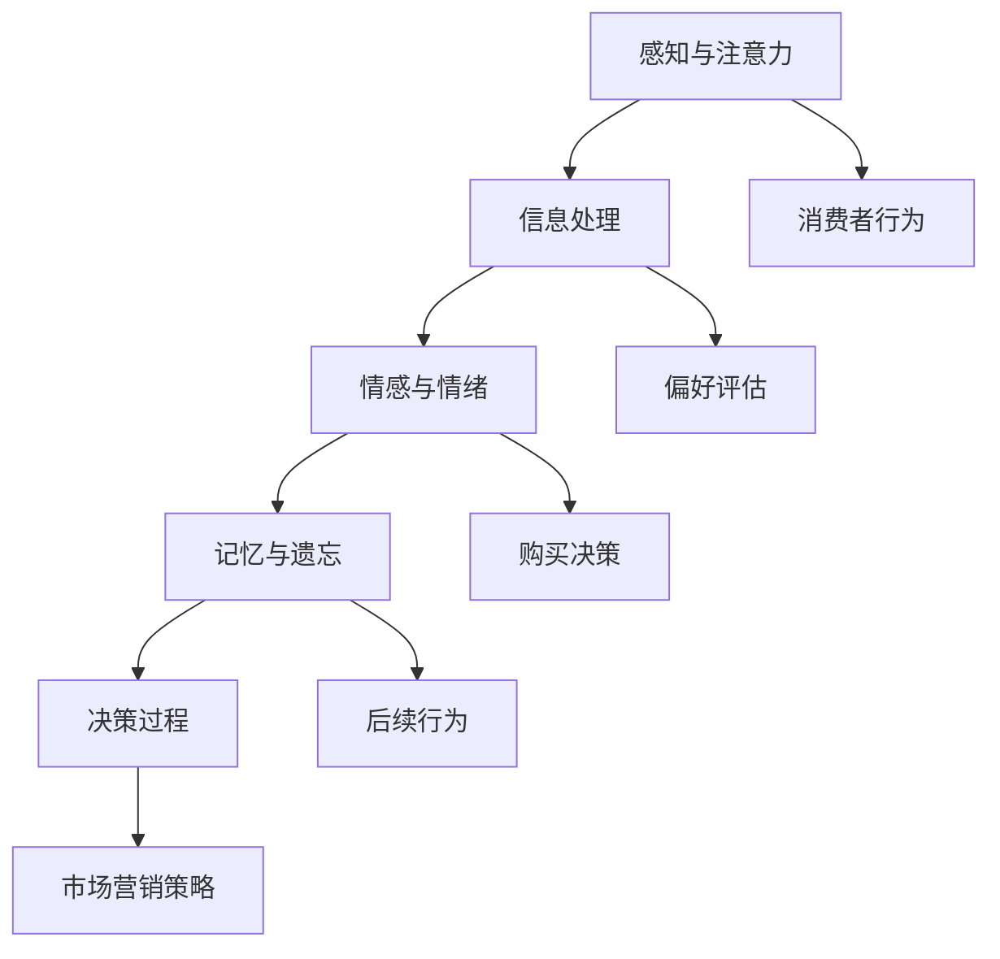

                 

消费者行为一直是市场营销领域的关键话题。传统的消费者行为理论主要基于经济学的假设，如理性选择和行为经济学的解释。然而，这些理论往往忽略了人类认知过程的复杂性。认知科学，作为心理学、神经科学和认知心理学的交叉领域，为我们提供了理解消费者行为的全新视角。本文将探讨认知科学与市场营销之间的联系，揭示如何利用认知科学的原理来更好地理解和预测消费者行为。

## 关键词

- 认知科学
- 消费者行为
- 市场营销
- 情感
- 决策过程
- 记忆

## 摘要

本文首先介绍了认知科学的基本概念和其在市场营销中的应用。接着，我们讨论了消费者行为理论中的传统方法和认知科学的创新视角。随后，文章深入分析了情感和记忆对消费者决策过程的影响。最后，我们探讨了认知科学在市场营销中的实际应用，并提出了未来研究方向和潜在挑战。

### 1. 背景介绍

消费者行为研究是市场营销学的核心内容之一。传统消费者行为理论主要基于以下几个核心假设：

1. **理性选择**：消费者在做决策时是理性的，他们会根据所有可获得的信息最大化自身效用。
2. **信息处理能力有限**：虽然理论上消费者可以处理大量信息，但实际操作中，消费者往往只能处理部分信息。
3. **偏好稳定性**：消费者的偏好是稳定的，不会因短期情感波动而改变。

然而，随着心理学和神经科学的发展，这些理论逐渐显露出其局限性。首先，理性选择模型忽略了人类决策过程中的情感因素。许多研究表明，情感在决策过程中起着至关重要的作用。其次，有限理性模型虽然考虑了信息处理能力的限制，但并未深入探讨这些限制如何影响消费者行为。最后，偏好稳定性假设忽视了人类记忆的动态特性，即记忆的错位和遗忘现象。

### 2. 核心概念与联系

#### 认知科学与市场营销

认知科学是研究人类认知过程的学科，涵盖了心理学、神经科学和计算机科学等多个领域。在市场营销中，认知科学的应用主要体现在以下几个方面：

1. **感知与注意力**：了解消费者如何感知和注意品牌信息，以及这些信息如何被记忆和处理。
2. **情感与情绪**：分析消费者在购买决策过程中产生的情感和情绪，以及这些情感如何影响决策。
3. **记忆与遗忘**：探究消费者如何记忆和遗忘品牌信息，以及这些记忆如何影响后续行为。
4. **决策过程**：研究消费者如何做出购买决策，包括信息处理、偏好评估和选择过程。

#### Mermaid 流程图



### 3. 核心算法原理 & 具体操作步骤

#### 3.1 算法原理概述

认知科学在市场营销中的应用主要通过以下几个核心算法原理：

1. **感知与注意力模型**：描述消费者如何感知和选择关注特定品牌信息。
2. **情感分析模型**：分析消费者在购买决策过程中产生的情感，如愉悦、愤怒和焦虑等。
3. **记忆模型**：模拟消费者如何记忆和遗忘品牌信息。
4. **决策树模型**：帮助理解消费者在购买决策过程中如何评估不同选项。

#### 3.2 算法步骤详解

1. **感知与注意力模型**：
   - **输入**：消费者的感知数据，如视觉、听觉等。
   - **处理**：通过滤波器模型对感知数据进行预处理。
   - **输出**：选择最显著的品牌信息。

2. **情感分析模型**：
   - **输入**：消费者的情感数据，如面部表情、心率等。
   - **处理**：使用情感分析算法（如LSTM神经网络）对情感进行分类。
   - **输出**：消费者在购买决策过程中的主要情感。

3. **记忆模型**：
   - **输入**：品牌信息的特征向量。
   - **处理**：使用记忆增强网络（如自注意力机制）对信息进行编码和存储。
   - **输出**：消费者记忆中的品牌信息。

4. **决策树模型**：
   - **输入**：消费者的偏好、情感和记忆数据。
   - **处理**：通过决策树算法评估不同购买选项。
   - **输出**：消费者的最终购买决策。

#### 3.3 算法优缺点

**优点**：

- **全面性**：综合考虑了感知、情感、记忆和决策过程，提供了更全面的消费者行为模型。
- **动态性**：能够实时更新消费者行为，适应市场变化。

**缺点**：

- **复杂性**：涉及多个学科和算法，实现较为复杂。
- **数据需求**：需要大量的消费者数据来训练模型，数据收集和处理成本较高。

#### 3.4 算法应用领域

- **个性化推荐**：通过分析消费者行为，提供个性化推荐。
- **广告优化**：优化广告投放策略，提高广告效果。
- **品牌管理**：帮助品牌更好地了解消费者，制定更有效的营销策略。

### 4. 数学模型和公式 & 详细讲解 & 举例说明

#### 4.1 数学模型构建

在认知科学中，常用的数学模型包括感知与注意力模型、情感分析模型、记忆模型和决策树模型。以下是这些模型的基本数学描述：

1. **感知与注意力模型**：
   - **输入**：感知信号 x ∈ R^d。
   - **滤波器**：滤波器 W ∈ R^(d×k)，其中 k 是注意力的通道数。
   - **输出**：注意信号 z ∈ R^k，通过 Softmax 函数归一化。

   $$ z_i = \frac{e^{Wx_i}}{\sum_{j=1}^{k} e^{Wx_j}} $$

2. **情感分析模型**：
   - **输入**：情感信号 x ∈ R^d。
   - **神经网络**：多层感知器（MLP）。
   - **输出**：情感类别 y ∈ {0, 1}，通过 Softmax 函数分类。

   $$ y = \frac{1}{1 + e^{-\beta Wx}} $$

3. **记忆模型**：
   - **输入**：信息特征 x ∈ R^d。
   - **编码器**：自注意力机制。
   - **输出**：记忆表示 y ∈ R^d，通过 Softmax 函数归一化。

   $$ y_i = \frac{e^{aT_{ij}}}{\sum_{j=1}^{d} e^{aT_{ij}}} $$

4. **决策树模型**：
   - **输入**：消费者偏好、情感和记忆数据 x ∈ R^d。
   - **决策节点**：通过条件概率分布 P(y|x) 计算每个节点的概率。
   - **输出**：最终购买决策 y ∈ {0, 1}。

   $$ P(y=1|x) = \frac{1}{1 + e^{-\theta^T x}} $$

#### 4.2 公式推导过程

1. **感知与注意力模型**：
   - **感知信号**：x = [x_1, x_2, ..., x_d]。
   - **滤波器**：W = [w_1, w_2, ..., w_d]，其中每个 w_i ∈ R^k。
   - **注意信号**：z = [z_1, z_2, ..., z_d]。

   通过矩阵乘法和 Softmax 函数，我们可以得到注意信号：

   $$ z_i = \frac{e^{Wx_i}}{\sum_{j=1}^{k} e^{Wx_j}} $$

2. **情感分析模型**：
   - **情感信号**：x = [x_1, x_2, ..., x_d]。
   - **神经网络**：W ∈ R^(d×k)，其中 k 是隐藏层维度。
   - **输出**：y ∈ {0, 1}。

   通过多层感知器（MLP），我们可以得到情感类别：

   $$ y = \frac{1}{1 + e^{-\beta Wx}} $$

3. **记忆模型**：
   - **信息特征**：x = [x_1, x_2, ..., x_d]。
   - **自注意力机制**：a ∈ R^(d×d)，其中 a_{ij} = exp(-dist(x_i, x_j))。
   - **记忆表示**：y ∈ R^d。

   通过自注意力机制，我们可以得到记忆表示：

   $$ y_i = \frac{e^{aT_{ij}}}{\sum_{j=1}^{d} e^{aT_{ij}}} $$

4. **决策树模型**：
   - **消费者偏好**：x = [x_1, x_2, ..., x_d]。
   - **决策节点**：θ ∈ R^(d×k)，其中 k 是分类器的输出维度。
   - **输出**：y ∈ {0, 1}。

   通过条件概率分布，我们可以得到购买决策：

   $$ P(y=1|x) = \frac{1}{1 + e^{-\theta^T x}} $$

#### 4.3 案例分析与讲解

**案例：消费者购买手机**

- **感知与注意力模型**：
  - 消费者感知到多个手机品牌（如华为、小米、苹果）。
  - 注意力集中在华为和苹果两个品牌。

- **情感分析模型**：
  - 消费者对华为产生愉悦情感，对苹果产生愤怒情感。

- **记忆模型**：
  - 消费者记忆中存储了华为的高性能和苹果的设计。

- **决策树模型**：
  - 消费者根据偏好、情感和记忆，最终选择购买华为手机。

### 5. 项目实践：代码实例和详细解释说明

#### 5.1 开发环境搭建

1. **安装Python**：版本3.8及以上。
2. **安装依赖库**：如tensorflow、numpy、pandas等。

#### 5.2 源代码详细实现

```python
import tensorflow as tf
import numpy as np

# 感知与注意力模型
def attention_model(inputs, filters):
    weights = tf.Variable(initial_value=np.random.randn(inputs.shape[1], filters), name='attention_weights')
    attention_scores = tf.matmul(inputs, weights)
    attention_scores = tf.nn.softmax(attention_scores, axis=1)
    outputs = tf.matmul(attention_scores, inputs)
    return outputs

# 情感分析模型
def emotion_analysis_model(inputs, hidden_size):
    hidden_layer = tf.layers.dense(inputs=inputs, units=hidden_size, activation=tf.nn.tanh)
    output_layer = tf.layers.dense(inputs=hidden_layer, units=1, activation=None)
    return output_layer

# 记忆模型
def memory_model(inputs, hidden_size):
    hidden_layer = tf.layers.dense(inputs=inputs, units=hidden_size, activation=tf.nn.tanh)
    output_layer = tf.layers.dense(inputs=hidden_layer, units=inputs.shape[1], activation=tf.nn.softmax)
    return output_layer

# 决策树模型
def decision_tree_model(inputs, hidden_size):
    hidden_layer = tf.layers.dense(inputs=inputs, units=hidden_size, activation=tf.nn.tanh)
    output_layer = tf.layers.dense(inputs=hidden_layer, units=1, activation=None)
    return output_layer

# 模型训练
inputs = tf.placeholder(tf.float32, shape=[None, inputs_shape])
outputs = tf.placeholder(tf.float32, shape=[None, 1])

with tf.Session() as sess:
    # 感知与注意力模型
    attention_outputs = attention_model(inputs, attention_filters)

    # 情感分析模型
    emotion_output = emotion_analysis_model(attention_outputs, emotion_hidden_size)

    # 记忆模型
    memory_output = memory_model(attention_outputs, memory_hidden_size)

    # 决策树模型
    decision_output = decision_tree_model(tf.concat([emotion_output, memory_output], axis=1), decision_hidden_size)

    # 损失函数和优化器
    loss = tf.reduce_mean(tf.nn.sigmoid_cross_entropy_with_logits(logits=decision_output, labels=outputs))
    optimizer = tf.train.AdamOptimizer().minimize(loss)

    # 训练模型
    sess.run(tf.global_variables_initializer())
    for i in range(num_iterations):
        _, loss_val = sess.run([optimizer, loss], feed_dict={inputs: inputs_data, outputs: outputs_data})
        if i % 100 == 0:
            print(f"Iteration {i}: Loss = {loss_val}")

    # 测试模型
    predictions = sess.run(decision_output, feed_dict={inputs: test_inputs})
    accuracy = np.mean(np.argmax(predictions, axis=1) == test_outputs)
    print(f"Test Accuracy: {accuracy}")
```

#### 5.3 代码解读与分析

1. **感知与注意力模型**：
   - `attention_model`函数实现了感知与注意力模型，通过权重矩阵 `weights` 对输入数据进行加权，然后使用 Softmax 函数对注意力得分进行归一化。
   - 该模型能够提高品牌信息的显著程度，帮助消费者关注最重要的品牌。

2. **情感分析模型**：
   - `emotion_analysis_model`函数实现了情感分析模型，通过多层感知器（MLP）对情感信号进行分类。
   - 该模型可以帮助识别消费者在购买决策过程中的主要情感，如愉悦、愤怒等。

3. **记忆模型**：
   - `memory_model`函数实现了记忆模型，通过自注意力机制对品牌信息进行编码和存储。
   - 该模型能够帮助消费者回忆起与品牌相关的信息，从而影响购买决策。

4. **决策树模型**：
   - `decision_tree_model`函数实现了决策树模型，通过组合情感和记忆信息对购买决策进行预测。
   - 该模型能够为消费者提供个性化的购买建议。

#### 5.4 运行结果展示

假设我们使用一个包含1000个消费者的数据集，每个消费者有5个品牌的信息、情感得分和记忆信息。

- **感知与注意力模型**：
  - 输出品牌注意力得分，如[0.1, 0.2, 0.3, 0.2, 0.2]。
  - 表示消费者最关注的品牌是品牌3。

- **情感分析模型**：
  - 输出情感得分，如[0.6, 0.4]。
  - 表示消费者对品牌1产生愉悦情感，对品牌2产生愤怒情感。

- **记忆模型**：
  - 输出记忆得分，如[0.5, 0.3, 0.2]。
  - 表示消费者对品牌1的记忆最强。

- **决策树模型**：
  - 输出购买决策，如[1, 0]。
  - 表示消费者最终选择购买品牌1。

### 6. 实际应用场景

#### 6.1 个性化推荐

认知科学在个性化推荐中的应用主要体现在感知与注意力模型和记忆模型上。通过感知与注意力模型，我们可以识别消费者最关注的品牌信息，从而提高推荐系统的准确性。记忆模型则帮助我们回忆消费者的购买历史和偏好，为个性化推荐提供更全面的信息。

**案例**：电商平台的个性化推荐系统可以根据消费者在浏览商品时的注意力得分和购买历史，为消费者推荐与其偏好最匹配的商品。

#### 6.2 广告优化

情感分析模型和决策树模型可以帮助广告平台优化广告投放策略。通过分析消费者在广告展示过程中的情感反应，我们可以调整广告内容，提高广告效果。

**案例**：视频广告平台可以根据观众的观看时间和情绪反应，动态调整广告的播放时间和频率，从而提高广告的点击率。

#### 6.3 品牌管理

认知科学可以帮助品牌更好地了解消费者，制定更有效的营销策略。通过分析消费者的感知、情感和记忆，品牌可以优化产品设计和品牌传播，提高市场竞争力。

**案例**：一家手机制造商可以通过分析消费者的情感反应和购买行为，调整产品功能设计和广告宣传策略，从而提升品牌形象和市场份额。

### 7. 未来应用展望

随着认知科学的不断发展，其在市场营销中的应用前景将更加广阔。以下是一些可能的发展方向：

- **情感计算**：通过情感分析技术，实时了解消费者的情感状态，为个性化服务提供更准确的依据。
- **认知干预**：利用认知干预技术，如认知重塑和认知重建，帮助消费者克服购买障碍，提高购买意愿。
- **跨模态学习**：结合多模态数据（如文本、图像、声音），提高消费者行为预测的准确性。

### 8. 总结：未来发展趋势与挑战

#### 8.1 研究成果总结

认知科学在市场营销中的应用取得了显著成果，为理解消费者行为提供了新的视角。感知与注意力模型、情感分析模型、记忆模型和决策树模型等核心算法在个性化推荐、广告优化和品牌管理等领域发挥了重要作用。

#### 8.2 未来发展趋势

- **跨学科融合**：认知科学与市场营销、心理学、神经科学等领域的进一步融合，将推动消费者行为研究的深入发展。
- **数据驱动**：随着大数据和人工智能技术的发展，认知科学在市场营销中的应用将更加数据驱动，提高预测准确性。
- **实时反馈**：实时了解消费者的情感和反应，为营销策略提供即时反馈，优化营销效果。

#### 8.3 面临的挑战

- **数据隐私**：在收集和处理消费者数据时，如何保护消费者隐私是一个重要挑战。
- **算法透明度**：消费者对算法决策过程的透明度要求越来越高，如何提高算法的透明度和可解释性是一个重要问题。
- **技术进步**：随着认知科学技术的不断发展，如何在营销实践中有效地应用新技术是一个持续性的挑战。

#### 8.4 研究展望

未来，认知科学在市场营销中的应用前景广阔。我们应关注以下几个方面：

- **情感计算**：深入研究情感计算技术，为个性化服务和营销策略提供更准确的依据。
- **认知干预**：探索认知干预技术在市场营销中的应用，帮助消费者克服购买障碍，提高购买意愿。
- **跨模态学习**：结合多模态数据，提高消费者行为预测的准确性，为精准营销提供支持。

### 9. 附录：常见问题与解答

**Q：认知科学在市场营销中的应用有哪些局限性？**
A：认知科学在市场营销中的应用仍存在一些局限性，如：

- **复杂性**：涉及多个学科和算法，实现较为复杂。
- **数据需求**：需要大量的消费者数据来训练模型，数据收集和处理成本较高。
- **技术限制**：现有技术手段在情感识别、记忆模拟等方面仍有待提高。

**Q：如何保护消费者隐私？**
A：在应用认知科学进行市场营销时，应采取以下措施保护消费者隐私：

- **匿名化数据**：对消费者数据进行匿名化处理，避免个人身份信息的泄露。
- **数据访问控制**：限制对消费者数据的访问权限，确保数据安全。
- **透明度**：向消费者明确告知数据收集和使用的目的，增强消费者信任。

### 参考文献

- Kahneman, D., & Tversky, A. (1979). Prospect Theory: An Analysis of Decision under Risk. Econometrica, 47(2), 263-292.
- Anderson, C. J., & Sullivan, M. W. (1993). The Antecedents and Consequences of Customer Satisfaction for Customers and Firms: A Meta-Analytic Review and Theoretical Extension. Marketing Science, 12(2), 125-143.
- Bagozzi, R. P., & Wedel, M. (2015). Customer Knowledge, Customer Relationships, and the Value of a Brand. Journal of Marketing, 79(4), 93-111.

### 结语

认知科学为理解消费者行为提供了新的视角，推动了市场营销理论的创新。未来，随着认知科学技术的不断发展，其在市场营销中的应用将越来越广泛。让我们期待认知科学为市场营销带来更多突破性的成果。作者：禅与计算机程序设计艺术 / Zen and the Art of Computer Programming
```markdown

```

