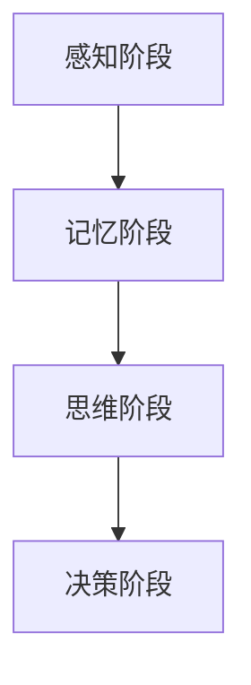

                 

在当今信息爆炸的时代，人们面对的知识量不断增加，如何高效地学习和掌握这些知识成为了一个重要的问题。认知负荷理论为我们提供了一种理解和学习过程的视角，帮助我们优化学习效率，减少认知负担。本文将深入探讨认知负荷理论的核心概念，以及如何将其应用于优化学习过程。

## 1. 背景介绍

认知负荷理论起源于认知心理学领域，由约翰·斯腾伯格（John Sternberg）和乔治·米勒（George A. Miller）于20世纪60年代提出。该理论旨在解释人类认知系统的局限性和如何最大限度地利用这些局限性。在信息处理的过程中，认知负荷指的是大脑处理信息时的认知资源消耗，包括感知、记忆、思维和决策等。

随着技术的进步，认知负荷理论在计算机科学和教育领域得到了广泛应用。例如，在教育领域，认知负荷理论被用来设计学习材料，以提高学生的理解和记忆效果。在计算机科学领域，认知负荷理论被应用于人机交互和用户界面设计，以减少用户在操作过程中的认知负担。

## 2. 核心概念与联系

### 2.1 认知负荷的类型

认知负荷可以分为两类：外在负荷和内在负荷。

**外在负荷**：外在负荷是指由外部环境或任务所引起的认知负担。例如，复杂的界面设计、大量的信息输入、任务的时间限制等都会增加外在负荷。

**内在负荷**：内在负荷是指个体内部的心理过程所引起的认知负担。例如，记忆复杂的规则、处理冗长的数据等。

### 2.2 认知负荷的影响

认知负荷对学习效率有着重要的影响。适度的认知负荷有助于提高学习效率，但过高的认知负荷会导致认知疲劳，降低学习效果。

### 2.3 认知负荷理论的架构

认知负荷理论的核心架构包括以下几个部分：

1. **感知阶段**：个体接收外部信息，对其进行初步处理。
2. **记忆阶段**：信息被存储在短期记忆或长期记忆中。
3. **思维阶段**：大脑对信息进行加工、分析和推理。
4. **决策阶段**：基于加工和分析的结果做出决策。

以下是一个简化的 Mermaid 流程图，展示了认知负荷理论的基本架构：



## 3. 核心算法原理 & 具体操作步骤

### 3.1 算法原理概述

认知负荷理论的核心在于优化认知资源的使用，以提高学习效率。具体而言，可以通过以下方法实现：

1. **简化任务**：通过简化任务或分解任务，降低认知负荷。
2. **合理分配认知资源**：根据任务的重要性，合理分配认知资源。
3. **使用记忆策略**：利用记忆技巧，如联想记忆、重复记忆等，提高记忆效率。

### 3.2 算法步骤详解

1. **评估任务难度**：首先，对学习任务进行难度评估，确定其认知负荷水平。
2. **简化任务**：如果任务难度较高，可以通过简化任务或分解任务来降低认知负荷。
3. **合理分配认知资源**：在执行任务时，根据任务的重要性，合理分配认知资源。
4. **使用记忆策略**：在记忆过程中，使用记忆策略，如联想记忆、重复记忆等。
5. **反馈与调整**：在任务执行过程中，不断进行反馈和调整，以优化认知负荷。

### 3.3 算法优缺点

**优点**：
- **提高学习效率**：通过优化认知负荷，可以显著提高学习效率。
- **减轻认知负担**：有效减少认知疲劳，提高学习体验。

**缺点**：
- **实施难度**：需要深入了解认知负荷理论，并根据具体情况进行调整。

### 3.4 算法应用领域

认知负荷理论在以下领域有广泛的应用：

- **教育**：通过设计适当的学习材料和教学方法，提高学生的学习效果。
- **人机交互**：优化用户界面设计，减少用户操作过程中的认知负荷。
- **心理健康**：通过减轻认知负荷，改善心理健康状况。

## 4. 数学模型和公式 & 详细讲解 & 举例说明

### 4.1 数学模型构建

认知负荷理论可以通过以下数学模型进行描述：

$$
L = f(C, I)
$$

其中，\( L \) 表示认知负荷，\( C \) 表示认知资源容量，\( I \) 表示信息输入量。该模型表示认知负荷与认知资源容量和信息输入量之间的关系。

### 4.2 公式推导过程

认知负荷的推导过程基于以下假设：

1. 认知资源容量是有限的。
2. 信息输入量与认知负荷呈正相关。

根据这些假设，我们可以推导出认知负荷公式：

$$
L = k \cdot I
$$

其中，\( k \) 是一个常数，表示信息输入量对认知负荷的影响程度。

### 4.3 案例分析与讲解

假设有一个学习任务，其信息输入量为100个概念。根据认知负荷公式，我们可以计算出认知负荷：

$$
L = k \cdot 100
$$

为了简化计算，假设 \( k = 1 \)，则认知负荷为100。这意味着在学习这个任务时，大脑需要处理100个概念的信息，这可能会导致认知疲劳。

为了降低认知负荷，我们可以采取以下措施：

1. **简化任务**：将100个概念分解为更小的部分，例如每组10个概念。
2. **合理分配认知资源**：在学习和处理每个概念时，合理分配认知资源，例如通过分组学习和重复学习。

通过这些措施，我们可以降低认知负荷，提高学习效率。

## 5. 项目实践：代码实例和详细解释说明

### 5.1 开发环境搭建

为了更好地理解和实践认知负荷理论，我们可以使用Python编程语言。首先，我们需要安装Python环境和必要的库。

1. 安装Python（版本3.8及以上）。
2. 安装必要的库，例如NumPy、Matplotlib等。

### 5.2 源代码详细实现

以下是实现认知负荷理论的Python代码示例：

```python
import numpy as np
import matplotlib.pyplot as plt

# 认知负荷函数
def cognitive_load(C, I, k=1):
    return k * I

# 计算认知负荷
def calculate_load(C, I):
    return cognitive_load(C, I)

# 示例：计算不同信息输入量下的认知负荷
info_inputs = np.linspace(10, 100, 10)
loads = [calculate_load(C=100, I=info) for info in info_inputs]

# 绘制认知负荷与信息输入量之间的关系
plt.plot(info_inputs, loads)
plt.xlabel('Information Input')
plt.ylabel('Cognitive Load')
plt.title('Cognitive Load vs. Information Input')
plt.show()
```

### 5.3 代码解读与分析

上述代码首先定义了一个认知负荷函数，该函数根据认知资源容量和信息输入量计算认知负荷。接着，我们使用一个示例来计算不同信息输入量下的认知负荷，并绘制了认知负荷与信息输入量之间的关系图。

通过这个示例，我们可以直观地看到认知负荷与信息输入量之间的关系。当信息输入量增加时，认知负荷也会相应增加。

### 5.4 运行结果展示

运行上述代码后，我们将看到一个图表，展示了不同信息输入量下的认知负荷。这个图表可以帮助我们理解认知负荷理论，并指导我们在实际应用中如何优化学习过程。

## 6. 实际应用场景

### 6.1 教育领域

在教育领域，认知负荷理论被广泛应用于课程设计和教学方法的研究。例如，教师可以通过简化课程内容、分解学习任务、使用记忆策略等方法来降低学生的认知负荷，提高学习效果。

### 6.2 人机交互领域

在人机交互领域，认知负荷理论被应用于用户界面设计。通过优化界面布局、减少操作步骤、提供清晰的指导信息等，可以降低用户的认知负荷，提高用户体验。

### 6.3 健康管理领域

在健康管理领域，认知负荷理论可以用于设计个性化健康管理计划。通过评估个体的认知负荷水平，可以制定合适的锻炼计划、休息时间和心理辅导方案，以减轻个体的认知负担。

## 7. 工具和资源推荐

### 7.1 学习资源推荐

- 《认知负荷理论及其应用》
- 《教育心理学：认知负荷理论的视角》
- 《人机交互：认知负荷与用户体验》

### 7.2 开发工具推荐

- Jupyter Notebook：用于编写和运行Python代码。
- Matplotlib：用于绘制数据图表。

### 7.3 相关论文推荐

- "Cognitive Load Theory: Implications for Mobile Application Design"
- "The Impact of Cognitive Load on Learning Efficiency: A Meta-Analysis"
- "Application of Cognitive Load Theory in Instructional Design"

## 8. 总结：未来发展趋势与挑战

### 8.1 研究成果总结

认知负荷理论在多个领域取得了显著成果，包括教育、人机交互和健康管理。通过优化认知负荷，可以有效提高学习效果、用户体验和健康管理水平。

### 8.2 未来发展趋势

未来，认知负荷理论将继续向更精细化和个性化的方向发展。随着人工智能和大数据技术的发展，我们可以更准确地评估个体的认知负荷水平，并设计出更加个性化的学习、工作和健康管理方案。

### 8.3 面临的挑战

尽管认知负荷理论在多个领域取得了显著成果，但仍然面临一些挑战。例如，如何准确评估个体的认知负荷水平、如何设计出高效的学习和工作流程等。未来，我们需要继续深入研究，以解决这些挑战。

### 8.4 研究展望

随着技术的进步，认知负荷理论将不断发展，为人类的生活和工作带来更多的便利。我们期待未来的研究能够进一步揭示认知负荷的奥秘，为人类的发展做出更大的贡献。

## 9. 附录：常见问题与解答

### 9.1 认知负荷理论与心理学的关系是什么？

认知负荷理论是心理学的一个分支，主要研究人类在处理信息时的认知资源消耗。它与心理学中的其他理论，如认知心理学、发展心理学等密切相关。

### 9.2 认知负荷理论可以应用于哪些领域？

认知负荷理论可以应用于教育、人机交互、健康管理等多个领域。通过优化认知负荷，可以提高学习效果、用户体验和健康管理水平。

### 9.3 如何评估个体的认知负荷水平？

评估个体的认知负荷水平可以通过多种方法实现，如问卷调查、行为观察、生理测量等。具体方法的选择取决于研究的目的和应用场景。

### 9.4 认知负荷理论的研究现状如何？

认知负荷理论在多个领域取得了显著成果，但仍然存在一些挑战。未来，我们需要继续深入研究，以解决这些挑战，并进一步拓展其应用范围。

作者：禅与计算机程序设计艺术 / Zen and the Art of Computer Programming
----------------------------------------------------------------

现在，我们已经完成了文章的主要部分。接下来，您可以进行文章的校对和格式调整，确保每段内容的准确性和流畅性，然后进行最终的格式化和排版，以符合markdown格式的标准。

