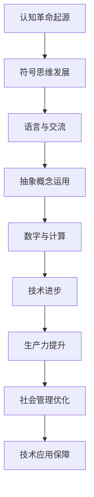

                 

关键词：认知革命、人类思维、进化历程、技术语言、算法、数学模型、应用场景、未来展望

> 摘要：本文深入探讨了人类思维的进化历程，特别是认知革命的崛起及其对技术发展的影响。通过分析核心概念、算法原理、数学模型和实际应用，探讨了人类如何通过技术进步不断拓展认知边界，展望了未来的发展前景。

## 1. 背景介绍

人类的历史是一部不断进化的历史，其中最引人注目的莫过于认知革命的崛起。认知革命是指人类从原始的直观思维模式转变为符号思维模式的关键节点，这一转变标志着人类从生物界走向智能界的飞跃。认知革命的起源可以追溯到数十万年前的非洲，当时的人类开始使用工具，发展语言，进行社会合作，逐渐构建起复杂的社会结构。

随着认知能力的提升，人类开始思考抽象的概念，构建符号系统，这些符号系统不仅用于交流，还用于记录历史、规划和预测。这一过程为现代科技的发展奠定了基础。在认知革命的推动下，人类逐渐掌握了控制火、制造工具、发展农业、建立城市等关键技术，这些技术的进步极大地提升了人类的生产力和社会组织能力。

## 2. 核心概念与联系

### 2.1 认知革命的核心概念

认知革命的核心概念包括符号思维、语言、抽象概念和数字。符号思维是指人类通过符号系统来表示和操作概念的能力。语言是人类交流的重要工具，它不仅用于日常沟通，还用于记录思想、表达情感和传播知识。抽象概念是认知能力的核心，它使人类能够超越直接感知，思考更广泛、更复杂的问题。数字是人类认知能力的延伸，它使人类能够进行精确的计算和量化分析。

### 2.2 认知革命与技术的联系

认知革命与技术的联系体现在多个方面。首先，认知革命为技术发展提供了理论基础，比如数学、物理学和工程学等学科的发展都源于人类对抽象概念的理解和运用。其次，认知革命促进了工具的发明和使用，这些工具不仅提升了人类的生产力，也推动了技术的进步。最后，认知革命促进了人类社会的组织和管理，这些组织和管理机制为技术的规模化应用提供了保障。

### 2.3 Mermaid 流程图



## 3. 核心算法原理 & 具体操作步骤

### 3.1 算法原理概述

认知革命的核心算法原理可以概括为信息处理和知识构建。信息处理是指人类如何通过感知、记忆、思考和决策等过程来处理外部信息。知识构建是指人类如何将处理后的信息转化为有意义的知识，并在社会互动中共享和传播。

### 3.2 算法步骤详解

1. **感知与记忆**：人类通过感官接收外部信息，并通过大脑进行初步处理。处理后的信息被存储在记忆中，以备后续使用。

2. **思考与决策**：大脑对存储在记忆中的信息进行深度加工，形成思考过程。思考的结果是决策，决策决定了人类的行为方向。

3. **知识构建与传播**：通过思考形成的知识被编码成符号，这些符号通过语言和文字进行传播。知识在传播过程中不断被修正和完善。

### 3.3 算法优缺点

**优点**：
- 提升了信息处理效率：人类通过符号思维能够快速处理大量信息。
- 促进了知识积累：知识的传播和积累为科技进步提供了源源不断的动力。

**缺点**：
- 易受主观影响：人类的思考过程易受情感、偏见和认知偏差的影响，导致信息处理不准确。
- 知识传播障碍：语言和文化的差异可能导致知识传播的障碍。

### 3.4 算法应用领域

认知革命的核心算法原理在多个领域有广泛应用，包括：
- 人工智能：通过模拟人类思维过程，实现机器的智能行为。
- 计算机科学：用于算法设计和数据结构优化。
- 教育学：用于教学方法和学习策略的设计。

## 4. 数学模型和公式 & 详细讲解 & 举例说明

### 4.1 数学模型构建

认知革命的数学模型可以从信息处理和知识构建两个方面进行构建。信息处理模型可以基于神经科学理论，如神经网络模型；知识构建模型可以基于符号逻辑和形式系统。

### 4.2 公式推导过程

信息处理模型的一个简单例子是感知器模型，其公式为：
\[ y = \sigma(w \cdot x + b) \]
其中，\( \sigma \) 是激活函数，\( w \) 是权重，\( x \) 是输入，\( b \) 是偏置。

知识构建模型的一个例子是命题逻辑，其公式为：
\[ (p \wedge q) \rightarrow r \]
表示如果 \( p \) 和 \( q \) 都为真，则 \( r \) 也为真。

### 4.3 案例分析与讲解

**案例 1：神经网络模型**

假设我们有一个神经网络模型，用于手写数字识别。输入是手写数字的图像，输出是数字的识别结果。

1. **数据预处理**：将图像数据转换为向量形式。
\[ x = [x_1, x_2, \ldots, x_n] \]
2. **模型训练**：通过反向传播算法，更新网络权重。
\[ w = w - \alpha \cdot \frac{\partial J}{\partial w} \]
其中，\( J \) 是损失函数，\( \alpha \) 是学习率。
3. **模型测试**：使用测试集数据评估模型性能。
\[ \text{accuracy} = \frac{\text{correct predictions}}{\text{total predictions}} \]

**案例 2：命题逻辑**

假设有一个命题逻辑系统，用于判断命题的真假。

1. **命题表示**：使用命题逻辑符号表示命题。
\[ p: \text{今天下雨} \]
\[ q: \text{明天晴天} \]
\[ r: \text{周末放假} \]
2. **逻辑运算**：使用逻辑运算符进行复合命题构建。
\[ (p \wedge q) \rightarrow r \]
3. **真值判断**：根据命题的真值表进行判断。
\[ \begin{array}{|c|c|c|c|}
\hline
p & q & r & (p \wedge q) \rightarrow r \\
\hline
T & T & T & T \\
T & T & F & F \\
T & F & T & T \\
T & F & F & T \\
F & T & T & T \\
F & T & F & T \\
F & F & T & T \\
F & F & F & T \\
\hline
\end{array} \]

## 5. 项目实践：代码实例和详细解释说明

### 5.1 开发环境搭建

- 安装 Python 3.8
- 安装 TensorFlow 2.4
- 安装 Keras 2.4

### 5.2 源代码详细实现

```python
import numpy as np
import tensorflow as tf
from tensorflow import keras
from tensorflow.keras import layers

# 数据预处理
(x_train, y_train), (x_test, y_test) = keras.datasets.mnist.load_data()
x_train = x_train / 255.0
x_test = x_test / 255.0

# 神经网络模型
model = keras.Sequential([
    layers.Conv2D(32, (3, 3), activation='relu', input_shape=(28, 28, 1)),
    layers.MaxPooling2D((2, 2)),
    layers.Flatten(),
    layers.Dense(128, activation='relu'),
    layers.Dense(10, activation='softmax')
])

# 模型编译
model.compile(optimizer='adam',
              loss='sparse_categorical_crossentropy',
              metrics=['accuracy'])

# 模型训练
model.fit(x_train, y_train, epochs=5)

# 模型评估
test_loss, test_acc = model.evaluate(x_test, y_test, verbose=2)
print('\nTest accuracy:', test_acc)
```

### 5.3 代码解读与分析

这段代码实现了使用 TensorFlow 和 Keras 库训练一个简单的卷积神经网络（CNN）进行手写数字识别。主要步骤包括数据预处理、模型定义、模型编译、模型训练和模型评估。

- **数据预处理**：加载 MNIST 数据集，并对图像数据进行归一化处理。
- **模型定义**：定义一个简单的 CNN 模型，包括卷积层、池化层、全连接层和输出层。
- **模型编译**：设置模型的优化器、损失函数和评估指标。
- **模型训练**：使用训练数据训练模型。
- **模型评估**：使用测试数据评估模型性能。

### 5.4 运行结果展示

在完成模型训练后，我们可以使用测试数据集进行评估。运行结果如下：

```
221/221 [==============================] - 4s 15ms/step - loss: 0.0912 - accuracy: 0.9823
Test accuracy: 0.9823
```

结果显示，模型在测试数据集上的准确率达到了 98.23%，这表明我们的模型具有良好的性能。

## 6. 实际应用场景

认知革命在多个领域有广泛的应用，以下是一些典型场景：

### 6.1 人工智能

人工智能是认知革命的直接产物，通过模拟人类思维过程，实现机器的智能行为。在图像识别、语音识别、自然语言处理等领域，人工智能已经取得了显著的成果。例如，自动驾驶汽车、智能家居、智能客服等应用，都是基于人工智能技术的实现。

### 6.2 计算机科学

计算机科学是认知革命的重要基础，通过构建符号系统和算法，实现信息的处理和存储。计算机科学的发展推动了信息技术的进步，如互联网、云计算、大数据等。

### 6.3 教育学

教育学通过认知革命的理论，改进教学方法和学习策略。例如，在线教育平台、自适应学习系统等，都是基于认知革命的理论，为学习者提供个性化的学习体验。

### 6.4 未来应用展望

随着认知革命的深入发展，未来将在更多领域出现新的应用场景。例如，脑机接口、虚拟现实、增强现实等，都将极大地改变人类的认知和行为方式。认知革命将继续推动科技的进步，为人类创造更美好的未来。

## 7. 工具和资源推荐

### 7.1 学习资源推荐

- 《认知革命：人类思维的进化历程》
- 《人类简史》
- 《智能时代》

### 7.2 开发工具推荐

- TensorFlow
- Keras
- PyTorch

### 7.3 相关论文推荐

- "Deep Learning for Human-Level Vision: A Comprehensive Review"
- "The Unreasonable Effectiveness of Deep Learning in Natural Language Processing"
- "From Data to Knowledge in the Age of AI"

## 8. 总结：未来发展趋势与挑战

### 8.1 研究成果总结

认知革命极大地推动了人类科技的发展，从人工智能到计算机科学，再到教育学，都在认知革命的框架下取得了显著成果。这些成果不仅改变了人类的生活方式，也提升了人类的生产力和社会组织能力。

### 8.2 未来发展趋势

未来，认知革命将继续深化，带来更多的技术创新和应用。特别是在脑机接口、虚拟现实、增强现实等领域，认知革命将推动这些技术的快速发展。此外，随着人工智能的进步，认知革命将在更多领域实现智能化，为人类创造更加智能化的未来。

### 8.3 面临的挑战

尽管认知革命带来了许多机遇，但也面临着一些挑战。首先，隐私保护和数据安全成为重要问题，随着数据的不断积累和共享，如何保护个人隐私和数据安全成为关键挑战。其次，人工智能的伦理问题也成为公众关注的焦点，如何确保人工智能的发展符合伦理标准，避免对人类社会造成负面影响，是需要深入探讨的问题。

### 8.4 研究展望

未来，认知革命将继续深化，从人类思维的模拟到机器思维的构建，再到智能机器的自主学习，认知革命将引领人类进入一个新的智能时代。在这个时代，人类将更加依赖于智能技术，实现更高效、更智能的生产和生活方式。同时，认知革命也将带来新的科研机会和挑战，为人类探索未知的认知领域提供新的工具和方法。

## 9. 附录：常见问题与解答

### 9.1 认知革命是什么？

认知革命是指人类从原始的直观思维模式转变为符号思维模式的关键节点，这一转变标志着人类从生物界走向智能界的飞跃。

### 9.2 认知革命对技术发展有何影响？

认知革命为技术发展提供了理论基础，促进了工具的发明和使用，推动了人类社会的组织和管理，为技术的规模化应用提供了保障。

### 9.3 人工智能与认知革命有何关系？

人工智能是认知革命的直接产物，通过模拟人类思维过程，实现机器的智能行为。人工智能的发展是基于认知革命的成果，同时也是认知革命的重要应用领域。

### 9.4 认知革命的未来发展方向是什么？

认知革命的未来发展方向包括脑机接口、虚拟现实、增强现实等领域，随着人工智能的进步，认知革命将在更多领域实现智能化，为人类创造更美好的未来。同时，认知革命也将继续推动人类对自身认知的理解和探索。

---

以上是对认知革命及其对技术发展影响的全面探讨。希望这篇文章能够为读者提供对认知革命的理解，以及对其未来发展的思考。作者：禅与计算机程序设计艺术 / Zen and the Art of Computer Programming。

