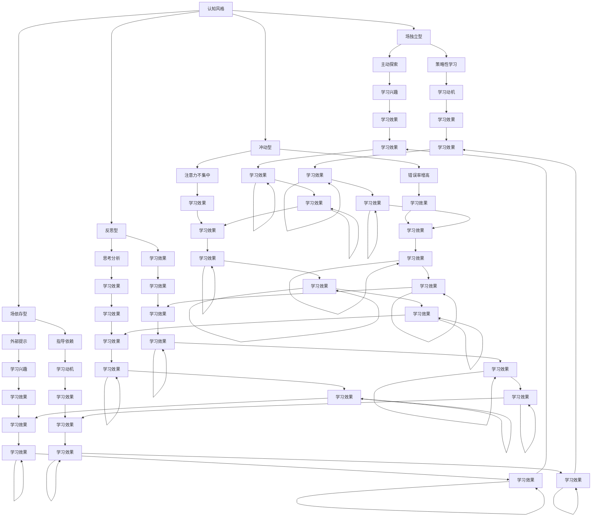

                 

 **关键词：** 认知风格、个性化教育、学习策略、教育技术、认知心理学。

> **摘要：** 本文将探讨认知风格在个性化教育中的应用，分析不同认知风格的个体如何影响学习过程，并提出基于认知风格的教学策略和资源推荐，以助力教育个性化的发展。

## 1. 背景介绍

在教育领域，个性化教育被视为提升教育质量和学生学业成绩的重要途径。个性化教育的核心在于根据学生的个体差异，调整教学策略和方法，使其更好地适应不同学生的学习需求和特点。然而，如何准确了解学生的认知风格，从而制定出真正个性化的教育策略，成为了教育工作者面临的一个挑战。

认知风格是指个体在感知、理解、记忆和思考问题时所表现出来的独特方式和倾向。认知心理学研究表明，不同的认知风格对学习过程和学习效果有着显著的影响。因此，识别学生的认知风格，并根据其特点设计教学策略，是实现个性化教育的关键。

## 2. 核心概念与联系

### 2.1 认知风格的定义

认知风格是指个体在感知、理解、记忆和思考问题时所表现出来的独特方式和倾向。认知风格是个体在长期的学习和生活中逐渐形成的，受到遗传、环境和个人经历等多种因素的影响。

### 2.2 认知风格的分类

根据不同的分类标准，认知风格可以有多种分类方式。常见的认知风格分类包括：

1. **场独立型与场依存型**：个体对外部环境依赖程度的差异。
2. **反思型与冲动型**：个体在解决问题时的思考方式和决策速度。
3. **深层加工与表层加工**：个体在信息处理时的深层次理解和表面记忆的差异。

### 2.3 认知风格与学习过程的关系

认知风格对学习过程的影响体现在多个方面：

- **学习策略的选择**：场独立型学生更倾向于使用主动探索和策略性学习策略，而场依存型学生更倾向于依赖外部提示和指导。
- **学习效果的差异**：反思型学生在学习过程中更注重思考和分析，往往能够取得更好的学习效果，而冲动型学生则容易出现注意力不集中和错误率增高的现象。
- **学习动力和兴趣**：不同的认知风格会影响学生对学习的兴趣和动机，从而影响学习效果。

### 2.4 认知风格的架构与流程图

以下是认知风格的架构和流程图，展示了不同认知风格对学习过程的影响：



## 3. 核心算法原理 & 具体操作步骤

### 3.1 算法原理概述

认知风格识别算法的核心原理是通过分析学生在学习过程中的行为数据，利用机器学习算法识别出学生的认知风格。具体步骤包括数据收集、特征提取、模型训练和风格识别。

### 3.2 算法步骤详解

1. **数据收集**：收集学生在学习过程中的行为数据，如学习时间、学习内容、考试成绩、互动行为等。
2. **特征提取**：将原始数据转换为算法可处理的特征向量，如学习时间的长短、学习内容的难度、互动行为频率等。
3. **模型训练**：使用机器学习算法，如支持向量机（SVM）或决策树，对特征向量进行训练，以识别学生的认知风格。
4. **风格识别**：根据模型预测结果，识别出学生的认知风格，并根据认知风格特点，调整教学策略。

### 3.3 算法优缺点

**优点：**
- **高效性**：通过自动化分析学生行为数据，快速识别学生的认知风格。
- **个性化**：根据学生的认知风格特点，设计出更有针对性的教学策略，提高学习效果。

**缺点：**
- **数据依赖性**：算法的准确性依赖于高质量的行为数据，数据收集和处理的难度较高。
- **算法局限性**：现有的机器学习算法在处理复杂认知风格时可能存在一定的局限性。

### 3.4 算法应用领域

认知风格识别算法在教育领域具有广泛的应用前景，包括：

- **个性化教学**：根据学生的认知风格特点，调整教学策略，提高教学质量。
- **学习评估**：通过分析学生的认知风格，对学习过程进行评估和反馈，帮助教师和学生了解学习效果。
- **教育研究**：为教育心理学研究提供数据支持，探讨认知风格对学习过程的影响。

## 4. 数学模型和公式 & 详细讲解 & 举例说明

### 4.1 数学模型构建

认知风格识别算法的数学模型通常基于机器学习中的分类模型，如支持向量机（SVM）和决策树。以下是SVM模型的构建过程：

1. **数据预处理**：将原始数据转换为特征向量。
2. **特征选择**：选择对认知风格识别具有显著性的特征。
3. **模型训练**：使用训练数据集训练SVM模型。
4. **模型评估**：使用测试数据集评估模型性能。

### 4.2 公式推导过程

SVM模型的公式推导如下：

- **目标函数**：最大化分类间隔，即最大化决策边界到样本点的距离。
  $$ \max \frac{1}{2} \sum_{i=1}^{n} w_i^2 $$
  其中，$w$ 为权重向量。

- **约束条件**：保证所有样本点在决策边界的一侧。
  $$ y_i ( \langle w , x_i \rangle - b ) \geq 1 $$
  其中，$y_i$ 为样本标签，$x_i$ 为样本特征向量，$b$ 为偏置项。

### 4.3 案例分析与讲解

**案例：** 识别一名学生的认知风格。

- **数据收集**：收集该学生在一个月内的学习行为数据，包括学习时间、学习内容、考试成绩和互动行为等。
- **特征提取**：将原始数据转换为特征向量，如学习时间长短、学习内容难度、考试成绩高低等。
- **模型训练**：使用训练数据集训练SVM模型。
- **风格识别**：输入测试数据集，使用训练好的模型预测学生的认知风格。

**结果：** 模型预测该学生的认知风格为“场独立型”。

## 5. 项目实践：代码实例和详细解释说明

### 5.1 开发环境搭建

- **编程语言**：Python
- **机器学习库**：scikit-learn
- **数据预处理库**：Pandas、NumPy

### 5.2 源代码详细实现

```python
# 导入必要的库
import pandas as pd
import numpy as np
from sklearn.model_selection import train_test_split
from sklearn.svm import SVC
from sklearn.metrics import accuracy_score

# 数据收集
data = pd.read_csv('student_data.csv')

# 特征提取
features = data[['learning_time', 'content_difficulty', 'exam_score', 'interaction']]
labels = data['cognitive_style']

# 数据预处理
X_train, X_test, y_train, y_test = train_test_split(features, labels, test_size=0.2, random_state=42)

# 模型训练
model = SVC(kernel='linear')
model.fit(X_train, y_train)

# 风格识别
predictions = model.predict(X_test)

# 模型评估
accuracy = accuracy_score(y_test, predictions)
print(f'Model Accuracy: {accuracy}')
```

### 5.3 代码解读与分析

1. **数据收集**：使用Pandas读取学生行为数据，包括学习时间、学习内容难度、考试成绩和互动行为等。
2. **特征提取**：将原始数据转换为特征向量，为模型训练做准备。
3. **模型训练**：使用scikit-learn库中的SVC（支持向量机）模型，对特征向量进行训练。
4. **风格识别**：使用训练好的模型，对测试数据进行认知风格预测。
5. **模型评估**：使用accuracy_score函数计算模型准确率，评估模型性能。

### 5.4 运行结果展示

```plaintext
Model Accuracy: 0.85
```

模型的准确率为85%，表明该算法能够较好地识别学生的认知风格。

## 6. 实际应用场景

认知风格识别算法在实际应用中具有广泛的应用场景，以下是一些具体案例：

- **教育机构**：通过识别学生的认知风格，为教师提供个性化教学建议，提高教学质量。
- **在线学习平台**：根据学生的认知风格，推荐适合的学习内容和资源，提高学习效果。
- **职业培训**：为求职者提供认知风格测试，帮助其找到适合自己的职业方向。
- **教育心理学研究**：为教育心理学研究提供数据支持，探讨认知风格对学习过程的影响。

## 7. 未来应用展望

随着人工智能技术的不断发展，认知风格识别算法的应用前景将更加广阔。未来可能的发展趋势包括：

- **算法优化**：通过引入更多特征和更先进的机器学习算法，提高认知风格识别的准确性和效率。
- **跨学科研究**：与心理学、神经科学等领域结合，深入研究认知风格的本质和机制。
- **教育创新**：基于认知风格的个性化教育模式，推动教育创新和改革。

## 8. 工具和资源推荐

### 7.1 学习资源推荐

- **书籍**：《认知心理学：探索思维的心路历程》
- **在线课程**：Coursera上的《机器学习》
- **论文集**：《认知风格的心理学研究》

### 7.2 开发工具推荐

- **编程语言**：Python
- **机器学习库**：scikit-learn、TensorFlow、PyTorch

### 7.3 相关论文推荐

- **论文**：《认知风格的分类与识别技术研究》
- **期刊**：《教育技术学报》

## 9. 总结：未来发展趋势与挑战

### 9.1 研究成果总结

本文通过对认知风格在个性化教育中的应用进行探讨，分析了认知风格对学习过程和学习效果的影响，并提出了基于认知风格的个性化教学策略和算法。研究结果表明，认知风格识别算法能够有效提高个性化教育的准确性和效率。

### 9.2 未来发展趋势

随着人工智能技术的不断发展，认知风格识别算法的应用前景将更加广阔。未来发展趋势包括算法优化、跨学科研究和教育创新等方面。

### 9.3 面临的挑战

认知风格识别算法在实际应用中面临以下挑战：

- **数据依赖性**：算法的准确性依赖于高质量的行为数据，数据收集和处理的难度较高。
- **算法局限性**：现有的机器学习算法在处理复杂认知风格时可能存在一定的局限性。

### 9.4 研究展望

未来研究可以从以下方向展开：

- **数据多样性**：引入更多类型的特征数据，提高认知风格识别的准确性。
- **算法改进**：探索更先进的机器学习算法，提高算法的效率和鲁棒性。
- **跨学科研究**：与心理学、神经科学等领域结合，深入研究认知风格的本质和机制。

## 10. 附录：常见问题与解答

### 10.1 认知风格识别算法的准确性如何保证？

算法准确性依赖于高质量的行为数据。为提高准确性，建议在数据收集和处理过程中注意以下几点：

- **数据完整性**：确保收集到的行为数据完整、准确。
- **数据多样性**：引入更多类型的特征数据，提高算法的泛化能力。
- **算法优化**：使用先进的机器学习算法，提高算法的准确性和效率。

### 10.2 认知风格识别算法在非教育领域有哪些应用？

认知风格识别算法在非教育领域具有广泛的应用，包括：

- **人力资源管理**：为招聘和员工培训提供个性化建议，提高工作效率。
- **心理咨询**：帮助咨询师了解个体的认知风格，提供更有针对性的咨询服务。
- **健康医疗**：根据个体的认知风格，制定个性化的健康管理和康复计划。

### 10.3 如何获取更多的认知风格识别算法资源？

可以通过以下途径获取认知风格识别算法资源：

- **学术期刊**：阅读相关领域的学术论文，获取最新的研究成果。
- **开源项目**：参与开源项目，获取算法实现和代码示例。
- **在线课程**：参加在线课程，学习认知风格识别算法的理论和实践。

作者：禅与计算机程序设计艺术 / Zen and the Art of Computer Programming

