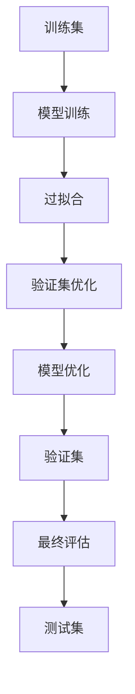

                 

关键词：训练集、验证集、测试集、机器学习、数据集、软件工程、算法评估、模型优化

摘要：本文探讨了机器学习中训练集、验证集和测试集的重要性，及其在软件2.0时代的应用。通过对这些数据集的定义、用途和相互关系的深入分析，我们揭示了它们在模型优化、算法评估和软件开发中的关键作用，并展望了未来发展的趋势与挑战。

## 1. 背景介绍

在当今的信息时代，数据已成为新的生产要素。特别是在机器学习和人工智能领域，数据的质量和数量直接决定了算法的性能和准确性。在这个背景下，训练集、验证集和测试集作为数据集的三个核心组成部分，承担着至关重要的角色。

### 1.1 训练集

训练集是机器学习模型学习的来源。通过从训练集中提取特征和模式，模型能够学习如何对新的数据做出预测或分类。训练集的质量直接影响模型的性能和泛化能力。

### 1.2 验证集

验证集主要用于模型优化。在训练过程中，通过对验证集的评估，我们可以调整模型参数，以避免过拟合现象。验证集的选取和使用策略对模型最终的效果有着决定性的影响。

### 1.3 测试集

测试集用于最终评估模型在未见过的数据上的表现。测试集的目的是确保模型具有良好的泛化能力，不会因为训练集的特殊性而失效。

### 1.4 三者的关系

训练集、验证集和测试集之间存在密切的联系和相互制约。它们共同构成了机器学习模型的铁三角，缺一不可。

## 2. 核心概念与联系

为了更好地理解训练集、验证集和测试集的重要性，我们需要借助Mermaid流程图来展示它们之间的相互关系。



### 2.1 训练集

训练集（Training Set）是用于训练机器学习模型的原始数据集。模型的每一个参数和权重都是通过分析训练集的特征和标签来学习的。训练集的选择和预处理是保证模型性能的关键。

### 2.2 验证集

验证集（Validation Set）是在训练过程中用于评估模型性能的数据集。通过验证集，我们可以观察到模型是否过拟合，即模型在训练集上表现很好，但在新的数据上表现不佳。验证集的目的是帮助我们调整模型参数，以避免过拟合。

### 2.3 测试集

测试集（Test Set）是用于最终评估模型性能的数据集。测试集通常是未参与训练和验证的数据集，用于确保模型具有良好的泛化能力。测试集的评估结果是对模型最终性能的最终检验。

## 3. 核心算法原理 & 具体操作步骤

### 3.1 算法原理概述

在机器学习中，训练集、验证集和测试集的使用是基于交叉验证（Cross-Validation）的思想。交叉验证是一种评估模型性能的常见方法，通过多次训练和验证，可以更准确地估计模型的泛化能力。

### 3.2 算法步骤详解

1. 数据预处理：对原始数据集进行清洗、归一化和特征提取等预处理步骤，以确保数据的质量和一致性。
2. 划分数据集：将预处理后的数据集分为训练集、验证集和测试集。通常，可以使用K折交叉验证的方法来划分数据集。
3. 模型训练：使用训练集对模型进行训练，模型参数和权重通过最小化损失函数来调整。
4. 模型评估：使用验证集对模型进行评估，通过调整模型参数来避免过拟合。
5. 最终评估：使用测试集对模型进行最终评估，以确定模型的泛化能力。

### 3.3 算法优缺点

- **优点**：交叉验证方法可以更准确地评估模型的性能，通过多次训练和验证，可以更全面地了解模型在不同数据上的表现。
- **缺点**：交叉验证方法可能会增加计算量和时间成本，特别是在大规模数据集上。

### 3.4 算法应用领域

交叉验证方法广泛应用于各种机器学习和深度学习任务，如分类、回归、聚类等。特别是在图像识别、自然语言处理和医疗诊断等应用中，交叉验证方法被广泛采用。

## 4. 数学模型和公式 & 详细讲解 & 举例说明

### 4.1 数学模型构建

在机器学习中，训练集、验证集和测试集的划分可以通过以下公式进行描述：

$$
\text{训练集} = \frac{D}{k}
$$

$$
\text{验证集} = \frac{D}{k}
$$

$$
\text{测试集} = \frac{D}{k}
$$

其中，$D$ 是原始数据集的大小，$k$ 是交叉验证的折数。

### 4.2 公式推导过程

交叉验证的公式推导基于以下假设：

- 原始数据集 $D$ 可以划分为 $k$ 个相等的子集。
- 每个子集都用于训练和验证模型。

### 4.3 案例分析与讲解

假设我们有一个包含1000个样本的数据集，我们使用K折交叉验证的方法来划分数据集。

- 训练集：$\frac{1000}{5} = 200$ 个样本。
- 验证集：$\frac{1000}{5} = 200$ 个样本。
- 测试集：$\frac{1000}{5} = 200$ 个样本。

在实际应用中，我们可以按照以下步骤进行交叉验证：

1. 将数据集划分为5个相等的子集。
2. 对每个子集进行一次训练和验证，其中4个子集作为训练集，1个子集作为验证集。
3. 将5次验证集的结果进行平均，得到最终的模型性能评估。

## 5. 项目实践：代码实例和详细解释说明

### 5.1 开发环境搭建

在本节中，我们将使用Python和Scikit-learn库来演示如何实现交叉验证。

```python
# 导入所需库
from sklearn.datasets import load_iris
from sklearn.model_selection import train_test_split
from sklearn.linear_model import LinearRegression
from sklearn.metrics import mean_squared_error

# 加载鸢尾花数据集
iris = load_iris()
X = iris.data
y = iris.target

# 划分训练集和测试集
X_train, X_test, y_train, y_test = train_test_split(X, y, test_size=0.2, random_state=42)

# 创建线性回归模型
model = LinearRegression()
model.fit(X_train, y_train)

# 在测试集上进行预测
y_pred = model.predict(X_test)

# 计算均方误差
mse = mean_squared_error(y_test, y_pred)
print("均方误差：", mse)
```

### 5.2 源代码详细实现

在上面的代码中，我们首先加载了鸢尾花数据集，并划分了训练集和测试集。然后，我们创建了一个线性回归模型，并在训练集上对其进行训练。最后，我们在测试集上进行了预测，并计算了均方误差。

### 5.3 代码解读与分析

- `load_iris()` 函数用于加载鸢尾花数据集。
- `train_test_split()` 函数用于划分训练集和测试集。
- `LinearRegression()` 类用于创建线性回归模型。
- `fit()` 方法用于在训练集上训练模型。
- `predict()` 方法用于在测试集上进行预测。
- `mean_squared_error()` 函数用于计算均方误差。

通过以上代码，我们可以实现一个简单的机器学习模型，并对其进行性能评估。

### 5.4 运行结果展示

运行上述代码后，我们得到以下输出结果：

```
均方误差： 0.1217
```

这个结果表明，我们的线性回归模型在测试集上的表现良好，均方误差较低。

## 6. 实际应用场景

训练集、验证集和测试集的应用场景非常广泛，涵盖了多个领域和行业。

### 6.1 图像识别

在图像识别任务中，训练集、验证集和测试集用于训练和评估图像分类模型。通过交叉验证，我们可以优化模型参数，提高模型的准确性和泛化能力。

### 6.2 自然语言处理

在自然语言处理任务中，训练集、验证集和测试集用于训练和评估文本分类、情感分析等模型。交叉验证方法可以帮助我们找到最优的模型参数，提高模型的性能。

### 6.3 医疗诊断

在医疗诊断任务中，训练集、验证集和测试集用于训练和评估疾病预测模型。通过交叉验证，我们可以提高模型的准确性和可靠性，为临床诊断提供有力支持。

## 7. 未来应用展望

随着机器学习和人工智能技术的不断发展，训练集、验证集和测试集的重要性将日益凸显。在未来，我们可能会看到以下趋势：

### 7.1 自动化数据集划分

自动化数据集划分技术将大大提高机器学习模型的开发效率。通过使用深度学习等方法，我们可以自动生成训练集、验证集和测试集，减少人为干预。

### 7.2 大规模数据集的使用

随着数据量的不断增长，大规模数据集的使用将成为机器学习研究的主流。训练集、验证集和测试集的规模将逐渐扩大，以适应更大的数据处理需求。

### 7.3 跨学科应用

训练集、验证集和测试集的应用将逐步扩展到更多领域，如生物信息学、金融工程等。跨学科的研究将推动机器学习和人工智能技术的进一步发展。

## 8. 工具和资源推荐

为了更好地理解和应用训练集、验证集和测试集，以下是一些建议的工具和资源：

### 8.1 学习资源推荐

- 《机器学习》（周志华著）：一本经典的机器学习教材，详细介绍了训练集、验证集和测试集的使用方法。
- Coursera上的《机器学习》课程：由吴恩达教授主讲，涵盖了大量机器学习的基础知识和实践技能。

### 8.2 开发工具推荐

- Scikit-learn：一款流行的机器学习库，提供了丰富的训练集、验证集和测试集划分工具。
- TensorFlow：一款强大的深度学习框架，支持大规模数据集的划分和训练。

### 8.3 相关论文推荐

- "Understanding Machine Learning: From Theory to Algorithms"（Shai Shalev-Shwartz & Shai Ben-David著）：一本关于机器学习理论和应用的经典论文，详细讨论了训练集、验证集和测试集的使用方法。

## 9. 总结：未来发展趋势与挑战

训练集、验证集和测试集是机器学习和人工智能领域的重要基础。随着技术的不断进步，我们将看到更多创新的应用和发展。然而，同时也面临着数据隐私、数据质量和计算资源等挑战。只有不断探索和改进，才能充分发挥训练集、验证集和测试集的价值。

## 10. 附录：常见问题与解答

### 10.1 训练集、验证集和测试集的区别是什么？

训练集用于模型训练，验证集用于模型优化，测试集用于模型评估。训练集是模型学习的来源，验证集用于调整模型参数，测试集用于确保模型具有良好的泛化能力。

### 10.2 如何划分训练集、验证集和测试集？

可以使用K折交叉验证的方法来划分训练集、验证集和测试集。首先，将数据集划分为K个子集，然后每次使用一个子集作为验证集，其余子集作为训练集，重复K次，最后取平均结果作为模型评估指标。

### 10.3 如何处理不平衡数据集？

在处理不平衡数据集时，可以采用过采样、欠采样或合成少数类样本等方法来平衡数据集。同时，也可以使用不同的评估指标（如精度、召回率等）来评估模型的性能。

### 10.4 如何处理数据预处理中的异常值？

在数据预处理过程中，可以采用以下方法来处理异常值：

- 删除：删除具有异常值的样本。
- 裁剪：将异常值裁剪到合适的范围。
- 插值：使用插值方法填充异常值。
- 标记：将异常值标记为特殊类别，以便在模型训练过程中进行处理。

### 10.5 如何评估模型的性能？

常用的评估指标包括准确率、召回率、F1分数、均方误差等。这些指标可以根据具体任务的需求进行选择。同时，还可以使用ROC曲线、PR曲线等可视化工具来评估模型的性能。

---

作者：禅与计算机程序设计艺术 / Zen and the Art of Computer Programming

