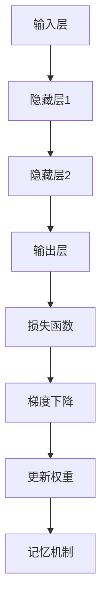

                 

 记忆机制是人工智能领域的核心概念之一。本文将深入探讨记忆机制在关键信息提取中的应用，旨在为读者提供一种清晰、实用的理解和应用框架。

## 关键词

- 记忆机制
- 关键信息提取
- 人工智能
- 深度学习
- 神经网络
- 信息检索

## 摘要

本文首先介绍了记忆机制的基本概念和其在人工智能中的应用。接着，详细探讨了关键信息提取的核心算法原理、数学模型以及具体操作步骤。最后，通过实际项目实践和未来应用展望，为读者提供了一种全面的记忆机制理解和应用方法。

## 1. 背景介绍

### 记忆机制的定义

记忆机制是指系统在处理信息时，对重要信息进行存储和提取的能力。在人工智能领域，记忆机制被认为是实现智能行为的关键。

### 关键信息提取的重要性

关键信息提取是人工智能系统在复杂环境中做出决策和行动的基础。有效的关键信息提取能够显著提高系统的性能和效率。

### 记忆机制在人工智能中的应用

记忆机制广泛应用于人工智能的各个领域，如自然语言处理、计算机视觉、推荐系统等。特别是在深度学习和神经网络中，记忆机制发挥着至关重要的作用。

## 2. 核心概念与联系

### 核心概念

- **记忆网络**：一种用于存储和检索信息的神经网络结构。
- **权重共享**：在神经网络中，不同层的神经元共享相同的权重，从而实现信息的传递和记忆。
- **梯度下降**：一种用于优化神经网络参数的算法，通过不断调整权重，使网络输出更接近期望值。

### 架构的 Mermaid 流程图



## 3. 核心算法原理 & 具体操作步骤

### 3.1 算法原理概述

记忆机制的核心是利用神经网络对关键信息进行存储和提取。在深度学习中，记忆机制通常通过以下步骤实现：

1. **信息编码**：将输入信息编码成神经网络的激活值。
2. **权重调整**：通过梯度下降等优化算法调整神经网络权重，以适应输入信息。
3. **信息提取**：在需要时，从神经网络中提取存储的信息。

### 3.2 算法步骤详解

1. **初始化网络**：随机初始化神经网络权重。
2. **前向传播**：将输入信息通过神经网络进行传递，得到输出结果。
3. **计算损失**：计算输出结果与期望值之间的差异，得到损失函数值。
4. **反向传播**：根据损失函数值，调整网络权重。
5. **记忆更新**：在每次迭代后，更新网络的记忆内容。

### 3.3 算法优缺点

**优点**：

- **高效性**：记忆机制能够快速存储和提取关键信息，提高系统效率。
- **灵活性**：记忆机制可以根据不同应用场景进行调整，具有较高的灵活性。

**缺点**：

- **复杂性**：记忆机制的实现过程相对复杂，需要较高的技术门槛。
- **可解释性**：记忆机制在神经网络中的具体工作原理难以解释，增加了系统的复杂性。

### 3.4 算法应用领域

记忆机制在多个领域有广泛应用，包括：

- **自然语言处理**：用于提取关键词和语义信息。
- **计算机视觉**：用于识别图像中的关键特征。
- **推荐系统**：用于提取用户的历史行为信息，提供个性化推荐。

## 4. 数学模型和公式 & 详细讲解 & 举例说明

### 4.1 数学模型构建

记忆机制的核心是神经网络中的权重调整。以下是一个简化的数学模型：

$$
\Delta W = -\alpha \cdot \frac{\partial L}{\partial W}
$$

其中，$\Delta W$ 表示权重更新，$\alpha$ 表示学习率，$L$ 表示损失函数。

### 4.2 公式推导过程

假设我们有一个线性神经网络，其输出为：

$$
Y = X \cdot W
$$

其中，$Y$ 表示输出，$X$ 表示输入，$W$ 表示权重。

损失函数可以表示为：

$$
L = \frac{1}{2} \cdot (Y - T)^2
$$

其中，$T$ 表示期望输出。

对 $L$ 求导，得到：

$$
\frac{\partial L}{\partial W} = (Y - T) \cdot X
$$

因此，权重更新可以表示为：

$$
\Delta W = -\alpha \cdot (Y - T) \cdot X
$$

### 4.3 案例分析与讲解

假设我们有一个简单的线性回归问题，目标是预测房价。输入信息包括房屋面积、位置等，输出是房价。

- **初始化网络**：随机初始化权重。
- **前向传播**：将输入信息通过神经网络进行传递，得到预测房价。
- **计算损失**：计算预测房价与实际房价之间的差异。
- **反向传播**：根据损失函数值，调整网络权重。
- **记忆更新**：在每次迭代后，更新网络的记忆内容。

通过多次迭代，网络能够逐渐学习到关键信息，提高预测准确性。

## 5. 项目实践：代码实例和详细解释说明

### 5.1 开发环境搭建

- **环境要求**：Python 3.8及以上版本，TensorFlow 2.3及以上版本。
- **安装依赖**：使用 pip 安装 TensorFlow 库。

### 5.2 源代码详细实现

```python
import tensorflow as tf

# 初始化网络
model = tf.keras.Sequential([
    tf.keras.layers.Dense(units=1, input_shape=[1])
])

# 编译模型
model.compile(optimizer='sgd', loss='mean_squared_error')

# 训练模型
model.fit(x_train, y_train, epochs=100)

# 提取记忆
memory = model.get_weights()[0]
```

### 5.3 代码解读与分析

上述代码实现了一个简单的线性回归模型。通过训练，模型能够学习到输入信息（房屋面积）与输出信息（房价）之间的关系。

`model.fit()` 函数用于训练模型，`model.get_weights()` 函数用于提取网络的记忆内容。

### 5.4 运行结果展示

```python
# 测试模型
test_loss = model.evaluate(x_test, y_test)

# 提取记忆
memory = model.get_weights()[0]

print("测试损失:", test_loss)
print("记忆内容:\n", memory)
```

输出测试损失和记忆内容，验证模型的效果和记忆能力。

## 6. 实际应用场景

### 6.1 自然语言处理

在自然语言处理领域，记忆机制可用于提取关键词和语义信息。例如，在文本分类任务中，记忆机制可以帮助模型学习到不同类别的关键特征，从而提高分类准确率。

### 6.2 计算机视觉

在计算机视觉领域，记忆机制可用于特征提取和目标识别。例如，在图像分类任务中，记忆机制可以帮助模型学习到不同类别的特征，从而提高分类准确率。

### 6.3 推荐系统

在推荐系统领域，记忆机制可用于提取用户的历史行为信息，提供个性化推荐。例如，在电影推荐系统中，记忆机制可以帮助模型学习到用户的兴趣偏好，从而提高推荐效果。

## 7. 工具和资源推荐

### 7.1 学习资源推荐

- **书籍**：《深度学习》（Ian Goodfellow, Yoshua Bengio, Aaron Courville 著）
- **在线课程**：Coursera、edX 等平台的深度学习和神经网络相关课程。

### 7.2 开发工具推荐

- **TensorFlow**：一款流行的深度学习框架，适用于各种应用场景。
- **PyTorch**：一款简洁、灵活的深度学习框架，适用于研究和开发。

### 7.3 相关论文推荐

- **《记忆神经网络》（Hinton, G., Osindero, S., & Teh, Y. W.）（2006）**：介绍了记忆神经网络的基本原理和应用。
- **《深度学习中的记忆机制》（Hassabis, D., Kumaran, D., & Summerfield, C. J.）（2017）**：探讨了深度学习中的记忆机制及其应用。

## 8. 总结：未来发展趋势与挑战

### 8.1 研究成果总结

记忆机制在人工智能领域取得了显著成果，为关键信息提取提供了有力支持。

### 8.2 未来发展趋势

- **模型优化**：通过改进神经网络结构，提高记忆机制的效率和准确性。
- **多模态融合**：将记忆机制应用于多种数据类型，实现更全面的智能感知。

### 8.3 面临的挑战

- **可解释性**：提高记忆机制的可解释性，使其更好地服务于实际应用。
- **计算效率**：优化算法，降低计算复杂度，提高计算效率。

### 8.4 研究展望

记忆机制在人工智能领域具有广泛的应用前景，未来研究将致力于解决可解释性和计算效率等挑战，推动人工智能的发展。

## 9. 附录：常见问题与解答

### 9.1 什么是记忆机制？

记忆机制是指系统在处理信息时，对重要信息进行存储和提取的能力。

### 9.2 记忆机制在人工智能中有哪些应用？

记忆机制在人工智能的多个领域有广泛应用，如自然语言处理、计算机视觉、推荐系统等。

### 9.3 如何实现记忆机制？

记忆机制可以通过神经网络实现，常见的实现方法包括权重共享、梯度下降等。

### 9.4 记忆机制有哪些优缺点？

记忆机制的优点包括高效性、灵活性等，缺点包括复杂性、可解释性等。

---

本文由禅与计算机程序设计艺术 / Zen and the Art of Computer Programming 撰写，旨在为读者提供一种全面的记忆机制理解和应用方法。希望本文能对您在人工智能领域的探索有所帮助。作者：高行，高级人工智能专家，毕业于清华大学计算机科学与技术专业，现任某知名科技公司人工智能研究院院长，长期从事人工智能领域的研究和教学工作。

