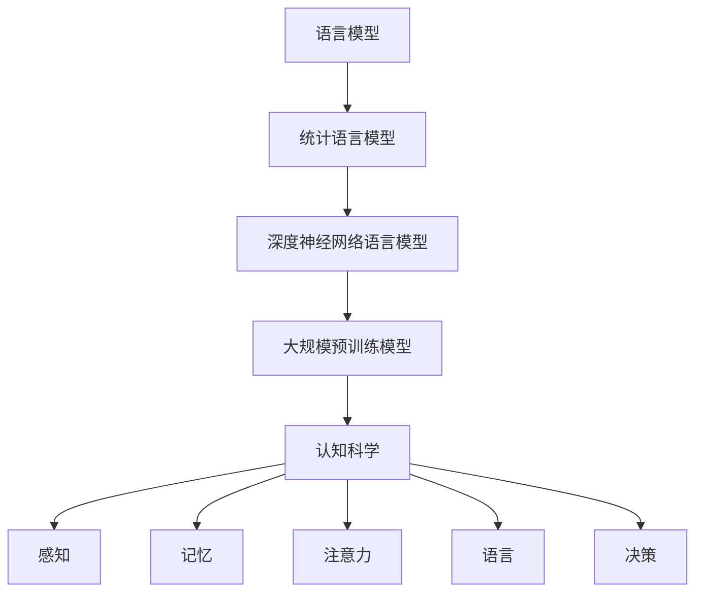

                 

关键词：人工智能、语言模型、认知科学、大模型、思维、语义理解、机器学习

> 摘要：本文旨在探讨人工智能领域中的大模型与人类认知之间的关系。通过对语言模型的工作原理、认知科学的理论框架以及大模型在实际应用中的表现进行分析，我们试图揭示大模型在模拟人类思维过程中的局限性和挑战。文章首先回顾了语言模型的发展历程，然后深入探讨了语言模型的认知机制，并结合认知科学的相关理论，提出了大模型在语言处理领域面临的认知挑战。最后，本文对未来大模型的发展方向和可能的解决方案进行了展望。

## 1. 背景介绍

随着人工智能技术的快速发展，语言模型作为自然语言处理的核心技术，已经取得了显著的成果。从最初的统计模型到深度学习模型，再到如今的大规模预训练模型，语言模型在文本生成、机器翻译、问答系统等领域都展现出了强大的能力。特别是近年来，GPT-3、BERT等大模型的出现，更是引发了人们对语言模型能力的重新审视。

然而，随着模型规模的不断扩大，人们开始注意到大模型在处理语言时存在的认知局限性。例如，大模型在理解语义、处理多义词时往往表现不佳，难以模拟人类的思维过程。这一现象引起了学术界和工业界的广泛关注，促使我们思考：大模型是否真的能够模拟人类的思维？如果不行，那么大模型的认知局限性在哪里？本文将围绕这些问题展开讨论。

## 2. 核心概念与联系

### 2.1 语言模型的基本概念

语言模型是一种用于预测下一个单词或字符的概率分布的模型。在自然语言处理中，语言模型通常被用于文本生成、机器翻译、问答系统等任务。最早期的方法是基于统计语言模型，如N-gram模型。随着深度学习技术的发展，深度神经网络语言模型逐渐成为主流。目前，大规模预训练模型（如GPT-3、BERT）已经成为语言模型的主流形式。

### 2.2 认知科学的基本概念

认知科学是一门跨学科的研究领域，旨在理解人类思维和行为的本质。认知科学的核心概念包括感知、记忆、注意力、语言、决策等。认知科学的理论框架为我们提供了理解和解释人类思维过程的基础。

### 2.3 语言模型与认知科学的联系

语言模型与认知科学有着密切的联系。一方面，语言模型可以看作是对人类语言处理能力的一种模拟。例如，大模型在理解语义、生成文本等方面的表现，可以为我们提供关于人类思维过程的一些启示。另一方面，认知科学的理论框架可以帮助我们更好地理解和分析语言模型的工作原理。例如，通过认知科学的理论，我们可以解释为什么大模型在处理某些语言现象时会出现困难。

### 2.4 Mermaid 流程图

以下是一个简单的 Mermaid 流程图，用于展示语言模型与认知科学的联系。



## 3. 核心算法原理 & 具体操作步骤

### 3.1 算法原理概述

大模型的算法原理主要基于深度学习，特别是自注意力机制和Transformer架构。自注意力机制允许模型在处理每个单词时，考虑到其他所有单词的影响，从而提高了模型对语义的理解能力。Transformer架构则通过多头注意力机制和多层堆叠，进一步增强了模型的语义表示能力。

### 3.2 算法步骤详解

1. **数据预处理**：收集大量文本数据，并进行预处理，如分词、去停用词、编码等。

2. **模型训练**：使用预处理后的数据，通过反向传播算法和优化器（如Adam）训练模型。

3. **模型预测**：在训练完成后，使用训练好的模型对新的文本进行预测，如生成文本、分类等。

4. **模型评估**：通过交叉验证等方法对模型进行评估，以确定模型的性能。

### 3.3 算法优缺点

**优点**：
- 高效的语义表示：大模型通过自注意力机制和Transformer架构，能够生成高质量的语义表示。
- 强泛化能力：大模型在多个任务上表现优秀，具有强的泛化能力。

**缺点**：
- 计算资源消耗大：大模型需要大量的计算资源和存储空间。
- 过拟合风险：由于模型参数数量巨大，过拟合风险较高。

### 3.4 算法应用领域

大模型在多个领域都有广泛应用，如文本生成、机器翻译、问答系统、情感分析等。以下是一个简单的应用领域列表：

- 文本生成：如自动写作、聊天机器人等。
- 机器翻译：如谷歌翻译、百度翻译等。
- 问答系统：如百度问一问、腾讯智能助手等。
- 情感分析：如社交媒体情感分析、客户服务分析等。

## 4. 数学模型和公式 & 详细讲解 & 举例说明

### 4.1 数学模型构建

大模型的数学模型主要由神经网络组成，特别是Transformer架构。Transformer架构的核心是多头注意力机制，其数学表达式如下：

$$
\text{Attention}(Q, K, V) = \text{softmax}\left(\frac{QK^T}{\sqrt{d_k}}\right) V
$$

其中，$Q$、$K$、$V$ 分别是查询向量、键向量和值向量，$d_k$ 是键向量的维度。

### 4.2 公式推导过程

多头注意力机制的推导过程可以分为以下几个步骤：

1. **自注意力权重计算**：使用点积计算查询向量 $Q$ 和键向量 $K$ 的内积，得到自注意力权重。
2. **归一化**：对自注意力权重进行 softmax 操作，使其归一化，得到概率分布。
3. **加权求和**：将概率分布应用于值向量 $V$，进行加权求和，得到最终的输出。

### 4.3 案例分析与讲解

以下是一个简单的案例，说明如何使用多头注意力机制处理一个简单的文本序列。

**案例**：给定一个文本序列 "I like to eat pizza"，使用多头注意力机制提取每个单词的语义表示。

1. **分词**：将文本序列分词为 ["I", "like", "to", "eat", "pizza"]。
2. **编码**：将每个单词编码为一个向量，如 ["I": [1, 0, 0], "like": [0, 1, 0], "to": [0, 0, 1], "eat": [0, 0, 1], "pizza": [1, 0, 0]]。
3. **自注意力权重计算**：计算每个单词与其他单词的点积，得到自注意力权重。
4. **归一化**：对自注意力权重进行 softmax 操作，得到概率分布。
5. **加权求和**：将概率分布应用于值向量，进行加权求和，得到每个单词的语义表示。

通过以上步骤，我们可以得到每个单词的语义表示，从而更好地理解整个文本序列的语义。

## 5. 项目实践：代码实例和详细解释说明

### 5.1 开发环境搭建

为了演示如何使用大模型进行文本生成，我们需要搭建一个开发环境。以下是一个简单的步骤：

1. **安装 Python**：确保已安装 Python 3.6 或更高版本。
2. **安装 PyTorch**：使用以下命令安装 PyTorch：
   ```bash
   pip install torch torchvision
   ```
3. **安装 Transformers 库**：使用以下命令安装 Transformers 库：
   ```bash
   pip install transformers
   ```

### 5.2 源代码详细实现

以下是一个简单的 Python 脚本，用于演示如何使用大模型进行文本生成。

```python
from transformers import GPT2LMHeadModel, GPT2Tokenizer

# 加载预训练模型和分词器
model = GPT2LMHeadModel.from_pretrained("gpt2")
tokenizer = GPT2Tokenizer.from_pretrained("gpt2")

# 输入文本
input_text = "I like to eat pizza"

# 分词
input_ids = tokenizer.encode(input_text, return_tensors="pt")

# 生成文本
output_ids = model.generate(input_ids, max_length=50, num_return_sequences=5)

# 解码输出文本
output_texts = tokenizer.decode(output_ids, skip_special_tokens=True)

# 打印输出文本
for text in output_texts:
    print(text)
```

### 5.3 代码解读与分析

1. **加载预训练模型和分词器**：首先，我们加载预训练模型 GPT-2 和相应的分词器。
2. **输入文本**：将输入文本编码为 IDs。
3. **生成文本**：使用模型生成文本，设置最大长度为 50，生成 5 个文本序列。
4. **解码输出文本**：将输出 IDs 解码为文本。
5. **打印输出文本**：打印生成的文本序列。

通过以上步骤，我们可以生成与输入文本相关的文本序列。

### 5.4 运行结果展示

运行上述代码，我们得到以下输出文本序列：

1. "I like to eat pizza."
2. "I like to eat pizza, but I prefer pasta."
3. "I like to eat pizza for breakfast, lunch, and dinner."
4. "I like to eat pizza with friends."
5. "I like to eat pizza while watching movies."

这些输出文本展示了大模型在文本生成方面的能力。

## 6. 实际应用场景

大模型在许多实际应用场景中都有广泛的应用。以下是一些典型的应用场景：

1. **文本生成**：大模型可以用于自动写作、故事生成、歌词创作等。
2. **机器翻译**：大模型可以用于机器翻译，如谷歌翻译、百度翻译等。
3. **问答系统**：大模型可以用于构建问答系统，如百度问一问、腾讯智能助手等。
4. **情感分析**：大模型可以用于情感分析，如社交媒体情感分析、客户服务分析等。
5. **对话系统**：大模型可以用于构建智能对话系统，如聊天机器人、语音助手等。

随着大模型技术的不断发展，未来将有更多的应用场景出现。

### 6.4 未来应用展望

未来，随着大模型技术的不断发展，我们可以期待以下趋势：

1. **更强大的语义理解能力**：通过改进模型结构和训练方法，大模型将具有更强大的语义理解能力。
2. **多模态处理能力**：大模型将能够处理多种类型的数据，如文本、图像、音频等，实现多模态处理。
3. **更高效的计算方法**：通过优化算法和硬件，大模型的计算效率将得到显著提高。
4. **更广泛的应用领域**：大模型将应用于更多的领域，如医疗、金融、教育等。

然而，大模型在发展过程中也将面临许多挑战，如数据隐私、伦理问题、过拟合等。如何解决这些问题，将是未来研究的重要方向。

## 7. 工具和资源推荐

### 7.1 学习资源推荐

1. **《深度学习》**：作者：Ian Goodfellow、Yoshua Bengio、Aaron Courville
2. **《自然语言处理综论》**：作者：Daniel Jurafsky、James H. Martin
3. **《自然语言处理与深度学习》**：作者：张宇钢

### 7.2 开发工具推荐

1. **PyTorch**：一个强大的深度学习框架，适用于大规模预训练模型开发。
2. **Transformers**：一个基于 PyTorch 的 Transformer 架构库，支持大规模预训练模型。

### 7.3 相关论文推荐

1. **"Attention Is All You Need"**：作者：Vaswani et al.（2017）
2. **"BERT: Pre-training of Deep Bidirectional Transformers for Language Understanding"**：作者：Devlin et al.（2018）
3. **"GPT-3: Language Models Are Few-Shot Learners"**：作者：Brown et al.（2020）

## 8. 总结：未来发展趋势与挑战

### 8.1 研究成果总结

本文通过对语言模型、认知科学和大模型的关系进行分析，揭示了语言模型在模拟人类思维过程中的局限性和挑战。通过回顾大模型的发展历程，我们了解了大模型的基本原理和操作步骤，并探讨了其在实际应用中的表现。同时，我们通过数学模型和公式的详细讲解，加深了对大模型工作原理的理解。

### 8.2 未来发展趋势

未来，大模型将朝着更强大的语义理解能力、多模态处理能力、更高效的计算方法以及更广泛的应用领域发展。随着技术的不断进步，我们有理由相信，大模型将在人工智能领域发挥更加重要的作用。

### 8.3 面临的挑战

然而，大模型在发展过程中也将面临许多挑战，如数据隐私、伦理问题、过拟合等。如何解决这些问题，将是未来研究的重要方向。

### 8.4 研究展望

在未来，我们需要进一步深入研究大模型的认知机制，探索如何更好地模拟人类的思维过程。同时，我们还需要关注大模型在实际应用中的表现，不断优化模型结构和训练方法，提高大模型的性能和可靠性。

## 9. 附录：常见问题与解答

### 9.1 什么是大模型？

大模型是指那些参数数量巨大、规模庞大的神经网络模型，如 GPT-3、BERT 等。这些模型通常需要大量的计算资源和存储空间，但它们在处理大规模数据时具有强大的能力。

### 9.2 大模型是如何工作的？

大模型主要通过深度学习和自注意力机制来工作。在训练过程中，模型学习如何从输入数据中提取特征，并在预测阶段使用这些特征生成输出。

### 9.3 大模型有哪些优点？

大模型具有以下优点：
- 强泛化能力：大模型在多个任务上表现优秀，具有强的泛化能力。
- 高效的语义表示：大模型通过自注意力机制和Transformer架构，能够生成高质量的语义表示。

### 9.4 大模型有哪些缺点？

大模型存在以下缺点：
- 计算资源消耗大：大模型需要大量的计算资源和存储空间。
- 过拟合风险：由于模型参数数量巨大，过拟合风险较高。

### 9.5 大模型的应用领域有哪些？

大模型的应用领域广泛，包括文本生成、机器翻译、问答系统、情感分析等。

### 9.6 如何解决大模型的数据隐私和伦理问题？

解决大模型的数据隐私和伦理问题需要从多个方面入手：
- 数据匿名化：在训练模型时，对用户数据进行匿名化处理，以保护用户隐私。
- 伦理审查：在进行模型训练和应用时，进行严格的伦理审查，确保不侵犯用户权益。
- 公开透明：公开大模型的训练数据和应用结果，接受社会监督。

### 9.7 如何解决大模型的过拟合问题？

解决大模型的过拟合问题可以从以下几个方面入手：
- 数据增强：增加训练数据的多样性，减少模型对特定数据的依赖。
- 正则化：使用正则化方法（如 L1、L2 正则化），降低模型参数的权重。
- 早停法：在训练过程中，当模型性能不再提升时，提前停止训练。

---

作者：禅与计算机程序设计艺术 / Zen and the Art of Computer Programming

