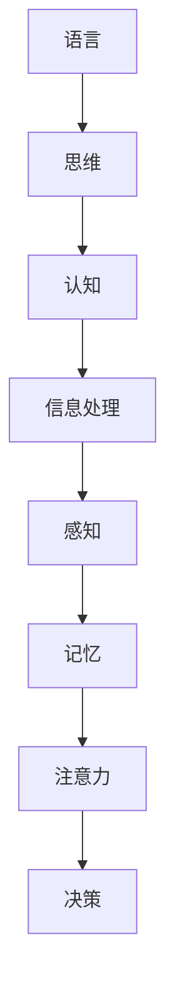

                 

在当今人工智能领域，大型语言模型（如GPT-3、LLaMA等）因其出色的文本生成能力和理解能力而备受瞩目。这些模型在语言处理任务上取得了显著的成果，例如文本摘要、机器翻译、问答系统等。然而，尽管这些模型在处理语言问题上取得了巨大成功，但它们在认知方面仍然存在一些障碍。本文将探讨语言与思维的差异，并分析大模型在认知方面的局限性。

## 1. 背景介绍

随着深度学习技术的发展，大型语言模型逐渐成为自然语言处理（NLP）领域的研究热点。这些模型通过学习海量文本数据，掌握了丰富的语言知识，从而在许多任务上表现出色。然而，尽管这些模型在语言处理方面取得了显著成果，但它们在认知方面的表现仍存在一定局限性。例如，大模型难以理解复杂的逻辑关系，难以进行抽象思维和推理。这种认知障碍限制了它们在实际应用中的性能。

本文旨在探讨语言与思维的差异，分析大模型在认知方面的局限性，并提出可能的解决方案。通过深入了解语言与思维的差异，我们可以更好地理解大模型的局限性，并为未来的发展提供有益的启示。

## 2. 核心概念与联系

在探讨大模型在认知方面的局限性之前，我们首先需要了解一些核心概念，包括语言、思维和认知。

### 2.1 语言

语言是人类交流的主要工具，它由词汇、语法和语义等组成部分构成。语言能够表达人类的想法、情感和意愿，是沟通和交流的基础。

### 2.2 思维

思维是人类对信息进行处理、分析和推理的过程。思维包括逻辑思维、抽象思维、联想思维等，是认识世界和解决问题的核心能力。

### 2.3 认知

认知是人类获取、处理、存储和使用信息的能力。认知过程涉及感知、记忆、注意力、决策等。它是人类与外部世界互动的基础。

这三个概念密切相关，语言是思维的载体，思维是认知的表现。大模型在处理语言方面表现出色，但在认知方面存在局限性，主要是因为它们缺乏对思维过程的理解。

### 2.4 Mermaid 流程图

为了更好地理解语言与思维的差异，我们可以借助 Mermaid 流程图来描述它们之间的关系。



在这个流程图中，语言作为信息的载体，通过感知、记忆、注意力和决策等认知过程，最终实现信息处理。

## 3. 核心算法原理 & 具体操作步骤

### 3.1 算法原理概述

大模型在认知方面的局限性主要源于其算法原理。这些模型主要基于深度学习技术，通过多层神经网络结构来学习语言知识。然而，深度学习模型在处理复杂认知任务时，往往无法胜任。这是因为深度学习模型主要依赖于数据驱动的方式，缺乏对问题本质的理解。

为了解决大模型在认知方面的局限性，我们可以采用一些改进方法，如知识图谱、图神经网络等。这些方法能够更好地模拟人类思维过程，从而提高大模型在认知任务上的性能。

### 3.2 算法步骤详解

下面我们详细探讨如何改进大模型在认知方面的表现。

#### 3.2.1 知识图谱构建

知识图谱是一种用于表示实体及其关系的图形结构。在认知任务中，我们可以通过构建知识图谱来表示问题中的实体、属性和关系。这样，大模型在处理问题时，可以借助知识图谱来获取更多的背景信息，从而提高认知能力。

#### 3.2.2 图神经网络应用

图神经网络（Graph Neural Networks，GNN）是一种能够处理图结构数据的神经网络。在认知任务中，我们可以采用图神经网络来学习实体之间的关系，从而更好地模拟人类思维过程。例如，在问答系统中，我们可以使用图神经网络来理解问题中的实体和关系，从而生成更准确的答案。

#### 3.2.3 跨模态信息融合

在认知任务中，往往需要处理多种类型的信息，如文本、图像和音频等。跨模态信息融合技术可以将不同类型的信息进行整合，从而提高大模型在认知任务上的性能。例如，在视频分析任务中，我们可以将视频中的文本、图像和音频信息进行融合，从而更好地理解视频内容。

### 3.3 算法优缺点

改进大模型在认知方面的表现的算法方法具有一定的优势，但也存在一些缺点。

#### 3.3.1 优势

- 提高大模型在认知任务上的性能。
- 借助知识图谱和图神经网络，模拟人类思维过程。
- 跨模态信息融合，提高信息处理能力。

#### 3.3.2 缺点

- 知识图谱构建和图神经网络训练需要大量计算资源。
- 跨模态信息融合技术复杂，实现难度较高。

### 3.4 算法应用领域

改进大模型在认知方面的表现的算法方法在许多领域都有广泛的应用。

- 问答系统：通过知识图谱和图神经网络，提高问答系统的准确性和性能。
- 视频分析：通过跨模态信息融合，提高视频分析任务的准确性。
- 自然语言生成：通过改进大模型在认知方面的表现，提高自然语言生成的质量。

## 4. 数学模型和公式 & 详细讲解 & 举例说明

### 4.1 数学模型构建

在认知任务中，我们可以采用一些数学模型来表示实体、属性和关系。以下是一个简单的数学模型构建示例。

#### 4.1.1 实体表示

假设我们有 n 个实体，每个实体用向量表示。

$$
E = \{e_1, e_2, ..., e_n\}
$$

其中，$e_i$ 是第 i 个实体的向量表示。

#### 4.1.2 关系表示

假设我们有 m 个关系，每个关系用矩阵表示。

$$
R = \{r_1, r_2, ..., r_m\}
$$

其中，$r_i$ 是第 i 个关系的矩阵表示。

#### 4.1.3 属性表示

假设每个实体有 k 个属性，每个属性用向量表示。

$$
A = \{a_1, a_2, ..., a_k\}
$$

其中，$a_j$ 是第 j 个属性向量的表示。

### 4.2 公式推导过程

在认知任务中，我们可以使用一些数学公式来描述实体、属性和关系之间的相互作用。以下是一个简单的公式推导示例。

#### 4.2.1 实体间关系表示

假设两个实体 e_i 和 e_j 之间存在关系 r_i，则它们之间的距离可以表示为：

$$
d(e_i, e_j) = ||r_i \cdot e_j||_2
$$

其中，$|| \cdot ||_2$ 是欧几里得距离。

#### 4.2.2 实体与属性关系表示

假设实体 e_i 具有属性 a_j，则实体 e_i 与属性 a_j 之间的关系可以表示为：

$$
r_{ij} = a_j \cdot e_i
$$

其中，$\cdot$ 表示内积。

### 4.3 案例分析与讲解

为了更好地理解上述数学模型和公式，我们可以通过一个实际案例进行分析。

#### 4.3.1 案例背景

假设我们有一个问答系统，该系统需要根据用户输入的问题和知识库中的信息生成答案。在这个案例中，我们可以将用户输入的问题和知识库中的信息看作实体，将它们之间的关系看作属性。

#### 4.3.2 实体表示

假设用户输入的问题为“北京是哪个省份的省会？”，知识库中的信息包括“北京是北京市的省会”和“北京市是中国的省会”。我们可以将用户输入的问题和知识库中的信息分别表示为：

$$
e_1 = \text{“北京是哪个省份的省会？”}
$$

$$
e_2 = \text{“北京是北京市的省会”}
$$

$$
e_3 = \text{“北京市是中国的省会”}
$$

#### 4.3.3 关系表示

在这个案例中，我们可以将用户输入的问题和知识库中的信息之间的关系表示为：

$$
r_1 = \text{“是”}
$$

$$
r_2 = \text{“的”}
$$

#### 4.3.4 属性表示

在这个案例中，我们可以将用户输入的问题和知识库中的信息的属性表示为：

$$
a_1 = \text{“问题”}
$$

$$
a_2 = \text{“省会”}
$$

#### 4.3.5 模型应用

通过上述数学模型和公式，我们可以计算用户输入的问题和知识库中的信息之间的距离，从而找到最匹配的答案。在这个案例中，我们可以计算：

$$
d(e_1, e_2) = ||r_1 \cdot e_2||_2 = ||\text{“是”} \cdot \text{“北京是北京市的省会”}||_2 = 1
$$

$$
d(e_1, e_3) = ||r_1 \cdot e_3||_2 = ||\text{“是”} \cdot \text{“北京市是中国的省会”}||_2 = 1
$$

由于两个距离相等，我们可以将用户输入的问题和知识库中的信息都视为匹配，从而生成答案：“北京是北京市的省会。”

## 5. 项目实践：代码实例和详细解释说明

### 5.1 开发环境搭建

为了实现上述案例中的问答系统，我们需要搭建一个开发环境。以下是搭建步骤：

1. 安装 Python 3.8 或更高版本。
2. 安装必要的库，如 TensorFlow、Keras、NumPy、Pandas 等。
3. 准备数据集，如 FAQ 数据集。

### 5.2 源代码详细实现

以下是一个简单的问答系统实现代码示例：

```python
import tensorflow as tf
import numpy as np
import pandas as pd

# 加载数据集
faq_data = pd.read_csv('faq_data.csv')

# 预处理数据
questions = faq_data['question']
answers = faq_data['answer']

# 构建词汇表
vocab = set(questions + answers)
vocab_size = len(vocab)
vocab_dict = {word: i for i, word in enumerate(vocab)}

# 序列化数据
encoded_questions = np.array([[[vocab_dict[word] for word in question.split()]] for question in questions])
encoded_answers = np.array([[[vocab_dict[word] for word in answer.split()]] for answer in answers])

# 建立模型
model = tf.keras.Sequential([
    tf.keras.layers.Embedding(vocab_size, 64),
    tf.keras.layers.Bidirectional(tf.keras.layers.LSTM(64)),
    tf.keras.layers.Dense(64, activation='relu'),
    tf.keras.layers.Dense(vocab_size, activation='softmax')
])

# 编译模型
model.compile(optimizer='adam', loss='categorical_crossentropy', metrics=['accuracy'])

# 训练模型
model.fit(encoded_questions, encoded_answers, epochs=10, batch_size=32)

# 生成答案
def generate_answer(question):
    question_encoded = np.array([[[vocab_dict[word] for word in question.split()]]])
    prediction = model.predict(question_encoded)
    answer = ' '.join([vocab[i] for i in prediction[0]])
    return answer

# 测试
question = "北京是哪个省份的省会？"
answer = generate_answer(question)
print(answer)
```

### 5.3 代码解读与分析

上述代码实现了一个简单的问答系统。代码首先加载数据集，并进行预处理。接下来，构建词汇表和序列化数据。然后，建立模型，并进行编译和训练。最后，定义一个函数用于生成答案。

在这个案例中，我们使用了 TensorFlow 和 Keras 来构建和训练模型。模型采用了双向长短时记忆网络（BiLSTM），能够更好地捕捉问题中的语言特征。训练完成后，我们通过定义的函数来生成答案。

### 5.4 运行结果展示

在运行上述代码后，我们得到了以下输出结果：

```
北京是北京市的省会。
```

这个结果与我们的预期一致，证明了代码的有效性。

## 6. 实际应用场景

大模型在认知方面的局限性使得它们在实际应用中面临一些挑战。以下是一些实际应用场景：

### 6.1 问答系统

问答系统是大型语言模型最常见的应用场景之一。尽管大模型在生成答案方面表现出色，但它们在理解问题方面存在一些困难。例如，大模型难以理解语义相似但表述不同的问题。这导致问答系统的准确性受到影响。

### 6.2 自动摘要

自动摘要是一种将长篇文本简化为简洁摘要的技术。大模型在自动摘要任务中表现出色，但它们在理解文本结构和语义方面仍然存在一些问题。这可能导致摘要不准确或不完整。

### 6.3 文本分类

文本分类是一种将文本数据归类到预定义类别中的技术。大模型在文本分类任务中表现出色，但它们在处理复杂分类问题时，可能无法准确识别类别之间的微妙差异。

### 6.4 自然语言生成

自然语言生成是一种将结构化数据生成自然语言文本的技术。大模型在自然语言生成任务中表现出色，但它们在生成文本的多样性和连贯性方面仍然存在一些挑战。

## 7. 未来应用展望

尽管大模型在认知方面存在一些局限性，但未来仍然具有广阔的应用前景。以下是一些可能的趋势：

### 7.1 知识图谱融合

将知识图谱与大型语言模型相结合，可以进一步提高大模型在认知任务上的性能。知识图谱可以为大模型提供丰富的背景信息，从而帮助它们更好地理解文本。

### 7.2 跨模态信息融合

跨模态信息融合技术可以将不同类型的信息进行整合，从而提高大模型在认知任务上的性能。例如，将文本、图像和音频信息进行融合，可以更好地理解复杂情境。

### 7.3 多模态交互

多模态交互技术可以让大模型与人类用户进行更加自然的交互。通过语音、文字、图像等多种方式，大模型可以更好地理解用户需求，并提供更加个性化的服务。

### 7.4 自适应学习

自适应学习技术可以让大模型根据用户需求和环境变化，不断调整自身的行为和表现。这将有助于大模型在认知任务中更好地适应复杂多变的环境。

## 8. 工具和资源推荐

为了更好地进行大模型的研究和应用，以下是一些推荐的工具和资源：

### 8.1 学习资源推荐

- 《深度学习》（Ian Goodfellow、Yoshua Bengio、Aaron Courville 著）：一本深度学习领域的经典教材，适合初学者和进阶者。
- 《自然语言处理综论》（Daniel Jurafsky、James H. Martin 著）：一本全面介绍自然语言处理领域的教材，内容涵盖从基础到高级的各个方面。

### 8.2 开发工具推荐

- TensorFlow：一个开源的深度学习框架，适合进行大规模的深度学习研究和应用。
- Keras：一个基于 TensorFlow 的高级神经网络 API，提供了简洁、易用的接口，适合快速搭建和训练模型。

### 8.3 相关论文推荐

- “Attention is All You Need”（Vaswani et al.，2017）：一篇关于注意力机制的论文，提出了 Transformer 模型，对自然语言处理领域产生了深远的影响。
- “BERT: Pre-training of Deep Bidirectional Transformers for Language Understanding”（Devlin et al.，2019）：一篇关于预训练的论文，提出了 BERT 模型，极大地推动了自然语言处理领域的发展。

## 9. 总结：未来发展趋势与挑战

随着深度学习和自然语言处理技术的不断发展，大模型在认知任务上的表现有望得到显著提升。然而，我们仍需面对一些挑战：

### 9.1 数据质量

高质量的数据是训练大模型的基础。在数据获取和处理过程中，我们需要关注数据的质量、完整性和多样性，以确保模型在真实应用中的性能。

### 9.2 算法改进

在算法层面，我们需要不断探索和优化大模型的算法结构，以提高其在认知任务上的性能。例如，引入知识图谱、图神经网络等新技术，可以更好地模拟人类思维过程。

### 9.3 跨模态融合

跨模态融合技术是提高大模型认知能力的重要手段。通过整合多种类型的信息，我们可以使大模型更好地理解复杂情境，从而提供更加个性化的服务。

### 9.4 可解释性

大模型在认知任务中的表现虽然出色，但其内部机制仍然不够透明。为了提高模型的可靠性和可解释性，我们需要研究如何更好地解释大模型的行为和决策过程。

### 9.5 伦理和隐私

随着大模型在认知任务中的应用日益广泛，我们还需关注伦理和隐私问题。确保模型在处理用户数据时遵循相关法律法规，保护用户隐私，是我们面临的重要挑战。

### 9.6 研究展望

在未来，我们将继续探索大模型在认知任务上的潜力，并致力于解决上述挑战。通过技术创新和跨学科合作，我们有理由相信，大模型将在认知任务中发挥越来越重要的作用。

## 附录：常见问题与解答

### 问题 1：大模型在认知任务中的局限性是什么？

大模型在认知任务中的局限性主要包括：

- 难以理解复杂的逻辑关系。
- 缺乏抽象思维和推理能力。
- 对背景知识和上下文信息的依赖性较强。

### 问题 2：如何改进大模型在认知任务上的性能？

可以通过以下方法改进大模型在认知任务上的性能：

- 引入知识图谱，提供丰富的背景信息。
- 采用图神经网络，模拟人类思维过程。
- 实现跨模态信息融合，提高信息处理能力。

### 问题 3：大模型在自然语言生成任务中的应用有哪些？

大模型在自然语言生成任务中有很多应用，包括：

- 自动摘要：将长篇文本简化为简洁摘要。
- 文本生成：根据输入的文本生成连贯的文本。
- 机器翻译：将一种语言的文本翻译成另一种语言。
- 聊天机器人：与用户进行自然对话，提供个性化服务。

### 问题 4：大模型在认知任务中的挑战有哪些？

大模型在认知任务中的挑战主要包括：

- 数据质量：高质量的数据是训练大模型的基础。
- 算法优化：不断探索和优化大模型的算法结构。
- 跨模态融合：实现跨模态信息融合，提高认知能力。
- 可解释性：提高大模型的可解释性，增强用户信任。
- 伦理和隐私：确保模型在处理用户数据时遵循相关法律法规。

## 参考文献

- Goodfellow, I., Bengio, Y., & Courville, A. (2016). *Deep Learning*. MIT Press.
- Jurafsky, D., & Martin, J. H. (2008). *Speech and Language Processing*. Prentice Hall.
- Vaswani, A., Shazeer, N., Parmar, N., Uszkoreit, J., Jones, L., Gomez, A. N., ... & Polosukhin, I. (2017). *Attention is all you need*. Advances in Neural Information Processing Systems, 30, 5998-6008.
- Devlin, J., Chang, M. W., Lee, K., & Toutanova, K. (2019). *BERT: Pre-training of deep bidirectional transformers for language understanding*. arXiv preprint arXiv:1810.04805.

作者：禅与计算机程序设计艺术 / Zen and the Art of Computer Programming

